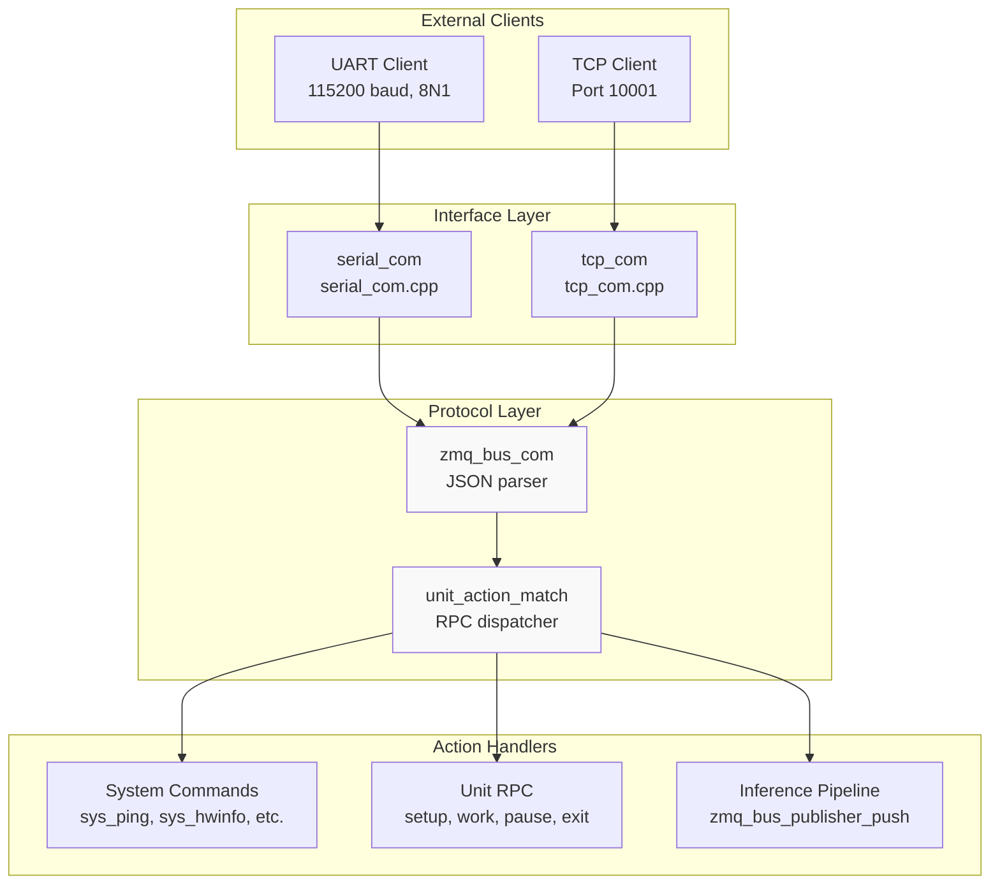
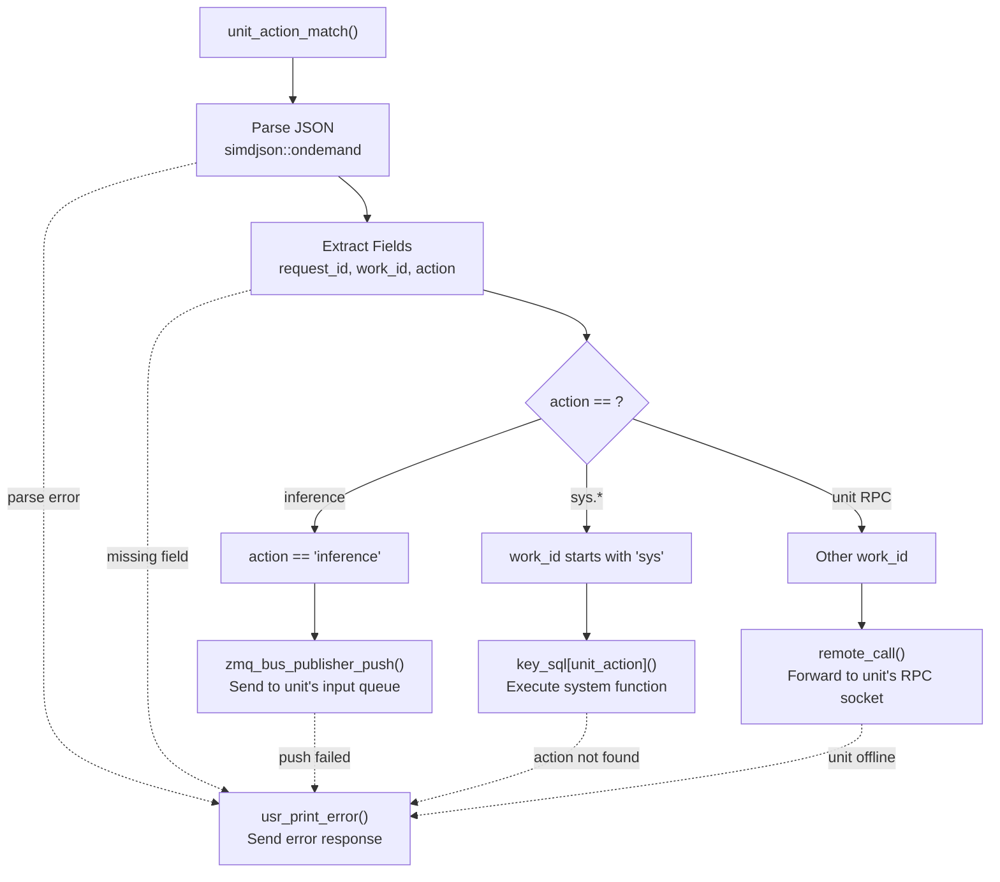

StackFlow API Reference

# API Reference

<details>
<summary>Relevant source files</summary>

The following files were used as context for generating this wiki page:

- [ext_components/StackFlow/stackflow/pzmq.hpp](ext_components/StackFlow/stackflow/pzmq.hpp)
- [ext_components/ax_msp/Kconfig](ext_components/ax_msp/Kconfig)
- [projects/llm_framework/SConstruct](projects/llm_framework/SConstruct)
- [projects/llm_framework/config_defaults.mk](projects/llm_framework/config_defaults.mk)
- [projects/llm_framework/main_sys/include/zmq_bus.h](projects/llm_framework/main_sys/include/zmq_bus.h)
- [projects/llm_framework/main_sys/src/event_loop.cpp](projects/llm_framework/main_sys/src/event_loop.cpp)
- [projects/llm_framework/main_sys/src/serial_com.cpp](projects/llm_framework/main_sys/src/serial_com.cpp)
- [projects/llm_framework/main_sys/src/tcp_com.cpp](projects/llm_framework/main_sys/src/tcp_com.cpp)
- [projects/llm_framework/main_sys/src/zmq_bus.cpp](projects/llm_framework/main_sys/src/zmq_bus.cpp)

</details>


This page provides a comprehensive reference for the JSON RPC protocol and system APIs used to communicate with the StackFlow framework. The API enables external applications to control units, query system status, transfer files, and manage the framework lifecycle.

For information about configuring units and building pipelines, see [Configuration and Usage](#8). For details on creating custom units with RPC endpoints, see [Developer Guide](#10).

---

## Communication Architecture

The StackFlow framework exposes two external interfaces for JSON RPC communication:



**Communication Flow**: External clients connect via UART or TCP. Messages are parsed by `zmq_bus_com::select_json_str()`, which handles JSON framing and optional binary data encoding. The dispatcher `unit_action_match()` routes messages to the appropriate handler based on the `work_id` and `action` fields.

**Sources**: [projects/llm_framework/main_sys/src/serial_com.cpp:28-85](), [projects/llm_framework/main_sys/src/tcp_com.cpp:33-93](), [projects/llm_framework/main_sys/src/event_loop.cpp:770-843]()

---

## JSON Message Format

### Request Message Structure

All requests follow this JSON schema:

```json
{
  "request_id": "string",
  "work_id": "string",
  "action": "string",
  "data": "any",
  "object": "string (optional)"
}
```

| Field | Type | Required | Description |
|-------|------|----------|-------------|
| `request_id` | string | Yes | Unique identifier for request-response correlation |
| `work_id` | string | Yes | Target unit identifier (e.g., "sys", "asr", "llm") |
| `action` | string | Yes | RPC action to invoke (e.g., "setup", "ping", "inference") |
| `data` | any | No | Action-specific payload (string, object, or omitted) |
| `object` | string | No | Extended action specifier for file operations and streaming |

**Sources**: [projects/llm_framework/main_sys/src/event_loop.cpp:781-802]()

### Response Message Structure

Responses follow this standardized format:

```json
{
  "request_id": "string",
  "work_id": "string",
  "created": 1234567890,
  "object": "string",
  "data": "any",
  "error": {
    "code": 0,
    "message": "string"
  }
}
```

| Field | Type | Description |
|-------|------|-------------|
| `request_id` | string | Echoed from request for correlation |
| `work_id` | string | Source unit that generated the response |
| `created` | integer | Unix timestamp of response creation |
| `object` | string | Data type descriptor (e.g., "sys.utf-8", "asr.utf-8.stream") |
| `data` | any | Response payload (type depends on `object`) |
| `error.code` | integer | Error code (0 = success, negative = error) |
| `error.message` | string | Human-readable error description |

**Common Error Codes**:
- `0`: Success
- `-1`: General error / receive reset
- `-2`: JSON format error
- `-3`: Action match failure (unknown action)
- `-4`: Inference data push failure
- `-9`: Unit call failure
- `-10`: Feature not available
- `-17`: File operation error

**Sources**: [projects/llm_framework/main_sys/src/event_loop.cpp:44-74](), [projects/llm_framework/main_sys/src/event_loop.cpp:778-843]()

---

## RPC Dispatcher Flow



**Dispatch Logic**: The `unit_action_match()` function at [projects/llm_framework/main_sys/src/event_loop.cpp:770-843]() implements the core routing logic:
1. **Inference Actions**: When `action == "inference"`, the message is pushed to the unit's ZMQ input queue via `zmq_bus_publisher_push()`
2. **System Commands**: When `work_id` starts with "sys", the action is looked up in the `key_sql` map and executed directly
3. **Unit RPCs**: For other `work_id` values, the message is forwarded to the unit's RPC socket via `remote_call()`

**Sources**: [projects/llm_framework/main_sys/src/event_loop.cpp:815-843]()

---

## System Commands Reference

System commands use `work_id: "sys"` and are registered in [projects/llm_framework/main_sys/src/event_loop.cpp:743-762](). All system commands follow the pattern `sys.<action>`.

### Core System Commands

| Command | Description | Request Data | Response Object |
|---------|-------------|--------------|-----------------|
| `sys.ping` | Health check | None | None (error.code=0) |
| `sys.version` | Get framework version | None | `sys.utf-8` (string) |
| `sys.version2` | List installed binaries | None | `sys.utf-8.stream` (array) |
| `sys.hwinfo` | Hardware status | None | `sys.hwinfo` (object) |
| `sys.cmminfo` | CMM memory info | None | `sys.cmminfo` (object) |
| `sys.reboot` | Reboot device | None | None |
| `sys.reset` | Restart services | None | None |

**Sources**: [projects/llm_framework/main_sys/src/event_loop.cpp:76-81](), [projects/llm_framework/main_sys/src/event_loop.cpp:128-196](), [projects/llm_framework/main_sys/src/event_loop.cpp:696-741]()

### sys.ping

Minimal health check to verify connectivity.

**Request**:
```json
{
  "request_id": "1",
  "work_id": "sys",
  "action": "ping"
}
```

**Response**:
```json
{
  "request_id": "1",
  "work_id": "sys",
  "created": 1234567890,
  "object": "None",
  "data": "None",
  "error": {"code": 0, "message": ""}
}
```

**Sources**: [projects/llm_framework/main_sys/src/event_loop.cpp:76-81]()

### sys.hwinfo

Retrieves hardware metrics including CPU load, memory usage, temperature, and network interfaces.

**Request**:
```json
{
  "request_id": "2",
  "work_id": "sys",
  "action": "hwinfo"
}
```

**Response**:
```json
{
  "request_id": "2",
  "work_id": "sys",
  "created": 1234567890,
  "object": "sys.hwinfo",
  "data": {
    "temperature": 45000,
    "cpu_loadavg": 35,
    "mem": 42,
    "eth_info": [
      {"name": "eth0", "ip": "192.168.1.100", "speed": "1000"}
    ]
  },
  "error": {"code": 0, "message": ""}
}
```

**Data Fields**:
- `temperature`: CPU temperature in millidegrees Celsius
- `cpu_loadavg`: CPU load percentage (0-100)
- `mem`: Memory usage percentage (0-100)
- `eth_info`: Array of network interface objects

**Sources**: [projects/llm_framework/main_sys/src/event_loop.cpp:128-196]()

### sys.cmminfo

Queries AXERA CMM (Contiguous Memory Manager) status for NPU memory pools.

**Request**:
```json
{
  "request_id": "3",
  "work_id": "sys",
  "action": "cmminfo"
}
```

**Response**:
```json
{
  "request_id": "3",
  "work_id": "sys",
  "created": 1234567890,
  "object": "sys.cmminfo",
  "data": {
    "total": 524288,
    "used": 262144,
    "remain": 262144
  },
  "error": {"code": 0, "message": ""}
}
```

**Data Fields**: All values in KB
- `total`: Total CMM pool size
- `used`: Currently allocated memory
- `remain`: Available memory

**Sources**: [projects/llm_framework/main_sys/src/event_loop.cpp:265-291]()

### sys.lsmode

Lists available configuration modes (JSON files in `/opt/m5stack/data/models/`).

**Request**:
```json
{
  "request_id": "4",
  "work_id": "sys",
  "action": "lsmode"
}
```

**Response**:
```json
{
  "request_id": "4",
  "work_id": "sys",
  "created": 1234567890,
  "object": "sys.lsmode",
  "data": [
    {"mode_name": "voice_assistant", "description": "..."},
    {"mode_name": "vision_qa", "description": "..."}
  ],
  "error": {"code": 0, "message": ""}
}
```

**Sources**: [projects/llm_framework/main_sys/src/event_loop.cpp:293-351]()

### sys.version and sys.version2

**sys.version** returns the framework version string:
```json
{
  "request_id": "5",
  "work_id": "sys",
  "action": "version"
}
```
Response: `{"data": "v1.6", ...}`

**sys.version2** lists all installed binaries matching pattern `/opt/m5stack/bin/llm_*-*`:
```json
{
  "request_id": "6",
  "work_id": "sys",
  "action": "version2"
}
```
Response: `{"data": ["llm_asr-v1.0.0", "llm_llm-v1.2.0", ...], ...}`

**Sources**: [projects/llm_framework/main_sys/src/event_loop.cpp:708-732]()

---

## File Transfer Operations

StackFlow provides bidirectional file transfer with optional base64 encoding and streaming support.

### File Transfer Protocol Patterns

The `object` field encodes transfer options:

| Pattern | Description |
|---------|-------------|
| `sys.file.<path>` | Single-message text file transfer |
| `sys.stream.file.<path>` | Chunked text file transfer |
| `sys.base64.file.<path>` | Single-message binary file (base64) |
| `sys.base64.stream.file.<path>` | Chunked binary file (base64) |

**Path Requirements**: All paths must be absolute (start with `/`). Non-absolute paths return error code `-17`.

**Sources**: [projects/llm_framework/main_sys/src/event_loop.cpp:400-482](), [projects/llm_framework/main_sys/src/event_loop.cpp:484-540]()

### sys.push (Upload to Device)

Upload files to the device filesystem.

**Single-Message Upload**:
```json
{
  "request_id": "7",
  "work_id": "sys",
  "action": "push",
  "object": "sys.base64.file./tmp/test.bin",
  "data": "SGVsbG8gV29ybGQ="
}
```

**Streaming Upload**:
```json
{
  "request_id": "8",
  "work_id": "sys",
  "action": "push",
  "object": "sys.base64.stream.file./tmp/large.bin",
  "data": {
    "index": 0,
    "delta": "SGVsbG8=",
    "finish": false
  }
}
```

**Streaming Protocol**:
1. Send chunks with sequential `index` values
2. Set `finish: false` for all chunks except the last
3. Send final chunk with `finish: true` and empty `delta`
4. Server responds with SHA256 hash in final message

**Response** (final chunk):
```json
{
  "request_id": "8",
  "work_id": "sys",
  "created": 1234567890,
  "object": "None",
  "data": "None",
  "error": {
    "code": 0,
    "message": "sha256:a1b2c3d4..."
  }
}
```

**Implementation Details**:
- Chunks are stored in `.tmp_file/` directory adjacent to target file
- After all chunks received, files are concatenated and optionally base64-decoded
- SHA256 checksum is computed and returned for verification

**Sources**: [projects/llm_framework/main_sys/src/event_loop.cpp:404-482]()

### sys.pull (Download from Device)

Download files from the device filesystem.

**Single-Message Download**:
```json
{
  "request_id": "9",
  "work_id": "sys",
  "action": "pull",
  "object": "sys.base64.file./tmp/test.bin"
}
```

**Response**:
```json
{
  "request_id": "9",
  "work_id": "sys",
  "created": 1234567890,
  "object": "sys.base64.stream",
  "data": "SGVsbG8gV29ybGQ=",
  "error": {"code": 0, "message": ""}
}
```

**Streaming Download**:
```json
{
  "request_id": "10",
  "work_id": "sys",
  "action": "pull",
  "object": "sys.base64.stream.file./opt/model.bin"
}
```

**Response** (multiple messages):
```json
{"request_id": "10", "data": {"index": 0, "delta": "...", "finish": false}, ...}
{"request_id": "10", "data": {"index": 1, "delta": "...", "finish": false}, ...}
{"request_id": "10", "data": {"index": 2, "delta": "", "finish": true}, ...}
```

**Chunk Size**: Configured by `config_sys_stream_length` parameter (default varies by implementation).

**Sources**: [projects/llm_framework/main_sys/src/event_loop.cpp:484-540]()

---

## Command Execution

### sys.bashexec

Execute bash commands on the device with optional streaming output.

**Simple Execution**:
```json
{
  "request_id": "11",
  "work_id": "sys",
  "action": "bashexec",
  "object": "sys.bashexec",
  "data": "ls -la /opt/m5stack"
}
```

**Response**:
```json
{
  "request_id": "11",
  "work_id": "sys",
  "created": 1234567890,
  "object": "sys.utf-8",
  "data": "total 128\ndrwxr-xr-x...",
  "error": {"code": 0, "message": ""}
}
```

**Streaming Execution**:
```json
{
  "request_id": "12",
  "work_id": "sys",
  "action": "bashexec",
  "object": "sys.bashexec.stream",
  "data": {
    "index": 0,
    "delta": "apt-get update && apt-get upgrade -y",
    "finish": true
  }
}
```

**Streaming Response**:
```json
{"request_id": "12", "data": {"index": 0, "delta": "Reading package lists...", "finish": false}, ...}
{"request_id": "12", "data": {"index": 1, "delta": "Building dependency tree...", "finish": false}, ...}
{"request_id": "12", "data": {"index": 2, "delta": "", "finish": true}, ...}
```

**Security Notes**:
- Commands execute in `/bin/bash` environment
- STDOUT and STDERR are merged
- Terminal echo is disabled
- Process is killed after completion

**Sources**: [projects/llm_framework/main_sys/src/event_loop.cpp:593-694]()

---

## Package Management

### sys.update

List available update packages on mounted filesystems.

**Request**:
```json
{
  "request_id": "13",
  "work_id": "sys",
  "action": "update"
}
```

**Response**:
```json
{
  "request_id": "13",
  "work_id": "sys",
  "created": 1234567890,
  "object": "sys.utf-8",
  "data": "/mnt/usb/llm_update_v1.7.deb\n/mnt/sd/llm_update_v1.7.deb",
  "error": {"code": 0, "message": ""}
}
```

**Sources**: [projects/llm_framework/main_sys/src/event_loop.cpp:542-565]()

### sys.upgrade

Install update packages matching a version pattern.

**Request**:
```json
{
  "request_id": "14",
  "work_id": "sys",
  "action": "upgrade",
  "data": "llm_update_v1.7.deb"
}
```

**Response**:
```json
{
  "request_id": "14",
  "work_id": "sys",
  "created": 1234567890,
  "object": "sys.utf-8.stream",
  "data": "update ...",
  "error": {"code": 0, "message": ""}
}
```

**Behavior**:
- Creates lock file `/var/llm_update.lock`
- Searches `/mnt` for matching `.deb` files
- Installs via `dpkg -i`
- Logs to `/var/llm_update.log`
- Process runs asynchronously in background

**Sources**: [projects/llm_framework/main_sys/src/event_loop.cpp:567-591]()

### sys.rmmode

Uninstall a mode package.

**Request**:
```json
{
  "request_id": "15",
  "work_id": "sys",
  "action": "rmmode",
  "data": "vision-qa"
}
```

**Command Executed**: `dpkg -P llm-{mode_name}`

**Sources**: [projects/llm_framework/main_sys/src/event_loop.cpp:353-360]()

---

## Service Control

### sys.reset

Restart all LLM services without rebooting the device.

**Request**:
```json
{
  "request_id": "16",
  "work_id": "sys",
  "action": "reset"
}
```

**Response**:
```json
{
  "request_id": "16",
  "work_id": "sys",
  "created": 1234567890,
  "object": "None",
  "data": "None",
  "error": {"code": 0, "message": "llm server restarting ..."}
}
```

**Command Executed**: `systemctl restart llm-*` (all services matching pattern)

**Lock File**: `/tmp/llm_reset.lock` created to track restart state

**Sources**: [projects/llm_framework/main_sys/src/event_loop.cpp:696-706]()

### sys.reboot

Reboot the entire device.

**Request**:
```json
{
  "request_id": "17",
  "work_id": "sys",
  "action": "reboot"
}
```

**Response**:
```json
{
  "request_id": "17",
  "work_id": "sys",
  "created": 1234567890,
  "object": "None",
  "data": "None",
  "error": {"code": 0, "message": "rebooting ..."}
}
```

**Behavior**: Waits 200ms after sending response, then executes `reboot` command.

**Sources**: [projects/llm_framework/main_sys/src/event_loop.cpp:734-741]()

### sys.uartsetup

Reconfigure UART communication parameters.

**Request**:
```json
{
  "request_id": "18",
  "work_id": "sys",
  "action": "uartsetup",
  "data": {
    "baud": 115200,
    "data_bits": 8,
    "stop_bits": 1,
    "parity": 0
  }
}
```

**Response**:
```json
{
  "request_id": "18",
  "work_id": "sys",
  "created": 1234567890,
  "object": "None",
  "data": "None",
  "error": {"code": 0, "message": ""}
}
```

**Behavior**: 
- Saves new configuration to database
- Waits 100ms
- Stops and restarts UART interface with new parameters

**Sources**: [projects/llm_framework/main_sys/src/event_loop.cpp:83-101]()

---

## Unit Management API

Unit management commands control the lifecycle and configuration of individual AI units (ASR, LLM, TTS, etc.). These commands use the unit's `work_id` instead of "sys".

### Standard Unit RPC Functions

All units inheriting from `StackFlow` base class expose these seven standard RPC functions:

| Action | Description | Required Data |
|--------|-------------|---------------|
| `setup` | Initialize unit with configuration | JSON configuration object |
| `work` | Start processing (wake up) | None or empty object |
| `pause` | Pause processing (sleep) | None or empty object |
| `exit` | Shutdown unit | None |
| `link` | Subscribe to another unit's output | `{"name": "publisher_work_id"}` |
| `unlink` | Unsubscribe from output | `{"name": "publisher_work_id"}` |
| `taskinfo` | Query unit status | None |

**Sources**: For detailed documentation of these functions, see [Unit Management API](#9.2)

### sys.unit_call (Proxy RPC)

The `sys.unit_call` command provides a way to invoke unit RPC functions indirectly through the system controller.

**Request**:
```json
{
  "request_id": "19",
  "work_id": "sys",
  "action": "unit_call",
  "object": "asr.setup",
  "data": {
    "model": "sherpa-onnx-streaming-zipformer",
    "enkws": true
  }
}
```

**Response**:
```json
{
  "request_id": "19",
  "work_id": "sys",
  "created": 1234567890,
  "object": "asr.setup",
  "data": {"status": "ok"},
  "error": {"code": 0, "message": ""}
}
```

**Implementation**: 
- Parses `object` field as `{work_id}.{action}`
- Forwards request to unit's RPC socket via `unit_call()`
- Returns unit's response to caller

**Sources**: [projects/llm_framework/main_sys/src/event_loop.cpp:198-227]()

---

## Inter-Unit Communication Patterns

Units communicate via ZeroMQ PUB/SUB sockets for data streaming. This section documents the messaging patterns for inference and data flow.

### Message Routing Architecture


**Message Flow**:
1. Client sends inference request with `action: "inference"` and `work_id: "asr"`
2. System dispatcher calls `zmq_bus_publisher_push()` to publish to unit's input queue
3. Unit's subscriber thread receives message via ZMQ_SUB socket
4. Unit processes data and publishes results to its output socket
5. Linked downstream units receive output via their SUB sockets

**Sources**: [projects/llm_framework/main_sys/src/event_loop.cpp:815-829](), [projects/llm_framework/main_sys/src/zmq_bus.cpp:160-175]()

### Inference Message Format

When `action: "inference"`, the system adds internal routing information:

**Client Request**:
```json
{
  "request_id": "20",
  "work_id": "asr",
  "action": "inference",
  "data": "audio data or text"
}
```

**Internal Message** (sent to unit):
```json
{
  "zmq_com": "ipc:///tmp/llm/zmq_s_8000",
  "request_id": "20",
  "work_id": "asr",
  "action": "inference",
  "data": "audio data or text"
}
```

**Field Explanation**:
- `zmq_com`: Response socket address for unit to send results back
- Original fields are preserved
- Unit publishes output with `object` field indicating data type

**Sources**: [projects/llm_framework/main_sys/src/event_loop.cpp:815-829]()

### Output Object Types

Units publish results with `object` field specifying data type and streaming mode:

| Object Pattern | Description | Example |
|----------------|-------------|---------|
| `{unit}.utf-8` | Complete UTF-8 text | `asr.utf-8` |
| `{unit}.utf-8.stream` | Streaming UTF-8 tokens | `llm.utf-8.stream` |
| `{unit}.raw` | Raw binary data | `camera.raw` |
| `{unit}.base64` | Base64-encoded binary | `camera.base64` |
| `{unit}.json` | Structured JSON data | `yolo.boxV2` |
| `sys.pcm` | Audio PCM samples | Audio pipeline |

**Streaming Protocol**:
```json
{"object": "llm.utf-8.stream", "data": {"index": 0, "delta": "Hello", "finish": false}}
{"object": "llm.utf-8.stream", "data": {"index": 1, "delta": " world", "finish": false}}
{"object": "llm.utf-8.stream", "data": {"index": 2, "delta": "", "finish": true}}
```

**Sources**: For detailed streaming patterns, see [Inter-Unit Communication Patterns](#9.4)

---

## Transport-Level Protocol Details

### JSON Framing

The `zmq_bus_com::select_json_str()` parser handles JSON message framing by tracking brace depth:

**Algorithm**:
1. Accumulate characters until balanced braces `{}` detected
2. Extract complete JSON object
3. Check for special prefixes: `{"RAW":...}` or `{"BON":...}`
4. If prefix found, switch to binary mode and read N bytes
5. For RAW: base64-encode binary data and inject into JSON
6. For BON: convert BSON to JSON

**NEON Optimization**: On ARM platforms, uses SIMD instructions to scan for `{` and `}` characters in 16-byte chunks.

**Sources**: [projects/llm_framework/main_sys/src/zmq_bus.cpp:196-300]()

### Binary Data Protocol

For large binary payloads (images, audio, models), StackFlow supports an optimized protocol:

**Request with Binary Data**:
```
{"RAW":1024}
<1024 bytes of raw binary data>
```

**Server Processing**:
1. Parser detects `{"RAW":N}` prefix
2. Reads exactly N bytes into buffer
3. Base64-encodes data
4. Injects as `"data"` field in original JSON
5. Routes as normal JSON message

**BSON Support**: Similar protocol with `{"BON":N}` prefix for BSON-encoded payloads (requires `ENABLE_BSON` compile flag).

**Sources**: [projects/llm_framework/main_sys/src/zmq_bus.cpp:89-110](), [projects/llm_framework/main_sys/src/zmq_bus.cpp:264-295]()

### ZeroMQ Socket Configuration

The `pzmq` wrapper provides standardized socket configuration:

**Reconnection Settings**:
- `ZMQ_RECONNECT_IVL`: 100ms
- `ZMQ_RECONNECT_IVL_MAX`: 1000ms (1 second)

**Timeouts**:
- Send timeout: 3000ms (default, configurable via `set_timeout()`)
- Receive timeout: 3000ms (default)

**Socket Types by Role**:
- **Publishers**: `ZMQ_PUB` with `bind()` to IPC/TCP endpoint
- **Subscribers**: `ZMQ_SUB` with `connect()` and empty filter (`""`)
- **RPC Servers**: `ZMQ_REP` with `bind()`
- **RPC Clients**: `ZMQ_REQ` with `connect()`
- **Task Distributors**: `ZMQ_PUSH` with `connect()`
- **Task Collectors**: `ZMQ_PULL` with `bind()`

**Sources**: [ext_components/StackFlow/stackflow/pzmq.hpp:240-268]()

---

## Error Handling Reference

### Standard Error Response Format

All errors follow this structure:

```json
{
  "request_id": "...",
  "work_id": "...",
  "created": 1234567890,
  "object": "None",
  "data": "None",
  "error": {
    "code": -2,
    "message": "json format error"
  }
}
```

### Error Code Table

| Code | Meaning | Common Causes | Resolution |
|------|---------|---------------|------------|
| `0` | Success | N/A | N/A |
| `-1` | General error | Unexpected exception | Check logs, retry |
| `-2` | JSON format error | Malformed JSON, missing fields | Validate JSON syntax |
| `-3` | Action match false | Unknown action name | Check action spelling |
| `-4` | Inference push false | Unit not initialized | Setup unit first |
| `-9` | Unit call false | Unit offline or crashed | Check unit status |
| `-10` | Not available | Feature disabled | Check compilation flags |
| `-17` | File operation error | Path error, permissions | Verify path and access |

**Sources**: [projects/llm_framework/main_sys/src/event_loop.cpp:44-56](), [projects/llm_framework/main_sys/src/event_loop.cpp:778-843]()

### Connection Status Codes

When UART or TCP connections are established/terminated, the system sends notification messages:

**Connection Error** (framing failure):
```json
{
  "request_id": "0",
  "work_id": "sys",
  "created": 1234567890,
  "error": {"code": -1, "message": "reace reset"}
}
```

**Update Complete** (after `sys.upgrade`):
```json
{
  "request_id": "0",
  "work_id": "sys",
  "created": 1234567890,
  "error": {"code": 0, "message": "upgrade over"}
}
```

**Reset Complete** (after `sys.reset`):
```json
{
  "request_id": "0",
  "work_id": "sys",
  "created": 1234567890,
  "error": {"code": 0, "message": "reset over"}
}
```

**Sources**: [projects/llm_framework/main_sys/src/serial_com.cpp:59-68](), [projects/llm_framework/main_sys/src/serial_com.cpp:104-121]()

---

## Client Implementation Examples

### Python Client (UART)

```python
import serial
import json
import time

class StackFlowClient:
    def __init__(self, port='/dev/ttyUSB0', baudrate=115200):
        self.ser = serial.Serial(port, baudrate, timeout=1)
        self.request_counter = 0
    
    def send_request(self, work_id, action, data=None, object_type=None):
        self.request_counter += 1
        request = {
            "request_id": str(self.request_counter),
            "work_id": work_id,
            "action": action
        }
        if data is not None:
            request["data"] = data
        if object_type is not None:
            request["object"] = object_type
        
        message = json.dumps(request) + '\n'
        self.ser.write(message.encode('utf-8'))
    
    def receive_response(self):
        response = ""
        brace_count = 0
        while True:
            char = self.ser.read(1).decode('utf-8')
            if char == '{':
                brace_count += 1
            elif char == '}':
                brace_count -= 1
            response += char
            if brace_count == 0 and len(response) > 0:
                return json.loads(response)
    
    def ping(self):
        self.send_request("sys", "ping")
        return self.receive_response()
    
    def get_hwinfo(self):
        self.send_request("sys", "hwinfo")
        return self.receive_response()

# Usage
client = StackFlowClient()
print(client.ping())
print(client.get_hwinfo())
```

### Python Client (TCP)

```python
import socket
import json

class StackFlowTCPClient:
    def __init__(self, host='192.168.1.100', port=10001):
        self.sock = socket.socket(socket.AF_INET, socket.SOCK_STREAM)
        self.sock.connect((host, port))
        self.request_counter = 0
    
    def send_request(self, work_id, action, data=None):
        self.request_counter += 1
        request = {
            "request_id": str(self.request_counter),
            "work_id": work_id,
            "action": action,
            "data": data
        }
        message = json.dumps(request)
        self.sock.sendall(message.encode('utf-8'))
    
    def receive_response(self):
        response = ""
        brace_count = 0
        while True:
            chunk = self.sock.recv(1024).decode('utf-8')
            for char in chunk:
                if char == '{':
                    brace_count += 1
                elif char == '}':
                    brace_count -= 1
                response += char
                if brace_count == 0 and len(response) > 0:
                    return json.loads(response)
    
    def setup_unit(self, work_id, config):
        self.send_request(work_id, "setup", config)
        return self.receive_response()

# Usage
client = StackFlowTCPClient()
response = client.setup_unit("asr", {
    "model": "sherpa-onnx-streaming-zipformer",
    "enkws": True
})
```

---

## API Reference Summary

This page documented the complete JSON RPC API for StackFlow:

**Core Concepts**:
- JSON-based request/response protocol over UART (115200 baud) and TCP (port 10001)
- Three message routing paths: system commands, unit RPC, and inference pipeline
- Standardized response format with error codes and object type descriptors

**Key Components**:
- `unit_action_match()`: Central RPC dispatcher [projects/llm_framework/main_sys/src/event_loop.cpp:770-843]()
- `zmq_bus_com::select_json_str()`: JSON framing parser [projects/llm_framework/main_sys/src/zmq_bus.cpp:196-300]()
- `pzmq`: ZeroMQ wrapper for socket management [ext_components/StackFlow/stackflow/pzmq.hpp]()

**Command Categories**:
- **System Status**: `sys.ping`, `sys.hwinfo`, `sys.cmminfo`, `sys.version`
- **File Transfer**: `sys.push`, `sys.pull` with base64 and streaming support
- **Command Execution**: `sys.bashexec` with real-time output streaming
- **Package Management**: `sys.lsmode`, `sys.rmmode`, `sys.update`, `sys.upgrade`
- **Service Control**: `sys.reset`, `sys.reboot`, `sys.uartsetup`
- **Unit Management**: `setup`, `work`, `pause`, `exit`, `link`, `unlink`, `taskinfo`

For practical usage examples, see [Configuration and Usage](#8). For implementing custom RPC endpoints, see [Developer Guide](#10).