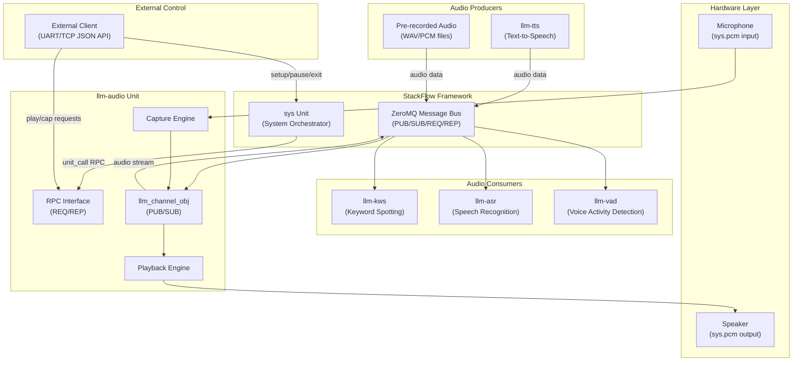
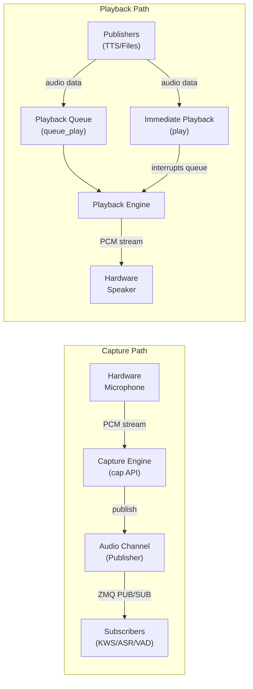
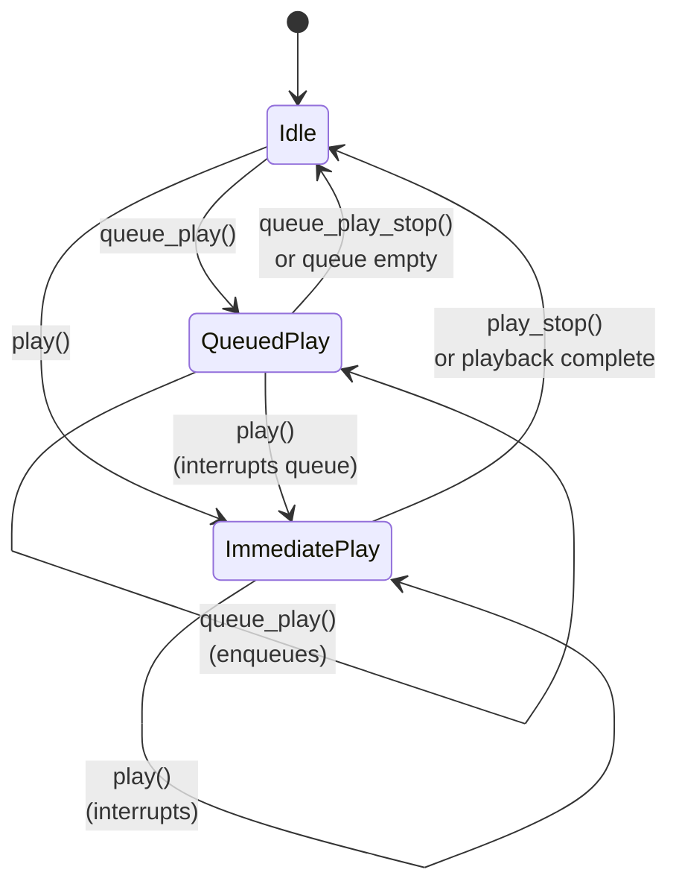
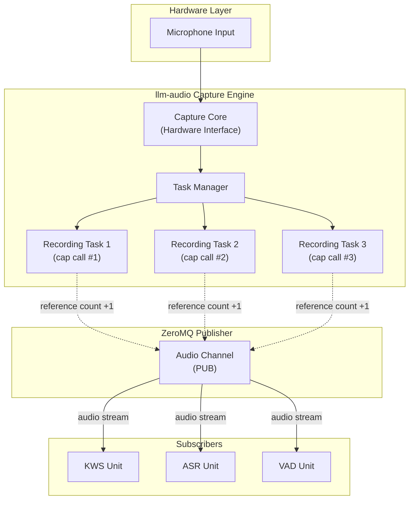
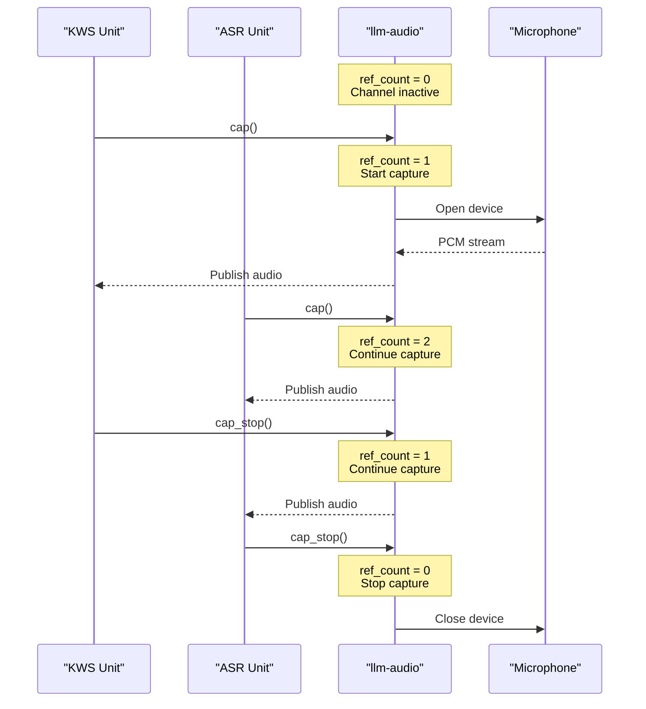
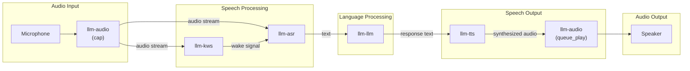
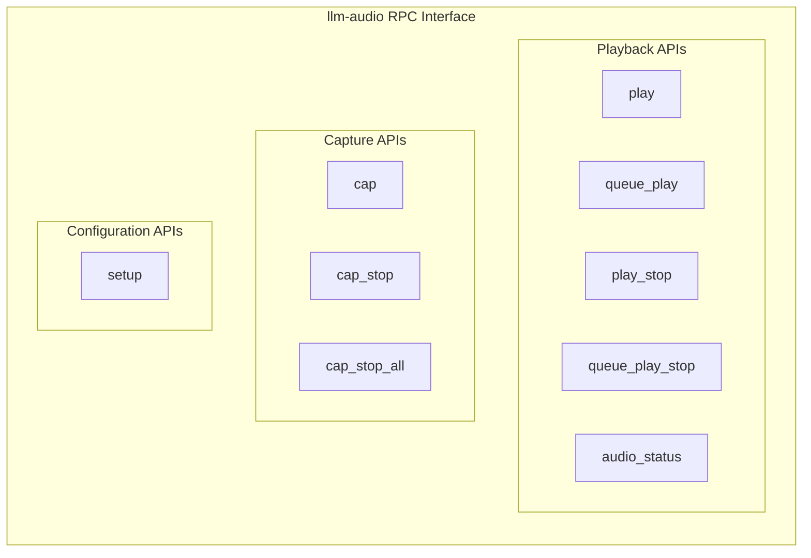

StackFlow Audio I/O (llm-audio)

# Audio I/O (llm-audio)

<details>
<summary>Relevant source files</summary>

The following files were used as context for generating this wiki page:

- [projects/llm_framework/main_audio/SConstruct](projects/llm_framework/main_audio/SConstruct)
- [projects/llm_framework/main_audio/src/main.cpp](projects/llm_framework/main_audio/src/main.cpp)

</details>


## Purpose and Scope

The `llm-audio` unit provides system-level audio input and output capabilities for the StackFlow framework. It serves as the foundational audio interface that handles both playback of synthesized or pre-recorded audio and capture of microphone input for speech processing. This unit acts as the audio endpoint for other audio processing units within the system.

For speech processing capabilities that consume the audio captured by this unit, see [Keyword Spotting (llm-kws)](#3.1.2), [Speech Recognition (llm-asr)](#3.1.3). For speech synthesis that produces audio played through this unit, see [Text-to-Speech (llm-tts)](#3.1.4).

**Sources:** [doc/projects_llm_framework_doc/llm_audio_en.md:1-3](), [doc/projects_llm_framework_doc/llm_audio_zh.md:1-3]()

---

## Overview

The `llm-audio` unit is a StackFlow service unit that manages audio streams on embedded Linux platforms. It provides two primary functions:

1. **Audio Playback**: Outputting audio to system speakers with support for immediate playback and queued playback modes
2. **Audio Capture**: Recording audio from system microphones for downstream processing by ASR, KWS, and other speech units

This unit operates as a managed StackFlow unit and communicates with other units via the ZeroMQ message bus using the standard StackFlow RPC protocol.

**Sources:** [doc/projects_llm_framework_doc/llm_audio_en.md:1-16](), [doc/projects_llm_framework_doc/llm_audio_zh.md:1-16]()

---

## Architecture and Integration

### Position in StackFlow Ecosystem



**Figure 1: llm-audio Integration within StackFlow**

The `llm-audio` unit sits at the boundary between the StackFlow software layer and the physical audio hardware. It receives control commands via RPC (for lifecycle management and API calls) and participates in data streaming via the ZeroMQ PUB/SUB channels (for audio data distribution to/from other units).

**Sources:** [doc/projects_llm_framework_doc/llm_audio_en.md:1-16]()

### Data Flow Model



**Figure 2: Audio Data Flow Paths**

The unit maintains two independent data paths:
- **Capture Path**: Hardware microphone → Capture engine → ZeroMQ publisher → Consuming units
- **Playback Path**: Producing units → Playback engine (via queue or immediate mode) → Hardware speaker

**Sources:** [doc/projects_llm_framework_doc/llm_audio_en.md:5-16]()

---

## Playback API

The playback subsystem provides both immediate and queued playback modes to accommodate different use cases.

### API Functions

| Function | Purpose | Behavior |
|----------|---------|----------|
| `play` | Immediate playback | Interrupts any currently playing audio and starts playing the new audio immediately |
| `queue_play` | Queued playback | Adds audio to the playback queue; audio plays in sequence without interruption |
| `play_stop` | Stop immediate playback | Halts the currently playing audio (immediate mode) |
| `queue_play_stop` | Clear playback queue | Removes all audio from the playback queue |
| `audio_status` | Query playback status | Returns the current state of the playback engine |

**Sources:** [doc/projects_llm_framework_doc/llm_audio_en.md:7-11](), [doc/projects_llm_framework_doc/llm_audio_zh.md:7-11]()

### Playback Modes



**Figure 3: Playback State Machine**

The playback engine maintains two operational modes:
- **Immediate Play Mode**: Triggered by `play()`, interrupts any ongoing playback
- **Queued Play Mode**: Triggered by `queue_play()`, maintains a FIFO queue of audio segments

A call to `play()` will interrupt queued playback and switch to immediate mode, allowing for priority audio (e.g., error notifications) to override background music or other queued content.

**Sources:** [doc/projects_llm_framework_doc/llm_audio_en.md:7-11]()

### Common Use Cases

**Scenario 1: TTS Output**
```
TTS Unit generates speech → queue_play() → Plays through speaker
```

**Scenario 2: Alert Sound (High Priority)**
```
System alert → play() → Interrupts any ongoing playback
```

**Scenario 3: Background Music with Announcements**
```
Music playing via queue_play() → Alert arrives via play() → Music interrupted → 
Alert plays → Alert completes → Music not resumed (queue cleared by interruption)
```

**Sources:** [doc/projects_llm_framework_doc/llm_audio_en.md:7-11]()

---

## Recording API

The recording subsystem supports multiple concurrent recording tasks, enabling different units to capture audio simultaneously without interference.

### API Functions

| Function | Purpose | Behavior |
|----------|---------|----------|
| `cap` | Start recording task | Begins a new recording session; can be called multiple times for concurrent tasks |
| `cap_stop` | Stop recording task | Stops a specific recording session; last call stops channel data output |
| `cap_stop_all` | Force stop all recording | Immediately terminates all active recording tasks and stops channel output |
| `setup` | Configure recording parameters | Sets capture configuration (sample rate, format, channels, etc.) |

**Sources:** [doc/projects_llm_framework_doc/llm_audio_en.md:12-16](), [doc/projects_llm_framework_doc/llm_audio_zh.md:12-15]()

### Multi-Task Recording Model



**Figure 4: Multi-Task Recording Architecture**

The recording system uses a reference-counting mechanism:
- Each `cap()` call increments an internal reference count and creates a task
- Each `cap_stop()` call decrements the reference count
- When the reference count reaches zero, the audio channel stops publishing data
- `cap_stop_all()` immediately resets the reference count to zero

This design allows multiple units (e.g., KWS, ASR, and VAD) to independently request audio capture without interfering with each other.

**Sources:** [doc/projects_llm_framework_doc/llm_audio_en.md:12-15]()

### Recording Lifecycle



**Figure 5: Recording Task Reference Counting**

**Sources:** [doc/projects_llm_framework_doc/llm_audio_en.md:12-15]()

---

## Configuration

### Setup Parameters

The `setup` function configures the recording subsystem's operational parameters. While the specific parameters are not detailed in the available documentation, typical audio capture configuration includes:

- **Sample Rate**: Audio sampling frequency (e.g., 16000 Hz for speech)
- **Sample Format**: Bit depth and encoding (e.g., PCM 16-bit)
- **Channels**: Mono or stereo capture
- **Buffer Size**: Internal buffer configuration for latency vs. reliability trade-off

Configuration is applied through the standard StackFlow RPC interface and must be set before initiating capture operations.

**Sources:** [doc/projects_llm_framework_doc/llm_audio_en.md:16](), [doc/projects_llm_framework_doc/llm_audio_zh.md:15]()

---

## Integration with Other Units

### Voice Assistant Pipeline



**Figure 6: llm-audio in Voice Assistant Pipeline**

In the typical voice assistant workflow:
1. `llm-audio` captures microphone input and publishes to the ZMQ bus
2. Both KWS and ASR subscribe to this audio stream
3. After processing through LLM, TTS generates audio
4. `llm-audio` plays the TTS output through its queue_play mechanism

**Sources:** [doc/projects_llm_framework_doc/llm_audio_en.md:1-16]()

### Recommended Integration Pattern

For units that need to process audio:
1. Call `cap()` when audio input is needed
2. Subscribe to the audio channel via `llm_channel_obj`
3. Process received audio data
4. Call `cap_stop()` when audio input is no longer needed

For units that need to produce audio:
1. Generate or obtain audio data
2. Publish via StackFlow RPC to `llm-audio`'s `queue_play` API
3. Use `play()` for priority audio that should interrupt ongoing playback

**Sources:** [doc/projects_llm_framework_doc/llm_audio_en.md:7-15]()

---

## API Summary Reference

### Complete API List



**Figure 7: Complete RPC API Surface**

| API Category | Function | Primary Use Case |
|--------------|----------|------------------|
| Playback Control | `play` | Priority audio (alerts, notifications) |
| Playback Control | `queue_play` | Sequential audio (TTS, music) |
| Playback Control | `play_stop` | Cancel immediate playback |
| Playback Control | `queue_play_stop` | Clear queued audio |
| Playback Status | `audio_status` | Query playback state |
| Capture Control | `cap` | Start audio input for processing |
| Capture Control | `cap_stop` | Stop audio input task |
| Capture Control | `cap_stop_all` | Emergency stop all recording |
| Configuration | `setup` | Configure capture parameters |

**Sources:** [doc/projects_llm_framework_doc/llm_audio_en.md:5-16](), [doc/projects_llm_framework_doc/llm_audio_zh.md:5-15]()