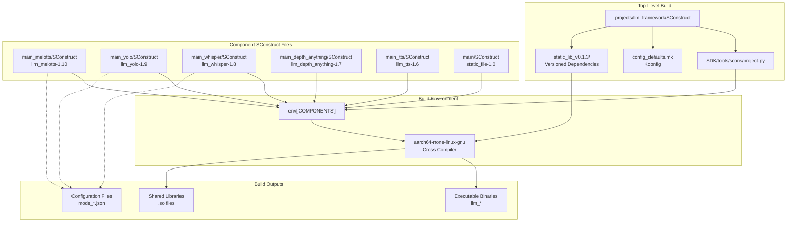
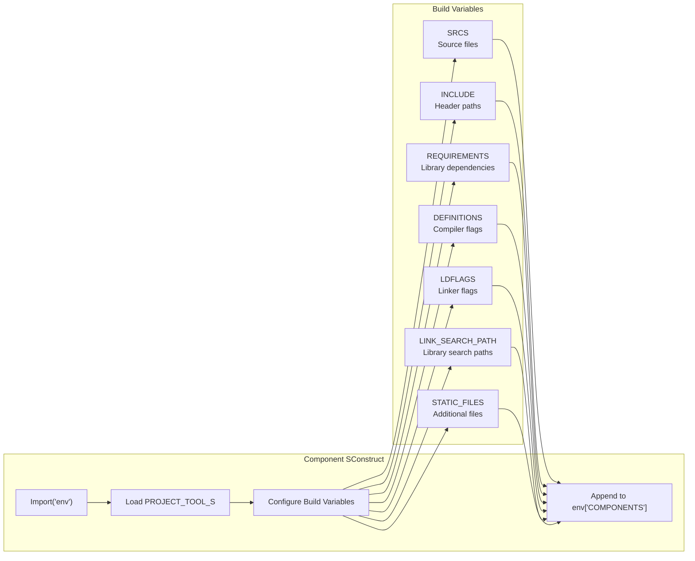
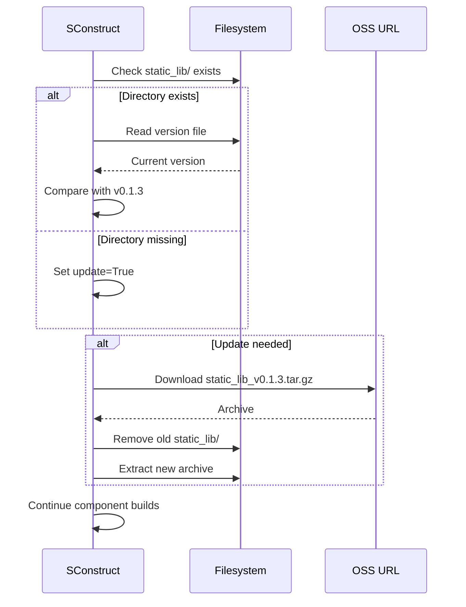
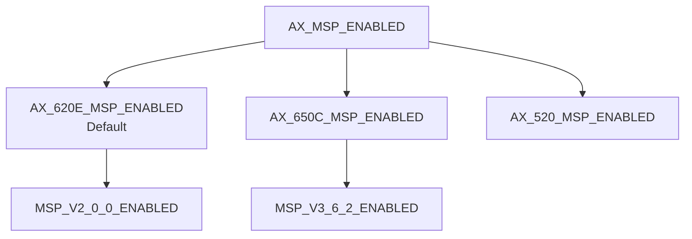

StackFlow Build System

# Build System

<details>
<summary>Relevant source files</summary>

The following files were used as context for generating this wiki page:

- [ext_components/StackFlow/stackflow/pzmq.hpp](ext_components/StackFlow/stackflow/pzmq.hpp)
- [ext_components/ax_msp/Kconfig](ext_components/ax_msp/Kconfig)
- [projects/llm_framework/SConstruct](projects/llm_framework/SConstruct)
- [projects/llm_framework/config_defaults.mk](projects/llm_framework/config_defaults.mk)
- [projects/llm_framework/main/SConstruct](projects/llm_framework/main/SConstruct)
- [projects/llm_framework/main_depth_anything/SConstruct](projects/llm_framework/main_depth_anything/SConstruct)
- [projects/llm_framework/main_melotts/SConstruct](projects/llm_framework/main_melotts/SConstruct)
- [projects/llm_framework/main_tts/SConstruct](projects/llm_framework/main_tts/SConstruct)
- [projects/llm_framework/main_whisper/SConstruct](projects/llm_framework/main_whisper/SConstruct)
- [projects/llm_framework/main_yolo/SConstruct](projects/llm_framework/main_yolo/SConstruct)

</details>


This document describes the SCons-based build system used to compile the StackFlow LLM Framework. The build system manages component compilation, dependency resolution, static library versioning, and cross-compilation for ARM64 Linux targets.

For information about packaging and deployment of built artifacts, see [Packaging and Deployment](#7). For details on creating custom components, see [Creating Custom Units](#10.1).

## Overview

The StackFlow framework uses **SCons** (Software Construction tool) as its build system. The build infrastructure is organized around:

- **Component-based architecture**: Each AI unit (llm-melotts, llm-yolo, etc.) is a separate component with its own build configuration
- **Centralized tooling**: Build helper functions provided via `PROJECT_TOOL_S` script
- **Versioned dependencies**: Static libraries managed through versioned archives
- **Cross-compilation**: Targets ARM64 Linux using `aarch64-none-linux-gnu` toolchain

The build process produces:
- Executable binaries for each AI unit
- Shared library dependencies (`.so` files)
- Configuration files (`mode_*.json`)
- Static library packages

**Sources:** [projects/llm_framework/SConstruct:1-32](), [projects/llm_framework/config_defaults.mk:1-26]()

## Build Architecture



**Sources:** [projects/llm_framework/SConstruct:1-32](), [projects/llm_framework/main_melotts/SConstruct:1-49](), [projects/llm_framework/main_yolo/SConstruct:1-56]()

## Component Registration Pattern

Each component follows a standardized registration pattern where it appends a dictionary to `env['COMPONENTS']`. This pattern enables modular compilation where components are built independently and linked against shared dependencies.



**Component Dictionary Structure:**

| Key | Type | Purpose |
|-----|------|---------|
| `target` | string | Component name with version (e.g., `llm_melotts-1.10`) |
| `SRCS` | list | Source files to compile |
| `INCLUDE` | list | Public include directories |
| `PRIVATE_INCLUDE` | list | Private include directories |
| `REQUIREMENTS` | list | Required library names |
| `STATIC_LIB` | list | Static libraries to link |
| `DYNAMIC_LIB` | list | Dynamic libraries to link |
| `DEFINITIONS` | list | Compiler definitions and flags |
| `DEFINITIONS_PRIVATE` | list | Private compiler definitions |
| `LDFLAGS` | list | Linker flags |
| `LINK_SEARCH_PATH` | list | Library search paths |
| `STATIC_FILES` | list | Non-compiled files to include |
| `REGISTER` | string | Registration type (typically `'project'`) |

**Sources:** [projects/llm_framework/main_melotts/SConstruct:35-48](), [projects/llm_framework/main_yolo/SConstruct:42-55]()

## Common Build Patterns

### Source Collection

Components use the `append_srcs_dir()` helper function to collect source files:

```python
SRCS = append_srcs_dir(ADir('src'))
```

This recursively collects all `.c` and `.cpp` files in the `src/` directory.

**Sources:** [projects/llm_framework/main_melotts/SConstruct:8](), [projects/llm_framework/main_yolo/SConstruct:7]()

### Include Path Configuration

Include paths use the `ADir()` helper to create absolute paths:

```python
INCLUDE = [ADir('include'), ADir('.')]
INCLUDE += [ADir('../static_lib/include')]
```

**Sources:** [projects/llm_framework/main_melotts/SConstruct:9,26](), [projects/llm_framework/main_yolo/SConstruct:8,24]()

### Standard LDFLAGS Pattern

All components use a consistent rpath configuration for runtime library location:

```python
LDFLAGS += [
    '-Wl,-rpath=/opt/m5stack/lib',
    '-Wl,-rpath=/usr/local/m5stack/lib',
    '-Wl,-rpath=/usr/local/m5stack/lib/gcc-10.3',
    '-Wl,-rpath=/opt/lib',
    '-Wl,-rpath=/opt/usr/lib',
    '-Wl,-rpath=./'
]
```

This ensures executables can locate shared libraries at the standard installation paths.

**Sources:** [projects/llm_framework/main_melotts/SConstruct:21](), [projects/llm_framework/main_yolo/SConstruct:20]()

## Static Library Management

The top-level `SConstruct` manages versioned static libraries:



The static library versioning system ensures consistent dependencies across builds. When `version = 'v0.1.3'` is updated in the top-level `SConstruct`, the build system automatically downloads and extracts the new version.

**Download URL Pattern:**
```
https://m5stack.oss-cn-shenzhen.aliyuncs.com/resource/linux/llm/static_lib_{version}.tar.gz
```

**Sources:** [projects/llm_framework/SConstruct:8-31]()

## Dependency Types

### Component Requirements

Components declare library dependencies through the `REQUIREMENTS` list:

| Requirement | Type | Purpose |
|-------------|------|---------|
| `pthread` | System | Threading support |
| `utilities` | SDK Component | Utility functions |
| `ax_msp` | Hardware | AXERA board support package |
| `eventpp` | SDK Component | Event dispatching |
| `StackFlow` | Framework | StackFlow base classes |
| `ax_engine` | Hardware | AXERA NPU inference engine |
| `ax_interpreter` | Hardware | AXERA model interpreter |
| `ax_sys` | Hardware | AXERA system API |
| `onnxruntime` | AI Library | ONNX model runtime |
| `samplerate` | Audio | Audio resampling |
| `glog`, `fst` | Utility | Logging and FST operations |

**Sources:** [projects/llm_framework/main_melotts/SConstruct:11,23-24,29,31](), [projects/llm_framework/main_yolo/SConstruct:10,22]()

### Static vs Dynamic Libraries

**Dynamic Libraries (Shared Objects):**
Components reference pre-built `.so` files from the static library directory:

```python
STATIC_FILES += [
    AFile('../static_lib/sherpa/ncnn/libsherpa-ncnn-core.so'),
    AFile('../static_lib/sherpa/ncnn/libncnn.so'),
    AFile('../static_lib/libonnxruntime.so.1.14.0'),
    AFile('../static_lib/libzmq.so.5')
]
```

**Static Libraries:**
Some components explicitly link static OpenCV libraries:

```python
static_file = Glob('../static_lib/libopencv-4.6-aarch64-none/lib/lib*')
STATIC_LIB += static_file * 2
```

**Sources:** [projects/llm_framework/main/SConstruct:23-33](), [projects/llm_framework/main_yolo/SConstruct:26-28]()

## Compiler Configuration

### Standard Compiler Flags

Different components use different optimization levels and C++ standards:

| Component | Flags | Rationale |
|-----------|-------|-----------|
| llm-melotts | `-O3 -fopenmp -std=c++17` | High optimization + OpenMP parallelization |
| llm-yolo | `-O2 -std=c++17` | Balanced optimization |
| llm-whisper | `-O3 -fopenmp -std=c++17` | High optimization + OpenMP |
| llm-depth-anything | `-O3 -std=c++17` | High optimization |
| llm-tts | `-O3 -fopenmp -std=c++17` | High optimization + OpenMP |

**Sources:** [projects/llm_framework/main_melotts/SConstruct:20](), [projects/llm_framework/main_yolo/SConstruct:19](), [projects/llm_framework/main_whisper/SConstruct:20]()

### Toolchain Configuration

The toolchain is configured through `config_defaults.mk`:

```makefile
CONFIG_TOOLCHAIN_PATH="/opt/gcc-arm-10.3-2021.07-x86_64-aarch64-none-linux-gnu/bin"
CONFIG_TOOLCHAIN_PREFIX="aarch64-none-linux-gnu-"
```

This specifies:
- **Toolchain**: GCC 10.3 ARM cross-compiler
- **Target Architecture**: aarch64 (ARM64)
- **Target OS**: Linux with GNU libc

**Sources:** [projects/llm_framework/config_defaults.mk:1-2]()

## Hardware Configuration

The build system supports multiple AXERA hardware platforms through Kconfig:



**Kconfig Options:**

| Option | Description |
|--------|-------------|
| `AX_MSP_ENABLED` | Enable AXERA board support package |
| `AX_620E_MSP_ENABLED` | Build for AX620E platform (default) |
| `AX_650C_MSP_ENABLED` | Build for AX650C platform |
| `CONFIG_AX630C_OPENWRT_SDK_ENABLED` | Enable OpenWRT SDK support for AX630C |
| `SAMPLE_COMMON_ENABLED` | Include AXERA sample code |

The configuration file enables components through flags:

```makefile
CONFIG_AX_MSP_ENABLED=y
CONFIG_AX_620E_MSP_ENABLED=y
CONFIG_AX630C_OPENWRT_SDK_ENABLED=y
CONFIG_STACKFLOW_ENABLED=y
```

**Sources:** [ext_components/ax_msp/Kconfig:1-52](), [projects/llm_framework/config_defaults.mk:5-7,20]()

## Build Environment Variables

The top-level `SConstruct` establishes key environment variables:

```python
os.environ['SDK_PATH'] = os.path.normpath(str(Path(os.getcwd())/'..'/'..'/'SDK'))
os.environ['EXT_COMPONENTS_PATH'] = os.path.normpath(str(Path(os.getcwd())/'..'/'..'/'ext_components'))
```

These variables define:
- **SDK_PATH**: Location of the SDK tooling and build scripts
- **EXT_COMPONENTS_PATH**: Location of external components like StackFlow

The `PROJECT_TOOL_S` script is loaded from the SDK:

```python
with open(str(Path(os.getcwd())/'..'/'..'/'SDK'/'tools'/'scons'/'project.py')) as f:
    exec(f.read())
```

This provides helper functions:
- `append_srcs_dir()`: Collect source files recursively
- `ADir()`: Create absolute directory paths
- `AFile()`: Create absolute file paths
- `check_wget_down()`: Download and verify files

**Sources:** [projects/llm_framework/SConstruct:5-6,12-13]()

## Build Output Structure

After compilation, each component produces:

1. **Executable Binary**: Named according to the `target` field (e.g., `llm_melotts-1.10`)
2. **Shared Libraries**: Copied from `static_lib/` to output directory
3. **Configuration Files**: `mode_*.json` files for runtime configuration
4. **Static Files**: Additional data files specified in `STATIC_FILES`

The build output directory structure:

```
build/
├── llm_melotts-1.10         # Executable
├── llm_yolo-1.9             # Executable
├── llm_whisper-1.8          # Executable
├── libonnxruntime.so.1      # Shared library
├── libzmq.so.5              # Shared library
├── mode_melotts.json        # Configuration
└── mode_yolo.json           # Configuration
```

**Sources:** [projects/llm_framework/main_melotts/SConstruct:33](), [projects/llm_framework/main_yolo/SConstruct:30]()

## Component-Specific Build Details

### NPU-Accelerated Components

Components using AXERA NPU (llm-melotts, llm-yolo, llm-whisper, llm-depth-anything) require:

```python
REQUIREMENTS += ['ax_engine', 'ax_interpreter', 'ax_sys']
LINK_SEARCH_PATH += [ADir('../static_lib')]
```

They link against the AXERA NPU runtime libraries from the static library directory.

**Sources:** [projects/llm_framework/main_melotts/SConstruct:23](), [projects/llm_framework/main_yolo/SConstruct:22]()

### Components with Special Dependencies

**llm-melotts** requires WeText for phoneme processing:
```python
LINK_SEARCH_PATH += [ADir('../static_lib/wetext')]
REQUIREMENTS += ['glog', 'fst']
```

**llm-whisper** requires OpenCC for Chinese text conversion:
```python
LINK_SEARCH_PATH += [ADir('../static_lib/opencc/lib')]
LDFLAGS += ['-l:libopencc.a', '-l:libmarisa.a']
```

**llm-yolo** and **llm-depth-anything** require OpenCV:
```python
INCLUDE += [ADir('../static_lib/include/opencv4')]
static_file = Glob('../static_lib/libopencv-4.6-aarch64-none/lib/lib*')
STATIC_LIB += static_file * 2
```

**Sources:** [projects/llm_framework/main_melotts/SConstruct:28-29](), [projects/llm_framework/main_whisper/SConstruct:30-32](), [projects/llm_framework/main_yolo/SConstruct:24,26-28]()

## Subsections

For detailed information on specific aspects of the build system:

- **[SCons Build Overview](#6.1)**: Details on SCons usage, PROJECT_TOOL_S, and component registration
- **[Component Build Configuration](#6.2)**: In-depth coverage of SConstruct structure and per-component settings
- **[Dependencies and Static Libraries](#6.3)**: Library versioning, dependency management, and rpath configuration
- **[Cross-Compilation and Toolchain](#6.4)**: Toolchain setup, Kconfig hardware selection, and BSP configuration