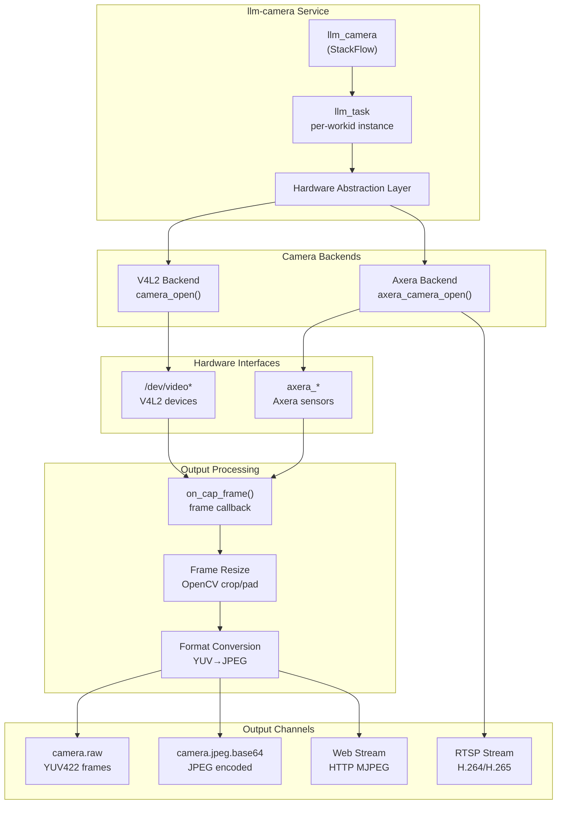
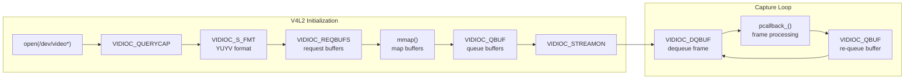
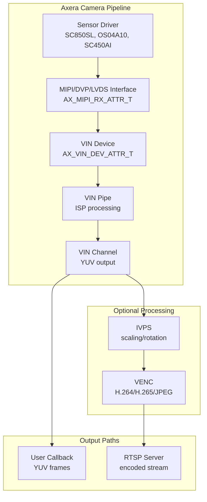
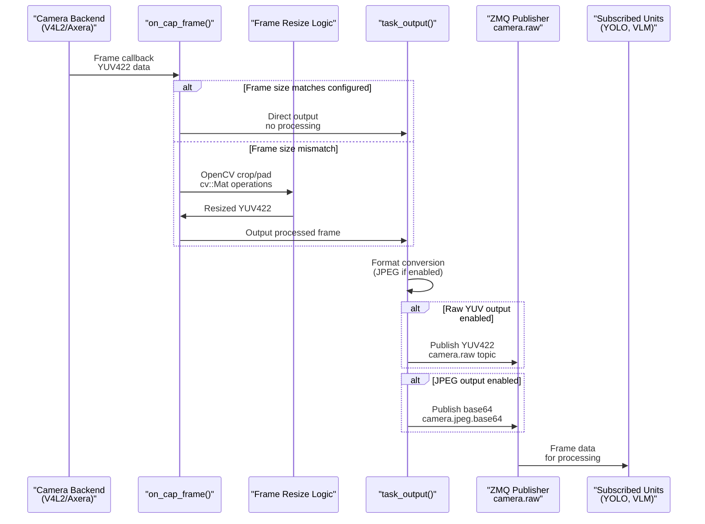
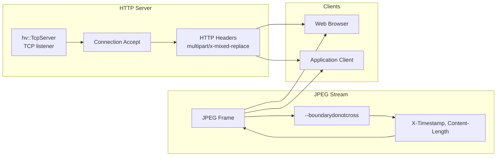
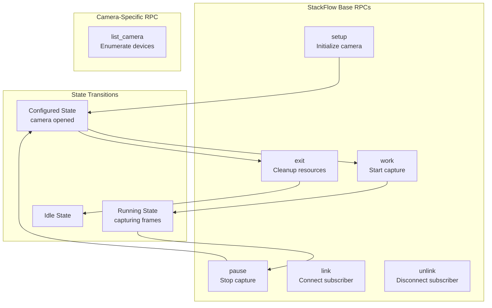
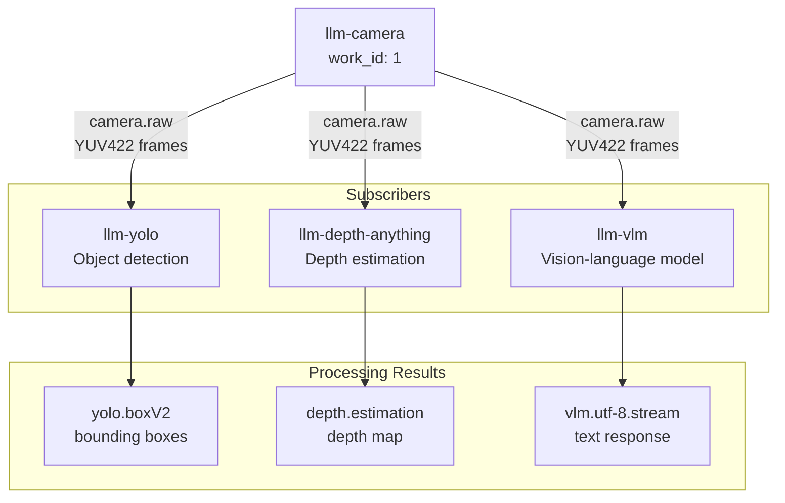

StackFlow Camera Capture (llm-camera)

# Camera Capture (llm-camera)

<details>
<summary>Relevant source files</summary>

The following files were used as context for generating this wiki page:

- [projects/llm_framework/main_camera/SConstruct](projects/llm_framework/main_camera/SConstruct)
- [projects/llm_framework/main_camera/camera.json](projects/llm_framework/main_camera/camera.json)
- [projects/llm_framework/main_camera/src/axera_camera.c](projects/llm_framework/main_camera/src/axera_camera.c)
- [projects/llm_framework/main_camera/src/axera_camera.h](projects/llm_framework/main_camera/src/axera_camera.h)
- [projects/llm_framework/main_camera/src/camera.h](projects/llm_framework/main_camera/src/camera.h)
- [projects/llm_framework/main_camera/src/main.cpp](projects/llm_framework/main_camera/src/main.cpp)
- [projects/llm_framework/main_camera/src/v4l2_camera.c](projects/llm_framework/main_camera/src/v4l2_camera.c)

</details>


The `llm-camera` unit provides video capture capabilities for the StackFlow framework, supporting both V4L2 (Video4Linux2) standard cameras and Axera hardware-accelerated camera interfaces. It captures video frames and publishes them via ZMQ channels for consumption by computer vision units like llm-yolo and llm-vlm.

For object detection on camera frames, see [Object Detection (llm-yolo)](#5.2). For depth estimation, see [Depth Estimation (llm-depth-anything)](#5.3). For vision-language models that process camera input, see [Vision-Language Models (llm-vlm)](#4.2).

## System Architecture

The camera unit implements a hardware abstraction layer supporting multiple camera backends with a unified interface. The `llm_camera` class manages camera lifecycle while `llm_task` handles individual camera instances.



**Sources:** [projects/llm_framework/main_camera/src/main.cpp:1-1300](), [projects/llm_framework/main_camera/src/camera.h:1-81]()

### Component Responsibilities

| Component | Responsibility | Key Methods/Fields |
|-----------|---------------|-------------------|
| `llm_camera` | StackFlow integration, RPC handling | `list_camera()`, `task_output()` |
| `llm_task` | Camera instance management | `load_model()`, `on_cap_frame()` |
| `camera_t` | Generic camera interface | `camera_capture_start()`, `camera_capture_stop()` |
| V4L2 backend | Linux standard video capture | `camera_open()`, `camera_capture_thread()` |
| Axera backend | Hardware-accelerated capture | `axera_camera_open()`, ISP pipeline |

**Sources:** [projects/llm_framework/main_camera/src/main.cpp:88-609](), [projects/llm_framework/main_camera/src/main.cpp:611-1300]()

## Camera Backends

The camera unit supports two hardware backends, selected automatically based on the device name prefix.

### V4L2 Backend

The V4L2 backend provides standard Linux video capture for USB cameras and CSI interfaces. It uses memory-mapped buffers for efficient frame transfer.



**Key Implementation Details:**

- **Device Detection:** Device names starting with `/dev/video` trigger V4L2 backend selection [projects/llm_framework/main_camera/src/main.cpp:506-510]()
- **Buffer Management:** Uses `CONFIG_CAPTURE_BUF_CNT` (10) mmap buffers for efficient zero-copy transfer [projects/llm_framework/main_camera/src/camera.h:11]()
- **Pixel Format:** Configured for `V4L2_PIX_FMT_YUYV` (YUV422 interleaved) [projects/llm_framework/main_camera/src/v4l2_camera.c:228]()
- **Capture Thread:** Dedicated pthread continuously dequeues and processes frames [projects/llm_framework/main_camera/src/v4l2_camera.c:30-69]()

**Sources:** [projects/llm_framework/main_camera/src/v4l2_camera.c:1-384](), [projects/llm_framework/main_camera/src/camera.h:1-81]()

### Axera Backend

The Axera backend leverages hardware-accelerated ISP (Image Signal Processor) pipelines on AX620E/AX620Q platforms, supporting advanced features like HDR, AISP, and hardware video encoding.



**Supported Sensors:**

| Sensor Model | Resolution | HDR Support | Device Name Prefix |
|--------------|-----------|-------------|-------------------|
| SC850SL | 3840×2160 | 2X HDR | `axera_single_sc850sl` |
| OS04A10 | 2688×1520 | 2X/DCG HDR | `axera_single_os04a10` |
| SC450AI | 2688×1520 | 2X HDR | `axera_single_sc450ai` |
| S5KJN1SQ03 | 1920×1080 | Linear | `axera_single_s5kjn1sq03` |

**Key Configuration Structures:**

- **VIN Parameters:** `SAMPLE_VIN_PARAM_T` configures system mode, HDR mode, and AISP enable [projects/llm_framework/main_camera/src/axera_camera.h:36-43]()
- **RTSP Encoding:** `AX_VENC_CHN_ATTR_T` defines H.264/H.265 encoding parameters (bitrate, GOP, QP ranges) [projects/llm_framework/main_camera/src/main.cpp:201-461]()
- **Memory Pools:** Pre-allocated common and private memory pools sized for sensor resolution and HDR mode [projects/llm_framework/main_camera/src/axera_camera.c:144-275]()

**Sources:** [projects/llm_framework/main_camera/src/axera_camera.c:1-2000](), [projects/llm_framework/main_camera/src/axera_camera.h:1-75](), [projects/llm_framework/main_camera/src/main.cpp:178-485]()

## Frame Capture and Processing Pipeline

The camera unit implements a callback-based architecture where captured frames are processed through a configurable pipeline before being published to ZMQ channels.

### Frame Callback Flow



**Sources:** [projects/llm_framework/main_camera/src/main.cpp:115-173](), [projects/llm_framework/main_camera/src/main.cpp:639-704]()

### Frame Resize Algorithm

When the captured frame size doesn't match the configured output size, the unit performs intelligent cropping and padding to preserve aspect ratio:

**Resize Strategy Table:**

| Condition | Source Region | Destination Region | Operation |
|-----------|--------------|-------------------|-----------|
| Exact match | Full frame | Full frame | Direct copy |
| Output larger (both dims) | Full frame | Centered region | Pad with YUV black |
| Output smaller (both dims) | Center crop | Full frame | Crop center region |
| Mixed (width/height) | Appropriate region | Appropriate region | Combined crop/pad |

**Implementation:** The resize logic uses OpenCV `cv::Rect` and `copyTo()` for efficient in-place operations on YUV422 data. The destination buffer is pre-filled with YUV black (Y=0, UV=128) [projects/llm_framework/main_camera/src/main.cpp:126-171]().

**Sources:** [projects/llm_framework/main_camera/src/main.cpp:115-173]()

## Output Formats and Streaming

The camera unit supports multiple output formats and streaming protocols, controlled by the `response_format` configuration parameter.

### Output Format Configuration

| Format String | Output Type | Data Format | Topic Name |
|--------------|-------------|-------------|------------|
| `"raw"` | YUV422 raw | Binary YUV422 | `camera.raw` |
| `"stream"` | YUV422 stream | Binary stream | `camera.raw` |
| `"jpeg"` | JPEG image | Base64 encoded | `camera.jpeg.base64` |
| `"stream.jpeg"` | JPEG stream | Base64 stream | `camera.jpeg.base64` |

**Format Selection Logic:**

```cpp
enstream_  = (response_format_.find("stream") != std::string::npos);
enjpegout_ = (response_format_.find("jpeg") != std::string::npos);
```

**Sources:** [projects/llm_framework/main_camera/src/main.cpp:503-504]()

### JPEG Encoding

When JPEG output is enabled, the unit uses OpenCV's `cv::imencode()` to convert YUV422 frames to JPEG:

1. **YUV to BGR Conversion:** `cv::cvtColor(yuv_image, bgr_image, cv::COLOR_YUV2BGR_YUYV)`
2. **JPEG Compression:** `cv::imencode(".jpg", bgr_image, jpeg_image)`
3. **Base64 Encoding:** Standard base64 encoding of JPEG bytes

**Sources:** [projects/llm_framework/main_camera/src/main.cpp:655-659]()

### Web Streaming (HTTP MJPEG)

The camera unit includes an optional HTTP MJPEG server using the `libhv` library for browser-based video streaming.



**HTTP Response Format:**

```
HTTP/1.0 200 OK
Content-Type: multipart/x-mixed-replace;boundary=--boundarydonotcross
Cache-Control: no-store, no-cache, must-revalidate

--boundarydonotcross
X-Timestamp: 1234567890.123456
Content-Length: 12345
Content-Type: image/jpeg

<JPEG data>
```

**Configuration:** Enabled via `enable_webstream: true` in setup parameters [projects/llm_framework/main_camera/src/main.cpp:494-498]().

**Sources:** [projects/llm_framework/main_camera/src/main.cpp:39-59](), [projects/llm_framework/main_camera/src/main.cpp:705-843]()

### RTSP Streaming (Axera Only)

For Axera backend, hardware-accelerated H.264/H.265 encoding enables low-latency RTSP streaming.

**RTSP Configuration Example:**

```json
{
  "rtsp": "rtsp.1280x720.h264",
  "h264_config_param": {
    "stVencAttr.u32PicWidthSrc": 1280,
    "stVencAttr.u32PicHeightSrc": 720,
    "stRcAttr.stH264Cbr.u32BitRate": 2048,
    "stRcAttr.stH264Cbr.u32Gop": 120
  }
}
```

**Encoding Modes Supported:**

- **CBR** (Constant Bitrate): Fixed bitrate encoding
- **VBR** (Variable Bitrate): Quality-based encoding
- **CVBR** (Constrained VBR): VBR with bitrate limits
- **QVBR** (Quality VBR): VBR optimized for quality

**Sources:** [projects/llm_framework/main_camera/src/main.cpp:200-482](), [projects/llm_framework/main_camera/camera.json:28-121]()

## Configuration System

Camera configuration is split between static JSON files and runtime setup parameters.

### Static Configuration Files

**camera.json** - Defines camera capabilities and hardware parameters:

```json
{
  "mode": "None",
  "type": "camera",
  "capabilities": ["camera cap"],
  "input_type": ["camera.v4l2_dev", "camera.axera_dev"],
  "output_type": ["image.yuyv422.base64", "image.jpeg.base64"],
  "cap_param": {
    "VinParam.eSysMode": 1,
    "VinParam.eHdrMode": 1,
    "VinParam.bAiispEnable": 1
  }
}
```

**Key Parameters:**

| Parameter | Purpose | Default |
|-----------|---------|---------|
| `VinParam.eSysMode` | System mode (sensor/TPG/loadraw) | `COMMON_VIN_SENSOR` (1) |
| `VinParam.eHdrMode` | HDR mode (linear/2X/3X/4X) | `AX_SNS_LINEAR_MODE` (1) |
| `VinParam.bAiispEnable` | Enable AI ISP | `AX_TRUE` (1) |

**Sources:** [projects/llm_framework/main_camera/camera.json:1-122]()

### Runtime Setup Parameters

The `setup` RPC accepts JSON parameters to configure camera instance:

```json
{
  "input": "/dev/video0",
  "frame_width": 640,
  "frame_height": 480,
  "response_format": "stream.jpeg",
  "enoutput": true,
  "enable_webstream": false,
  "rtsp": "rtsp.1280x720.h264"
}
```

**Parameter Validation:**

| Parameter | Type | Required | Description |
|-----------|------|----------|-------------|
| `input` | string | Yes | Device path or Axera sensor name |
| `frame_width` | integer | Yes | Output frame width |
| `frame_height` | integer | Yes | Output frame height |
| `response_format` | string | Yes | Output format ("raw", "jpeg", "stream") |
| `enoutput` | boolean | Yes | Enable ZMQ output |
| `enable_webstream` | boolean | No | Enable HTTP MJPEG server |
| `rtsp` | string | No | RTSP configuration (Axera only) |

**Configuration Loading:** The unit searches for configuration files in standard model paths and merges them with runtime parameters [projects/llm_framework/main_camera/src/main.cpp:521-550]().

**Sources:** [projects/llm_framework/main_camera/src/main.cpp:486-553]()

## RPC Interface

The camera unit implements the standard StackFlow RPC interface plus a custom `list_camera` action.

### Standard RPC Functions



**Sources:** [projects/llm_framework/main_camera/src/main.cpp:611-637]()

### list_camera RPC

Enumerates available V4L2 video devices on the system.

**Request:**
```json
{
  "action": "list_camera",
  "request_id": "req-123",
  "work_id": 1
}
```

**Response:**
```json
{
  "topic": "camera.devices",
  "data": ["/dev/video0", "/dev/video1"],
  "error_code": 0,
  "work_id": 1
}
```

**Implementation:** Uses `glob("/dev/video*")` to find all V4L2 device nodes [projects/llm_framework/main_camera/src/main.cpp:622-636]().

**Sources:** [projects/llm_framework/main_camera/src/main.cpp:622-637]()

### Setup and Lifecycle

**Camera Initialization Sequence:**

1. **Parse Configuration:** Extract device name, dimensions, and format parameters
2. **Select Backend:** Choose V4L2 or Axera based on device name prefix
3. **Open Camera:** Call `hal_camera_open()` function pointer to appropriate backend
4. **Register Callback:** Set `on_cap_frame` as frame capture callback
5. **Start Capture:** Begin hardware capture thread/ISP pipeline

**Cleanup Sequence:**

1. **Stop Capture:** `camera->camera_capture_stop()`
2. **Close Camera:** `hal_camera_close()`
3. **Free Resources:** Release buffers, close HTTP server
4. **Stop Threads:** Join capture threads

**Sources:** [projects/llm_framework/main_camera/src/main.cpp:555-609]()

## Integration with Computer Vision Units

Camera frames published to the `camera.raw` topic can be subscribed to by multiple downstream units.

### Typical Integration Pattern



**Linking Example (JSON RPC):**

```json
{
  "action": "link",
  "work_id": 1,
  "params": {
    "subscriber": [
      {
        "work_id": 2,
        "unit": "yolo",
        "action": "camera.raw",
        "channel": "camera.raw"
      }
    ]
  }
}
```

**Frame Format for CV Units:**

- **Format:** YUV422 interleaved (YUYV/UYVY)
- **Size:** `width × height × 2` bytes
- **Layout:** Y0 U0 Y1 V0 Y2 U1 Y3 V1 ...

**Sources:** [projects/llm_framework/main_camera/src/main.cpp:639-704]()

## Build Configuration

The camera unit has significant build dependencies due to OpenCV and hardware-specific libraries.

### Component Registration

```python
env['COMPONENTS'].append({
    'target': 'llm_camera-1.9',
    'REQUIREMENTS': [
        'hv',              # HTTP server library
        'pthread',         # Threading
        'utilities',       # Logging utilities
        'ax_msp',          # Axera MSP SDK
        'StackFlow',       # Framework base class
        'single_header_libs'
    ],
    'STATIC_LIB': [
        # OpenCV static libraries
        'libopencv_core.a',
        'libopencv_imgproc.a',
        'libopencv_imgcodecs.a',
        'libopencv_videoio.a'
    ]
})
```

**Conditional Dependencies:** Axera-specific libraries (`ax_venc`, `ax_ivps`, `liveMedia` for RTSP) are only included when `CONFIG_AX_620E_MSP_ENABLED` is defined [projects/llm_framework/main_camera/SConstruct:36-39]().

**Static Files:** Configuration files (`camera.json`, `mode_*.json`) are packaged with the service binary [projects/llm_framework/main_camera/SConstruct:59-60]().

**Sources:** [projects/llm_framework/main_camera/SConstruct:1-76]()

### Hardware Abstraction Layer

The HAL design allows runtime backend selection through function pointers:

```cpp
typedef camera_t *(*hal_camera_open_fun)(const char *pdev_name, int width, 
                                         int height, int fps, void *config);
typedef int (*hal_camera_close_fun)(camera_t *camera);
typedef bool (*hal_parse_config_fun)(const nlohmann::json &config_body, 
                                     const nlohmann::json &file_body,
                                     void **custom_config);

// Backend selection
if (devname_.find("/dev/video") != std::string::npos) {
    hal_camera_open  = camera_open;         // V4L2 backend
    hal_camera_close = camera_close;
} else if (devname_.find("axera_") != std::string::npos) {
    hal_camera_open  = axera_camera_open;   // Axera backend
    hal_camera_close = axera_camera_close;
}
```

This design enables compile-time and runtime flexibility for different hardware platforms while maintaining a single codebase.

**Sources:** [projects/llm_framework/main_camera/src/main.cpp:67-94](), [projects/llm_framework/main_camera/src/main.cpp:506-520]()