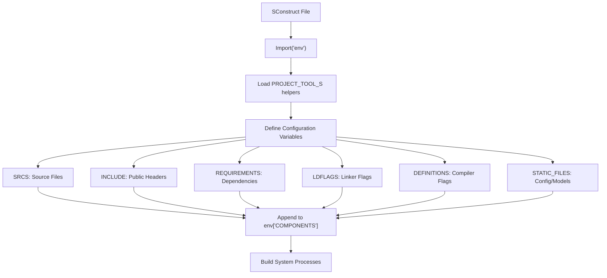
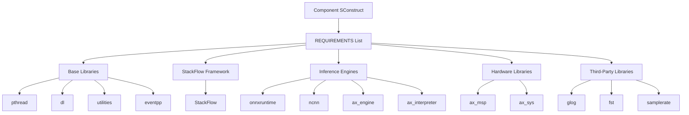
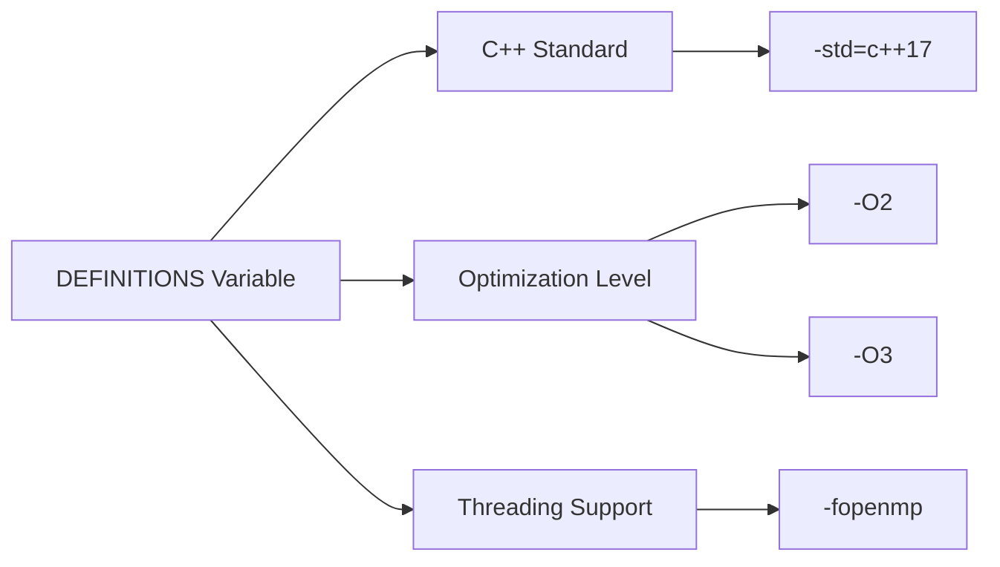
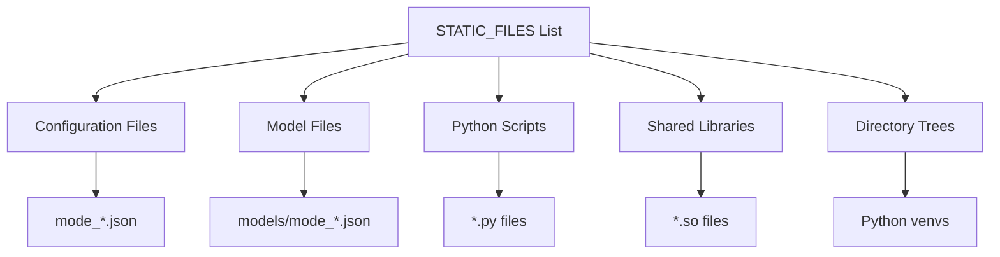
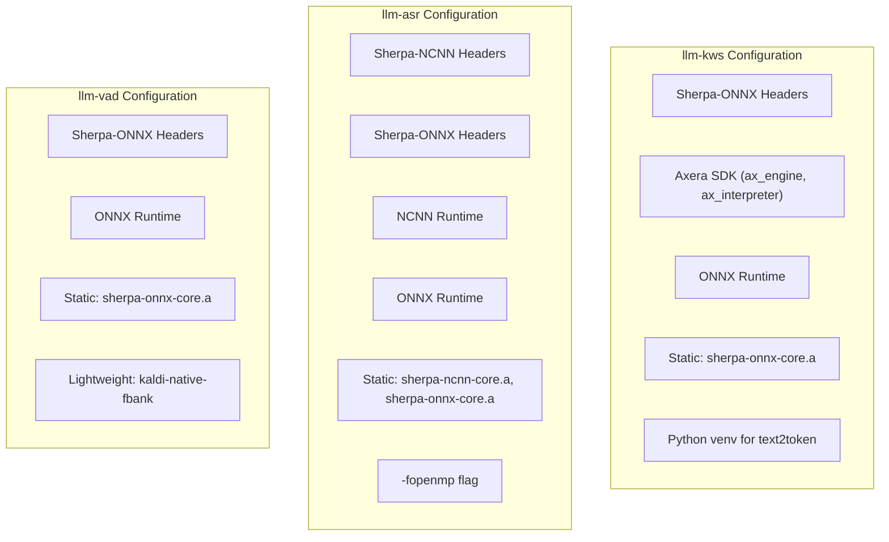
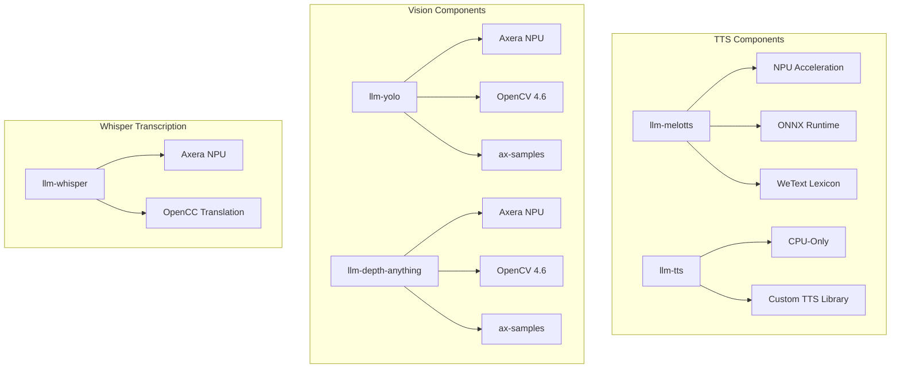
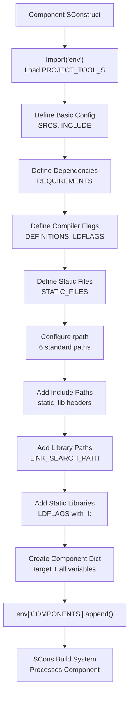

StackFlow Component Build Configuration

# Component Build Configuration

<details>
<summary>Relevant source files</summary>

The following files were used as context for generating this wiki page:

- [projects/llm_framework/main/SConstruct](projects/llm_framework/main/SConstruct)
- [projects/llm_framework/main_asr/SConstruct](projects/llm_framework/main_asr/SConstruct)
- [projects/llm_framework/main_depth_anything/SConstruct](projects/llm_framework/main_depth_anything/SConstruct)
- [projects/llm_framework/main_kws/SConstruct](projects/llm_framework/main_kws/SConstruct)
- [projects/llm_framework/main_melotts/SConstruct](projects/llm_framework/main_melotts/SConstruct)
- [projects/llm_framework/main_tts/SConstruct](projects/llm_framework/main_tts/SConstruct)
- [projects/llm_framework/main_vad/SConstruct](projects/llm_framework/main_vad/SConstruct)
- [projects/llm_framework/main_whisper/SConstruct](projects/llm_framework/main_whisper/SConstruct)
- [projects/llm_framework/main_yolo/SConstruct](projects/llm_framework/main_yolo/SConstruct)

</details>


## Purpose and Scope

This document details the structure and configuration of individual component `SConstruct` files within the StackFlow framework. Each AI processing unit (llm-kws, llm-asr, llm-llm, etc.) contains a `SConstruct` file that defines its source files, include paths, dependencies, compiler flags, and packaging requirements. This page explains how to configure these build parameters and the common patterns used across components.

For an overview of the SCons build system and component registration mechanism, see [SCons Build Overview](#6.1). For information about library dependencies and versioning, see [Dependencies and Static Libraries](#6.3). For cross-compilation toolchain configuration, see [Cross-Compilation and Toolchain](#6.4).

---

## SConstruct File Structure

Each component's `SConstruct` file follows a standardized structure that imports the build environment, loads helper functions, defines configuration parameters, and registers the component with the build system.

### Build File Organization



Sources: [projects/llm_framework/main_kws/SConstruct:1-77](), [projects/llm_framework/main_melotts/SConstruct:1-49](), [projects/llm_framework/main_asr/SConstruct:1-57]()

### Standard File Template

Every component `SConstruct` begins with environment import and helper function loading:

```python
Import('env')
with open(env['PROJECT_TOOL_S']) as f:
    exec(f.read())
```

The `PROJECT_TOOL_S` script provides helper functions like `append_srcs_dir()`, `ADir()`, and `AFile()` for path manipulation. These functions are executed in the local scope, making them available throughout the SConstruct file.

Sources: [projects/llm_framework/main_kws/SConstruct:3-5](), [projects/llm_framework/main_yolo/SConstruct:3-5]()

---

## Configuration Variables Reference

Each component defines a set of standard configuration variables that control compilation and packaging. These variables are used to build the component registration dictionary.

### Core Configuration Variables

| Variable | Type | Purpose | Example |
|----------|------|---------|---------|
| `SRCS` | List[str] | Source files to compile | `Glob('src/*.c*')` or `append_srcs_dir(ADir('src'))` |
| `INCLUDE` | List[str] | Public include directories | `[ADir('include'), ADir('.')]` |
| `PRIVATE_INCLUDE` | List[str] | Private include directories | `[]` (typically unused) |
| `REQUIREMENTS` | List[str] | Component/library dependencies | `['pthread', 'utilities', 'StackFlow']` |
| `STATIC_LIB` | List[str] | Static libraries to link | `Glob('../static_lib/module-llm/libabsl_*')` |
| `DYNAMIC_LIB` | List[str] | Dynamic libraries to package | `[AFile('../static_lib/libzmq.so.5')]` |
| `DEFINITIONS` | List[str] | Compiler flags | `['-std=c++17', '-O3']` |
| `DEFINITIONS_PRIVATE` | List[str] | Private compiler definitions | `[]` (typically unused) |
| `LDFLAGS` | List[str] | Linker flags | `['-Wl,-rpath=/opt/m5stack/lib']` |
| `LINK_SEARCH_PATH` | List[str] | Library search directories | `[ADir('../static_lib')]` |
| `STATIC_FILES` | List[str] | Additional files to package | `Glob('mode_*.json')` |

Sources: [projects/llm_framework/main_kws/SConstruct:7-17](), [projects/llm_framework/main_yolo/SConstruct:7-17]()

### Source File Specification

Components use two primary methods to specify source files:

**Method 1: Direct Glob Pattern**
```python
SRCS = Glob('src/*.c*')
```
This approach matches all `.c`, `.cpp`, `.cc` files in the `src/` directory.

**Method 2: Helper Function with Recursion**
```python
SRCS = append_srcs_dir(ADir('src'))
```
The `append_srcs_dir()` helper recursively collects source files from subdirectories, useful for components with nested source trees.

Sources: [projects/llm_framework/main_asr/SConstruct:7](), [projects/llm_framework/main_kws/SConstruct:7]()

### Include Path Configuration

Include paths are organized into public and private categories, though most components only use public includes:

```python
INCLUDE = [ADir('include'), ADir('.')]
INCLUDE += [ADir('../static_lib/include')]
INCLUDE += [ADir('../static_lib/include/sherpa')]
```

Include paths typically reference:
- Component's own headers (`include/`, `.`)
- Shared static library headers (`../static_lib/include`)
- Third-party library headers (ONNX, Sherpa, OpenCV)

Sources: [projects/llm_framework/main_kws/SConstruct:8-31](), [projects/llm_framework/main_asr/SConstruct:8-28]()

---

## Dependency Management

Components declare dependencies through the `REQUIREMENTS` list and `LINK_SEARCH_PATH` configuration.

### Component Dependency Graph



Sources: [projects/llm_framework/main_kws/SConstruct:10](), [projects/llm_framework/main_melotts/SConstruct:11](), [projects/llm_framework/main_asr/SConstruct:10]()

### Common Requirement Patterns

**Base Requirements (All Components)**
```python
REQUIREMENTS = ['pthread', 'utilities', 'eventpp', 'StackFlow']
```

**NPU-Accelerated Components**
```python
REQUIREMENTS += ['ax_engine', 'ax_interpreter', 'ax_sys']
```

**CPU-Based Inference (ONNX Runtime)**
```python
REQUIREMENTS += ['onnxruntime']
LDFLAGS += ['-l:libsherpa-onnx-core.a', '-l:libkaldi-native-fbank-core.a']
```

**CPU-Based Inference (NCNN)**
```python
REQUIREMENTS += ['ncnn']
LDFLAGS += ['-l:libsherpa-ncnn-core.a']
```

Sources: [projects/llm_framework/main_kws/SConstruct:10-38](), [projects/llm_framework/main_asr/SConstruct:10-39](), [projects/llm_framework/main_yolo/SConstruct:10-22]()

---

## Compiler and Linker Configuration

Compiler and linker flags control code generation, optimization, and runtime library resolution.

### Standard Compiler Flags



**Common Patterns:**

**Standard Configuration**
```python
DEFINITIONS += ['-std=c++17']
```

**Optimized Build with OpenMP**
```python
DEFINITIONS += ['-O3', '-fopenmp', '-std=c++17']
```

**Conservative Optimization**
```python
DEFINITIONS += ['-std=c++17', '-O2']
```

Sources: [projects/llm_framework/main_kws/SConstruct:21](), [projects/llm_framework/main_melotts/SConstruct:20](), [projects/llm_framework/main_yolo/SConstruct:19]()

### Runtime Library Path Configuration

All components configure `rpath` to ensure runtime library resolution across multiple installation paths:

```python
LDFLAGS+=['-Wl,-rpath=/opt/m5stack/lib', 
          '-Wl,-rpath=/usr/local/m5stack/lib', 
          '-Wl,-rpath=/usr/local/m5stack/lib/gcc-10.3', 
          '-Wl,-rpath=/opt/lib', 
          '-Wl,-rpath=/opt/usr/lib', 
          '-Wl,-rpath=./']
```

This configuration allows the executable to find shared libraries in:
- `/opt/m5stack/lib`: Primary M5Stack library location
- `/usr/local/m5stack/lib`: Alternative installation path
- `/usr/local/m5stack/lib/gcc-10.3`: Toolchain-specific libraries
- `/opt/lib` and `/opt/usr/lib`: System-wide library paths
- `./`: Current directory for local testing

Sources: [projects/llm_framework/main_kws/SConstruct:22](), [projects/llm_framework/main_melotts/SConstruct:21](), [projects/llm_framework/main_asr/SConstruct:19]()

### Static Library Linking

Components link to static libraries using explicit library search paths and linker flags:

```python
LINK_SEARCH_PATH += [ADir('../static_lib')]
LINK_SEARCH_PATH += [ADir('../static_lib/sherpa/onnx')]

LDFLAGS += ['-l:libsherpa-onnx-core.a', 
            '-l:libkaldi-native-fbank-core.a',
            '-l:libkissfft-float.a']
```

The `-l:libname.a` syntax forces static linking to the specified archive file.

Sources: [projects/llm_framework/main_kws/SConstruct:23-38](), [projects/llm_framework/main_asr/SConstruct:21-39]()

---

## Static Files and Packaging

Components can specify additional files to include in the package, such as configuration files, models, or Python scripts.

### Static File Types



Sources: [projects/llm_framework/main_kws/SConstruct:41-43](), [projects/llm_framework/main_melotts/SConstruct:33]()

### Configuration File Packaging

Most components include JSON configuration files:

```python
STATIC_FILES += Glob('mode_*.json')
```

For components with model-specific configurations:

```python
STATIC_FILES += Glob('models/mode_*.json')
```

Sources: [projects/llm_framework/main_kws/SConstruct:43](), [projects/llm_framework/main_melotts/SConstruct:33](), [projects/llm_framework/main_vad/SConstruct:31]()

### Python Environment Packaging

Some components (like llm-kws) package Python virtual environments for runtime script execution:

```python
python_venv = check_wget_down(
    "https://m5stack.oss-cn-shenzhen.aliyuncs.com/resource/linux/llm/m5stack_llm-kws-python-venv_v1.6.tar.gz",
    'm5stack_llm-kws-python-venv_v1.6.tar.gz'
)

STATIC_FILES += [os.path.join(python_venv, 'sherpa-onnx')]
STATIC_FILES += Glob('llm-kws_text2token.py')
```

The `check_wget_down()` helper downloads and extracts the virtual environment if not already present.

Sources: [projects/llm_framework/main_kws/SConstruct:19-42]()

### Shared Library Packaging

The static_file component packages all required shared libraries:

```python
STATIC_FILES += [AFile('../static_lib/sherpa/ncnn/libsherpa-ncnn-core.so'),
                 AFile('../static_lib/sherpa/ncnn/libncnn.so'),
                 AFile('../static_lib/libtts.so'),
                 AFile('../static_lib/libonnxruntime.so.1'),
                 AFile('../static_lib/libzmq.so.5')]
```

Sources: [projects/llm_framework/main/SConstruct:23-33]()

---

## Component Registration

Each component registers itself with the build system by appending a configuration dictionary to `env['COMPONENTS']`.

### Registration Dictionary Structure

```python
env['COMPONENTS'].append({
    'target': 'llm_kws-1.10',
    'SRCS': SRCS,
    'INCLUDE': INCLUDE,
    'PRIVATE_INCLUDE': PRIVATE_INCLUDE,
    'REQUIREMENTS': REQUIREMENTS,
    'STATIC_LIB': STATIC_LIB,
    'DYNAMIC_LIB': DYNAMIC_LIB,
    'DEFINITIONS': DEFINITIONS,
    'DEFINITIONS_PRIVATE': DEFINITIONS_PRIVATE,
    'LDFLAGS': LDFLAGS,
    'LINK_SEARCH_PATH': LINK_SEARCH_PATH,
    'STATIC_FILES': STATIC_FILES,
    'REGISTER': 'project'
})
```

Sources: [projects/llm_framework/main_kws/SConstruct:63-76]()

### Registration Fields

| Field | Purpose | Notes |
|-------|---------|-------|
| `target` | Component name and version | Format: `component_name-version` |
| `SRCS` | Source file list | As defined earlier |
| `INCLUDE` | Public include paths | Exported to dependents |
| `PRIVATE_INCLUDE` | Private include paths | Not exported |
| `REQUIREMENTS` | Dependency list | Resolved by build system |
| `STATIC_LIB` | Static libraries | Linked into executable |
| `DYNAMIC_LIB` | Dynamic libraries | Packaged with executable |
| `DEFINITIONS` | Public compiler flags | May affect dependents |
| `DEFINITIONS_PRIVATE` | Private compiler flags | Only for this component |
| `LDFLAGS` | Linker flags | Used during link stage |
| `LINK_SEARCH_PATH` | Library search paths | `-L` flags |
| `STATIC_FILES` | Additional package files | Included in .deb package |
| `REGISTER` | Registration type | Typically `'project'` |

The `target` field follows the naming convention `llm_componentname-version`, where the version number increments with each release.

Sources: [projects/llm_framework/main_kws/SConstruct:63-76](), [projects/llm_framework/main_melotts/SConstruct:35-48]()

---

## Component-Specific Configurations

Different component types follow distinct configuration patterns based on their functionality and dependencies.

### Speech Processing Components (CPU-Based)



**llm-kws (Keyword Spotting):**
- ONNX Runtime for CPU inference
- Sherpa-ONNX library for wake word detection
- Python environment for text-to-token conversion
- Axera SDK for potential NPU acceleration

**llm-asr (Speech Recognition):**
- Both NCNN and ONNX backends supported
- OpenMP for parallel processing
- Multiple static libraries (Sherpa-NCNN, Sherpa-ONNX, Kaldi)
- Comprehensive speech recognition pipeline

**llm-vad (Voice Activity Detection):**
- Lightweight ONNX inference
- Minimal dependencies (no Axera SDK required)
- Silero VAD model support

Sources: [projects/llm_framework/main_kws/SConstruct:10-38](), [projects/llm_framework/main_asr/SConstruct:10-39](), [projects/llm_framework/main_vad/SConstruct:10-29]()

### NPU-Accelerated Components



**llm-melotts (Neural TTS):**
- NPU acceleration via Axera SDK
- ONNX Runtime for encoder/decoder
- WeText library for lexicon-based phoneme conversion
- Sample rate conversion (`samplerate`)

**llm-yolo (Object Detection):**
- Axera NPU for inference
- OpenCV 4.6 for image processing
- ax-samples for model utilities
- Multiple YOLO task types (detect, segment, pose, obb)

**llm-depth-anything (Depth Estimation):**
- Similar to YOLO configuration
- Specialized for monocular depth estimation

**llm-whisper (Speech Transcription):**
- NPU-accelerated inference
- OpenCC for Chinese text normalization
- OpenMP for parallel processing

Sources: [projects/llm_framework/main_melotts/SConstruct:11-31](), [projects/llm_framework/main_yolo/SConstruct:10-28](), [projects/llm_framework/main_depth_anything/SConstruct:10-28](), [projects/llm_framework/main_whisper/SConstruct:11-32]()

### Configuration Comparison Table

| Component | Primary Inference | Key Libraries | Optimization | Hardware Target |
|-----------|------------------|---------------|--------------|-----------------|
| llm-kws | ONNX Runtime | sherpa-onnx | `-std=c++17` | CPU (optional NPU) |
| llm-asr | NCNN / ONNX | sherpa-ncnn, sherpa-onnx | `-fopenmp` | CPU |
| llm-vad | ONNX Runtime | sherpa-onnx | `-std=c++17` | CPU |
| llm-melotts | Axera NPU | WeText, ONNX | `-O3 -fopenmp` | NPU |
| llm-tts | Custom | libtts | `-O3 -fopenmp` | CPU |
| llm-whisper | Axera NPU | OpenCC | `-O3 -fopenmp` | NPU |
| llm-yolo | Axera NPU | OpenCV, ax-samples | `-O2` | NPU |
| llm-depth-anything | Axera NPU | OpenCV, ax-samples | `-O3` | NPU |

Sources: [projects/llm_framework/main_kws/SConstruct:21](), [projects/llm_framework/main_asr/SConstruct:20](), [projects/llm_framework/main_melotts/SConstruct:20](), [projects/llm_framework/main_yolo/SConstruct:19]()

---

## File Ignore Mechanism

Some components need to exclude certain files from packaging while still using them during the build. This is managed through the file ignore system.

```python
IGNORE_FILES = []
IGNORE_FILES += ['sherpa-onnx']

if not os.path.exists('../dist'):
    os.makedirs('../dist')
    
ignore = {'ignore':[]}
try:
    with open('../dist/fileignore', 'a+') as f:
        f.seek(0)
        ignore = json.load(f)
except:
    pass
    
ignore['ignore'] += IGNORE_FILES
ignore['ignore'] = list(set(ignore['ignore']))
with open('../dist/fileignore', 'w') as f:
    json.dump(ignore, f, indent=4)
```

This mechanism:
1. Creates `../dist/fileignore` JSON file
2. Accumulates ignore patterns from all components
3. Removes duplicates using `set()`
4. Used by packaging system to exclude files from `.deb` packages

The llm-kws component uses this to exclude the `sherpa-onnx` directory, which contains build artifacts but not deployment files.

Sources: [projects/llm_framework/main_kws/SConstruct:45-61]()

---

## Build Configuration Summary

### Configuration Flow Diagram



Sources: [projects/llm_framework/main_kws/SConstruct:1-76](), [projects/llm_framework/main_melotts/SConstruct:1-48]()

### Key Configuration Principles

1. **Standardization**: All components use the same variable structure and registration pattern
2. **Modularity**: Dependencies declared explicitly through REQUIREMENTS
3. **Flexibility**: Component-specific needs handled through targeted configuration
4. **Runtime Resolution**: rpath configuration ensures libraries found at runtime
5. **Versioning**: Target names include version numbers for tracking
6. **Packaging Integration**: STATIC_FILES directly influences package contents

The component build configuration system provides a declarative interface for specifying compilation requirements while maintaining consistency across the framework. Each component's `SConstruct` file serves as both build specification and package manifest, enabling the SCons system to generate both executables and `.deb` packages from a single configuration source.

Sources: [projects/llm_framework/main_kws/SConstruct:1-77](), [projects/llm_framework/main_melotts/SConstruct:1-49](), [projects/llm_framework/main_yolo/SConstruct:1-56](), [projects/llm_framework/main_asr/SConstruct:1-57]()