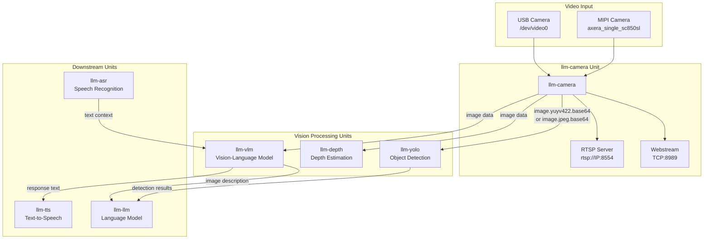
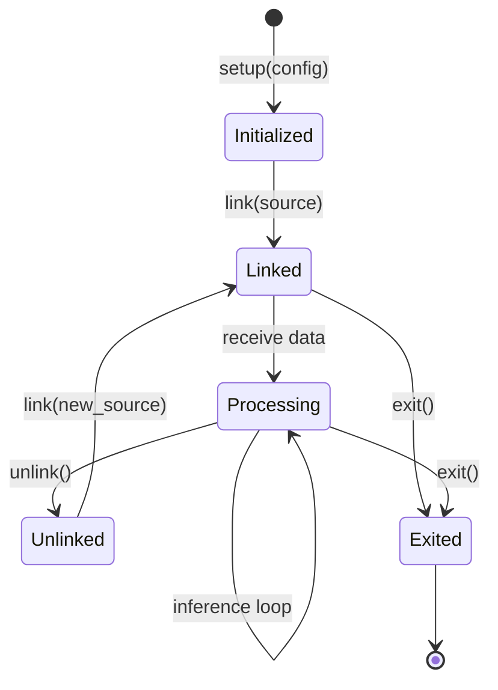
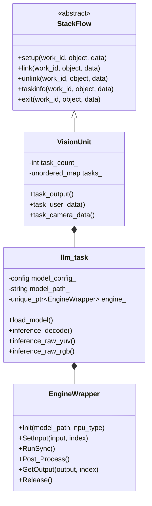
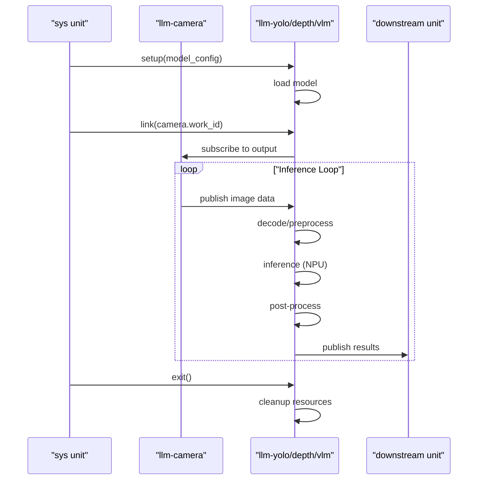
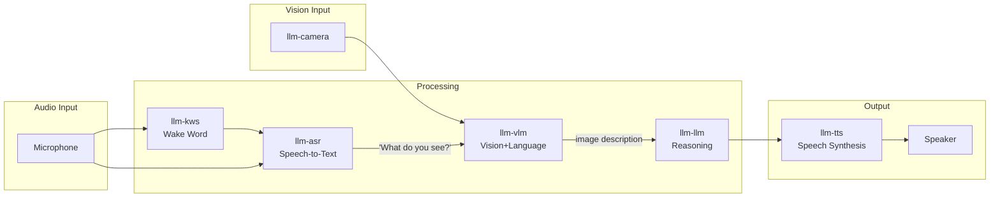
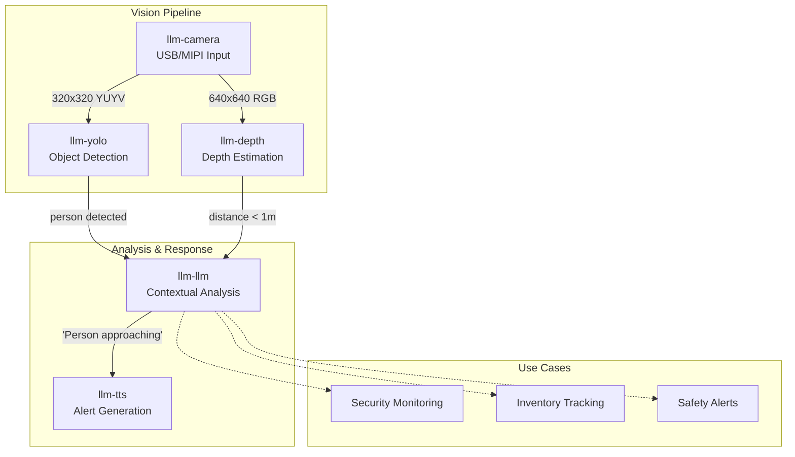

StackFlow Computer Vision Units

# Vision Processing Units

<details>
<summary>Relevant source files</summary>

The following files were used as context for generating this wiki page:

- [projects/llm_framework/main_camera/SConstruct](projects/llm_framework/main_camera/SConstruct)
- [projects/llm_framework/main_camera/camera.json](projects/llm_framework/main_camera/camera.json)
- [projects/llm_framework/main_camera/src/axera_camera.c](projects/llm_framework/main_camera/src/axera_camera.c)
- [projects/llm_framework/main_camera/src/axera_camera.h](projects/llm_framework/main_camera/src/axera_camera.h)
- [projects/llm_framework/main_camera/src/camera.h](projects/llm_framework/main_camera/src/camera.h)
- [projects/llm_framework/main_camera/src/main.cpp](projects/llm_framework/main_camera/src/main.cpp)
- [projects/llm_framework/main_camera/src/v4l2_camera.c](projects/llm_framework/main_camera/src/v4l2_camera.c)
- [projects/llm_framework/main_depth_anything/src/EngineWrapper.cpp](projects/llm_framework/main_depth_anything/src/EngineWrapper.cpp)
- [projects/llm_framework/main_depth_anything/src/EngineWrapper.hpp](projects/llm_framework/main_depth_anything/src/EngineWrapper.hpp)
- [projects/llm_framework/main_depth_anything/src/main.cpp](projects/llm_framework/main_depth_anything/src/main.cpp)
- [projects/llm_framework/main_melotts/src/runner/EngineWrapper.cpp](projects/llm_framework/main_melotts/src/runner/EngineWrapper.cpp)
- [projects/llm_framework/main_whisper/src/runner/EngineWrapper.cpp](projects/llm_framework/main_whisper/src/runner/EngineWrapper.cpp)
- [projects/llm_framework/main_yolo/src/EngineWrapper.cpp](projects/llm_framework/main_yolo/src/EngineWrapper.cpp)
- [projects/llm_framework/main_yolo/src/EngineWrapper.hpp](projects/llm_framework/main_yolo/src/EngineWrapper.hpp)
- [projects/llm_framework/main_yolo/src/main.cpp](projects/llm_framework/main_yolo/src/main.cpp)

</details>


This page provides an overview of the vision processing subsystem in StackFlow. Vision processing units handle video acquisition, object detection, depth estimation, and vision-language understanding for embedded AI applications.

## Overview

The vision processing subsystem consists of four specialized units:

| Unit | Purpose | Key Capabilities |
|------|---------|------------------|
| **llm-camera** | Video source acquisition | USB V4L2/MIPI capture, webstream (TCP:8989), RTSP streaming |
| **llm-yolo** | Object detection | Detection, segmentation, pose estimation, oriented bounding boxes |
| **llm-vlm** | Vision-language understanding | Image description, visual question answering, multimodal reasoning |
| **llm-depth** | Depth estimation | Monocular depth map generation, distance calculation |

These units leverage the AXERA AI acceleration hardware (ax630c and ax650n chips) for optimized inference performance on embedded devices.

### Vision Processing Pipeline



Sources: [doc/assets/StackFlow_unit.dot:7-11](), [doc/assets/StackFlow_unit.dot:25-28]()

## Unit Descriptions

### llm-camera: Video Source

The `llm-camera` unit provides video acquisition from camera devices and streaming capabilities.

**Supported Input Sources:**
- USB V4L2 cameras (`/dev/video0`, `/dev/video1`, etc.)
- MIPI cameras (`axera_single_sc850sl`)

**Output Formats:**
- `image.yuyv422.base64` - Raw YUYV422 format, base64-encoded
- `image.jpeg.base64` - JPEG-compressed format, base64-encoded

**Streaming Features:**
- **Webstream**: HTTP multipart/x-mixed-replace stream on TCP port 8989
- **RTSP**: RTSP server at `rtsp://{DeviceIP}:8554/axstream0` (MIPI cameras only, 1280x720 H265)

**Configuration Example:**
```json
{
  "request_id": "2",
  "work_id": "camera",
  "action": "setup",
  "object": "camera.setup",
  "data": {
    "response_format": "image.yuyv422.base64",
    "input": "/dev/video0",
    "frame_width": 320,
    "frame_height": 320,
    "enable_webstream": false,
    "rtsp": "rtsp.1280x720.h265"
  }
}
```

The `enoutput` parameter controls whether the camera publishes frames to the ZMQ message bus. When disabled, the camera only provides streams via webstream/RTSP without consuming message bus bandwidth.

For detailed API documentation, see page 3.2.1.

Sources: [doc/projects_llm_framework_doc/llm_camera_en.md:1-40](), [doc/assets/StackFlow_unit.dot:25-27]()

### llm-yolo: Object Detection

The `llm-yolo` unit performs real-time object detection, segmentation, and pose estimation using YOLO11n model variants.

**Capabilities:**
- Object detection with bounding boxes
- Instance segmentation with pixel-level masks
- Pose estimation with keypoint detection
- Oriented bounding box (OBB) detection

**Model Types:**
- `detect` - Standard object detection
- `segment` - Instance segmentation
- `pose` - Pose estimation (17 keypoints)
- `obb` - Oriented bounding boxes

**Input Sources:**
- Direct image data (base64-encoded JPEG/PNG)
- Raw YUV format from camera
- Raw RGB/BGR format

**Output Format:**
```json
[
  {
    "class": "person",
    "confidence": 0.92,
    "bbox": [125.0, 45.23, 85.45, 275.33]
  }
]
```

For detailed configuration and API documentation, see page 3.2.2.

Sources: [doc/assets/StackFlow_unit.dot:25](), [projects/llm_framework/main_yolo/src/main.cpp:33-43]()

### llm-vlm: Vision-Language Models

The `llm-vlm` unit provides multimodal understanding by combining visual and textual information. It supports image description, visual question answering, and multimodal reasoning.

**Supported Models:**
- `internvl2.5` variants
- `smolvlm` variants

**Input Sources:**
- Image data from `llm-camera`
- Text context from `llm-asr` (speech recognition)
- Direct text prompts

**Use Cases:**
- Image captioning and description
- Visual question answering
- Multimodal dialogue systems
- Scene understanding

The VLM unit can receive text from the ASR unit to enable voice-controlled visual queries (e.g., "What do you see?" triggers image description).

For detailed configuration and API documentation, see page 3.2.3.

Sources: [doc/assets/StackFlow_unit.dot:27-29]()

### llm-depth: Depth Estimation

The `llm-depth` unit generates depth maps from monocular RGB images using the Depth Anything model.

**Capabilities:**
- Monocular depth estimation
- Relative depth map generation
- Distance calculation

**Input Sources:**
- Image data from `llm-camera`
- Base64-encoded images
- Raw YUV/RGB/BGR formats

**Output Format:**
- Base64-encoded JPEG depth map with color mapping (COLORMAP_MAGMA)

The depth maps are normalized and colorized for visualization, with warmer colors indicating closer objects and cooler colors indicating distant objects.

For detailed configuration and API documentation, see page 3.2.4.

Sources: [doc/assets/StackFlow_unit.dot:26](), [projects/llm_framework/main_depth_anything/src/main.cpp:27-36]()

## Common Architecture Patterns

Vision processing units (llm-yolo, llm-vlm, llm-depth) share common architectural patterns for model inference and integration with the StackFlow framework.

### Unit Lifecycle

All vision processing units follow the standard StackFlow lifecycle:



**Standard RPC Actions:**
- `setup` - Initialize unit with model configuration
- `link` - Subscribe to input data source (typically camera)
- `unlink` - Disconnect from input source
- `taskinfo` - Query unit status and configuration
- `exit` - Shutdown unit and release resources

Sources: [doc/assets/StackFlow_unit.dot:1-21]()

### Component Architecture

Vision inference units inherit from the `StackFlow` base class and implement the following pattern:



**Key Components:**

1. **VisionUnit** (e.g., `llm_yolo`, `llm_depth_anything`, `llm_vlm`) - Manages multiple concurrent tasks, handles ZMQ communication, and coordinates data flow.

2. **llm_task** - Encapsulates a single inference task with its own model configuration, input/output handlers, and inference methods for different data formats.

3. **EngineWrapper** - Provides hardware-accelerated inference through the AXERA AI acceleration API, managing NPU resources and model execution.

Sources: [projects/llm_framework/main_yolo/src/main.cpp:348-653](), [projects/llm_framework/main_depth_anything/src/main.cpp:256-558]()

### Data Flow Pattern

Vision units receive input data via ZMQ subscriptions and publish results to output channels:



**Input Formats Supported:**
- Base64-encoded JPEG/PNG images
- Raw YUYV422 format (from camera)
- Raw RGB/BGR format

**Output Channels:**
- Results published to work-specific ZMQ channel
- JSON format with detection/depth/description data
- Optional base64-encoded image outputs

Sources: [projects/llm_framework/main_yolo/src/main.cpp:459-523](), [projects/llm_framework/main_depth_anything/src/main.cpp:367-429]()

## Multimodal Integration Patterns

Vision processing units integrate with audio and language processing units to enable multimodal AI applications.

### Voice-Controlled Vision Analysis



**Example Interaction:**
1. User says wake word ("Hello")
2. User asks "What do you see?"
3. ASR transcribes question to text
4. VLM analyzes current camera frame with text context
5. VLM generates description
6. LLM refines response
7. TTS synthesizes speech output

Sources: [doc/assets/StackFlow_unit.dot:28-34]()

### Object Detection Pipeline



**Common Patterns:**
- Real-time object detection with spatial awareness (YOLO + Depth)
- Visual question answering (Camera + VLM + ASR)
- Scene understanding with verbal feedback (Camera + VLM + LLM + TTS)

Sources: [doc/assets/StackFlow_unit.dot:25-35]()

### Configuration and Linking

Vision units are configured through JSON-RPC and linked via the `link` action:

```json
{
  "request_id": "1",
  "work_id": "camera",
  "action": "setup",
  "data": {
    "input": "/dev/video0",
    "frame_width": 320,
    "frame_height": 320,
    "response_format": "image.yuyv422.base64"
  }
}
```

```json
{
  "request_id": "2",
  "work_id": "yolo",
  "action": "setup",
  "data": {
    "model": "yolov8n",
    "model_type": "detect",
    "response_format": "yolo.box"
  }
}
```

```json
{
  "request_id": "3",
  "work_id": "yolo.1001",
  "action": "link",
  "object": "link",
  "data": {
    "subscriber_work_id": ["camera.1000"]
  }
}
```

After linking, YOLO automatically receives image frames from the camera and publishes detection results.

Sources: [doc/projects_llm_framework_doc/llm_camera_en.md:9-27]()

## Hardware Acceleration

The Computer Vision modules utilize the AXERA AI acceleration hardware (ax630c and ax650n chips) through the AX_ENGINE API. This provides efficient neural network inference for embedded devices.

Key hardware acceleration components:

1. **AX_ENGINE** - Core API for model loading and inference
2. **AX_SYS** - System-level hardware management
3. **VNPU (Virtual NPU)** - Hardware virtualization for optimized resource allocation

Sources: [projects/llm_framework/main_yolo/src/main.cpp:288-314](), [projects/llm_framework/main_depth_anything/src/EngineWrapper.cpp:29-106]()