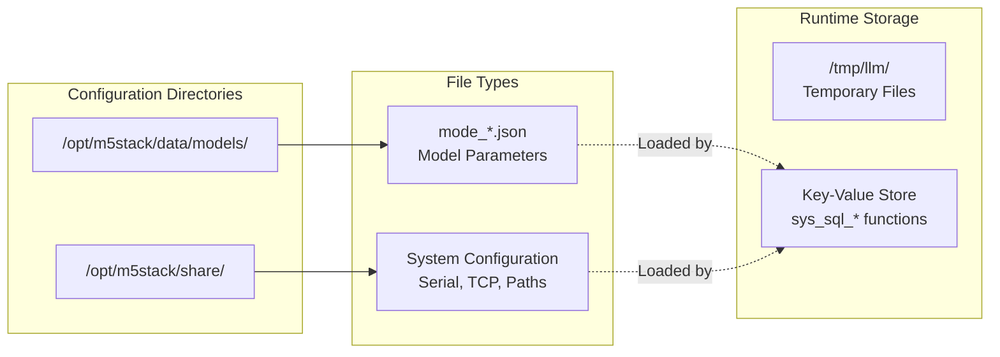
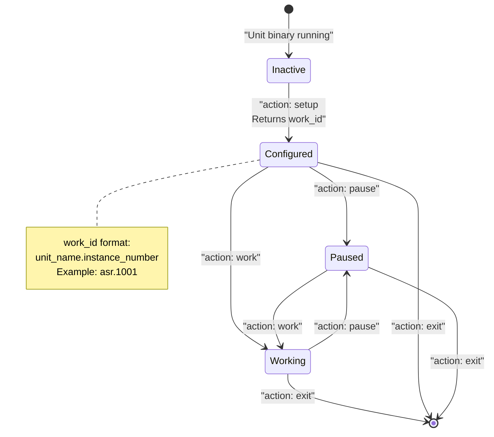
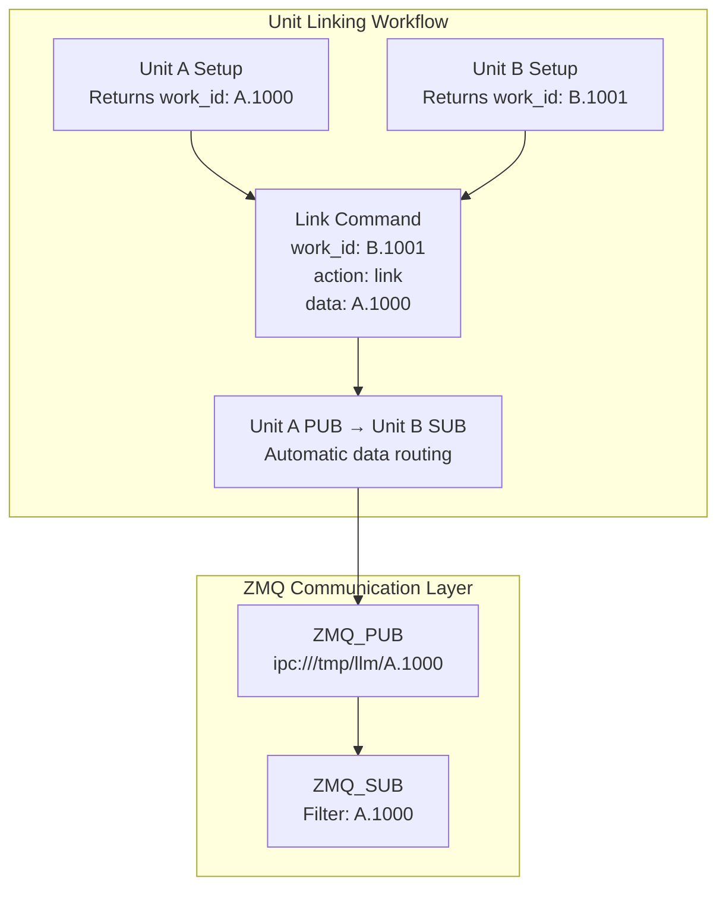
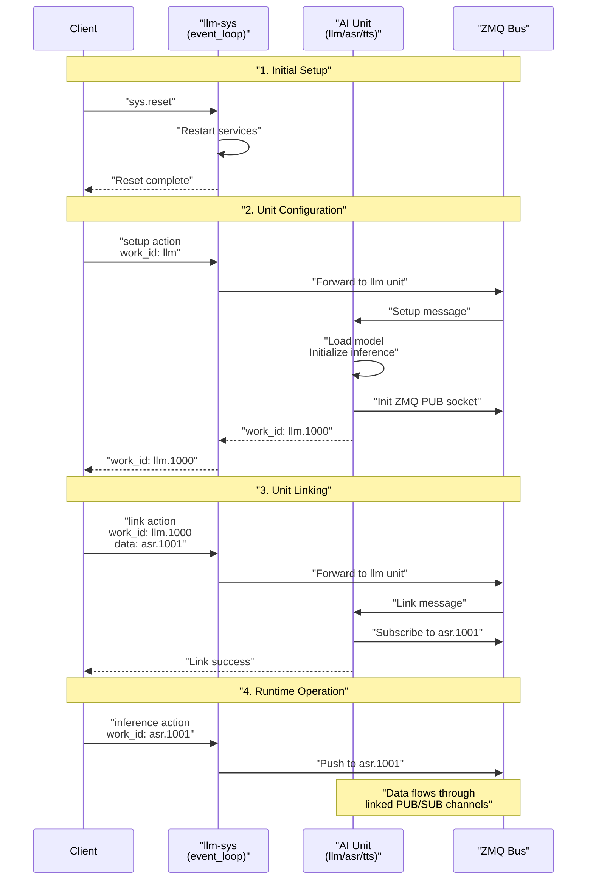

StackFlow Configuration and Usage

# Configuration and Usage

<details>
<summary>Relevant source files</summary>

The following files were used as context for generating this wiki page:

- [README.md](README.md)
- [README_zh.md](README_zh.md)
- [doc/component_doc/StackFlow_en.md](doc/component_doc/StackFlow_en.md)
- [doc/component_doc/StackFlow_zh.md](doc/component_doc/StackFlow_zh.md)
- [projects/llm_framework/README.md](projects/llm_framework/README.md)
- [projects/llm_framework/main_sys/include/zmq_bus.h](projects/llm_framework/main_sys/include/zmq_bus.h)
- [projects/llm_framework/main_sys/src/event_loop.cpp](projects/llm_framework/main_sys/src/event_loop.cpp)
- [projects/llm_framework/main_sys/src/serial_com.cpp](projects/llm_framework/main_sys/src/serial_com.cpp)
- [projects/llm_framework/main_sys/src/tcp_com.cpp](projects/llm_framework/main_sys/src/tcp_com.cpp)
- [projects/llm_framework/main_sys/src/zmq_bus.cpp](projects/llm_framework/main_sys/src/zmq_bus.cpp)

</details>


This page provides a practical guide to configuring and operating the StackFlow framework. It covers the communication interfaces, configuration file structure, and basic operational workflows needed to deploy AI services on embedded devices.

For detailed configuration file structure, see [JSON Configuration Files](#8.1). For step-by-step unit setup procedures, see [Unit Setup and Linking](#8.2). For complete end-to-end examples, see [Voice Assistant Pipeline Example](#8.3) and [Multimodal Vision Pipeline Example](#8.4).

## Communication Interfaces

StackFlow exposes two communication interfaces for external control and data exchange:

### UART Interface

The default serial interface operates at 115200 baud with 8 data bits, 1 stop bit, and no parity. Configuration parameters can be modified at runtime using the `sys.uartsetup` command.

```
Device: /dev/ttyS* (platform-specific)
Baud Rate: 115200 (configurable)
Protocol: JSON over serial
```

The UART interface implementation uses a `zmq_bus_com` derivative that bridges Linux UART to ZMQ messaging internally.

**Sources:** [projects/llm_framework/main_sys/src/serial_com.cpp:28-85](), [README_zh.md:192]()

### TCP Interface

The TCP server listens on port 10001 by default, supporting multiple concurrent client connections. Each connection is assigned a unique ZMQ communication port internally (8000-65535 range).

```
Default Port: 10001 (configurable)
Protocol: JSON over TCP
Connection Model: Multi-client, persistent connections
```

The TCP implementation uses the `hv::TcpServer` library with automatic connection lifecycle management and per-connection ZMQ channels.

**Sources:** [projects/llm_framework/main_sys/src/tcp_com.cpp:30-113](), [README_zh.md:192]()

### JSON Protocol Format

All commands and responses use a standardized JSON structure:

```json
{
  "request_id": "unique_identifier",
  "work_id": "unit_name.instance_id",
  "action": "setup|work|pause|exit|link|unlink|taskinfo",
  "object": "object_type.format",
  "data": <varies_by_action>
}
```

| Field | Purpose | Example |
|-------|---------|---------|
| `request_id` | Client-assigned unique identifier for request tracking | `"1"`, `"abc123"` |
| `work_id` | Target unit name or specific instance | `"llm"`, `"asr.1001"` |
| `action` | RPC function to invoke | `"setup"`, `"inference"` |
| `object` | Data type or command variant | `"llm.setup"`, `"sys.ping"` |
| `data` | Action-specific parameters | JSON object or string |

**Sources:** [projects/llm_framework/main_sys/src/event_loop.cpp:770-843](), [projects/llm_framework/README.md:36-106]()

## Configuration File Locations



**Sources:** [README_zh.md:186-190](), [projects/llm_framework/main_sys/src/event_loop.cpp:293-351]()

### Model Configuration Files

Model-specific parameters are stored in `mode_*.json` files located in `/opt/m5stack/data/models/`. Each file defines parameters for a specific AI model:

```
/opt/m5stack/data/models/mode_qwen2.5-0.5B-prefill-20e.json
/opt/m5stack/data/models/mode_melotts-zh-cn.json
/opt/m5stack/data/models/mode_yolo11n.json
```

These files contain model paths, inference parameters, and hardware acceleration settings. They are referenced by the `"model"` field in unit setup commands.

### System Configuration Files

System-level settings (serial port, TCP port, directory paths) are stored in `/opt/m5stack/share/`. These are loaded at startup and accessible through the `sys_sql_select` key-value interface.

```
config_serial_baud: 115200
config_tcp_server: 10001
config_lsmod_dir: /opt/m5stack/data/models/
```

**Sources:** [projects/llm_framework/main_sys/src/event_loop.cpp:85-93](), [README_zh.md:186-190]()

## Unit Lifecycle and Work IDs



### Work ID Assignment

When a unit receives a `setup` action, it:
1. Parses the configuration from the `data` field
2. Loads the specified model
3. Generates a unique work_id: `<unit_name>.<instance_number>`
4. Returns the work_id in the response

Example setup command and response:

```json
Request:
{
  "request_id": "1",
  "work_id": "asr",
  "action": "setup",
  "data": {
    "model": "sherpa-ncnn-streaming-zipformer-zh-14M-2023-02-23",
    "input": "sys.pcm",
    "response_format": "asr.utf-8.stream"
  }
}

Response:
{
  "request_id": "1",
  "work_id": "asr.1001",
  "created": 1731488371,
  "error": {"code": 0, "message": ""},
  "object": "None",
  "data": "None"
}
```

The returned `work_id` (`"asr.1001"`) is used for all subsequent operations on this specific unit instance.

**Sources:** [projects/llm_framework/README.md:108-114](), [doc/component_doc/StackFlow_zh.md:303-340]()

## Unit Linking and Data Flow



Units are linked using the `link` action to create data pipelines. When Unit B links to Unit A:

1. Unit B subscribes to Unit A's ZMQ PUB socket
2. Unit B filters messages by work_id
3. Unit A's output automatically routes to Unit B's input handler

Example linking sequence:

```json
{
  "request_id": "2",
  "work_id": "llm.1002",
  "action": "link",
  "object": "work_id",
  "data": "asr.1001"
}
```

This subscribes the LLM unit (instance 1002) to receive output from the ASR unit (instance 1001).

**Sources:** [projects/llm_framework/README.md:116-156](), [projects/llm_framework/main_sys/include/zmq_bus.h:23-78]()

## Common System Operations

### Listing Available Models

The `sys.lsmode` command returns all available model configurations:

```json
Request:
{
  "request_id": "1",
  "work_id": "sys",
  "action": "lsmode"
}

Response:
{
  "request_id": "1",
  "work_id": "sys",
  "created": 1731488371,
  "object": "sys.lsmode",
  "data": [
    {
      "model": "qwen2.5-0.5B-prefill-20e",
      "type": "llm",
      ...
    }
  ]
}
```

The system scans the `config_lsmod_dir` directory and parses all `*.json` files.

**Sources:** [projects/llm_framework/main_sys/src/event_loop.cpp:293-351]()

### Hardware Information

Query system hardware status with `sys.hwinfo`:

```json
Request:
{
  "request_id": "1",
  "work_id": "sys",
  "action": "hwinfo"
}

Response:
{
  "object": "sys.hwinfo",
  "data": {
    "temperature": 45000,
    "cpu_loadavg": 35,
    "mem": 42,
    "eth_info": [
      {"name": "eth0", "ip": "192.168.1.100", "speed": "1000"}
    ]
  }
}
```

The command reads `/proc/stat` for CPU usage, `/proc/meminfo` for memory, and `/sys/class/thermal/thermal_zone0/temp` for temperature.

**Sources:** [projects/llm_framework/main_sys/src/event_loop.cpp:128-196]()

### System Reset

Reset all units to initial state:

```json
{
  "request_id": "1",
  "work_id": "sys",
  "action": "reset"
}
```

This command restarts all `llm-*` systemd services, clearing all unit instances and configurations.

**Sources:** [projects/llm_framework/main_sys/src/event_loop.cpp:696-706](), [projects/llm_framework/README.md:33-44]()

## File Transfer Operations

### Pushing Files to Device

Transfer files to the device using `sys.push`:

```json
{
  "request_id": "1",
  "work_id": "sys",
  "action": "push",
  "object": "sys.base64.stream.file./opt/data/model.bin",
  "data": {
    "index": 0,
    "delta": "<base64_encoded_chunk>",
    "finish": false
  }
}
```

The `object` field format specifies:
- `base64`: Content is base64 encoded
- `stream`: Data sent in chunks
- `file.<path>`: Destination file path (must be absolute)

**Sources:** [projects/llm_framework/main_sys/src/event_loop.cpp:404-482]()

### Pulling Files from Device

Retrieve files using `sys.pull`:

```json
{
  "request_id": "1",
  "work_id": "sys",
  "action": "pull",
  "object": "sys.base64.stream.file./opt/data/model.bin"
}
```

The system reads the file, encodes it to base64, and streams it back in chunks based on `config_sys_stream_length`.

**Sources:** [projects/llm_framework/main_sys/src/event_loop.cpp:484-540]()

## Command Execution

Execute shell commands remotely using `sys.bashexec`:

```json
{
  "request_id": "1",
  "work_id": "sys",
  "action": "bashexec",
  "object": "sys.utf-8.stream",
  "data": "ls -la /opt/m5stack"
}
```

The command executes in a pseudo-terminal with output streamed back in real-time. The `stream` modifier enables incremental output delivery.

**Sources:** [projects/llm_framework/main_sys/src/event_loop.cpp:593-694]()

## Configuration Workflow Pattern



**Sources:** [projects/llm_framework/main_sys/src/event_loop.cpp:770-843](), [projects/llm_framework/main_sys/src/zmq_bus.cpp:160-175]()

## Error Handling

All responses include an `error` field with standardized error codes:

| Code | Meaning | Typical Cause |
|------|---------|---------------|
| 0 | Success | Operation completed normally |
| -1 | Internal error | Unexpected runtime error |
| -2 | JSON parse error | Malformed JSON in request |
| -3 | Action match false | Unknown action for unit |
| -4 | Inference push failed | Unit not found or not ready |
| -5 | Model load failed | Model file missing or corrupt |
| -6 | Unit does not exist | Invalid work_id reference |
| -9 | Unit call false | RPC communication failure |

Example error response:

```json
{
  "request_id": "1",
  "work_id": "sys",
  "created": 1731488371,
  "object": "None",
  "error": {
    "code": -5,
    "message": "Model loading failed."
  },
  "data": "None"
}
```

**Sources:** [projects/llm_framework/main_sys/src/event_loop.cpp:44-56](), [projects/llm_framework/main_sys/src/event_loop.cpp:777-842]()