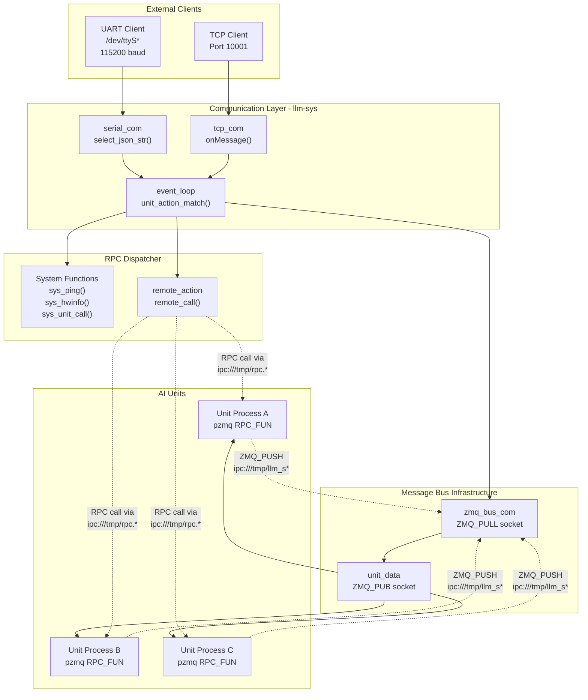
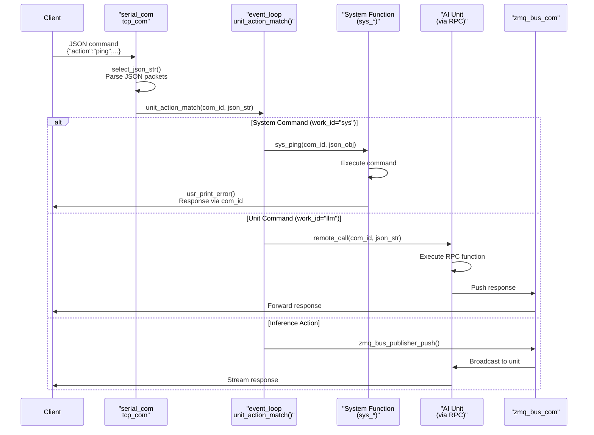
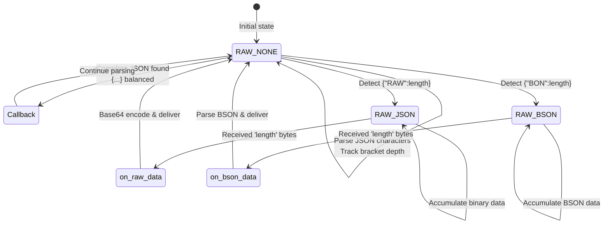
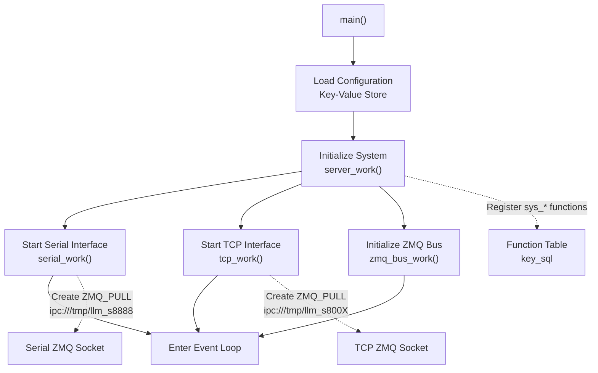

StackFlow Core Framework

# Core Framework

<details>
<summary>Relevant source files</summary>

The following files were used as context for generating this wiki page:

- [ext_components/StackFlow/stackflow/pzmq.hpp](ext_components/StackFlow/stackflow/pzmq.hpp)
- [ext_components/ax_msp/Kconfig](ext_components/ax_msp/Kconfig)
- [projects/llm_framework/SConstruct](projects/llm_framework/SConstruct)
- [projects/llm_framework/config_defaults.mk](projects/llm_framework/config_defaults.mk)
- [projects/llm_framework/main_sys/include/zmq_bus.h](projects/llm_framework/main_sys/include/zmq_bus.h)
- [projects/llm_framework/main_sys/src/event_loop.cpp](projects/llm_framework/main_sys/src/event_loop.cpp)
- [projects/llm_framework/main_sys/src/serial_com.cpp](projects/llm_framework/main_sys/src/serial_com.cpp)
- [projects/llm_framework/main_sys/src/tcp_com.cpp](projects/llm_framework/main_sys/src/tcp_com.cpp)
- [projects/llm_framework/main_sys/src/zmq_bus.cpp](projects/llm_framework/main_sys/src/zmq_bus.cpp)

</details>


## Purpose and Scope

The Core Framework provides the foundational infrastructure that enables all AI units in StackFlow to communicate, coordinate, and process requests. It consists of three primary layers: the `pzmq` ZeroMQ communication wrapper, the `llm-sys` system controller that routes commands and manages units, and the external communication interfaces (UART and TCP) that accept user requests.

For detailed information about specific aspects:
- ZeroMQ socket types and message patterns: see [StackFlow and pzmq Communication](#2.1)
- System command routing and RPC dispatcher: see [System Controller (llm-sys)](#2.2)
- Unit lifecycle and RPC functions: see [RPC and Unit Management](#2.3)
- Message channels and subscriber patterns: see [Message Channels and Linking](#2.4)

## Architecture Overview

The core framework implements a distributed message-passing architecture where the `llm-sys` process acts as the central coordinator between external clients and internal AI units.

### High-Level Component Diagram



**Sources:** [projects/llm_framework/main_sys/src/event_loop.cpp:1-844](), [projects/llm_framework/main_sys/src/zmq_bus.cpp:1-300](), [projects/llm_framework/main_sys/src/serial_com.cpp:1-129](), [projects/llm_framework/main_sys/src/tcp_com.cpp:1-114]()

## Core Components

### pzmq: ZeroMQ C++ Wrapper

The `pzmq` class provides a C++ abstraction over the libzmq library, implementing socket lifecycle management, reconnection logic, and message routing. Each instance encapsulates a single ZeroMQ socket with associated context and thread management.

#### Socket Type Support

| Socket Type | Mode Flag | Binding Behavior | Primary Use Case |
|------------|-----------|------------------|------------------|
| `ZMQ_PUB` | `ZMQ_PUB` | Binds | Broadcasting data streams |
| `ZMQ_SUB` | `ZMQ_SUB` | Connects | Subscribing to data streams |
| `ZMQ_PUSH` | `ZMQ_PUSH` | Connects | Sending tasks to workers |
| `ZMQ_PULL` | `ZMQ_PULL` | Binds | Receiving tasks from producers |
| `ZMQ_REP` | `ZMQ_RPC_FUN` | Binds | RPC server (request handler) |
| `ZMQ_REQ` | `ZMQ_RPC_CALL` | Connects | RPC client (request sender) |

The class defines custom flags `ZMQ_RPC_FUN` and `ZMQ_RPC_CALL` at [ext_components/StackFlow/stackflow/pzmq.hpp:17-18]() to distinguish RPC sockets from standard ZeroMQ types internally.

#### Key Methods

```cpp
// RPC action registration for server sockets
int register_rpc_action(const std::string &action, const rpc_callback_fun &raw_call)

// RPC call invocation for client sockets
int call_rpc_action(const std::string &action, const std::string &data, 
                    const msg_callback_fun &raw_call)

// Socket creation and URL binding/connection
int creat(const std::string &url, const msg_callback_fun &raw_call = nullptr)

// Data transmission
int send_data(const std::string &raw)
int send_data(const char *raw, int size)
```

The `pzmq` class automatically spawns a worker thread for sockets that receive data (SUB, PULL, REP) via the `zmq_event_loop()` method at [ext_components/StackFlow/stackflow/pzmq.hpp:348-393](), which continuously polls for incoming messages.

#### Reconnection Strategy

For client sockets (SUB, PUSH, REQ), `pzmq` configures automatic reconnection with exponential backoff:
- Initial reconnection interval: 100ms
- Maximum reconnection interval: 1000ms

This configuration is applied at [ext_components/StackFlow/stackflow/pzmq.hpp:240-253]() for SUB and PUSH sockets.

**Sources:** [ext_components/StackFlow/stackflow/pzmq.hpp:1-507]()

### System Controller: llm-sys Process

The `llm-sys` binary serves as the central coordinator, accepting commands from external interfaces and routing them to appropriate handlers. It implements three core responsibilities:

1. **Command Ingestion** - Receives JSON-RPC requests via UART or TCP
2. **Request Dispatch** - Routes commands to system functions or AI units
3. **Response Delivery** - Returns results to the originating client

#### Command Flow Sequence



**Sources:** [projects/llm_framework/main_sys/src/event_loop.cpp:770-843](), [projects/llm_framework/main_sys/src/serial_com.cpp:47-71](), [projects/llm_framework/main_sys/src/tcp_com.cpp:77-93]()

#### Request Parser: unit_action_match()

The `unit_action_match()` function at [projects/llm_framework/main_sys/src/event_loop.cpp:770-843]() serves as the main dispatch router. It uses the `simdjson` library for high-performance JSON parsing:

```cpp
void unit_action_match(int com_id, const std::string &json_str)
```

**Parameters:**
- `com_id` - Unique identifier for the communication channel (ZMQ port number)
- `json_str` - JSON-RPC formatted command string

**Routing Logic:**

1. **Extract Core Fields** - Parses `request_id`, `work_id`, and `action` using simdjson
2. **Route by work_id Prefix:**
   - If `work_id` starts with "sys" → Dispatch to system functions
   - If `action` == "inference" → Push to unit via ZMQ_PUB socket
   - Otherwise → Forward to unit via RPC call

The function maintains a lookup table `key_sql` mapping action strings to function pointers:

```cpp
typedef int (*sys_fun_call)(int, const nlohmann::json &);
std::map<std::string, sys_fun_call> key_sql;
```

This table is populated in `server_work()` at [projects/llm_framework/main_sys/src/event_loop.cpp:743-762]():

```cpp
key_sql["sys.ping"]      = sys_ping;
key_sql["sys.hwinfo"]    = sys_hwinfo;
key_sql["sys.unit_call"] = sys_unit_call;
// ... additional system commands
```

**Sources:** [projects/llm_framework/main_sys/src/event_loop.cpp:770-843](), [projects/llm_framework/main_sys/src/event_loop.cpp:743-762]()

### Communication Interfaces

StackFlow supports two external communication interfaces, both implementing the abstract `zmq_bus_com` base class defined at [projects/llm_framework/main_sys/include/zmq_bus.h:43-77]().

#### Serial Communication (serial_com)

The `serial_com` class at [projects/llm_framework/main_sys/src/serial_com.cpp:28-85]() provides UART-based communication:

**Configuration Parameters:**
- Device: `/dev/ttyS*` (configured via `config_serial_dev`)
- Baud rate: Configurable (default 115200)
- Data bits: 8
- Stop bits: 1
- Parity: None

The implementation uses Linux termios for serial port control via `linux_uart_*` functions. Data reception occurs in a select()-based event loop at [projects/llm_framework/main_sys/src/serial_com.cpp:47-71]().

**Initialization:**
```cpp
void serial_work()
{
    uart_t uart_parm;
    // Read config from key-value store
    SAFE_READING(uart_parm.baud, int, "config_serial_baud");
    serial_con_ = std::make_unique<serial_com>(&uart_parm, dev_name);
    serial_con_->work(zmq_s_format, port);
}
```

#### TCP Communication (tcp_com)

The `tcp_com` class at [projects/llm_framework/main_sys/src/tcp_com.cpp:33-59]() implements network-based communication using the `libhv` event-driven networking library:

**Configuration:**
- Listen port: 10001 (configured via `config_tcp_server`)
- Thread pool: 2 worker threads
- Connection handling: Per-connection context objects

Each TCP connection spawns a unique ZMQ_PULL socket on a dynamically assigned port (8000-65535 range) at [projects/llm_framework/main_sys/src/tcp_com.cpp:61-75]():

```cpp
void onConnection(const SocketChannelPtr& channel)
{
    if (channel->isConnected()) {
        auto p_com = channel->newContextPtr<tcp_com>();
        p_com->work(zmq_s_format, counter_port.fetch_add(1));
    }
}
```

**Sources:** [projects/llm_framework/main_sys/src/serial_com.cpp:1-129](), [projects/llm_framework/main_sys/src/tcp_com.cpp:1-114](), [projects/llm_framework/main_sys/include/zmq_bus.h:43-77]()

### Message Bus: zmq_bus_com

The `zmq_bus_com` class provides robust JSON message framing and parsing for streaming data. It handles three message formats:

1. **Standard JSON** - Bracketed JSON objects `{...}`
2. **Raw Binary with JSON Header** - Format: `{"RAW":length}{binary_data}`
3. **BSON with JSON Header** - Format: `{"BON":length}{bson_data}`

#### JSON Stream Parser

The `select_json_str()` method at [projects/llm_framework/main_sys/src/zmq_bus.cpp:196-300]() implements a state machine that extracts complete JSON objects from continuous byte streams:



The parser uses SIMD acceleration on ARM platforms at [projects/llm_framework/main_sys/src/zmq_bus.cpp:207-223]() to quickly scan for JSON bracket characters (`{` and `}`).

#### Unit Data Management

The `unit_data` class at [projects/llm_framework/main_sys/include/zmq_bus.h:23-38]() represents a registered AI unit with its ZMQ_PUB socket for broadcasting inference requests:

```cpp
class unit_data {
private:
    std::unique_ptr<pzmq> user_inference_chennal_;
public:
    std::string work_id;
    std::string inference_url;
    void init_zmq(const std::string &url);
    void send_msg(const std::string &json_str);
};
```

The function `zmq_bus_publisher_push()` at [projects/llm_framework/main_sys/src/zmq_bus.cpp:160-175]() broadcasts messages to units by looking up the `unit_data` instance in the global key-value store.

**Sources:** [projects/llm_framework/main_sys/src/zmq_bus.cpp:1-300](), [projects/llm_framework/main_sys/include/zmq_bus.h:23-38]()

## System Initialization Flow

The `llm-sys` process initializes through a coordinated startup sequence:



**Key Initialization Steps:**

1. **Configuration Loading** - Read parameters from persistent key-value store
2. **Function Registration** - Populate `key_sql` map with system command handlers at [projects/llm_framework/main_sys/src/event_loop.cpp:743-762]()
3. **Serial Interface** - Open UART device and create listener thread
4. **TCP Server** - Bind to port 10001 with libhv event loop
5. **ZMQ Bus** - Initialize global communication infrastructure

**Sources:** [projects/llm_framework/main_sys/src/event_loop.cpp:743-762](), [projects/llm_framework/main_sys/src/serial_com.cpp:88-123](), [projects/llm_framework/main_sys/src/tcp_com.cpp:95-109]()

## Build System Integration

The core framework components are built as part of the main system binary through the SCons build system.

### Component Structure

The main system is defined in the top-level `SConstruct` at [projects/llm_framework/SConstruct:1-32]():

```python
version = 'v0.1.3'
static_lib = 'static_lib'
```

The build system downloads pre-compiled static libraries from a remote repository at:
```
https://m5stack.oss-cn-shenzhen.aliyuncs.com/resource/linux/llm/static_lib_v0.1.3.tar.gz
```

These libraries include:
- `libzmq.a` - ZeroMQ messaging library
- `libhv.a` - High-performance event loop library
- Third-party dependencies (JSON parsers, BSON, etc.)

### Platform Configuration

The build system uses Kconfig-style configuration at [projects/llm_framework/config_defaults.mk:1-26]() to select target hardware:

```makefile
CONFIG_TOOLCHAIN_PATH="/opt/gcc-arm-10.3-2021.07-x86_64-aarch64-none-linux-gnu/bin"
CONFIG_TOOLCHAIN_PREFIX="aarch64-none-linux-gnu-"
CONFIG_AX_MSP_ENABLED=y
CONFIG_AX630C_OPENWRT_SDK_ENABLED=y
CONFIG_STACKFLOW_ENABLED=y
```

The `CONFIG_STACKFLOW_ENABLED` flag enables compilation of the StackFlow framework and pzmq wrapper.

**Hardware Platform Selection:**

The Kconfig file at [ext_components/ax_msp/Kconfig:1-51]() defines available AXERA NPU platforms:
- `CONFIG_AX_620E_MSP_ENABLED` - AX620E (v2.0.0 BSP)
- `CONFIG_AX_650C_MSP_ENABLED` - AX650C (v3.6.2 BSP)
- `CONFIG_AX_520_MSP_ENABLED` - AX520

**Sources:** [projects/llm_framework/SConstruct:1-32](), [projects/llm_framework/config_defaults.mk:1-26](), [ext_components/ax_msp/Kconfig:1-51]()

## IPC Socket Naming Convention

StackFlow uses Unix domain sockets for inter-process communication with a standardized naming scheme:

| Socket Type | Path Template | Purpose |
|------------|---------------|---------|
| RPC Server | `ipc:///tmp/rpc.{unit_name}` | Unit RPC endpoint |
| Data Streams | `ipc:///tmp/llm_s{port}` | Response delivery channel |
| Inference Input | `ipc:///tmp/llm_{work_id}` | Broadcast inference requests |

The format strings are defined globally:
- `zmq_s_format` - Serial/TCP communication sockets: `"ipc:///tmp/llm_s%d"`
- `zmq_c_format` - Client response channels: `"ipc:///tmp/llm_s%d"`

These sockets persist in `/tmp/` and are automatically cleaned up on process termination at [ext_components/StackFlow/stackflow/pzmq.hpp:400-407]():

```cpp
if (access(socket_file.c_str(), F_OK) == 0) {
    remove(socket_file.c_str());
}
```

**Sources:** [ext_components/StackFlow/stackflow/pzmq.hpp:400-407]()

## Error Handling and Response Format

All responses from the system follow a standardized JSON-RPC format implemented by the `usr_print_error()` helper at [projects/llm_framework/main_sys/src/event_loop.cpp:44-56]():

```json
{
  "request_id": "user_supplied_id",
  "work_id": "sys",
  "created": 1234567890,
  "error": {
    "code": 0,
    "message": "Success"
  },
  "object": "sys.utf-8",
  "data": "response_data"
}
```

**Common Error Codes:**

| Code | Message | Cause |
|------|---------|-------|
| 0 | Success | Operation completed |
| -1 | reace reset | JSON parsing exception |
| -2 | json format error | Invalid JSON structure |
| -3 | action match false | Unknown action |
| -4 | inference data push false | ZMQ publish failed |
| -9 | unit call false | Unit RPC failed |
| -10 | Not available at the moment | Feature not implemented |
| -17 | file path error / file does not exist | Invalid file operation |

**Sources:** [projects/llm_framework/main_sys/src/event_loop.cpp:44-74]()

## Thread Safety and Concurrency

The core framework employs several concurrency patterns:

1. **Per-Connection Threads** - Each TCP connection spawns independent worker threads
2. **Detached Command Handlers** - Long-running system commands execute in detached threads (e.g., `sys_hwinfo` at [projects/llm_framework/main_sys/src/event_loop.cpp:190-196]())
3. **Mutex-Protected Dispatch** - The `unit_action_match_mtx` mutex at [projects/llm_framework/main_sys/src/event_loop.cpp:767]() serializes command processing
4. **Lock-Free Counters** - TCP port allocation uses atomic counters at [projects/llm_framework/main_sys/src/tcp_com.cpp:30]()

```cpp
std::mutex unit_action_match_mtx;
void unit_action_match(int com_id, const std::string &json_str)
{
    std::lock_guard<std::mutex> guard(unit_action_match_mtx);
    // ... dispatch logic
}
```

**Sources:** [projects/llm_framework/main_sys/src/event_loop.cpp:767-843](), [projects/llm_framework/main_sys/src/tcp_com.cpp:30]()