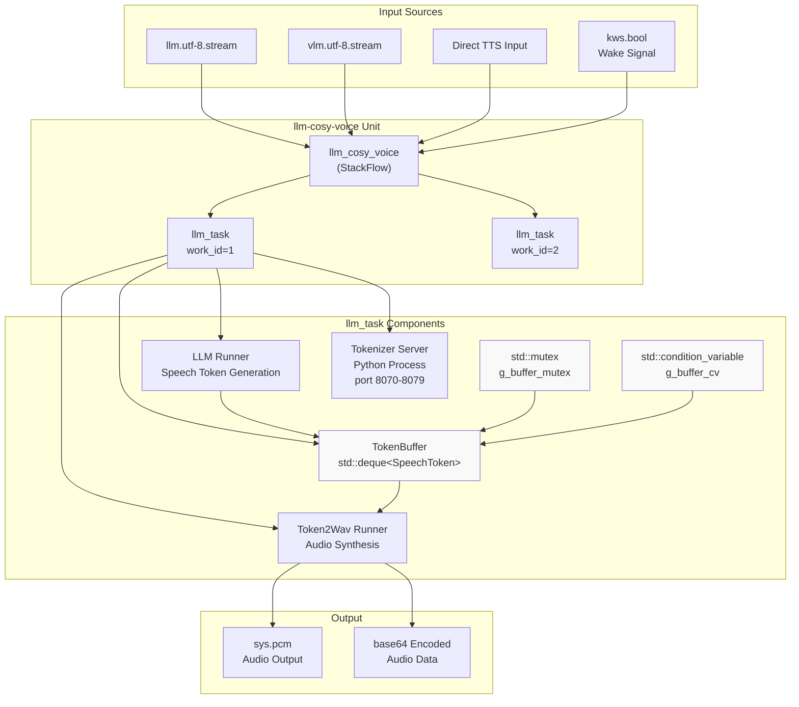
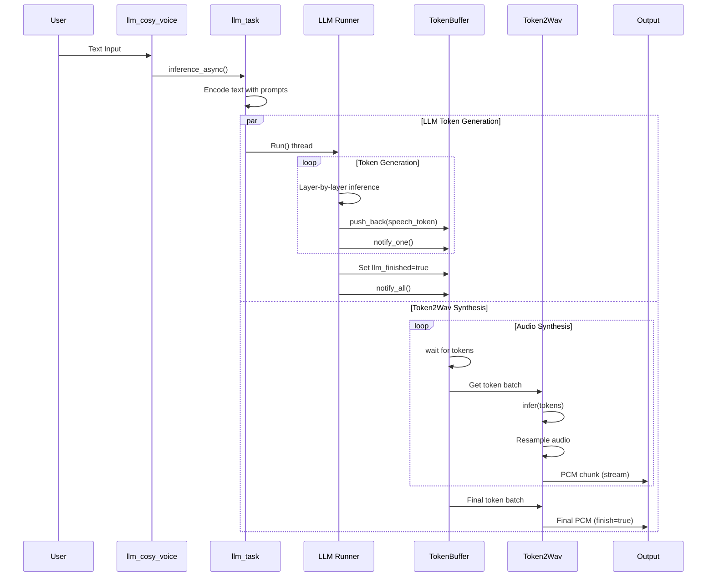
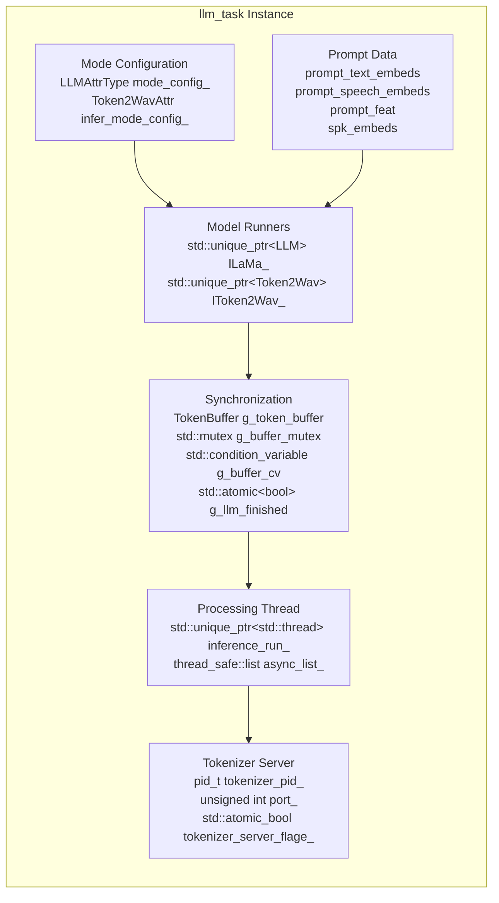
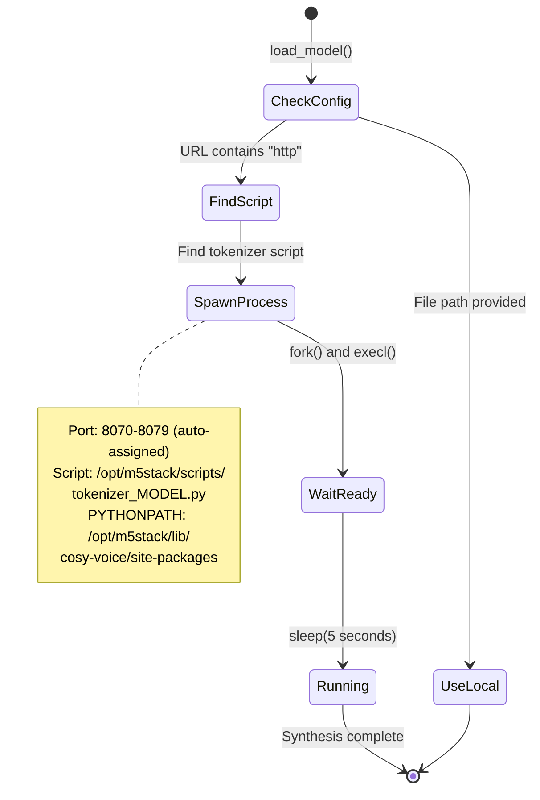
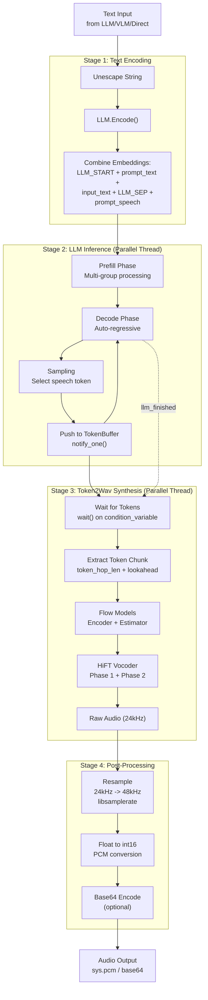
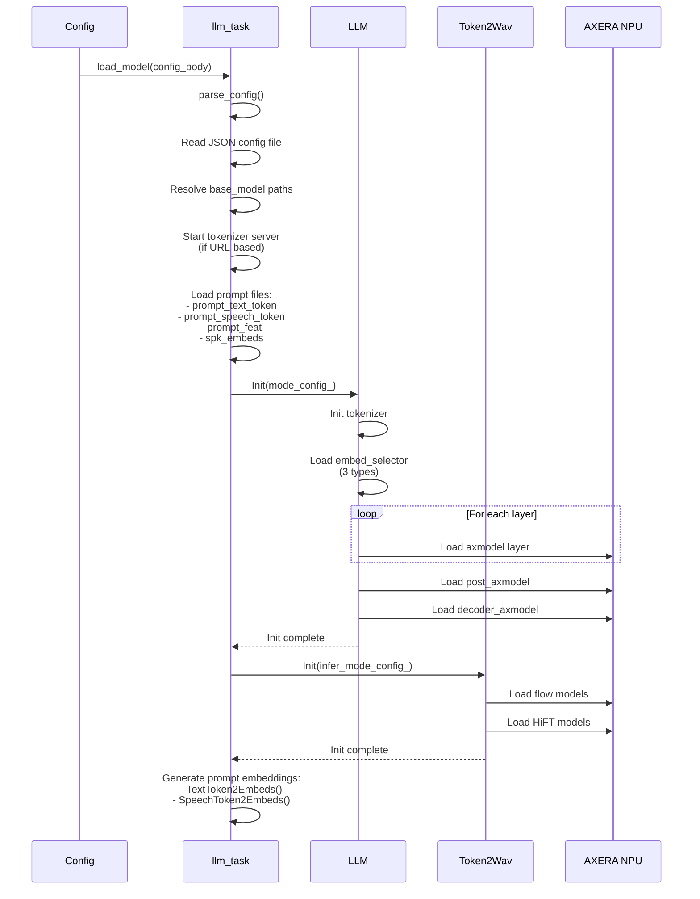
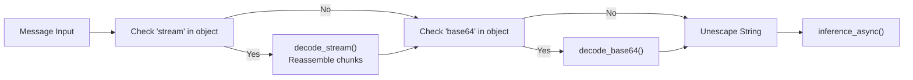

StackFlow CosyVoice (llm-cosy-voice)

# CosyVoice (llm-cosy-voice)

<details>
<summary>Relevant source files</summary>

The following files were used as context for generating this wiki page:

- [projects/llm_framework/main_cosy_voice/src/main.cpp](projects/llm_framework/main_cosy_voice/src/main.cpp)
- [projects/llm_framework/main_cosy_voice/src/runner/LLM.hpp](projects/llm_framework/main_cosy_voice/src/runner/LLM.hpp)

</details>


## Purpose and Scope

The `llm-cosy-voice` unit implements CosyVoice, a neural text-to-speech system that uses LLM-based token generation followed by Token2Wav synthesis. Unlike traditional TTS systems (see [Traditional TTS](#3.5.2)) and MeloTTS (see [MeloTTS](#3.5.1)), CosyVoice employs a two-stage auto-regressive approach: an LLM generates speech tokens from text, and a Token2Wav model converts these tokens into audio waveforms. Both stages run concurrently with NPU acceleration, enabling low-latency streaming synthesis.

This document covers the CosyVoice implementation, including its dual-model architecture, concurrent processing strategy, tokenizer server integration, and message handling patterns. For general LLM inference concepts, see [LLM Inference](#4.1).

**Sources:** [projects/llm_framework/main_cosy_voice/src/main.cpp:1-1032]()

---

## Architecture Overview

CosyVoice implements a concurrent two-stage synthesis pipeline where speech token generation and audio synthesis occur in parallel, synchronized through a thread-safe token buffer.

### High-Level Component Structure



**Sources:** [projects/llm_framework/main_cosy_voice/src/main.cpp:31-101](), [projects/llm_framework/main_cosy_voice/src/main.cpp:708-1019]()

### Concurrent Processing Flow



**Sources:** [projects/llm_framework/main_cosy_voice/src/main.cpp:405-571](), [projects/llm_framework/main_cosy_voice/src/runner/LLM.hpp:340-696]()

---

## Core Components

### llm_cosy_voice Class

The `llm_cosy_voice` class inherits from `StackFlow` and manages multiple concurrent synthesis tasks, implementing the standard RPC interface.

| RPC Function | Purpose | Key Operations |
|--------------|---------|----------------|
| `setup()` | Create and configure task | Load LLM and Token2Wav models, setup callbacks, subscribe to inputs |
| `link()` | Connect to data sources | Subscribe to `llm.utf-8.stream`, `vlm.utf-8.stream`, or `kws.bool` |
| `unlink()` | Disconnect sources | Stop subscriptions, remove input entries |
| `pause()` | Stop current synthesis | Call `lLaMa_->Stop()` |
| `exit()` | Destroy task | Stop threads, clear subscriptions, erase task |
| `taskinfo()` | Query task state | Return model, response_format, inputs |

**Key Data Members:**
- `std::unordered_map<int, std::shared_ptr<llm_task>> llm_task_` - Active task instances by work_id
- `MAX_TASK_NUM = 2` - Maximum concurrent tasks

**Sources:** [projects/llm_framework/main_cosy_voice/src/main.cpp:708-1019]()

### llm_task Class

The `llm_task` class manages a single synthesis instance with its own LLM runner, Token2Wav runner, tokenizer server, and processing thread.



**Key Methods:**

| Method | Purpose | Line Reference |
|--------|---------|----------------|
| `load_model()` | Parse config, load models, start tokenizer server | [main.cpp:149-331]() |
| `inference_async()` | Queue text for synthesis | [main.cpp:585-595]() |
| `inference()` | Execute synthesis | [main.cpp:597-604]() |
| `tts()` | Main synthesis pipeline | [main.cpp:405-571]() |
| `run()` | Background processing loop | [main.cpp:573-583]() |

**Sources:** [projects/llm_framework/main_cosy_voice/src/main.cpp:57-701]()

### LLM Runner (Speech Token Generation)

The `LLM` class performs auto-regressive inference to generate speech tokens from text input. It differs from standard LLM inference (see [LLM Inference](#4.1)) in that it uses specialized embeddings and outputs speech tokens rather than text tokens.

**Key Configuration (LLMAttrType):**
- `template_filename_axmodel` - Layer model path template (e.g., `"model_l%d.axmodel"`)
- `filename_post_axmodel` - Post-processing model
- `filename_decoder_axmodel` - Decoder model
- `filename_tokens_embed` - Text token embeddings
- `filename_llm_embed` - Special LLM tokens (start/separator)
- `filename_speech_embed` - Speech token embeddings
- `tokenizer_type` - HTTP tokenizer server or local
- `speech_embed_num = 6564` - Vocabulary size for speech tokens
- `mode_rate = 24000` - Internal audio sample rate
- `audio_rate = 48000` - Output audio sample rate

**Inference Pipeline:**
1. **Encoding** - `Encode()` combines prompt text embeddings + input text tokens + separator + prompt speech embeddings
2. **Prefill** - Multi-group prefill for prompt context (supports splits for long prompts)
3. **Decode** - Auto-regressive token generation with KV cache
4. **Sampling** - `sampling_ids()` selects next speech token
5. **Buffer** - Push tokens to `TokenBuffer` with condition variable notification

**Sources:** [projects/llm_framework/main_cosy_voice/src/runner/LLM.hpp:84-697](), [projects/llm_framework/main_cosy_voice/src/main.cpp:298-303]()

### Token2Wav Runner (Audio Synthesis)

The `Token2Wav` class converts speech tokens to audio waveforms using flow-based models and HiFT vocoder components.

**Model Components (Token2WavAttr):**
- `flow_input_embedding` - Embedding layer
- `rand_noise` - Noise model
- `speech_window` - Windowing function
- `flow_encoder_28/53/78` - Flow encoder stages
- `flow_encoder_50_final` - Final encoder
- `flow_estimator_200/250/300` - Flow estimator stages
- `hift_p2_50_first`, `hift_p2_58` - HiFT phase 2 models
- `hift_p1_50_first`, `hift_p1_58` - HiFT phase 1 models

**Processing Parameters:**
- `token_hop_len` - Token stride (typically 15-20 tokens)
- `pre_lookahead_len` - Lookahead window size
- `max_infer_chunk_num` - Maximum inference context
- `flow_embed_size = 512` - Flow embedding dimension

**Inference Loop:**
The Token2Wav waits for sufficient tokens in the buffer, then processes them in overlapping chunks:

```python
while not llm_finished:
    wait_for(token_buffer.size() >= token_hop_len + pre_lookahead_len)
    token_chunk = token_buffer[start:end]
    audio_chunk = infer(token_chunk, prompt_embeds, prompt_feat, spk_embeds)
    resample_and_output(audio_chunk)
    token_offset += token_hop_len
```

**Sources:** [projects/llm_framework/main_cosy_voice/src/main.cpp:432-537]()

---

## Tokenizer Server Integration

CosyVoice requires a Python-based tokenizer server for encoding text into token IDs. The server is automatically spawned as a child process when needed.

### Server Lifecycle



**Port Management:**
- Static counter starts at 8070: `std::atomic<unsigned int> next_port_{8070}`
- Each task gets unique port via `getNextPort()`: [main.cpp:624-632]()
- Wraps to 8070 after port 8079

**Process Spawning:**
```cpp
tokenizer_pid_ = fork();
if (tokenizer_pid_ == 0) {
    setenv("PYTHONPATH", "/opt/m5stack/lib/cosy-voice/site-packages", 1);
    execl("/usr/bin/python3", "python3", tokenizer_file.c_str(), 
          "--host", "localhost", "--port", port_str.c_str(), 
          "--model_id", model_id.c_str(), (char *)nullptr);
}
```

**Cleanup:**
Tokenizer processes are terminated in the destructor via `kill(tokenizer_pid_, SIGTERM)` and `waitpid()`.

**Sources:** [projects/llm_framework/main_cosy_voice/src/main.cpp:213-265](), [projects/llm_framework/main_cosy_voice/src/main.cpp:614-621](), [projects/llm_framework/main_cosy_voice/src/main.cpp:686-701]()

---

## Synthesis Pipeline

### Complete Pipeline Execution



**Sources:** [projects/llm_framework/main_cosy_voice/src/main.cpp:405-571](), [projects/llm_framework/main_cosy_voice/src/runner/LLM.hpp:288-338](), [projects/llm_framework/main_cosy_voice/src/runner/LLM.hpp:340-696]()

### Thread Synchronization Mechanism

The concurrent pipeline uses condition variables and atomic flags for synchronization:

```cpp
// LLM thread pushes tokens
{
    std::lock_guard<std::mutex> lock(buffer_mutex);
    token_buffer.push_back(max_index);
}
buffer_cv.notify_one();

// Token2Wav thread waits for tokens
{
    std::unique_lock<std::mutex> lock(g_buffer_mutex);
    g_buffer_cv.wait(lock, [&] {
        return (g_token_buffer.size() - token_offset >= 
                this_token_hop_len + pre_lookahead_len) ||
               g_llm_finished.load() || g_stop.load();
    });
}
```

**Control Flow:**
1. Token2Wav waits until buffer has enough tokens OR LLM finishes OR stop requested
2. LLM notifies after each token generation
3. Final synthesis occurs when `g_llm_finished` is set to true
4. Stop signal (`g_stop`) interrupts both threads

**Sources:** [projects/llm_framework/main_cosy_voice/src/main.cpp:454-504]()

### Audio Resampling

Audio is resampled from internal model rate (24kHz) to output rate (48kHz) using libsamplerate:

```cpp
void resample_audio(float *input_buffer, int input_length, 
                    float *output_buffer, int *output_length,
                    double src_ratio)
{
    SRC_STATE *src_state = src_new(SRC_SINC_FASTEST, 1, &error);
    SRC_DATA src_data;
    src_data.data_in = input_buffer;
    src_data.input_frames = input_length;
    src_data.src_ratio = src_ratio;  // audio_rate / mode_rate
    src_process(src_state, &src_data);
    *output_length = src_data.output_frames_gen;
}
```

After resampling, float samples are converted to 16-bit PCM:
```cpp
int16_t pcm_sample = static_cast<int16_t>(clamp(val, -1.0f, 1.0f) * 32767.0f);
```

**Sources:** [projects/llm_framework/main_cosy_voice/src/main.cpp:366-391](), [projects/llm_framework/main_cosy_voice/src/main.cpp:479-496]()

---

## Configuration and Model Files

### Configuration Structure

CosyVoice requires extensive configuration for both LLM and Token2Wav components. Configuration is loaded from JSON files using the `CONFIG_AUTO_SET` and `INFER_CONFIG_AUTO_SET` macros.

**Model Configuration File Structure:**
```json
{
  "mode_param": {
    "mode_rate": 24000,
    "audio_rate": 48000,
    "tokenizer_type": "HTTP",
    "url_tokenizer_model": "http://127.0.0.1:8070",
    "template_filename_axmodel": "model_l%d.axmodel",
    "axmodel_num": 22,
    "filename_post_axmodel": "post.axmodel",
    "filename_decoder_axmodel": "decoder.axmodel",
    "filename_tokens_embed": "embed_tokens.bf16.bin",
    "filename_llm_embed": "llm_embed.bf16.bin",
    "filename_speech_embed": "speech_embed.bf16.bin",
    "tokens_embed_num": 151936,
    "tokens_embed_size": 896,
    "speech_embed_num": 6564,
    "speech_embed_size": 896,
    "flow_input_embedding": "flow_input_embedding.axmodel",
    "flow_encoder_28": "flow_encoder_28.axmodel",
    "hift_p2_50_first": "hift_p2_50_first.axmodel",
    "prompt_dir": "prompts/default"
  }
}
```

**Prompt Directory Contents:**
- `prompt_text.txt` - Text prompt tokens
- `llm_prompt_speech_token.txt` - Speech prompt tokens
- `prompt_speech_feat.bin` - Speech feature vectors
- `flow_embedding.bin` - Speaker embeddings

**Sources:** [projects/llm_framework/main_cosy_voice/src/main.cpp:45-56](), [projects/llm_framework/main_cosy_voice/src/main.cpp:149-331]()

### Model Loading Sequence



**Sources:** [projects/llm_framework/main_cosy_voice/src/main.cpp:149-331](), [projects/llm_framework/main_cosy_voice/src/runner/LLM.hpp:111-240]()

---

## Message Handling and Integration

### Input Message Processing

CosyVoice accepts three types of inputs through the `task_user_data()` callback:

| Input Type | Object Pattern | Processing |
|------------|----------------|------------|
| LLM/VLM stream | `*.llm.*` or `*.vlm.*` | Subscribe to text generation stream |
| Direct TTS | `*.tts.*` | Direct text input |
| Wake signal | `*.kws.*` | Interrupt current synthesis via `kws_awake()` |

**Stream Decoding Pipeline:**


**Sources:** [projects/llm_framework/main_cosy_voice/src/main.cpp:775-818](), [projects/llm_framework/main_cosy_voice/src/main.cpp:820-830]()

### Output Message Format

Output format is controlled by the `response_format` field:

| Format | Description | Output |
|--------|-------------|--------|
| `stream` | Streaming chunks | `{"index": N, "delta": base64_data, "finish": false/true}` |
| `file` | Save to file | WAV file written to `output_path` |
| `sys.pcm.stream` | System audio | Direct playback via `unit_call("audio", "queue_play", data)` |
| Base | Single response | Base64-encoded full audio |

**Streaming Output Logic:**
```cpp
if (llm_channel->enstream_) {
    nlohmann::json data_body;
    data_body["index"] = count++;
    data_body["delta"] = base64_data;
    data_body["finish"] = finish;
    if (finish) count = 0;
    llm_channel->send(response_format, data_body, LLM_NO_ERROR);
}
```

**Sources:** [projects/llm_framework/main_cosy_voice/src/main.cpp:717-746]()

### Link Management

Setup establishes initial input subscriptions based on the `input` configuration field:

```cpp
for (const auto input : llm_task_obj->inputs_) {
    if (input.find("tts") != std::string::npos) {
        // Subscribe without filter for direct TTS
        llm_channel->subscriber_work_id("", task_user_data_callback);
    } else if (input.find("llm") || input.find("vlm")) {
        // Subscribe to specific work_id
        llm_channel->subscriber_work_id(input, task_user_data_callback);
    } else if (input.find("kws") != std::string::npos) {
        // Subscribe to wake signals
        llm_channel->subscriber_work_id(input, kws_awake_callback);
    }
}
```

Runtime `link()` and `unlink()` allow dynamic reconfiguration of input sources without recreating the task.

**Sources:** [projects/llm_framework/main_cosy_voice/src/main.cpp:865-882](), [projects/llm_framework/main_cosy_voice/src/main.cpp:896-931]()

---

## Memory and Resource Management

### NPU Initialization

CosyVoice uses reference counting for AXERA NPU initialization to support multiple concurrent tasks:

```cpp
static int ax_init_flage_ = 0;

void _ax_init() {
    if (!ax_init_flage_) {
        AX_SYS_Init();
        AX_ENGINE_NPU_ATTR_T npu_attr;
        memset(&npu_attr, 0, sizeof(npu_attr));
        AX_ENGINE_Init(&npu_attr);
    }
    ax_init_flage_++;
}

void _ax_deinit() {
    if (ax_init_flage_ > 0) {
        --ax_init_flage_;
        if (!ax_init_flage_) {
            AX_ENGINE_Deinit();
            AX_SYS_Deinit();
        }
    }
}
```

Each `llm_task` calls `_ax_init()` in constructor and `_ax_deinit()` in destructor, ensuring NPU resources are only released when all tasks are destroyed.

**Sources:** [projects/llm_framework/main_cosy_voice/src/main.cpp:634-660](), [projects/llm_framework/main_cosy_voice/src/main.cpp:95](), [projects/llm_framework/main_cosy_voice/src/main.cpp:704]()

### Dynamic Layer Loading

For memory efficiency, CosyVoice supports dynamic layer loading where axmodel layers are loaded/unloaded during inference:

```cpp
if (attr.b_dynamic_load_axmodel_layer) {
    // Load layer data into memory or mmap
    if (!attr.b_use_mmap_load_layer) {
        read_file(layer.filename, layer.layer_buffer_vec);
    } else {
        layer.layer_buffer.open_file(layer.filename.c_str());
    }
    
    // During inference, init from buffer
    layer.layer.init(layer.layer_buffer.data(), layer.layer_buffer.size());
    layer.layer.inference(grpid);
    layer.layer.deinit();  // Unload after use
}
```

This allows running larger models (22+ layers) with limited CMM memory by only keeping one layer active at a time.

**Sources:** [projects/llm_framework/main_cosy_voice/src/runner/LLM.hpp:161-172](), [projects/llm_framework/main_cosy_voice/src/runner/LLM.hpp:429-438](), [projects/llm_framework/main_cosy_voice/src/runner/LLM.hpp:577-587]()

### KV Cache Management

Similar to standard LLM inference (see [Model Architecture and KV Cache](#4.3)), CosyVoice maintains KV caches across layers. After inference completes, caches are cleared:

```cpp
for (size_t i = 0; i < attr.axmodel_num; i++) {
    for (size_t j = 0; j < llama_layers[i].layer.get_num_input_groups(); j++) {
        memset(llama_layers[i].layer.get_input(j, "K_cache").pVirAddr, 0,
               llama_layers[i].layer.get_input(j, "K_cache").nSize);
        memset(llama_layers[i].layer.get_input(j, "V_cache").pVirAddr, 0,
               llama_layers[i].layer.get_input(j, "V_cache").nSize);
    }
}
```

**Sources:** [projects/llm_framework/main_cosy_voice/src/runner/LLM.hpp:686-693]()

---

## Performance Characteristics

### Latency Breakdown

CosyVoice tracks two key metrics:

**Time to First Token (TTFT):**
```cpp
timer ttft_timer;
ttft_timer.start();
// ... prefill + first decode ...
ALOGI("ttft: %.2f ms", ttft_timer.cost());
```

**Token Generation Speed:**
```cpp
ALOGN("hit eos, decode avg %.2f token/s\n", 
      cached_token.size() / (t_cost_ms / 1000));
```

The concurrent architecture enables audio output to begin as soon as the first token batch is available, rather than waiting for complete text-to-speech conversion.

**Streaming Latency:**
- First audio chunk: TTFT + token_hop_len synthesis time
- Subsequent chunks: token_hop_len generation time (overlapped with synthesis)
- Final chunk: Remaining token synthesis time

**Sources:** [projects/llm_framework/main_cosy_voice/src/main.cpp:545](), [projects/llm_framework/main_cosy_voice/src/runner/LLM.hpp:682-684]()

### Memory Requirements

| Component | Memory Type | Typical Size |
|-----------|-------------|--------------|
| Text embeddings | CMM | ~130MB (151936 tokens × 896 dim × 2 bytes) |
| LLM embeddings | CMM | ~3.6KB (2 tokens × 896 dim × 2 bytes) |
| Speech embeddings | CMM | ~11.8MB (6564 tokens × 896 dim × 2 bytes) |
| LLM layers (22) | CMM or Mmap | Varies by model (dynamic loading reduces active memory) |
| Token2Wav models | CMM | ~100-200MB total |
| KV cache (per layer) | CMM | kv_cache_num × kv_cache_size × 2 bytes |
| Token buffer | System RAM | Negligible (~few KB) |

**Sources:** [projects/llm_framework/main_cosy_voice/src/runner/LLM.hpp:52-69]()