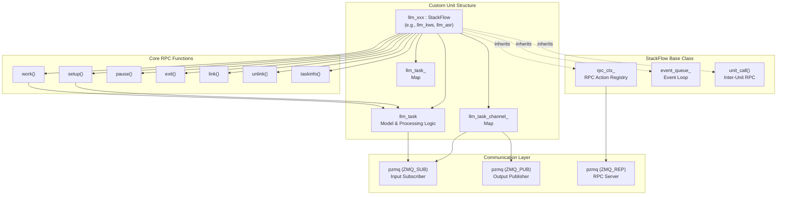
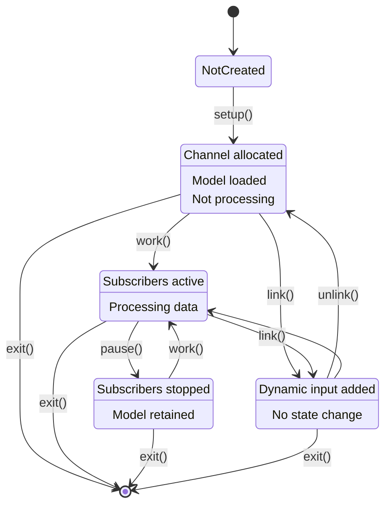
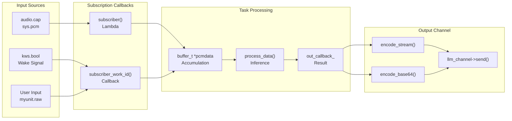

StackFlow Creating Custom Units

# Creating Custom Units

<details>
<summary>Relevant source files</summary>

The following files were used as context for generating this wiki page:

- [ext_components/StackFlow/stackflow/pzmq.hpp](ext_components/StackFlow/stackflow/pzmq.hpp)
- [ext_components/ax_msp/Kconfig](ext_components/ax_msp/Kconfig)
- [projects/llm_framework/SConstruct](projects/llm_framework/SConstruct)
- [projects/llm_framework/config_defaults.mk](projects/llm_framework/config_defaults.mk)
- [projects/llm_framework/main_asr/src/main.cpp](projects/llm_framework/main_asr/src/main.cpp)
- [projects/llm_framework/main_kws/src/main.cpp](projects/llm_framework/main_kws/src/main.cpp)
- [projects/llm_framework/main_vad/src/main.cpp](projects/llm_framework/main_vad/src/main.cpp)
- [projects/llm_framework/main_whisper/src/main.cpp](projects/llm_framework/main_whisper/src/main.cpp)

</details>


This page provides a comprehensive guide for developers who want to create custom units that extend the StackFlow framework. It covers the class structure, required RPC function implementations, configuration management, data flow patterns, and build system integration.

For information about the StackFlow base class and communication infrastructure, see [Core Framework](#2). For details on model integration and inference engines, see [Model Integration](#10.2). For JSON RPC protocol specifications, see [JSON RPC Protocol](#9.1).

---

## Overview

A StackFlow unit is a self-contained processing component that:
- Inherits from the `StackFlow` base class
- Implements seven standard RPC functions for lifecycle management
- Communicates via ZeroMQ pub/sub and RPC patterns
- Can subscribe to data streams from other units
- Publishes output through channel objects
- Loads models and configuration from JSON files

**Sources:** [projects/llm_framework/main_kws/src/main.cpp:1-944](), [ext_components/StackFlow/stackflow/pzmq.hpp:1-507]()

---

## Unit Architecture



**Diagram: Unit Class Architecture**

Custom units follow a two-class pattern: the outer unit class inheriting from `StackFlow` manages lifecycle and communication, while the inner `llm_task` class encapsulates model-specific logic. The `StackFlow` base provides RPC infrastructure, event queue, and inter-unit communication.

**Sources:** [projects/llm_framework/main_kws/src/main.cpp:626-644](), [projects/llm_framework/main_vad/src/main.cpp:238-250]()

---

## Class Structure

### Unit Class Declaration

Your unit class must inherit from `StackFlow` and provide a unique unit name:

```cpp
class llm_myunit : public StackFlow {
private:
    int task_count_;  // Maximum concurrent tasks
    std::string input_url_;  // Cached input source URL
    std::unordered_map<int, std::shared_ptr<llm_task>> llm_task_;  // Task instances by work_id
    
public:
    llm_myunit() : StackFlow("myunit") {
        task_count_ = 1;  // Usually 1 for most units
    }
    
    // Implement 7 core RPC functions
    int setup(const std::string &work_id, const std::string &object, const std::string &data) override;
    void work(const std::string &work_id, const std::string &object, const std::string &data) override;
    void pause(const std::string &work_id, const std::string &object, const std::string &data) override;
    int exit(const std::string &work_id, const std::string &object, const std::string &data) override;
    void link(const std::string &work_id, const std::string &object, const std::string &data) override;
    void unlink(const std::string &work_id, const std::string &object, const std::string &data) override;
    void taskinfo(const std::string &work_id, const std::string &object, const std::string &data) override;
};
```

The unit name passed to `StackFlow` constructor (e.g., `"myunit"`) becomes the RPC endpoint identifier. The system will create IPC socket at `ipc:///tmp/rpc.myunit`.

**Sources:** [projects/llm_framework/main_kws/src/main.cpp:626-644](), [projects/llm_framework/main_vad/src/main.cpp:238-250]()

---

### Task Class Structure

The `llm_task` class encapsulates model loading, inference, and data processing:

```cpp
class llm_task {
private:
    // Model-specific members (e.g., inference engine, config)
    std::unique_ptr<SomeInferenceEngine> model_;
    ConfigStruct config_;
    
public:
    // Configuration from setup
    std::string model_;
    std::string response_format_;
    std::vector<std::string> inputs_;
    bool enoutput_;
    bool enstream_;
    bool ensleep_;
    
    // Atomic flags for state management
    std::atomic_bool audio_flage_;
    std::atomic_bool awake_flage_;
    
    // Callback for output
    task_callback_t out_callback_;
    
    // Buffer for input data
    buffer_t *pcmdata;
    
    // Parse JSON config
    bool parse_config(const nlohmann::json &config_body);
    
    // Load model files and initialize inference engine
    int load_model(const nlohmann::json &config_body);
    
    // Process incoming data
    void process_data(const std::string &raw);
    
    // Set output callback
    void set_output(task_callback_t out_callback);
    
    llm_task(const std::string &workid);
    ~llm_task();
};
```

The task class is instantiated per work_id, allowing multiple concurrent instances with different configurations.

**Sources:** [projects/llm_framework/main_kws/src/main.cpp:52-622](), [projects/llm_framework/main_asr/src/main.cpp:66-494]()

---

## Implementing Core RPC Functions

### Setup Function

The `setup` function creates a new task instance, loads the model, and configures input/output channels:

```cpp
int setup(const std::string &work_id, const std::string &object, const std::string &data) override {
    nlohmann::json error_body;
    
    // Check task limit
    if ((llm_task_channel_.size() - 1) >= task_count_) {
        error_body["code"] = -21;
        error_body["message"] = "task full";
        send("None", "None", error_body, "myunit");
        return -1;
    }
    
    // Parse configuration
    nlohmann::json config_body;
    try {
        config_body = nlohmann::json::parse(data);
    } catch (...) {
        error_body["code"] = -2;
        error_body["message"] = "json format error.";
        send("None", "None", error_body, "myunit");
        return -2;
    }
    
    // Create task and channel
    int work_id_num = sample_get_work_id_num(work_id);
    auto llm_channel = get_channel(work_id);
    auto llm_task_obj = std::make_shared<llm_task>(work_id);
    
    // Load model
    int ret = llm_task_obj->load_model(config_body);
    if (ret != 0) {
        error_body["code"] = -5;
        error_body["message"] = "Model loading failed.";
        send("None", "None", error_body, "myunit");
        return -1;
    }
    
    // Configure channel
    llm_channel->set_output(llm_task_obj->enoutput_);
    llm_channel->set_stream(llm_task_obj->enstream_);
    
    // Setup output callback
    std::weak_ptr<llm_task> _llm_task_obj = llm_task_obj;
    std::weak_ptr<llm_channel_obj> _llm_channel = llm_channel;
    llm_task_obj->set_output(std::bind(&llm_myunit::task_output, this, _llm_task_obj, 
                                       _llm_channel, std::placeholders::_1, std::placeholders::_2));
    
    // Setup input subscribers
    for (const auto &input : llm_task_obj->inputs_) {
        if (input.find("sys.pcm") != std::string::npos) {
            // Subscribe to audio capture
            input_url_ = unit_call("audio", "cap", "None");
            llm_channel->subscriber(input_url_, 
                [_llm_task_obj](pzmq *_pzmq, const std::shared_ptr<pzmq_data> &raw) {
                    auto p = _llm_task_obj.lock();
                    if (p) p->process_data(raw->string());
                });
            llm_task_obj->audio_flage_ = true;
        } else if (input.find("myunit") != std::string::npos) {
            // Subscribe to work_id filtered messages
            llm_channel->subscriber_work_id("", 
                std::bind(&llm_myunit::task_user_data, this, _llm_task_obj, _llm_channel,
                         std::placeholders::_1, std::placeholders::_2));
        }
    }
    
    // Store task instance
    llm_task_[work_id_num] = llm_task_obj;
    
    send("None", "None", LLM_NO_ERROR, work_id);
    return 0;
}
```

Key steps:
1. Validate request and check capacity
2. Parse JSON configuration
3. Create task instance and load model
4. Configure output channel settings
5. Bind output callback with weak pointers
6. Subscribe to input sources based on configuration
7. Store task in map for future operations

**Sources:** [projects/llm_framework/main_kws/src/main.cpp:846-916](), [projects/llm_framework/main_vad/src/main.cpp:392-459]()

---

### Work and Pause Functions

```cpp
void work(const std::string &work_id, const std::string &object, const std::string &data) override {
    nlohmann::json error_body;
    int work_id_num = sample_get_work_id_num(work_id);
    
    if (llm_task_.find(work_id_num) == llm_task_.end()) {
        error_body["code"] = -6;
        error_body["message"] = "Unit Does Not Exist";
        send("None", "None", error_body, work_id);
        return;
    }
    
    task_work(llm_task_[work_id_num], get_channel(work_id_num));
    send("None", "None", LLM_NO_ERROR, work_id);
}

void pause(const std::string &work_id, const std::string &object, const std::string &data) override {
    nlohmann::json error_body;
    int work_id_num = sample_get_work_id_num(work_id);
    
    if (llm_task_.find(work_id_num) == llm_task_.end()) {
        error_body["code"] = -6;
        error_body["message"] = "Unit Does Not Exist";
        send("None", "None", error_body, work_id);
        return;
    }
    
    task_pause(llm_task_[work_id_num], get_channel(work_id_num));
    send("None", "None", LLM_NO_ERROR, work_id);
}

void task_work(const std::weak_ptr<llm_task> llm_task_obj_weak,
               const std::weak_ptr<llm_channel_obj> llm_channel_weak) {
    auto llm_task_obj = llm_task_obj_weak.lock();
    auto llm_channel = llm_channel_weak.lock();
    if (!(llm_task_obj && llm_channel)) return;
    
    if (!input_url_.empty() && !llm_task_obj->audio_flage_) {
        std::weak_ptr<llm_task> _llm_task_obj = llm_task_obj;
        llm_channel->subscriber(input_url_, 
            [_llm_task_obj](pzmq *_pzmq, const std::shared_ptr<pzmq_data> &raw) {
                auto p = _llm_task_obj.lock();
                if (p) p->process_data(raw->string());
            });
        llm_task_obj->audio_flage_ = true;
    }
}

void task_pause(const std::weak_ptr<llm_task> llm_task_obj_weak,
                const std::weak_ptr<llm_channel_obj> llm_channel_weak) {
    auto llm_task_obj = llm_task_obj_weak.lock();
    auto llm_channel = llm_channel_weak.lock();
    if (!(llm_task_obj && llm_channel)) return;
    
    if (llm_task_obj->audio_flage_) {
        if (!input_url_.empty()) llm_channel->stop_subscriber(input_url_);
        llm_task_obj->audio_flage_ = false;
    }
}
```

`work` activates the unit by subscribing to inputs. `pause` deactivates by unsubscribing. These enable power-efficient operation where units only process data when needed.

**Sources:** [projects/llm_framework/main_kws/src/main.cpp:737-765](), [projects/llm_framework/main_vad/src/main.cpp:360-390]()

---

### Link and Unlink Functions

```cpp
void link(const std::string &work_id, const std::string &object, const std::string &data) override {
    int ret = 0;
    nlohmann::json error_body;
    int work_id_num = sample_get_work_id_num(work_id);
    
    if (llm_task_.find(work_id_num) == llm_task_.end()) {
        error_body["code"] = -6;
        error_body["message"] = "Unit Does Not Exist";
        send("None", "None", error_body, work_id);
        return;
    }
    
    auto llm_channel = get_channel(work_id);
    auto llm_task_obj = llm_task_[work_id_num];
    
    // Parse link data format: "source_unit.output_type"
    if (data.find("sys.pcm") != std::string::npos) {
        if (input_url_.empty()) input_url_ = unit_call("audio", "cap", data);
        std::weak_ptr<llm_task> _llm_task_obj = llm_task_obj;
        llm_channel->subscriber(input_url_, 
            [_llm_task_obj](pzmq *_pzmq, const std::shared_ptr<pzmq_data> &raw) {
                auto p = _llm_task_obj.lock();
                if (p) p->process_data(raw->string());
            });
        llm_task_obj->audio_flage_ = true;
        llm_task_obj->inputs_.push_back(data);
    } else if (data.find("kws.bool") != std::string::npos) {
        ret = llm_channel->subscriber_work_id(data,
            std::bind(&llm_myunit::kws_awake, this, std::weak_ptr<llm_task>(llm_task_obj),
                     std::weak_ptr<llm_channel_obj>(llm_channel), 
                     std::placeholders::_1, std::placeholders::_2));
        llm_task_obj->inputs_.push_back(data);
    }
    
    if (ret) {
        error_body["code"] = -20;
        error_body["message"] = "link false";
        send("None", "None", error_body, work_id);
    } else {
        send("None", "None", LLM_NO_ERROR, work_id);
    }
}

void unlink(const std::string &work_id, const std::string &object, const std::string &data) override {
    nlohmann::json error_body;
    int work_id_num = sample_get_work_id_num(work_id);
    
    if (llm_task_.find(work_id_num) == llm_task_.end()) {
        error_body["code"] = -6;
        error_body["message"] = "Unit Does Not Exist";
        send("None", "None", error_body, work_id);
        return;
    }
    
    auto llm_channel = get_channel(work_id);
    auto llm_task_obj = llm_task_[work_id_num];
    
    llm_channel->stop_subscriber_work_id(data);
    
    // Remove from inputs list
    for (auto it = llm_task_obj->inputs_.begin(); it != llm_task_obj->inputs_.end();) {
        if (*it == data) {
            it = llm_task_obj->inputs_.erase(it);
        } else {
            ++it;
        }
    }
    
    send("None", "None", LLM_NO_ERROR, work_id);
}
```

`link` dynamically adds data sources after setup. `unlink` removes them. This allows runtime reconfiguration of processing pipelines.

**Sources:** [projects/llm_framework/main_kws/src/main.cpp:918-975](), [projects/llm_framework/main_vad/src/main.cpp:461-527]()

---

### Exit and TaskInfo Functions

```cpp
int exit(const std::string &work_id, const std::string &object, const std::string &data) override {
    nlohmann::json error_body;
    int work_id_num = sample_get_work_id_num(work_id);
    
    if (llm_task_.find(work_id_num) == llm_task_.end()) {
        error_body["code"] = -6;
        error_body["message"] = "Unit Does Not Exist";
        send("None", "None", error_body, work_id);
        return -1;
    }
    
    llm_task_[work_id_num]->stop();
    auto llm_channel = get_channel(work_id_num);
    llm_channel->stop_subscriber("");
    
    if (llm_task_[work_id_num]->audio_flage_) {
        unit_call("audio", "cap_stop", "None");
    }
    
    llm_task_.erase(work_id_num);
    send("None", "None", LLM_NO_ERROR, work_id);
    return 0;
}

void taskinfo(const std::string &work_id, const std::string &object, const std::string &data) override {
    nlohmann::json req_body;
    int work_id_num = sample_get_work_id_num(work_id);
    
    if (WORK_ID_NONE == work_id_num) {
        // List all tasks
        std::vector<std::string> task_list;
        std::transform(llm_task_channel_.begin(), llm_task_channel_.end(), 
                      std::back_inserter(task_list),
                      [](const auto task_channel) { return task_channel.second->work_id_; });
        req_body = task_list;
        send("myunit.tasklist", req_body, LLM_NO_ERROR, work_id);
    } else {
        // Get specific task info
        if (llm_task_.find(work_id_num) == llm_task_.end()) {
            req_body["code"] = -6;
            req_body["message"] = "Unit Does Not Exist";
            send("None", "None", req_body, work_id);
            return;
        }
        
        auto llm_task_obj = llm_task_[work_id_num];
        req_body["model"] = llm_task_obj->model_;
        req_body["response_format"] = llm_task_obj->response_format_;
        req_body["enoutput"] = llm_task_obj->enoutput_;
        req_body["inputs"] = llm_task_obj->inputs_;
        send("myunit.taskinfo", req_body, LLM_NO_ERROR, work_id);
    }
}
```

`exit` performs cleanup and removes the task instance. `taskinfo` provides introspection of running tasks.

**Sources:** [projects/llm_framework/main_vad/src/main.cpp:556-577](), [projects/llm_framework/main_vad/src/main.cpp:529-554]()

---

## RPC Function Lifecycle



**Diagram: Unit Lifecycle State Machine**

The seven RPC functions manage the unit through distinct states. `setup` initializes, `work`/`pause` control processing, `link`/`unlink` modify connections, `taskinfo` inspects state, and `exit` destroys the instance.

**Sources:** [projects/llm_framework/main_kws/src/main.cpp:737-977]()

---

## Configuration and Model Loading

### Configuration File Structure

Units load configuration from JSON files located at `/opt/m5stack/data/models/<model_name>/config.json`:

```json
{
    "mode_param": {
        "model_file": "model.axmodel",
        "tokens": "tokens.txt",
        "threshold": 0.9,
        "sample_rate": 16000,
        "num_threads": 4,
        "provider": "CPUExecutionProvider"
    }
}
```

### Configuration Loading Pattern

```cpp
int load_model(const nlohmann::json &config_body) {
    if (parse_config(config_body)) {
        return -1;
    }
    
    nlohmann::json file_body;
    std::list<std::string> config_file_paths = 
        get_config_file_paths(base_model_path_, base_model_config_path_, model_);
    
    for (auto file_name : config_file_paths) {
        std::ifstream config_file(file_name);
        if (!config_file.is_open()) {
            SLOGW("config file :%s miss", file_name.c_str());
            continue;
        }
        config_file >> file_body;
        config_file.close();
        break;
    }
    
    if (file_body.empty()) {
        SLOGE("all config file miss");
        return -2;
    }
    
    std::string base_model = base_model_path_ + model_ + "/";
    
    // Merge config_body overrides with file_body defaults
    #define CONFIG_AUTO_SET(obj, key) \
        if (config_body.contains(#key)) \
            mode_config_.key = config_body[#key]; \
        else if (obj.contains(#key)) \
            mode_config_.key = obj[#key];
    
    CONFIG_AUTO_SET(file_body["mode_param"], threshold);
    CONFIG_AUTO_SET(file_body["mode_param"], sample_rate);
    CONFIG_AUTO_SET(file_body["mode_param"], num_threads);
    
    // Prepend base path to relative file paths
    mode_config_.model_file = base_model + mode_config_.model_file;
    mode_config_.tokens = base_model + mode_config_.tokens;
    
    // Initialize inference engine
    model_ = std::make_unique<InferenceEngine>();
    if (0 != model_->Init(mode_config_.model_file.c_str())) {
        SLOGE("Init model failed!");
        return -5;
    }
    
    return 0;
}
```

The `CONFIG_AUTO_SET` macro pattern allows runtime parameters in `config_body` to override defaults from `file_body["mode_param"]`.

**Sources:** [projects/llm_framework/main_kws/src/main.cpp:161-294](), [projects/llm_framework/main_whisper/src/main.cpp:223-329]()

---

## Data Flow and Messaging

### Input Processing



**Diagram: Data Flow Through Unit**

Input data flows through ZMQ subscribers into callback functions, which accumulate data in buffers, trigger processing, and route results through output callbacks to the channel's send mechanism.

**Sources:** [projects/llm_framework/main_kws/src/main.cpp:484-539](), [projects/llm_framework/main_asr/src/main.cpp:501-553]()

---

### Output Callback Pattern

```cpp
void task_output(const std::weak_ptr<llm_task> llm_task_obj_weak,
                 const std::weak_ptr<llm_channel_obj> llm_channel_weak, 
                 const std::string &data, bool finish) {
    auto llm_task_obj = llm_task_obj_weak.lock();
    auto llm_channel = llm_channel_weak.lock();
    if (!(llm_task_obj && llm_channel)) {
        return;
    }
    
    if (data.empty()) {
        llm_channel->send(llm_task_obj->response_format_, true, LLM_NO_ERROR);
        return;
    }
    
    std::string tmp_msg1;
    const std::string *next_data = &data;
    if (finish) {
        tmp_msg1 = data + ".";
        next_data = &tmp_msg1;
    }
    
    if (llm_channel->enstream_) {
        static int count = 0;
        nlohmann::json data_body;
        data_body["index"] = count++;
        data_body["delta"] = (*next_data);
        data_body["finish"] = finish;
        if (finish) count = 0;
        
        llm_channel->send(llm_task_obj->response_format_, data_body, LLM_NO_ERROR);
    } else if (finish) {
        llm_channel->send(llm_task_obj->response_format_, (*next_data), LLM_NO_ERROR);
    }
}
```

The output callback bridges task processing to channel publishing. It handles streaming vs non-streaming output formats and manages the finish flag for completion signaling.

**Sources:** [projects/llm_framework/main_kws/src/main.cpp:646-677](), [projects/llm_framework/main_whisper/src/main.cpp:603-630]()

---

### Custom RPC Actions

Beyond the seven core functions, units can register custom RPC actions:

```cpp
llm_myunit() : StackFlow("myunit") {
    task_count_ = 1;
    
    // Register custom RPC action
    rpc_ctx_->register_rpc_action(
        "trigger", 
        [this](pzmq *_pzmq, const std::shared_ptr<StackFlows::pzmq_data> &data) -> std::string {
            this->event_queue_.enqueue(EVENT_TRIGGER, 
                std::make_shared<stackflow_data>(data->get_param(0), data->get_param(1)));
            return LLM_NONE;
        });
    
    // Register event handler
    event_queue_.appendListener(EVENT_TRIGGER, 
        std::bind(&llm_myunit::trigger_handler, this, std::placeholders::_1));
}

void trigger_handler(const std::shared_ptr<void> &arg) {
    auto data = std::static_pointer_cast<stackflow_data>(arg);
    // Handle trigger event
}
```

Custom actions are invoked via `unit_call("myunit", "trigger", "params")` and can enqueue events for asynchronous processing.

**Sources:** [projects/llm_framework/main_kws/src/main.cpp:634-644]()

---

## Build System Integration

### Component Directory Structure

```
projects/llm_framework/
├── main_myunit/
│   ├── SConstruct
│   └── src/
│       └── main.cpp
├── SConstruct (root)
└── config_defaults.mk
```

### Component SConstruct File

```python
Import('env')

env.Replace(PROJECT_NAME='llm-myunit')
env.Replace(BIN_NAME='llm_myunit')

SRCS = [
    'src/main.cpp',
]

INCLUDE = [
    'src',
]

REQUIREMENTS = [
    'StackFlow',
    'libzmq',
    'static_lib/inference_engine',  # Your inference library
    'utilities',
]

# Register component
env.AppendComponentRegister()
```

Key directives:
- `PROJECT_NAME`: Package name for dpkg (e.g., `llm-myunit_1.0.0_arm64.deb`)
- `BIN_NAME`: Executable name
- `SRCS`: Source file list
- `INCLUDE`: Header search paths
- `REQUIREMENTS`: Dependencies from ext_components or static_lib

**Sources:** [projects/llm_framework/SConstruct:1-32](), [ext_components/StackFlow/stackflow/pzmq.hpp:1-20]()

---

### Root SConstruct Integration

Add your component to the `COMPONENTS` list in the root `projects/llm_framework/SConstruct`:

```python
COMPONENTS = [
    'main_sys',
    'main_audio',
    'main_kws',
    'main_asr',
    'main_myunit',  # Add your component
    # ... other components
]
```

The SCons system will automatically build your component when you run `scons` or build specific components with `scons main_myunit`.

**Sources:** [projects/llm_framework/SConstruct:1-32]()

---

### Static Library Dependencies

For inference engines not part of ext_components, place them in `static_lib/`:

```
static_lib/
├── version
├── your_engine/
│   ├── lib/
│   │   └── libengine.so
│   └── include/
│       └── engine.h
```

Reference in REQUIREMENTS as `static_lib/your_engine`. The build system automatically adds lib paths with `-Wl,-rpath`.

**Sources:** [projects/llm_framework/SConstruct:8-31]()

---

## Complete Example: Simple Echo Unit

### main.cpp

```cpp
#include "StackFlow.h"
#include <signal.h>
#include <unistd.h>

using namespace StackFlows;

int main_exit_flage = 0;
static void __sigint(int iSigNo) {
    main_exit_flage = 1;
}

class llm_task {
public:
    std::string model_;
    std::string response_format_;
    std::vector<std::string> inputs_;
    bool enoutput_;
    bool enstream_;
    std::atomic_bool audio_flage_;
    std::function<void(const std::string &data, bool finish)> out_callback_;
    
    bool parse_config(const nlohmann::json &config_body) {
        try {
            model_ = config_body.at("model");
            response_format_ = config_body.at("response_format");
            enoutput_ = config_body.at("enoutput");
            if (config_body.contains("input")) {
                inputs_.push_back(config_body["input"].get<std::string>());
            }
        } catch (...) {
            return true;
        }
        enstream_ = response_format_.find("stream") != std::string::npos;
        return false;
    }
    
    int load_model(const nlohmann::json &config_body) {
        if (parse_config(config_body)) return -1;
        // No actual model for echo unit
        return 0;
    }
    
    void set_output(std::function<void(const std::string &, bool)> callback) {
        out_callback_ = callback;
    }
    
    void process_data(const std::string &raw) {
        // Echo input back
        if (out_callback_) {
            out_callback_("Echo: " + raw, true);
        }
    }
    
    llm_task(const std::string &workid) : audio_flage_(false) {}
};

class llm_echo : public StackFlow {
private:
    int task_count_;
    std::string input_url_;
    std::unordered_map<int, std::shared_ptr<llm_task>> llm_task_;
    
public:
    llm_echo() : StackFlow("echo") {
        task_count_ = 1;
    }
    
    void task_output(const std::weak_ptr<llm_task> llm_task_obj_weak,
                     const std::weak_ptr<llm_channel_obj> llm_channel_weak,
                     const std::string &data, bool finish) {
        auto llm_task_obj = llm_task_obj_weak.lock();
        auto llm_channel = llm_channel_weak.lock();
        if (!(llm_task_obj && llm_channel)) return;
        
        if (finish) {
            llm_channel->send(llm_task_obj->response_format_, data, LLM_NO_ERROR);
        }
    }
    
    int setup(const std::string &work_id, const std::string &object, 
              const std::string &data) override {
        nlohmann::json error_body;
        nlohmann::json config_body;
        
        try {
            config_body = nlohmann::json::parse(data);
        } catch (...) {
            error_body["code"] = -2;
            error_body["message"] = "json format error.";
            send("None", "None", error_body, "echo");
            return -2;
        }
        
        int work_id_num = sample_get_work_id_num(work_id);
        auto llm_channel = get_channel(work_id);
        auto llm_task_obj = std::make_shared<llm_task>(work_id);
        
        int ret = llm_task_obj->load_model(config_body);
        if (ret != 0) {
            error_body["code"] = -5;
            error_body["message"] = "Model loading failed.";
            send("None", "None", error_body, "echo");
            return -1;
        }
        
        llm_channel->set_output(llm_task_obj->enoutput_);
        llm_channel->set_stream(llm_task_obj->enstream_);
        
        std::weak_ptr<llm_task> _llm_task_obj = llm_task_obj;
        std::weak_ptr<llm_channel_obj> _llm_channel = llm_channel;
        llm_task_obj->set_output(std::bind(&llm_echo::task_output, this,
            _llm_task_obj, _llm_channel, std::placeholders::_1, std::placeholders::_2));
        
        for (const auto &input : llm_task_obj->inputs_) {
            if (input.find("echo") != std::string::npos) {
                llm_channel->subscriber_work_id("",
                    [_llm_task_obj](const std::string &obj, const std::string &data) {
                        auto p = _llm_task_obj.lock();
                        if (p) p->process_data(data);
                    });
            }
        }
        
        llm_task_[work_id_num] = llm_task_obj;
        send("None", "None", LLM_NO_ERROR, work_id);
        return 0;
    }
    
    void work(const std::string &work_id, const std::string &object,
              const std::string &data) override {
        send("None", "None", LLM_NO_ERROR, work_id);
    }
    
    void pause(const std::string &work_id, const std::string &object,
               const std::string &data) override {
        send("None", "None", LLM_NO_ERROR, work_id);
    }
    
    int exit(const std::string &work_id, const std::string &object,
             const std::string &data) override {
        int work_id_num = sample_get_work_id_num(work_id);
        llm_task_.erase(work_id_num);
        send("None", "None", LLM_NO_ERROR, work_id);
        return 0;
    }
    
    void link(const std::string &work_id, const std::string &object,
              const std::string &data) override {
        send("None", "None", LLM_NO_ERROR, work_id);
    }
    
    void unlink(const std::string &work_id, const std::string &object,
                const std::string &data) override {
        send("None", "None", LLM_NO_ERROR, work_id);
    }
    
    void taskinfo(const std::string &work_id, const std::string &object,
                  const std::string &data) override {
        nlohmann::json req_body;
        req_body["status"] = "running";
        send("echo.taskinfo", req_body, LLM_NO_ERROR, work_id);
    }
};

int main(int argc, char *argv[]) {
    signal(SIGTERM, __sigint);
    signal(SIGINT, __sigint);
    mkdir("/tmp/llm", 0777);
    
    llm_echo echo_unit;
    while (!main_exit_flage) {
        sleep(1);
    }
    return 0;
}
```

This minimal example demonstrates all required components: task class, unit class with seven RPC functions, output callback, and main loop.

**Sources:** [projects/llm_framework/main_vad/src/main.cpp:596-606]()

---

## Best Practices

### Memory Management

| Pattern | Implementation | Rationale |
|---------|---------------|-----------|
| **Weak Pointers** | Use `std::weak_ptr` in callbacks | Prevents circular references between channels and tasks |
| **Buffer Objects** | Use `buffer_t` from buffer.h | Efficient ring buffer for audio/stream data |
| **Unique Pointers** | Use `std::unique_ptr` for models | Automatic resource cleanup |
| **Shared Pointers** | Use `std::shared_ptr` for task objects | Safe multi-threaded access |

### Thread Safety

- All RPC functions execute on the main event loop thread
- Use `std::atomic_bool` for flags accessed from subscriber callbacks
- Enqueue long-running operations to `event_queue_` rather than blocking RPC calls
- Lock `llm_task_` map access if modifying from custom threads

### Error Handling

```cpp
nlohmann::json error_body;
error_body["code"] = -error_code;
error_body["message"] = "Human readable description";
send("None", "None", error_body, work_id);
```

Standard error codes:
- `-2`: JSON parse error
- `-5`: Model loading failed
- `-6`: Unit does not exist
- `-11`: Model run failed
- `-20`: Link operation failed
- `-21`: Task capacity full
- `-23`: Base64 decode error
- `-25`: Stream data error

**Sources:** [projects/llm_framework/main_kws/src/main.cpp:742-750]()

---

### Configuration Overrides

Use the `CONFIG_AUTO_SET` macro pattern to allow both compile-time defaults (from model config file) and runtime overrides (from setup JSON):

```cpp
#define CONFIG_AUTO_SET(obj, key) \
    if (config_body.contains(#key)) \
        mode_config_.key = config_body[#key]; \
    else if (obj.contains(#key)) \
        mode_config_.key = obj[#key];

CONFIG_AUTO_SET(file_body["mode_param"], threshold);
CONFIG_AUTO_SET(file_body["mode_param"], sample_rate);
```

This pattern prioritizes runtime parameters while falling back to file defaults.

**Sources:** [projects/llm_framework/main_kws/src/main.cpp:155-159]()

---

### Input Subscription Patterns

```cpp
// Pattern 1: Direct URL subscription (for continuous data)
llm_channel->subscriber(input_url_, 
    [_llm_task_obj](pzmq *_pzmq, const std::shared_ptr<pzmq_data> &raw) {
        auto p = _llm_task_obj.lock();
        if (p) p->process_data(raw->string());
    });

// Pattern 2: Work ID filtered subscription (for event signals)
llm_channel->subscriber_work_id(input_filter,
    std::bind(&llm_myunit::handle_event, this, _llm_task_obj, _llm_channel,
             std::placeholders::_1, std::placeholders::_2));

// Pattern 3: System event subscription
std::string socket_url = "ipc:///tmp/llm/ec_prox.event.socket";
llm_channel->subscriber(socket_url,
    [llm_channel, business_logic](StackFlows::pzmq *p,
                                 const std::shared_ptr<StackFlows::pzmq_data> &d) {
        llm_channel->subscriber_event_call(business_logic, p, d);
    });
```

**Sources:** [projects/llm_framework/main_kws/src/main.cpp:878-903]()

---

## Summary

Creating a custom StackFlow unit requires:

1. **Class Structure**: Inherit from `StackFlow`, implement `llm_task` for model logic
2. **RPC Functions**: Implement all seven core functions (`setup`, `work`, `pause`, `exit`, `link`, `unlink`, `taskinfo`)
3. **Configuration**: Parse JSON configs with `CONFIG_AUTO_SET` pattern
4. **Data Flow**: Subscribe to inputs via `subscriber()`, output via callbacks and `llm_channel->send()`
5. **Build Integration**: Create component SConstruct, add to root COMPONENTS list
6. **Memory Safety**: Use weak pointers in callbacks, atomic flags for threading

The framework handles ZMQ communication, RPC dispatching, and channel management automatically. Your unit focuses on model loading, data processing, and output generation.

**Sources:** [projects/llm_framework/main_kws/src/main.cpp:1-977](), [projects/llm_framework/main_vad/src/main.cpp:1-606](), [ext_components/StackFlow/stackflow/pzmq.hpp:1-507]()