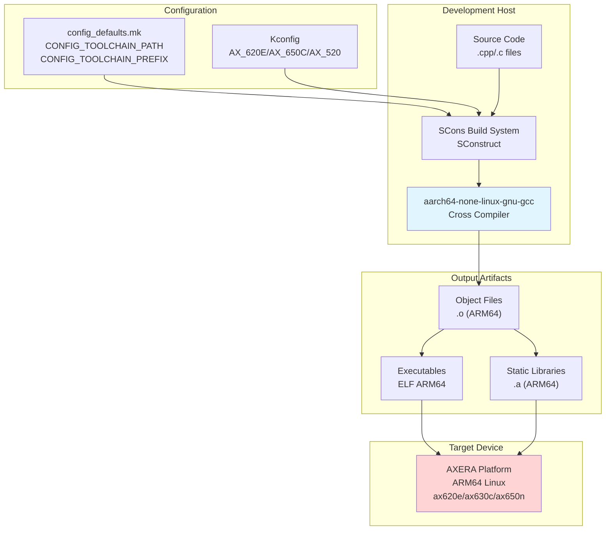
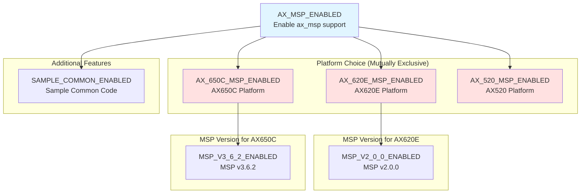
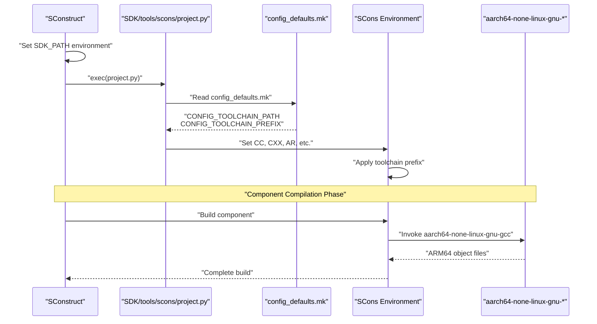

StackFlow Cross-Compilation and Toolchain

# Cross-Compilation and Toolchain

<details>
<summary>Relevant source files</summary>

The following files were used as context for generating this wiki page:

- [ext_components/StackFlow/stackflow/pzmq.hpp](ext_components/StackFlow/stackflow/pzmq.hpp)
- [ext_components/ax_msp/Kconfig](ext_components/ax_msp/Kconfig)
- [projects/llm_framework/SConstruct](projects/llm_framework/SConstruct)
- [projects/llm_framework/config_defaults.mk](projects/llm_framework/config_defaults.mk)

</details>


This document explains the cross-compilation infrastructure used to build StackFlow for ARM64 Linux targets. It covers the aarch64-none-linux-gnu toolchain configuration, Kconfig-based hardware platform selection, and BSP (Board Support Package) integration. For information about the broader build system architecture, see [SCons Build Overview](#6.1). For details on component-level compilation, see [Component Build Configuration](#6.2).

## Purpose and Scope

StackFlow is built using cross-compilation from x86_64 development hosts to ARM64 embedded Linux targets. The framework supports multiple AXERA NPU platforms (AX_620E, AX_630C, AX_650N) through a Kconfig-based hardware selection system. This page documents:

- Cross-compilation toolchain setup and configuration
- Target architecture specifications (aarch64/ARM64)
- Kconfig system for platform-specific builds
- BSP version selection and configuration
- Integration with the SCons build system

## Cross-Compilation Toolchain

### Toolchain Specification

The StackFlow framework uses the **GNU Arm Embedded Toolchain** version 10.3 targeting aarch64-none-linux-gnu. This toolchain provides complete support for ARM64/ARMv8 instruction sets and generates Linux binaries for AXERA platforms.

**Toolchain Configuration:**

| Parameter | Value | Configuration Variable |
|-----------|-------|------------------------|
| Toolchain Path | `/opt/gcc-arm-10.3-2021.07-x86_64-aarch64-none-linux-gnu/bin` | `CONFIG_TOOLCHAIN_PATH` |
| Toolchain Prefix | `aarch64-none-linux-gnu-` | `CONFIG_TOOLCHAIN_PREFIX` |
| Target Architecture | aarch64 (ARM64) | Derived from prefix |
| Host Architecture | x86_64 | Implicit |
| Compiler Version | GCC 10.3 | From toolchain |
| Default Optimization | `-O0` (debug) | `CONFIG_TOOLCHAIN_FLAGS` |

Sources: [projects/llm_framework/config_defaults.mk:1-2](), [projects/llm_framework/config_defaults.mk:16]()

### Toolchain Binary Components

The toolchain prefix `aarch64-none-linux-gnu-` is prepended to all compiler and linker tools:

```
aarch64-none-linux-gnu-gcc          # C compiler
aarch64-none-linux-gnu-g++          # C++ compiler
aarch64-none-linux-gnu-ld           # Linker
aarch64-none-linux-gnu-ar           # Archive utility
aarch64-none-linux-gnu-objcopy      # Object file converter
aarch64-none-linux-gnu-strip        # Symbol stripper
aarch64-none-linux-gnu-readelf      # ELF file analyzer
```

The SCons build system automatically applies this prefix when invoking compilation commands based on the `CONFIG_TOOLCHAIN_PREFIX` setting.

Sources: [projects/llm_framework/config_defaults.mk:2]()

### Compilation Flags and Optimization

The default configuration uses `-O0` (no optimization) for debugging purposes. Production builds typically override this with `-O2` or `-O3`:

```makefile
CONFIG_TOOLCHAIN_FLAGS="-O0"
```

Additional flags are typically added per-component in the `SConstruct` files to handle:
- ARM NEON SIMD optimizations
- Position-independent code (PIC) for shared libraries
- Debugging symbols (`-g`)
- Warning levels (`-Wall`, `-Wextra`)

Sources: [projects/llm_framework/config_defaults.mk:16]()

## Target Architecture

### ARM64/AArch64 Platform

StackFlow targets the **ARMv8-A architecture** (64-bit ARM, also known as AArch64). This architecture provides:

- 64-bit instruction set and registers
- Advanced SIMD (NEON) vector processing
- Hardware floating-point support
- Memory management unit (MMU) for Linux
- Support for AXERA NPU co-processors

The target operating system is **Linux** with the GNU C Library (glibc), indicated by the `linux-gnu` suffix in the toolchain name.

### Cross-Compilation Flow



**Cross-Compilation Process:**

1. SCons reads `config_defaults.mk` to determine toolchain location and prefix
2. Kconfig selections specify target hardware platform features
3. SCons invokes cross-compiler with appropriate flags
4. Compiler generates ARM64 object files on x86_64 host
5. Linker creates ARM64 executables and libraries
6. Artifacts are packaged into `.deb` files for deployment

Sources: [projects/llm_framework/config_defaults.mk:1-2](), [projects/llm_framework/SConstruct:5-6]()

## Kconfig Hardware Platform Selection

### Kconfig System Overview

StackFlow uses the **Kconfig** configuration system (originally from the Linux kernel) to enable compile-time selection of hardware platforms and features. Kconfig provides:

- Menu-driven configuration interface
- Dependency management between options
- Conditional compilation based on selections
- Default configuration presets

The Kconfig definitions are located in `ext_components/ax_msp/Kconfig` and control BSP-related features.

Sources: [ext_components/ax_msp/Kconfig:1-52]()

### AXERA Platform Options

StackFlow supports three AXERA NPU platforms through Kconfig:



**Platform Configuration Options:**

| Kconfig Symbol | Description | Default | Dependency |
|----------------|-------------|---------|------------|
| `AX_MSP_ENABLED` | Enable AXERA MSP support | `n` | None |
| `AX_620E_MSP_ENABLED` | Build for AX620E platform | `y` | `AX_MSP_ENABLED` |
| `AX_650C_MSP_ENABLED` | Build for AX650C platform | `n` | `AX_MSP_ENABLED` |
| `AX_520_MSP_ENABLED` | Build for AX520 platform | `n` | `AX_MSP_ENABLED` |
| `MSP_V2_0_0_ENABLED` | AX620E MSP version 2.0.0 | `y` | `AX_620E_MSP_ENABLED` |
| `MSP_V3_6_2_ENABLED` | AX650C MSP version 3.6.2 | `y` | `AX_650C_MSP_ENABLED` |
| `SAMPLE_COMMON_ENABLED` | Include sample common code | `n` | `AX_MSP_ENABLED` |

Sources: [ext_components/ax_msp/Kconfig:1-52]()

### Platform-Specific Compilation

The Kconfig selections control which BSP libraries and headers are included during compilation:

- **AX_620E**: Lower-end platform with NPU, typically 1-2GB RAM
- **AX_650C**: Higher-end platform with more powerful NPU, 2-4GB RAM
- **AX_520**: Alternative platform variant

Each platform has its own:
- MSP (Media System Platform) library version
- NPU driver interface
- Hardware acceleration capabilities
- Memory configurations

The selected platform determines which static libraries from `static_lib_v0.1.3` are linked into the final binaries.

Sources: [ext_components/ax_msp/Kconfig:7-23]()

## BSP Configuration

### Board Support Package Structure

The **MSP (Media System Platform)** serves as the BSP layer, providing:

- NPU driver interfaces (`ax_engine`, `ax_interpreter`)
- Video input/output drivers (camera, display)
- Audio input/output drivers (ALSA, AX audio)
- System utilities and hardware abstractions

### Enabled BSP Features

The default configuration in `config_defaults.mk` enables multiple BSP-related features:

```makefile
CONFIG_AX_MSP_ENABLED=y
CONFIG_AX_620E_MSP_ENABLED=y
CONFIG_AX630C_OPENWRT_SDK_ENABLED=y
CONFIG_DEVICE_DRIVER_ENABLED=y
CONFIG_DEVICE_UART_ENABLED=y
CONFIG_SAMPLE_COMMON_ENABLED=y
```

**BSP Feature Configuration:**

| Configuration Symbol | Purpose | Status |
|---------------------|---------|--------|
| `CONFIG_AX_MSP_ENABLED` | Enable AXERA MSP support | Enabled |
| `CONFIG_AX_620E_MSP_ENABLED` | AX620E platform support | Enabled |
| `CONFIG_AX630C_OPENWRT_SDK_ENABLED` | OpenWrt SDK for AX630C | Enabled |
| `CONFIG_DEVICE_DRIVER_ENABLED` | Device driver layer | Enabled |
| `CONFIG_DEVICE_UART_ENABLED` | UART communication support | Enabled |
| `CONFIG_SAMPLE_COMMON_ENABLED` | Sample/example code | Enabled |

The `AX630C_OPENWRT_SDK_ENABLED` flag indicates support for OpenWrt-based distributions on the AX630C platform, which affects system library paths and integration points.

Sources: [projects/llm_framework/config_defaults.mk:5-9](), [projects/llm_framework/config_defaults.mk:23-25]()

### Additional Component Configuration

Beyond BSP features, the configuration enables framework components:

```makefile
CONFIG_UTILITIES_ENABLED=y
CONFIG_BACKWARD_CPP_ENABLED=y
CONFIG_EVENTPP_ENABLED=y
CONFIG_LHV_ENABLED=y
CONFIG_LHV_WITH_EVPP=y
CONFIG_STACKFLOW_ENABLED=y
CONFIG_UTILITIES_BASE64_ENABLED=y
CONFIG_SINGLE_HEADER_LIBS_ENABLED=y
CONFIG_AX_SAMPLES_ENABLED=y
CONFIG_SIMDJSON_COMPENENT_ENABLED=y
CONFIG_MODBUS_ENABLED=y
```

These flags control inclusion of:
- **StackFlow framework**: Core messaging and RPC infrastructure
- **LHV**: Likely a video/media handling library with evpp (event-driven library)
- **Utilities**: Base64 encoding, JSON parsing (simdjson), etc.
- **Backward-cpp**: Stack trace generation for debugging
- **eventpp**: Event dispatching library
- **Modbus**: Industrial communication protocol support

Sources: [projects/llm_framework/config_defaults.mk:14-26]()

## Integration with Build System

### SDK Path Configuration

The SCons build system establishes SDK paths through environment variables:

```python
os.environ['SDK_PATH'] = os.path.normpath(str(Path(os.getcwd())/'..'/'..'/'SDK'))
os.environ['EXT_COMPONENTS_PATH'] = os.path.normpath(str(Path(os.getcwd())/'..'/'..'/'ext_components'))
```

This creates:
- `SDK_PATH`: Points to `../../SDK` containing toolchain configuration utilities
- `EXT_COMPONENTS_PATH`: Points to `../../ext_components` containing BSP and framework components

The `project.py` script (loaded from SDK) reads `config_defaults.mk` and applies the toolchain configuration to the SCons environment.

Sources: [projects/llm_framework/SConstruct:5-6](), [projects/llm_framework/SConstruct:12-13]()

### Toolchain Integration Flow



**Integration Steps:**

1. **Environment Setup**: `SConstruct` sets `SDK_PATH` and `EXT_COMPONENTS_PATH` environment variables
2. **Project Tool Loading**: `project.py` is executed to initialize the SCons environment
3. **Configuration Parsing**: `config_defaults.mk` is read to extract toolchain settings
4. **Toolchain Application**: SCons environment variables (`CC`, `CXX`, `AR`, etc.) are set with the toolchain prefix
5. **Component Compilation**: Each component's `SConstruct` inherits the cross-compilation environment
6. **Artifact Generation**: ARM64 binaries and libraries are produced

Sources: [projects/llm_framework/SConstruct:1-32]()

### Static Library Versioning

The build system manages versioned static libraries through automatic download:

```python
version = 'v0.1.3'
static_lib = 'static_lib'
down_url = "https://m5stack.oss-cn-shenzhen.aliyuncs.com/resource/linux/llm/static_lib_{}.tar.gz".format(version)
```

The system:
1. Checks if `static_lib/` directory exists
2. Verifies the version matches `v0.1.3`
3. Downloads and extracts pre-built ARM64 libraries if needed
4. These libraries contain platform-specific NPU drivers, inference engines, and dependencies

This approach separates pre-compiled platform libraries from source code compilation, ensuring consistent BSP versions across builds.

Sources: [projects/llm_framework/SConstruct:8-32]()

### Configuration Override

Developers can override default settings by:
- Modifying `config_defaults.mk` directly
- Using Kconfig menuconfig interface (if available)
- Setting environment variables before invoking SCons
- Creating custom configuration files

Example override for production builds:
```makefile
CONFIG_TOOLCHAIN_FLAGS="-O3 -march=armv8-a -mtune=cortex-a55"
```

This would enable aggressive optimizations and target Cortex-A55 cores commonly found in AXERA platforms.

Sources: [projects/llm_framework/config_defaults.mk:1-26]()