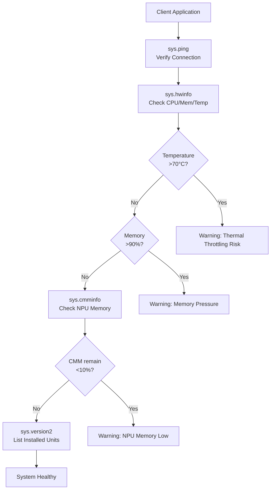
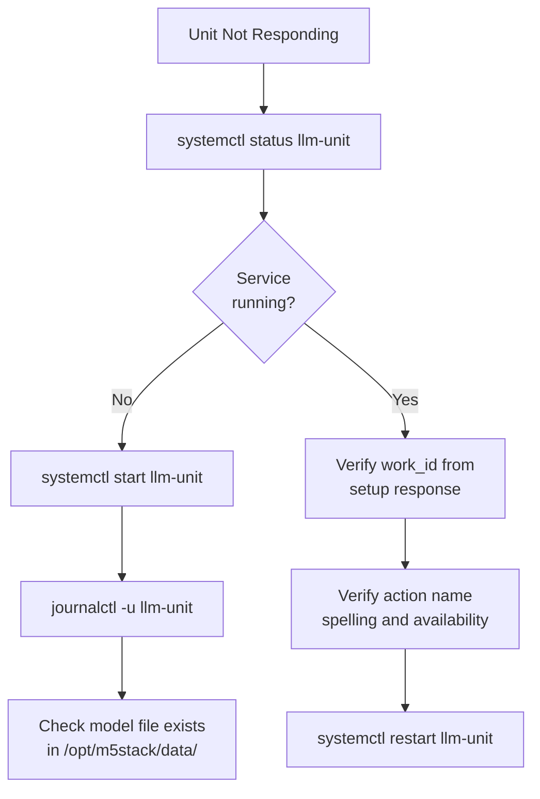
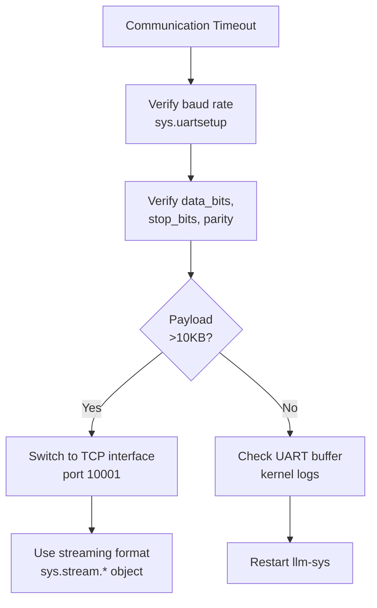
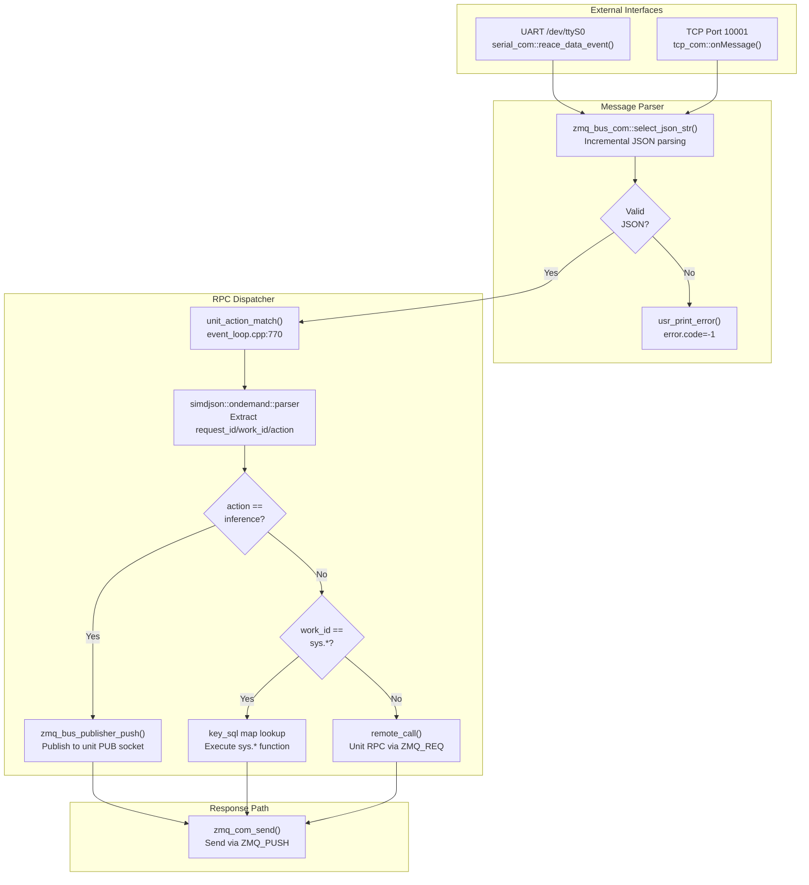
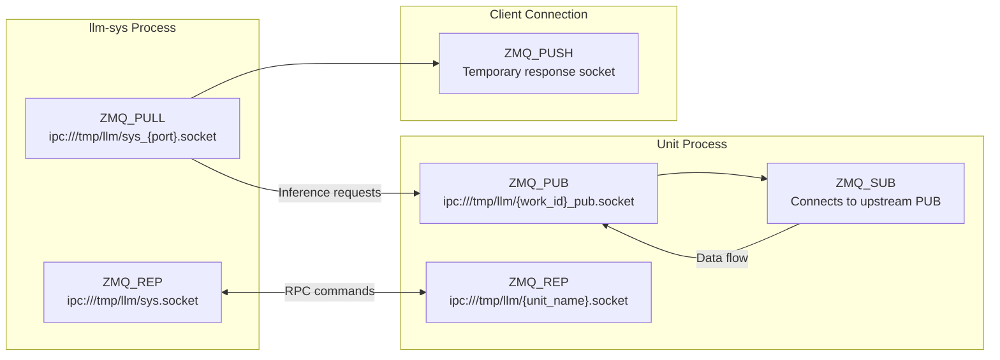
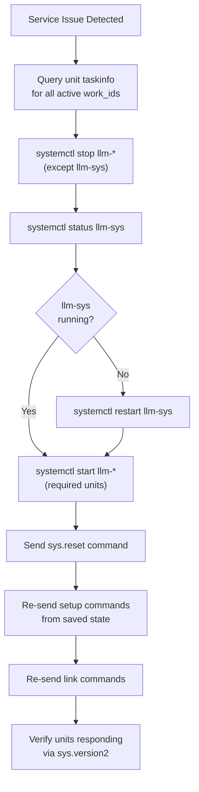

StackFlow Debugging and Troubleshooting

# Debugging and Troubleshooting

<details>
<summary>Relevant source files</summary>

The following files were used as context for generating this wiki page:

- [README.md](README.md)
- [README_zh.md](README_zh.md)
- [doc/component_doc/StackFlow_en.md](doc/component_doc/StackFlow_en.md)
- [doc/component_doc/StackFlow_zh.md](doc/component_doc/StackFlow_zh.md)
- [projects/llm_framework/README.md](projects/llm_framework/README.md)
- [projects/llm_framework/main_sys/include/zmq_bus.h](projects/llm_framework/main_sys/include/zmq_bus.h)
- [projects/llm_framework/main_sys/src/event_loop.cpp](projects/llm_framework/main_sys/src/event_loop.cpp)
- [projects/llm_framework/main_sys/src/serial_com.cpp](projects/llm_framework/main_sys/src/serial_com.cpp)
- [projects/llm_framework/main_sys/src/tcp_com.cpp](projects/llm_framework/main_sys/src/tcp_com.cpp)
- [projects/llm_framework/main_sys/src/zmq_bus.cpp](projects/llm_framework/main_sys/src/zmq_bus.cpp)

</details>


This page provides comprehensive debugging techniques and troubleshooting workflows for the StackFlow LLM framework. It covers system health monitoring, log analysis, error code interpretation, communication debugging, and resolution strategies for common issues encountered during development and deployment.

For information about configuring units and building pipelines, see [Configuration and Usage](#8). For RPC protocol details, see [JSON RPC Protocol](#9.1). For system commands, see [System Commands](#9.3).

---

## System Health Monitoring

The StackFlow framework provides built-in system monitoring commands accessed through the `llm-sys` controller. These commands report hardware status, resource utilization, and system configuration.

### Hardware Information Command

The `sys.hwinfo` command returns comprehensive hardware metrics including CPU load, memory usage, temperature, and network interface status.

**Request Format:**
```json
{
    "request_id": "monitor_001",
    "work_id": "sys",
    "action": "hwinfo"
}
```

**Response Format:**
```json
{
    "request_id": "monitor_001",
    "work_id": "sys",
    "created": 1731488371,
    "object": "sys.hwinfo",
    "error": {"code": 0, "message": ""},
    "data": {
        "temperature": 55000,
        "cpu_loadavg": 45,
        "mem": 62,
        "eth_info": [
            {"name": "eth0", "ip": "192.168.1.100", "speed": "1000"}
        ]
    }
}
```

**Metric Interpretation:**

| Metric | Unit | Description | Normal Range |
|--------|------|-------------|--------------|
| `temperature` | millidegrees Celsius | SoC temperature from `/sys/class/thermal/thermal_zone0/temp` | 30000-70000 |
| `cpu_loadavg` | percentage | CPU utilization averaged over 1 second | 0-100 |
| `mem` | percentage | Memory usage (MemTotal - MemAvailable) / MemTotal | 0-100 |
| `eth_info[].speed` | Mbps | Network interface speed from `/sys/class/net/{name}/speed` | 10/100/1000 |

Sources: [projects/llm_framework/main_sys/src/event_loop.cpp:128-188]()

### NPU Memory Monitoring

The `sys.cmminfo` command monitors Continuous Memory Manager (CMM) allocation, which is critical for NPU operations on AXERA platforms. High CMM usage can cause model loading failures or inference errors.

**Request Format:**
```json
{
    "request_id": "cmm_check",
    "work_id": "sys",
    "action": "cmminfo"
}
```

**Response Format:**
```json
{
    "request_id": "cmm_check",
    "work_id": "sys",
    "created": 1731488400,
    "object": "sys.cmminfo",
    "error": {"code": 0, "message": ""},
    "data": {
        "total": 524288,
        "used": 262144,
        "remain": 262144
    }
}
```

The CMM info is parsed from `/proc/ax_proc/mem_cmm_info`. Values are in kilobytes.

**Troubleshooting CMM Issues:**
- **Symptom:** `remain` near zero, model loading fails
- **Cause:** Multiple NPU models loaded simultaneously or memory leak
- **Resolution:** Exit unused units, reduce model size, or restart services

Sources: [projects/llm_framework/main_sys/src/event_loop.cpp:229-291]()

### Connectivity Testing

The `sys.ping` command provides basic connectivity verification between client and `llm-sys`.

```json
{
    "request_id": "ping_001",
    "work_id": "sys",
    "action": "ping"
}
```

Returns success response with `error.code=0` if communication is functional.

Sources: [projects/llm_framework/main_sys/src/event_loop.cpp:76-81]()

---

## System Monitoring Workflow



Sources: [projects/llm_framework/main_sys/src/event_loop.cpp:76-291]()

---

## Error Code Reference

The StackFlow framework uses standardized error codes in JSON response messages. All successful operations return `error.code=0`.

### System Error Codes

| Code | Symbol | Description | Source Location |
|------|--------|-------------|-----------------|
| 0 | `LLM_NO_ERROR` | Operation successful | Multiple locations |
| -1 | `REACE_RESET` | JSON parsing exception, connection reset | [event_loop.cpp:778](), [serial_com.cpp:66](), [tcp_com.cpp:89]() |
| -2 | `JSON_FORMAT_ERROR` | Invalid JSON format or missing required fields | [event_loop.cpp:778-785]() |
| -3 | `ACTION_MATCH_FALSE` | RPC action not found in unit | [event_loop.cpp:837]() |
| -4 | `INFERENCE_PUSH_FALSE` | Failed to push inference data to unit | [event_loop.cpp:828]() |
| -6 | `UNIT_NOT_EXIST` | Work ID does not correspond to active unit | Multiple locations |
| -9 | `UNIT_CALL_FALSE` | Remote unit call failed | [event_loop.cpp:841]() |
| -10 | `NOT_AVAILABLE` | Feature not currently available | [event_loop.cpp:368-563]() |
| -17 | `FILE_PATH_ERROR` / `FILE_NOT_EXIST` | Invalid file path or file not found | [event_loop.cpp:412-493]() |
| -21 | `TASK_FULL` | Unit has reached maximum concurrent tasks | Unit-specific implementations |

### Interpreting Error Messages

Error responses follow this structure:
```json
{
    "request_id": "req_123",
    "work_id": "sys",
    "created": 1731488371,
    "object": "None",
    "error": {
        "code": -2,
        "message": "json format error"
    },
    "data": "None"
}
```

Sources: [projects/llm_framework/main_sys/src/event_loop.cpp:44-56]()

---

## Log Analysis

### Systemd Service Logs

All StackFlow units run as systemd services. Use `journalctl` to inspect logs:

**View specific unit logs:**
```bash
journalctl -u llm-sys.service -f
journalctl -u llm-llm.service --since "10 minutes ago"
journalctl -u llm-audio.service -n 100
```

**Search for errors across all LLM services:**
```bash
journalctl -u "llm-*" --priority=err --since today
```

**View boot logs:**
```bash
journalctl -u llm-sys.service -b
```

Service status checking:
```bash
systemctl status llm-sys
systemctl is-active llm-kws
systemctl is-failed llm-llm
```

Sources: [README.md:178-182](), [README_zh.md:178-182]()

### Unit Registration and Communication Logs

The `unit_action_match` function in `event_loop.cpp` logs all incoming RPC requests. Look for these patterns:

**Successful RPC:**
```
request_id:req_123 work_id:llm.1002 action:setup
```

**Action not found:**
```
SLOGE: miss action, error:...
```

**JSON parsing errors:**
```
SLOGE: json format error:...
```

Sources: [projects/llm_framework/main_sys/src/event_loop.cpp:770-843]()

### ZMQ Communication Debugging

The `pzmq` wrapper and `zmq_bus_com` class handle all ZeroMQ communication. Connection issues manifest as:

**Unit not responding:**
- Check if unit process is running: `ps aux | grep llm-`
- Verify ZMQ socket files: `ls -la /tmp/llm/`
- Check IPC socket permissions: `stat /tmp/llm/unit_name.socket`

**Message queue buildup:**
- ZMQ uses high water marks (HWM) to prevent unbounded queuing
- Slow consumers cause publisher backpressure
- Monitor with `sys.taskinfo` to check subscriber counts

Sources: [projects/llm_framework/main_sys/src/zmq_bus.cpp:26-195]()

---

## Common Issues and Resolutions

### Issue: JSON Format Error (Code -2)

**Symptoms:**
- Error response: `{"code": -2, "message": "json format error"}`
- Unit rejects setup command
- Parser crashes with exception

**Common Causes:**

1. **Missing required fields:**
   ```json
   // WRONG - missing request_id
   {
       "work_id": "llm",
       "action": "setup"
   }
   
   // CORRECT
   {
       "request_id": "123",
       "work_id": "llm",
       "action": "setup",
       "object": "llm.setup",
       "data": {...}
   }
   ```

2. **Invalid JSON syntax:**
   - Trailing commas
   - Unquoted keys
   - Unescaped special characters in strings

3. **Malformed streaming data:**
   The `select_json_str` method in `zmq_bus_com` parses incremental JSON. Ensure complete JSON objects are sent.

**Resolution:**
- Validate JSON before sending: Use `nlohmann::json::parse()` to verify
- Check for complete braces: Each `{` must have matching `}`
- Enable JSON schema validation in client code

Sources: [projects/llm_framework/main_sys/src/event_loop.cpp:776-787](), [projects/llm_framework/main_sys/src/zmq_bus.cpp:196-300]()

### Issue: Unit Not Responding (Code -9, -3)

**Symptoms:**
- `sys.unit_call` returns error code -9
- RPC action returns error code -3
- `work_id` not found in system

**Diagnostic Commands:**

```json
// List all active units
{
    "request_id": "diag_001",
    "work_id": "sys",
    "action": "version2"
}

// Check specific unit task info
{
    "request_id": "diag_002",
    "work_id": "llm.1002",
    "action": "taskinfo"
}
```

**Common Causes:**

1. **Unit service not running:**
   ```bash
   systemctl status llm-llm
   systemctl start llm-llm
   ```

2. **Unit crashed during initialization:**
   ```bash
   journalctl -u llm-llm --since "5 minutes ago" --priority=err
   ```

3. **Work ID mismatch:**
   - Setup command returned `work_id: "llm.1002"`
   - Client uses incorrect ID like `"llm.1001"`

4. **RPC action not implemented:**
   - Check unit supports requested action
   - Verify action name spelling: `"setup"` not `"Setup"`

**Resolution Steps:**



Sources: [projects/llm_framework/main_sys/src/event_loop.cpp:198-227](), [projects/llm_framework/main_sys/src/event_loop.cpp:830-842]()

### Issue: Model Loading Failure

**Symptoms:**
- Setup command returns error code -5: `"Model loading failed"`
- CMM memory exhausted
- NPU initialization errors in logs

**Diagnostic Steps:**

1. **Check CMM availability:**
   ```json
   {"request_id": "cmm", "work_id": "sys", "action": "cmminfo"}
   ```

2. **Verify model files exist:**
   ```json
   {
       "request_id": "ls",
       "work_id": "sys",
       "action": "bashexec",
       "object": "sys.bashexec",
       "data": "ls -lh /opt/m5stack/data/models/"
   }
   ```

3. **Check model file integrity:**
   ```bash
   sha256sum /opt/m5stack/data/models/model_name.axmodel
   ```

**Common Causes:**

| Cause | Symptom | Resolution |
|-------|---------|------------|
| Insufficient CMM | `cmminfo` shows low `remain` | Exit unused units, use smaller model |
| Corrupted model file | SHA256 mismatch | Re-download model package |
| Wrong model format | NPU error in logs | Verify model compiled for correct NPU (ax630c/ax650n) |
| Missing model files | File not found error | Install model package: `apt install llm-model-*` |
| VNPU resource conflict | Multiple units using same NPU | Configure `vnpu` parameter in model JSON |

**Resolution:**
```bash
# Free CMM memory
systemctl stop llm-vlm
systemctl stop llm-yolo

# Restart primary unit
systemctl restart llm-llm
```

Sources: [projects/llm_framework/main_sys/src/event_loop.cpp:265-283]()

### Issue: High CPU or Memory Usage

**Symptoms:**
- `sys.hwinfo` reports CPU >90% or memory >95%
- System becomes unresponsive
- Audio crackling or frame drops

**Monitoring Commands:**

```json
// Continuous monitoring script
{
    "request_id": "monitor_loop",
    "work_id": "sys",
    "action": "bashexec",
    "object": "sys.bashexec.stream",
    "data": "while true; do top -bn1 | grep llm-; sleep 2; done"
}
```

**Common Causes:**

1. **Multiple CPU units active simultaneously:**
   - `llm-kws`, `llm-asr`, `llm-vad` all running
   - Solution: Use wake-word activation with `enkws=true` parameter

2. **Memory leak in unit:**
   - Increasing RSS over time in `top` output
   - Solution: Restart affected unit, report to developers

3. **Excessive logging:**
   - Large log files in `/var/log/`
   - Solution: Configure log rotation, reduce verbosity

4. **Blocking operations in event loop:**
   - Unit performs synchronous I/O in RPC handler
   - Solution: Use threaded execution (see `_sys_hwinfo` pattern)

**CPU Profiling:**
```bash
# Profile specific unit
perf record -p $(pgrep llm-llm) -g -- sleep 10
perf report
```

Sources: [projects/llm_framework/main_sys/src/event_loop.cpp:103-121](), [projects/llm_framework/main_sys/src/event_loop.cpp:128-196]()

### Issue: Communication Timeouts

**Symptoms:**
- Client hangs waiting for response
- Inference data not reaching unit
- Stream output stops mid-generation

**UART Communication Issues:**

The serial interface at default 115200 baud has limited throughput (~11 KB/s). Large payloads cause delays.

**Troubleshooting UART:**



**Current UART settings:**
```cpp
// Query current configuration
sys_sql_select("config_serial_baud")        // Default: 115200
sys_sql_select("config_serial_data_bits")   // Default: 8
sys_sql_select("config_serial_stop_bits")   // Default: 1
sys_sql_select("config_serial_parity")      // Default: 0 (none)
```

**Change baud rate:**
```json
{
    "request_id": "uart_cfg",
    "work_id": "sys",
    "action": "uartsetup",
    "data": {
        "baud": 230400,
        "data_bits": 8,
        "stop_bits": 1,
        "parity": 0
    }
}
```

Sources: [projects/llm_framework/main_sys/src/serial_com.cpp:28-129](), [projects/llm_framework/main_sys/src/event_loop.cpp:83-101]()

**TCP Communication Issues:**

TCP interface on port 10001 supports multiple concurrent connections. Each connection gets unique ZMQ port (8000-65535).

**Troubleshooting TCP:**

1. **Port already in use:**
   ```bash
   netstat -tlnp | grep 10001
   lsof -i :10001
   ```

2. **Connection refused:**
   ```bash
   # Check service listening
   systemctl status llm-sys
   
   # Test connectivity
   telnet localhost 10001
   ```

3. **Connection dropped:**
   - Check `tcp_com::stop()` was called correctly
   - Verify no mutex deadlocks in `tcp_server_mutex`

Sources: [projects/llm_framework/main_sys/src/tcp_com.cpp:30-114]()

**ZMQ Bus Communication Issues:**

All inter-unit communication uses ZMQ. Common issues:

1. **Subscriber not receiving messages:**
   - Verify publisher called `llm_channel_obj::send()`
   - Check subscriber filter matches message prefix
   - Confirm ZMQ socket connected: check `/tmp/llm/*.socket` files

2. **Message queue overflow:**
   - Publisher sending faster than subscriber can process
   - ZMQ drops messages when HWM reached
   - Solution: Implement backpressure or increase buffer size

3. **Socket cleanup issues:**
   - Stale socket files in `/tmp/llm/`
   - Solution: Clear sockets on service restart

Sources: [projects/llm_framework/main_sys/src/zmq_bus.cpp:140-195]()

---

## Advanced Debugging Tools

### Remote Command Execution

The `sys.bashexec` command allows running arbitrary shell commands for debugging. It supports both blocking and streaming output modes.

**Blocking Mode:**
```json
{
    "request_id": "exec_001",
    "work_id": "sys",
    "action": "bashexec",
    "object": "sys.bashexec",
    "data": "df -h"
}
```

**Streaming Mode (for long-running commands):**
```json
{
    "request_id": "exec_002",
    "work_id": "sys",
    "action": "bashexec",
    "object": "sys.bashexec.stream",
    "data": "dmesg -w"
}
```

**Security Note:** The `bashexec` command runs with service privileges. Malicious commands can damage the system. This feature should be disabled in production by modifying the RPC registration in `server_work()`.

Implementation uses `forkpty()` to create pseudo-terminal for command execution, capturing both stdout and stderr.

Sources: [projects/llm_framework/main_sys/src/event_loop.cpp:593-694]()

### Version and Capability Detection

**List installed binaries:**
```json
{
    "request_id": "ver",
    "work_id": "sys",
    "action": "version2"
}
```

Returns array of installed binaries in `/opt/m5stack/bin/`:
```json
{
    "data": [
        "llm_audio-1.6",
        "llm_kws-1.6",
        "llm_asr-1.6",
        "llm_llm-1.6",
        "llm_melotts-1.6"
    ]
}
```

**List available models:**
```json
{
    "request_id": "models",
    "work_id": "sys",
    "action": "lsmode"
}
```

Returns parsed JSON configurations from `/opt/m5stack/data/models/mode_*.json`.

Sources: [projects/llm_framework/main_sys/src/event_loop.cpp:708-732](), [projects/llm_framework/main_sys/src/event_loop.cpp:293-351]()

### File Transfer for Debugging

**Pull file from device:**
```json
{
    "request_id": "pull_log",
    "work_id": "sys",
    "action": "pull",
    "object": "sys.base64.stream.file./var/log/syslog"
}
```

**Push debug script to device:**
```json
{
    "request_id": "push_script",
    "work_id": "sys",
    "action": "push",
    "object": "sys.base64.stream.file./tmp/debug.sh",
    "data": {
        "index": 0,
        "delta": "IyEvYmluL2Jhc2gKZWNobyAiaGVsbG8i",
        "finish": false
    }
}
```

File integrity is verified with SHA256 checksum returned in response.

Sources: [projects/llm_framework/main_sys/src/event_loop.cpp:404-540]()

---

## Debugging Communication Flows

### Message Routing Diagram



Sources: [projects/llm_framework/main_sys/src/serial_com.cpp:48-71](), [projects/llm_framework/main_sys/src/tcp_com.cpp:77-93](), [projects/llm_framework/main_sys/src/event_loop.cpp:770-843]()

### ZMQ Socket Architecture



**Key Socket Patterns:**

1. **PULL/PUSH for request routing:**
   - `sys` creates unique PULL socket per connection
   - URL format: `ipc:///tmp/llm/sys_{port}.socket`
   - Client responses sent via PUSH to same socket

2. **PUB/SUB for data streaming:**
   - Each unit publishes output to `{work_id}_pub` socket
   - Downstream units subscribe with prefix filter
   - Topic format: `{work_id}.{object_type}`

3. **REQ/REP for RPC:**
   - Each unit listens on `{unit_name}.socket`
   - `pzmq` wrapper provides async RPC with callbacks
   - Timeout handling via ZMQ socket options

Sources: [projects/llm_framework/main_sys/src/zmq_bus.cpp:36-47](), [projects/llm_framework/main_sys/src/zmq_bus.cpp:144-158](), [projects/llm_framework/main_sys/include/zmq_bus.h:23-78]()

---

## Performance Profiling

### Measuring Inference Latency

Track timestamps in JSON responses to measure end-to-end latency:

```json
// Request sent at: 1731488370.123
{
    "request_id": "inf_001",
    "work_id": "llm.1002",
    "action": "inference",
    "data": {"text": "Hello"}
}

// First token received at: 1731488370.456 (333ms TTFT)
{
    "request_id": "inf_001",
    "work_id": "llm.1002",
    "created": 1731488370,
    "object": "llm.utf-8.stream",
    "data": {"index": 0, "delta": "Hi", "finish": false}
}

// Last token received at: 1731488372.890 (2767ms total)
{
    "request_id": "inf_001",
    "work_id": "llm.1002",
    "created": 1731488372,
    "object": "llm.utf-8.stream",
    "data": {"index": 15, "delta": "", "finish": true}
}
```

**Key Metrics:**
- **TTFT (Time To First Token):** Response latency, critical for interactivity
- **Tokens/second:** Throughput for complete response
- **End-to-end latency:** Total time from request to final output

### Resource Utilization Tracking

**Continuous monitoring script:**
```bash
#!/bin/bash
# Save as /tmp/monitor.sh

while true; do
    # Timestamp
    date +%s
    
    # CPU per-unit
    ps -eo pid,comm,%cpu,%mem --sort=-%cpu | grep llm-
    
    # CMM usage
    tail -n1 /proc/ax_proc/mem_cmm_info
    
    # Temperature
    cat /sys/class/thermal/thermal_zone0/temp
    
    echo "---"
    sleep 1
done
```

Execute via:
```json
{
    "request_id": "profile",
    "work_id": "sys",
    "action": "bashexec",
    "object": "sys.bashexec.stream",
    "data": "bash /tmp/monitor.sh"
}
```

### NPU Utilization Analysis

On AXERA platforms, check NPU engine usage:

```bash
# NPU load (requires vendor tools)
cat /sys/class/misc/ax_npu/vnpu_usage

# Active VNPU assignments
cat /proc/ax_proc/vnpu_info
```

**Interpreting Results:**
- Multiple units sharing VNPU can cause contention
- Configure `vnpu` parameter in model JSON to assign dedicated engine
- Use `npu1` models for parallel execution on second NPU core

Sources: [README_zh.md:59-104]()

---

## Troubleshooting Workflows

### Service Restart Procedure

Safe restart preserving state:



**Automated restart command:**
```json
{
    "request_id": "restart",
    "work_id": "sys",
    "action": "reset"
}
```

This restarts all `llm-*` services except `llm-sys` itself.

Sources: [projects/llm_framework/main_sys/src/event_loop.cpp:696-706]()

### Memory Leak Detection

If a unit exhibits increasing memory usage over time:

1. **Monitor RSS (Resident Set Size):**
   ```bash
   watch -n 1 "ps aux | grep llm-llm | awk '{print \$6}'"
   ```

2. **Enable ASAN (AddressSanitizer) in development:**
   Rebuild with `-fsanitize=address` flag

3. **Profile with valgrind:**
   ```bash
   systemctl stop llm-llm
   valgrind --leak-check=full /opt/m5stack/bin/llm_llm-1.6
   ```

4. **Check for circular references:**
   - Review `std::shared_ptr` usage in unit code
   - Verify destructors are called on `exit` RPC

### Network Interface Issues

If ethernet interfaces report "speed: -1" in `sys.hwinfo`:

```bash
# Check interface status
ip link show eth0

# Manually set speed
ethtool -s eth0 speed 1000 duplex full autoneg on

# Restart networking
systemctl restart systemd-networkd
```

Sources: [projects/llm_framework/main_sys/src/event_loop.cpp:164-184]()

---

## Checklist for Common Scenarios

### Unit Won't Load Model

- [ ] Service running: `systemctl is-active llm-{unit}`
- [ ] Model files exist: `ls /opt/m5stack/data/models/`
- [ ] CMM available: `sys.cmminfo` shows sufficient `remain`
- [ ] Correct platform: Model compiled for ax630c/ax650n
- [ ] Model package installed: `dpkg -l | grep llm-model-`
- [ ] Configuration valid: JSON syntax correct
- [ ] Logs checked: `journalctl -u llm-{unit} -n 50`

### Communication Not Working

- [ ] Connection test: `sys.ping` succeeds
- [ ] Correct interface: UART vs TCP
- [ ] Baud rate match: Client and device both 115200
- [ ] JSON complete: All braces balanced
- [ ] Work ID correct: Use ID from setup response
- [ ] Unit registered: Appears in `sys.version2` output
- [ ] Socket files: Present in `/tmp/llm/`

### Poor Performance

- [ ] Hardware OK: `sys.hwinfo` shows normal values
- [ ] Single unit active: Multiple LLMs consume CMM
- [ ] Model size appropriate: Smaller model if memory constrained
- [ ] Streaming enabled: Use `.stream` response format
- [ ] VNPU configured: Dedicated NPU core if available
- [ ] No thermal throttling: Temperature <70°C
- [ ] Logs clear: No errors or warnings

Sources: Multiple files throughout codebase