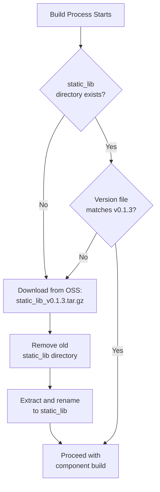
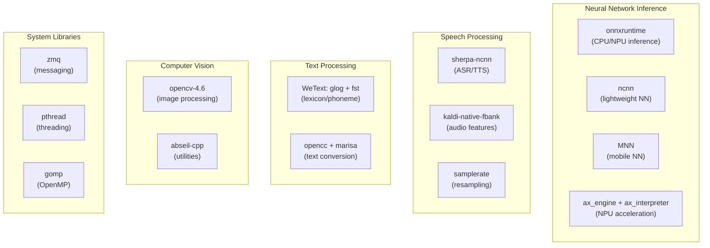
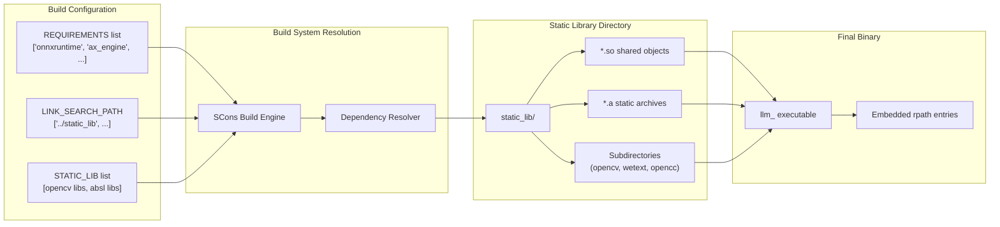
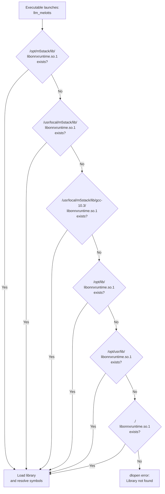

StackFlow Dependencies and Static Libraries

# Dependencies and Static Libraries

Relevant source files

The following files were used as context for generating this wiki page:

- [ext_components/StackFlow/stackflow/pzmq.hpp](ext_components/StackFlow/stackflow/pzmq.hpp)
- [ext_components/ax_msp/Kconfig](ext_components/ax_msp/Kconfig)
- [projects/llm_framework/SConstruct](projects/llm_framework/SConstruct)
- [projects/llm_framework/config_defaults.mk](projects/llm_framework/config_defaults.mk)
- [projects/llm_framework/main/SConstruct](projects/llm_framework/main/SConstruct)
- [projects/llm_framework/main_depth_anything/SConstruct](projects/llm_framework/main_depth_anything/SConstruct)
- [projects/llm_framework/main_melotts/SConstruct](projects/llm_framework/main_melotts/SConstruct)
- [projects/llm_framework/main_tts/SConstruct](projects/llm_framework/main_tts/SConstruct)
- [projects/llm_framework/main_whisper/SConstruct](projects/llm_framework/main_whisper/SConstruct)
- [projects/llm_framework/main_yolo/SConstruct](projects/llm_framework/main_yolo/SConstruct)

This page documents the dependency management and static library system used in the StackFlow framework build process. It covers the versioned `static_lib` directory, third-party library dependencies, linking strategies, and runtime path configuration. For information about the overall build system, see [SCons Build Overview](#6.1). For component-specific build settings, see [Component Build Configuration](#6.2).

## Static Library Management System

The StackFlow framework uses a centralized static library directory to manage precompiled third-party dependencies. This system ensures consistent dependency versions across all units and simplifies the build process.

### Version Control and Download Mechanism

The root build script implements automatic static library management with version checking:

[projects/llm_framework/SConstruct:8-31]()

The system operates as follows:

1. **Version Declaration**: The current version is declared as `v0.1.3` [projects/llm_framework/SConstruct:8]()
2. **Version Verification**: On build, the system checks if the `static_lib` directory exists and contains a `version` file matching the declared version [projects/llm_framework/SConstruct:15-23]()
3. **Automatic Download**: If the version is missing or mismatched, the build system downloads the correct tarball from M5Stack's OSS storage [projects/llm_framework/SConstruct:27]()
4. **Extraction**: The downloaded archive is extracted to the `static_lib` directory, replacing any existing installation [projects/llm_framework/SConstruct:29-31]()

**Diagram: Static Library Management Flow**

Sources: [projects/llm_framework/SConstruct:8-31]()

### Static Library Directory Structure

The `static_lib` directory contains the following categories of dependencies:

| Category | Contents | Example Files |
|----------|----------|---------------|
| **Inference Engines** | ONNX Runtime, NCNN, MNN | `libonnxruntime.so.1`, `libncnn.so`, `libMNN.so` |
| **Speech Processing** | Sherpa-NCNN, Kaldi | `libsherpa-ncnn-core.so`, `libkaldi-native-fbank-core.so` |
| **TTS Libraries** | Custom TTS, WeText | `libtts.so`, `libglog.so.0`, `libfst.so.16` |
| **Computer Vision** | OpenCV | `libopencv-4.6-aarch64-none/lib/lib*.so` |
| **Utilities** | Google Abseil, OpenCC, Marisa | `libabsl_*.a`, `libopencc.a`, `libmarisa.a` |
| **Communication** | ZeroMQ | `libzmq.so.5` |
| **NPU Acceleration** | Axera Engine/Interpreter | Via `ax_engine`, `ax_interpreter` components |

Sources: [projects/llm_framework/main/SConstruct:23-33](), [projects/llm_framework/main_yolo/SConstruct:26-28](), [projects/llm_framework/main_whisper/SConstruct:30-32]()

## Third-Party Dependencies

### Core Libraries by Function

**Diagram: Dependency Categories and Components**

Sources: [projects/llm_framework/main_melotts/SConstruct:23-31](), [projects/llm_framework/main_whisper/SConstruct:22-32](), [projects/llm_framework/main_yolo/SConstruct:22-28]()

### Component-Specific Dependencies

Each StackFlow unit declares its required dependencies in its `SConstruct` file. The following table maps components to their key dependencies:

| Component | Key Dependencies | Purpose |
|-----------|-----------------|---------|
| **llm-melotts** | `onnxruntime`, `ax_engine`, `ax_interpreter`, `samplerate`, `glog`, `fst` | NPU-accelerated TTS with lexicon conversion |
| **llm-whisper** | `ax_engine`, `ax_interpreter`, `opencc`, `marisa` | NPU-accelerated ASR with text normalization |
| **llm-yolo** | `opencv`, `ax_engine`, `ax_interpreter`, `absl` | NPU object detection with CV post-processing |
| **llm-depth-anything** | `opencv`, `ax_engine`, `ax_interpreter`, `absl` | NPU depth estimation with CV utilities |
| **llm-tts** | `tts`, `gomp` | CPU-based TTS with OpenMP parallelization |
| **llm-asr/kws/vad** | `sherpa-ncnn`, `ncnn`, `kaldi-native-fbank` | CPU speech processing |
| **All units** | `pthread`, `utilities`, `eventpp`, `StackFlow` | Base framework requirements |

Sources: [projects/llm_framework/main_melotts/SConstruct:11-31](), [projects/llm_framework/main_whisper/SConstruct:11-32](), [projects/llm_framework/main_yolo/SConstruct:10-28](), [projects/llm_framework/main_tts/SConstruct:11-23]()

### Dependency Declaration Pattern

Each component's `SConstruct` file declares dependencies using the `REQUIREMENTS` list. The build system resolves these to actual library paths:

**Example from llm-melotts:**

[projects/llm_framework/main_melotts/SConstruct:11-31]()

Key patterns:
- **Framework Requirements**: Always include `pthread`, `utilities`, `eventpp`, `StackFlow`
- **Platform Requirements**: NPU units add `ax_engine`, `ax_interpreter`, `ax_sys`, `ax_msp`
- **Specialized Requirements**: Each unit adds domain-specific libraries (`onnxruntime`, `samplerate`, etc.)
- **Static Library Path**: `LINK_SEARCH_PATH += [ADir('../static_lib')]` points to the shared library repository

Sources: [projects/llm_framework/main_melotts/SConstruct:11-31](), [projects/llm_framework/main_whisper/SConstruct:11-32]()

## Library Linking Strategy

### Static vs Dynamic Linking

The build system employs a hybrid linking strategy:

**Dynamic Libraries (Shared Objects):**
- Inference engines: `libonnxruntime.so.1`, `libncnn.so`, `libMNN.so`
- Speech processing: `libsherpa-ncnn-core.so`, `libkaldi-native-fbank-core.so`
- Communication: `libzmq.so.5`
- Installed to system paths and referenced via rpath

[projects/llm_framework/main/SConstruct:23-33]()

**Static Libraries (Archives):**
- Utility libraries: Google Abseil (`libabsl_*.a`)
- Text processing: `libopencc.a`, `libmarisa.a`
- OpenCV components: Multiple `lib*.so` files linked twice for symbol resolution

[projects/llm_framework/main_yolo/SConstruct:26-28](), [projects/llm_framework/main_whisper/SConstruct:30-32]()

The OpenCV libraries are linked twice (`STATIC_LIB += static_file * 2`) to resolve circular dependencies between OpenCV modules.

### Link Search Path Configuration

All components add the static library directory to their link search path:

[projects/llm_framework/main_melotts/SConstruct:22](), [projects/llm_framework/main_yolo/SConstruct:21](), [projects/llm_framework/main_whisper/SConstruct:22]()

Additional search paths for specialized dependencies:
- WeText libraries: [projects/llm_framework/main_melotts/SConstruct:28]()
- OpenCC libraries: [projects/llm_framework/main_whisper/SConstruct:30]()

**Diagram: Library Resolution and Linking**

Sources: [projects/llm_framework/main_melotts/SConstruct:22-31](), [projects/llm_framework/main_yolo/SConstruct:21-28]()

## Runtime Path Configuration

### Rpath Specifications

All components configure runtime library search paths (rpath) to ensure shared libraries can be located at runtime. The standard rpath configuration is:

[projects/llm_framework/main_melotts/SConstruct:21]()

This pattern is consistent across all components:
- [projects/llm_framework/main_yolo/SConstruct:20]()
- [projects/llm_framework/main_whisper/SConstruct:21]()
- [projects/llm_framework/main_tts/SConstruct:21]()
- [projects/llm_framework/main_depth_anything/SConstruct:20]()
- [projects/llm_framework/main/SConstruct:21]()

### Rpath Search Order

The linker embeds the following search paths in order:

1. `/opt/m5stack/lib` - Primary installation location for M5Stack libraries
2. `/usr/local/m5stack/lib` - Alternative system-wide installation
3. `/usr/local/m5stack/lib/gcc-10.3` - Toolchain-specific libraries
4. `/opt/lib` - System optional libraries
5. `/opt/usr/lib` - Additional system libraries
6. `./` - Current directory (for development/testing)

This configuration allows binaries to run correctly whether installed via Debian packages (which place libraries in `/opt/m5stack/lib`) or run from the build directory during development.

**Diagram: Runtime Library Resolution**

Sources: [projects/llm_framework/main_melotts/SConstruct:21](), [projects/llm_framework/main_yolo/SConstruct:20]()

## Special Dependency Configurations

### ZeroMQ (libzmq)

The ZeroMQ library is required by the `pzmq` communication layer and is linked as a shared object:

[projects/llm_framework/main/SConstruct:31]()

The `pzmq` class directly includes the ZeroMQ header:

[ext_components/StackFlow/stackflow/pzmq.hpp:7]()

### ONNX Runtime Include Paths

Components using ONNX Runtime require access to session headers:

[projects/llm_framework/main_melotts/SConstruct:26-27]()

The include path points to `static_lib/include/onnxruntime/core/session` for the ONNX Runtime API.

### OpenCV with Abseil

YOLO and depth estimation components require both OpenCV and Google Abseil libraries:

[projects/llm_framework/main_yolo/SConstruct:24-28]()

The build system:
1. Globs all Abseil static archives from `static_lib/module-llm/`
2. Globs all OpenCV libraries from `static_lib/libopencv-4.6-aarch64-none/lib/`
3. Links them twice (`* 2`) to resolve circular symbol dependencies

### Axera NPU Libraries

NPU-accelerated components depend on the Axera SDK libraries, which are provided through the `ax_msp` component configuration rather than the static library directory. These are configured via Kconfig:

[ext_components/ax_msp/Kconfig:1-51]()

The Axera dependencies include:
- `ax_engine` - NPU inference engine
- `ax_interpreter` - Model graph interpreter  
- `ax_sys` - System utilities for NPU

These are declared in component requirements:
[projects/llm_framework/main_melotts/SConstruct:23](), [projects/llm_framework/main_yolo/SConstruct:22]()

## Dependency Installation

The `static_file-1.0` component packages all shared libraries for deployment:

[projects/llm_framework/main/SConstruct:23-48]()

This component:
- Takes no source files (placeholder main)
- Declares no compile-time dependencies
- Lists all shared libraries in `STATIC_FILES`
- Gets packaged into the `lib-llm` Debian package for installation

This ensures all runtime dependencies are available at `/opt/m5stack/lib` when units are installed. For more details on the packaging process, see [Package Creation System](#7.1).

Sources: [projects/llm_framework/main/SConstruct:23-48]()