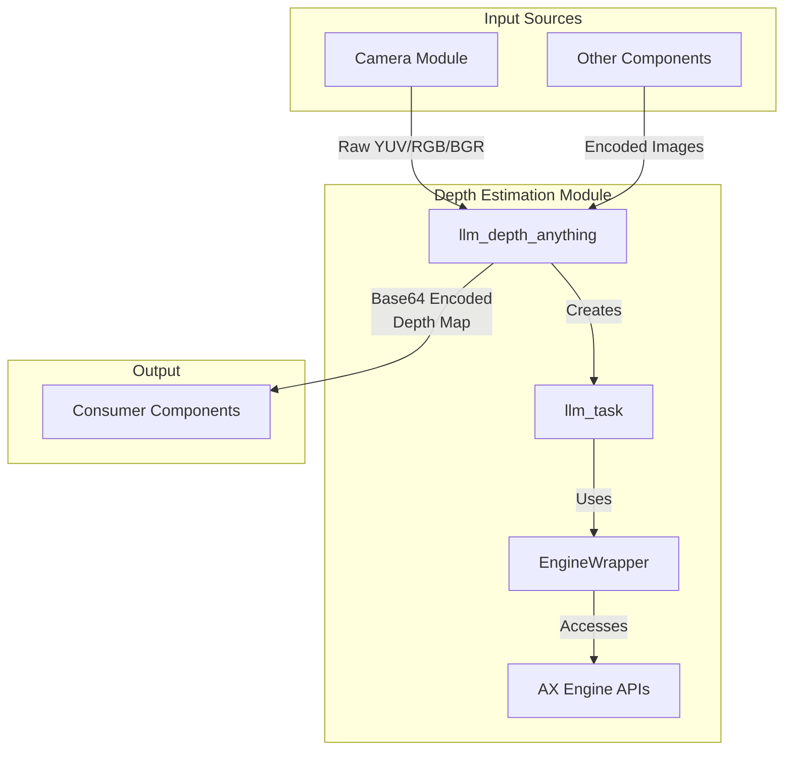
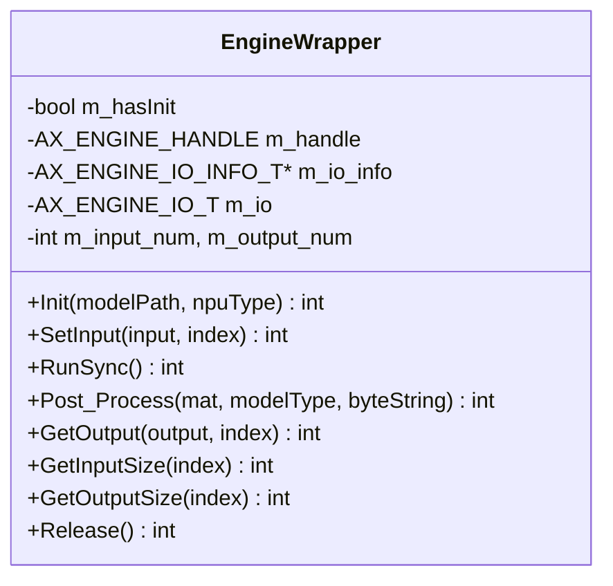
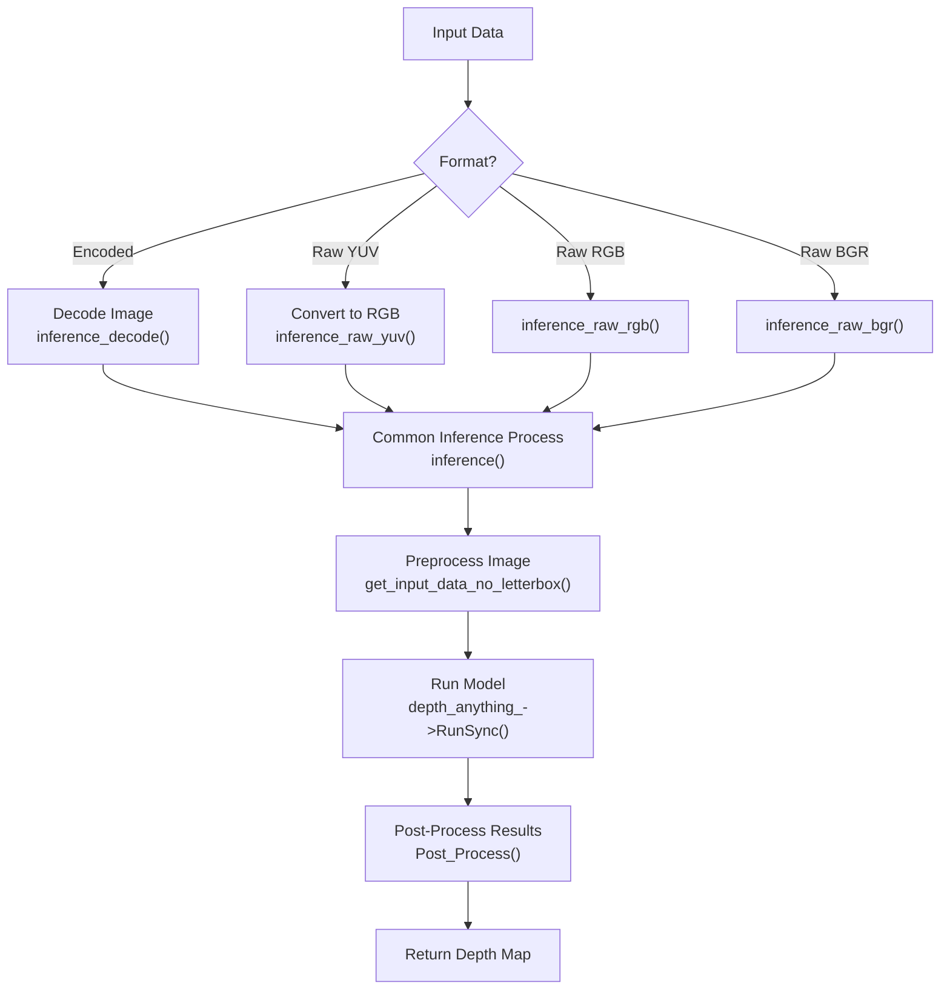
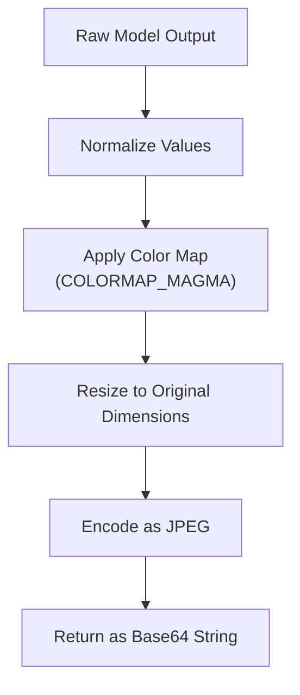

StackFlow Depth Estimation (llm-depth-anything)

# Depth Estimation

Relevant source files

The following files were used as context for generating this wiki page:

- [projects/llm_framework/main_depth_anything/src/EngineWrapper.cpp](projects/llm_framework/main_depth_anything/src/EngineWrapper.cpp)
- [projects/llm_framework/main_depth_anything/src/EngineWrapper.hpp](projects/llm_framework/main_depth_anything/src/EngineWrapper.hpp)
- [projects/llm_framework/main_depth_anything/src/main.cpp](projects/llm_framework/main_depth_anything/src/main.cpp)
- [projects/llm_framework/main_melotts/src/runner/EngineWrapper.cpp](projects/llm_framework/main_melotts/src/runner/EngineWrapper.cpp)
- [projects/llm_framework/main_whisper/src/runner/EngineWrapper.cpp](projects/llm_framework/main_whisper/src/runner/EngineWrapper.cpp)
- [projects/llm_framework/main_yolo/src/EngineWrapper.cpp](projects/llm_framework/main_yolo/src/EngineWrapper.cpp)
- [projects/llm_framework/main_yolo/src/EngineWrapper.hpp](projects/llm_framework/main_yolo/src/EngineWrapper.hpp)
- [projects/llm_framework/main_yolo/src/main.cpp](projects/llm_framework/main_yolo/src/main.cpp)

## Overview

The Depth Estimation module in StackFlow provides monocular depth estimation capabilities, enabling the extraction of depth information from single images. This module is implemented as a standalone service component that integrates with the larger StackFlow framework through standardized interfaces. For information about other computer vision capabilities, see [Computer Vision](#3.3).

The module is based on the "Depth Anything" model, which can estimate relative depth maps from single RGB images without requiring stereo cameras or specialized depth sensors. These depth maps are visualized using a color gradient that represents distances from the camera.

Sources: [projects/llm_framework/main_depth_anything/src/main.cpp:1-48]()

## Architecture

The Depth Estimation module follows the standard StackFlow component architecture, implementing a service that can be configured, linked to other components, and used to process images from various sources.

Sources: 
- [projects/llm_framework/main_depth_anything/src/main.cpp:46-252]()
- [projects/llm_framework/main_depth_anything/src/main.cpp:256-558]()

## Components and Classes

### EngineWrapper

The `EngineWrapper` class provides a simplified interface for interacting with the AXERA AI engine. It handles model loading, input/output management, and synchronous inference execution.

Sources: 
- [projects/llm_framework/main_depth_anything/src/EngineWrapper.hpp:35-67]()
- [projects/llm_framework/main_depth_anything/src/EngineWrapper.cpp:108-234]()

### llm_task

The `llm_task` class represents a depth estimation task instance. It manages the configuration, model loading, and inference process for a particular user request.

Key responsibilities:
- Parsing configuration parameters
- Loading the depth estimation model
- Processing input images (in various formats)
- Running inference
- Formatting and returning results

Sources: 
- [projects/llm_framework/main_depth_anything/src/main.cpp:46-252]()

### llm_depth_anything

The `llm_depth_anything` class is the main StackFlow component implementation. It inherits from `StackFlow` and implements the required interface methods for component lifecycle management and communication.

Key methods:
- `setup`: Initializes a depth estimation task with specified configuration
- `link`: Establishes connections with input sources
- `unlink`: Removes connections with input sources
- `taskinfo`: Provides information about running tasks
- `exit`: Terminates a task

Sources: 
- [projects/llm_framework/main_depth_anything/src/main.cpp:256-558]()

## Configuration Parameters

The depth estimation module accepts the following configuration parameters:

| Parameter | Type | Description |
|-----------|------|-------------|
| `model` | string | Model name to be used |
| `response_format` | string | Output format, can include "stream" for streaming output |
| `enoutput` | boolean | Enable/disable output |
| `input` | string/array | Input source(s) |
| `depth_anything_model` | string | Path to the model file |
| `img_h` | integer | Input image height (default: 640) |
| `img_w` | integer | Input image width (default: 640) |
| `model_type` | string | Model type (default: "detect") |

Sources: 
- [projects/llm_framework/main_depth_anything/src/main.cpp:27-36]()
- [projects/llm_framework/main_depth_anything/src/main.cpp:62-84]()
- [projects/llm_framework/main_depth_anything/src/main.cpp:86-126]()

## Input Processing

The module supports multiple input formats:

1. **Encoded Images**: Typically JPG/PNG images encoded in base64
2. **Raw YUV**: Camera data in YUV format
3. **Raw RGB**: Camera data in RGB format
4. **Raw BGR**: Camera data in BGR format

The input processing workflow:

Sources: 
- [projects/llm_framework/main_depth_anything/src/main.cpp:140-212]()

## Output Format

The depth estimation module produces depth maps visualized as color-coded images. The output is encoded as base64 strings and can be delivered in two modes:

1. **Stream Mode**: Results are sent incrementally with progress indicators
2. **Single Response**: The complete result is delivered in a single response

Sources:
- [projects/llm_framework/main_depth_anything/src/main.cpp:268-292]()
- [projects/llm_framework/main_depth_anything/src/EngineWrapper.cpp:255-281]()

## Post-Processing

The post-processing stage transforms the raw depth estimation output into a visually interpretable format:

1. The raw depth values are normalized to a 0-255 range
2. A color map (COLORMAP_MAGMA) is applied to create a color-coded visualization
3. The result is resized to match the original input dimensions
4. The image is encoded as a JPEG for transmission

Sources:
- [projects/llm_framework/main_depth_anything/src/EngineWrapper.cpp:255-281]()

## Integration with StackFlow

The depth estimation module integrates with the StackFlow framework using the following mechanisms:

1. **ZMQ Communication**: Uses ZMQ for inter-process communication
2. **Publish-Subscribe Pattern**: Can subscribe to camera streams or other image sources
3. **Work ID Management**: Uses work IDs to track and manage tasks
4. **JSON Configuration**: Accepts configuration parameters in JSON format

The module can be linked with other components, particularly the camera module, to create computer vision pipelines.

Sources:
- [projects/llm_framework/main_depth_anything/src/main.cpp:368-473]()

## Hardware Acceleration

The module leverages AXERA's hardware acceleration platform (AX Engine) for efficient inference execution:

1. **NPU Support**: Configured to use the Neural Processing Unit
2. **Engine API**: Interfaces with AX_ENGINE APIs for model loading and inference
3. **Memory Management**: Optimized buffer handling for input/output data

Sources:
- [projects/llm_framework/main_depth_anything/src/EngineWrapper.cpp:108-234]()
- [projects/llm_framework/main_depth_anything/src/main.cpp:215-241]()

## Error Handling

The module implements several error handling mechanisms:

| Error Code | Description |
|------------|-------------|
| -2 | JSON format error |
| -5 | Model loading failed |
| -6 | Unit does not exist |
| -11 | Model run failed |
| -20 | Link operation failed |
| -21 | Task queue full |
| -23 | Base64 decoding error |
| -24 | Empty inference data |
| -25 | Stream data index error |

Sources:
- [projects/llm_framework/main_depth_anything/src/main.cpp:368-473]()
- [projects/llm_framework/main_depth_anything/src/main.cpp:293-347]()

## Usage Example

A typical sequence for using the depth estimation module:

1. **Setup**: Configure the module with model parameters
2. **Link**: Connect the module to a camera or other image source
3. **Process**: Receive images and process them to generate depth maps
4. **Unlink/Exit**: Clean up resources when done

Sources:
- [projects/llm_framework/main_depth_anything/src/main.cpp:368-544]()