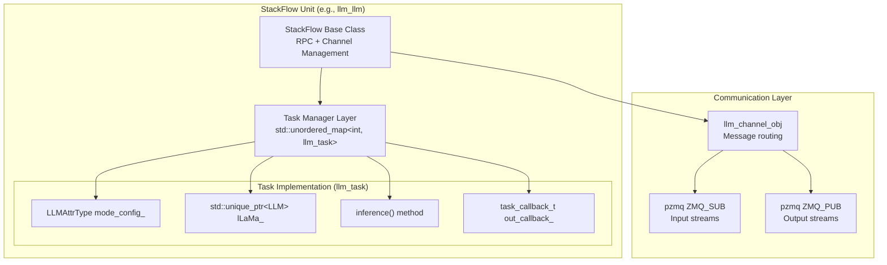
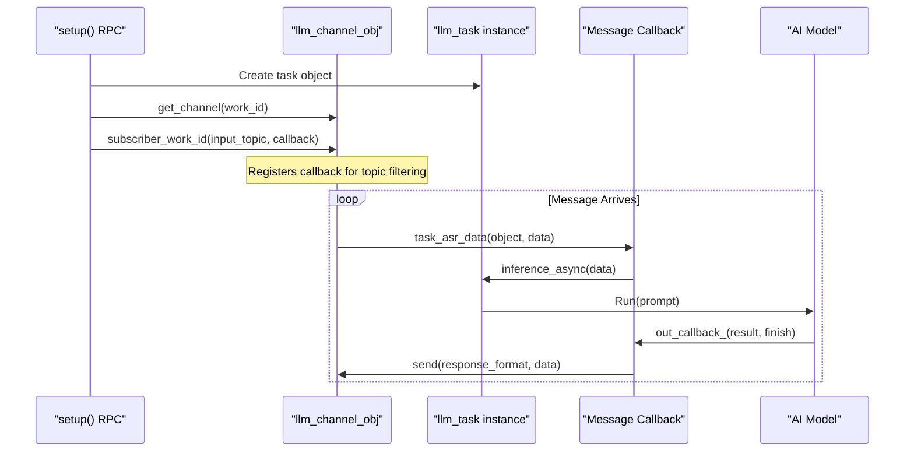
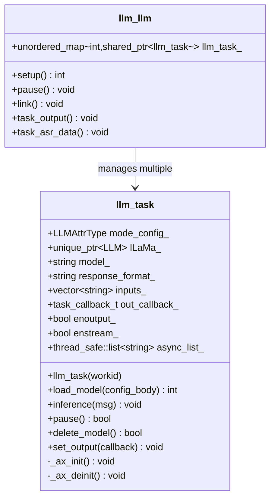
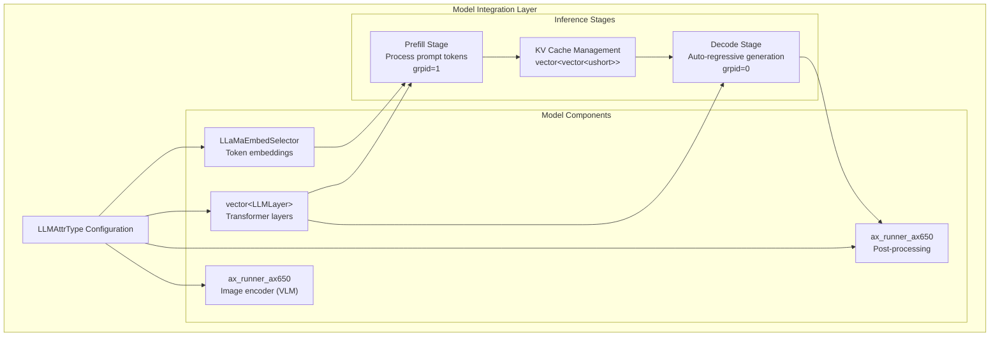
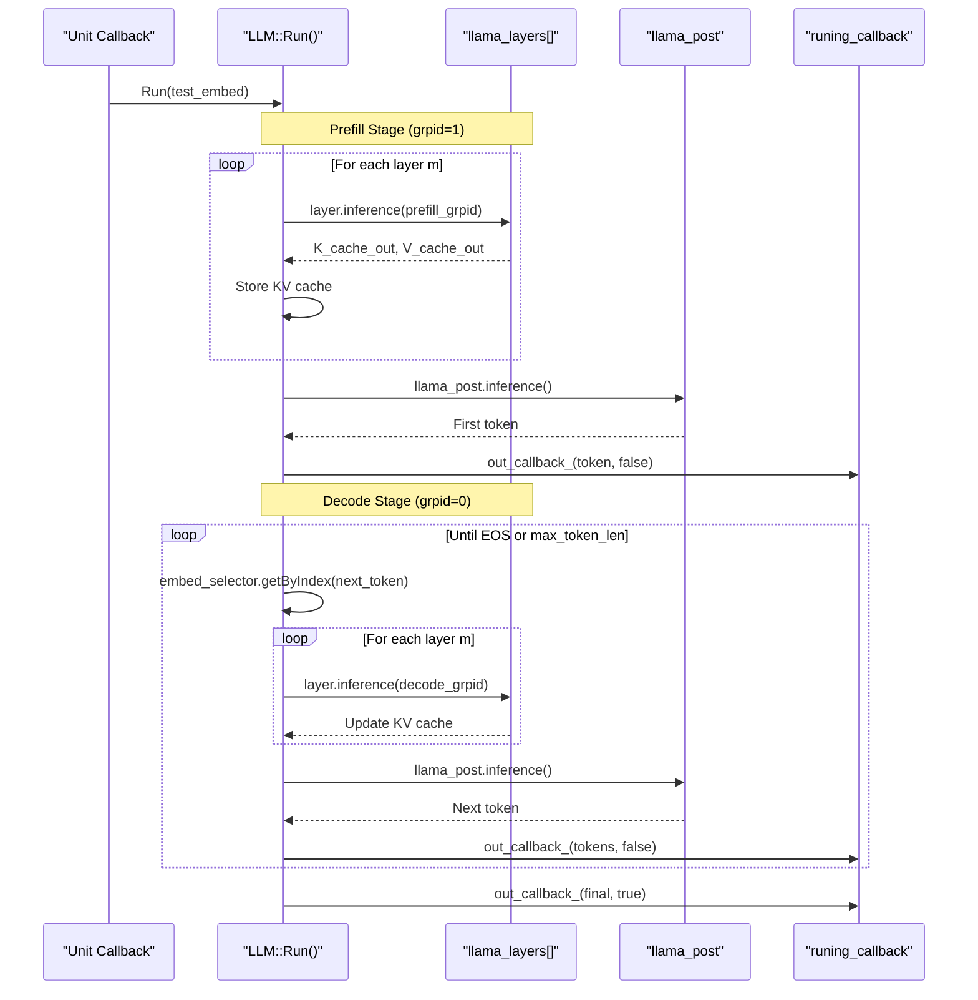
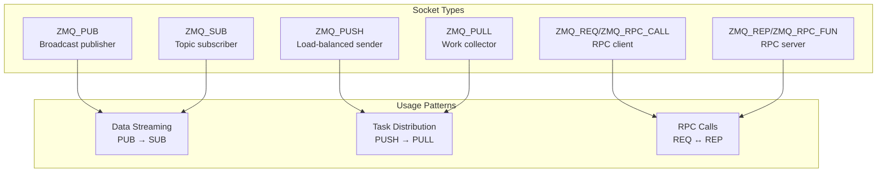
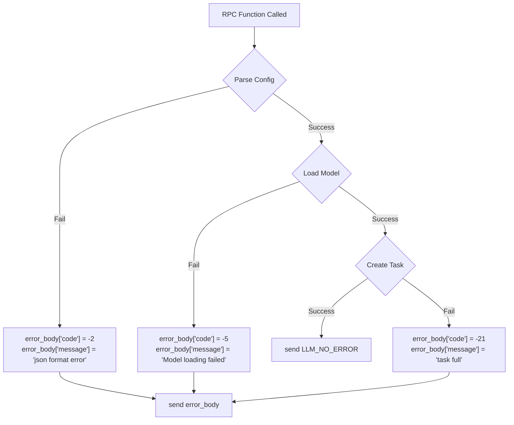
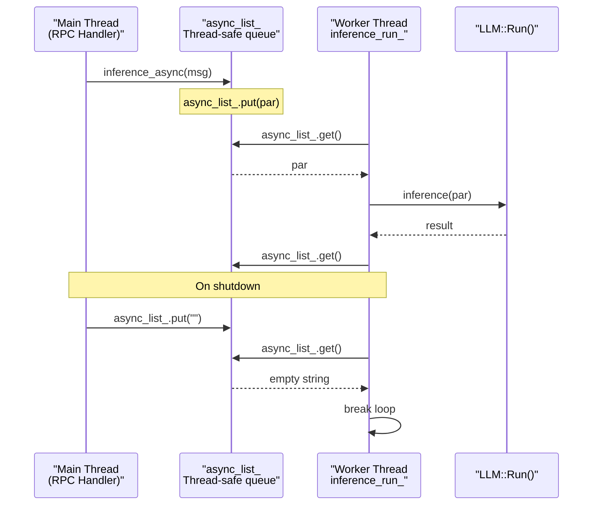

StackFlow Developer Guide

# Developer Guide

<details>
<summary>Relevant source files</summary>

The following files were used as context for generating this wiki page:

- [ext_components/StackFlow/stackflow/pzmq.hpp](ext_components/StackFlow/stackflow/pzmq.hpp)
- [ext_components/ax_msp/Kconfig](ext_components/ax_msp/Kconfig)
- [projects/llm_framework/SConstruct](projects/llm_framework/SConstruct)
- [projects/llm_framework/config_defaults.mk](projects/llm_framework/config_defaults.mk)
- [projects/llm_framework/main_llm/src/main.cpp](projects/llm_framework/main_llm/src/main.cpp)
- [projects/llm_framework/main_llm/src/runner/LLM.hpp](projects/llm_framework/main_llm/src/runner/LLM.hpp)
- [projects/llm_framework/main_vlm/src/main.cpp](projects/llm_framework/main_vlm/src/main.cpp)
- [projects/llm_framework/main_vlm/src/runner/LLM.hpp](projects/llm_framework/main_vlm/src/runner/LLM.hpp)
- [projects/llm_framework/main_vlm/src/runner/ax_model_runner/ax_model_runner.hpp](projects/llm_framework/main_vlm/src/runner/ax_model_runner/ax_model_runner.hpp)

</details>


This guide provides technical information for developers who want to extend the StackFlow framework by creating custom units, integrating new AI models, or modifying framework components. For configuration and usage examples, see [Configuration and Usage](#8). For API reference information, see [API Reference](#9).

## Purpose and Scope

This document covers:
- Architecture patterns used in StackFlow units
- Step-by-step procedures for creating custom processing units
- Integration patterns for AI models and hardware accelerators
- Build system and packaging procedures
- Common debugging techniques

**Related Pages:**
- For creating custom units specifically, see [Creating Custom Units](#10.1)
- For AI model integration, see [Model Integration](#10.2)
- For framework extension details, see [Extending StackFlow Framework](#10.3)
- For debugging procedures, see [Debugging and Troubleshooting](#10.4)

---

## Development Workflow Overview

The typical development workflow for extending StackFlow follows these stages:

```mermaid
flowchart LR
    subgraph "1. Design"
        A["Define Unit Interface"]
        B["Design RPC Actions"]
        C["Plan Data Flow"]
    end
    
    subgraph "2. Implementation"
        D["Inherit StackFlow Class"]
        E["Implement RPC Functions"]
        F["Create Task Classes"]
        G["Register Message Handlers"]
    end
    
    subgraph "3. Integration"
        H["Add to Build System"]
        I["Create Configuration"]
        J["Package as .deb"]
    end
    
    subgraph "4. Testing"
        K["Unit Tests"]
        L["Integration Tests"]
        M["System Tests"]
    end
    
    A --> B --> C --> D
    D --> E --> F --> G
    G --> H --> I --> J
    J --> K --> L --> M
```



**Sources:** [main_llm/src/main.cpp:1-900](), [main_vlm/src/main.cpp:1-900]()

---

## Core Architecture Patterns

### Unit Structure Pattern

All StackFlow units follow a consistent two-layer architecture:



**Key Classes:**
- **StackFlow**: Base class providing RPC infrastructure [StackFlow.h]()
- **llm_task**: Per-work_id task encapsulating model state [main_llm/src/main.cpp:47-504]()
- **llm_channel_obj**: Message routing and subscriber management [StackFlow base]()

**Sources:** [main_llm/src/main.cpp:511-800](), [main_vlm/src/main.cpp:640-900]()

---

### RPC Function Implementation Pattern

Units must implement seven core RPC functions defined by `StackFlow`:

| RPC Function | Purpose | Typical Implementation |
|--------------|---------|------------------------|
| `setup()` | Initialize work_id instance | Parse config JSON, load model, create task object |
| `work()` | Start processing | Enable message handlers, start inference threads |
| `pause()` | Pause processing | Stop inference, maintain state |
| `exit()` | Cleanup work_id instance | Deinit model, remove task from map |
| `link()` | Connect input source | Register subscriber callback for data stream |
| `unlink()` | Disconnect input | Unregister subscriber, stop message handler |
| `taskinfo()` | Query status | Return task metadata and state information |

**Example Implementation from llm-llm:**

[main_llm/src/main.cpp:652-714]() shows the `setup()` implementation:
```
int setup(const std::string &work_id, const std::string &object, const std::string &data) override
{
    // 1. Check capacity
    // 2. Parse JSON configuration
    // 3. Create task object
    // 4. Load model
    // 5. Register callbacks
    // 6. Store in task map
}
```

[main_llm/src/main.cpp:716-751]() shows the `link()` implementation for dynamic input connection.

**Sources:** [main_llm/src/main.cpp:560-800](), [main_vlm/src/main.cpp:807-900]()

---

### Message Flow and Callback Pattern

Units communicate through ZeroMQ pub/sub pattern with callback registration:



**Callback Registration Pattern:**

[main_llm/src/main.cpp:685-701]() demonstrates callback binding:
```cpp
llm_channel->subscriber_work_id(
    input, 
    std::bind(&llm_llm::task_asr_data, 
              this, 
              std::weak_ptr<llm_task>(llm_task_obj),
              std::weak_ptr<llm_channel_obj>(llm_channel), 
              std::placeholders::_1, 
              std::placeholders::_2)
);
```

**Sources:** [main_llm/src/main.cpp:621-637](), [main_vlm/src/main.cpp:708-774]()

---

## Task Lifecycle Management

### Task Class Pattern

Each unit typically implements an internal task class to manage per-work_id state:



**Key Responsibilities:**

1. **Model Lifecycle**: [main_llm/src/main.cpp:125-287]()
   - Loading model files and configuration
   - Initializing tokenizer and embeddings
   - Managing NPU resources via `AX_ENGINE_Init()`

2. **Inference Management**: [main_llm/src/main.cpp:315-403]()
   - Async inference queue (`thread_safe::list`)
   - Worker thread for processing
   - Callback invocation for results

3. **Resource Cleanup**: [main_llm/src/main.cpp:489-503]()
   - Model deinitialization
   - NPU resource release
   - Thread termination

**Sources:** [main_llm/src/main.cpp:47-504](), [main_vlm/src/main.cpp:51-633]()

---

## Model Integration Pattern

### Using EngineWrapper for NPU Models

For AXERA NPU-accelerated models, use the `ax_runner_ax650` abstraction:



**Model Initialization Pattern:**

[main_llm/src/runner/LLM.hpp:115-238]() shows the `Init()` sequence:

1. **Load Tokenizer**: [LLM.hpp:120-125]()
   ```cpp
   tokenizer = CreateTokenizer(attr.tokenizer_type);
   tokenizer->Init(attr.filename_tokenizer_model, attr.b_bos, attr.b_eos);
   ```

2. **Load Token Embeddings**: [LLM.hpp:127-132]()
   ```cpp
   embed_selector.Init(attr.filename_tokens_embed, 
                      attr.tokens_embed_num, 
                      attr.tokens_embed_size,
                      attr.b_use_mmap_load_embed);
   ```

3. **Load Model Layers**: [LLM.hpp:137-179]()
   - Supports both static loading and dynamic layer loading
   - Uses `b_dynamic_load_axmodel_layer` flag
   - Optionally uses mmap for memory efficiency

4. **Initialize Post-processing**: [LLM.hpp:181-189]()
   ```cpp
   llama_post.init(attr.filename_post_axmodel.c_str(), true);
   ```

**Sources:** [main_llm/src/runner/LLM.hpp:115-280](), [main_vlm/src/runner/LLM.hpp:131-280]()

---

### Model Inference Pattern

The `Run()` method implements the two-stage inference pattern:



**Prefill Stage**: [main_llm/src/runner/LLM.hpp:317-372]()
- Processes all input tokens in parallel
- Initializes KV cache for each layer
- Uses group_id=1 for multi-token input

**Decode Stage**: [main_llm/src/runner/LLM.hpp:404-515]()
- Auto-regressive token-by-token generation
- Updates KV cache incrementally
- Uses group_id=0 for single-token processing

**Sources:** [main_llm/src/runner/LLM.hpp:280-550](), [main_vlm/src/runner/LLM.hpp:405-650]()

---

## Build System Integration

### Adding a New Component

To add a new unit to the build system:

1. **Create Component Directory:**
   ```
   projects/llm_framework/main_myunit/
   ├── src/
   │   └── main.cpp
   └── SConstruct
   ```

2. **Create SConstruct File:**

[projects/llm_framework/SConstruct:1-32]() shows the top-level structure. Each component needs:

```python
# main_myunit/SConstruct
env = {}
env['SRCS'] = ['src/main.cpp']
env['INCLUDE'] = []
env['REQUIREMENTS'] = ['StackFlow', 'other_deps']
env['TARGET'] = 'llm_myunit'
env['CPPFLAGS'] = []
env['LINKFLAGS'] = []
```

3. **Register in COMPONENTS List:**

In `projects/llm_framework/config_defaults.mk`:
```makefile
CONFIG_MYUNIT_ENABLED=y
```

**Component Configuration Pattern:**

| Field | Purpose | Example |
|-------|---------|---------|
| `SRCS` | Source files | `['src/main.cpp', 'src/model.cpp']` |
| `INCLUDE` | Include directories | `['include/', '../../SDK/components/']` |
| `REQUIREMENTS` | Dependencies | `['StackFlow', 'opencv', 'libzmq']` |
| `TARGET` | Output binary name | `'llm_myunit'` |
| `CPPFLAGS` | Compiler flags | `['-std=c++17', '-O2']` |

**Sources:** [projects/llm_framework/SConstruct:1-32](), [config_defaults.mk:1-26]()

---

### Static Library Dependencies

The framework uses versioned static libraries for common dependencies:

[SConstruct:8-31]() shows automatic download and extraction:
```python
version = 'v0.1.3'
static_lib = 'static_lib'
down_url = "https://m5stack.oss-cn-shenzhen.aliyuncs.com/resource/linux/llm/static_lib_{}.tar.gz".format(version)
```

**Available Static Libraries:**
- ONNX Runtime
- NCNN
- Sherpa-ONNX
- Sherpa-NCNN
- OpenCV
- ZeroMQ (libzmq)

To use in your component:
```python
env['REQUIREMENTS'] = ['StackFlow', 'opencv', 'ncnn']
```

**Sources:** [SConstruct:8-32]()

---

## Hardware Abstraction Pattern

### NPU Initialization Pattern

Units that use NPU acceleration must initialize AXERA hardware:

```mermaid
graph LR
    subgraph "Initialization Sequence"
        Init1["AX_SYS_Init()"]
        Init2["AX_ENGINE_Init()"]
        Init3["ax_runner.init(model_file)"]
    end
    
    subgraph "Per-Inference"
        Sync1["AX_SYS_Mflush() if needed"]
        Infer["ax_runner.inference()"]
        Sync2["AX_SYS_Minvalidate()"]
    end
    
    subgraph "Cleanup"
        Deinit1["ax_runner.deinit()"]
        Deinit2["AX_ENGINE_Deinit()"]
        Deinit3["AX_SYS_Deinit()"]
    end
    
    Init1 --> Init2 --> Init3
    Init3 --> Sync1
    Sync1 --> Infer --> Sync2
    Sync2 --> Deinit1 --> Deinit2 --> Deinit3
```



**Reference Counting Pattern:**

[main_llm/src/main.cpp:436-462]() implements reference-counted NPU initialization:
```cpp
static int ax_init_flage_ = 0;

void _ax_init() {
    if (!ax_init_flage_) {
        AX_SYS_Init();
        AX_ENGINE_NPU_ATTR_T npu_attr;
        memset(&npu_attr, 0, sizeof(npu_attr));
        AX_ENGINE_Init(&npu_attr);
    }
    ax_init_flage_++;
}

void _ax_deinit() {
    if (ax_init_flage_ > 0) {
        --ax_init_flage_;
        if (!ax_init_flage_) {
            AX_ENGINE_Deinit();
            AX_SYS_Deinit();
        }
    }
}
```

This pattern allows multiple task instances to share NPU resources safely.

**Sources:** [main_llm/src/main.cpp:436-462](), [main_vlm/src/main.cpp:587-613]()

---

### Model Runner Abstraction

[main_vlm/src/runner/ax_model_runner/ax_model_runner.hpp:1-150]() defines the `ax_runner_base` interface:

**Key Methods:**
- `init(model_file)`: Load model from file
- `init(buffer, size)`: Load model from memory
- `inference()`: Run single-group inference
- `inference(grpid)`: Run specific group
- `get_input(name)`: Access input tensor by name
- `get_output(name)`: Access output tensor by name

**Tensor Access Pattern:**

```cpp
// Get input tensor
auto &input_tensor = model.get_input("input");
memcpy(input_tensor.pVirAddr, data, size);

// Run inference
model.inference(grpid);

// Get output tensor
auto &output_tensor = model.get_output("output");
AX_SYS_Minvalidate(output_tensor.phyAddr, 
                   output_tensor.pVirAddr, 
                   output_tensor.nSize);
```

**Sources:** [ax_model_runner.hpp:16-150]()

---

## Communication Patterns

### pzmq Usage Patterns

The `pzmq` class wraps ZeroMQ sockets with C++ abstractions:



**Publisher Pattern:**

[pzmq.hpp:304-307]() shows publisher creation:
```cpp
pzmq publisher("tcp://*:5555", ZMQ_PUB);
publisher.send_data(message_data);
```

**Subscriber Pattern with Callback:**

[pzmq.hpp:320-327]() shows subscriber with message handler:
```cpp
pzmq subscriber("tcp://localhost:5555", ZMQ_SUB, 
    [](pzmq *self, const std::shared_ptr<pzmq_data> &msg) {
        // Process message
        std::string data = msg->string();
    }
);
```

**RPC Pattern:**

[pzmq.hpp:171-186]() shows RPC server registration:
```cpp
pzmq rpc_server("my_service");
rpc_server.register_rpc_action("action_name", 
    [](pzmq *self, const std::shared_ptr<pzmq_data> &request) -> std::string {
        // Handle request
        return response;
    }
);
```

**Sources:** [pzmq.hpp:86-507]()

---

## Configuration Pattern

### JSON Configuration Structure

Units receive configuration through JSON in the `setup()` RPC call:

```json
{
    "model": "qwen-1.5b",
    "response_format": "llm.utf-8.stream",
    "enoutput": true,
    "prompt": "You are a helpful assistant.",
    "input": ["asr.utf-8", "vlm.utf-8"],
    "temperature": 0.7,
    "top_p": 0.9,
    "max_token_len": 256
}
```

**Configuration Macro Pattern:**

[main_llm/src/main.cpp:41-45]() defines auto-configuration macro:
```cpp
#define CONFIG_AUTO_SET(obj, key)             \
    if (config_body.contains(#key))           \
        mode_config_.key = config_body[#key]; \
    else if (obj.contains(#key))              \
        mode_config_.key = obj[#key];
```

This pattern allows merging of runtime config with file-based defaults.

**Configuration Loading:**

[main_llm/src/main.cpp:125-177]() shows multi-source configuration:
1. Parse runtime JSON from `setup()` data parameter
2. Load model-specific config from `/opt/m5stack/data/models/model_name.json`
3. Apply configuration using `CONFIG_AUTO_SET` macros
4. Construct full file paths for model artifacts

**Sources:** [main_llm/src/main.cpp:83-177](), [main_vlm/src/main.cpp:97-220]()

---

## Error Handling Pattern

Units should return standardized error JSON responses:



**Standard Error Codes:**

| Code | Meaning | When to Use |
|------|---------|-------------|
| -2 | JSON format error | Failed to parse config JSON |
| -5 | Model loading failed | Model file missing or invalid |
| -6 | Unit does not exist | work_id not found in task map |
| -11 | Model run failed | Inference error occurred |
| -20 | Link false | Failed to establish input connection |
| -21 | Task full | Max task instances reached |
| -23 | Base64 decoding error | Invalid base64 input data |
| -25 | Stream data index error | Malformed streaming data |

**Sources:** [main_llm/src/main.cpp:564-574](), [main_llm/src/main.cpp:654-674]()

---

## Threading and Concurrency

### Thread-Safe Queue Pattern

[main_llm/src/main.cpp:76]() uses `thread_safe::list<std::string> async_list_` for producer-consumer pattern:



**Worker Thread Pattern:**

[main_llm/src/main.cpp:315-325]() implements the worker thread:
```cpp
void run() {
    std::string par;
    for (;;) {
        par = async_list_.get();
        if (par.empty()) break;  // Shutdown signal
        inference(par);
    }
}
```

**Thread Creation:**

[main_llm/src/main.cpp:464-468]():
```cpp
llm_task(const std::string &workid) {
    inference_run_ = std::make_unique<std::thread>(
        std::bind(&llm_task::run, this)
    );
    _ax_init();
}
```

**Sources:** [main_llm/src/main.cpp:315-325](), [main_llm/src/main.cpp:464-503]()

---

## Debugging Hooks

### Logging System

Use the sample_log macros for consistent logging:

```cpp
#include "sample_log.h"

SLOGI("Informational message: %s", data);
SLOGW("Warning message: %d", value);
SLOGE("Error occurred: %s", error_msg);
ALOGW("Alternative warning format");
ALOGE("Alternative error format");
```

**Log Locations:**
- Unit logs: `journalctl -u llm-myunit.service -f`
- System logs: `journalctl -u llm-sys.service -f`

### Performance Monitoring

[main_llm/src/runner/LLM.hpp:313-315]() shows timer usage:
```cpp
timer t_cost;
t_cost.start();
// ... processing ...
float elapsed_ms = t_cost.cost();
ALOGI("Processing time: %.2f ms", elapsed_ms);
```

### Progress Display

[main_llm/src/runner/LLM.hpp:134]() uses `cqdm` for initialization progress:
```cpp
t_cqdm cqdm = create_cqdm(attr.axmodel_num + 3, 32);
update_cqdm(&cqdm, i, "count", "Loading layer...");
```

**Sources:** [main_llm/src/runner/LLM.hpp:115-280]()

---

## Summary: Key Files for Custom Development

| Component | Primary Files | Purpose |
|-----------|--------------|---------|
| **Base Class** | `ext_components/StackFlow/stackflow/StackFlow.h` | Inherit for RPC infrastructure |
| **Communication** | `ext_components/StackFlow/stackflow/pzmq.hpp` | ZeroMQ wrapper for messaging |
| **Model Runner** | `ax_model_runner/ax_model_runner.hpp` | NPU model execution interface |
| **Build System** | `projects/llm_framework/SConstruct`<br/>`component_name/SConstruct` | Build configuration |
| **Examples** | `main_llm/src/main.cpp`<br/>`main_vlm/src/main.cpp` | Reference implementations |
| **Configuration** | `config_defaults.mk` | Kconfig settings |

**Next Steps:**
- [Creating Custom Units](#10.1) - Step-by-step unit creation tutorial
- [Model Integration](#10.2) - Detailed model integration procedures  
- [Extending StackFlow Framework](#10.3) - Advanced framework modifications
- [Debugging and Troubleshooting](#10.4) - Problem resolution techniques

**Sources:** All cited files throughout this document