StackFlow EngineWrapper and Model Execution

# EngineWrapper and Model Execution

<details>
<summary>Relevant source files</summary>

The following files were used as context for generating this wiki page:

- [projects/llm_framework/main/src/main.cpp](projects/llm_framework/main/src/main.cpp)
- [projects/llm_framework/main_depth_anything/src/EngineWrapper.cpp](projects/llm_framework/main_depth_anything/src/EngineWrapper.cpp)
- [projects/llm_framework/main_depth_anything/src/EngineWrapper.hpp](projects/llm_framework/main_depth_anything/src/EngineWrapper.hpp)
- [projects/llm_framework/main_depth_anything/src/main.cpp](projects/llm_framework/main_depth_anything/src/main.cpp)
- [projects/llm_framework/main_melotts/src/main.cpp](projects/llm_framework/main_melotts/src/main.cpp)
- [projects/llm_framework/main_melotts/src/runner/EngineWrapper.cpp](projects/llm_framework/main_melotts/src/runner/EngineWrapper.cpp)
- [projects/llm_framework/main_melotts/src/runner/Lexicon.hpp](projects/llm_framework/main_melotts/src/runner/Lexicon.hpp)
- [projects/llm_framework/main_tts/src/main.cpp](projects/llm_framework/main_tts/src/main.cpp)
- [projects/llm_framework/main_whisper/src/runner/EngineWrapper.cpp](projects/llm_framework/main_whisper/src/runner/EngineWrapper.cpp)
- [projects/llm_framework/main_yolo/src/EngineWrapper.cpp](projects/llm_framework/main_yolo/src/EngineWrapper.cpp)
- [projects/llm_framework/main_yolo/src/EngineWrapper.hpp](projects/llm_framework/main_yolo/src/EngineWrapper.hpp)
- [projects/llm_framework/main_yolo/src/main.cpp](projects/llm_framework/main_yolo/src/main.cpp)

</details>


This document describes the `EngineWrapper` class, which provides a high-level C++ abstraction for loading and executing neural network models on the Axera NPU using the AX_ENGINE API. `EngineWrapper` is used across multiple StackFlow units that require NPU-accelerated inference, including YOLO object detection, depth estimation, MeloTTS synthesis, and Whisper ASR.

For information about specific models and their configurations, see [Computer Vision Units](#5). For LLM and VLM inference which uses different execution mechanisms, see [Language Model Units](#4).

## Class Overview

The `EngineWrapper` class is defined in unit-specific header files but shares a common interface across implementations. It encapsulates the complete lifecycle of NPU model execution from loading through inference to cleanup.

**Core Responsibilities:**
- Model file loading and memory management
- Virtual NPU (VNPU) configuration and validation
- AX_ENGINE handle and context management
- Input/output buffer allocation and management
- Synchronous model inference execution
- Model-specific post-processing (YOLO, depth estimation)

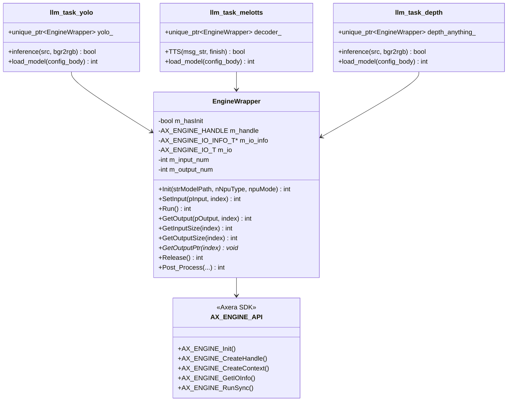

**Sources:**
- [projects/llm_framework/main_yolo/src/EngineWrapper.hpp:11-70]()
- [projects/llm_framework/main_depth_anything/src/EngineWrapper.hpp:11-56]()
- [projects/llm_framework/main_melotts/src/main.cpp:77-78]()

## Initialization Process

Model initialization in `EngineWrapper::Init()` follows a multi-stage process that validates hardware compatibility and prepares the execution environment.

### Initialization Stages

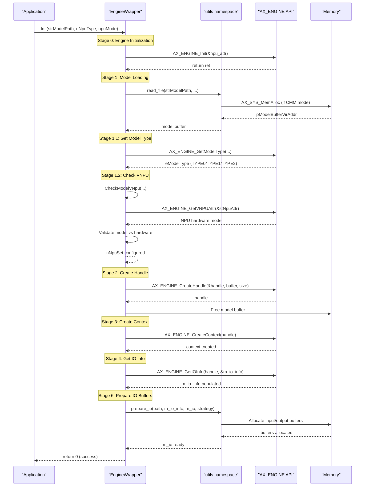

**Sources:**
- [projects/llm_framework/main_yolo/src/EngineWrapper.cpp:182-316]()
- [projects/llm_framework/main_depth_anything/src/EngineWrapper.cpp:181-316]()

### Model Type and Hardware Validation

The AXERA platform supports different model types with varying computational requirements:

| Platform | Model Types | Description |
|----------|-------------|-------------|
| AX650C | TYPE0 (3.6T), TYPE1 (7.2T), TYPE2 (18T) | Different TOPS ratings |
| AX620E/AX620Q | TYPE0 (HalfOCM), TYPE1 (FullOCM) | On-Chip Memory modes |

The `CheckModelVNpu()` function validates model compatibility with the configured VNPU mode:

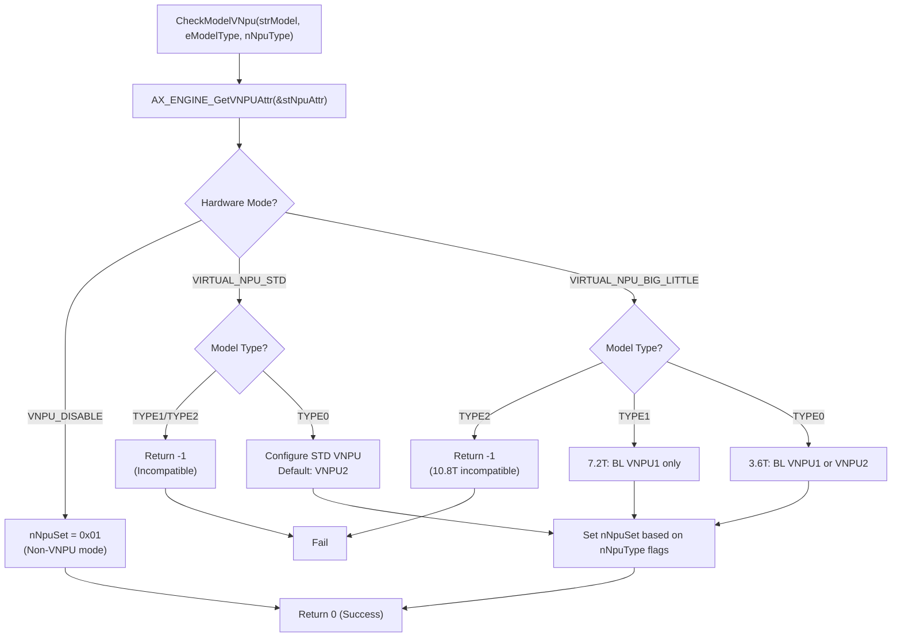

**VNPU Type Flags:**

| Flag | Value | Description |
|------|-------|-------------|
| AX_NPU_DEFAULT | 0 | Use system default NPU |
| AX_STD_VNPU_1 | 1 << 0 | Standard VNPU1 |
| AX_STD_VNPU_2 | 1 << 1 | Standard VNPU2 |
| AX_STD_VNPU_3 | 1 << 2 | Standard VNPU3 |
| AX_BL_VNPU_1 | 1 << 3 | Big-Little VNPU1 |
| AX_BL_VNPU_2 | 1 << 4 | Big-Little VNPU2 |

**Sources:**
- [projects/llm_framework/main_yolo/src/EngineWrapper.cpp:26-134]()
- [projects/llm_framework/main_depth_anything/src/EngineWrapper.cpp:26-179]()
- [projects/llm_framework/main_melotts/src/runner/EngineWrapper.cpp:26-175]()

## Model Execution Flow

Model inference follows a three-step pattern: set inputs, run synchronously, retrieve outputs.

### Basic Execution Pattern


### YOLO Inference Example

The YOLO object detection unit demonstrates typical `EngineWrapper` usage:

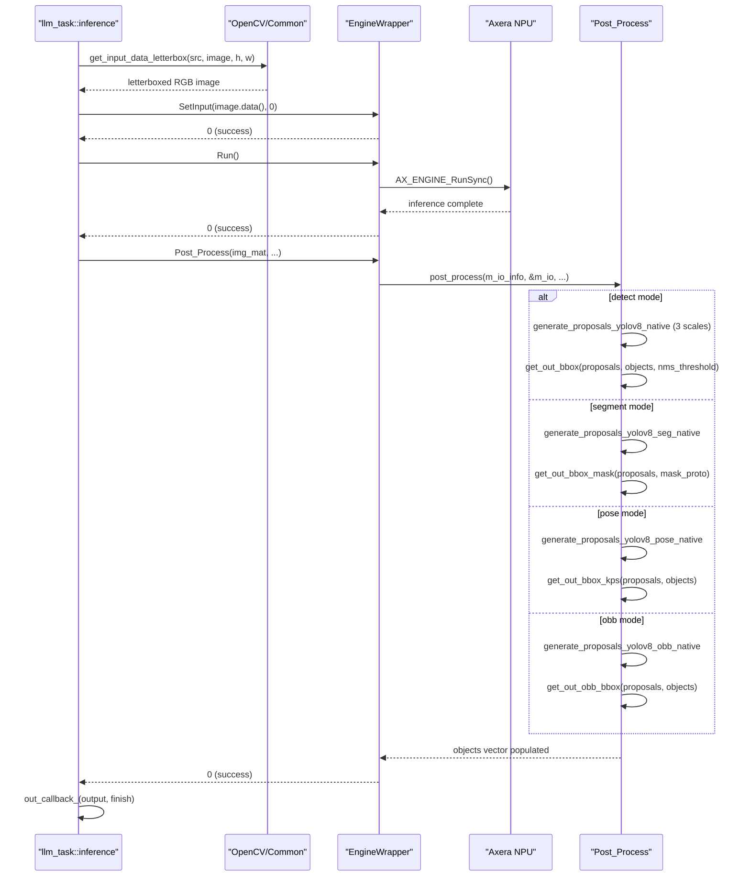

**Sources:**
- [projects/llm_framework/main_yolo/src/main.cpp:225-289]()
- [projects/llm_framework/main_yolo/src/EngineWrapper.cpp:319-336]()
- [projects/llm_framework/main_yolo/src/EngineWrapper.cpp:427-492]()

### MeloTTS Decoder Execution

MeloTTS uses `EngineWrapper` for its decoder model, processing encoded phoneme features:

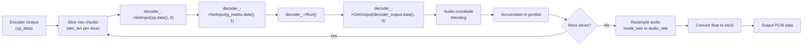

The decoder processes audio in slices with overlap and crossfading to avoid artifacts:

**Slice Processing Parameters:**

| Parameter | Value | Description |
|-----------|-------|-------------|
| overlap_size | 1024 | Samples overlap between slices |
| fade_size | 512 | Crossfade length in samples |
| dec_len | Calculated | Decoder input size / channels |
| audio_slice_len | Calculated | Decoder output size |

**Sources:**
- [projects/llm_framework/main_melotts/src/main.cpp:307-418]()
- [projects/llm_framework/main_melotts/src/main.cpp:208-209]()

## IO Buffer Management

`EngineWrapper` manages input and output buffers through the `AX_ENGINE_IO_T` structure. Buffer allocation is handled by utility functions in the `utils` namespace.

### Buffer Structure

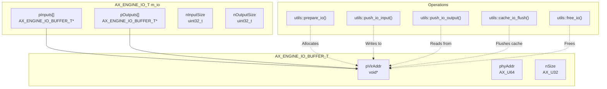

### Buffer Allocation Strategy

The `utils::prepare_io()` function supports multiple allocation strategies:

| Strategy | Description | Use Case |
|----------|-------------|----------|
| IO_BUFFER_STRATEGY_DEFAULT | Standard allocation | General purpose |
| IO_BUFFER_STRATEGY_CACHED | CPU-cached memory | Frequent CPU access |

Buffer memory is allocated using `AX_SYS_MemAlloc()` for physical-contiguous memory required by NPU DMA operations.

**Sources:**
- [projects/llm_framework/main_yolo/src/EngineWrapper.cpp:272-316]()
- [projects/llm_framework/main_yolo/src/EngineWrapper.cpp:319-341]()

## Multi-Unit Integration

Different StackFlow units use `EngineWrapper` for their specific model types. The integration pattern is consistent across units.

### Integration Pattern Per Unit

```mermaid
graph TB
    subgraph "llm-yolo Unit"
        Y1["llm_task"] --> Y2["unique_ptr<EngineWrapper> yolo_"]
        Y2 --> Y3["Init: yolo11n.axmodel"]
        Y3 --> Y4["inference: detect/segment/pose/obb"]
        Y4 --> Y5["Post_Process: NMS + bbox"]
    end
    
    subgraph "llm-depth-anything Unit"
        D1["llm_task"] --> D2["unique_ptr<EngineWrapper> depth_anything_"]
        D2 --> D3["Init: depth_anything.axmodel"]
        D3 --> D4["inference: depth estimation"]
        D4 --> D5["Post_Process: colormap + JPEG"]
    end
    
    subgraph "llm-melotts Unit"
        M1["llm_task"] --> M2["unique_ptr<EngineWrapper> decoder_"]
        M2 --> M3["Init: decoder.axmodel"]
        M3 --> M4["TTS: phoneme decoding"]
        M4 --> M5["Audio slice processing"]
    end
    
    subgraph "llm-whisper Unit"
        W1["llm_task"] --> W2["unique_ptr<EngineWrapper> encoder_"]
        W3["unique_ptr<EngineWrapper> decoder_"]
        W2 --> W4["Init: encoder.axmodel"]
        W3 --> W5["Init: decoder.axmodel"]
        W4 --> W6["ASR: audio encoding"]
        W5 --> W7["ASR: token decoding"]
    end
    
    style Y2 fill:#f9f9f9
    style D2 fill:#f9f9f9
    style M2 fill:#f9f9f9
    style W2 fill:#f9f9f9
    style W3 fill:#f9f9f9
```

### Model Configuration and Loading

Each unit loads models through a configuration-driven pattern:

| Unit | Model Config Parameter | Typical Model Size | Model Format |
|------|----------------------|-------------------|--------------|
| llm-yolo | `yolo_model` | 2.8-3.2 MB | .axmodel (YOLO11n) |
| llm-depth-anything | `depth_anything_model` | ~29 MB | .axmodel |
| llm-melotts | `decoder` | ~102 MB | .axmodel |
| llm-whisper | `encoder`, `decoder` | 201-725 MB total | .axmodel |

**Configuration Flow:**

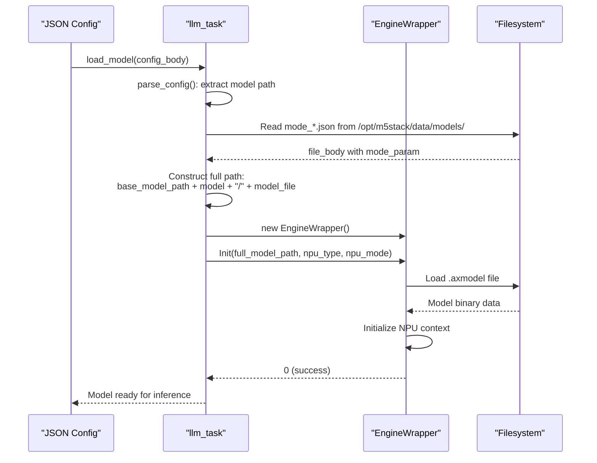

**Sources:**
- [projects/llm_framework/main_yolo/src/main.cpp:100-147]()
- [projects/llm_framework/main_depth_anything/src/main.cpp:89-131]()
- [projects/llm_framework/main_melotts/src/main.cpp:131-222]()

## Memory Management

`EngineWrapper` implements RAII (Resource Acquisition Is Initialization) for automatic resource cleanup.

### Resource Lifecycle

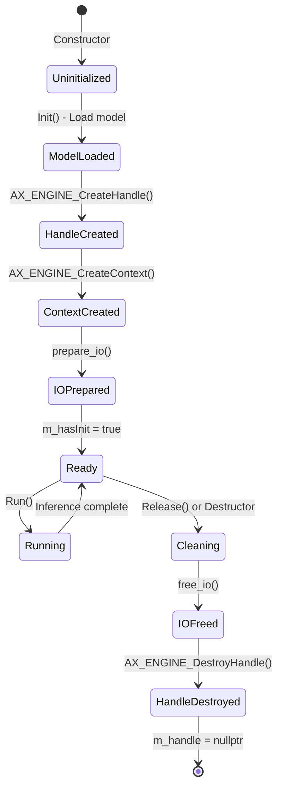

### Memory Allocation Methods

Two methods for loading models:

**1. CMM (Contiguous Memory Manager) Mode:**
```
utils::read_file() → AX_SYS_MemAlloc() → Physical contiguous memory
```
- Used by default (`bLoadModelUseCmm = AX_TRUE`)
- Required for zero-copy NPU access
- Freed with `AX_SYS_MemFree(u64ModelBufferPhyAddr, &pModelBufferVirAddr)`

**2. Standard Heap Mode:**
```
utils::read_file() → std::vector<char> → Virtual memory
```
- Fallback option
- Model copied during handle creation
- Freed with vector destructor

**Sources:**
- [projects/llm_framework/main_yolo/src/EngineWrapper.cpp:195-227]()
- [projects/llm_framework/main_yolo/src/EngineWrapper.cpp:359-367]()

## Async Inference Pattern

Units like YOLO and depth-anything implement asynchronous inference using a thread-safe queue pattern:

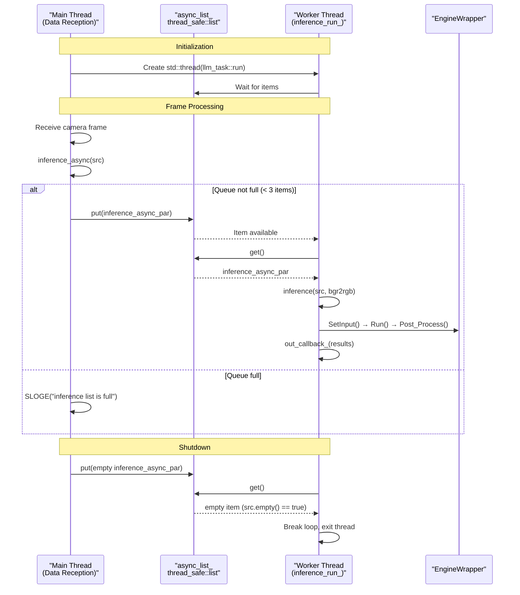

**Queue Management:**

| Parameter | Value | Purpose |
|-----------|-------|---------|
| Max queue size | 3 | Prevent memory overflow from fast input |
| Queue type | `thread_safe::list<inference_async_par>` | Lock-free producer-consumer |
| Stop signal | Empty cv::Mat in queue item | Signal thread termination |

**Sources:**
- [projects/llm_framework/main_yolo/src/main.cpp:200-223]()
- [projects/llm_framework/main_yolo/src/main.cpp:312-333]()
- [projects/llm_framework/main_depth_anything/src/main.cpp:181-204]()

## Hardware Initialization

All units using `EngineWrapper` must initialize the Axera system APIs before creating `EngineWrapper` instances:

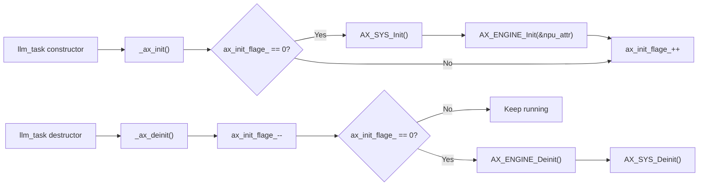

The reference counting pattern (`ax_init_flage_`) ensures proper initialization/deinitialization when multiple `llm_task` instances exist.

**Initialization Order:**
1. `AX_SYS_Init()` - System-level initialization
2. `AX_ENGINE_Init(&npu_attr)` - NPU engine initialization (may be called within `EngineWrapper::Init()` depending on version)
3. `EngineWrapper::Init()` - Model-specific initialization

**Sources:**
- [projects/llm_framework/main_yolo/src/main.cpp:291-310]()
- [projects/llm_framework/main_melotts/src/main.cpp:473-499]()

## Error Handling

`EngineWrapper` methods return integer error codes following Axera SDK conventions:

| Return Value | Meaning | Common Causes |
|--------------|---------|---------------|
| 0 | Success | Operation completed successfully |
| -1 | Generic failure | File not found, allocation failure |
| Non-zero AX error code | SDK-specific error | `AX_ENGINE_RunSync()` failures, context errors |

**Error Propagation Pattern:**

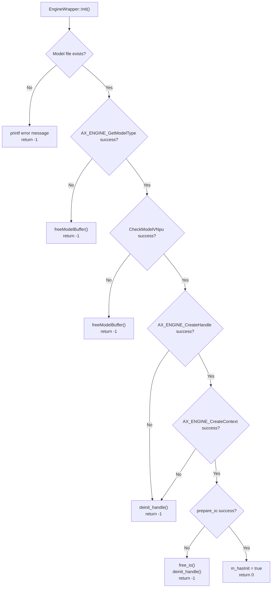

Units wrap `EngineWrapper` errors in their own error response format:

```
EngineWrapper returns -1
  → llm_task::load_model() returns -5
    → llm_unit::setup() sends error_body:
       {"code": -5, "message": "Model loading failed."}
```

**Sources:**
- [projects/llm_framework/main_yolo/src/EngineWrapper.cpp:182-316]()
- [projects/llm_framework/main_yolo/src/main.cpp:481-519]()