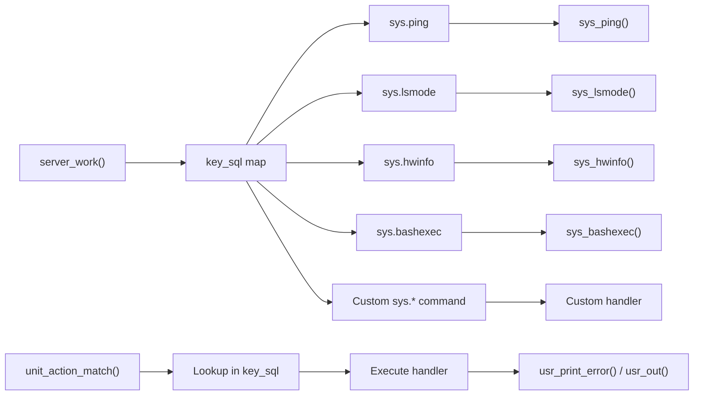
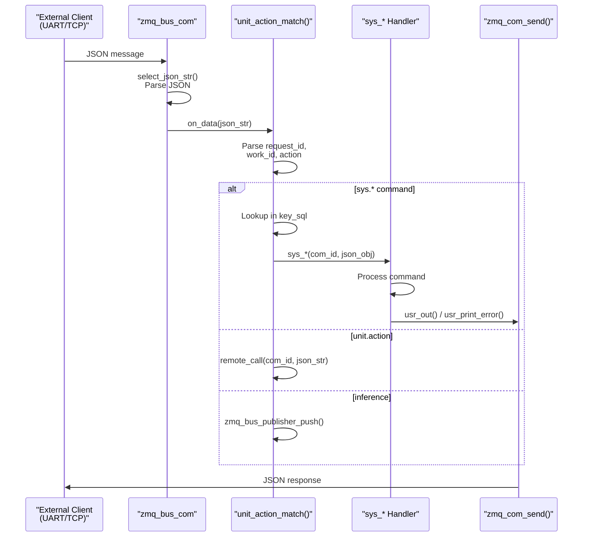
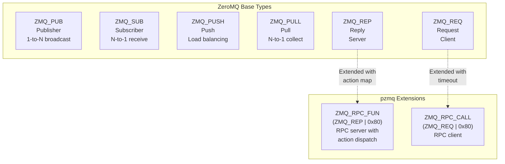
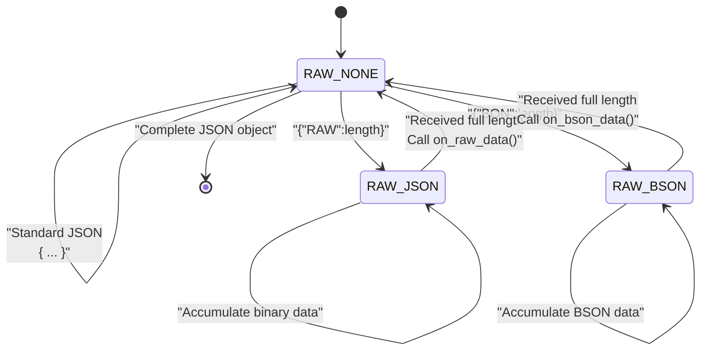
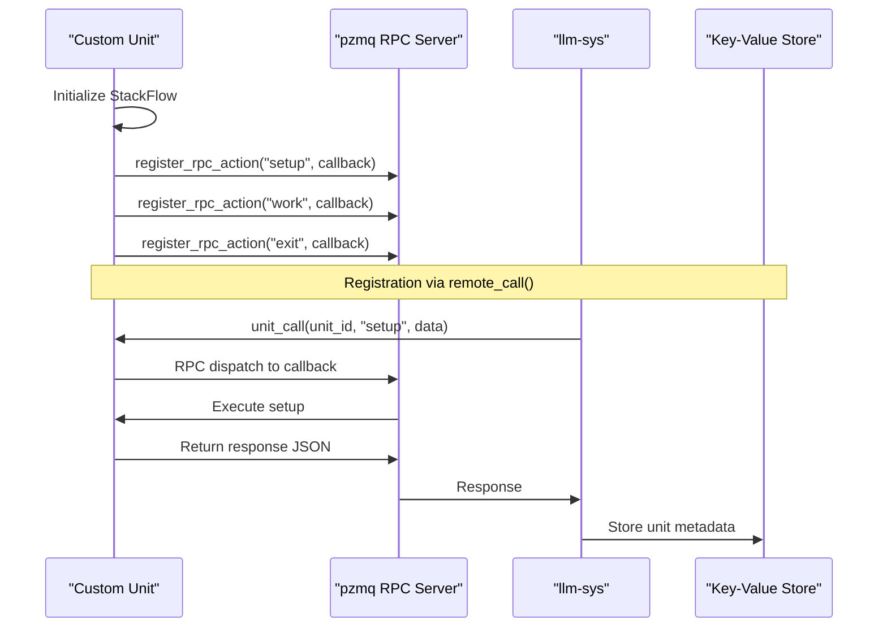

StackFlow Extending StackFlow Framework

# Extending StackFlow Framework

<details>
<summary>Relevant source files</summary>

The following files were used as context for generating this wiki page:

- [ext_components/StackFlow/stackflow/pzmq.hpp](ext_components/StackFlow/stackflow/pzmq.hpp)
- [ext_components/ax_msp/Kconfig](ext_components/ax_msp/Kconfig)
- [projects/llm_framework/SConstruct](projects/llm_framework/SConstruct)
- [projects/llm_framework/config_defaults.mk](projects/llm_framework/config_defaults.mk)
- [projects/llm_framework/main_sys/include/zmq_bus.h](projects/llm_framework/main_sys/include/zmq_bus.h)
- [projects/llm_framework/main_sys/src/event_loop.cpp](projects/llm_framework/main_sys/src/event_loop.cpp)
- [projects/llm_framework/main_sys/src/serial_com.cpp](projects/llm_framework/main_sys/src/serial_com.cpp)
- [projects/llm_framework/main_sys/src/tcp_com.cpp](projects/llm_framework/main_sys/src/tcp_com.cpp)
- [projects/llm_framework/main_sys/src/zmq_bus.cpp](projects/llm_framework/main_sys/src/zmq_bus.cpp)

</details>


## Purpose and Scope

This document covers advanced topics for extending the core StackFlow framework itself, including adding new RPC actions, modifying the communication layer, implementing custom protocols, and extending the event system. This page is intended for developers who need to modify or enhance the framework's fundamental capabilities.

For creating new AI processing units that use the existing framework, see [Creating Custom Units](#10.1). For integrating new AI models into existing units, see [Model Integration](#10.2).

---

## System-Level RPC Command Extension

### Command Registration Architecture

System-level commands (prefix `sys.*`) are handled by the `llm-sys` unit through a dispatch table in [projects/llm_framework/main_sys/src/event_loop.cpp:743-762]().

**Registration Pattern:**



**Sources:** [projects/llm_framework/main_sys/src/event_loop.cpp:743-762](), [projects/llm_framework/main_sys/src/event_loop.cpp:770-843]()

### Adding New System Commands

System commands follow a standard function signature and registration pattern:

| Component | Location | Purpose |
|-----------|----------|---------|
| Function signature | `int sys_*(int com_id, const nlohmann::json &json_obj)` | Handler function prototype |
| Registration map | `key_sql` global map | Command name to function pointer mapping |
| Dispatcher | `unit_action_match()` | Routes commands to handlers |
| Response helpers | `usr_print_error()`, `usr_out()` | Standardized response formatting |

**Implementation Steps:**

1. **Define handler function** in [event_loop.cpp]() with signature:
   ```cpp
   int sys_mycommand(int com_id, const nlohmann::json &json_obj)
   ```

2. **Register in `server_work()`**:
   ```cpp
   key_sql["sys.mycommand"] = sys_mycommand;
   ```

3. **Access request parameters**:
   - `json_obj["request_id"]` - Client request identifier
   - `json_obj["work_id"]` - Target work ID (usually "sys")
   - `json_obj["data"]` - Command-specific payload
   - `json_obj["object"]` - Object type specification

4. **Send responses** using helper functions at [projects/llm_framework/main_sys/src/event_loop.cpp:44-74]():
   - `usr_print_error(request_id, work_id, error_json, com_id)` - Error responses
   - `usr_out(request_id, work_id, data, com_id)` - Success responses

**Sources:** [projects/llm_framework/main_sys/src/event_loop.cpp:76-81](), [projects/llm_framework/main_sys/src/event_loop.cpp:743-762]()

### Command Dispatch Flow



**Sources:** [projects/llm_framework/main_sys/src/event_loop.cpp:770-843](), [projects/llm_framework/main_sys/src/zmq_bus.cpp:179-186]()

### Threading Considerations

Many system commands spawn detached threads to avoid blocking the event loop:

| Pattern | Example Command | Location |
|---------|----------------|----------|
| Detached thread | `sys.hwinfo` | [event_loop.cpp:190-196]() |
| Detached thread | `sys.bashexec` | [event_loop.cpp:661-693]() |
| Direct execution | `sys.ping` | [event_loop.cpp:76-81]() |

Commands that perform I/O, execute subprocesses, or take significant time should use the detached thread pattern:

```cpp
int sys_mycommand(int com_id, const nlohmann::json &json_obj) {
    std::thread t(_sys_mycommand, com_id, json_obj);
    t.detach();
    return 0;
}
```

**Sources:** [projects/llm_framework/main_sys/src/event_loop.cpp:190-196]()

---

## pzmq Communication Layer Extensions

### pzmq Architecture

The `pzmq` class in [ext_components/StackFlow/stackflow/pzmq.hpp]() wraps ZeroMQ sockets with automatic reconnection, context management, and custom RPC patterns.

**Socket Types and Modes:**



**Sources:** [ext_components/StackFlow/stackflow/pzmq.hpp:17-18](), [ext_components/StackFlow/stackflow/pzmq.hpp:235-268]()

### RPC Action System

The pzmq RPC system allows registering multiple named actions on a single REP socket:

| Method | Purpose | Location |
|--------|---------|----------|
| `register_rpc_action(action, callback)` | Register named RPC handler | [pzmq.hpp:171-186]() |
| `unregister_rpc_action(action)` | Remove RPC handler | [pzmq.hpp:187-193]() |
| `call_rpc_action(action, data, callback)` | Call remote RPC action | [pzmq.hpp:194-224]() |
| `_rpc_list_action()` | Built-in action list introspection | [pzmq.hpp:153-170]() |

**Registration Pattern:**

```mermaid
sequenceDiagram
    participant Unit as "StackFlow Unit"
    participant PZMQ as "pzmq Instance"
    participant Map as "zmq_fun_ map"
    participant Loop as "zmq_event_loop()"
    
    Unit->>PZMQ: register_rpc_action("setup", callback)
    PZMQ->>PZMQ: Check if first action
    alt First action
        PZMQ->>PZMQ: creat_rep(url)
        PZMQ->>Loop: Start event loop thread
    end
    PZMQ->>Map: zmq_fun_["setup"] = callback
    
    Note over Loop: On message receive
    Loop->>Loop: Receive action name + data
    Loop->>Map: Lookup action in zmq_fun_
    Map->>Loop: Return callback
    Loop->>Unit: callback(pzmq*, data)
    Loop->>Loop: Send response
```

**Sources:** [ext_components/StackFlow/stackflow/pzmq.hpp:171-186](), [ext_components/StackFlow/stackflow/pzmq.hpp:348-393]()

### Adding Custom Socket Patterns

To add new socket patterns or behaviors, extend the `creat()` method dispatch:

**Current Socket Creation Functions:**

| Function | Socket Type | Binding | Location |
|----------|-------------|---------|----------|
| `creat_pub()` | ZMQ_PUB | bind | [pzmq.hpp:304-307]() |
| `creat_push()` | ZMQ_PUSH | connect | [pzmq.hpp:308-312]() |
| `creat_pull()` | ZMQ_PULL | bind + event loop | [pzmq.hpp:313-319]() |
| `subscriber_url()` | ZMQ_SUB | connect + event loop | [pzmq.hpp:320-327]() |
| `creat_rep()` | ZMQ_REP | bind + RPC dispatch | [pzmq.hpp:328-335]() |
| `creat_req()` | ZMQ_REQ | connect + timeout | [pzmq.hpp:336-347]() |

**Extension Pattern:**

1. Add new mode constant in [pzmq.hpp:17-18]():
   ```cpp
   #define ZMQ_CUSTOM_PATTERN (ZMQ_BASE_TYPE | 0xC0)
   ```

2. Add case to `creat()` switch at [pzmq.hpp:235-268]():
   ```cpp
   case ZMQ_CUSTOM_PATTERN: {
       return creat_custom_pattern(url, raw_call);
   } break;
   ```

3. Implement socket creation function:
   ```cpp
   inline int creat_custom_pattern(const std::string &url, const msg_callback_fun &raw_call) {
       // Configure socket options
       // Bind or connect
       // Optionally start event loop thread
   }
   ```

**Sources:** [ext_components/StackFlow/stackflow/pzmq.hpp:225-269]()

### Context Attachment System

pzmq provides three context storage mechanisms for attaching custom data to sockets:

| Type | Methods | Use Case |
|------|---------|----------|
| Raw pointer | `context()`, `setContext()`, `newContext<T>()`, `getContext<T>()`, `deleteContext<T>()` | Manual memory management |
| `shared_ptr` | `contextPtr()`, `setContextPtr()`, `newContextPtr<T>()`, `getContextPtr<T>()` | Automatic memory management |
| `weak_ptr` | `wcontextPtr()`, `wsetContextPtr()`, `wgetContextPtr<T>()` | Non-owning references |

This allows storing state with the pzmq instance that callbacks can access:

```cpp
auto my_pzmq = std::make_unique<pzmq>("ipc:///tmp/my_socket", ZMQ_PULL, 
    [](pzmq *self, const std::shared_ptr<pzmq_data> &data) {
        auto my_state = self->getContextPtr<MyState>();
        // Access custom state in callback
    });
my_pzmq->newContextPtr<MyState>();
```

**Sources:** [ext_components/StackFlow/stackflow/pzmq.hpp:429-506]()

---

## Protocol Extensions

### Message Format Parsing

The `zmq_bus_com` class implements a state machine for parsing multiple message formats from incoming byte streams:

**Protocol State Machine:**



**Sources:** [projects/llm_framework/main_sys/src/zmq_bus.cpp:196-300](), [projects/llm_framework/main_sys/include/zmq_bus.h:45-49]()

### Supported Protocol Formats

| Format | Trigger | Handler | Purpose | Location |
|--------|---------|---------|---------|----------|
| JSON | `{...}` standard format | `on_data()` | Standard structured messages | [zmq_bus.cpp:56-59]() |
| RAW | `{"RAW":length}` + binary | `on_raw_data()` | Binary data with base64 encoding | [zmq_bus.cpp:61-87]() |
| BSON | `{"BON":length}` + binary | `on_bson_data()` | Binary JSON for efficiency | [zmq_bus.cpp:89-110]() |

**RAW Protocol Flow:**

1. Client sends `{"RAW":12345, "request_id":"...", "work_id":"..."}`
2. Parser enters `RAW_JSON` state, stores expected length
3. Client sends 12345 bytes of binary data
4. Parser accumulates data in `raw_msg_buff_`
5. When complete, calls `on_raw_data()` which base64-encodes and forwards to `on_data()`

**Sources:** [projects/llm_framework/main_sys/src/zmq_bus.cpp:264-278]()

### Adding New Protocol Formats

To add a new protocol format:

**1. Define State Enum** in [projects/llm_framework/main_sys/include/zmq_bus.h:45-49]():

```cpp
enum RAW_MSG_TYPE {
    RAW_NONE = 0,
    RAW_JSON = 1,
    RAW_BSON = 2,
    RAW_CUSTOM = 3,  // New protocol
};
```

**2. Add Detection Logic** in `select_json_str()` at [zmq_bus.cpp:196-300]():

```cpp
// In RAW_NONE state, after JSON object complete
if ((json_str_.length() > 7) && (json_str_[1] == '"') && 
    (json_str_[2] == 'C') && (json_str_[3] == 'U') &&
    (json_str_[4] == 'S') && (json_str_[5] == '"') &&
    (json_str_[6] == ':')) {
    reace_event_ = RAW_CUSTOM;
    raw_msg_len_ = std::stoi(StackFlows::sample_json_str_get(json_str_, "CUS"));
    raw_msg_buff_.reserve(raw_msg_len_);
    // Handle remaining data
}
```

**3. Add State Handler** in `select_json_str()` switch:

```cpp
case RAW_CUSTOM: {
    if (raw_msg_len_ > src_str->length()) {
        raw_msg_buff_.append(src_str->c_str(), src_str->length());
        raw_msg_len_ -= src_str->length();
    } else {
        reace_event_ = RAW_NONE;
        raw_msg_buff_.append(src_str->c_str(), raw_msg_len_);
        on_custom_data(raw_msg_buff_);  // New handler
        raw_msg_buff_.clear();
        json_str_.clear();
        // Handle remaining data
    }
} break;
```

**4. Implement Handler** as virtual method override:

```cpp
void zmq_bus_com::on_custom_data(const std::string &data) {
    // Parse custom format
    // Convert to standard JSON
    on_data(converted_json);
}
```

**Sources:** [projects/llm_framework/main_sys/src/zmq_bus.cpp:230-253](), [projects/llm_framework/main_sys/include/zmq_bus.h:70-73]()

### NEON-Optimized JSON Parsing

The JSON parser uses ARM NEON SIMD instructions for fast bracket detection on supported platforms:

**Optimization Pattern** at [zmq_bus.cpp:207-223]():

```cpp
#if defined(__ARM_NEON) || defined(__ARM_NEON__)
if (src_str->length() - i >= 16) {
    uint8x16_t target_open = vdupq_n_u8('{');
    uint8x16_t target_close = vdupq_n_u8('}');
    uint8x16_t input_vector = vld1q_u8((const uint8_t *)&data[i]);
    uint8x16_t result_open = vceqq_u8(input_vector, target_open);
    uint8x16_t result_close = vceqq_u8(input_vector, target_close);
    uint8x16_t result_mask = vorrq_u8(result_open, result_close);
    __uint128_t jflage;
    vst1q_u8((uint8_t *)&jflage, result_mask);
    if (jflage == 0) {
        json_str_.append(data + i, 16);
        i += 15;
        continue;
    }
}
#endif
```

This processes 16 bytes per iteration when no JSON structural characters are present.

**Sources:** [projects/llm_framework/main_sys/src/zmq_bus.cpp:207-223]()

---

## Custom Event Handlers and Transport Extensions

### Communication Interface Hierarchy

```mermaid
classDiagram
    class zmq_bus_com {
        +work(zmq_url_format, port)
        +stop()
        +on_data(data) virtual
        +on_raw_data(data) virtual
        +on_bson_data(data) virtual
        +send_data(data) virtual
        +reace_data_event() virtual
        #select_json_str(json_src, callback)
        #user_chennal_ pzmq
    }
    
    class serial_com {
        -uart_fd int
        +send_data(data) override
        +reace_data_event() override
        +stop() override
    }
    
    class tcp_com {
        -channel weak_ptr
        -tcp_server_mutex mutex
        +send_data(data) override
    }
    
    zmq_bus_com <|-- serial_com
    zmq_bus_com <|-- tcp_com
    
    serial_com --> "linux_uart_*" : uses
    tcp_com --> "hv::SocketChannel" : uses
```

**Sources:** [projects/llm_framework/main_sys/include/zmq_bus.h:43-77](), [projects/llm_framework/main_sys/src/serial_com.cpp:28-85](), [projects/llm_framework/main_sys/src/tcp_com.cpp:33-59]()

### Adding New Transport Mechanisms

To add a new communication interface (e.g., WebSocket, HTTP, USB):

**1. Create Derived Class:**

```cpp
class websocket_com : public zmq_bus_com {
private:
    WebSocketServer server_;
    std::shared_ptr<WebSocketConnection> connection_;
    
public:
    websocket_com(int port) : zmq_bus_com() {
        // Initialize WebSocket server
    }
    
    void send_data(const std::string &data) override {
        if (connection_ && exit_flage) {
            connection_->send(data);
        }
    }
    
    void reace_data_event() override {
        // Event loop for WebSocket messages
        while (exit_flage) {
            auto data = connection_->receive();
            try {
                select_json_str(data, 
                    std::bind(&websocket_com::on_data, this, 
                              std::placeholders::_1));
            } catch (...) {
                // Error handling
            }
        }
    }
    
    void stop() override {
        zmq_bus_com::stop();
        server_.close();
    }
};
```

**2. Integrate into Main:**

Add initialization in [projects/llm_framework/main_sys/src/main.cpp]():

```cpp
std::unique_ptr<websocket_com> ws_con_;

void websocket_work() {
    int port;
    SAFE_READING(port, int, "config_websocket_port");
    ws_con_ = std::make_unique<websocket_com>(port);
    ws_con_->work(zmq_s_format, port_offset++);
}

void websocket_stop_work() {
    ws_con_.reset();
}
```

**Sources:** [projects/llm_framework/main_sys/src/serial_com.cpp:28-85](), [projects/llm_framework/main_sys/src/tcp_com.cpp:33-74]()

### Transport-Specific Considerations

| Transport | Key Requirements | Example Location |
|-----------|-----------------|------------------|
| UART | Baud rate config, ALSA integration | [serial_com.cpp:33-40]() |
| TCP | Port management, thread-per-connection | [tcp_com.cpp:61-75]() |
| WebSocket | Handshake handling, frame parsing | N/A (future extension) |
| HTTP REST | Request routing, response marshaling | N/A (future extension) |

Each transport must:
1. Implement `send_data()` for output
2. Implement `reace_data_event()` for input event loop
3. Call `select_json_str()` to parse incoming data
4. Allocate unique ZMQ port via `work(zmq_s_format, port)`

**Sources:** [projects/llm_framework/main_sys/src/tcp_com.cpp:61-93]()

---

## Build System Integration

### Component Registration Pattern

When adding new framework components, register them in the build system:

**1. Create Component Directory:**

```
ext_components/MyExtension/
├── include/
│   └── my_extension.hpp
├── src/
│   └── my_extension.cpp
├── SConstruct
└── Kconfig
```

**2. Component SConstruct** (similar to [ext_components/StackFlow/SConstruct]()):

```python
Import('env')

if env['PROJECT_TOOL_S'] == None:
    return

SRCS = []
INCLUDE = []
PRIVATE_INCLUDE = []
REQUIREMENTS = []
STATIC_LIB = []

COMPONENT_NAME = 'MyExtension'

# Source files
SRCS += ['src/my_extension.cpp']

# Public headers
INCLUDE += ['include']

# Dependencies
REQUIREMENTS += ['StackFlow']

# Register component
register_component(
    COMPONENT_NAME=COMPONENT_NAME,
    SRCS=SRCS,
    INCLUDE=INCLUDE,
    PRIVATE_INCLUDE=PRIVATE_INCLUDE,
    REQUIREMENTS=REQUIREMENTS,
    STATIC_LIB=STATIC_LIB
)
```

**3. Kconfig for Configuration:**

```kconfig
menuconfig MYEXTENSION_ENABLED
    bool "Enable MyExtension support"
    default n
    depends on STACKFLOW_ENABLED
    help
        Enable my custom extension
```

**4. Add to config_defaults.mk** at [projects/llm_framework/config_defaults.mk]():

```makefile
CONFIG_MYEXTENSION_ENABLED=y
```

**Sources:** [projects/llm_framework/SConstruct:1-32](), [projects/llm_framework/config_defaults.mk:1-26](), [ext_components/ax_msp/Kconfig:1-52]()

### Static Library Management

Framework extensions requiring external libraries should follow the versioned static library pattern:

**Version Management** in [projects/llm_framework/SConstruct:8-31]():

```python
version = 'v0.1.4'  # Increment for new dependencies
static_lib = 'static_lib'
update = False

# Check version file
if not os.path.exists(static_lib):
    update = True
else:
    with open(str(Path(static_lib)/'version'), 'r') as f:
        if f.read() != version:
            update = True

# Download if needed
if update:
    down_url = "https://m5stack.oss-cn-shenzhen.aliyuncs.com/resource/linux/llm/static_lib_{}.tar.gz".format(version)
    down_path = check_wget_down(down_url, "static_lib_{}.tar.gz".format(version))
    shutil.move(down_path, static_lib)
```

**Directory Structure:**

```
static_lib_v0.1.3/
├── version
├── lib/
│   ├── libonnxruntime.so.1.17.1
│   ├── libsherpa-onnx-core.so
│   └── libmy_custom_lib.so
└── include/
    └── my_custom_lib/
```

**Sources:** [projects/llm_framework/SConstruct:8-31]()

---

## Advanced Extension Patterns

### Remote Action Registration

The remote action system at [projects/llm_framework/main_sys/src/remote_action.cpp]() allows units to register with the system controller:

**Registration Flow:**



When extending the framework with new lifecycle actions:

1. Define action in custom unit using `register_rpc_action()`
2. Action becomes callable via `unit_call(unit_id, action, data)`
3. System controller routes through `remote_call()` dispatcher

**Sources:** [ext_components/StackFlow/stackflow/pzmq.hpp:171-186](), [projects/llm_framework/main_sys/src/event_loop.cpp:198-227]()

### Thread Safety Requirements

**Critical Sections:**

| Area | Mechanism | Location |
|------|-----------|----------|
| RPC action map | `zmq_fun_mtx_` mutex | [pzmq.hpp:97](), [pzmq.hpp:174]() |
| System command dispatch | `unit_action_match_mtx` | [event_loop.cpp:767]() |
| TCP connection state | `tcp_server_mutex` | [tcp_com.cpp:37](), [tcp_com.cpp:82]() |

When adding new shared state:
- Use `std::mutex` for critical sections
- Use `std::atomic` for flags and counters
- Spawn detached threads for long operations to avoid blocking dispatch

**Example Pattern:**

```cpp
std::mutex extension_mutex_;
std::atomic<bool> extension_active_{false};

void thread_safe_operation() {
    std::lock_guard<std::mutex> lock(extension_mutex_);
    // Modify shared state
}
```

**Sources:** [ext_components/StackFlow/stackflow/pzmq.hpp:97](), [projects/llm_framework/main_sys/src/event_loop.cpp:767](), [projects/llm_framework/main_sys/src/tcp_com.cpp:82]()

### Error Handling Patterns

Framework extensions should follow the standardized error response format:

**Error Response Structure:**

```json
{
  "request_id": "client_request_id",
  "work_id": "extension_name",
  "created": 1234567890,
  "object": "sys.utf-8",
  "data": "None",
  "error": {
    "code": -10,
    "message": "Extension-specific error message"
  }
}
```

**Common Error Codes:**

| Code | Meaning | Usage |
|------|---------|-------|
| 0 | Success | Normal operation |
| -1 | General error | Catch-all for unexpected errors |
| -2 | JSON format error | Malformed request |
| -3 | Action match false | Unknown command |
| -4 | Push failure | ZMQ communication error |
| -9 | Unit call false | Target unit unavailable |
| -10 | Not implemented | Feature not available |
| -17 | File error | File operation failed |

Use `usr_print_error()` helper for consistent formatting.

**Sources:** [projects/llm_framework/main_sys/src/event_loop.cpp:44-56](), [projects/llm_framework/main_sys/src/event_loop.cpp:776-842]()

---

## Best Practices Summary

### Extension Checklist

When extending the StackFlow framework:

- [ ] Add appropriate mutexes for shared state
- [ ] Use detached threads for blocking operations
- [ ] Follow naming conventions (`sys_*` for system commands)
- [ ] Implement proper error responses with error codes
- [ ] Register in build system with Kconfig options
- [ ] Document RPC protocol in JSON format
- [ ] Add to static library archive if external dependencies required
- [ ] Test with both UART and TCP transports
- [ ] Handle cleanup in destructors and stop methods
- [ ] Provide configuration options in [config_defaults.mk]()

### Performance Considerations

| Optimization | Technique | Location |
|--------------|-----------|----------|
| JSON parsing | NEON SIMD instructions | [zmq_bus.cpp:207-223]() |
| Memory allocation | Reserve buffer capacity upfront | [zmq_bus.cpp:204]() |
| ZMQ reconnection | Exponential backoff | [pzmq.hpp:240-252]() |
| Thread creation | Detach for fire-and-forget operations | [event_loop.cpp:98-100]() |
| String operations | Use `.substr()` with shared_ptr to avoid copies | [zmq_bus.cpp:237-239]() |

**Sources:** [projects/llm_framework/main_sys/src/zmq_bus.cpp:207-223](), [ext_components/StackFlow/stackflow/pzmq.hpp:240-252]()