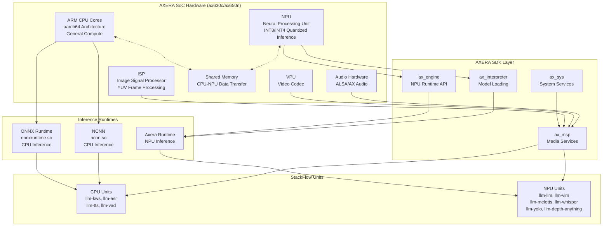
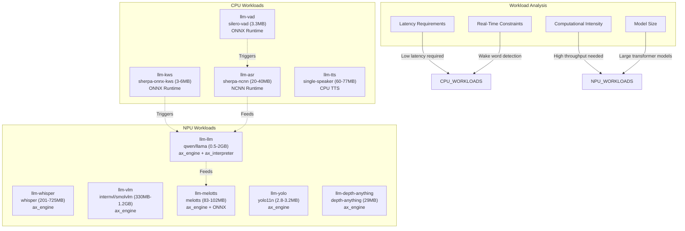
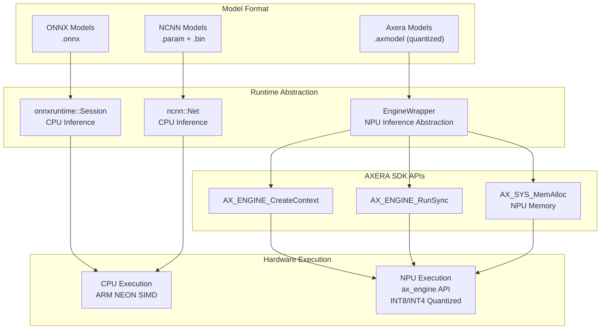
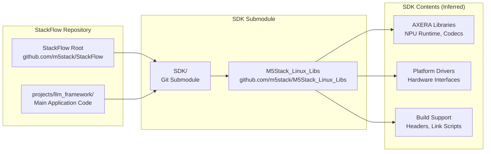
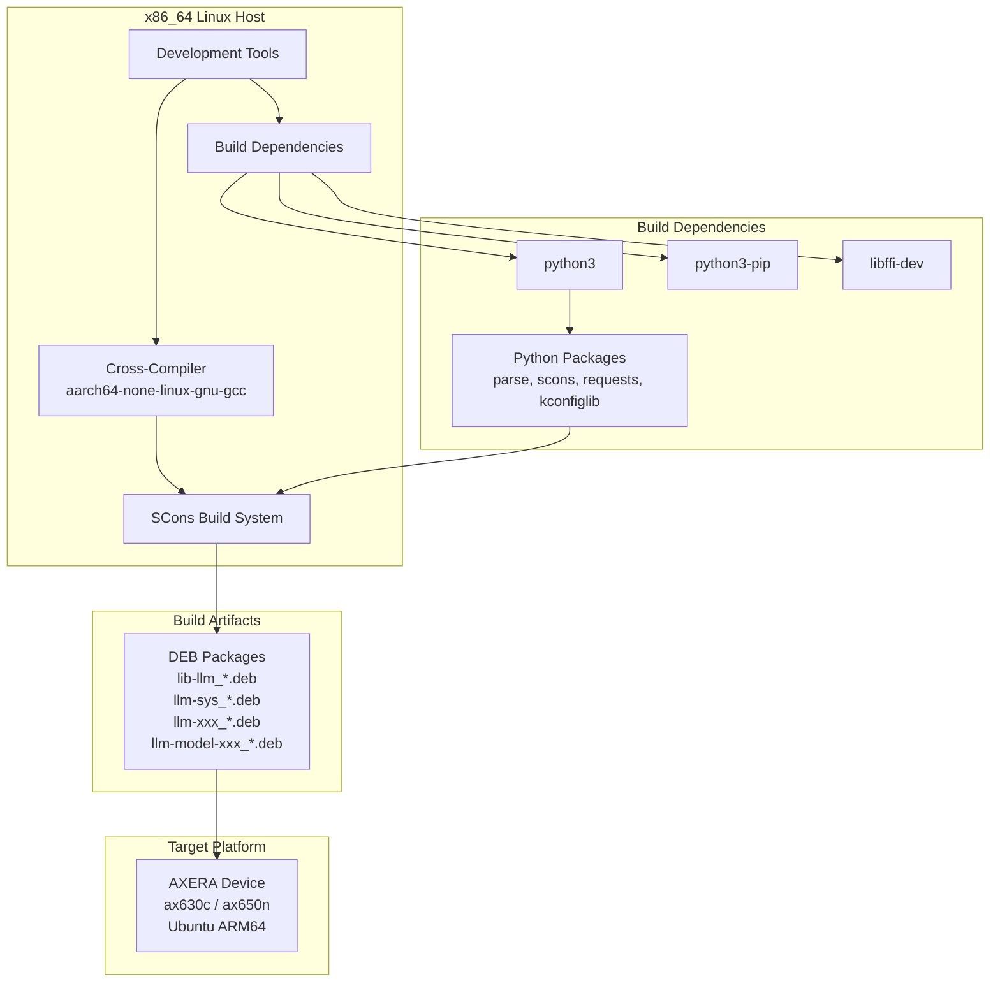
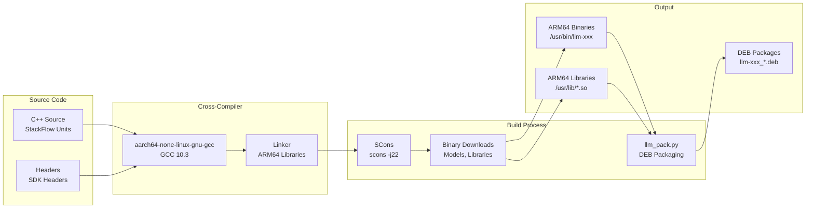
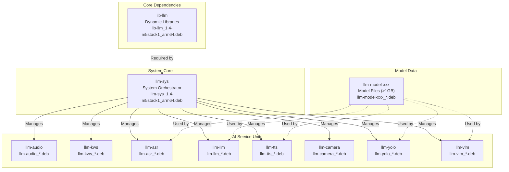

StackFlow Hardware Platform and Acceleration

# Hardware Platform and Acceleration

<details>
<summary>Relevant source files</summary>

The following files were used as context for generating this wiki page:

- [README.md](README.md)
- [README_zh.md](README_zh.md)
- [doc/component_doc/StackFlow_en.md](doc/component_doc/StackFlow_en.md)
- [doc/component_doc/StackFlow_zh.md](doc/component_doc/StackFlow_zh.md)
- [projects/llm_framework/README.md](projects/llm_framework/README.md)
- [projects/llm_framework/main/SConstruct](projects/llm_framework/main/SConstruct)
- [projects/llm_framework/main_depth_anything/SConstruct](projects/llm_framework/main_depth_anything/SConstruct)
- [projects/llm_framework/main_melotts/SConstruct](projects/llm_framework/main_melotts/SConstruct)
- [projects/llm_framework/main_tts/SConstruct](projects/llm_framework/main_tts/SConstruct)
- [projects/llm_framework/main_whisper/SConstruct](projects/llm_framework/main_whisper/SConstruct)
- [projects/llm_framework/main_yolo/SConstruct](projects/llm_framework/main_yolo/SConstruct)

</details>


## Purpose and Scope

This document describes the AXERA NPU platforms (ax630c, ax650n), the intelligent workload distribution strategy between CPU and NPU, and the hardware abstraction layers that enable StackFlow's AI capabilities. For information about building and deploying StackFlow, see section 6 (Build System) and section 7 (Packaging and Deployment). For details about specific inference engines and model execution, see section 5.4 (EngineWrapper and Model Execution).

## AXERA Acceleration Platform

StackFlow's AI units are built on the AXERA acceleration platform, which provides hardware-accelerated inference capabilities for machine learning models through a heterogeneous computing architecture combining ARM CPU cores with a Neural Processing Unit (NPU).

### Supported SoC Platforms

StackFlow currently supports two AXERA chip platforms optimized for edge AI workloads:

| Platform | Architecture | NPU Capabilities | Primary Use Case |
|----------|-------------|------------------|------------------|
| **ax630c** | ARM64 + NPU | Neural acceleration, multi-VNPU support | Primary embedded AI platform, LLM inference |
| **ax650n** | ARM64 + NPU | Extended NPU capabilities | High-performance CV and multimodal models |

Both platforms provide heterogeneous compute resources:
- **ARM CPU cores**: General-purpose compute, low-latency tasks
- **NPU (Neural Processing Unit)**: High-throughput neural network inference
- **ISP (Image Signal Processor)**: Camera input preprocessing
- **VPU (Video Processing Unit)**: Video encoding/decoding
- **Audio hardware**: Audio capture and playback

**Sources:** [README.md:54-55](), [README_zh.md:106]()

### AXERA Hardware Architecture and Software Stack

**Diagram: AXERA Platform Hardware-Software Integration**



This diagram shows the complete hardware-software stack. CPU-based units use ONNX Runtime or NCNN for inference, while NPU-based units leverage the AXERA SDK (`ax_engine`, `ax_interpreter`) for hardware-accelerated neural network execution. The `ax_msp` (Media Service Platform) provides access to ISP, VPU, and audio hardware for multimedia processing.

**Sources:** [projects/llm_framework/main_melotts/SConstruct:22-23](), [projects/llm_framework/main_yolo/SConstruct:22](), [projects/llm_framework/main_whisper/SConstruct:23](), [projects/llm_framework/main_depth_anything/SConstruct:22](), [projects/llm_framework/main/SConstruct:23-32]()

## CPU vs NPU Workload Distribution

StackFlow implements an intelligent workload distribution strategy that allocates AI tasks to either CPU or NPU based on model characteristics, latency requirements, and computational intensity.

### Workload Allocation Strategy

**Diagram: CPU and NPU Workload Distribution**



This diagram illustrates how StackFlow distributes workloads based on task characteristics. Lightweight, latency-critical tasks (VAD, KWS) run on CPU for immediate response, while computationally intensive inference (LLM, VLM, neural TTS) leverages NPU acceleration.

**Sources:** [README_zh.md:59-103]()

### CPU Unit Characteristics

CPU-based units are optimized for low-latency, real-time processing with small model sizes:

| Unit | Model Size | Runtime | Use Case | Latency Priority |
|------|-----------|---------|----------|------------------|
| `llm-vad` | 3.3 MB | ONNX Runtime | Speech activity detection | Critical |
| `llm-kws` | 3-6 MB | ONNX Runtime | Wake word detection | Critical |
| `llm-asr` | 20-40 MB | NCNN | Streaming speech recognition | High |
| `llm-tts` | 60-77 MB | CPU-native | Traditional TTS synthesis | Medium |

CPU units do not require AXERA SDK dependencies in their build configuration. For example, `llm-tts` in [projects/llm_framework/main_tts/SConstruct:11]() only requires `pthread`, `utilities`, `gomp`, `eventpp`, and `StackFlow`, with no `ax_engine` or `ax_interpreter` dependencies.

**Why CPU for these tasks:**
- **Wake word detection (KWS)** must respond within milliseconds to trigger the voice pipeline
- **VAD** operates continuously on audio streams with minimal overhead
- **Streaming ASR** requires frame-by-frame processing with consistent latency
- **CPU overhead** is acceptable for small models (<100MB) compared to NPU data transfer costs

**Sources:** [projects/llm_framework/main_tts/SConstruct:11](), [README_zh.md:61-65]()

### NPU Unit Characteristics

NPU-based units handle computationally intensive tasks with larger models:

| Unit | Model Size | NPU API | Use Case | Throughput Priority |
|------|-----------|---------|----------|---------------------|
| `llm-whisper` | 201-725 MB | `ax_engine`, `ax_interpreter` | High-accuracy ASR | High |
| `llm-llm` | 0.5-2 GB | `ax_engine`, `ax_interpreter` | LLM inference | Critical |
| `llm-vlm` | 330 MB-1.2 GB | `ax_engine`, `ax_interpreter` | Vision-language models | Critical |
| `llm-melotts` | 83-102 MB | `ax_engine`, ONNX encoder | Neural TTS synthesis | High |
| `llm-yolo` | 2.8-3.2 MB | `ax_engine` | Object detection | High |
| `llm-depth-anything` | 29 MB | `ax_engine` | Depth estimation | High |

NPU units consistently require AXERA SDK dependencies. For example:
- `llm-melotts` [projects/llm_framework/main_melotts/SConstruct:23]() requires `ax_engine`, `ax_interpreter`, `ax_sys`
- `llm-yolo` [projects/llm_framework/main_yolo/SConstruct:22]() requires `ax_engine`, `ax_interpreter`, `ax_sys`
- `llm-whisper` [projects/llm_framework/main_whisper/SConstruct:23]() requires `ax_engine`, `ax_interpreter`, `ax_sys`

**Why NPU for these tasks:**
- **LLM inference** involves billions of matrix multiplications per token, ideal for NPU parallelism
- **Vision models** (YOLO, Depth) process high-dimensional image features efficiently on NPU
- **VLM** combines vision and language transformers, requiring sustained high throughput
- **Neural TTS** (MeloTTS) uses encoder-decoder architecture with multiple neural stages
- **Whisper ASR** employs large transformer models (39-244M parameters) unsuitable for CPU

**Sources:** [projects/llm_framework/main_melotts/SConstruct:23](), [projects/llm_framework/main_yolo/SConstruct:22](), [projects/llm_framework/main_whisper/SConstruct:23](), [projects/llm_framework/main_depth_anything/SConstruct:22](), [README_zh.md:66-103]()

### Hardware Abstraction Layer

**Diagram: Hardware Abstraction and Runtime Selection**



The `EngineWrapper` class provides a unified abstraction for NPU model execution across all NPU-based units. This abstraction handles:
- Model loading (`.axmodel` files)
- Memory allocation on NPU-accessible memory regions
- Input/output tensor management
- VNPU (Virtual NPU) configuration for multi-model inference

**Sources:** See section 5.4 (EngineWrapper and Model Execution) for detailed implementation

### Build System Integration

The build system automatically links the appropriate runtime libraries based on unit type:

**CPU Units:**
```python
# Example: main_tts/SConstruct
REQUIREMENTS = ['pthread', 'utilities', 'gomp', 'eventpp', 'StackFlow']
REQUIREMENTS += ['tts']  # CPU TTS library
# No ax_engine, ax_interpreter, ax_sys
```

**NPU Units:**
```python
# Example: main_melotts/SConstruct
REQUIREMENTS = ['pthread', 'utilities', 'ax_msp', 'eventpp', 'StackFlow']
REQUIREMENTS += ['ax_engine', 'ax_interpreter', 'ax_sys']  # AXERA NPU SDK
REQUIREMENTS += ['onnxruntime']  # For encoder preprocessing
```

The presence of `ax_engine`, `ax_interpreter`, and `ax_sys` in the `REQUIREMENTS` list indicates NPU acceleration. The `LDFLAGS` include runtime library paths at [projects/llm_framework/main_melotts/SConstruct:21]().

**Sources:** [projects/llm_framework/main_tts/SConstruct:11-23](), [projects/llm_framework/main_melotts/SConstruct:11-31](), [projects/llm_framework/main_yolo/SConstruct:10-22]()

## Operating System Requirements

StackFlow requires Ubuntu Linux with ARM64 architecture. The system is designed to run on embedded Linux devices with the AXERA platform.

### System Specifications

| Component | Requirement |
|-----------|-------------|
| **OS Distribution** | Ubuntu (ARM64) |
| **Architecture** | aarch64 (ARM64) |
| **Package Format** | Debian packages (.deb) |
| **Init System** | systemd |
| **APT Repository** | `https://repo.llm.m5stack.com/m5stack-apt-repo` |

### APT Repository Configuration

The online installation method uses a dedicated APT repository for StackFlow packages:

```
Repository URL: https://repo.llm.m5stack.com/m5stack-apt-repo
Distribution: jammy
Component: ax630c
Architecture: arm64
GPG Key: /etc/apt/keyrings/StackFlow.gpg
```

The repository configuration is established in [README.md:103-106]():
- GPG key is downloaded to `/etc/apt/keyrings/StackFlow.gpg`
- Repository list file is created at `/etc/apt/sources.list.d/StackFlow.list`
- Specifies `jammy` distribution and `ax630c` component

**Sources:** [README.md:99-116](), [README_zh.md:101-117]()

### systemd Service Integration

StackFlow units are managed as systemd services, enabling automatic startup and standard service lifecycle management:

| Service | Purpose |
|---------|---------|
| `llm-sys.service` | System orchestrator unit |
| `llm-xxx.service` | Individual AI service units |

Service status can be queried using standard systemd commands as documented in [README.md:129-133]().

**Sources:** [README.md:127-133](), [README_zh.md:128-134]()

## M5Stack Linux SDK Integration

The M5Stack Linux SDK is integrated as a Git submodule and provides hardware-specific libraries and drivers for the AXERA platform.

### SDK Structure



The SDK submodule is declared in [.gitmodules:1-4]() with:
- Path: `SDK`
- URL: `https://github.com/m5stack/M5Stack_Linux_Libs.git`

### SDK Initialization

The SDK must be initialized before building StackFlow, as shown in [README.md:68-71]():

```bash
git clone https://github.com/m5stack/StackFlow.git
cd StackFlow
git submodule update --init
```

This command downloads the M5Stack_Linux_Libs repository into the `SDK/` directory, making platform-specific libraries and headers available to the build system.

**Sources:** [.gitmodules:1-4](), [README.md:68-71](), [README_zh.md:71-74]()

## Development Host Requirements

StackFlow development and cross-compilation occur on an x86_64 Linux host. The target embedded devices run ARM64, requiring a cross-compilation toolchain.

### Development Environment



This diagram shows the complete cross-compilation workflow from the x86_64 host to the ARM64 target platform.

**Sources:** [README.md:57-81](), [README_zh.md:60-84]()

### Build Dependencies

The development host requires the following packages and tools:

| Category | Package/Tool | Purpose |
|----------|--------------|---------|
| **System Packages** | `python3` | Build script runtime |
| | `python3-pip` | Python package manager |
| | `libffi-dev` | Foreign function interface library |
| **Python Packages** | `parse` | Text parsing utilities |
| | `scons` | Build system |
| | `requests` | HTTP library for downloading binaries |
| | `kconfiglib` | Kernel configuration library |

Installation commands are provided in [README.md:64-66]() and [README_zh.md:67-69]().

**Sources:** [README.md:64-66](), [README_zh.md:67-69]()

## Cross-Compilation Toolchain

The cross-compilation toolchain enables building ARM64 binaries on x86_64 hosts.

### Toolchain Specification

| Property | Value |
|----------|-------|
| **Toolchain Name** | gcc-arm-10.3-2021.07-x86_64-aarch64-none-linux-gnu |
| **Target Architecture** | aarch64-none-linux-gnu |
| **Host Architecture** | x86_64 Linux |
| **GCC Version** | 10.3 |
| **Installation Path** | `/opt/gcc-arm-10.3-2021.07-x86_64-aarch64-none-linux-gnu/` |

### Toolchain Installation

The toolchain is downloaded and installed as documented in [README.md:60-62]():

```bash
wget https://m5stack.oss-cn-shenzhen.aliyuncs.com/resource/linux/llm/gcc-arm-10.3-2021.07-x86_64-aarch64-none-linux-gnu.tar.gz
sudo tar zxvf gcc-arm-10.3-2021.07-x86_64-aarch64-none-linux-gnu.tar.gz -C /opt
```

The toolchain is extracted to `/opt/` and provides the `aarch64-none-linux-gnu-gcc` compiler and related binutils for cross-compilation.

**Sources:** [README.md:60-62](), [README_zh.md:63-65]()

### Cross-Compilation Workflow



The build process is executed from the `projects/llm_framework/` directory as shown in [README.md:72-80]():

1. `scons distclean` - Clean previous builds
2. `scons -j22` - Compile with 22 parallel jobs, downloading required binaries during build
3. `python3 llm_pack.py` - Package compiled artifacts into DEB files

**Sources:** [README.md:72-80](), [README_zh.md:75-83]()

## Package Architecture

StackFlow distributes its software through a structured package hierarchy designed for modular installation.

### Package Categories



### Installation Order Requirements

The package installation has strict ordering requirements as documented in [README.md:88-96]():

1. **First:** `lib-llm_1.4-m5stack1_arm64.deb` - Dynamic library dependencies must be installed first
2. **Second:** `llm-sys_1.4-m5stack1_arm64.deb` - System orchestrator requires lib-llm
3. **Third:** `llm-xxx_*.deb` - AI service units (order independent)
4. **Fourth:** `llm-model-xxx_*.deb` - Model packages (order independent)

The strict ordering of `lib-llm` before `llm-sys` is explicitly noted in [README.md:96]().

**Sources:** [README.md:83-96](), [README_zh.md:86-99]()

### Package Naming Convention

All packages follow a consistent naming pattern:

```
<component>_<version>-<build>_<architecture>.deb
```

Example: `llm-sys_1.4-m5stack1_arm64.deb`

Where:
- `component`: Package name (lib-llm, llm-sys, llm-audio, etc.)
- `version`: Software version (1.4)
- `build`: Build identifier (m5stack1)
- `architecture`: Target architecture (arm64)

**Sources:** [README.md:89-95](), [README_zh.md:90-97]()

## Model Deployment and Hardware Mapping

StackFlow's model configuration files specify the target compute unit (CPU or NPU) and runtime parameters.

### Model Configuration Structure

Each model package includes JSON configuration files that specify:
- Model file paths (`.onnx`, `.param`, `.axmodel`)
- Target runtime (ONNX/NCNN for CPU, Axera for NPU)
- Hardware-specific parameters (VNPU configuration, quantization settings)

**Configuration Locations:**

| Directory | Purpose |
|-----------|---------|
| `/opt/m5stack/data/models/` | Model files and `mode_*.json` configurations |
| `/opt/m5stack/share/` | Unit operation parameters |

Example NPU model configuration (`mode_qwen2.5-0.5B-ax630c.json`):
- Specifies `.axmodel` file path
- Defines VNPU (Virtual NPU) allocation
- Sets quantization level (INT8/INT4)
- Configures context window and KV cache

Example CPU model configuration (`mode_sherpa-ncnn-streaming-zipformer-zh-14M.json`):
- Specifies `.param` and `.bin` file paths
- Configures CPU threading parameters
- Sets NCNN optimization flags

**Sources:** [README.md:135-141](), [README_zh.md:136-142](), [projects/llm_framework/main_melotts/SConstruct:33](), [projects/llm_framework/main_tts/SConstruct:28]()

### Runtime Library Paths

The `LDFLAGS` in SConstruct files configure runtime library search paths for both CPU and NPU libraries:

```
-Wl,-rpath=/opt/m5stack/lib          # StackFlow runtime libraries
-Wl,-rpath=/usr/local/m5stack/lib    # M5Stack SDK libraries
-Wl,-rpath=/usr/local/m5stack/lib/gcc-10.3  # Toolchain libraries
-Wl,-rpath=/opt/lib                  # AXERA SDK libraries (NPU)
-Wl,-rpath=/opt/usr/lib              # Additional system libraries
```

These paths ensure that both CPU-based runtimes (ONNX, NCNN) and NPU-based runtimes (ax_engine, ax_interpreter) can be loaded at runtime without LD_LIBRARY_PATH modification.

**Sources:** [projects/llm_framework/main_melotts/SConstruct:21](), [projects/llm_framework/main_yolo/SConstruct:20](), [projects/llm_framework/main_whisper/SConstruct:21]()

## External Interfaces

StackFlow provides two primary interfaces for external communication on the embedded device:

| Interface | Default Configuration | Modifiable |
|-----------|----------------------|------------|
| **UART** | 115200 baud | Yes, via configuration file |
| **TCP** | Port 10001 | Yes, via configuration file |

Both interfaces accept the same JSON-based protocol for unit control and data exchange, as noted in [README.md:142-143]().

**Sources:** [README.md:142-143](), [README_zh.md:143-144]()