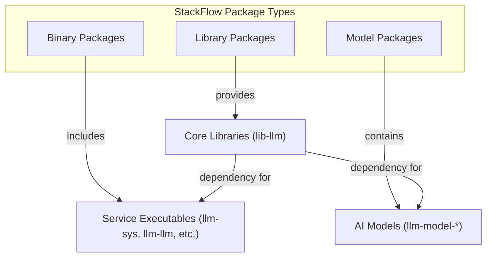
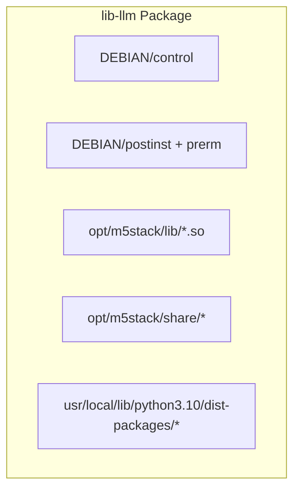
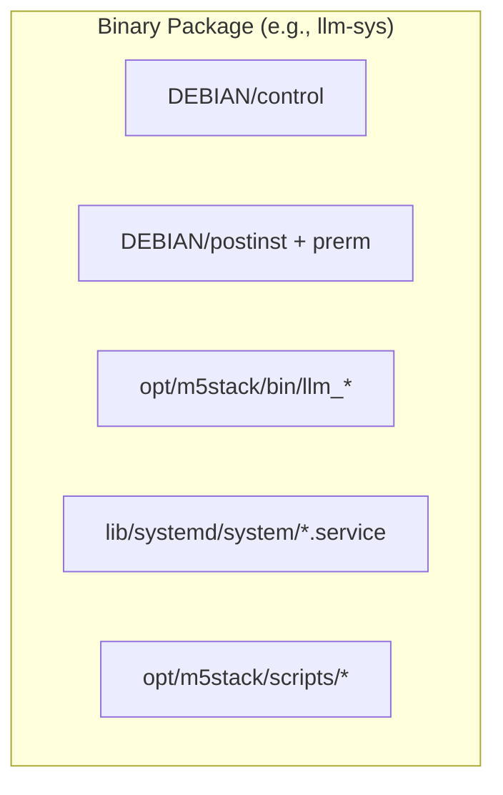
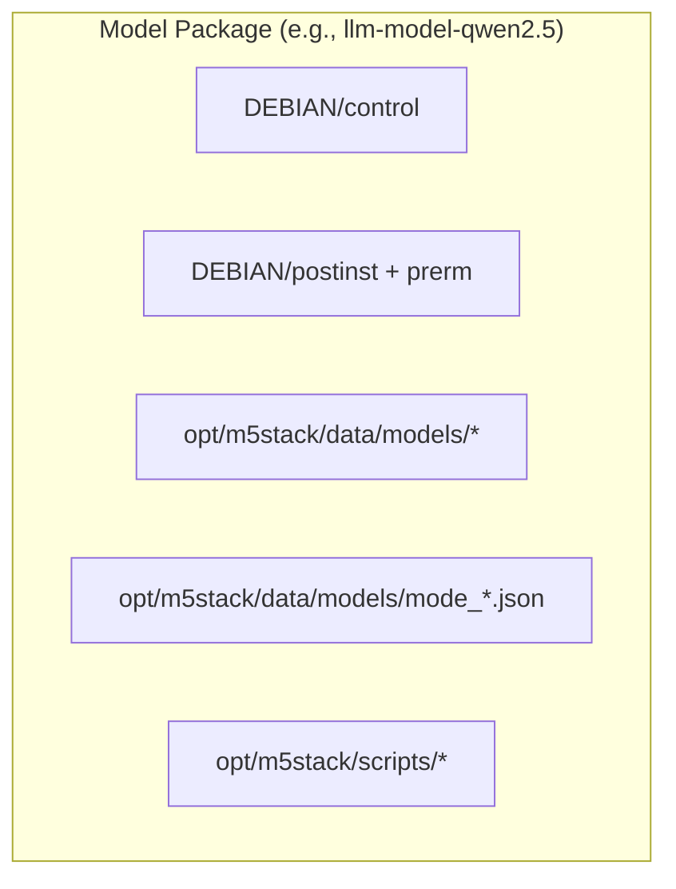
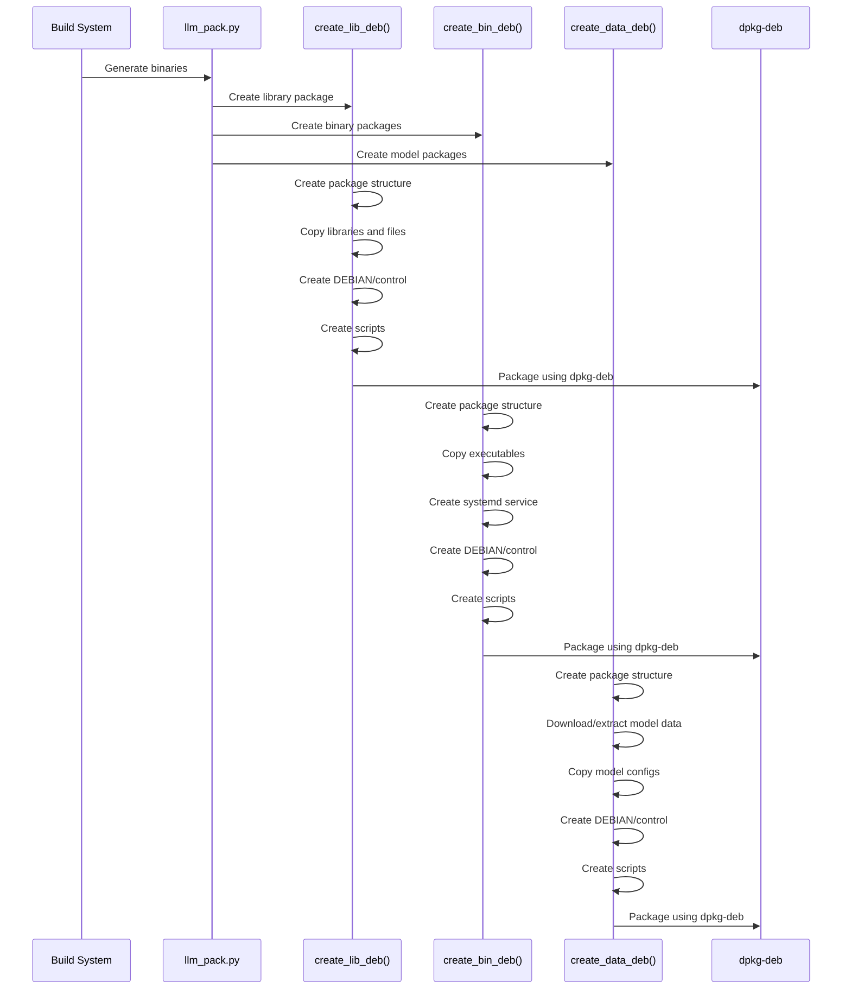
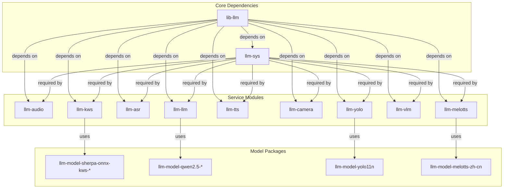
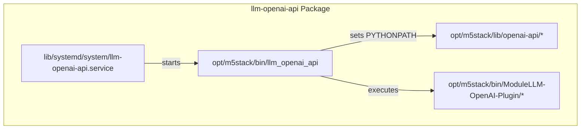
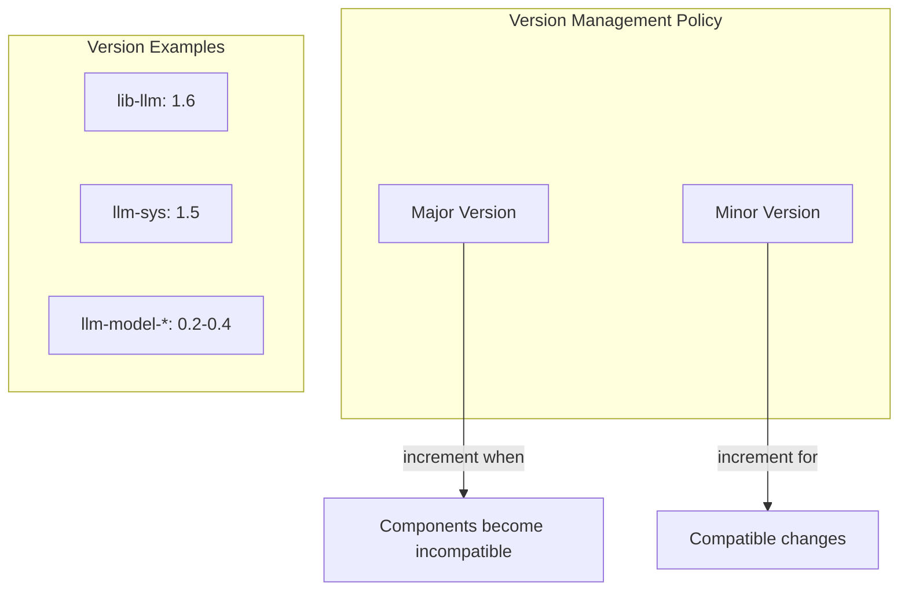
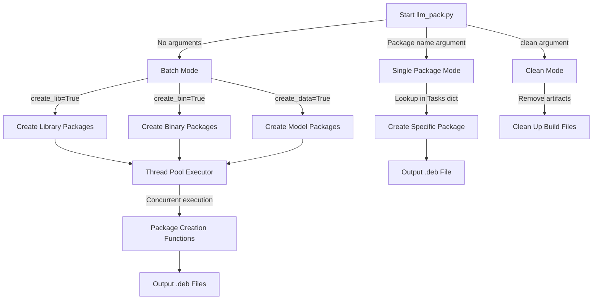

StackFlow Installation Methods

# Packaging System

<details>
<summary>Relevant source files</summary>

The following files were used as context for generating this wiki page:

- [README.md](README.md)
- [README_zh.md](README_zh.md)
- [doc/component_doc/StackFlow_en.md](doc/component_doc/StackFlow_en.md)
- [doc/component_doc/StackFlow_zh.md](doc/component_doc/StackFlow_zh.md)
- [projects/llm_framework/README.md](projects/llm_framework/README.md)
- [projects/llm_framework/main_llm/SConstruct](projects/llm_framework/main_llm/SConstruct)
- [projects/llm_framework/main_openai_api/SConstruct](projects/llm_framework/main_openai_api/SConstruct)
- [projects/llm_framework/main_vlm/SConstruct](projects/llm_framework/main_vlm/SConstruct)
- [projects/llm_framework/tools/llm_pack.py](projects/llm_framework/tools/llm_pack.py)

</details>


The StackFlow framework uses a Debian-based packaging system to distribute components, libraries, and AI models. This document outlines the structure, creation process, and management of Debian packages (.deb files) used in the StackFlow ecosystem. For information about the build system that generates the binaries packaged in these .deb files, see [Build System](#4.1).

## 1. Package Types

StackFlow's packaging system divides components into three distinct package types:



| Package Type | Prefix | Purpose | Example |
|--------------|--------|---------|---------|
| Library | lib- | Core shared libraries and utilities | lib-llm |
| Binary | llm- | Service executables with systemd services | llm-sys, llm-audio, llm-llm |
| Model | llm-model- | AI model data and configurations | llm-model-qwen2.5-0.5B-prefill-20e |

Sources: [projects/llm_framework/tools/llm_pack.py:23-21]()

## 2. Package Structure

Each package type follows a standardized directory structure to organize files properly within the Debian package:

### 2.1 Library Package Structure



Library packages contain shared libraries (.so files), support files, and Python dependencies needed by other components.

Sources: [projects/llm_framework/tools/llm_pack.py:24-149]()

### 2.2 Binary Package Structure



Binary packages include executable files, systemd service configurations, and optional script files.

Sources: [projects/llm_framework/tools/llm_pack.py:225-295]()

### 2.3 Model Package Structure



Model packages contain model files and configuration data needed by specific AI components.

Sources: [projects/llm_framework/tools/llm_pack.py:151-223]()

## 3. Package Naming Convention

StackFlow packages follow a standardized naming convention:

```
{package_name}_{version}-{revision}_{architecture}.deb
```

For example:
- `lib-llm_1.6-m5stack1_arm64.deb`
- `llm-sys_1.5-m5stack1_arm64.deb`
- `llm-model-qwen2.5-0.5B-prefill-20e_0.2-m5stack1_arm64.deb`

Sources: [projects/llm_framework/tools/llm_pack.py:13-21]()

## 4. Package Creation Process

The packaging system automates the creation of Debian packages through specialized functions in the `llm_pack.py` script:



### 4.1 Library Package Creation

The `create_lib_deb()` function generates library packages with the following steps:
1. Create a temporary Debian package structure
2. Copy library files to appropriate locations
3. Download and extract additional dependencies
4. Generate DEBIAN control files and scripts
5. Build the package using dpkg-deb

Sources: [projects/llm_framework/tools/llm_pack.py:24-149]()

### 4.2 Binary Package Creation

The `create_bin_deb()` function generates binary packages with the following steps:
1. Create a temporary Debian package structure
2. Copy executable files to appropriate locations
3. Generate systemd service files
4. Generate DEBIAN control files and scripts
5. Build the package using dpkg-deb

Sources: [projects/llm_framework/tools/llm_pack.py:225-295]()

### 4.3 Model Package Creation

The `create_data_deb()` function generates model packages with the following steps:
1. Create a temporary Debian package structure
2. Download model data from remote server
3. Extract and organize model files
4. Copy model configuration files
5. Generate DEBIAN control files and scripts
6. Build the package using dpkg-deb

Sources: [projects/llm_framework/tools/llm_pack.py:151-223]()

## 5. Package Dependencies

The packaging system establishes dependencies between packages to ensure proper installation order and component compatibility:



Key dependencies defined in the control files:
- All packages depend on `lib-llm`
- All service packages depend on `llm-sys`
- Model packages have specific version requirements

Sources: [projects/llm_framework/tools/llm_pack.py:90-100](), [projects/llm_framework/tools/llm_pack.py:196-211](), [projects/llm_framework/tools/llm_pack.py:248-259]()

## 6. Service Management

Binary packages automatically configure systemd services during installation:

| Action | Script | Purpose |
|--------|--------|---------|
| Installation | postinst | Enable and start services |
| Removal | prerm | Stop and disable services |

Service files specify dependencies to ensure proper startup order:

```ini
[Unit]
Description=llm-* Service
After=llm-sys.service
Requires=llm-sys.service

[Service]
ExecStart=/opt/m5stack/bin/llm_*
WorkingDirectory=/opt/m5stack
Restart=always
RestartSec=1
StartLimitInterval=0

[Install]
WantedBy=multi-user.target
```

Sources: [projects/llm_framework/tools/llm_pack.py:101-122](), [projects/llm_framework/tools/llm_pack.py:123-142](), [projects/llm_framework/tools/llm_pack.py:271-287]()

## 7. Example: OpenAI API Package

The OpenAI API package demonstrates how specialized components are integrated into the packaging system:



Special handling for the OpenAI API component:
1. Download GitHub repository for the API plugin
2. Download Python virtual environment with dependencies
3. Configure executable to set proper Python path
4. Set up service file to start the API server

Sources: [projects/llm_framework/main_openai_api/SConstruct:21-33](), [projects/llm_framework/main_openai_api/src/main.cpp:10-23](), [projects/llm_framework/tools/llm_pack.py:234-246]()

## 8. Version Management

The packaging system implements a versioning policy to manage compatibility:



Key versioning rules:
- Increment major version when units become incompatible with previous versions
- Increment major version when models become incompatible with previous versions
- Maintain consistent major version numbers between acceleration units and model units
- Model versions typically start at 0.1 and increment for updates

Sources: [projects/llm_framework/tools/llm_pack.py:323-363](), [projects/llm_framework/tools/llm_pack.py:366-413]()

## 9. Packaging Workflow

The packaging script supports both individual and batch package creation:



The packaging script uses concurrent execution to efficiently create multiple packages in parallel, with configurability for batch or individual package generation.

Sources: [projects/llm_framework/tools/llm_pack.py:297-441]()