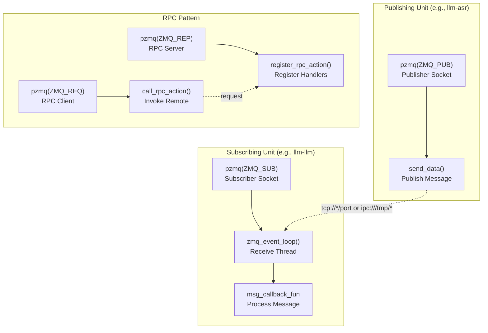
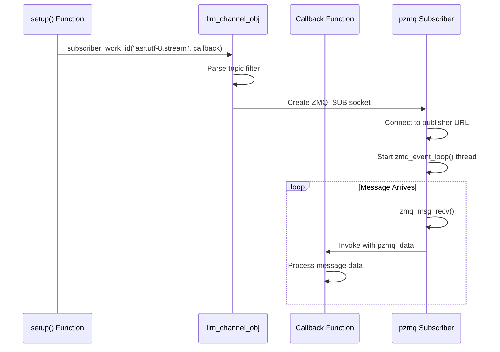
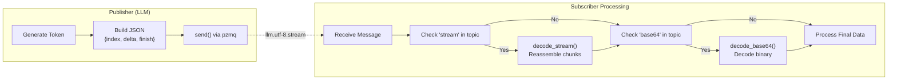
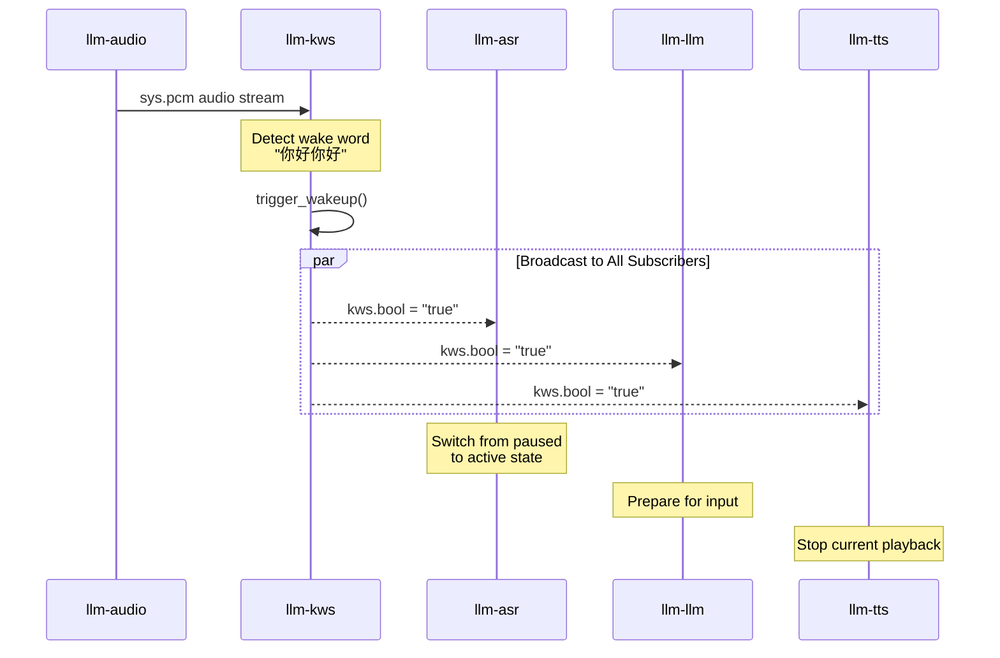
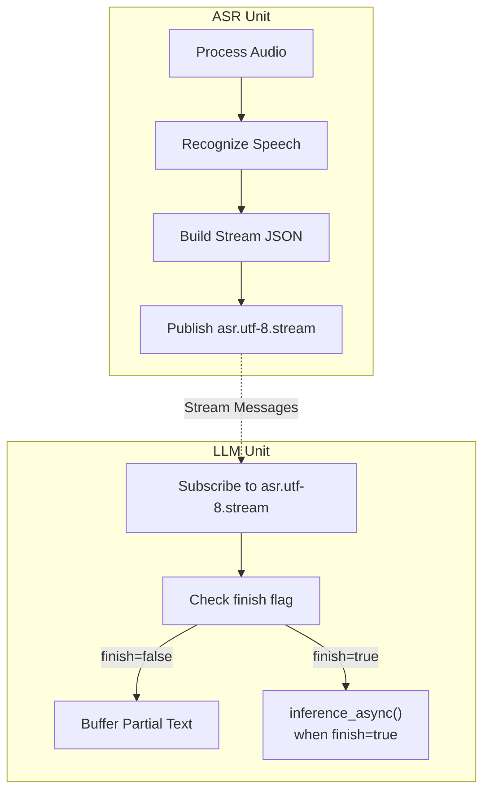
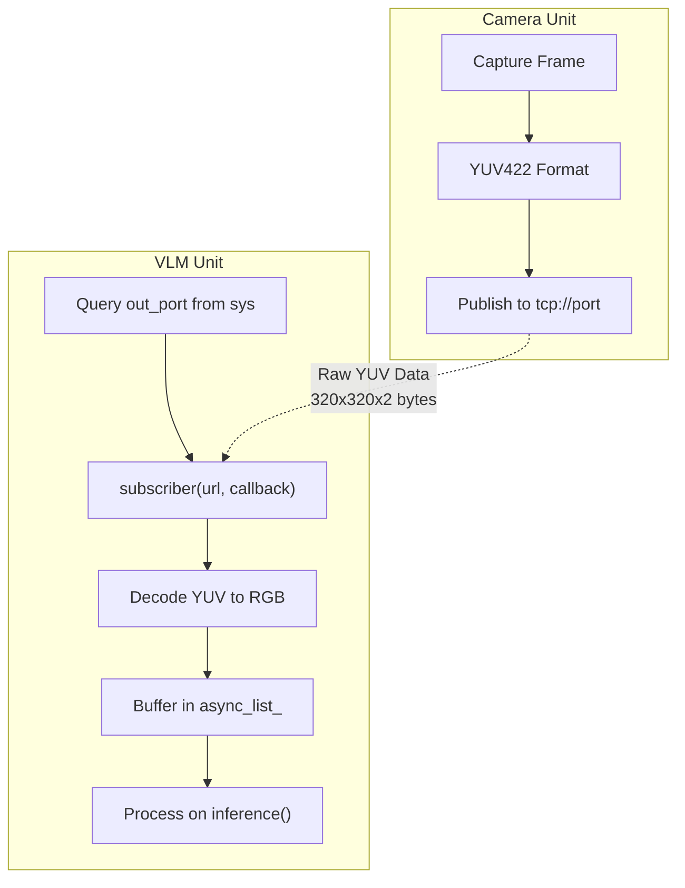
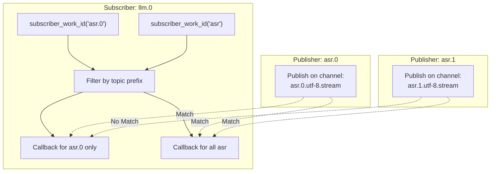

StackFlow Inter-Unit Communication Patterns

# Inter-Unit Communication Patterns

<details>
<summary>Relevant source files</summary>

The following files were used as context for generating this wiki page:

- [ext_components/StackFlow/stackflow/pzmq.hpp](ext_components/StackFlow/stackflow/pzmq.hpp)
- [ext_components/ax_msp/Kconfig](ext_components/ax_msp/Kconfig)
- [projects/llm_framework/SConstruct](projects/llm_framework/SConstruct)
- [projects/llm_framework/config_defaults.mk](projects/llm_framework/config_defaults.mk)
- [projects/llm_framework/main_llm/src/main.cpp](projects/llm_framework/main_llm/src/main.cpp)
- [projects/llm_framework/main_llm/src/runner/LLM.hpp](projects/llm_framework/main_llm/src/runner/LLM.hpp)
- [projects/llm_framework/main_vlm/src/main.cpp](projects/llm_framework/main_vlm/src/main.cpp)
- [projects/llm_framework/main_vlm/src/runner/LLM.hpp](projects/llm_framework/main_vlm/src/runner/LLM.hpp)
- [projects/llm_framework/main_vlm/src/runner/ax_model_runner/ax_model_runner.hpp](projects/llm_framework/main_vlm/src/runner/ax_model_runner/ax_model_runner.hpp)

</details>


This document details the message passing and subscription mechanisms that enable inter-unit communication in the StackFlow framework. It covers the ZeroMQ-based infrastructure, subscription patterns, message encoding formats, and common communication topologies used by AI processing units.

For information about unit lifecycle and RPC commands, see [Unit Management API](#9.2). For system-level commands and control flow, see [System Commands (sys.*)](#9.3). For JSON message structure, see [JSON RPC Protocol](#9.1).

---

## Overview of Communication Architecture

StackFlow units communicate through ZeroMQ publish-subscribe and request-reply patterns. Each unit can publish data streams on named channels and subscribe to channels from other units. The `pzmq` class wraps ZeroMQ socket operations, while `llm_channel_obj` manages per-unit message routing and subscriber callbacks.

**Key Communication Concepts:**
- **Publisher-Subscriber**: Units publish data; other units subscribe by topic/work_id
- **Topic-based Filtering**: Messages are tagged with format identifiers (e.g., `asr.utf-8.stream`)
- **Callback Registration**: Subscribers register callback functions to process incoming messages
- **Multiple Encoding Formats**: Support for stream, base64, raw, and JPEG data transmission

---

## ZeroMQ Socket Infrastructure (pzmq)

The `pzmq` class ([ext_components/StackFlow/stackflow/pzmq.hpp:86-506]()) provides a C++ wrapper around ZeroMQ sockets with automatic lifecycle management and error handling.

### Socket Types and Usage

| Socket Type | Direction | Usage Pattern | Units That Use It |
|-------------|-----------|---------------|-------------------|
| `ZMQ_PUB` | 1-to-N broadcast | Unit publishes data to multiple subscribers | All units that produce output |
| `ZMQ_SUB` | N-to-1 subscription | Unit receives data from publishers | All units that consume input |
| `ZMQ_PUSH` | Load-balanced send | Task distribution (not commonly used) | - |
| `ZMQ_PULL` | Load-balanced receive | Task collection (not commonly used) | - |
| `ZMQ_REP` | RPC server | Handle RPC function calls | All units via StackFlow base class |
| `ZMQ_REQ` | RPC client | Make RPC function calls | llm-sys, inter-unit calls |

**Diagram: pzmq Socket Type Usage**



Sources: [ext_components/StackFlow/stackflow/pzmq.hpp:86-270]()

### Connection URLs and Transport

pzmq supports two transport mechanisms:

**IPC (Inter-Process Communication)**
- Format: `ipc:///tmp/llm/<unit-name>`
- Used for local unit-to-unit communication
- Faster than TCP for same-host processes
- Example: `ipc:///tmp/llm/asr.0`

**TCP (Network)**
- Format: `tcp://*:port` (bind) or `tcp://host:port` (connect)
- Used for camera streaming and remote connections
- Example: `tcp://*:10001`

The URL format is detected automatically. If the URL doesn't start with `ipc://` or `tcp://`, the default `ipc:///tmp/rpc.` prefix is prepended for RPC sockets.

Sources: [ext_components/StackFlow/stackflow/pzmq.hpp:92-111](), [ext_components/StackFlow/stackflow/pzmq.hpp:304-346]()

---

## Channel Management and Subscription

Each StackFlow unit has an `llm_channel_obj` that manages subscriptions and output configuration. Units register callback functions to process incoming messages from specific channels.

### subscriber_work_id() Pattern

The primary subscription mechanism is `subscriber_work_id()`, which binds a callback to messages from a specific unit:

**Diagram: Subscription Registration Flow**



Sources: [projects/llm_framework/main_llm/src/main.cpp:685-701](), [projects/llm_framework/main_vlm/src/main.cpp:840-869]()

### Subscription Code Examples

From `llm-llm` unit setup:

```cpp
// Subscribe to ASR output for text input
llm_channel->subscriber_work_id(
    "asr.utf-8.stream",
    std::bind(&llm_llm::task_asr_data, this, 
              std::weak_ptr<llm_task>(llm_task_obj),
              std::weak_ptr<llm_channel_obj>(llm_channel),
              std::placeholders::_1, std::placeholders::_2));

// Subscribe to KWS wake signal
llm_channel->subscriber_work_id(
    "kws.bool",
    std::bind(&llm_llm::kws_awake, this,
              std::weak_ptr<llm_task>(llm_task_obj),
              std::weak_ptr<llm_channel_obj>(llm_channel),
              std::placeholders::_1, std::placeholders::_2));
```

From `llm-vlm` unit setup with camera:

```cpp
// Subscribe to camera raw output
std::string input_url_name = "camera.0.out_port";
std::string input_url = unit_call("sys", "sql_select", input_url_name);
llm_channel->subscriber(input_url, 
    [this, _llm_task_obj, _llm_channel](pzmq *_pzmq, const std::shared_ptr<pzmq_data> &raw) {
        this->task_camera_data(_llm_task_obj, _llm_channel, raw->string());
    });
```

Sources: [projects/llm_framework/main_llm/src/main.cpp:685-701](), [projects/llm_framework/main_vlm/src/main.cpp:856-867]()

---

## Message Format Specifications

StackFlow supports multiple message encoding formats, indicated by the topic string. Units can publish in one format and subscribers decode accordingly.

### Format Identifier Syntax

Message topics follow the pattern: `<unit>.<work_id>.<format>[.<modifier>]`

**Common Format Identifiers:**

| Format String | Content Type | Encoding | Example Use Case |
|---------------|-------------|----------|------------------|
| `utf-8` | Text | Plain UTF-8 string | ASR transcription text |
| `utf-8.stream` | Text stream | JSON with index/delta/finish | Token streaming from LLM |
| `base64` | Binary | Base64 encoded | Image data transport |
| `base64.jpeg` | JPEG image | Base64 encoded JPEG | Camera frames |
| `raw` | Binary | Raw bytes | Direct PCM audio, YUV frames |
| `bool` | Boolean signal | "true"/"false" string | Wake word detection |
| `json` | Structured data | JSON object | Object detection results |

### Stream Format Structure

The `utf-8.stream` format is used for incremental data delivery, such as LLM token generation or ASR partial results:

**JSON Structure:**
```json
{
    "index": 0,          // Sequence number
    "delta": "text",     // Incremental content
    "finish": false      // true when stream complete
}
```

**Diagram: Stream Message Processing Pipeline**



Sources: [projects/llm_framework/main_llm/src/main.cpp:592-618](), [projects/llm_framework/main_vlm/src/main.cpp:724-755]()

### Decoding Pipeline in Subscriber Callbacks

Both `llm-llm` and `llm-vlm` use a consistent decoding pipeline:

```cpp
void task_user_data(..., const std::string &object, const std::string &data) {
    const std::string *next_data = &data;
    
    // Step 1: Decode stream format if present
    if (object.find("stream") != std::string::npos) {
        static std::unordered_map<int, std::string> stream_buff;
        if (decode_stream(data, tmp_msg1, stream_buff)) {
            return;  // Not complete yet
        }
        next_data = &tmp_msg1;
    }
    
    // Step 2: Decode base64 if present
    if (object.find("base64") != std::string::npos) {
        decode_base64(*next_data, tmp_msg2);
        next_data = &tmp_msg2;
    }
    
    // Step 3: Handle JPEG if present
    if (object.find("jpeg") != std::string::npos) {
        // Store as image buffer
        image_data_.assign(next_data->begin(), next_data->end());
        return;
    }
    
    // Step 4: Process final data
    inference(*next_data);
}
```

Sources: [projects/llm_framework/main_llm/src/main.cpp:576-618](), [projects/llm_framework/main_vlm/src/main.cpp:708-756]()

---

## Common Communication Patterns

### Pattern 1: Wake-Signal Broadcasting

The KWS unit broadcasts a wake signal that multiple units respond to simultaneously.

**Diagram: Wake Signal Pattern**



In code, each unit subscribes to the KWS output:

```cpp
// In llm-llm setup
llm_channel->subscriber_work_id(
    "kws.bool",
    std::bind(&llm_llm::kws_awake, this, ...));

// kws_awake callback
void kws_awake(...) {
    if (llm_task_obj->lLaMa_) llm_task_obj->lLaMa_->Stop();
    if (llm_task_obj->lLaMa_ctx_) llm_task_obj->lLaMa_ctx_->Stop();
}
```

Sources: [projects/llm_framework/main_llm/src/main.cpp:696-700](), [projects/llm_framework/main_llm/src/main.cpp:639-650](), [projects/llm_framework/main_vlm/src/main.cpp:776-788]()

### Pattern 2: Streaming Text Processing (ASR → LLM)

ASR streams text tokens to LLM as speech is recognized, with finish flag indicating completion.

**Diagram: ASR to LLM Streaming**



Callback implementation:

```cpp
void task_asr_data(..., const std::string &object, const std::string &data) {
    if (object.find("stream") != std::string::npos) {
        // Check if stream is complete
        if (sample_json_str_get(data, "finish") == "true") {
            std::string text = sample_json_str_get(data, "delta");
            llm_task_obj->inference_async(text);
        }
        // Otherwise, ignore partial results
    } else {
        // Non-stream format: process immediately
        llm_task_obj->inference_async(data);
    }
}
```

Sources: [projects/llm_framework/main_llm/src/main.cpp:621-637](), [projects/llm_framework/main_vlm/src/main.cpp:758-774]()

### Pattern 3: Camera Raw Data Streaming

Camera unit publishes raw YUV frames via direct socket subscription (not work_id based).

**Diagram: Camera to VLM Raw Streaming**



Setup code:

```cpp
// Query the camera output URL from system database
std::string input_url_name = input + ".out_port";
std::string input_url = unit_call("sys", "sql_select", input_url_name);

// Subscribe directly to the raw data URL
llm_channel->subscriber(input_url, 
    [this, _llm_task_obj, _llm_channel](pzmq *_pzmq, const std::shared_ptr<pzmq_data> &raw) {
        this->task_camera_data(_llm_task_obj, _llm_channel, raw->string());
    });

// Process raw YUV data
bool inference_raw_yuv(const std::string &msg) {
    cv::Mat camera_data(320, 320, CV_8UC2, (void *)msg.data());
    cv::Mat rgb;
    cv::cvtColor(camera_data, rgb, cv::COLOR_YUV2RGB_YUYV);
    return inference_async(rgb, true);
}
```

Sources: [projects/llm_framework/main_vlm/src/main.cpp:856-867](), [projects/llm_framework/main_vlm/src/main.cpp:403-412]()

### Pattern 4: Direct User Input (No Subscription)

Units can process direct user input via their own channel without subscribing to other units.

```cpp
// In setup: register empty subscription for self-input
llm_channel->subscriber_work_id(
    "",  // Empty string = listen on own channel
    std::bind(&llm_llm::task_user_data, this, ...));

// User sends JSON RPC to llm.work
// -> Routed to task_user_data callback
// -> Processed as text input
```

Sources: [projects/llm_framework/main_llm/src/main.cpp:687-690](), [projects/llm_framework/main_vlm/src/main.cpp:842-845]()

---

## Topic Filtering and work_id Routing

The `llm_channel_obj` supports filtering messages by work_id, allowing multiple instances of the same unit type to coexist without crosstalk.

### work_id Structure

Format: `<unit_name>.<instance_number>`
- Example: `llm.0`, `asr.1`, `vlm.2`
- Extracted via `sample_get_work_id_num(work_id)` → integer ID

### Subscription Filtering

When calling `subscriber_work_id(topic, callback)`:

1. **Exact match**: `"asr.0.utf-8.stream"` → only messages from asr.0
2. **Wildcard prefix**: `"asr"` → messages from any asr instance
3. **Empty string**: `""` → messages to this unit's own channel

**Diagram: work_id Filtering**



Sources: [projects/llm_framework/main_llm/src/main.cpp:730-735]()

---

## Output Configuration

Units configure their output behavior via `llm_channel_obj` methods:

### set_output(bool enable)

Controls whether the unit publishes output messages.

```cpp
llm_channel->set_output(llm_task_obj->enoutput_);  // From config JSON
```

When `enoutput_ = false`, the unit processes data internally but doesn't publish results. Useful for:
- Silent processing modes
- Testing without downstream impact
- Reducing message traffic

### set_stream(bool enable)

Controls whether output uses streaming format (`utf-8.stream`) or single-shot format (`utf-8`).

```cpp
llm_channel->set_stream(llm_task_obj->enstream_);  // From config JSON
```

**Streaming Mode (enstream_ = true):**
```cpp
nlohmann::json data_body;
data_body["index"] = count++;
data_body["delta"] = token_text;
data_body["finish"] = is_complete;
llm_channel->send(response_format_, data_body, LLM_NO_ERROR);
```

**Single-Shot Mode (enstream_ = false):**
```cpp
llm_channel->send(response_format_, final_text, LLM_NO_ERROR);
```

Sources: [projects/llm_framework/main_llm/src/main.cpp:678-679](), [projects/llm_framework/main_llm/src/main.cpp:529-545]()

---

## Link and Unlink Operations

Units can dynamically modify their subscriptions at runtime using the `link` and `unlink` RPC functions.

### link RPC Function

Adds a new subscription to an existing unit instance:

```cpp
void link(const std::string &work_id, const std::string &object, const std::string &data) override {
    auto llm_channel = get_channel(work_id);
    auto llm_task_obj = llm_task_[work_id_num];
    
    if (data.find("asr") != std::string::npos) {
        ret = llm_channel->subscriber_work_id(
            data,
            std::bind(&llm_llm::task_asr_data, this, ...));
        llm_task_obj->inputs_.push_back(data);
    }
    // ... similar for kws, camera, etc.
}
```

**Usage:** Client sends RPC: `{"action": "link", "data": "asr.0.utf-8.stream"}` to `llm.0`

Sources: [projects/llm_framework/main_llm/src/main.cpp:716-751]()

### unlink RPC Function

Removes an existing subscription:

```cpp
void unlink(const std::string &work_id, const std::string &object, const std::string &data) override {
    auto llm_channel = get_channel(work_id);
    llm_channel->stop_subscriber_work_id(data);
    
    // Remove from inputs list
    auto llm_task_obj = llm_task_[work_id_num];
    for (auto it = llm_task_obj->inputs_.begin(); it != llm_task_obj->inputs_.end();) {
        if (*it == data) {
            it = llm_task_obj->inputs_.erase(it);
        } else {
            ++it;
        }
    }
}
```

**Usage:** Client sends RPC: `{"action": "unlink", "data": "asr.0.utf-8.stream"}` to `llm.0`

Sources: [projects/llm_framework/main_llm/src/main.cpp:753-776]()

---

## Weak Pointer Safety in Callbacks

All subscription callbacks use `std::weak_ptr` to avoid circular reference and dangling pointer issues:

```cpp
// At subscription time, capture weak_ptr
llm_channel->subscriber_work_id(
    "asr",
    std::bind(&llm_llm::task_asr_data, this,
              std::weak_ptr<llm_task>(llm_task_obj),        // Weak pointer
              std::weak_ptr<llm_channel_obj>(llm_channel),  // Weak pointer
              std::placeholders::_1, std::placeholders::_2));

// In callback, lock weak_ptr before use
void task_asr_data(const std::weak_ptr<llm_task> llm_task_obj_weak, ...) {
    auto llm_task_obj = llm_task_obj_weak.lock();
    auto llm_channel = llm_channel_weak.lock();
    if (!(llm_task_obj && llm_channel)) {
        return;  // Objects destroyed, skip processing
    }
    // Safe to use llm_task_obj and llm_channel
    llm_task_obj->inference_async(data);
}
```

This pattern ensures that:
1. Callbacks don't prevent object destruction
2. Callbacks fail gracefully if objects are destroyed
3. No dangling pointer dereferences occur

Sources: [projects/llm_framework/main_llm/src/main.cpp:621-637](), [projects/llm_framework/main_vlm/src/main.cpp:651-677]()

---

## Summary of Communication Patterns

**Key Takeaways:**

1. **pzmq** provides ZMQ_PUB/ZMQ_SUB for data streaming, ZMQ_REP/ZMQ_REQ for RPC
2. **llm_channel_obj** manages subscriptions via `subscriber_work_id(topic, callback)`
3. **Topic format**: `<unit>.<work_id>.<encoding>.<modifier>` enables filtering
4. **Encoding pipeline**: stream → base64 → raw, decoded sequentially in callbacks
5. **Common patterns**: wake-signal broadcast, ASR→LLM streaming, camera raw data
6. **Dynamic linking**: `link`/`unlink` RPC functions modify subscriptions at runtime
7. **Safety**: weak_ptr pattern prevents circular references in callbacks

All units follow these patterns, enabling flexible pipeline construction where any unit can publish data and any other unit can subscribe based on their processing needs.

Sources: [ext_components/StackFlow/stackflow/pzmq.hpp:1-507](), [projects/llm_framework/main_llm/src/main.cpp:1-889](), [projects/llm_framework/main_vlm/src/main.cpp:1-1044]()