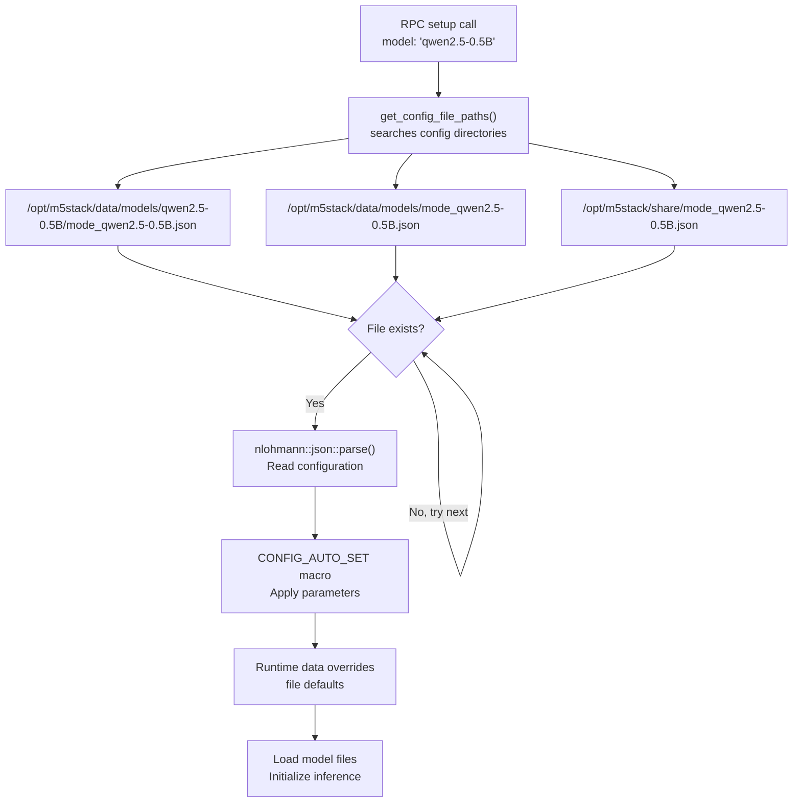
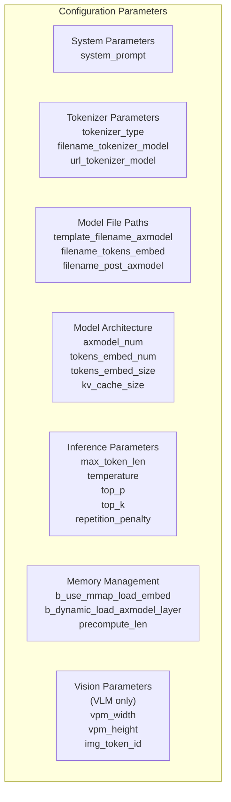
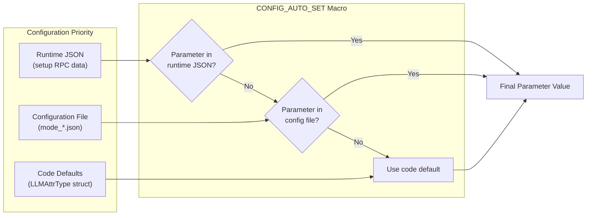
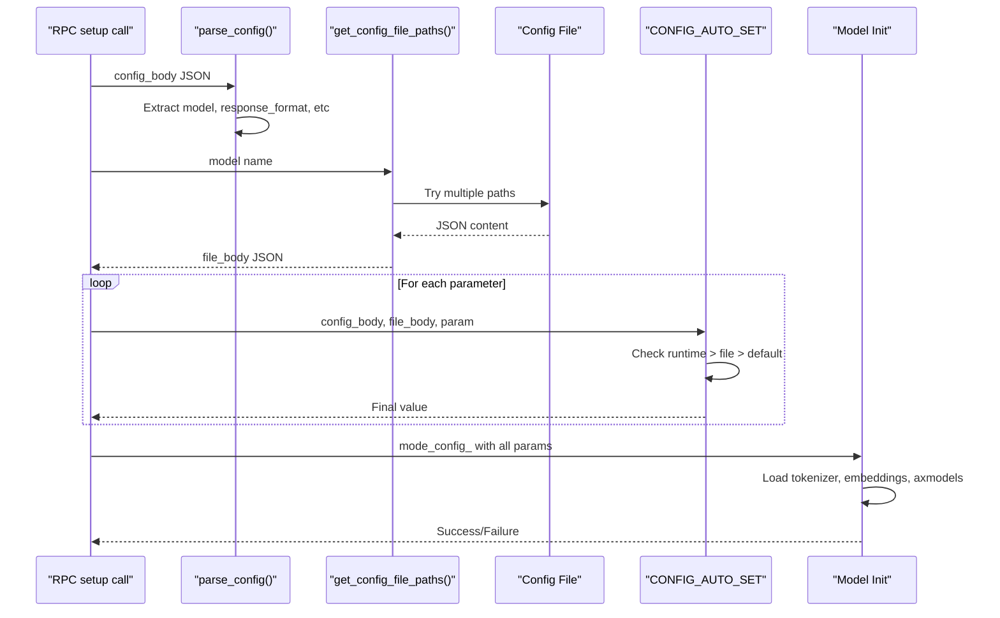

StackFlow JSON Configuration Files

# JSON Configuration Files

<details>
<summary>Relevant source files</summary>

The following files were used as context for generating this wiki page:

- [README.md](README.md)
- [README_zh.md](README_zh.md)
- [doc/component_doc/StackFlow_en.md](doc/component_doc/StackFlow_en.md)
- [doc/component_doc/StackFlow_zh.md](doc/component_doc/StackFlow_zh.md)
- [projects/llm_framework/README.md](projects/llm_framework/README.md)
- [projects/llm_framework/main_llm/src/main.cpp](projects/llm_framework/main_llm/src/main.cpp)
- [projects/llm_framework/main_llm/src/runner/LLM.hpp](projects/llm_framework/main_llm/src/runner/LLM.hpp)
- [projects/llm_framework/main_vlm/src/main.cpp](projects/llm_framework/main_vlm/src/main.cpp)
- [projects/llm_framework/main_vlm/src/runner/LLM.hpp](projects/llm_framework/main_vlm/src/runner/LLM.hpp)
- [projects/llm_framework/main_vlm/src/runner/ax_model_runner/ax_model_runner.hpp](projects/llm_framework/main_vlm/src/runner/ax_model_runner/ax_model_runner.hpp)

</details>


This document describes the JSON configuration files used by StackFlow units to configure AI model loading and inference parameters. These configuration files define model paths, tokenizer settings, inference parameters, and hardware-specific options for each supported AI model.

For information about runtime unit configuration via JSON RPC, see [Unit Setup and Linking](#8.2). For build-time configuration and model packaging, see [Package Types and Dependencies](#7.2).

---

## Configuration File Locations

StackFlow uses a hierarchical configuration system where configuration files can exist in multiple directories, searched in a specific order.

### Standard Configuration Directories

| Directory | Purpose | Priority |
|-----------|---------|----------|
| `/opt/m5stack/data/models/` | User-editable model configurations | High |
| `/opt/m5stack/share/` | System default configurations | Low |
| Model-specific subdirectory | Per-model override configurations | Highest |

### Configuration File Naming Convention

Configuration files follow the naming pattern `mode_<model-name>.json`, where `<model-name>` matches the model identifier used in the `setup` RPC call.

**Examples:**
- `mode_qwen2.5-0.5B-p256-ax630c.json` - LLM configuration
- `mode_internvl2.5-1B-364-ax630c.json` - VLM configuration
- `mode_melotts-zh-cn.json` - TTS configuration
- `mode_yolo11n.json` - YOLO configuration

Sources: [README_zh.md:186-190](), [projects/llm_framework/main_vlm/src/main.cpp:167-184]()

---

## Configuration Resolution Flow



**Configuration Search Logic:**
1. Check model-specific subdirectory first
2. Check data directory
3. Check share directory (system defaults)
4. Use first file found, skip remaining paths

Sources: [projects/llm_framework/main_vlm/src/main.cpp:167-184](), [projects/llm_framework/main_llm/src/main.cpp:131-148]()

---

## Configuration File Structure

Configuration files consist of a top-level JSON object with a `mode_param` key containing all model parameters.

### Basic Structure

```json
{
  "mode_param": {
    "system_prompt": "You are a helpful assistant",
    "tokenizer_type": "TKT_Qwen",
    "filename_tokenizer_model": "tokenizer.model",
    "filename_tokens_embed": "model.embed_tokens.weight.bfloat16.bin",
    "template_filename_axmodel": "model_l%d.axmodel",
    "filename_post_axmodel": "model_post.axmodel",
    "axmodel_num": 28,
    "tokens_embed_num": 151936,
    "tokens_embed_size": 896,
    "max_token_len": 256,
    "enable_temperature": true,
    "temperature": 0.7,
    "enable_top_p_sampling": true,
    "top_p": 0.8,
    "enable_top_k_sampling": true,
    "top_k": 20,
    "precompute_len": 256
  }
}
```

### Configuration Parameter Categories



Sources: [projects/llm_framework/main_vlm/src/runner/LLM.hpp:27-91](), [projects/llm_framework/main_llm/src/runner/LLM.hpp:25-73]()

---

## Common Configuration Parameters

### System Parameters

| Parameter | Type | Description | Example |
|-----------|------|-------------|---------|
| `system_prompt` | string | Default system prompt for LLM/VLM | `"You are a helpful assistant"` |

### Tokenizer Parameters

| Parameter | Type | Description | Example |
|-----------|------|-------------|---------|
| `tokenizer_type` | string | Tokenizer implementation type | `"TKT_Qwen"`, `"TKT_LLaMa"`, `"TKT_HTTP"` |
| `filename_tokenizer_model` | string | Path to tokenizer model file | `"tokenizer.model"` |
| `url_tokenizer_model` | string | HTTP URL for remote tokenizer service | `"http://localhost:8080"` |
| `b_bos` | boolean | Include beginning-of-sequence token | `true` |
| `b_eos` | boolean | Include end-of-sequence token | `false` |

### Model File Paths

| Parameter | Type | Description | Example |
|-----------|------|-------------|---------|
| `template_filename_axmodel` | string | Template for layer model files (sprintf format) | `"qwen_l%d.axmodel"` |
| `filename_tokens_embed` | string | Token embedding weights file | `"model.embed_tokens.weight.bfloat16.bin"` |
| `filename_post_axmodel` | string | Post-processing model file | `"model_post.axmodel"` |
| `axmodel_num` | integer | Number of transformer layers | `28` |

**Note:** File paths are relative to the model base directory at `/opt/m5stack/data/models/<model-name>/`

Sources: [projects/llm_framework/main_llm/src/main.cpp:152-176](), [projects/llm_framework/main_vlm/src/main.cpp:188-218]()

### Model Architecture Parameters

| Parameter | Type | Description | Example |
|-----------|------|-------------|---------|
| `tokens_embed_num` | integer | Vocabulary size | `151936` |
| `tokens_embed_size` | integer | Embedding dimension | `896` |
| `max_token_len` | integer | Maximum sequence length | `256` |
| `kv_cache_num` | integer | KV cache slots (auto-detected) | `1024` |
| `kv_cache_size` | integer | KV cache size per slot (auto-detected) | `256` |

### Inference Sampling Parameters

| Parameter | Type | Description | Default |
|-----------|------|-------------|---------|
| `enable_temperature` | boolean | Enable temperature scaling | `false` |
| `temperature` | float | Temperature value (0.0-2.0) | `0.7` |
| `enable_top_p_sampling` | boolean | Enable nucleus sampling | `false` |
| `top_p` | float | Top-p threshold (0.0-1.0) | `0.7` |
| `enable_top_k_sampling` | boolean | Enable top-k sampling | `true` |
| `top_k` | integer | Top-k value | `10` |
| `enable_repetition_penalty` | boolean | Enable repetition penalty | `false` |
| `repetition_penalty` | float | Penalty factor (≥1.0) | `1.2` |
| `penalty_window` | integer | Window size for penalty calculation | `50` |

Sources: [projects/llm_framework/main_llm/src/runner/LLM.hpp:54-65]()

### Memory Management Parameters

| Parameter | Type | Description | Default |
|-----------|------|-------------|---------|
| `b_use_mmap_load_embed` | boolean | Use memory-mapped I/O for embeddings | `false` |
| `b_dynamic_load_axmodel_layer` | boolean | Load model layers dynamically (saves memory) | `false` |
| `b_use_mmap_load_layer` | boolean | Use mmap for dynamic layer loading | `true` |
| `precompute_len` | integer | Length of precomputed KV cache for context | `0` |

**Note:** Setting `precompute_len > 0` enables context-aware mode (LLM_CTX), which maintains conversation history.

Sources: [projects/llm_framework/main_llm/src/main.cpp:241-281]()

---

## Model-Specific Parameters

### Vision-Language Model (VLM) Parameters

VLM configurations include additional parameters for vision processing:

| Parameter | Type | Description | Example |
|-----------|------|-------------|---------|
| `filename_image_encoder_axmodel` | string | Vision encoder model file | `"vpm_encoder.axmodel"` |
| `filename_vpm_resampler_axmodedl` | string | Vision token resampler model | `"vpm_resampler.axmodel"` |
| `vpm_width` | integer | Vision input width (auto-detected) | `448` |
| `vpm_height` | integer | Vision input height (auto-detected) | `448` |
| `img_token_id` | integer | Special token ID for image placeholders | `151667` |
| `b_vpm_two_stage` | boolean | Use two-stage vision processing | `false` |
| `b_video` | boolean | Enable video processing mode | `false` |

**Qwen3 Vision-Specific Parameters:**

```json
{
  "vision_config": {
    "temporal_patch_size": 2,
    "tokens_per_second": 2,
    "spatial_merge_size": 2,
    "patch_size": 14,
    "width": 448,
    "height": 448,
    "fps": 2.0
  },
  "image_token_id": 151655,
  "video_token_id": 151656,
  "vision_start_token_id": 151652
}
```

Sources: [projects/llm_framework/main_vlm/src/main.cpp:188-232](), [projects/llm_framework/main_vlm/src/runner/LLM.hpp:34-47]()

### TTS (MeloTTS) Parameters

| Parameter | Type | Description | Example |
|-----------|------|-------------|---------|
| `language` | string | Language code | `"zh-cn"`, `"en-us"` |
| `speaker` | string | Speaker variant | `"default"`, `"au"`, `"br"` |
| `lexicon_file` | string | Phoneme lexicon path | `"lexicon.txt"` |
| `tokens_file` | string | Token vocabulary path | `"tokens.txt"` |
| `encoder_model` | string | Text encoder model | `"encoder.axmodel"` |
| `decoder_model` | string | Audio decoder model | `"decoder.axmodel"` |

### YOLO Parameters

| Parameter | Type | Description | Example |
|-----------|------|-------------|---------|
| `model_type` | string | YOLO task type | `"detect"`, `"segment"`, `"pose"`, `"obb"` |
| `conf_threshold` | float | Confidence threshold | `0.25` |
| `iou_threshold` | float | NMS IoU threshold | `0.45` |
| `input_width` | integer | Model input width | `640` |
| `input_height` | integer | Model input height | `640` |

---

## Parameter Override Mechanism



### The CONFIG_AUTO_SET Macro

The framework uses a macro to automatically apply parameters with three-level priority:

```cpp
#define CONFIG_AUTO_SET(obj, key)             \
    if (config_body.contains(#key))           \
        mode_config_.key = config_body[#key]; \
    else if (obj.contains(#key))              \
        mode_config_.key = obj[#key];
```

**Priority Order (Highest to Lowest):**
1. **Runtime parameters** - Values passed in the `data` field of the `setup` RPC call
2. **Configuration file** - Values from `mode_*.json` file
3. **Code defaults** - Initial values in `LLMAttrType` struct

**Example Usage:**
```cpp
CONFIG_AUTO_SET(file_body["mode_param"], max_token_len);
CONFIG_AUTO_SET(file_body["mode_param"], temperature);
CONFIG_AUTO_SET(file_body["mode_param"], top_k);
```

This allows runtime customization of any parameter without modifying configuration files.

Sources: [projects/llm_framework/main_llm/src/main.cpp:39-46](), [projects/llm_framework/main_vlm/src/main.cpp:39-49]()

---

## Configuration File Examples

### Example 1: Basic LLM Configuration

**File:** `/opt/m5stack/data/models/mode_qwen2.5-0.5B-p256-ax630c.json`

```json
{
  "mode_param": {
    "system_prompt": "You are Qwen, created by Alibaba Cloud.",
    "tokenizer_type": "TKT_Qwen",
    "filename_tokenizer_model": "tokenizer.model",
    "filename_tokens_embed": "model.embed_tokens.weight.bfloat16.bin",
    "template_filename_axmodel": "qwen2.5-0.5B_l%d.axmodel",
    "filename_post_axmodel": "qwen2.5-0.5B_post.axmodel",
    "b_bos": false,
    "b_eos": false,
    "axmodel_num": 24,
    "tokens_embed_num": 151936,
    "tokens_embed_size": 896,
    "b_use_mmap_load_embed": false,
    "b_dynamic_load_axmodel_layer": false,
    "max_token_len": 256,
    "enable_temperature": true,
    "temperature": 0.7,
    "enable_top_p_sampling": true,
    "top_p": 0.8,
    "enable_top_k_sampling": true,
    "top_k": 20,
    "enable_repetition_penalty": false,
    "repetition_penalty": 1.1,
    "penalty_window": 50,
    "precompute_len": 256
  }
}
```

### Example 2: Vision-Language Model Configuration

**File:** `/opt/m5stack/data/models/mode_internvl2.5-1B-364-ax630c.json`

```json
{
  "mode_param": {
    "system_prompt": "You are an AI assistant whose name is InternVL.",
    "tokenizer_type": "TKT_HTTP",
    "filename_tokenizer_model": "http://auto",
    "url_tokenizer_model": "http://auto",
    "filename_tokens_embed": "internlm2-1.8b.embed_tokens.weight.bfloat16.bin",
    "filename_image_encoder_axmodel": "InternVL3-1B-vpm-encoder-fp16.axmodel",
    "filename_vpm_resampler_axmodedl": "InternVL3-1B-vpm-resampler-fp16.axmodel",
    "template_filename_axmodel": "internlm2-1.8b_l%d.axmodel",
    "filename_post_axmodel": "internlm2-1.8b_post.axmodel",
    "b_vpm_two_stage": true,
    "b_bos": false,
    "b_eos": false,
    "axmodel_num": 24,
    "tokens_embed_num": 92544,
    "img_token_id": 92543,
    "tokens_embed_size": 2048,
    "b_use_mmap_load_embed": false,
    "b_dynamic_load_axmodel_layer": false,
    "max_token_len": 256,
    "enable_temperature": false,
    "temperature": 0.7,
    "enable_top_p_sampling": false,
    "top_p": 0.7,
    "enable_top_k_sampling": true,
    "top_k": 10,
    "enable_repetition_penalty": false,
    "repetition_penalty": 1.2,
    "penalty_window": 50,
    "vpm_width": 364,
    "vpm_height": 364,
    "precompute_len": 364,
    "b_video": false
  }
}
```

### Example 3: Runtime Override Example

**Setup RPC Call with Overrides:**
```json
{
  "request_id": "1",
  "work_id": "llm",
  "action": "setup",
  "object": "llm.setup",
  "data": {
    "model": "qwen2.5-0.5B-p256-ax630c",
    "response_format": "llm.utf-8.stream",
    "input": "asr.utf-8.stream",
    "enoutput": true,
    "max_token_len": 512,
    "temperature": 0.9,
    "top_k": 40,
    "prompt": "You are a coding assistant specialized in Python."
  }
}
```

In this example:
- `model` specifies which configuration file to load
- `max_token_len`, `temperature`, `top_k` override values from the file
- `prompt` overrides the `system_prompt` from the file
- Other parameters use file defaults

Sources: [projects/llm_framework/README.md:82-93](), [projects/llm_framework/main_llm/src/main.cpp:83-106]()

---

## Configuration Loading Code Flow



**Key Functions:**
- `llm_task::parse_config()` - Extracts basic setup parameters - [projects/llm_framework/main_llm/src/main.cpp:83-106]()
- `llm_task::load_model()` - Loads configuration file and applies parameters - [projects/llm_framework/main_llm/src/main.cpp:125-287]()
- `get_config_file_paths()` - Returns ordered list of config file paths to try - [projects/llm_framework/main_vlm/src/main.cpp:167-168]()
- `LLM::Init()` - Initializes model with final configuration - [projects/llm_framework/main_llm/src/runner/LLM.hpp:115-238]()

Sources: [projects/llm_framework/main_llm/src/main.cpp:125-287](), [projects/llm_framework/main_vlm/src/main.cpp:161-377]()

---

## Special Configuration Behaviors

### HTTP Tokenizer Auto-Configuration

When `tokenizer_type` is set to `"TKT_HTTP"` and `filename_tokenizer_model` or `url_tokenizer_model` contains `"http"`, the framework automatically spawns a Python tokenizer server:

**Auto-spawn behavior:**
1. Searches for tokenizer script at `/opt/m5stack/scripts/<model>_tokenizer.py` or `tokenizer_<model>.py`
2. Allocates a port between 8080-8089 (LLM) or 8090-8099 (VLM)
3. Forks a Python process running the tokenizer server
4. Updates URL to `http://localhost:<port>`

**Example configuration triggering auto-spawn:**
```json
{
  "tokenizer_type": "TKT_HTTP",
  "filename_tokenizer_model": "http://auto"
}
```

Sources: [projects/llm_framework/main_llm/src/main.cpp:177-230](), [projects/llm_framework/main_vlm/src/main.cpp:233-284]()

### Dynamic Model Path Resolution

All relative paths in configuration files are automatically resolved relative to the model base directory:

**Path resolution logic:**
```cpp
std::string base_model = base_model_path_ + model_ + "/";
mode_config_.filename_tokens_embed = base_model + mode_config_.filename_tokens_embed;
mode_config_.filename_post_axmodel = base_model + mode_config_.filename_post_axmodel;
mode_config_.template_filename_axmodel = base_model + mode_config_.template_filename_axmodel;
```

**Example:**
- Model name: `qwen2.5-0.5B-p256-ax630c`
- Config value: `"filename_tokens_embed": "model.embed_tokens.weight.bfloat16.bin"`
- Resolved path: `/opt/m5stack/data/models/qwen2.5-0.5B-p256-ax630c/model.embed_tokens.weight.bfloat16.bin`

Sources: [projects/llm_framework/main_llm/src/main.cpp:231-233](), [projects/llm_framework/main_vlm/src/main.cpp:299-303]()

### Auto-Detected Parameters

Some parameters are automatically detected from loaded model files and override configuration values:

| Parameter | Detection Source | Code Reference |
|-----------|------------------|----------------|
| `max_token_len` | Model input mask size | `llama_layers[0].layer.get_input("mask").nSize` |
| `kv_cache_size` | Model KV cache output size | `llama_layers[0].layer.get_output("K_cache_out").nSize` |
| `kv_cache_num` | Model KV cache input size | `llama_layers[0].layer.get_input("K_cache").nSize` |
| `prefill_token_num` | Model indices input shape | `llama_layers[0].layer.get_input(grpid, "indices").vShape[1]` |
| `vpm_width` | Vision encoder input width | `vpm_resampler.get_input(0).vShape[2]` |
| `vpm_height` | Vision encoder input height | `vpm_resampler.get_input(0).vShape[1]` |

These auto-detected values ensure compatibility between configuration and actual model architecture.

Sources: [projects/llm_framework/main_llm/src/runner/LLM.hpp:192-207](), [projects/llm_framework/main_vlm/src/runner/LLM.hpp:233-249]()