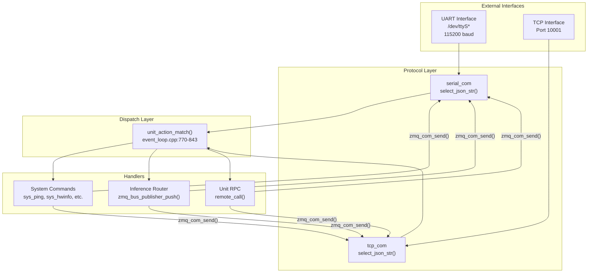
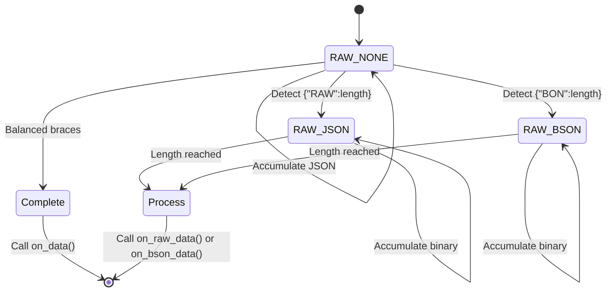
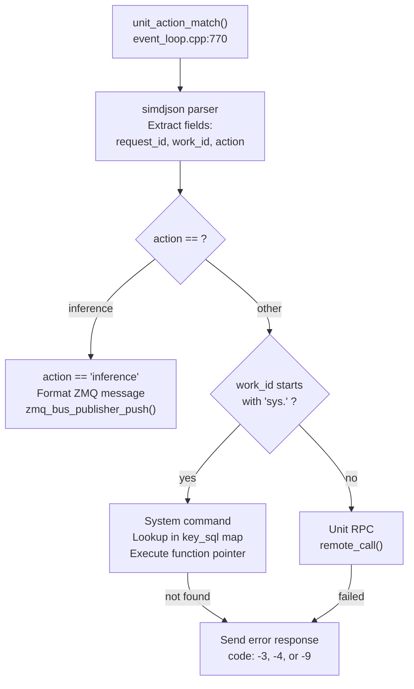
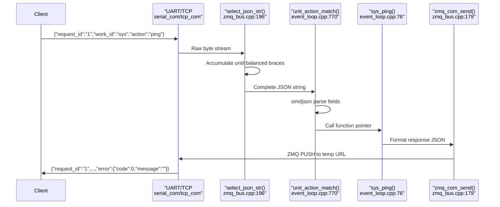
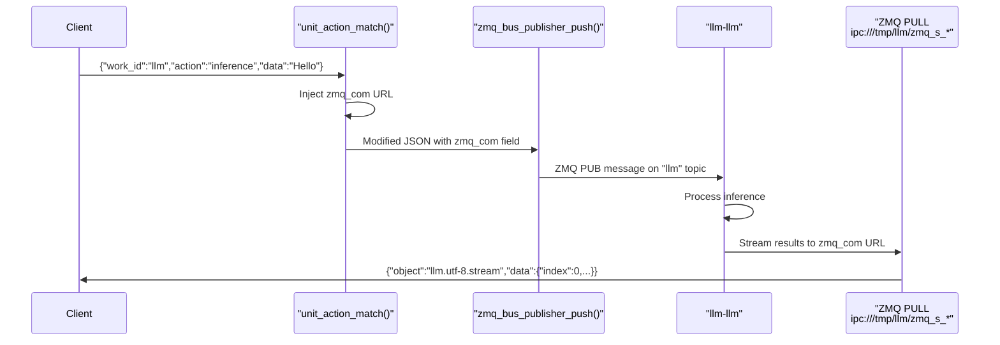

StackFlow JSON RPC Protocol

# JSON RPC Protocol

<details>
<summary>Relevant source files</summary>

The following files were used as context for generating this wiki page:

- [projects/llm_framework/main_sys/include/zmq_bus.h](projects/llm_framework/main_sys/include/zmq_bus.h)
- [projects/llm_framework/main_sys/src/event_loop.cpp](projects/llm_framework/main_sys/src/event_loop.cpp)
- [projects/llm_framework/main_sys/src/serial_com.cpp](projects/llm_framework/main_sys/src/serial_com.cpp)
- [projects/llm_framework/main_sys/src/tcp_com.cpp](projects/llm_framework/main_sys/src/tcp_com.cpp)
- [projects/llm_framework/main_sys/src/zmq_bus.cpp](projects/llm_framework/main_sys/src/zmq_bus.cpp)

</details>


This document defines the JSON-based Remote Procedure Call (RPC) protocol used for communication between external interfaces (UART, TCP) and the StackFlow framework. This protocol enables command dispatch, unit control, and data streaming across the system.

For information about specific RPC functions and their parameters, see [Unit Management API](#9.2) and [System Commands (sys.*)](#9.3). For details on inter-unit communication patterns using ZMQ PUB/SUB, see [Inter-Unit Communication Patterns](#9.4).

---

## Protocol Overview

The JSON RPC protocol provides a standardized message format for controlling AI units and system operations. All communication uses JSON-formatted messages transmitted over UART (default 115200 baud) or TCP (default port 10001). The protocol supports synchronous request-response patterns, asynchronous streaming, and binary data transfer.



**Sources:** [projects/llm_framework/main_sys/src/event_loop.cpp:770-843](), [projects/llm_framework/main_sys/src/serial_com.cpp:48-71](), [projects/llm_framework/main_sys/src/tcp_com.cpp:77-93]()

---

## Message Format

### Request Message Structure

All requests must conform to the following JSON schema:

| Field | Type | Required | Description |
|-------|------|----------|-------------|
| `request_id` | string | Yes | Unique identifier for tracking request/response pairs |
| `work_id` | string | Yes | Target unit identifier (e.g., "llm", "asr", "sys") |
| `action` | string | Yes | Command to execute (e.g., "setup", "inference", "ping") |
| `data` | any | No | Action-specific payload (string, object, or array) |
| `object` | string | No | Data type specifier (e.g., "sys.file", "asr.utf-8.stream") |

**Example Request:**
```json
{
  "request_id": "req_12345",
  "work_id": "asr",
  "action": "setup",
  "data": {
    "model": "sherpa-onnx-streaming-zipformer-en-2023-02-21"
  }
}
```

**Sources:** [projects/llm_framework/main_sys/src/event_loop.cpp:781-814]()

### Response Message Structure

All responses include the following fields:

| Field | Type | Required | Description |
|-------|------|----------|-------------|
| `request_id` | string | Yes | Matching request identifier |
| `work_id` | string | Yes | Source unit identifier |
| `created` | integer | Yes | Unix timestamp (seconds since epoch) |
| `object` | string | Yes | Response type descriptor |
| `data` | any | Yes | Response payload (may be `"None"` string on error) |
| `error` | object | Yes | Error information with `code` and `message` fields |

**Example Response:**
```json
{
  "request_id": "req_12345",
  "work_id": "asr",
  "created": 1704067200,
  "object": "asr.utf-8",
  "data": {
    "status": "ready"
  },
  "error": {
    "code": 0,
    "message": ""
  }
}
```

**Sources:** [projects/llm_framework/main_sys/src/event_loop.cpp:44-74](), [projects/llm_framework/main_sys/src/event_loop.cpp:205-217]()

---

## Message Parsing and Dispatch

### JSON Message Parser

The `select_json_str()` function implements a streaming JSON parser that handles fragmented messages, nested braces, and special protocols (RAW, BSON). It uses NEON SIMD acceleration on ARM platforms for performance.



The parser tracks brace nesting to detect complete JSON messages and supports three modes:

| Mode | Trigger | Purpose |
|------|---------|---------|
| `RAW_NONE` | Default | Standard JSON message parsing with brace counting |
| `RAW_JSON` | `{"RAW":N}` prefix | Binary data transfer (N bytes following JSON header) |
| `RAW_BSON` | `{"BON":N}` prefix | BSON data transfer (N bytes following JSON header) |

**Sources:** [projects/llm_framework/main_sys/src/zmq_bus.cpp:196-300]()

### Action Dispatcher

The `unit_action_match()` function routes parsed messages to appropriate handlers using simdjson for fast field extraction:



**Sources:** [projects/llm_framework/main_sys/src/event_loop.cpp:770-843]()

---

## Action Types

### Inference Action

When `action` is `"inference"`, the request is routed to the specified unit's inference pipeline via ZMQ PUSH socket. A temporary ZMQ PULL URL is injected into the message for response routing.

**Message transformation:**
```
Original: {"request_id":"1","work_id":"llm","action":"inference","data":"Hello"}
Modified: {"zmq_com":"ipc:///tmp/llm/zmq_s_8000","request_id":"1","work_id":"llm"...}
```

**Sources:** [projects/llm_framework/main_sys/src/event_loop.cpp:815-829]()

### System Action

When `work_id` starts with `"sys"`, the action is looked up in the `key_sql` function pointer map initialized by `server_work()`:

| System Command | Function | Purpose |
|----------------|----------|---------|
| `sys.ping` | `sys_ping()` | Connectivity check |
| `sys.hwinfo` | `sys_hwinfo()` | Hardware status (CPU, memory, temperature) |
| `sys.bashexec` | `sys_bashexec()` | Execute shell commands |
| `sys.push` | `sys_push()` | Upload files (supports streaming and base64) |
| `sys.pull` | `sys_pull()` | Download files (supports streaming and base64) |
| `sys.upgrade` | `sys_upgrade()` | Install .deb packages |
| `sys.reset` | `sys_reset()` | Restart all llm-* services |
| `sys.reboot` | `sys_reboot()` | Reboot system |
| `sys.lsmode` | `sys_lsmode()` | List available mode configurations |
| `sys.version` | `sys_version()` | Get framework version |
| `sys.version2` | `sys_version2()` | List installed binaries |
| `sys.unit_call` | `sys_unit_call()` | Call unit RPC functions |
| `sys.cmminfo` | `sys_cmminfo()` | CMM memory pool information |

**Sources:** [projects/llm_framework/main_sys/src/event_loop.cpp:743-762]()

### Unit RPC Action

For non-system, non-inference actions, the request is forwarded to the target unit via `remote_call()`, which uses the unit's ZMQ REQ/REP sockets.

**Sources:** [projects/llm_framework/main_sys/src/event_loop.cpp:839-842]()

---

## Error Codes

The protocol defines standard error codes returned in the `error.code` field:

| Code | Symbolic Name | Description | Recovery Action |
|------|---------------|-------------|-----------------|
| 0 | Success | Command completed successfully | None |
| -1 | Parse Error | JSON parsing failed or connection reset | Resend message with valid JSON |
| -2 | Format Error | Missing required fields (request_id, work_id, action) | Check message format |
| -3 | Action Not Found | Unknown action for specified work_id | Verify action name and unit capabilities |
| -4 | Inference Failed | Unit not registered or ZMQ push failed | Ensure unit is running and properly linked |
| -9 | Unit Call Failed | RPC to target unit failed | Check unit status via sys.unit_call |
| -10 | Not Available | Feature not implemented | Use alternative method |
| -17 | File Error | File operation failed (does not exist, invalid path) | Verify file path and permissions |

**Example Error Response:**
```json
{
  "request_id": "req_67890",
  "work_id": "sys",
  "created": 1704067200,
  "object": "None",
  "data": "None",
  "error": {
    "code": -3,
    "message": "action match false"
  }
}
```

**Sources:** [projects/llm_framework/main_sys/src/event_loop.cpp:44-56](), [projects/llm_framework/main_sys/src/event_loop.cpp:777-842]()

---

## Streaming Protocol

### Stream Message Format

For long-running operations or large data transfers, the protocol supports streaming via chunked messages with completion tracking:

**Stream Data Structure:**
```json
{
  "index": 0,
  "delta": "chunk_data_here",
  "finish": false
}
```

| Field | Type | Description |
|-------|------|-------------|
| `index` | integer | Sequential chunk number (0-based) |
| `delta` | string | Chunk payload (text or base64) |
| `finish` | boolean | `true` for final message, `false` otherwise |

**Stream Response Object Types:**
| Object Type | Description |
|-------------|-------------|
| `sys.utf-8.stream` | Text stream (shell output, logs) |
| `sys.base64.stream` | Binary data stream (file transfer) |
| `asr.utf-8.stream` | Speech recognition tokens |
| `llm.utf-8.stream` | LLM generated tokens |

**Example Stream Sequence:**
```json
// Message 1
{"request_id":"1","work_id":"llm","object":"llm.utf-8.stream","data":{"index":0,"delta":"Hello","finish":false},"error":{"code":0,"message":""}}

// Message 2
{"request_id":"1","work_id":"llm","object":"llm.utf-8.stream","data":{"index":1,"delta":" world","finish":false},"error":{"code":0,"message":""}}

// Message 3
{"request_id":"1","work_id":"llm","object":"llm.utf-8.stream","data":{"index":2,"delta":"!","finish":true},"error":{"code":0,"message":""}}
```

**Sources:** [projects/llm_framework/main_sys/src/event_loop.cpp:58-74](), [projects/llm_framework/main_sys/src/event_loop.cpp:499-528](), [projects/llm_framework/main_sys/src/event_loop.cpp:622-638]()

---

## Binary Data Transfer

### Base64 Encoding

For binary data in standard JSON messages, the protocol uses base64 encoding. The `object` field indicates encoding:

**Upload Example (sys.push):**
```json
{
  "request_id": "req_file",
  "work_id": "sys",
  "action": "push",
  "object": "sys.base64.file./opt/data/model.bin",
  "data": "SGVsbG8gV29ybGQ="
}
```

**Download Example (sys.pull):**
```json
{
  "request_id": "req_pull",
  "work_id": "sys",
  "action": "pull",
  "object": "sys.base64.stream.file./opt/data/model.bin"
}
```

**Object Field Modifiers:**
| Modifier | Position | Purpose |
|----------|----------|---------|
| `stream` | Anywhere | Enable chunked transfer |
| `base64` | Anywhere | Binary data is base64-encoded |
| `file./path` | End | File path for push/pull operations |

**Sources:** [projects/llm_framework/main_sys/src/event_loop.cpp:404-482](), [projects/llm_framework/main_sys/src/event_loop.cpp:484-540]()

### RAW Binary Protocol

For large binary transfers (>1MB), the RAW protocol avoids base64 overhead by sending binary data directly after a JSON header:

**RAW Message Structure:**
```
{"RAW":1048576,"request_id":"req_raw","work_id":"sys","action":"push",...}
[1048576 bytes of binary data]
```

The parser switches to `RAW_JSON` mode upon detecting the `"RAW"` field, then reads exactly N bytes of binary data before returning to JSON parsing mode. The binary payload is base64-encoded internally and inserted into the `data` field before dispatch.

**Sources:** [projects/llm_framework/main_sys/src/zmq_bus.cpp:229-240](), [projects/llm_framework/main_sys/src/zmq_bus.cpp:264-278]()

### BSON Protocol (Optional)

When compiled with `ENABLE_BSON`, the protocol supports BSON (Binary JSON) for efficient binary data structures:

**BSON Message Structure:**
```
{"BON":512,"request_id":"req_bson",...}
[512 bytes of BSON data]
```

The BSON data is converted to canonical JSON using `libbson` before dispatch.

**Sources:** [projects/llm_framework/main_sys/src/zmq_bus.cpp:89-110](), [projects/llm_framework/main_sys/src/zmq_bus.cpp:241-252](), [projects/llm_framework/main_sys/src/zmq_bus.cpp:280-295]()

---

## Communication Flow

### Request-Response Pattern



**Sources:** [projects/llm_framework/main_sys/src/serial_com.cpp:48-71](), [projects/llm_framework/main_sys/src/zmq_bus.cpp:196-300](), [projects/llm_framework/main_sys/src/event_loop.cpp:770-843](), [projects/llm_framework/main_sys/src/zmq_bus.cpp:179-186]()

### Inference Routing



**Sources:** [projects/llm_framework/main_sys/src/event_loop.cpp:815-829](), [projects/llm_framework/main_sys/src/zmq_bus.cpp:160-175]()

---

## Transport Layers

### UART Interface

The serial interface uses Linux UART with configurable parameters stored in the system configuration database:

**Configuration Parameters:**
| Key | Default | Description |
|-----|---------|-------------|
| `config_serial_dev` | `/dev/ttyS*` | Serial device path |
| `config_serial_baud` | 115200 | Baud rate |
| `config_serial_data_bits` | 8 | Data bits per character |
| `config_serial_stop_bits` | 1 | Stop bits |
| `config_serial_parity` | 0 | Parity (0=none, 1=odd, 2=even) |
| `config_serial_zmq_port` | 7000 | Internal ZMQ port for response routing |

The UART parameters can be changed at runtime using `sys.uartsetup`, which triggers a `serial_stop_work()` and `serial_work()` restart.

**Sources:** [projects/llm_framework/main_sys/src/serial_com.cpp:88-123](), [projects/llm_framework/main_sys/src/event_loop.cpp:83-101]()

### TCP Interface

The TCP server uses `libhv` for asynchronous connection handling. Each client connection gets a unique ZMQ port assignment in the range 8000-65535.

**TCP Configuration:**
| Key | Default | Description |
|-----|---------|-------------|
| `config_tcp_server` | 10001 | TCP listening port |

Each connection creates a `tcp_com` instance with its own ZMQ communication endpoint, enabling multiple concurrent clients.

**Sources:** [projects/llm_framework/main_sys/src/tcp_com.cpp:30-75](), [projects/llm_framework/main_sys/src/tcp_com.cpp:95-109]()

---

## Protocol Extensions

### Command Chaining

While not explicitly supported, multiple commands can be batched by sending separate JSON messages concatenated in a single transmission. The parser will handle each complete JSON object independently:

```
{"request_id":"1","work_id":"sys","action":"ping"}{"request_id":"2","work_id":"asr","action":"setup",...}
```

**Sources:** [projects/llm_framework/main_sys/src/zmq_bus.cpp:196-300]()

### Custom Object Types

Units can define custom `object` types for their responses. The convention is `<unit>.<format>[.<modifier>]`:

**Examples:**
- `kws.bool` - Boolean wake word detection result
- `asr.utf-8.stream` - Streaming ASR transcription
- `llm.utf-8.stream` - Streaming LLM generation
- `yolo.boxV2` - YOLO bounding box results
- `camera.raw` - Raw YUV frame data

**Sources:** Throughout unit implementations (see [Inter-Unit Communication Patterns](#9.4))

### ZMQ Communication Integration

The protocol integrates with the underlying ZMQ message bus. The `zmq_com` field injected for inference routing uses the format:

```
ipc:///tmp/llm/zmq_s_<port>
```

Where `<port>` is the dynamically assigned port from `config_serial_zmq_port` or TCP connection counter.

**Sources:** [projects/llm_framework/main_sys/src/event_loop.cpp:816-826](), [projects/llm_framework/main_sys/src/zmq_bus.cpp:179-186]()