StackFlow Key Capabilities and Use Cases

# Key Capabilities and Use Cases

<details>
<summary>Relevant source files</summary>

The following files were used as context for generating this wiki page:

- [README.md](README.md)
- [README_zh.md](README_zh.md)
- [doc/component_doc/StackFlow_en.md](doc/component_doc/StackFlow_en.md)
- [doc/component_doc/StackFlow_zh.md](doc/component_doc/StackFlow_zh.md)
- [projects/llm_framework/README.md](projects/llm_framework/README.md)
- [projects/llm_framework/main_llm/src/main.cpp](projects/llm_framework/main_llm/src/main.cpp)
- [projects/llm_framework/main_llm/src/runner/LLM.hpp](projects/llm_framework/main_llm/src/runner/LLM.hpp)
- [projects/llm_framework/main_vlm/src/main.cpp](projects/llm_framework/main_vlm/src/main.cpp)
- [projects/llm_framework/main_vlm/src/runner/LLM.hpp](projects/llm_framework/main_vlm/src/runner/LLM.hpp)
- [projects/llm_framework/main_vlm/src/runner/ax_model_runner/ax_model_runner.hpp](projects/llm_framework/main_vlm/src/runner/ax_model_runner/ax_model_runner.hpp)

</details>


## Purpose and Scope

This document provides an overview of the AI capabilities supported by StackFlow and demonstrates typical application scenarios. StackFlow integrates multiple AI model types including speech processing (VAD, KWS, ASR, TTS), language models (LLM, VLM), and computer vision (object detection, depth estimation). These capabilities can be composed to create various intelligent applications such as voice assistants, visual question answering systems, and multimodal AI solutions. For information about the underlying hardware acceleration, see [Hardware Platform and Acceleration](#1.2).

## AI Capability Categories

StackFlow provides three primary categories of AI capabilities, each implemented as specialized units that can run independently or collaborate:

### Capability Overview Diagram

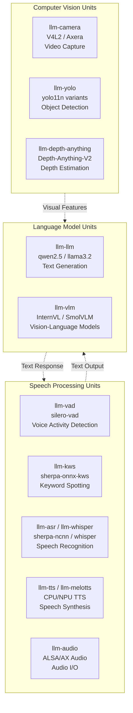

Sources: [README.md:29-32](), [README_zh.md:32-35]()

## Speech Processing Capabilities

StackFlow provides comprehensive speech processing capabilities through CPU and NPU-accelerated units:

### Speech Processing Unit Comparison

| Unit | Models | Size | Compute | Capability |
|------|--------|------|---------|------------|
| `llm-vad` | silero-vad | 3.3MB | CPU (ONNX) | Voice activity detection for speech/silence detection |
| `llm-kws` | sherpa-onnx-kws-zipformer | 3-6MB | CPU (ONNX) | Wake word detection for hands-free activation |
| `llm-asr` | sherpa-ncnn-streaming-zipformer | 20-40MB | CPU (NCNN) | Real-time streaming speech recognition |
| `llm-whisper` | whisper-tiny/base/small | 201-725MB | NPU (Axera) | High-accuracy speech recognition with multilingual support |
| `llm-tts` | single-speaker-fast | 60-77MB | CPU | Traditional TTS with basic voice synthesis |
| `llm-melotts` | melotts-zh-cn/en-us/ja-jp/es-es | 83-102MB | NPU (Axera) | Neural TTS with natural-sounding voices |

### Speech Processing Pipeline Flow

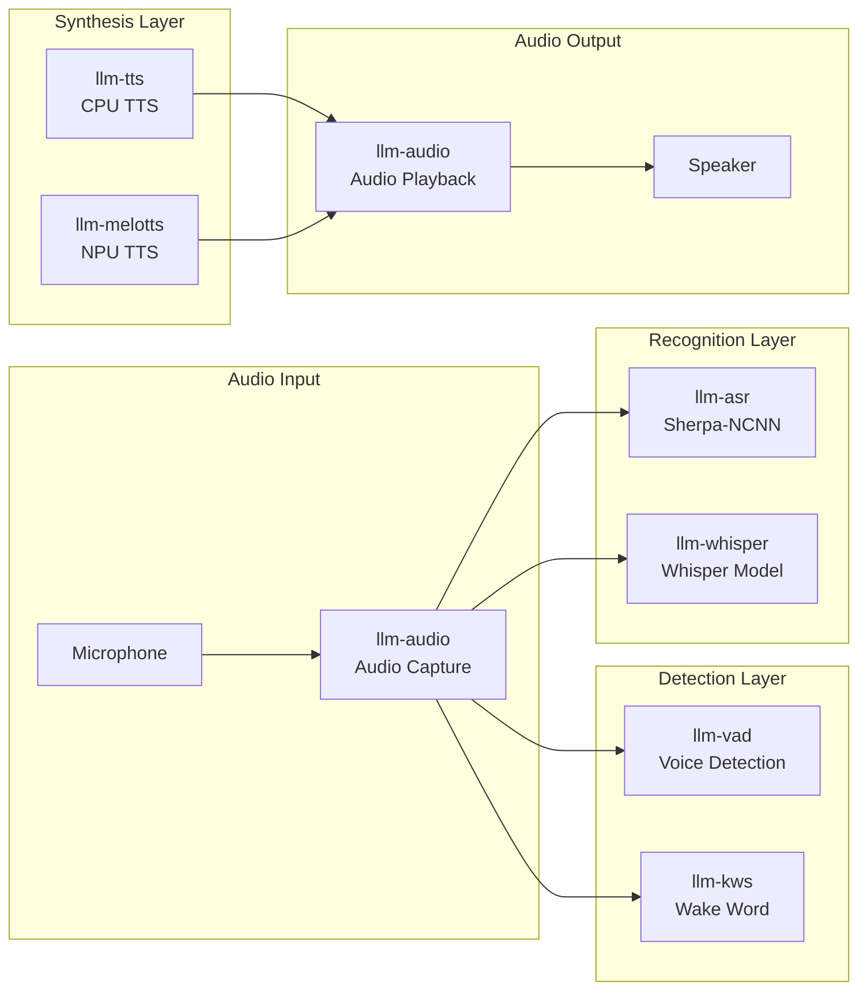

Sources: [README.md:58-77](), [README_zh.md:61-77](), [projects/llm_framework/main_asr/](), [projects/llm_framework/main_whisper/](), [projects/llm_framework/main_tts/](), [projects/llm_framework/main_melotts/]()

## Language Model Capabilities

StackFlow supports both text-only LLMs and vision-language models (VLMs) for various language understanding and generation tasks:

### Language Model Comparison

| Unit | Model Examples | Size | Context | Capability |
|------|---------------|------|---------|------------|
| `llm-llm` | qwen2.5-0.5B/1.5B<br/>llama3.2-1B<br/>deepseek-r1-1.5B | 0.6-2GB | 256-512 tokens | Text generation, dialogue, reasoning |
| `llm-llm` (with precompute) | qwen2.5-0.5B-prefill-20e<br/>llama3.2-1B-prefill | 0.8-1.7GB | Extended context | Conversational AI with system prompts |
| `llm-vlm` | InternVL2.5-1B<br/>SmolVLM-256M/500M<br/>Qwen3-VL | 330MB-1.2GB | Multimodal | Visual question answering, image description |

### LLM Architecture Components

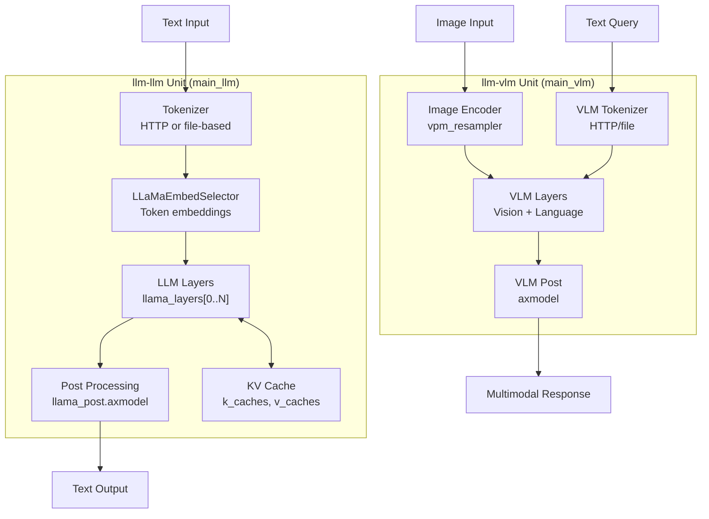

Sources: [projects/llm_framework/main_llm/src/main.cpp:47-504](), [projects/llm_framework/main_vlm/src/main.cpp:51-633](), [projects/llm_framework/main_llm/src/runner/LLM.hpp:75-253](), [projects/llm_framework/main_vlm/src/runner/LLM.hpp:93-296]()

### LLM Inference Modes

The `llm-llm` unit supports two inference modes based on configuration:

| Mode | Implementation | KV Cache | Use Case |
|------|---------------|----------|----------|
| **Standard** | `LLM` class | Dynamic per-inference | Single-turn Q&A, stateless generation |
| **Context-Aware** | `LLM_CTX` class | Persistent with precompute | Multi-turn dialogue, conversational AI |

The context-aware mode uses `precompute_len > 0` to cache system prompts, enabling efficient multi-turn conversations:

```cpp
// From main_llm/src/main.cpp:241-281
if (mode_config_.precompute_len > 0) {
    lLaMa_ctx_ = std::make_unique<LLM_CTX>();
    // Precompute system prompt and cache KV states
    lLaMa_ctx_->GenerateKVCachePrefill(_token_ids, k_caches, v_caches, precompute_len);
}
```

Sources: [projects/llm_framework/main_llm/src/main.cpp:241-281](), [projects/llm_framework/main_llm/src/runner/LLM.hpp:1-253]()

## Computer Vision Capabilities

StackFlow provides computer vision capabilities through specialized units for video capture, object detection, and depth estimation:

### Computer Vision Unit Comparison

| Unit | Models | Size | Compute | Capability |
|------|--------|------|---------|------------|
| `llm-camera` | V4L2 / Axera ISP | N/A | CPU | Video capture from cameras with format conversion |
| `llm-yolo` | yolo11n (detect) | 2.8MB | NPU | Real-time object detection |
| `llm-yolo` | yolo11n-seg | 3.0MB | NPU | Instance segmentation with masks |
| `llm-yolo` | yolo11n-pose | 3.1MB | NPU | Human pose estimation (17 keypoints) |
| `llm-yolo` | yolo11n-hand-pose | 3.2MB | NPU | Hand pose estimation (21 keypoints) |
| `llm-depth-anything` | Depth-Anything-V2 | 29MB | NPU | Monocular depth estimation |

### Computer Vision Processing Pipeline

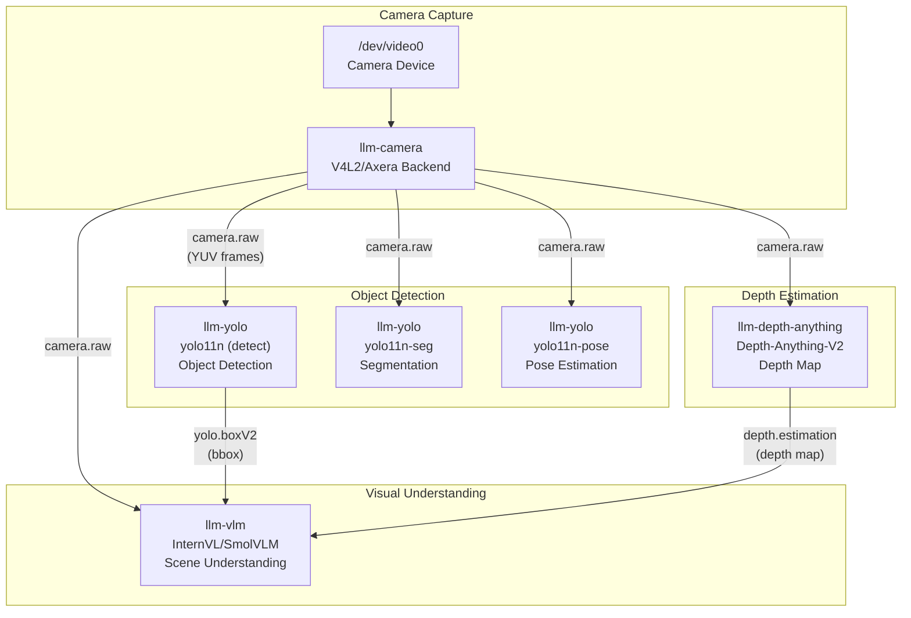

Sources: [README.md:94-103](), [projects/llm_framework/main_camera/](), [projects/llm_framework/main_yolo/](), [projects/llm_framework/main_depth_anything/]()

### YOLO Task Types

The `llm-yolo` unit supports multiple task types through different model variants:

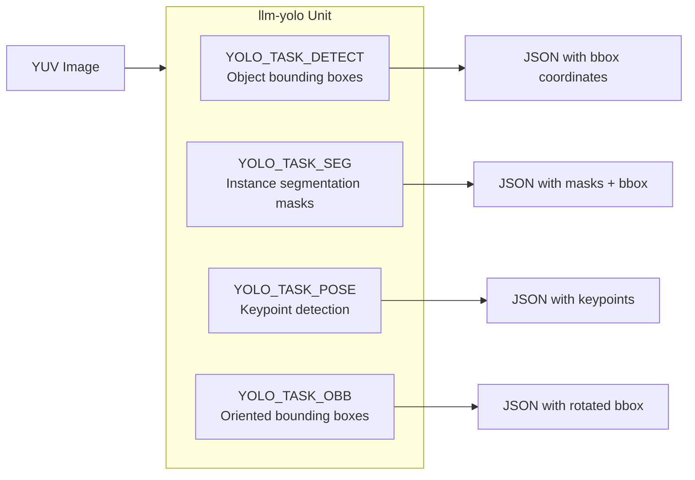

Sources: [projects/llm_framework/main_yolo/]()

## Use Case 1: Voice Assistant

The voice assistant is the primary use case for StackFlow, demonstrating end-to-end speech interaction:

### Voice Assistant Architecture

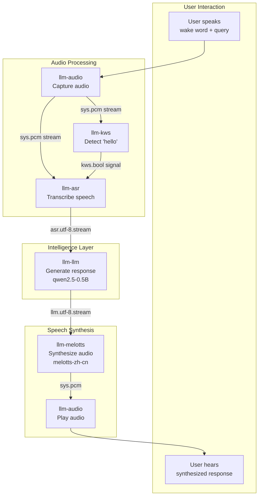

Sources: [projects/llm_framework/README.md:28-169](), [README.md:42-46]()

### Voice Assistant Configuration Example

The following JSON configurations set up a complete Chinese voice assistant:

**Step 1: Configure KWS** (Wake word: "你好你好")
```json
{
    "request_id": "1",
    "work_id": "kws",
    "action": "setup",
    "data": {
        "model": "sherpa-onnx-kws-zipformer-wenetspeech-3.3M-2024-01-01",
        "response_format": "kws.bool",
        "input": "sys.pcm",
        "enoutput": true,
        "kws": "你好你好"
    }
}
```

**Step 2: Configure ASR** (Speech-to-text with wake activation)
```json
{
    "request_id": "2",
    "work_id": "asr",
    "action": "setup",
    "data": {
        "model": "sherpa-ncnn-streaming-zipformer-zh-14M-2023-02-23",
        "response_format": "asr.utf-8.stream",
        "input": "sys.pcm",
        "enkws": true
    }
}
```

**Step 3: Configure LLM** (Response generation)
```json
{
    "request_id": "3",
    "work_id": "llm",
    "action": "setup",
    "data": {
        "model": "qwen2.5-0.5B-prefill-20e",
        "response_format": "llm.utf-8.stream",
        "input": "llm.utf-8",
        "max_token_len": 256,
        "prompt": "You are a knowledgeable assistant."
    }
}
```

**Step 4: Configure TTS** (Chinese speech synthesis)
```json
{
    "request_id": "4",
    "work_id": "melotts",
    "action": "setup",
    "data": {
        "model": "melotts-zh-cn",
        "response_format": "sys.pcm",
        "input": "tts.utf-8"
    }
}
```

**Step 5: Link units** to create the processing pipeline:
```json
{"work_id": "asr.1001", "action": "link", "data": "kws.1000"}
{"work_id": "llm.1002", "action": "link", "data": "asr.1001"}
{"work_id": "melotts.1003", "action": "link", "data": "llm.1002"}
{"work_id": "llm.1002", "action": "link", "data": "kws.1000"}
{"work_id": "melotts.1003", "action": "link", "data": "kws.1000"}
```

Sources: [projects/llm_framework/README.md:48-169]()

## Use Case 2: Visual Question Answering (VQA)

Visual Question Answering combines computer vision with language models to answer questions about images:

### VQA System Architecture

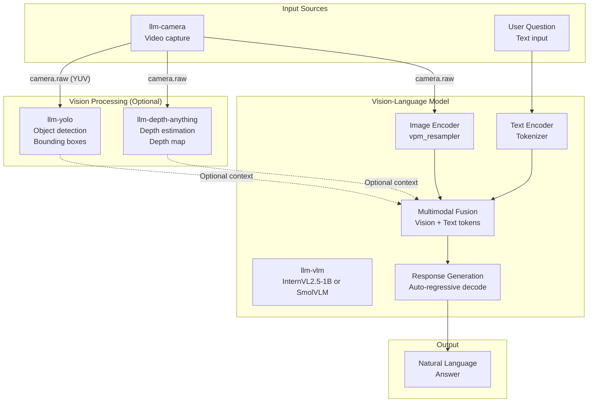

Sources: [projects/llm_framework/main_vlm/src/main.cpp:51-881]()

### VLM Model Types

The `llm-vlm` unit supports three model architectures based on the image encoder:

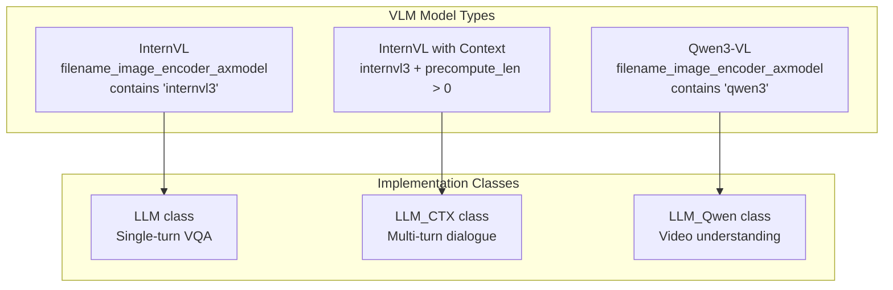

Sources: [projects/llm_framework/main_vlm/src/main.cpp:286-345]()

### VQA Configuration Example

**Single-turn VQA with InternVL**:
```json
{
    "request_id": "1",
    "work_id": "vlm",
    "action": "setup",
    "data": {
        "model": "internvl2.5-1B-364-ax630c",
        "response_format": "vlm.utf-8",
        "input": ["vlm.utf-8.base64.jpeg", "camera.1000"],
        "enoutput": true,
        "prompt": "Describe what you see in detail."
    }
}
```

**Multi-turn VQA with context** (using precompute):
```json
{
    "data": {
        "model": "internvl2.5-1B-364-ax630c",
        "precompute_len": 512,
        "system_prompt": "You are a helpful visual assistant.",
        "input": ["vlm.utf-8.base64.jpeg"]
    }
}
```

The VLM processes images through multiple stages:
1. **Image encoding**: `vpm_resampler.axmodel` converts images to visual tokens
2. **Token fusion**: Visual tokens are inserted at `img_token_id` positions
3. **LLM inference**: Unified transformer processes both modalities
4. **Streaming output**: Response generated token-by-token

Sources: [projects/llm_framework/main_vlm/src/main.cpp:161-377](), [projects/llm_framework/main_vlm/src/runner/LLM.hpp:131-403]()

## Use Case 3: Object Detection and Tracking

Real-time object detection enables applications like security monitoring, smart retail, and robotics:

### Object Detection Pipeline

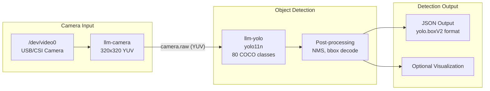

### YOLO Output Formats

The `llm-yolo` unit produces different output formats based on task type:

| Task Type | Output Format | Content |
|-----------|--------------|---------|
| `YOLO_TASK_DETECT` | `yolo.boxV2` | Object class, confidence, bbox (x, y, w, h) |
| `YOLO_TASK_SEG` | `yolo.seg` | Object class, bbox, segmentation mask |
| `YOLO_TASK_POSE` | `yolo.pose` | Object class, bbox, 17 body keypoints |
| `YOLO_TASK_OBB` | `yolo.obb` | Object class, rotated bbox (x, y, w, h, angle) |

**Example Detection Output**:
```json
{
    "object": "yolo.boxV2",
    "data": {
        "boxes": [
            {
                "class_id": 0,
                "label": "person",
                "prob": 0.89,
                "bbox": {"x": 120, "y": 80, "w": 180, "h": 320}
            }
        ]
    }
}
```

Sources: [projects/llm_framework/main_yolo/]()

### YOLO Configuration Example

**Object Detection**:
```json
{
    "request_id": "1",
    "work_id": "yolo",
    "action": "setup",
    "data": {
        "model": "yolo11n",
        "response_format": "yolo.boxV2",
        "input": "camera.1000",
        "enoutput": true
    }
}
```

**Pose Estimation**:
```json
{
    "data": {
        "model": "yolo11n-pose",
        "response_format": "yolo.pose",
        "input": "camera.1000"
    }
}
```

Sources: [projects/llm_framework/README.md:172-232]()

## Use Case 4: Multimodal Applications

StackFlow enables complex multimodal applications by combining multiple AI capabilities:

### Multimodal Application Examples

| Application | Units Used | Description |
|-------------|-----------|-------------|
| **Smart Security** | camera + yolo + llm-vlm + tts | Detect objects, describe suspicious activity, alert via speech |
| **Assistive Vision** | camera + depth + llm-vlm + tts | Describe scenes with spatial awareness for visually impaired users |
| **Interactive Robot** | audio + kws + asr + llm-vlm + tts + yolo | Voice-controlled robot with visual understanding |
| **Smart Home Assistant** | audio + asr + llm + tts + camera (optional) | Voice control with optional visual context |

### Example: Visual Question Answering with Object Detection

Combining YOLO object detection with VLM for enhanced visual understanding:

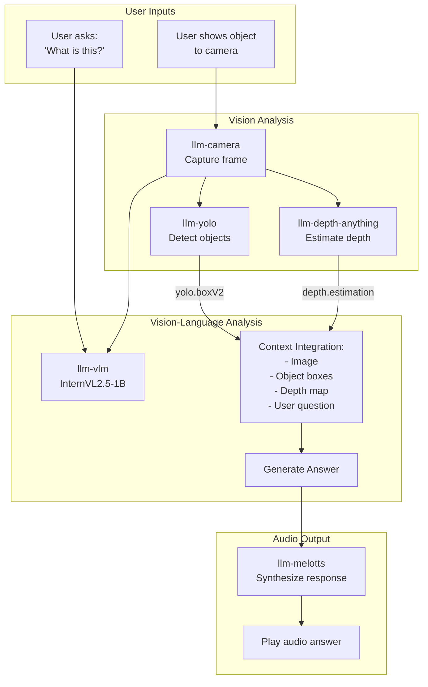

Sources: [projects/llm_framework/main_vlm/src/main.cpp:840-869]()

### Multimodal Integration Patterns

StackFlow supports three integration patterns for multimodal applications:

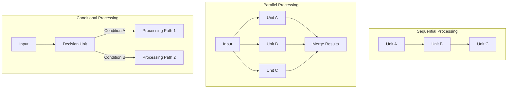

**Sequential**: Voice assistant (audio → ASR → LLM → TTS)
**Parallel**: Multi-model vision (camera → [YOLO, Depth] → VLM)
**Conditional**: Wake-word gated ASR (KWS controls ASR activation)

Sources: [projects/llm_framework/main_vlm/src/main.cpp:840-881](), [projects/llm_framework/main_llm/src/main.cpp:685-742]()

## Practical Implementation Examples

### Serial Communication Adapter

The serial communication adapter (`serial_com`) shows how external interfaces can be integrated with the ZMQ-based communication system:

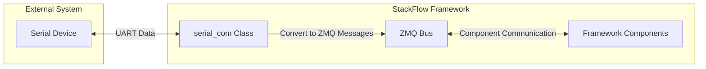

Sources: [projects/llm_framework/main_sys/src/serial_com.cpp:28-85]()

### TCP Communication Adapter

Similarly, the TCP communication adapter (`tcp_com`) integrates TCP/IP communications:

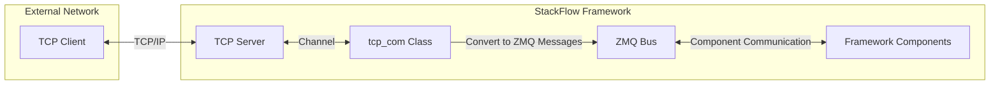

Sources: [projects/llm_framework/main_sys/src/tcp_com.cpp:33-58]()

## Best Practices for Component Communication

When building components that communicate within the StackFlow framework:

1. **Use Appropriate Communication Patterns**:
   - Use PUB-SUB for one-to-many broadcasts (e.g., a camera module publishing to multiple vision models)
   - Use REQ-REP for service requests (e.g., querying a language model)
   - Use PUSH-PULL for workload distribution (e.g., distributing tasks to worker processes)

2. **Handle Message Types Appropriately**:
   - Use JSON for configuration, commands, and metadata
   - Use binary data with the RAW marker for large data like images and audio
   - Consider BSON for structured binary data

3. **Error Handling**:
   - Always include error information in responses
   - Check return codes from communication operations
   - Implement timeouts for RPC calls to prevent blocking indefinitely

4. **Component Registration**:
   - Register components with descriptive work_ids
   - Use consistent naming conventions for components and actions
   - Document the interfaces and message formats your component expects

## Conclusion

The StackFlow component communication system provides a flexible and efficient way for AI components to interact. By leveraging ZeroMQ's various communication patterns and adding structured message formats, the framework enables the creation of modular, extensible AI applications.