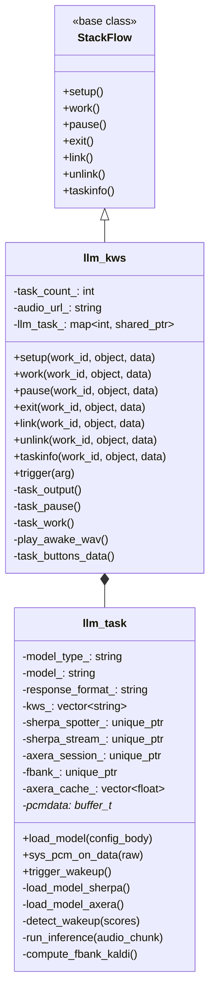
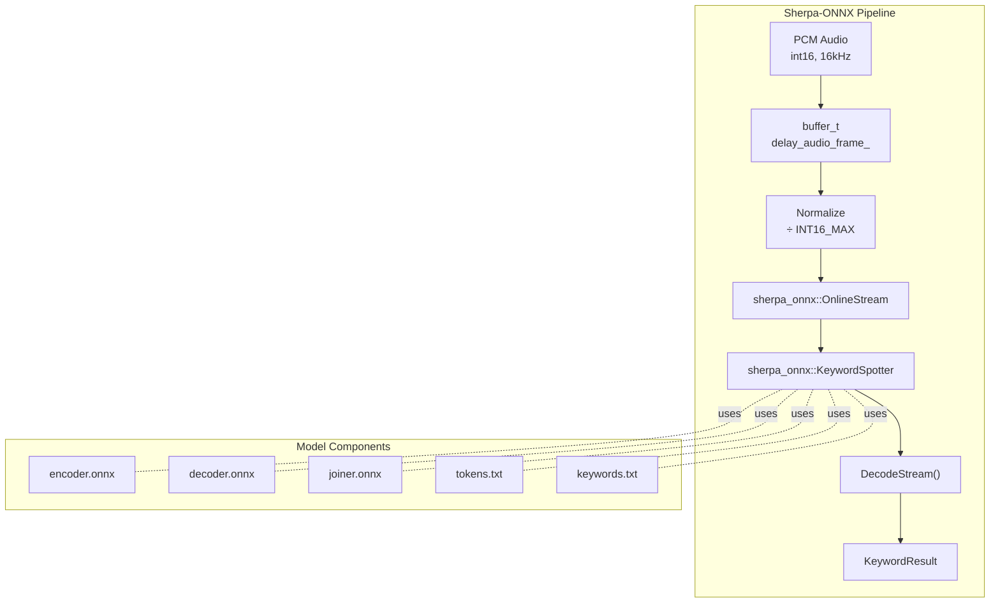
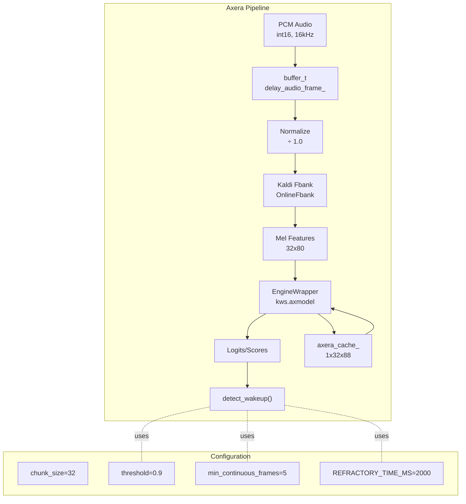
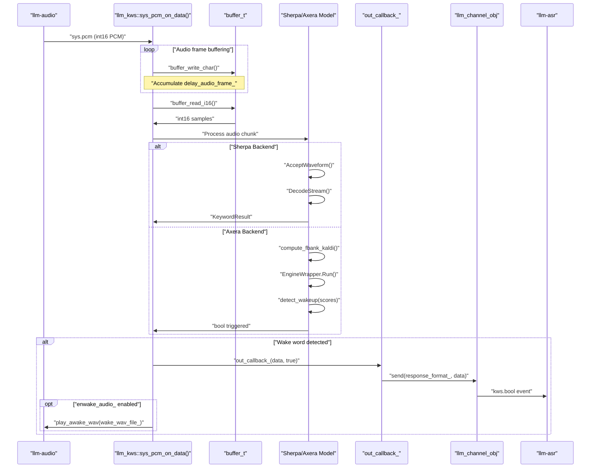
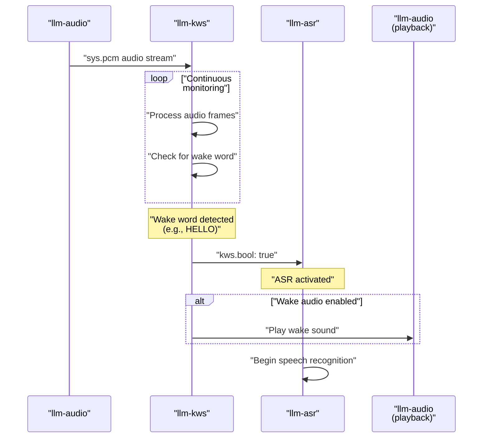
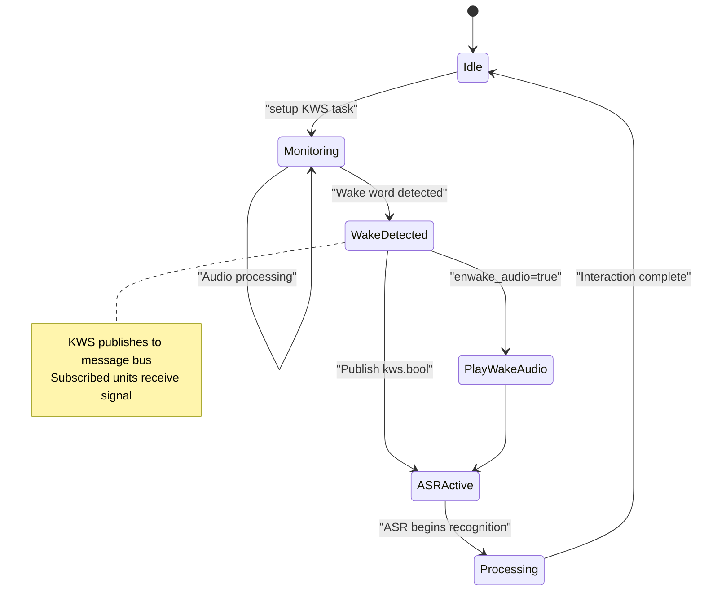

StackFlow Keyword Spotting (llm-kws)

# Keyword Spotting (llm-kws)

<details>
<summary>Relevant source files</summary>

The following files were used as context for generating this wiki page:

- [projects/llm_framework/main_asr/src/main.cpp](projects/llm_framework/main_asr/src/main.cpp)
- [projects/llm_framework/main_kws/src/main.cpp](projects/llm_framework/main_kws/src/main.cpp)
- [projects/llm_framework/main_vad/src/main.cpp](projects/llm_framework/main_vad/src/main.cpp)
- [projects/llm_framework/main_whisper/src/main.cpp](projects/llm_framework/main_whisper/src/main.cpp)

</details>


The `llm-kws` unit provides keyword spotting (wake word detection) services within the StackFlow framework. It continuously monitors audio streams to detect predefined wake words, enabling hands-free voice assistant activation. The unit implements two inference backends: Sherpa-ONNX (CPU-based) and Axera NPU (hardware-accelerated).

## Overview

The `llm-kws` unit is implemented in [projects/llm_framework/main_kws/src/main.cpp]() and consists of two primary classes:

- `llm_task`: Encapsulates a single KWS task instance, managing model loading, audio processing, and detection logic
- `llm_kws`: Inherits from `StackFlow`, implements the RPC interface and manages multiple task instances

### Key Features

- **Dual Backend Support**: Sherpa-ONNX for CPU inference or Axera NPU for hardware acceleration
- **Continuous Monitoring**: Processes PCM audio streams from `llm-audio` or other sources
- **Event Publishing**: Broadcasts `kws.bool` wake events via ZMQ message bus
- **Multiple Trigger Sources**: Audio-based detection, manual RPC trigger, or hardware button trigger
- **Wake Audio Feedback**: Optional audio playback confirmation when wake word detected
- **Configurable Wake Words**: Dynamic wake word configuration via keyword files

### Backend Selection

The backend is automatically selected based on the `model` parameter during setup:
- If model name starts with `"sherpa-onnx"`: uses Sherpa-ONNX backend
- Otherwise: uses Axera NPU backend

Sources:
- [projects/llm_framework/main_kws/src/main.cpp:1-1124]()
- [projects/llm_framework/main_kws/src/main.cpp:52-622]()
- [projects/llm_framework/main_kws/src/main.cpp:626-1112]()
- [projects/llm_framework/main_kws/src/main.cpp:117-121]()

## Architecture

### Class Structure



**Class Responsibilities**:

- `llm_kws`: Manages lifecycle, RPC interface, and multi-task coordination
- `llm_task`: Encapsulates model inference, audio buffering, and detection logic

Sources:
- [projects/llm_framework/main_kws/src/main.cpp:52-622]()
- [projects/llm_framework/main_kws/src/main.cpp:626-1112]()

### Backend Implementations

#### Sherpa-ONNX Backend



**Sherpa-ONNX Processing**:

1. Audio buffering with configurable delay (`delay_audio_frame_`, default 10 frames)
2. Normalization: `float_sample = int16_sample / INT16_MAX`
3. Stream accumulation via `AcceptWaveform()`
4. Streaming decode when `IsReady()` returns true
5. Result retrieval via `GetResult()` returns `KeywordResult` with detected keyword
6. Wake word matching against configured `kws_` list

Sources:
- [projects/llm_framework/main_kws/src/main.cpp:161-294]()
- [projects/llm_framework/main_kws/src/main.cpp:501-538]()
- [projects/llm_framework/main_kws/src/main.cpp:71-73]()

#### Axera NPU Backend



**Axera NPU Processing**:

1. Audio buffering with configurable delay (`delay_audio_frame_` from config)
2. Normalization: `float_sample = int16_sample / 1.0` (no division for Axera)
3. Fbank feature extraction via `knf::OnlineFbank` (80-dimensional mel features)
4. Reshape to fixed size (`FIX_T=32` frames × 80 features)
5. NPU inference via `EngineWrapper.Run()` with two inputs: features and cache state
6. Cache update for stateful processing (`axera_cache_` size: 1×32×88)
7. Threshold-based detection with continuous frame counting
8. Refractory period to prevent duplicate triggers

Sources:
- [projects/llm_framework/main_kws/src/main.cpp:309-378]()
- [projects/llm_framework/main_kws/src/main.cpp:420-463]()
- [projects/llm_framework/main_kws/src/main.cpp:382-401]()
- [projects/llm_framework/main_kws/src/main.cpp:42-50]()

### Data Flow



**Processing Steps**:

1. Audio frames arrive from `llm-audio` via ZMQ subscriber
2. Frames buffered in `buffer_t` structure (delay compensation)
3. Backend-specific processing (Sherpa streaming or Axera NPU inference)
4. Detection logic evaluates keyword presence
5. On detection: callback invokes `llm_channel_obj.send()` to publish event
6. Optionally plays wake audio via `play_awake_wav()`

Sources:
- [projects/llm_framework/main_kws/src/main.cpp:484-538]()
- [projects/llm_framework/main_kws/src/main.cpp:646-677]()
- [projects/llm_framework/main_kws/src/main.cpp:679-703]()

### Wake Word Detection Workflow



**Detection Flow**

1. The `llm-kws` unit continuously receives PCM audio frames from `llm-audio`
2. Audio is processed through the sherpa-onnx keyword spotting model
3. When the configured wake word is detected, `llm-kws` publishes a `kws.bool` event
4. Subscribed units (e.g., `llm-asr`) receive the wake signal and activate
5. Optionally, a wake-up audio file is played to confirm detection

Sources:
- [doc/projects_llm_framework_doc/llm_kws_en.md:21-24]()
- [doc/projects_llm_framework_doc/llm_kws_en.md:38]()

## Model Support

### Sherpa-ONNX Models

The unit supports Sherpa-ONNX keyword spotting models based on the Zipformer transducer architecture. Two pre-configured models are available:

| Model | Language | Model ID | Typical Wake Word | Backend |
|-------|----------|----------|-------------------|---------|
| GigaSpeech | English | `sherpa-onnx-kws-zipformer-gigaspeech-3.3M-2024-01-01` | "HELLO" | Sherpa-ONNX |
| WenetSpeech | Chinese | `sherpa-onnx-kws-zipformer-wenetspeech-3.3M-2024-01-01` | "你好你好" | Sherpa-ONNX |

**Model Components** (Sherpa-ONNX):
- `encoder-*.onnx`: Transducer encoder model
- `decoder-*.onnx`: Transducer decoder model
- `joiner-*.onnx`: Joiner network
- `tokens.txt`: Token vocabulary
- `keywords.txt`: Wake word definitions (generated from `kws` config parameter)

### Axera NPU Models

Axera backend uses custom `.axmodel` files optimized for the AX630C/AX650N NPU:

| Component | File | Purpose |
|-----------|------|---------|
| KWS Model | `kws.axmodel` | Neural network compiled for Axera NPU |
| Configuration | Model-specific JSON | Fbank parameters, thresholds, timing |

**Axera Configuration Parameters**:
- `chunk_size`: Input chunk size (default: 32 frames)
- `threshold`: Detection confidence threshold (default: 0.9)
- `min_continuous_frames`: Frames required for detection (default: 5)
- `REFRACTORY_TIME_MS`: Cooldown period between detections (default: 2000ms)
- `FEAT_DIM`: Feature dimension (default: 80 mel bins)

### Wake Word Configuration

Wake words are configured dynamically via the `kws` parameter in the setup request. For Sherpa-ONNX models:

1. User-specified wake words in `kws` parameter (e.g., `"HELLO"` or `"你好你好"`)
2. Wake words written to `/tmp/kws_awake.txt.tmp`
3. Converted to token IDs via `text2token.py` or `llm-kws_text2token.py` script
4. Generated `keywords.txt` loaded by `sherpa_onnx::KeywordSpotter`

For Axera models, wake word detection is implicit in the trained model.

Sources:
- [projects/llm_framework/main_kws/src/main.cpp:161-294]()
- [projects/llm_framework/main_kws/src/main.cpp:309-378]()
- [projects/llm_framework/main_kws/src/main.cpp:257-283]()
- [projects/llm_framework/main_kws/src/main.cpp:42-50]()

## Configuration

### Setup Parameters

The `llm-kws` unit is configured via JSON in the `setup` RPC call. The configuration is parsed by `llm_task::parse_config()` and `llm_task::load_model()`.

#### Common Parameters

| Parameter | Type | Description | Default | Code Reference |
|-----------|------|-------------|---------|----------------|
| `model` | string | Model identifier (determines backend) | required | [main.cpp:113]() |
| `response_format` | string | Output channel name | `"kws.bool"` | [main.cpp:114]() |
| `input` | string/array | Audio input source(s) | required | [main.cpp:128-135]() |
| `enoutput` | boolean | Enable output publishing | `true` | [main.cpp:115]() |
| `kws` | string/array | Wake word(s) to detect | required | [main.cpp:137-144]() |
| `enwake_audio` | boolean | Enable wake audio playback | `true` | [main.cpp:123-127]() |
| `wake_wav_file` | string | Path to wake audio file | (optional) | [main.cpp:244-247, 334-337]() |

#### Input Types

The `input` parameter supports multiple sources:

| Input Type | Description | Code Path |
|------------|-------------|-----------|
| `"sys.pcm"` | System audio from `llm-audio` | [main.cpp:879-886]() |
| `"kws.*"` | User data via `subscriber_work_id()` | [main.cpp:887-891]() |
| `"buttons_thread"` | Hardware button via IPC socket | [main.cpp:892-903]() |

#### Sherpa-ONNX Specific Parameters

Configured in model JSON files and overridable in setup request:

| Parameter | Description | Default |
|-----------|-------------|---------|
| `feat_config.sampling_rate` | Audio sample rate | 16000 |
| `feat_config.feature_dim` | Feature dimension | 80 |
| `model_config.tokens` | Token vocabulary file | `"tokens.txt"` |
| `keywords_file` | Generated keywords file | `"keywords.txt"` |
| `keywords_score` | Keyword boost score | 1.0 |
| `keywords_threshold` | Detection threshold | 0.5 |

Sources:
- [projects/llm_framework/main_kws/src/main.cpp:110-153]()
- [projects/llm_framework/main_kws/src/main.cpp:161-294]()

#### Axera NPU Specific Parameters

Configured in model JSON files and overridable in setup request:

| Parameter | Description | Default | Code Reference |
|-----------|-------------|---------|----------------|
| `chunk_size` | Audio chunk size (frames) | 32 | [main.cpp:43, 348]() |
| `threshold` | Detection confidence threshold | 0.9 | [main.cpp:44, 349]() |
| `min_continuous_frames` | Required continuous detections | 5 | [main.cpp:45, 350]() |
| `REFRACTORY_TIME_MS` | Detection cooldown period | 2000 | [main.cpp:46, 351]() |
| `RESAMPLE_RATE` | Audio sample rate | 16000 | [main.cpp:47, 352]() |
| `FEAT_DIM` | Mel feature dimension | 80 | [main.cpp:48, 353]() |
| `delay_audio_frame_` | Audio delay compensation | 32 | [main.cpp:49, 354]() |
| `frame_opts.samp_freq` | Fbank sample frequency | 16000 | [main.cpp:356]() |
| `frame_opts.frame_length_ms` | Frame length | 25.0 | [main.cpp:357]() |
| `frame_opts.frame_shift_ms` | Frame shift | 10.0 | [main.cpp:358]() |
| `mel_opts.num_bins` | Number of mel bins | 80 | [main.cpp:364]() |

Sources:
- [projects/llm_framework/main_kws/src/main.cpp:309-378]()
- [projects/llm_framework/main_kws/src/main.cpp:42-50]()

## RPC API Reference

The `llm-kws` unit implements the standard StackFlow RPC interface plus a custom `trigger` action. Implementation: [projects/llm_framework/main_kws/src/main.cpp:626-1112]().

### setup

Initializes a new KWS task instance. Implementation: `llm_kws::setup()` [main.cpp:846-916]().

**Request**

```json
{
  "request_id": "2",
  "work_id": "kws",
  "action": "setup",
  "object": "kws.setup",
  "data": {
    "model": "sherpa-onnx-kws-zipformer-gigaspeech-3.3M-2024-01-01",
    "response_format": "kws.bool",
    "input": "sys.pcm",
    "enoutput": true,
    "kws": "HELLO",
    "enwake_audio": true
  }
}
```

**Response**

```json
{
  "created": 1731488402,
  "data": "None",
  "error": {"code": 0, "message": ""},
  "object": "None",
  "request_id": "2",
  "work_id": "kws.1000"
}
```

**Processing Steps**:
1. Parse JSON configuration via `nlohmann::json::parse(data)`
2. Create `llm_task` instance
3. Call `llm_task::load_model()` to initialize backend
4. Setup audio subscriber if input is `"sys.pcm"`
5. Register callbacks for output and wake audio
6. Store task in `llm_task_` map with numeric work_id

Sources:
- [projects/llm_framework/main_kws/src/main.cpp:846-916]()

### work

Resumes a paused KWS task. Implementation: `llm_kws::work()` [main.cpp:737-750]().

**Request**

```json
{
  "request_id": "4",
  "work_id": "kws.1000",
  "action": "work"
}
```

**Response**

```json
{
  "created": 1731488402,
  "data": "None",
  "error": {"code": 0, "message": ""},
  "object": "None",
  "request_id": "4",
  "work_id": "kws.1000"
}
```

**Processing**: Calls `task_work()` which re-subscribes to audio URL if `audio_flage_` is false.

Sources:
- [projects/llm_framework/main_kws/src/main.cpp:737-750]()
- [projects/llm_framework/main_kws/src/main.cpp:719-735]()

### pause

Pauses the KWS task, stopping audio processing. Implementation: `llm_kws::pause()` [main.cpp:752-765]().

**Request**

```json
{
  "request_id": "3",
  "work_id": "kws.1000",
  "action": "pause"
}
```

**Response**

```json
{
  "created": 1731488402,
  "data": "None",
  "error": {"code": 0, "message": ""},
  "object": "None",
  "request_id": "3",
  "work_id": "kws.1000"
}
```

**Processing**: Calls `task_pause()` which unsubscribes from audio channel and sets `audio_flage_` to false.

Sources:
- [projects/llm_framework/main_kws/src/main.cpp:752-765]()
- [projects/llm_framework/main_kws/src/main.cpp:705-717]()

### exit

Terminates the KWS task and releases resources. Implementation: `llm_kws::exit()` [main.cpp:1033-1053]().

**Request**

```json
{
  "request_id": "5",
  "work_id": "kws.1000",
  "action": "exit"
}
```

**Response**

```json
{
  "created": 1731488402,
  "data": "None",
  "error": {"code": 0, "message": ""},
  "object": "None",
  "request_id": "5",
  "work_id": "kws.1000"
}
```

**Cleanup Steps**:
1. Call `llm_task::stop()`
2. Unsubscribe from all channels via `llm_channel->stop_subscriber("")`
3. Stop audio capture via `unit_call("audio", "cap_stop", "None")`
4. Erase task from `llm_task_` map

Sources:
- [projects/llm_framework/main_kws/src/main.cpp:1033-1053]()

### link

Dynamically links the KWS unit to input sources. Implementation: `llm_kws::link()` [main.cpp:918-972]().

**Request**

```json
{
  "request_id": "6",
  "work_id": "kws.1000",
  "action": "link",
  "data": "sys.pcm"
}
```

**Supported Link Targets**:
- `"sys.pcm"`: System audio stream
- `"buttons_thread"`: Hardware button via `ipc:///tmp/llm/ec_prox.event.socket`

Sources:
- [projects/llm_framework/main_kws/src/main.cpp:918-972]()

### unlink

Removes a previously established link. Implementation: `llm_kws::unlink()` [main.cpp:974-1004]().

**Request**

```json
{
  "request_id": "7",
  "work_id": "kws.1000",
  "action": "unlink",
  "data": "sys.pcm"
}
```

**Processing**: Calls `stop_subscriber_work_id()` and removes from `inputs_` vector.

Sources:
- [projects/llm_framework/main_kws/src/main.cpp:974-1004]()

### taskinfo

Queries task list or specific task configuration. Implementation: `llm_kws::taskinfo()` [main.cpp:1006-1031]().

**Query All Tasks**

Request:
```json
{
  "request_id": "2",
  "work_id": "kws",
  "action": "taskinfo"
}
```

Response:
```json
{
  "created": 1731580350,
  "data": ["kws.1000"],
  "error": {"code": 0, "message": ""},
  "object": "kws.tasklist",
  "request_id": "2",
  "work_id": "kws"
}
```

**Query Specific Task**

Request:
```json
{
  "request_id": "2",
  "work_id": "kws.1000",
  "action": "taskinfo"
}
```

Response:
```json
{
  "created": 1731652086,
  "data": {
    "enoutput": true,
    "inputs": ["sys.pcm"],
    "model": "sherpa-onnx-kws-zipformer-gigaspeech-3.3M-2024-01-01",
    "response_format": "kws.bool"
  },
  "error": {"code": 0, "message": ""},
  "object": "kws.taskinfo",
  "request_id": "2",
  "work_id": "kws.1000"
}
```

Sources:
- [projects/llm_framework/main_kws/src/main.cpp:1006-1031]()

### trigger (Custom Action)

Manually triggers wake word detection without audio input. Implementation: `llm_kws::trigger()` [main.cpp:1055-1094]().

**Request**

```json
{
  "request_id": "8",
  "work_id": "kws.1000",
  "action": "trigger"
}
```

**Response**

```json
{
  "created": 1731488402,
  "data": "None",
  "error": {"code": 0, "message": ""},
  "object": "None",
  "request_id": "8",
  "work_id": "kws.1000"
}
```

**Processing**: Directly calls `llm_task::trigger_wakeup()` [main.cpp:541-552](), which:
1. Optionally plays wake audio
2. Invokes output callback with empty data
3. Publishes wake event to subscribers

This action is registered in the constructor: [main.cpp:638-643]().

Sources:
- [projects/llm_framework/main_kws/src/main.cpp:1055-1094]()
- [projects/llm_framework/main_kws/src/main.cpp:541-552]()
- [projects/llm_framework/main_kws/src/main.cpp:638-643]()

## Usage Examples

### Basic Wake Word Detection Setup

Configure an English wake word detection task:

```json
{
  "request_id": "1",
  "work_id": "kws",
  "action": "setup",
  "object": "kws.setup",
  "data": {
    "model": "sherpa-onnx-kws-zipformer-gigaspeech-3.3M-2024-01-01",
    "response_format": "kws.bool",
    "input": "sys.pcm",
    "enoutput": true,
    "kws": "HELLO",
    "enwake_audio": true
  }
}
```

This configuration:
- Uses the English GigaSpeech model
- Monitors system audio (`sys.pcm`)
- Detects the wake word "HELLO"
- Enables output publishing to subscribed units
- Plays wake-up audio when detected

Sources:
- [doc/projects_llm_framework_doc/llm_kws_en.md:10-27]()

### Chinese Wake Word Detection

Configure a Chinese wake word detection task:

```json
{
  "request_id": "1",
  "work_id": "kws",
  "action": "setup",
  "object": "kws.setup",
  "data": {
    "model": "sherpa-onnx-kws-zipformer-wenetspeech-3.3M-2024-01-01",
    "response_format": "kws.bool",
    "input": "sys.pcm",
    "enoutput": true,
    "kws": "你好你好",
    "enwake_audio": true
  }
}
```

This configuration uses the Chinese WenetSpeech model to detect the wake word "你好你好".

Sources:
- [doc/projects_llm_framework_doc/llm_kws_en.md:33]()
- [doc/projects_llm_framework_doc/llm_kws_en.md:37]()

### Voice Assistant Integration Pattern

Typical workflow for integrating KWS with ASR in a voice assistant:



**Integration Steps**:

1. Initialize `llm-kws` with desired wake word
2. Link `llm-asr` to subscribe to KWS output channel
3. KWS continuously monitors audio for wake word
4. Upon detection, KWS publishes `kws.bool` event
5. ASR receives wake signal and begins speech recognition
6. Optional wake-up audio provides user feedback

Sources:
- [doc/assets/StackFlow_unit.dot:30-32]()
- [doc/projects_llm_framework_doc/llm_kws_en.md:21-24]()
- [doc/projects_llm_framework_doc/llm_kws_en.md:38]()

## Configuration Examples

### VAD Configuration Example

```json
{
  "mode": "silero_vad",
  "type": "vad",
  "input_type": [
    "sys.pcm",
    "sys.cap.0_0"
  ],
  "output_type": [
    "vad.bool"
  ],
  "mode_param": {
    "silero_vad.model": "silero_vad.ort",
    "silero_vad.threshold": 0.5,
    "silero_vad.min_silence_duration": 0.5,
    "silero_vad.min_speech_duration": 0.25
  }
}
```

### KWS Configuration Example

```json
{
  "mode": "sherpa-onnx-kws-zipformer-wenetspeech-3.3M-2024-01-01",
  "type": "kws",
  "input_type": [
    "sys.pcm",
    "sys.cap.0_0"
  ],
  "output_type": [
    "kws.bool"
  ],
  "mode_param": {
    "model_config.transducer.encoder": "encoder-epoch-12-avg-2-chunk-16-left-64.int8.ort",
    "model_config.transducer.decoder": "decoder-epoch-12-avg-2-chunk-16-left-64.ort",
    "model_config.transducer.joiner": "joiner-epoch-12-avg-2-chunk-16-left-64.int8.ort",
    "model_config.tokens": "tokens.txt",
    "keywords_file": "keywords.txt",
    "wake_wav_file": "/opt/m5stack/data/audio/wakeup_zh_cn.wav"
  }
}
```

Sources:
- [projects/llm_framework/main_vad/mode_silero-vad.json:1-27]()
- [projects/llm_framework/main_kws/mode_sherpa-onnx-kws-zipformer-wenetspeech-3.3M-2024-01-01.json:1-25]()