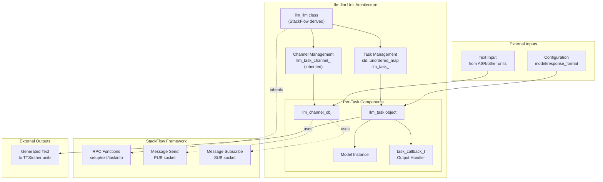
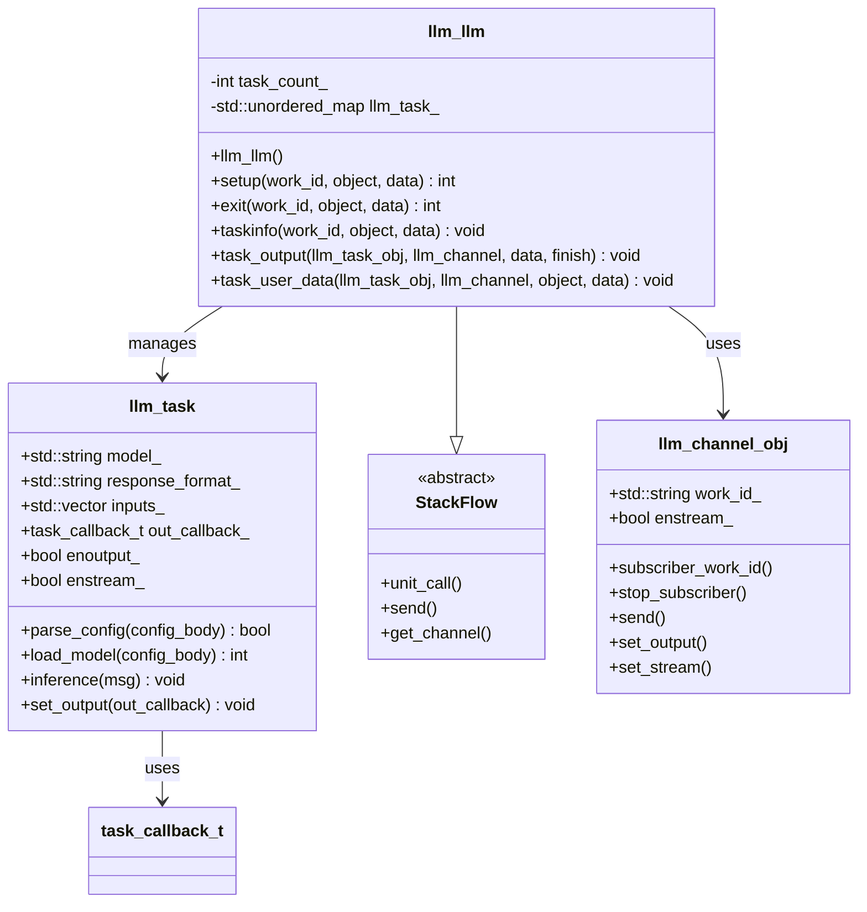
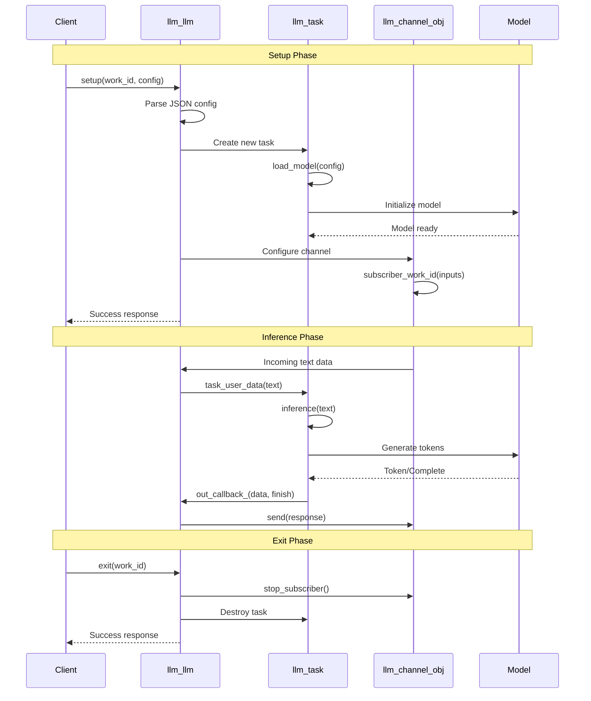
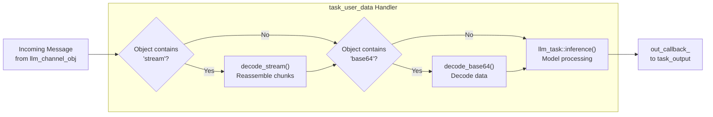
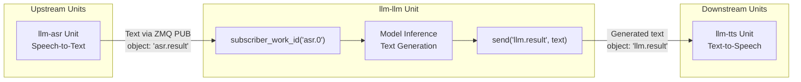

StackFlow LLM Inference (llm-llm)

# Large Language Models (llm-llm)

<details>
<summary>Relevant source files</summary>

The following files were used as context for generating this wiki page:

- [projects/llm_framework/main_llm/src/main.cpp](projects/llm_framework/main_llm/src/main.cpp)
- [projects/llm_framework/main_llm/src/runner/LLM.hpp](projects/llm_framework/main_llm/src/runner/LLM.hpp)
- [projects/llm_framework/main_vlm/src/main.cpp](projects/llm_framework/main_vlm/src/main.cpp)
- [projects/llm_framework/main_vlm/src/runner/LLM.hpp](projects/llm_framework/main_vlm/src/runner/LLM.hpp)
- [projects/llm_framework/main_vlm/src/runner/ax_model_runner/ax_model_runner.hpp](projects/llm_framework/main_vlm/src/runner/ax_model_runner/ax_model_runner.hpp)

</details>


## Purpose and Scope

The `llm-llm` unit provides text generation and reasoning capabilities within the StackFlow framework. It manages loading and inference of Large Language Models ranging from 0.5B to 1.5B parameters, supporting multiple model families including Qwen2.5, Llama3.2, and DeepSeek-R1. This unit receives text input from other units (typically from ASR for voice assistants) and generates text responses that can be consumed by downstream units (such as TTS for speech synthesis).

For information about vision-language models that combine image understanding with text generation, see [Vision-Language Models](#3.2.3). For details on the speech recognition units that typically feed text into this unit, see [Speech Recognition](#3.1.3).

**Sources:** [benchmark/RESULTS.md](), [benchmark/default.yaml](), [doc/component_doc/StackFlow_en.md]()

## Architecture Overview

The `llm-llm` unit follows the standard StackFlow unit architecture, inheriting from the `StackFlow` base class and implementing the required RPC functions. It manages multiple concurrent inference tasks, each identified by a unique `work_id`.



**Diagram: llm-llm Unit Component Structure**

The unit maintains a mapping between `work_id` identifiers and task instances, allowing multiple independent LLM inference sessions to run concurrently.

**Sources:** [doc/component_doc/StackFlow_en.md:252-393](), [doc/component_doc/StackFlow_zh.md:252-393]()

## Supported Models

The `llm-llm` unit supports multiple model families with varying parameter counts and optimization strategies. Performance varies based on model size, quantization, and prefill configuration.

| Model Name | Parameters | ttft (ms) | avg-token/s | Model Version | Optimization |
|------------|-----------|-----------|-------------|---------------|--------------|
| qwen2.5-0.5B-prefill-20e | 0.5B | 359.8 | 10.32 | v0.2 | Prefill optimized |
| qwen2.5-0.5B-p256-ax630c | 0.5B | 1126.19 | 10.30 | v0.4 | 256 prefill length |
| qwen2.5-0.5B-Int4-ax630c | 0.5B | 442.95 | 12.52 | v0.4 | Int4 quantization |
| qwen2.5-coder-0.5B-ax630c | 0.5B | 361.81 | 10.28 | v0.2 | Code specialized |
| qwen2.5-1.5B-ax630c | 1.5B | 1029.41 | 3.59 | v0.3 | Standard |
| qwen2.5-1.5B-p256-ax630c | 1.5B | 3056.54 | 3.57 | v0.4 | 256 prefill length |
| qwen2.5-1.5B-Int4-ax630c | 1.5B | 1219.54 | 4.63 | v0.4 | Int4 quantization |
| deepseek-r1-1.5B-ax630c | 1.5B | 1075.04 | 3.57 | v0.3 | Reasoning model |
| deepseek-r1-1.5B-p256-ax630c | 1.5B | 3056.86 | 3.57 | v0.4 | 256 prefill length |
| llama3.2-1B-prefill-ax630c | 1.0B | 891.00 | 4.48 | v0.2 | Prefill optimized |
| llama3.2-1B-p256-ax630c | 1.0B | 2601.11 | 4.49 | v0.4 | 256 prefill length |
| openbuddy-llama3.2-1B-ax630c | 1.0B | 891.02 | 4.52 | v0.2 | Multilingual |

**Performance Metrics:**
- **ttft (time to first token)**: Latency from input to first generated token, in milliseconds
- **avg-token/s**: Average throughput for token generation

All benchmarks performed on AX630C platform using the input text "hello!".

**Sources:** [benchmark/RESULTS.md:5-19]()

## Core Implementation Classes

The implementation consists of two primary classes that work together to manage LLM inference tasks.



**Diagram: Class Relationships in llm-llm Implementation**

### llm_llm Class

The main unit class inherits from `StackFlow` and implements the required RPC interface. Key responsibilities include:

- **Task Management**: Maintains a map of active inference tasks indexed by `work_id` number
- **Configuration Parsing**: Validates and processes setup requests
- **Message Routing**: Directs incoming text to appropriate task instances
- **Output Handling**: Formats and publishes generated text via channels

**Sources:** [doc/component_doc/StackFlow_en.md:252-260]()

### llm_task Class

Each `llm_task` instance represents a single LLM inference session with its own configuration:

- **model_**: Specifies which model to use (e.g., "qwen2.5-0.5B-ax630c")
- **response_format_**: Defines output format (e.g., "llm.stream" for streaming, "llm.result" for complete response)
- **inputs_**: Stores input sources (unit names or work IDs to subscribe to)
- **enoutput_**: Controls whether to publish output to downstream units
- **enstream_**: Enables token-by-token streaming output

**Sources:** [doc/component_doc/StackFlow_en.md:198-250]()

## RPC Function Implementation

The `llm-llm` unit implements the standard StackFlow RPC functions to manage its lifecycle and task execution.



**Diagram: RPC Function Call Flow**

### setup Function

The `setup` function initializes a new inference task with the provided configuration.

**Implementation Flow:**
1. Check if task capacity is available (`task_count_` limit)
2. Parse JSON configuration from `data` parameter
3. Create new `llm_task` instance
4. Call `llm_task::load_model()` to initialize model
5. Configure the `llm_channel_obj` with output and streaming settings
6. Register input subscriptions via `subscriber_work_id()`
7. Store task in `llm_task_` map
8. Send success response or error code

**Error Codes:**
- `-21`: Task full (maximum concurrent tasks reached)
- `-2`: JSON format error
- `-5`: Model loading failed

**Sources:** [doc/component_doc/StackFlow_en.md:303-340]()

### exit Function

The `exit` function terminates an inference task and cleans up resources.

**Implementation Flow:**
1. Validate that the `work_id` exists in `llm_task_` map
2. Retrieve the corresponding `llm_channel_obj`
3. Unsubscribe from input sources via `stop_subscriber()`
4. Remove task from `llm_task_` map (destructor called automatically)
5. Send success response

**Error Codes:**
- `-6`: Unit does not exist (invalid work_id)

**Sources:** [doc/component_doc/StackFlow_en.md:367-381]()

### taskinfo Function

The `taskinfo` function retrieves information about running tasks.

**Behavior:**
- When called with `work_id` = "None": Returns list of all active work IDs as "llm.tasklist"
- When called with specific `work_id`: Returns task configuration including model name, response format, output settings, and input sources as "llm.taskinfo"

**Sources:** [doc/component_doc/StackFlow_en.md:342-365]()

## Message Processing Pipeline

The `llm-llm` unit processes incoming messages through a multi-stage pipeline that handles encoding formats and routes data to inference.



**Diagram: Input Message Processing Flow**

### Input Processing

The `task_user_data` method handles incoming messages and applies appropriate decodings:

**Stream Decoding:**
- Messages with `object` containing "stream" are processed via `decode_stream()`
- Reassembles chunked stream data into complete messages
- Uses per-channel buffer to maintain state across chunks

**Base64 Decoding:**
- Messages with `object` containing "base64" are decoded via `decode_base64()`
- Converts base64-encoded text back to raw string format

**Sources:** [doc/component_doc/StackFlow_en.md:281-301]()

### Output Generation

The `task_output` method formats and sends generated text based on the response format configuration.

**Streaming Output (`enstream_ = true`):**
```json
{
  "index": 0,
  "delta": "generated token",
  "finish": false
}
```

**Complete Output (`enstream_ = false`):**
```json
"complete generated text"
```

The method sends data via `llm_channel_obj::send()` with the configured `response_format_` as the object type.

**Sources:** [doc/component_doc/StackFlow_en.md:262-279]()

## Configuration Parameters

The `setup` function accepts a JSON configuration object with the following structure:

| Parameter | Type | Required | Description |
|-----------|------|----------|-------------|
| `model` | string | Yes | Model identifier (e.g., "qwen2.5-0.5B-ax630c") |
| `response_format` | string | Yes | Output format identifier (e.g., "llm.result", "llm.stream") |
| `enoutput` | boolean | Yes | Enable output publishing to subscribers |
| `input` | string or array | Optional | Source work_id(s) to subscribe to for input |

**Example Configuration:**
```json
{
  "model": "qwen2.5-0.5B-ax630c",
  "response_format": "llm.stream",
  "enoutput": true,
  "input": ["asr.0"]
}
```

The configuration is parsed by `llm_task::parse_config()` which extracts parameters and validates the JSON structure.

**Sources:** [doc/component_doc/StackFlow_en.md:212-231]()

## Integration with Voice Assistant Pipeline

The `llm-llm` unit typically operates as the reasoning component in a voice assistant pipeline, receiving text from ASR and generating responses for TTS.



**Diagram: Integration in Voice Assistant Pipeline**

**Communication Pattern:**
1. ASR unit publishes recognized text with object type "asr.result"
2. LLM unit subscribes to ASR's work_id via `subscriber_work_id()`
3. Incoming text triggers `task_user_data()` callback
4. Model performs inference and generates response
5. Response is published with object type matching `response_format_`
6. TTS unit (or other subscribers) receive the generated text

**Sources:** [doc/component_doc/StackFlow_en.md:329-330]()

## Performance Characteristics

### Time to First Token (ttft)

This metric measures the latency from input submission to the first generated token. It is affected by:

- **Model Size**: Larger models (1.5B) have higher ttft (1000-3000ms) than smaller models (0.5B: 350-450ms)
- **Prefill Strategy**: Prefill-optimized models show lower ttft (e.g., qwen2.5-0.5B-prefill-20e: 359.8ms)
- **Prefill Length**: Models with p256 (256 prefill length) have significantly higher ttft due to longer context processing

### Token Generation Throughput

Average token generation speed varies by model:

- **0.5B models**: 10-12 tokens/second
- **1.0B models**: 4-5 tokens/second  
- **1.5B models**: 3-4 tokens/second

Quantization (Int4) can improve throughput (e.g., qwen2.5-0.5B-Int4: 12.52 tokens/s vs standard: 10.32 tokens/s).

**Sources:** [benchmark/RESULTS.md:5-21]()

## Model Specializations

### Code-Specialized Models

- **qwen2.5-coder-0.5B-ax630c**: Optimized for code generation tasks
- Similar performance profile to standard qwen2.5-0.5B models

### Reasoning Models

- **deepseek-r1-1.5B variants**: Specialized for complex reasoning tasks
- Performance comparable to standard qwen2.5-1.5B models

### Multilingual Models

- **openbuddy-llama3.2-1B-ax630c**: Enhanced multilingual support
- Performance similar to standard llama3.2-1B models

**Sources:** [benchmark/RESULTS.md:11-19]()

## Error Handling

The unit returns standardized error responses via the `send()` function:

| Error Code | Message | Cause |
|------------|---------|-------|
| -21 | "task full" | Maximum number of concurrent tasks reached |
| -2 | "json format error." | Invalid JSON in setup configuration |
| -5 | "Model loading failed." | Unable to initialize model |
| -6 | "Unit Does Not Exist" | Invalid work_id in exit or taskinfo request |

All errors are returned as JSON objects with `code` and `message` fields.

**Sources:** [doc/component_doc/StackFlow_en.md:306-338]()