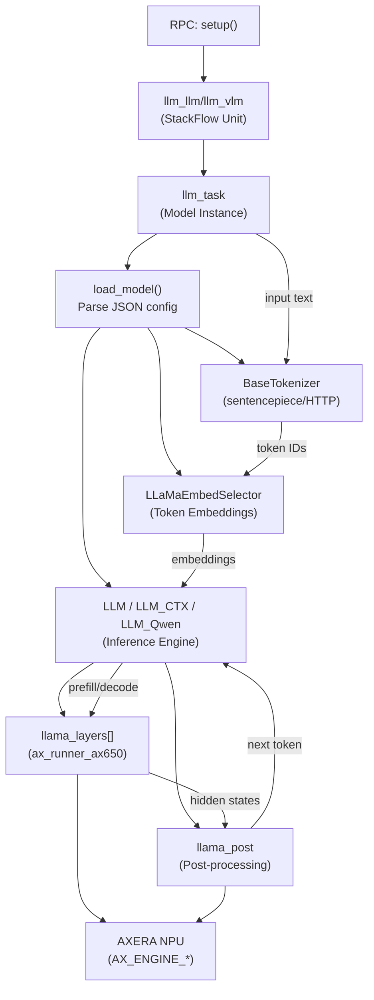
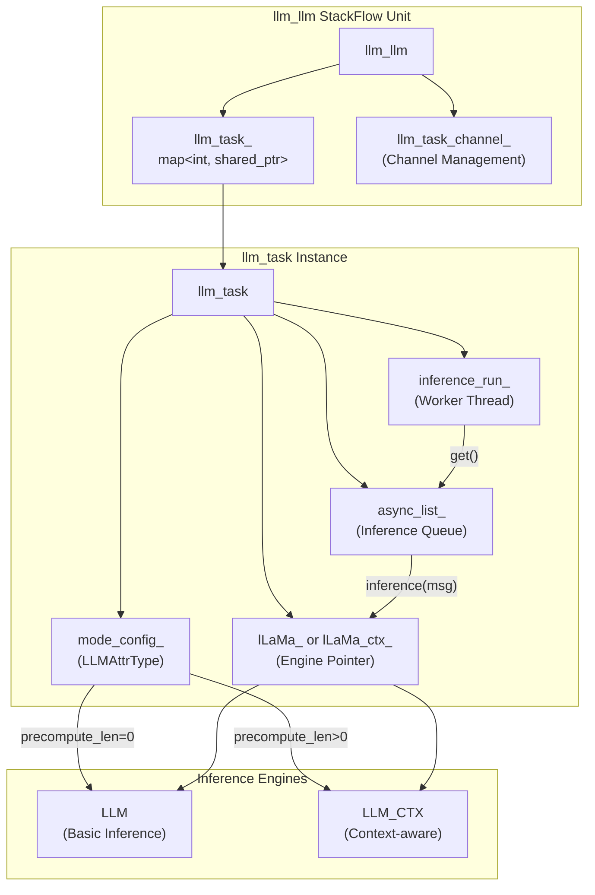
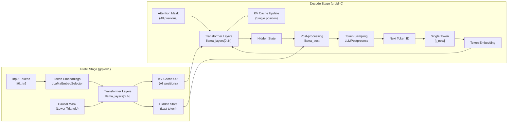
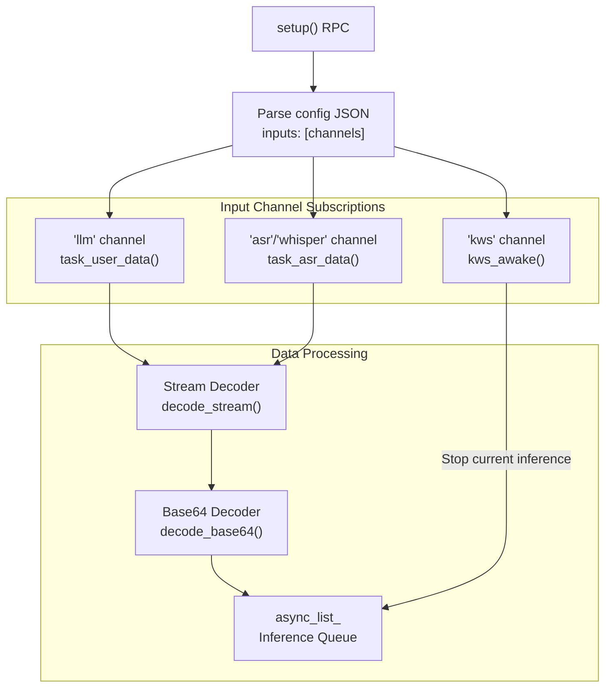
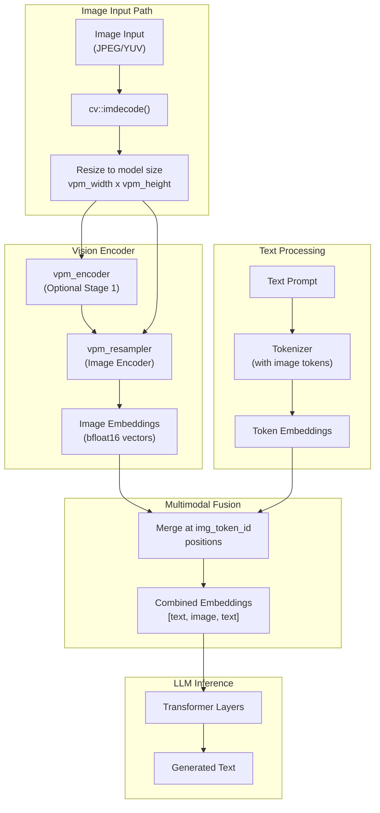
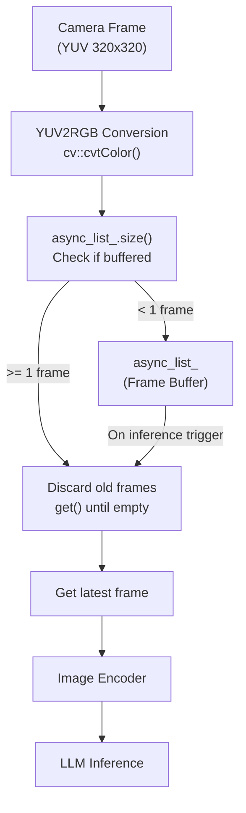
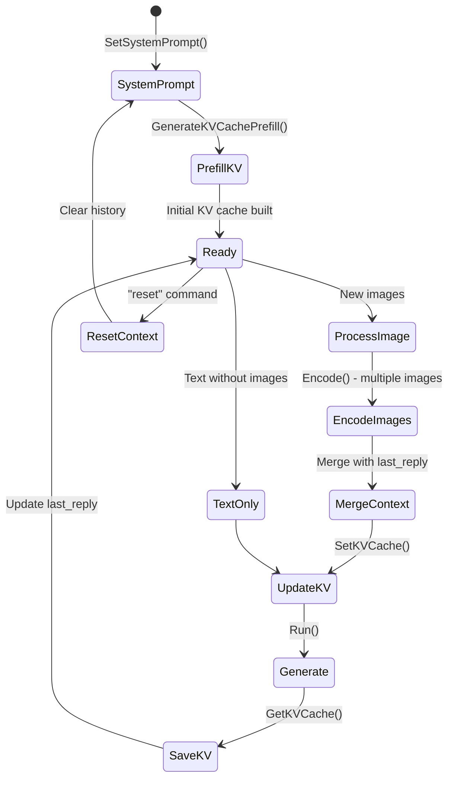
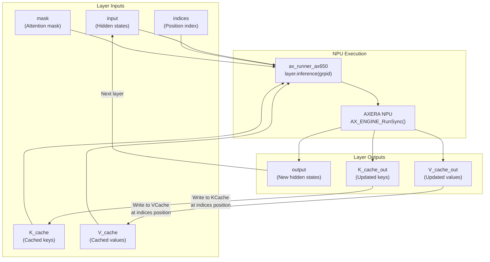
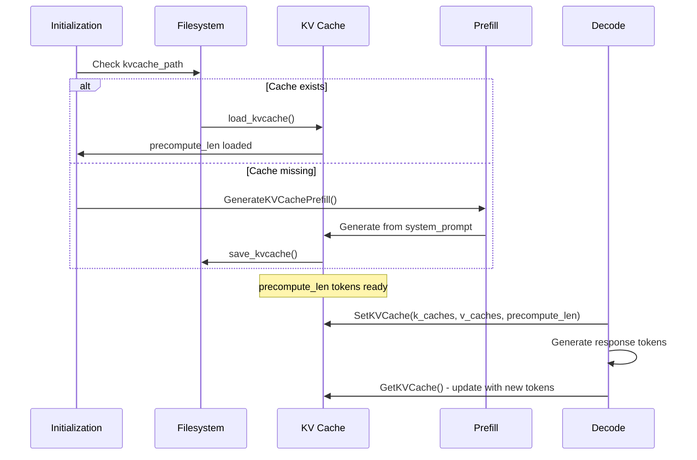
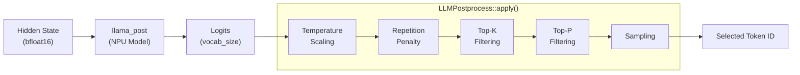

StackFlow Language Model Units

# Language Model Units

<details>
<summary>Relevant source files</summary>

The following files were used as context for generating this wiki page:

- [projects/llm_framework/main_llm/src/main.cpp](projects/llm_framework/main_llm/src/main.cpp)
- [projects/llm_framework/main_llm/src/runner/LLM.hpp](projects/llm_framework/main_llm/src/runner/LLM.hpp)
- [projects/llm_framework/main_vlm/src/main.cpp](projects/llm_framework/main_vlm/src/main.cpp)
- [projects/llm_framework/main_vlm/src/runner/LLM.hpp](projects/llm_framework/main_vlm/src/runner/LLM.hpp)
- [projects/llm_framework/main_vlm/src/runner/ax_model_runner/ax_model_runner.hpp](projects/llm_framework/main_vlm/src/runner/ax_model_runner/ax_model_runner.hpp)

</details>


This document covers the LLM and VLM inference units that perform auto-regressive language generation using transformer models accelerated by the AXERA NPU. These units provide text completion for text-only models (`llm-llm`) and multimodal capabilities for vision-language models (`llm-vlm`).

For information about model integration and the underlying NPU acceleration layer, see [Model Integration](#10.2) and [EngineWrapper and Model Execution](#5.4). For speech-to-text processing before LLM inference, see [Speech Recognition](#3.4).

## Overview and Architecture

The language model units implement transformer-based inference with two primary implementations:

| Unit | Purpose | Input Modalities | Key Classes |
|------|---------|------------------|-------------|
| `llm-llm` | Text-only LLM inference | Text (from ASR or direct input) | `llm_llm`, `llm_task`, `LLM`, `LLM_CTX` |
| `llm-vlm` | Vision-language models | Text + Images (camera or file) | `llm_vlm`, `llm_task`, `LLM`, `LLM_CTX`, `LLM_Qwen` |

Both units follow the same fundamental pattern:
1. StackFlow unit manages RPC lifecycle and message routing
2. `llm_task` instances handle model loading and inference per work_id
3. Inference engines (`LLM`, `LLM_CTX`) execute transformer layers
4. Token generation uses prefill and decode stages with KV cache optimization
5. Results stream back through callbacks

**Execution Flow: StackFlow Unit to NPU Inference**



**Sources:** [projects/llm_framework/main_llm/src/main.cpp:511-839](), [projects/llm_framework/main_vlm/src/main.cpp:640-915]()

## LLM Inference Engine (llm-llm)

### Unit Structure and Task Management

The `llm_llm` class extends `StackFlow` and manages multiple concurrent LLM instances. Each instance is represented by an `llm_task` object associated with a unique `work_id`.



**Sources:** [projects/llm_framework/main_llm/src/main.cpp:511-839](), [projects/llm_framework/main_llm/src/main.cpp:47-504]()

### Model Loading and Initialization

The `llm_task::load_model()` function parses configuration and initializes the inference engine:

1. **Configuration Parsing** - Reads JSON from `/opt/m5stack/data/models/{model_name}/` 
2. **Tokenizer Setup** - Initializes sentencepiece or HTTP-based tokenizer
3. **Embedding Table** - Loads token embeddings (bfloat16 format)
4. **Model Layers** - Loads transformer layer `.axmodel` files for NPU
5. **Post-processing** - Initializes final layer for logit computation
6. **KV Cache Strategy** - Selects `LLM` (stateless) or `LLM_CTX` (context-aware)

Key configuration parameters from `LLMAttrType`:

| Parameter | Type | Purpose |
|-----------|------|---------|
| `axmodel_num` | int | Number of transformer layers (e.g., 22 for TinyLlama) |
| `template_filename_axmodel` | string | Path template: `"model_l%d.axmodel"` |
| `filename_tokens_embed` | string | Token embedding binary file |
| `tokens_embed_num` | int | Vocabulary size (e.g., 32000) |
| `tokens_embed_size` | int | Embedding dimension (e.g., 2048) |
| `max_token_len` | int | Maximum sequence length |
| `kv_cache_num` | int | KV cache capacity |
| `precompute_len` | int | Length of precomputed KV cache (0=disabled) |
| `b_dynamic_load_axmodel_layer` | bool | Load layers on-demand vs all at init |

**Sources:** [projects/llm_framework/main_llm/src/main.cpp:125-287](), [projects/llm_framework/main_llm/src/runner/LLM.hpp:25-73]()

### Inference Pipeline: Prefill and Decode

**Two-Stage Transformer Execution**



**Prefill Stage** (Group ID = 1):
- Processes multiple input tokens in parallel
- Computes attention over all token pairs using causal mask
- Generates complete KV cache for all input positions
- Outputs hidden state for last token position

**Decode Stage** (Group ID = 0):
- Processes one token at a time
- Attends to all previous tokens using cached K/V
- Updates KV cache with new token's key/value
- Continues until EOS token or max length reached

**Sources:** [projects/llm_framework/main_llm/src/runner/LLM.hpp:287-532](), [projects/llm_framework/main_llm/src/main.cpp:339-403]()

### Token Generation and Callbacks

The inference engine uses a callback mechanism to stream generated tokens:

```cpp
mode_config_.runing_callback = [this](int *p_token, int n_token, 
                                      const char *p_str, 
                                      float token_per_sec,
                                      void *reserve) {
    if (this->out_callback_) {
        this->out_callback_(std::string(p_str), false);
    }
};
```

The `out_callback_` invokes `llm_llm::task_output()` which formats output as:
- **Stream mode** (`enstream_=true`): JSON with `{"index": N, "delta": "text", "finish": false}`
- **Complete mode** (`enstream_=false`): Full text when `finish=true`

Tokens are decoded in batches of 3+ to handle UTF-8 multi-byte characters correctly (avoiding incomplete sequences ending with 0xBD).

**Sources:** [projects/llm_framework/main_llm/src/main.cpp:234-239](), [projects/llm_framework/main_llm/src/main.cpp:520-546]()

### Input Handling and Message Routing

The `llm_llm` unit subscribes to multiple input channels configured during setup:



- **Direct input** (`llm` channel): User-provided text, supports streaming and base64 encoding
- **ASR input** (`asr`/`whisper` channel): Transcribed speech, triggers inference on `finish=true`
- **KWS wake** (`kws` channel): Stops current inference when wake word detected

**Sources:** [projects/llm_framework/main_llm/src/main.cpp:652-714](), [projects/llm_framework/main_llm/src/main.cpp:576-637]()

## Vision-Language Model Inference (llm-vlm)

### Multimodal Architecture

The `llm_vlm` unit extends LLM capabilities with vision encoding for models like InternVL and Qwen-VL. Three inference engine types are supported:

| Engine Class | Model Type | Features |
|--------------|------------|----------|
| `LLM` | InternVL (basic) | Single image, no context persistence |
| `LLM_CTX` | InternVL3 (context) | Multi-image, KV cache context management |
| `LLM_Qwen` | Qwen3-VL | Video support, spatial-temporal encoding |

**Vision-Language Processing Flow**



**Sources:** [projects/llm_framework/main_vlm/src/runner/LLM.hpp:93-649](), [projects/llm_framework/main_vlm/src/main.cpp:51-633]()

### Image Encoding Pipeline

The vision encoder processes images through these stages:

1. **Image Preprocessing** ([LLM.hpp:303-336]()):
   - Resize to `vpm_width` x `vpm_height` (e.g., 280x280 or 448x448)
   - Convert BGR to RGB
   - Copy to NPU memory buffer

2. **Two-Stage Encoding** (if `b_vpm_two_stage=true`):
   - Stage 1: `vpm_encoder` - Initial feature extraction
   - Stage 2: `vpm_resampler` - Downsample and project features

3. **Output Format** ([LLM.hpp:325-332]()):
   - Float32 outputs converted to bfloat16
   - Stored in `img_embed` vector (e.g., 256 tokens × 2048 dims)

4. **Token Injection** ([LLM.hpp:379-401]()):
   - Replace `img_token_id` positions in text embeddings
   - Maintains proper token ordering for attention mechanism

**Sources:** [projects/llm_framework/main_vlm/src/runner/LLM.hpp:303-403]()

### Camera Integration and Async Processing

For live camera input, `llm_vlm` implements a frame buffer to avoid blocking:



This ensures only the most recent frame is processed, preventing latency buildup from slow inference.

**Sources:** [projects/llm_framework/main_vlm/src/main.cpp:392-411](), [projects/llm_framework/main_vlm/src/main.cpp:790-805]()

### Context-Aware VLM (LLM_CTX)

The `LLM_CTX` engine maintains conversation context across multiple turns with images:

**Multi-Turn Conversation State**



Key methods:
- `SetSystemPrompt()` - Initialize with system instructions, tokenize to KV cache
- `Encode()` - Process images and merge with text, tracking position deltas
- `SetKVCache()` / `GetKVCache()` - Manage persistent context across turns
- `Run()` - Generate response using accumulated context

The context window is managed through `precompute_len` which tracks how many tokens are precomputed in KV cache, and `prefill_max_kv_cache_num_grp[]` which defines maximum context sizes for different prefill group IDs.

**Sources:** [projects/llm_framework/main_vlm/src/runner/LLM.hpp:652-1337](), [projects/llm_framework/main_vlm/src/main.cpp:447-506]()

### Qwen-VL Special Features

The `LLM_Qwen` class supports video input with spatial-temporal attention:

**Configuration Parameters** ([main_vlm/src/main.cpp:221-231]()):
```cpp
Config qwen_mode_config_;
  vision_config.temporal_patch_size  // Video frame sampling
  vision_config.tokens_per_second    // Temporal token rate
  vision_config.spatial_merge_size   // Spatial downsampling factor
  vision_config.patch_size           // Image patch size
  vision_config.fps                  // Target frame rate
```

**Multi-Frame Processing**:
1. `EncodeImage()` processes video frames with temporal encoding
2. Generates `deepstack_features` for cross-frame attention
3. Uses `visual_pos_mask` and `position_ids` for spatial-temporal indexing
4. Supports `b_video=true` flag for video vs image mode

**Sources:** [projects/llm_framework/main_vlm/src/main.cpp:221-231](), [projects/llm_framework/main_vlm/src/main.cpp:509-534]()

## Model Architecture and KV Cache

### Transformer Layer Execution

Each transformer layer is loaded as a separate `.axmodel` file and executed sequentially on the NPU:

**Per-Layer Inference Structure**



**Dynamic Layer Loading**: When `b_dynamic_load_axmodel_layer=true`, layers are loaded/unloaded on-demand using `MMap` or in-memory buffers to reduce memory usage.

**Sources:** [projects/llm_framework/main_llm/src/runner/LLM.hpp:414-469](), [projects/llm_framework/main_llm/src/runner/LLM.hpp:82-87]()

### KV Cache Management Strategies

The KV cache stores key and value vectors from previous tokens to avoid recomputation during auto-regressive decoding.

**Cache Dimensions**:
- `kv_cache_num`: Maximum context window (e.g., 1024 tokens)
- `kv_cache_size`: Vector size per token (e.g., 256)
- `axmodel_num`: Number of layers (e.g., 22)
- **Total memory**: `axmodel_num × kv_cache_num × kv_cache_size × 2 bytes × 2 (K+V)`

**Storage Organization**:
```
k_caches[layer_id][position * kv_cache_size : (position+1) * kv_cache_size]
v_caches[layer_id][position * kv_cache_size : (position+1) * kv_cache_size]
```

**Update During Decode** ([LLM.hpp:451-459]()):
```cpp
// Copy new K/V to cache at current position
memcpy(input_k_cache_ptr + indices * kv_cache_size, 
       output_k_cache.pVirAddr,
       sizeof(unsigned short) * kv_cache_size);
```

**Sources:** [projects/llm_framework/main_llm/src/runner/LLM.hpp:193-203](), [projects/llm_framework/main_llm/src/runner/LLM.hpp:451-459]()

### Prefill Groups and Context Window Scaling

The `LLM_CTX` engine supports multiple prefill group configurations for flexible context windows:

**Prefill Group Structure**

| Attribute | Description |
|-----------|-------------|
| `prefill_grpid` | Active prefill group (1, 2, 3, ...) |
| `prefill_token_num` | Tokens per prefill batch (e.g., 96) |
| `prefill_max_kv_cache_num_grp[]` | Max KV cache per group (e.g., [128, 256, 512]) |
| `prefill_max_token_num` | Largest supported context |

**Dynamic Group Selection** ([LLM.hpp:721-730]()):
```cpp
for (size_t i = 0; i < prefill_max_kv_cache_num_grp.size(); i++) {
    if (input_embed_num <= prefill_max_kv_cache_num_grp[i]) {
        prefill_grpid = i + 1;
        break;
    }
}
```

Smaller groups use less memory and allow faster prefill for short contexts. The system automatically selects the smallest group that fits the input.

**Sources:** [projects/llm_framework/main_llm/src/runner/LLM.hpp:638-648](), [projects/llm_framework/main_llm/src/runner/LLM.hpp:721-730]()

### KV Cache Persistence and Precomputation

The `LLM_CTX` engine can save/load KV cache to disk for system prompts:

**Cache Lifecycle**



**Persistence Format** ([LLM.hpp:1052-1068]()):
- Files: `{path}/k_cache_{layer}.bin`, `{path}/v_cache_{layer}.bin`
- Metadata: `{path}/meta.json` with `system_prompt` and `precompute_len`
- Benefits: Skip system prompt processing on subsequent runs

**Sources:** [projects/llm_framework/main_llm/src/runner/LLM.hpp:1052-1123](), [projects/llm_framework/main_llm/src/main.cpp:259-281]()

## Sampling and Post-Processing

### Token Sampling Pipeline

After each decode step, the final hidden state passes through a post-processing model and sampling strategy:

**Post-Processing Chain**



**Sampling Parameters** (from `LLMAttrType` and `LLMPostprocess`):

| Parameter | Default | Effect |
|-----------|---------|--------|
| `enable_temperature` | false | Enable temperature scaling |
| `temperature` | 0.7 | Higher = more random (0.1-2.0) |
| `enable_top_k_sampling` | true | Enable top-K filtering |
| `top_k` | 10 | Keep top K most likely tokens |
| `enable_top_p_sampling` | false | Enable nucleus sampling |
| `top_p` | 0.7 | Cumulative probability threshold |
| `enable_repetition_penalty` | false | Penalize repeated tokens |
| `repetition_penalty` | 1.2 | Penalty factor (>1.0) |
| `penalty_window` | 50 | How many recent tokens to check |

**Sources:** [projects/llm_framework/main_llm/src/runner/LLM.hpp:102-112](), [projects/llm_framework/main_llm/src/runner/LLM.hpp:212-233]()

### Bfloat16 Conversion and Logit Processing

The NPU outputs in bfloat16 format (16-bit brain floating point), which requires conversion:

```cpp
static int post_process(LLMPostprocess &postprocess, 
                       unsigned short *p, int n, 
                       std::vector<int> &history,
                       float *val = 0) {
    std::vector<float> logits(n);
    for (int i = 0; i < n; i++) {
        unsigned int proc = p[i] << 16;  // Shift to float32 position
        logits[i] = *reinterpret_cast<float *>(&proc);
    }
    return postprocess.apply(logits, history);
}
```

This converts the 16-bit bfloat16 values (sign:1, exp:8, mantissa:7) to 32-bit float32 (sign:1, exp:8, mantissa:23) by left-shifting 16 bits.

**Sources:** [projects/llm_framework/main_llm/src/runner/LLM.hpp:102-112]()

### EOS Detection and Generation Control

Token generation continues until one of these conditions:

1. **EOS Token**: `tokenizer->isEnd(token_id)` returns true
2. **Max Length**: `indices >= max_token_len`
3. **Stop Signal**: `b_stop = true` (set by `Stop()` method)

The `b_stop` flag enables external interruption (e.g., from KWS wake word detection):

```cpp
void kws_awake(...) {
    if (llm_task_obj->lLaMa_) llm_task_obj->lLaMa_->Stop();
    if (llm_task_obj->lLaMa_ctx_) llm_task_obj->lLaMa_ctx_->Stop();
}
```

**Sources:** [projects/llm_framework/main_llm/src/runner/LLM.hpp:487-498](), [projects/llm_framework/main_llm/src/main.cpp:639-650]()

## Configuration and Runtime Parameters

### Model Configuration JSON Structure

Each model has a configuration file at `/opt/m5stack/data/models/{model_name}/config.json`:

```json
{
  "mode_param": {
    "system_prompt": "You are a helpful assistant.",
    "tokenizer_type": "TKT_HTTP",
    "filename_tokenizer_model": "tokenizer.model",
    "filename_tokens_embed": "embed_tokens.weight.bfloat16.bin",
    "template_filename_axmodel": "model_l%d.axmodel",
    "filename_post_axmodel": "model_post.axmodel",
    "axmodel_num": 22,
    "tokens_embed_num": 32000,
    "tokens_embed_size": 2048,
    "max_token_len": 127,
    "precompute_len": 0,
    "enable_temperature": false,
    "temperature": 0.7,
    "top_k": 10,
    "b_dynamic_load_axmodel_layer": false,
    "b_use_mmap_load_embed": false
  }
}
```

The `CONFIG_AUTO_SET` macro merges runtime parameters with file defaults:

```cpp
#define CONFIG_AUTO_SET(obj, key) \
    if (config_body.contains(#key)) \
        mode_config_.key = config_body[#key]; \
    else if (obj.contains(#key)) \
        mode_config_.key = obj[#key];
```

**Sources:** [projects/llm_framework/main_llm/src/main.cpp:152-176](), [projects/llm_framework/main_llm/src/main.cpp:41-45]()

### VLM-Specific Configuration

Vision-language models add these parameters:

| Parameter | Purpose | Example Value |
|-----------|---------|---------------|
| `filename_image_encoder_axmodel` | Vision encoder model | `"vpm_resampler.axmodel"` |
| `vpm_width`, `vpm_height` | Input image size | 280 |
| `b_vpm_two_stage` | Use two-stage encoding | false |
| `img_token_id` | Image placeholder token | 151667 |
| `IMAGE_CONTEXT_TOKEN` | Context marker | 151667 |
| `IMAGE_START_TOKEN` | Start marker | 151665 |

For Qwen-VL:
- `vision_config.temporal_patch_size`
- `vision_config.spatial_merge_size`
- `vision_config.fps`
- `image_token_id`, `video_token_id`, `vision_start_token_id`

**Sources:** [projects/llm_framework/main_vlm/src/main.cpp:188-231]()

### HTTP Tokenizer Server

For complex tokenizers (e.g., Qwen chat templates), the system spawns a Python HTTP server:

**Tokenizer Server Initialization** ([main_vlm/src/main.cpp:245-267]()):
1. Check if `filename_tokenizer_model` or `url_tokenizer_model` contains "http"
2. Fork Python process running `/opt/m5stack/scripts/{model}_tokenizer.py`
3. Server listens on `localhost:{port}` (8090-8099 range)
4. Tokenizer queries server for encoding/decoding

This allows using HuggingFace tokenizers without C++ dependencies.

**Sources:** [projects/llm_framework/main_vlm/src/main.cpp:245-284](), [projects/llm_framework/main_llm/src/main.cpp:177-230]()

### Setup Request Format

To initialize an LLM instance via RPC:

```json
{
  "action": "setup",
  "work_id": "llm.0",
  "data": {
    "model": "tinyllama-1.1b-chat-int8",
    "prompt": "You are a helpful assistant.",
    "response_format": "llm.utf-8.stream",
    "enoutput": true,
    "input": ["asr.utf-8.stream", "kws.bool"]
  }
}
```

Key fields:
- `model`: Model directory name under `/opt/m5stack/data/models/`
- `prompt`: System prompt (overrides config file)
- `response_format`: Output channel name (`.stream` for token-by-token)
- `enoutput`: Enable output publishing
- `input`: List of input channels to subscribe to

**Sources:** [projects/llm_framework/main_llm/src/main.cpp:652-714]()