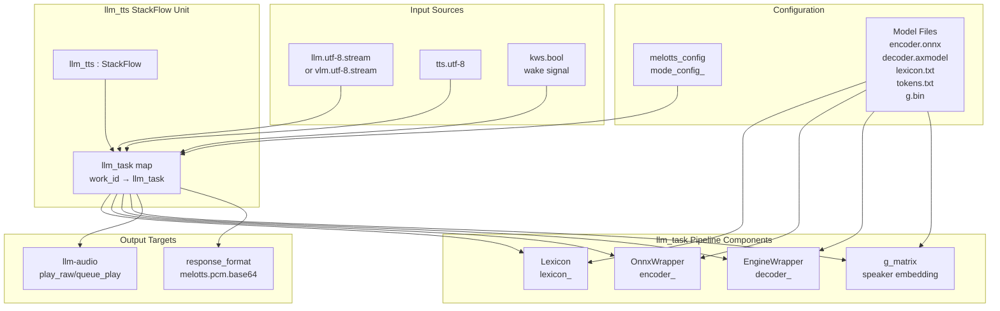
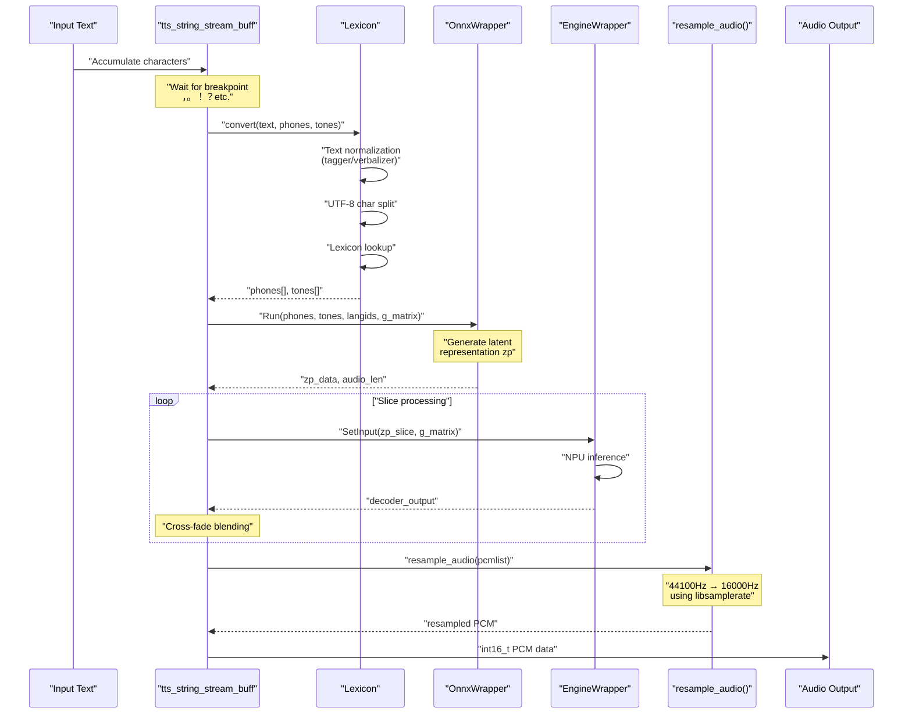
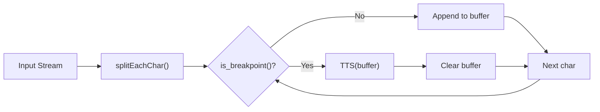
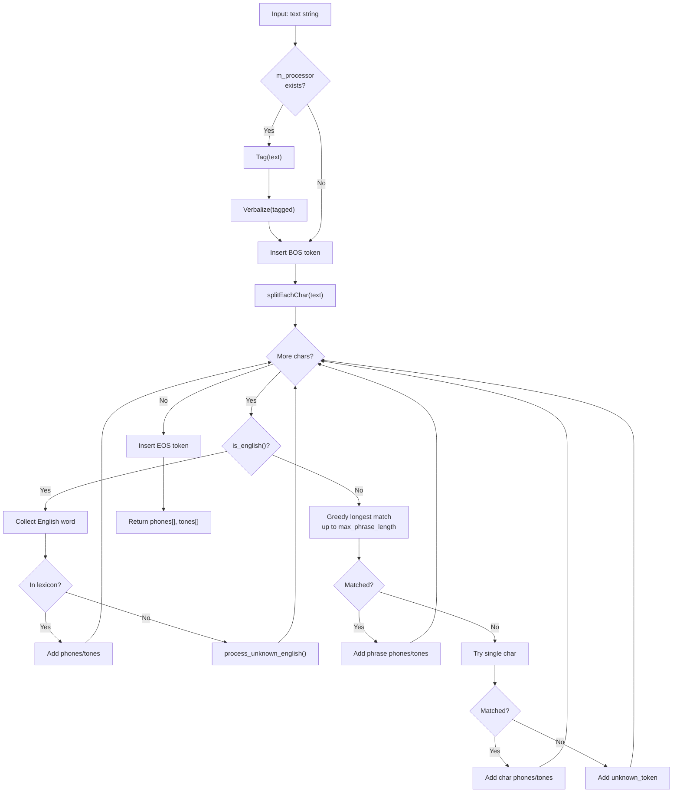
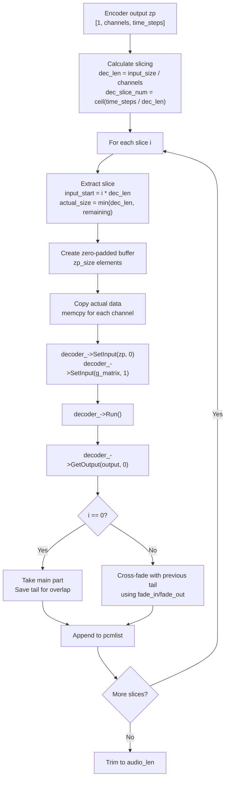
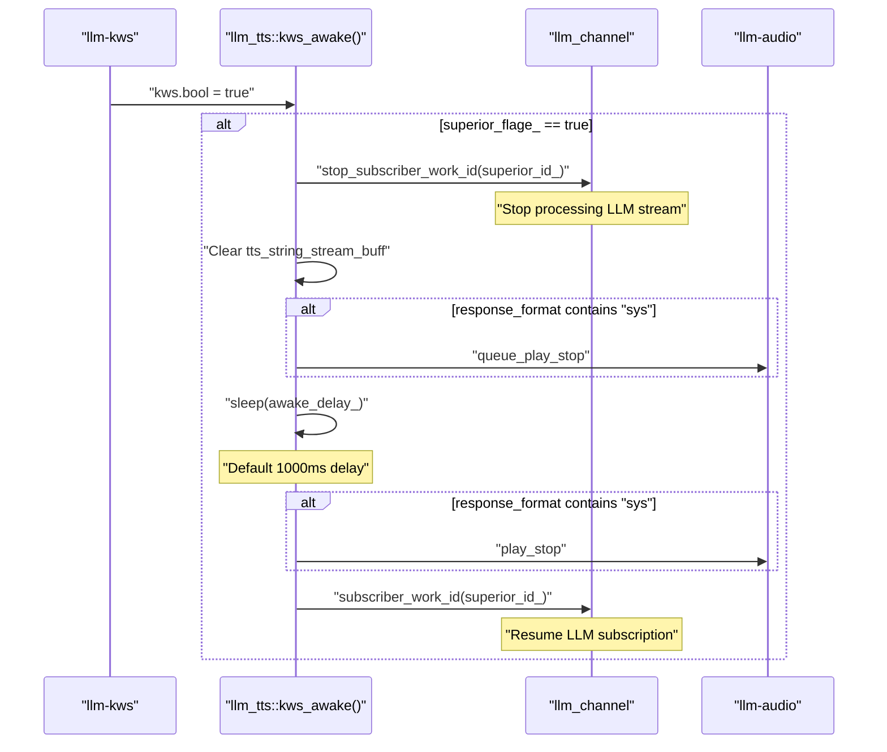
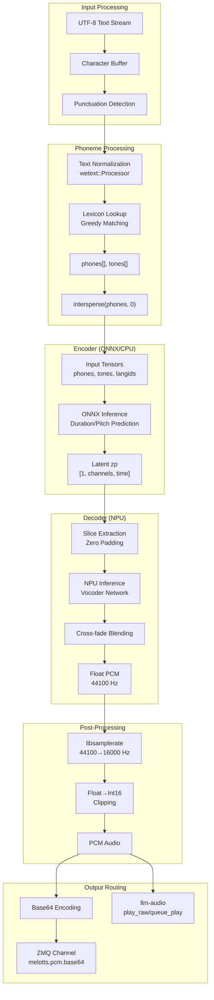

StackFlow MeloTTS (llm-melotts)

# MeloTTS (llm-melotts)

<details>
<summary>Relevant source files</summary>

The following files were used as context for generating this wiki page:

- [projects/llm_framework/main/src/main.cpp](projects/llm_framework/main/src/main.cpp)
- [projects/llm_framework/main_melotts/src/main.cpp](projects/llm_framework/main_melotts/src/main.cpp)
- [projects/llm_framework/main_melotts/src/runner/Lexicon.hpp](projects/llm_framework/main_melotts/src/runner/Lexicon.hpp)
- [projects/llm_framework/main_tts/src/main.cpp](projects/llm_framework/main_tts/src/main.cpp)

</details>


## Purpose and Scope

The `llm-melotts` unit implements a neural text-to-speech (TTS) system accelerated by the AXERA NPU. This unit converts UTF-8 text input into PCM audio output using a two-stage pipeline: an ONNX-based encoder for phoneme processing and an NPU-accelerated decoder for waveform synthesis. The implementation supports multi-language lexicon-based phoneme conversion, streaming output, and integration with the voice assistant pipeline.

For CPU-based TTS without NPU acceleration, see [Traditional TTS (llm-tts)](#3.5.2). For advanced neural TTS with LLM-based token generation, see [CosyVoice (llm-cosy-voice)](#3.5.3).

## System Architecture

The `llm-melotts` unit consists of two primary C++ classes: `llm_task` which encapsulates the TTS inference pipeline, and `llm_tts` which extends `StackFlow` to provide RPC interfaces and message handling.



Sources: [projects/llm_framework/main_melotts/src/main.cpp:525-860]()

## Core Classes and Responsibilities

### llm_tts Class

The `llm_tts` class inherits from `StackFlow` and implements the standard RPC interface:

| RPC Function | Purpose | Implementation |
|--------------|---------|----------------|
| `setup()` | Initialize model, create `llm_task`, configure subscribers | [main.cpp:669-731]() |
| `link()` | Dynamically add input subscriptions | [main.cpp:733-770]() |
| `unlink()` | Remove input subscriptions | [main.cpp:772-798]() |
| `taskinfo()` | Query task configuration and active inputs | [main.cpp:800-825]() |
| `exit()` | Stop task and cleanup resources | [main.cpp:827-845]() |

The class maintains a mapping of work IDs to `llm_task` instances in `llm_task_` and uses weak pointers in callbacks to safely handle task lifecycle.

Sources: [projects/llm_framework/main_melotts/src/main.cpp:525-860]()

### llm_task Class

The `llm_task` class encapsulates the complete TTS pipeline and model management:

| Member | Type | Purpose |
|--------|------|---------|
| `encoder_` | `std::unique_ptr<OnnxWrapper>` | ONNX runtime for phoneme encoding |
| `decoder_` | `std::unique_ptr<EngineWrapper>` | NPU accelerator for waveform decoding |
| `lexicon_` | `std::unique_ptr<Lexicon>` | Text-to-phoneme converter |
| `g_matrix` | `std::vector<float>` | 256-dimensional speaker embedding |
| `mode_config_` | `melotts_config` | Model hyperparameters |
| `tts_string_stream_buff` | `std::string` | Accumulator for streaming text |

Sources: [projects/llm_framework/main_melotts/src/main.cpp:72-521]()

## Text-to-Speech Pipeline

### Pipeline Stages

The complete TTS process follows this sequence:



Sources: [projects/llm_framework/main_melotts/src/main.cpp:256-460]()

### Streaming Text Processing

The `task_user_data()` method implements sentence-based streaming:

1. **Character Accumulation**: UTF-8 characters are accumulated in `tts_string_stream_buff`
2. **Breakpoint Detection**: Punctuation marks trigger synthesis: `，、,.。.!！?？;；`
3. **Synthesis Trigger**: When a breakpoint is detected, the buffered text is synthesized
4. **Buffer Clear**: After synthesis, the buffer is cleared for the next sentence



This approach balances latency with naturalness by synthesizing at sentence boundaries rather than per-character.

Sources: [projects/llm_framework/main_melotts/src/main.cpp:580-641]()

## Lexicon-Based Phoneme Conversion

### Lexicon Class Architecture

The `Lexicon` class converts text to phoneme and tone sequences using dictionary lookup with fallback strategies:

| Component | Purpose | File Location |
|-----------|---------|---------------|
| `lexicon` | Map of words/phrases to (phones, tones) pairs | [Lexicon.hpp:28]() |
| `reverse_tokens` | Phone ID to string mapping for debugging | [Lexicon.hpp:31]() |
| `m_processor` | WeText processor for text normalization | [Lexicon.hpp:33]() |
| `max_phrase_length` | Longest dictionary entry for greedy matching | [Lexicon.hpp:29]() |

The class supports two initialization modes:

```cpp
// With text normalization (tagger + verbalizer)
Lexicon(lexicon_filename, tokens_filename, tagger_filename, verbalizer_filename)

// Without text normalization (basic lexicon only)
Lexicon(lexicon_filename, tokens_filename)
```

Sources: [projects/llm_framework/main_melotts/src/runner/Lexicon.hpp:36-156]()

### Conversion Algorithm

The `convert()` method implements a greedy longest-match algorithm with multi-language support:



Sources: [projects/llm_framework/main_melotts/src/runner/Lexicon.hpp:253-350]()

### Unknown English Word Handling

For English words not in the lexicon, `process_unknown_english()` performs syllable decomposition:

1. **Substring Search**: Try substrings up to 10 characters in decreasing length
2. **Lowercase Conversion**: Case-insensitive matching
3. **Fallback**: Single character lookup if no substring matches
4. **Unknown Token**: Insert `_` token for unmatchable characters

This enables partial pronunciation of technical terms or proper nouns.

Sources: [projects/llm_framework/main_melotts/src/runner/Lexicon.hpp:192-251]()

## Encoder Stage (ONNX)

The encoder converts phoneme sequences to latent representations:

### Input Preparation

Before encoding, the phoneme and tone sequences are processed with `intersperse()` to insert blank tokens between each phoneme:

```cpp
// [p1, p2, p3] → [0, p1, 0, p2, 0, p3, 0]
auto phones = intersperse(phones_bef, 0);
auto tones = intersperse(tones_bef, 0);
```

Language IDs are set to a fixed value (3 for Chinese models) for all positions.

Sources: [projects/llm_framework/main_melotts/src/main.cpp:300-305]()

### Encoder Execution

The `OnnxWrapper::Run()` method is called with synthesis parameters:

| Parameter | Description | Configuration Field |
|-----------|-------------|---------------------|
| `phones` | Interspersed phoneme IDs | From lexicon conversion |
| `tones` | Interspersed tone values | From lexicon conversion |
| `langids` | Language identifiers | Fixed vector of 3 |
| `g_matrix` | Speaker embedding | Loaded from `.gbin` file |
| `noise_scale` | Stochastic variation | `mode_config_.noise_scale` (0.3) |
| `noise_scale_w` | Duration variation | `mode_config_.noise_scale_w` (0.6) |
| `length_scale` | Speech rate adjustment | `length_scale / spacker_speed` |
| `sdp_ratio` | Stochastic duration predictor ratio | `mode_config_.sdp_ratio` (0.2) |

The encoder outputs a latent representation tensor `zp` with shape `[batch, channels, time]`.

Sources: [projects/llm_framework/main_melotts/src/main.cpp:307-313]()

## Decoder Stage (NPU)

### Slice-Based Processing

The decoder processes the latent representation in slices to accommodate memory constraints:



Sources: [projects/llm_framework/main_melotts/src/main.cpp:315-418]()

### Cross-Fade Blending

To avoid artifacts at slice boundaries, overlapping regions use cross-fade blending:

| Constant | Value | Purpose |
|----------|-------|---------|
| `overlap_size` | 1024 samples | Overlap between consecutive slices |
| `fade_size` | 512 samples | Length of fade transition |

The blending formula:
```cpp
blended_region[j] = previous_tail[j] * fade_out[j] + decoder_output[j] * fade_in[j]
```

Where `fade_in[j] = j / fade_size` and `fade_out[j] = 1.0 - j / fade_size`.

Sources: [projects/llm_framework/main_melotts/src/main.cpp:319-413]()

## Audio Post-Processing

### Resampling

The decoder outputs audio at the model's native rate (typically 44100 Hz), which is resampled to the target rate (16000 Hz) using libsamplerate:

```cpp
void resample_audio(float *input_buffer, int input_length, 
                    float *output_buffer, int *output_length,
                    double src_ratio)
{
    SRC_STATE *src_state = src_new(SRC_SINC_FASTEST, 1, &error);
    SRC_DATA src_data;
    src_data.data_in = input_buffer;
    src_data.input_frames = input_length;
    src_data.src_ratio = src_ratio;
    src_process(src_state, &src_data);
    *output_length = src_data.output_frames_gen;
    src_delete(src_state);
}
```

The `src_ratio` is calculated as `audio_rate / mode_rate` (e.g., 16000 / 44100 = 0.363).

Sources: [projects/llm_framework/main_melotts/src/main.cpp:229-254](), [main.cpp:431-435]()

### Quantization and Clipping

Float samples are converted to 16-bit PCM with clipping:

```cpp
for (int i = 0; i < len; i++) {
    float val = tmp_pcm[i];
    if (std::abs(val) > 0.95f) {
        val = val > 0 ? 0.95f : -0.95f;  // Clip to prevent distortion
    }
    wav_pcm_data.push_back(static_cast<int16_t>(val * INT16_MAX));
}
```

Sources: [projects/llm_framework/main_melotts/src/main.cpp:437-444]()

## Configuration and Model Loading

### Configuration Structure

The `melotts_config` structure defines model and synthesis parameters:

```cpp
typedef struct {
    std::string encoder;      // Path to encoder.onnx
    std::string decoder;      // Path to decoder.axmodel
    std::string lexicon;      // Path to lexicon.txt
    std::string tokens;       // Path to tokens.txt
    std::string gbin;         // Path to g.bin (speaker embedding)
    std::string tagger;       // Path to tagger model (optional)
    std::string verbalizer;   // Path to verbalizer model (optional)
    float spacker_speed = 1.0;
    int mode_rate = 44100;    // Model output sample rate
    int audio_rate = 16000;   // Target output sample rate
    int spacker_role = 0;
    float noise_scale = 0.3f;
    float length_scale = 1.0;
    float noise_scale_w = 0.6f;
    float sdp_ratio = 0.2f;
} melotts_config;
```

Sources: [projects/llm_framework/main_melotts/src/main.cpp:39-62]()

### Model Loading Sequence

The `load_model()` method follows this sequence:

1. **Parse Setup Config**: Extract `model`, `response_format`, `enoutput`, `input` from JSON
2. **Locate Config File**: Search for model-specific JSON in standard paths
3. **Load Parameters**: Read model paths and hyperparameters using `CONFIG_AUTO_SET` macro
4. **Prepend Base Path**: Construct full paths: `base_model_path + model + "/" + filename`
5. **Load Lexicon**: Initialize with tokens, lexicon, and optionally tagger/verbalizer
6. **Load Speaker Embedding**: Read 256 floats from `.gbin` file into `g_matrix`
7. **Initialize Encoder**: Call `encoder_->Init(encoder_path)`
8. **Initialize Decoder**: Call `decoder_->Init(decoder_path)`

Sources: [projects/llm_framework/main_melotts/src/main.cpp:131-222]()

### NPU Initialization

The decoder requires Axera NPU initialization:

```cpp
void _ax_init() {
    if (!ax_init_flage_) {
        AX_SYS_Init();
        AX_ENGINE_NPU_ATTR_T npu_attr;
        memset(&npu_attr, 0, sizeof(npu_attr));
        AX_ENGINE_Init(&npu_attr);
    }
    ax_init_flage_++;
}
```

Reference counting ensures NPU resources are only initialized once across multiple tasks.

Sources: [projects/llm_framework/main_melotts/src/main.cpp:473-488]()

## Integration Patterns

### Input Subscription Patterns

The unit supports three input patterns configured via the `input` field:

| Input Pattern | Behavior | Use Case |
|--------------|----------|----------|
| `"llm.utf-8.stream"` or `"vlm.utf-8.stream"` | Subscribe to LLM/VLM output, enable wake word interruption | Voice assistant pipeline |
| `"tts.utf-8"` | Subscribe to any TTS input without wake word logic | Direct TTS service |
| `"kws.bool"` | Subscribe to wake word events for playback interruption | Responsive interaction |

The `superior_id_` and `superior_flage_` mechanism enables interrupt handling:

```cpp
if ((input.find("llm") != std::string::npos) || 
    (input.find("vlm") != std::string::npos)) {
    llm_task_obj->superior_id_ = input;
    llm_task_obj->superior_flage_ = true;
}
```

Sources: [projects/llm_framework/main_melotts/src/main.cpp:700-718]()

### Wake Word Interrupt Handling

The `kws_awake()` callback implements playback interruption:



Sources: [projects/llm_framework/main_melotts/src/main.cpp:643-667]()

### Audio Output Routing

The `task_output()` callback handles dual output modes:

1. **Channel Output**: Send base64-encoded PCM to subscribed clients via ZMQ
2. **System Audio**: If `response_format` contains `"sys"`, call `unit_call("audio", "play_raw", data)`

Platform-specific handling:
- **AX620E/AX620Q**: Use `queue_play` for queued playback
- **Other platforms**: Use `play_raw` with audio capture suspension

```cpp
if (llm_task_obj->response_format_.find("sys") != std::string::npos) {
#if defined(CONFIG_AX_620E_MSP_ENABLED) || defined(CONFIG_AX_620Q_MSP_ENABLED)
    unit_call("audio", "queue_play", data);
#else
    unit_call("audio", "play_raw", data);
#endif
}
```

Sources: [projects/llm_framework/main_melotts/src/main.cpp:536-569]()

### Audio Capture Suspension

On non-620E/Q platforms, audio capture is suspended during TTS playback to prevent feedback:

```cpp
std::string initial_status = unit_call("audio", "audio_status", "sys");
if (!cap_ && initial_status.find("\"cap\":\"Running\"") != std::string::npos) {
    unit_call("audio", "cap_stop_all", "sys");
    cap_ = true;
}
```

After synthesis completion, the system polls `audio_status` until playback finishes, then resumes capture:

```cpp
for (int i = 0; i < 100; ++i) {
    std::string current_status = unit_call("audio", "audio_status", "sys");
    if (current_status.find("\"play\":\"None\"") != std::string::npos) {
        none_count++;
        if (none_count >= 5) break;
    }
    std::this_thread::sleep_for(std::chrono::milliseconds(100));
}
if (cap_) unit_call("audio", "cap", "sys");
```

Sources: [projects/llm_framework/main_melotts/src/main.cpp:261-294]()

## Data Flow Summary

The complete data flow from text to audio:



Sources: [projects/llm_framework/main_melotts/src/main.cpp:256-569](), [projects/llm_framework/main_melotts/src/runner/Lexicon.hpp:253-350]()