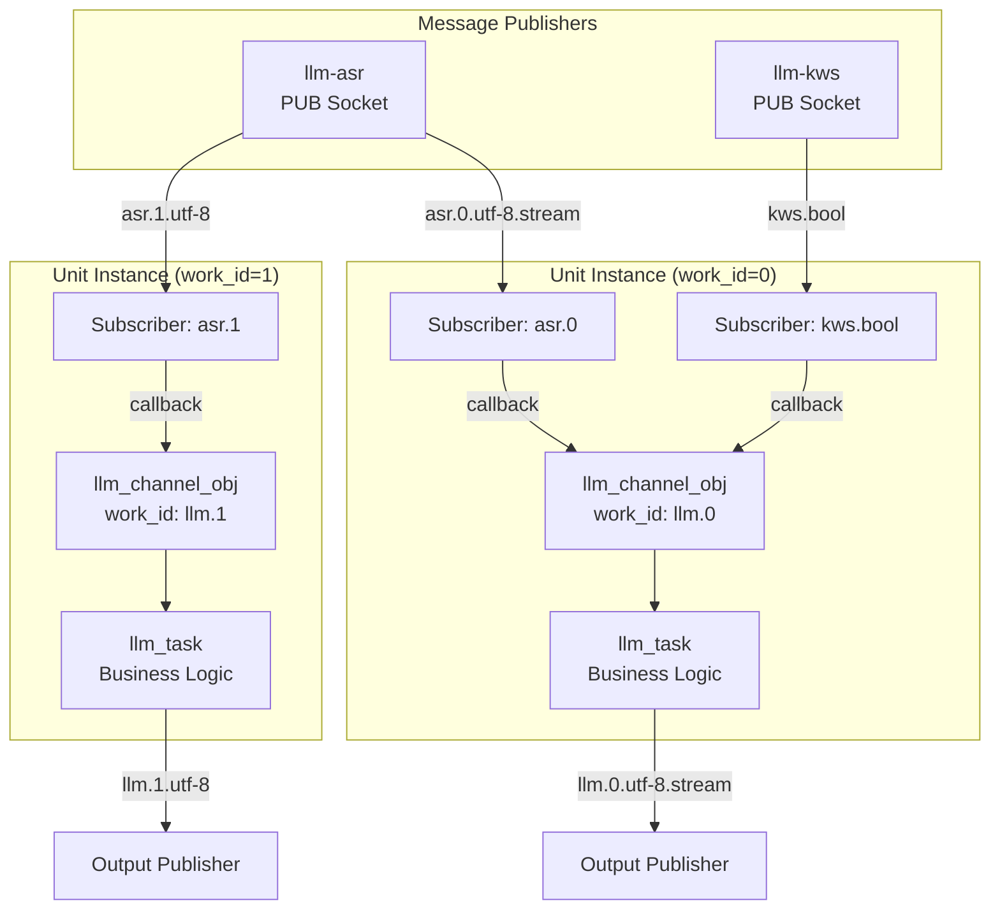
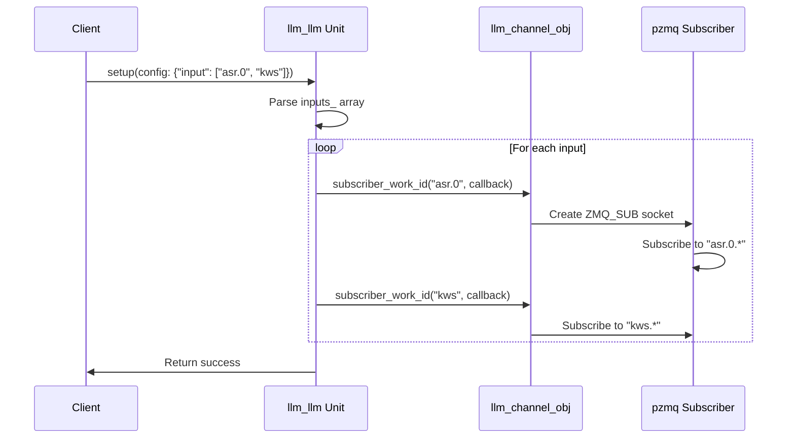
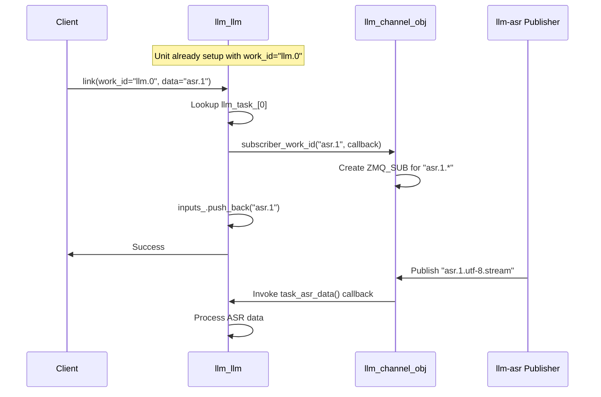
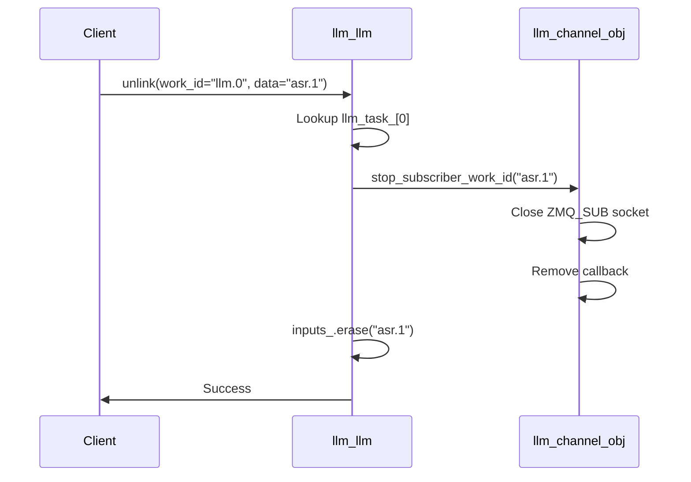
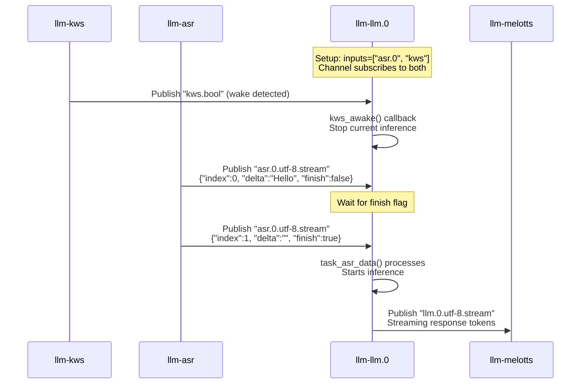
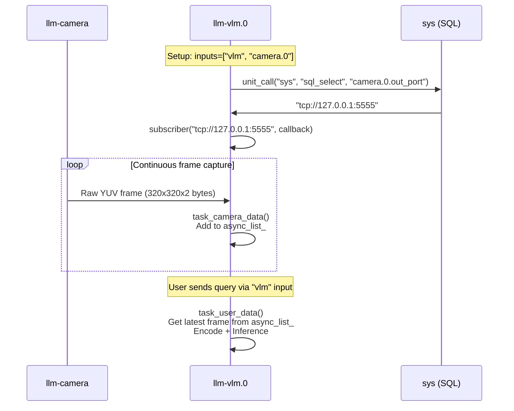
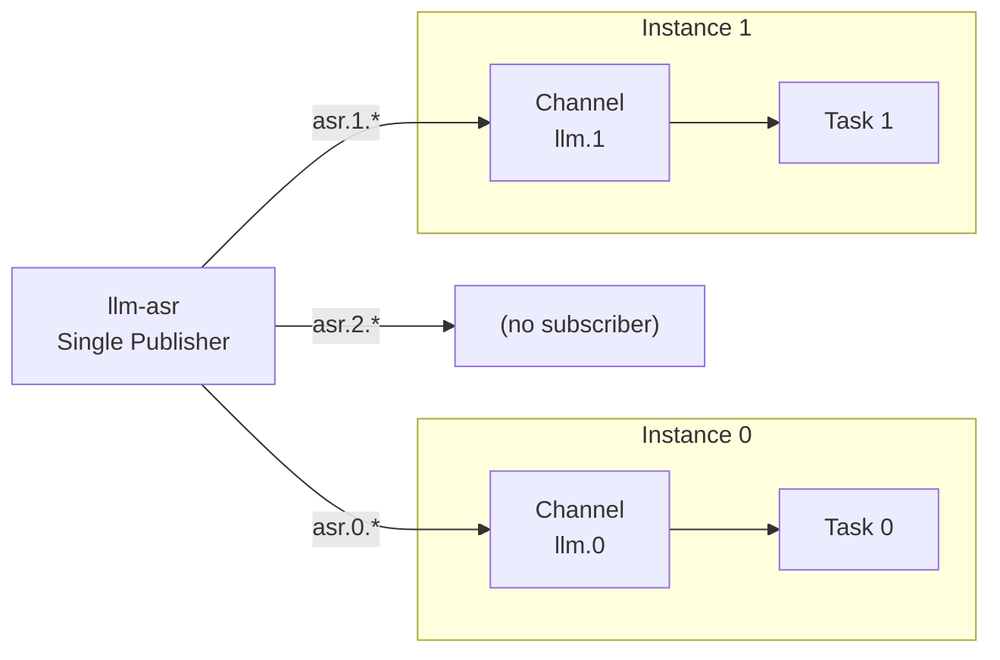

StackFlow Message Channels and Linking

# Message Channels and Linking

<details>
<summary>Relevant source files</summary>

The following files were used as context for generating this wiki page:

- [ext_components/StackFlow/stackflow/pzmq.hpp](ext_components/StackFlow/stackflow/pzmq.hpp)
- [ext_components/ax_msp/Kconfig](ext_components/ax_msp/Kconfig)
- [projects/llm_framework/SConstruct](projects/llm_framework/SConstruct)
- [projects/llm_framework/config_defaults.mk](projects/llm_framework/config_defaults.mk)
- [projects/llm_framework/main_llm/src/main.cpp](projects/llm_framework/main_llm/src/main.cpp)
- [projects/llm_framework/main_llm/src/runner/LLM.hpp](projects/llm_framework/main_llm/src/runner/LLM.hpp)
- [projects/llm_framework/main_vlm/src/main.cpp](projects/llm_framework/main_vlm/src/main.cpp)
- [projects/llm_framework/main_vlm/src/runner/LLM.hpp](projects/llm_framework/main_vlm/src/runner/LLM.hpp)
- [projects/llm_framework/main_vlm/src/runner/ax_model_runner/ax_model_runner.hpp](projects/llm_framework/main_vlm/src/runner/ax_model_runner/ax_model_runner.hpp)

</details>


## Purpose and Scope

This page documents the message channel infrastructure and dynamic linking mechanism in StackFlow. Each unit instance maintains an `llm_channel_obj` that manages message subscriptions and routes incoming data from other units. The linking system allows units to dynamically connect and disconnect from data sources at runtime through RPC commands.

For information about the underlying ZMQ communication layer, see [StackFlow and pzmq Communication](#2.1). For unit lifecycle management and RPC registration, see [RPC and Unit Management](#2.3).

---

## Channel Architecture Overview

Every unit instance (identified by a `work_id`) has an associated `llm_channel_obj` that acts as its message router. Channels enable:

1. **Topic-based filtering**: Subscribe to specific message types (e.g., "asr.0", "kws.bool")
2. **Work ID routing**: Route messages to the correct unit instance
3. **Callback registration**: Attach handlers for different input sources
4. **Output configuration**: Control whether the unit produces output and in what format



**Sources:** [projects/llm_framework/main_llm/src/main.cpp:685-702](), [projects/llm_framework/main_vlm/src/main.cpp:840-869]()

---

## The llm_channel_obj Class

### Core Responsibilities

The `llm_channel_obj` class (defined in the StackFlow base) manages per-unit message routing:

| Property | Type | Purpose |
|----------|------|---------|
| `work_id_` | `std::string` | Unique identifier (e.g., "llm.0", "asr.1") |
| `enoutput_` | `bool` | Whether unit publishes output messages |
| `enstream_` | `bool` | Output format: streaming or complete |
| Subscriber map | Internal | Maps topics to callback functions |

### Channel Lifecycle

Channels are created during unit setup and stored in `llm_task_channel_`:

```
setup() called with work_id="llm.0"
  ↓
get_channel("llm.0") creates llm_channel_obj
  ↓
llm_task_channel_[0] = channel
  ↓
Configure output: set_output(true), set_stream(false)
```

**Sources:** [projects/llm_framework/main_llm/src/main.cpp:662-679]()

---

## Work ID-Based Message Routing

### Topic Naming Convention

Messages in StackFlow follow a hierarchical naming scheme:

```
<unit_name>.<work_id>.<data_type>.<format>
```

Examples:
- `asr.0.utf-8.stream` - ASR unit instance 0, UTF-8 text, streaming format
- `kws.bool` - KWS wake signal (global, no work_id)
- `camera.raw` - Camera raw YUV frames (global)
- `llm.1.utf-8` - LLM unit instance 1, UTF-8 text, complete format

### The subscriber_work_id() Method

This method subscribes to messages matching a specific work_id pattern:

```cpp
llm_channel->subscriber_work_id(
    "asr.0",  // Topic pattern to match
    std::bind(&llm_llm::task_asr_data, this, 
              weak_ptr<llm_task>, weak_ptr<llm_channel_obj>,
              std::placeholders::_1,  // object (full topic)
              std::placeholders::_2)  // data (message payload)
);
```

When a message arrives with topic "asr.0.utf-8.stream":
1. Topic matches subscriber pattern "asr.0"
2. Callback invoked with:
   - `object` = "asr.0.utf-8.stream"
   - `data` = actual message content

**Sources:** [projects/llm_framework/main_llm/src/main.cpp:687-695](), [projects/llm_framework/main_vlm/src/main.cpp:846-850]()

---

## Subscriber Patterns

### Pattern 1: Input-Based Subscription (Setup Time)

Units declare their input sources in the setup configuration, and subscribers are created automatically:



**Implementation:**

| Unit | Input Pattern | Callback Function |
|------|--------------|-------------------|
| llm-llm | "llm" | `task_user_data()` - User input |
| llm-llm | "asr.*" | `task_asr_data()` - ASR transcripts |
| llm-llm | "kws.*" | `kws_awake()` - Wake signals |
| llm-vlm | "vlm" | `task_user_data()` - User input |
| llm-vlm | "asr.*" | `task_asr_data()` - ASR transcripts |
| llm-vlm | "camera.*" | `task_camera_data()` - Camera frames |

**Sources:** [projects/llm_framework/main_llm/src/main.cpp:685-702](), [projects/llm_framework/main_vlm/src/main.cpp:840-869]()

### Pattern 2: Direct URL Subscription (Camera Streams)

For high-bandwidth data like camera streams, units subscribe directly to TCP/UDP URLs:

```cpp
// Get camera output URL from database
std::string input_url_name = "camera.0.out_port";
std::string input_url = unit_call("sys", "sql_select", input_url_name);
// input_url might be "tcp://127.0.0.1:5555"

llm_channel->subscriber(input_url, [this, weak_ptrs...](
    pzmq *_pzmq, const std::shared_ptr<pzmq_data> &raw) {
        this->task_camera_data(weak_ptrs..., raw->string());
});
```

This creates a dedicated ZMQ_SUB socket connected to the specific URL, bypassing the work_id routing system for performance.

**Sources:** [projects/llm_framework/main_vlm/src/main.cpp:856-867]()

### Pattern 3: Stream vs. Complete Data Handling

Callbacks must handle different data formats based on the object parameter:

```cpp
void task_asr_data(..., const std::string &object, const std::string &data) {
    if (object.find("stream") != std::string::npos) {
        // Parse streaming JSON format
        if (sample_json_str_get(data, "finish") == "true") {
            // Process complete utterance
            process(sample_json_str_get(data, "delta"));
        }
    } else {
        // Complete data in one message
        process(data);
    }
}
```

**Sources:** [projects/llm_framework/main_llm/src/main.cpp:621-637](), [projects/llm_framework/main_vlm/src/main.cpp:758-774]()

---

## Link and Unlink Operations

### Dynamic Link RPC

The `link()` RPC function allows runtime connection of data sources to a unit:



**Implementation Example:**

```cpp
void link(const std::string &work_id, const std::string &object, 
          const std::string &data) override {
    int work_id_num = sample_get_work_id_num(work_id);  // Extract numeric ID
    auto llm_channel = get_channel(work_id);
    auto llm_task_obj = llm_task_[work_id_num];
    
    if (data.find("asr") != std::string::npos) {
        llm_channel->subscriber_work_id(
            data,  // e.g., "asr.1"
            std::bind(&llm_llm::task_asr_data, this, 
                      weak_ptrs..., _1, _2)
        );
        llm_task_obj->inputs_.push_back(data);
    }
    // ... handle other input types
}
```

**Sources:** [projects/llm_framework/main_llm/src/main.cpp:716-751](), [projects/llm_framework/main_vlm/src/main.cpp:883-951]()

### Dynamic Unlink RPC

The `unlink()` RPC removes a data source subscription:



**Implementation:**

```cpp
void unlink(const std::string &work_id, const std::string &object,
            const std::string &data) override {
    int work_id_num = sample_get_work_id_num(work_id);
    auto llm_channel = get_channel(work_id);
    
    // Stop subscriber
    llm_channel->stop_subscriber_work_id(data);
    
    // Remove from inputs list
    auto llm_task_obj = llm_task_[work_id_num];
    for (auto it = llm_task_obj->inputs_.begin(); 
         it != llm_task_obj->inputs_.end();) {
        if (*it == data) {
            it = llm_task_obj->inputs_.erase(it);
        } else {
            ++it;
        }
    }
}
```

**Sources:** [projects/llm_framework/main_llm/src/main.cpp:753-776](), [projects/llm_framework/main_vlm/src/main.cpp:953-985]()

---

## Message Flow Examples

### Example 1: Voice Assistant Pipeline



**Sources:** [projects/llm_framework/main_llm/src/main.cpp:621-650]()

### Example 2: Multimodal VLM with Camera



**Sources:** [projects/llm_framework/main_vlm/src/main.cpp:790-805](), [projects/llm_framework/main_vlm/src/main.cpp:856-868]()

### Example 3: Multi-Instance Routing



Each unit instance only receives messages with its matching work_id. This enables parallel processing of different input streams by different model instances.

**Sources:** [projects/llm_framework/main_llm/src/main.cpp:685-702]()

---

## Channel Configuration

### Output Control

Channels control whether a unit publishes output messages:

```cpp
// During setup
llm_channel->set_output(config["enoutput"]);   // true/false
llm_channel->set_stream(config["enstream"]);   // streaming/complete
```

| Configuration | Effect |
|--------------|--------|
| `enoutput=false` | Unit performs inference but doesn't publish results |
| `enoutput=true, enstream=false` | Publishes complete output after inference |
| `enoutput=true, enstream=true` | Publishes incremental tokens during inference |

**Sources:** [projects/llm_framework/main_llm/src/main.cpp:678-679](), [projects/llm_framework/main_vlm/src/main.cpp:833-834]()

### Callback Weak Pointers

All callbacks use `std::weak_ptr` to avoid circular references:

```cpp
llm_task_obj->set_output(
    std::bind(&llm_llm::task_output, this,
              std::weak_ptr<llm_task>(llm_task_obj),       // Safe reference
              std::weak_ptr<llm_channel_obj>(llm_channel),  // Safe reference
              std::placeholders::_1,
              std::placeholders::_2)
);
```

This ensures proper cleanup when units are destroyed via the `exit` RPC.

**Sources:** [projects/llm_framework/main_llm/src/main.cpp:681-683](), [projects/llm_framework/main_vlm/src/main.cpp:836-838]()

---

## Summary Table: Channel Operations

| Operation | Method | Purpose |
|-----------|--------|---------|
| Create channel | `get_channel(work_id)` | Retrieve or create channel for work_id |
| Configure output | `set_output(bool)`, `set_stream(bool)` | Control output publishing |
| Add subscription | `subscriber_work_id(topic, callback)` | Subscribe to work_id-filtered messages |
| Add direct subscription | `subscriber(url, callback)` | Subscribe to specific TCP/UDP endpoint |
| Remove subscription | `stop_subscriber_work_id(topic)` | Unsubscribe from topic |
| Send message | `send(format, data, error)` | Publish output message |
| Dynamic link | `link()` RPC | Add data source at runtime |
| Dynamic unlink | `unlink()` RPC | Remove data source at runtime |

**Sources:** [projects/llm_framework/main_llm/src/main.cpp:652-776](), [projects/llm_framework/main_vlm/src/main.cpp:807-985]()