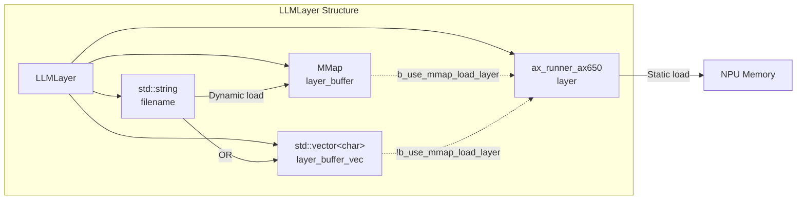
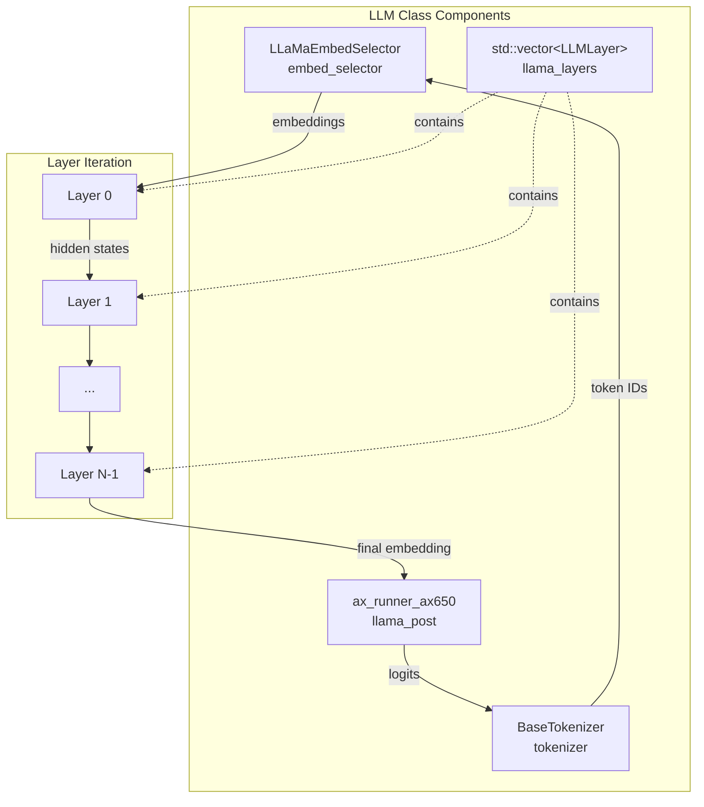
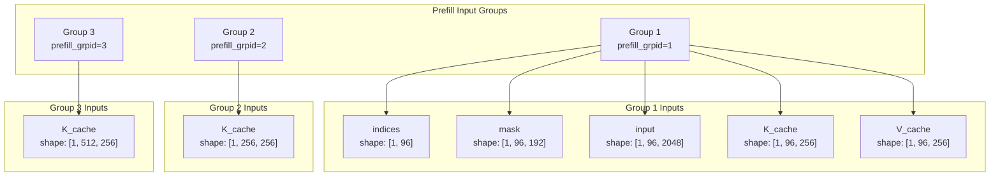
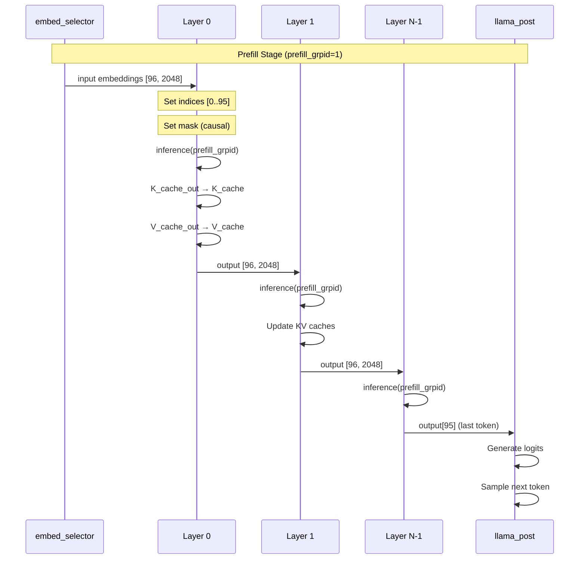
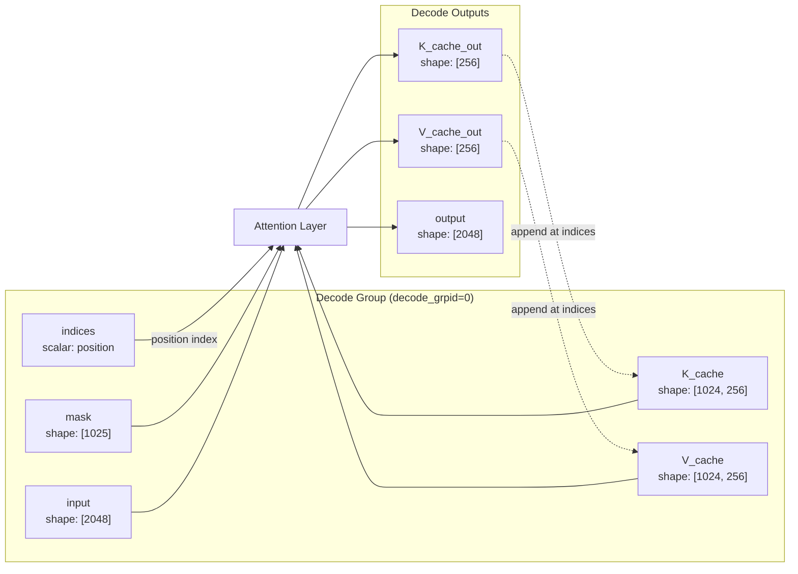
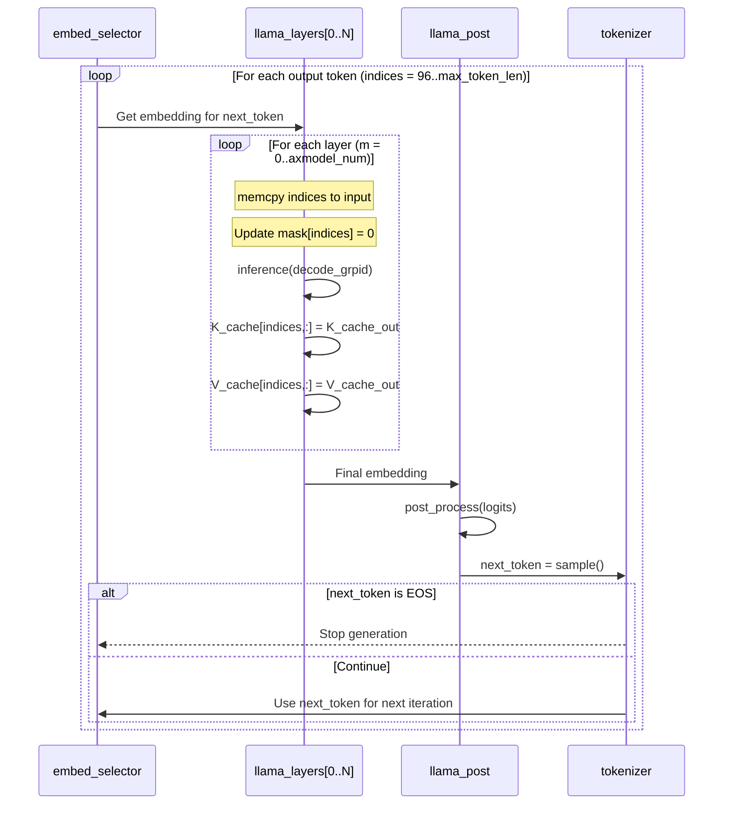
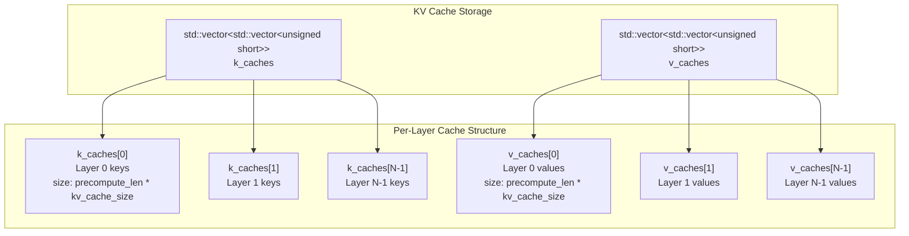
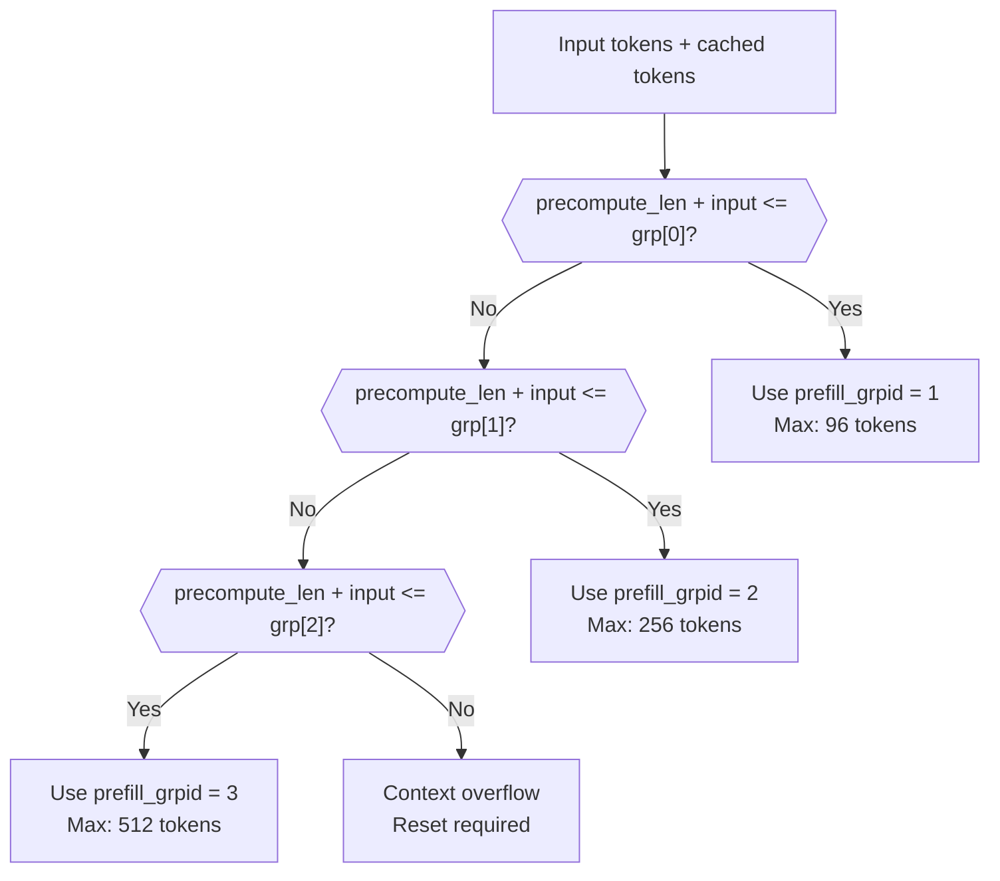
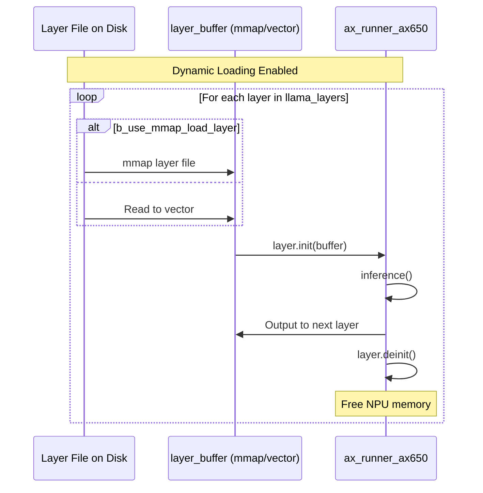

StackFlow Model Architecture and KV Cache

# Model Architecture and KV Cache

<details>
<summary>Relevant source files</summary>

The following files were used as context for generating this wiki page:

- [projects/llm_framework/main_llm/src/main.cpp](projects/llm_framework/main_llm/src/main.cpp)
- [projects/llm_framework/main_llm/src/runner/LLM.hpp](projects/llm_framework/main_llm/src/runner/LLM.hpp)
- [projects/llm_framework/main_vlm/src/main.cpp](projects/llm_framework/main_vlm/src/main.cpp)
- [projects/llm_framework/main_vlm/src/runner/LLM.hpp](projects/llm_framework/main_vlm/src/runner/LLM.hpp)
- [projects/llm_framework/main_vlm/src/runner/ax_model_runner/ax_model_runner.hpp](projects/llm_framework/main_vlm/src/runner/ax_model_runner/ax_model_runner.hpp)

</details>


This page explains the transformer layer execution architecture and KV (Key-Value) cache management system used by LLM and VLM inference units. It covers the dual-stage inference process (prefill and decode), context window management, and memory optimization strategies.

For information about LLM inference workflows and tokenization, see [LLM Inference (llm-llm)](#4.1). For vision-language model specifics, see [Vision-Language Models (llm-vlm)](#4.2).

---

## Overview: Two Inference Modes

The StackFlow LLM framework implements auto-regressive transformer inference using two distinct execution modes:

| Mode | Purpose | Input Size | KV Cache Usage | Speed |
|------|---------|------------|----------------|-------|
| **Prefill** | Process input prompt in parallel | Multiple tokens (batch) | Generate initial cache | Slower, processes N tokens |
| **Decode** | Generate output tokens sequentially | Single token | Read+update existing cache | Faster, processes 1 token |

Both `LLM` and `LLM_CTX` classes implement this dual-mode architecture, with `LLM_CTX` adding cross-turn context management capabilities.

**Sources:** [projects/llm_framework/main_llm/src/runner/LLM.hpp:75-533](), [projects/llm_framework/main_vlm/src/runner/LLM.hpp:93-650]()

---

## Layer-by-Layer Execution Architecture

### LLMLayer Structure

Each transformer layer is encapsulated in an `LLMLayer` structure that manages the NPU model and its loading strategy:



**Sources:** [projects/llm_framework/main_llm/src/runner/LLM.hpp:82-87](), [projects/llm_framework/main_vlm/src/runner/LLM.hpp:660-665]()

### Model Components

The complete LLM inference pipeline consists of multiple model components:



The `axmodel_num` parameter (typically 22-32 layers) determines how many transformer layers execute sequentially. Each layer processes the same inputs/outputs structure but maintains separate KV caches.

**Sources:** [projects/llm_framework/main_llm/src/runner/LLM.hpp:75-111](), [projects/llm_framework/main_llm/src/runner/LLM.hpp:134-179]()

---

## Prefill Stage: Parallel Token Processing

### Prefill Group Architecture

The prefill stage processes multiple input tokens in parallel using input groups. Different group IDs correspond to different KV cache size limits:



**Prefill Tensor Shapes:**
- `indices`: `[batch=1, prefill_token_num]` - Position indices (0, 1, 2, ...)
- `mask`: `[1, prefill_token_num, kv_cache_num + prefill_token_num]` - Causal attention mask
- `input`: `[1, prefill_token_num, tokens_embed_size]` - Input token embeddings
- `K_cache`/`V_cache`: `[1, kv_cache_num, kv_cache_size]` - Cached key/value tensors

**Sources:** [projects/llm_framework/main_llm/src/runner/LLM.hpp:336-372](), [projects/llm_framework/main_vlm/src/runner/LLM.hpp:810-820]()

### Prefill Execution Flow



**Sources:** [projects/llm_framework/main_llm/src/runner/LLM.hpp:317-372](), [projects/llm_framework/main_vlm/src/runner/LLM.hpp:442-497]()

---

## Decode Stage: Auto-Regressive Generation

### Decode Input/Output Structure

After prefill, the decode stage generates tokens one at a time, reusing the accumulated KV cache:



**Decode Tensor Updates:**
- `indices`: Single integer (current position: 96, 97, 98, ...)
- `mask[indices] = 0`: Unmask current position
- `K_cache[indices, :]`: Write new key at position
- `V_cache[indices, :]`: Write new value at position

**Sources:** [projects/llm_framework/main_llm/src/runner/LLM.hpp:414-470](), [projects/llm_framework/main_vlm/src/runner/LLM.hpp:536-589]()

### Auto-Regressive Loop



**Sources:** [projects/llm_framework/main_llm/src/runner/LLM.hpp:404-520](), [projects/llm_framework/main_vlm/src/runner/LLM.hpp:529-640]()

---

## KV Cache Architecture

### Memory Layout

The KV cache stores attention keys and values for all processed tokens, organized per layer:



**Key Parameters:**
- `kv_cache_num`: Maximum tokens that can be cached (e.g., 1024)
- `kv_cache_size`: Feature dimension per token (e.g., 256)
- `precompute_len`: Number of tokens currently cached
- `axmodel_num`: Number of transformer layers (22-32)

**Sources:** [projects/llm_framework/main_llm/src/main.cpp:66-67](), [projects/llm_framework/main_vlm/src/main.cpp:81]()

### Cache Initialization and Updates

| Operation | Code Location | Description |
|-----------|---------------|-------------|
| **Initialize** | `GenerateKVCachePrefill()` | Pre-compute KV cache for system prompt |
| **Set Cache** | `SetKVCache()` | Load pre-computed cache before prefill |
| **Get Cache** | `GetKVCache()` | Extract cache after generation for persistence |
| **Save/Load** | `save_kvcache()` / `load_kvcache()` | Persist cache to disk for reuse |

**Sources:** [projects/llm_framework/main_llm/src/runner/LLM.hpp:710-845](), [projects/llm_framework/main_vlm/src/runner/LLM.hpp:881-1015]()

---

## Context Management (LLM_CTX)

### Multi-Turn Conversation Support

The `LLM_CTX` class extends basic LLM with context preservation across multiple turns:

```mermaid
graph TB
    subgraph "LLM_CTX Workflow"
        SETUP["SetSystemPrompt()<br/>Initialize with system prompt"]
        GEN_PRE["GenerateKVCachePrefill()<br/>Pre-compute system KV cache"]
        
        TURN1["Turn 1: User query"]
        ENC1["Encode()<br/>Tokenize new input"]
        SET1["SetKVCache()<br/>Load cached context"]
        RUN1["Run()<br/>Generate response"]
        GET1["GetKVCache()<br/>Save updated cache"]
        
        TURN2["Turn 2: Follow-up"]
        ENC2["Encode()<br/>Append to history"]
        SET2["SetKVCache()<br/>Load previous cache"]
        RUN2["Run()<br/>Generate response"]
        GET2["GetKVCache()<br/>Save updated cache"]
    end
    
    SETUP --> GEN_PRE
    GEN_PRE --> TURN1
    TURN1 --> ENC1
    ENC1 --> SET1
    SET1 --> RUN1
    RUN1 --> GET1
    
    GET1 --> TURN2
    TURN2 --> ENC2
    ENC2 --> SET2
    SET2 --> RUN2
    RUN2 --> GET2
```



**Sources:** [projects/llm_framework/main_llm/src/main.cpp:349-369](), [projects/llm_framework/main_vlm/src/main.cpp:447-506]()

### Context Window Tracking

The `precompute_len` variable tracks how many tokens are currently in the KV cache:

```cpp
// From main_llm/src/main.cpp
std::vector<int> tokens_ids, tokens_diff;  // Current turn vs previous
int precompute_len = 0;                     // Cached token count

// Encode new turn
lLaMa_ctx_->Encode(prompt_data, prompt_complete(msg), last_reply, 
                   tokens_ids, tokens_diff);

// Set cache with new tokens
lLaMa_ctx_->SetKVCache(k_caches, v_caches, precompute_len, 
                       tokens_diff.size());

// After generation, update count
lLaMa_ctx_->GetKVCache(k_caches, v_caches, precompute_len);
```

**Sources:** [projects/llm_framework/main_llm/src/main.cpp:357-367](), [projects/llm_framework/main_vlm/src/main.cpp:457-467]()

---

## Prefill Groups and Context Windows

### Dynamic Prefill Group Selection

Different prefill groups support different maximum context lengths. The system automatically selects the appropriate group based on current cache size:



**Sources:** [projects/llm_framework/main_llm/src/runner/LLM.hpp:721-730](), [projects/llm_framework/main_llm/src/runner/LLM.hpp:946-963]()

### Prefill Group Configuration

The `prefill_max_kv_cache_num_grp` vector defines available context window sizes:

| Group ID | Max KV Cache | Typical Use Case |
|----------|--------------|------------------|
| 1 | 96 | Short prompts, initial turns |
| 2 | 256 | Medium conversations |
| 3 | 512 | Long conversations, system prompts |

The framework dynamically determines the minimum group that can accommodate `precompute_len + new_tokens`.

**Sources:** [projects/llm_framework/main_llm/src/runner/LLM.hpp:812-820](), [projects/llm_framework/main_vlm/src/runner/LLM.hpp:812-820]()

---

## Memory Optimization Strategies

### Dynamic Layer Loading

When `b_dynamic_load_axmodel_layer = true`, layers are loaded/unloaded on-demand to reduce memory usage:



**Memory Trade-offs:**

| Strategy | Memory Usage | Load Time | Config Flags |
|----------|--------------|-----------|--------------|
| **Static Load** | High (all layers in NPU) | One-time at Init() | `b_dynamic_load_axmodel_layer=false` |
| **Dynamic + Vector** | Medium (one layer + RAM buffer) | Per-layer file read | `b_dynamic_load_axmodel_layer=true`<br/>`b_use_mmap_load_layer=false` |
| **Dynamic + MMap** | Low (one layer, OS-managed) | Minimal (page faults) | `b_dynamic_load_axmodel_layer=true`<br/>`b_use_mmap_load_layer=true` |

**Sources:** [projects/llm_framework/main_llm/src/runner/LLM.hpp:141-162](), [projects/llm_framework/main_llm/src/runner/LLM.hpp:325-335]()

### Embedding Memory Management

Token embeddings can use memory-mapped files to reduce RAM usage:

```cpp
// From LLMEmbedSelector initialization
embed_selector.Init(attr.filename_tokens_embed, 
                   attr.tokens_embed_num,        // 32000 tokens
                   attr.tokens_embed_size,       // 2048 dimensions  
                   attr.b_use_mmap_load_embed);  // Use mmap?
```

When `b_use_mmap_load_embed = true`, the 128MB+ embedding table is memory-mapped instead of loaded into RAM, allowing the OS to page in data on-demand.

**Sources:** [projects/llm_framework/main_llm/src/runner/LLM.hpp:127-132](), [projects/llm_framework/main_llm/src/runner/LLM.hpp:143-148]()

---

## Key Configuration Parameters

### LLMAttrType Structure

The following table summarizes critical parameters for model architecture and KV cache:

| Parameter | Type | Example Value | Description |
|-----------|------|---------------|-------------|
| `axmodel_num` | int | 22 | Number of transformer layers |
| `tokens_embed_size` | int | 2048 | Hidden dimension size |
| `tokens_embed_num` | int | 32000 | Vocabulary size |
| `kv_cache_num` | int | 1024 | Max tokens in cache (auto-detected) |
| `kv_cache_size` | int | 256 | Key/Value feature dimension (auto-detected) |
| `max_token_len` | int | 127 | Max output tokens per generation |
| `prefill_token_num` | int | 96 | Tokens per prefill batch (auto-detected) |
| `prefill_max_token_num` | int | 512 | Maximum prefill context (dynamic) |
| `precompute_len` | int | 0+ | Cached token count (runtime) |
| `prefill_max_kv_cache_num_grp` | vector<int> | [96, 256, 512] | Group capacity limits (auto-detected) |
| `b_dynamic_load_axmodel_layer` | bool | false | Enable dynamic layer loading |
| `b_use_mmap_load_layer` | bool | true | Use mmap for layer files |
| `b_use_mmap_load_embed` | bool | false | Use mmap for embeddings |

**Auto-Detected Parameters:** Many parameters are extracted from the loaded model metadata during initialization and do not need manual configuration.

**Sources:** [projects/llm_framework/main_llm/src/runner/LLM.hpp:25-73](), [projects/llm_framework/main_llm/src/runner/LLM.hpp:192-207](), [projects/llm_framework/main_llm/src/runner/LLM.hpp:624-648]()

### Model Shape Introspection

The framework automatically detects model dimensions during initialization:

```cpp
// Auto-detect from loaded model (decode group 0)
_attr.max_token_len = llama_layers[0].layer.get_input("mask").nSize / sizeof(unsigned short) - 1;
_attr.kv_cache_size = llama_layers[0].layer.get_output("K_cache_out").nSize / sizeof(unsigned short);
_attr.kv_cache_num = llama_layers[0].layer.get_input("K_cache").nSize / _attr.kv_cache_size / sizeof(unsigned short);

// Auto-detect prefill capabilities (group 1+)
_attr.prefill_token_num = llama_layers[0].layer.get_input(1, "indices").vShape[1];
for (size_t i = 0; i < llama_layers[0].layer.get_num_input_groups() - 1; i++) {
    int prefill_max_kv = llama_layers[0].layer.get_input(i + 1, "K_cache").vShape[1];
    _attr.prefill_max_kv_cache_num_grp.push_back(prefill_max_kv);
}
```

This introspection ensures compatibility with different model architectures without manual configuration.

**Sources:** [projects/llm_framework/main_llm/src/runner/LLM.hpp:624-648](), [projects/llm_framework/main_vlm/src/runner/LLM.hpp:796-820]()