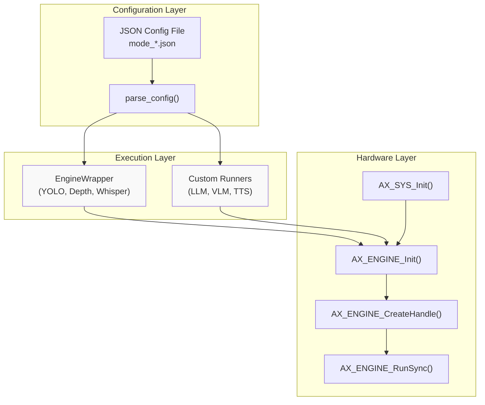
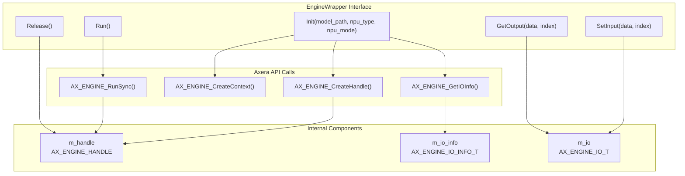
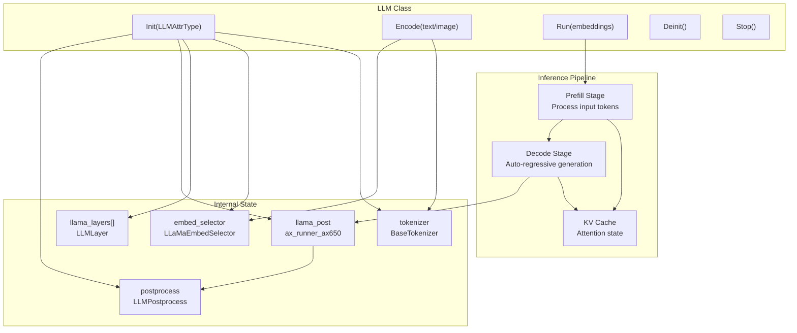
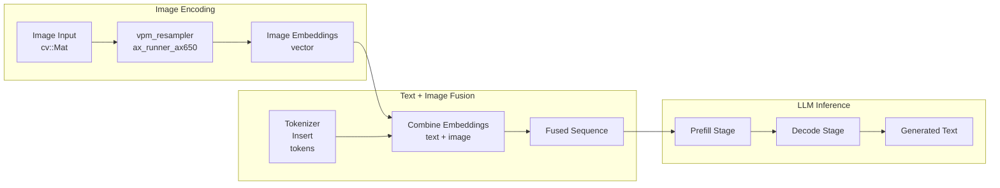
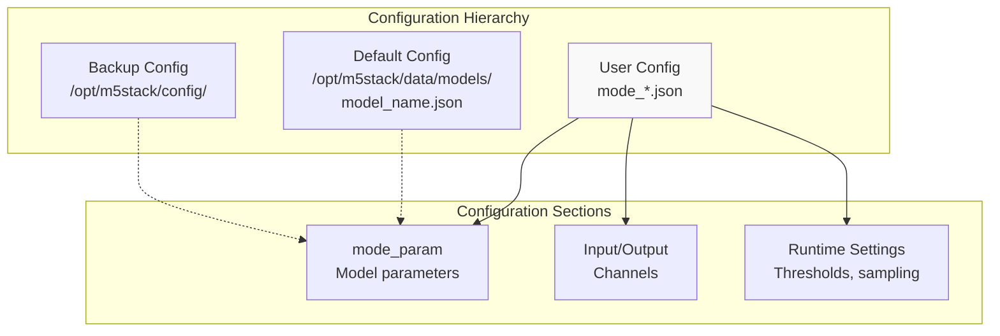
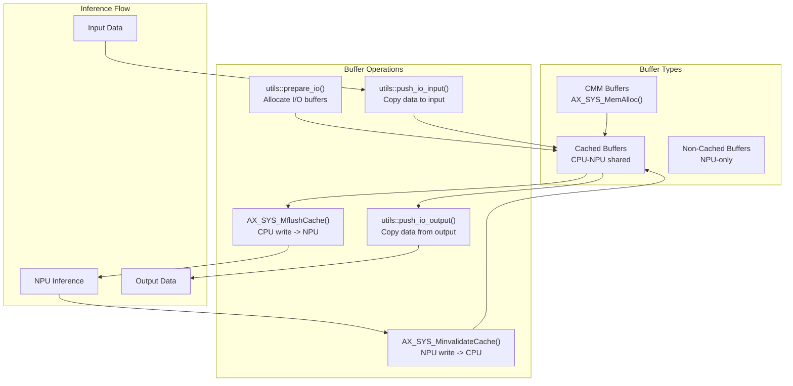
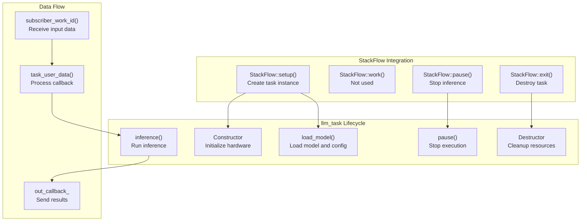

StackFlow Model Integration

# Model Integration

<details>
<summary>Relevant source files</summary>

The following files were used as context for generating this wiki page:

- [projects/llm_framework/main_depth_anything/src/EngineWrapper.cpp](projects/llm_framework/main_depth_anything/src/EngineWrapper.cpp)
- [projects/llm_framework/main_depth_anything/src/EngineWrapper.hpp](projects/llm_framework/main_depth_anything/src/EngineWrapper.hpp)
- [projects/llm_framework/main_depth_anything/src/main.cpp](projects/llm_framework/main_depth_anything/src/main.cpp)
- [projects/llm_framework/main_llm/src/main.cpp](projects/llm_framework/main_llm/src/main.cpp)
- [projects/llm_framework/main_llm/src/runner/LLM.hpp](projects/llm_framework/main_llm/src/runner/LLM.hpp)
- [projects/llm_framework/main_melotts/src/runner/EngineWrapper.cpp](projects/llm_framework/main_melotts/src/runner/EngineWrapper.cpp)
- [projects/llm_framework/main_vlm/src/main.cpp](projects/llm_framework/main_vlm/src/main.cpp)
- [projects/llm_framework/main_vlm/src/runner/LLM.hpp](projects/llm_framework/main_vlm/src/runner/LLM.hpp)
- [projects/llm_framework/main_vlm/src/runner/ax_model_runner/ax_model_runner.hpp](projects/llm_framework/main_vlm/src/runner/ax_model_runner/ax_model_runner.hpp)
- [projects/llm_framework/main_whisper/src/runner/EngineWrapper.cpp](projects/llm_framework/main_whisper/src/runner/EngineWrapper.cpp)
- [projects/llm_framework/main_yolo/src/EngineWrapper.cpp](projects/llm_framework/main_yolo/src/EngineWrapper.cpp)
- [projects/llm_framework/main_yolo/src/EngineWrapper.hpp](projects/llm_framework/main_yolo/src/EngineWrapper.hpp)
- [projects/llm_framework/main_yolo/src/main.cpp](projects/llm_framework/main_yolo/src/main.cpp)

</details>


This guide explains how to integrate new AI models into the StackFlow framework. It covers the two primary integration patterns: the `EngineWrapper` abstraction for standard NPU models (YOLO, Depth Estimation, Whisper) and custom runner classes for complex models (LLM, VLM, TTS). For information about creating complete custom units, see [Creating Custom Units](#10.1). For framework extension topics, see [Extending StackFlow Framework](#10.3).

---

## Integration Overview

Model integration in StackFlow follows a three-layer architecture: configuration layer (JSON), execution layer (model runners), and hardware layer (Axera NPU API). All models share common initialization, inference, and I/O management patterns, but differ in their specific runner implementations.



**Integration Workflow:**

| Stage | Component | Responsibility |
|-------|-----------|----------------|
| Configuration | JSON Parser | Load model paths, parameters, thresholds |
| Initialization | Hardware Init | `AX_SYS_Init()`, `AX_ENGINE_Init()` |
| Model Loading | Runner Init | Load `.axmodel` files, allocate I/O buffers |
| Inference | Runner Execution | Set inputs, run model, retrieve outputs |
| Post-processing | Application Logic | Decode results, format outputs |

Sources: [projects/llm_framework/main_yolo/src/main.cpp:100-147](), [projects/llm_framework/main_vlm/src/main.cpp:161-377]()

---

## EngineWrapper Pattern

The `EngineWrapper` class provides a standardized interface for integrating Axera NPU models. It abstracts VNPU configuration, model loading, I/O buffer management, and inference execution. This pattern is used by YOLO, Depth Estimation, and Whisper units.

### EngineWrapper Architecture



Sources: [projects/llm_framework/main_yolo/src/EngineWrapper.cpp:182-317](), [projects/llm_framework/main_yolo/src/EngineWrapper.hpp:35-70]()

### Implementing EngineWrapper Integration

**Step 1: Initialize Hardware**

Each unit must initialize the Axera SYS and ENGINE APIs once. Use a static counter to track initialization state across multiple task instances:

```cpp
// From main_yolo/src/main.cpp
void _ax_init()
{
    if (!ax_init_flage_) {
        int ret = AX_SYS_Init();
        if (0 != ret) {
            fprintf(stderr, "AX_SYS_Init failed! ret = 0x%x\n", ret);
        }
    }
    ax_init_flage_++;
}
```

Sources: [projects/llm_framework/main_yolo/src/main.cpp:291-300]()

**Step 2: Create and Initialize EngineWrapper**

Load the model by calling `Init()` with the model path and VNPU configuration:

```cpp
// From main_yolo/src/main.cpp
yolo_ = std::make_unique<EngineWrapper>();
if (0 != yolo_->Init(mode_config_.yolo_model.c_str(), 0, mode_config_.npu_type)) {
    SLOGE("Init yolo_model model failed!\n");
    return -5;
}
```

The `Init()` method performs:
- Model buffer loading (CMM or regular memory)
- Model type detection via `AX_ENGINE_GetModelType()`
- VNPU compatibility checking via `CheckModelVNpu()`
- Handle creation via `AX_ENGINE_CreateHandle()`
- Context creation via `AX_ENGINE_CreateContext()`
- I/O buffer allocation via `utils::prepare_io()`

Sources: [projects/llm_framework/main_yolo/src/main.cpp:136-141](), [projects/llm_framework/main_yolo/src/EngineWrapper.cpp:182-317]()

**Step 3: Execute Inference**

The inference pipeline consists of three operations:

```cpp
// From main_yolo/src/main.cpp
// 1. Set input data
yolo_->SetInput((void *)image.data(), 0);

// 2. Run inference
if (0 != yolo_->Run()) {
    SLOGE("Run yolo model failed!\n");
    throw std::string("yolo_ RunSync error");
}

// 3. Post-process results
std::vector<detection::Object> objects;
yolo_->Post_Process(img_mat, mode_config_.img_w, mode_config_.img_h, 
                   mode_config_.cls_num, mode_config_.point_num, 
                   mode_config_.pron_threshold, mode_config_.nms_threshold,
                   objects, mode_config_.model_type);
```

Sources: [projects/llm_framework/main_yolo/src/main.cpp:232-240]()

### VNPU Configuration

The `CheckModelVNpu()` function validates model compatibility with the hardware VNPU configuration and determines the appropriate VNPU set:

**VNPU Modes:**

| Mode | Description | Supported Model Types |
|------|-------------|----------------------|
| `AX_ENGINE_VIRTUAL_NPU_DISABLE` | No VNPU virtualization | All model types (3.6T, 7.2T, 18T) |
| `AX_ENGINE_VIRTUAL_NPU_STD` | Standard VNPU (3 cores) | 3.6T models only |
| `AX_ENGINE_VIRTUAL_NPU_BIG_LITTLE` | BIG-LITTLE VNPU (2 cores) | 3.6T, 7.2T models |

**Model Type Selection:**

```cpp
// From EngineWrapper.cpp - VNPU configuration logic
if (stNpuAttr.eHardMode == AX_ENGINE_VIRTUAL_NPU_STD) {
    // 3.6T models run on STD VNPU2 by default
    if (nNpuType == 0) {
        nNpuSet = 0x02;  // VNPU2
    }
}
else if (stNpuAttr.eHardMode == AX_ENGINE_VIRTUAL_NPU_BIG_LITTLE) {
    // 7.2T models run on BL VNPU1, 3.6T on BL VNPU2
    if (nNpuType == 0) {
        if (eModelType == AX_ENGINE_MODEL_TYPE1) {
            nNpuSet = 0x01;  // 7.2T -> VNPU1
        } else {
            nNpuSet = 0x02;  // 3.6T -> VNPU2
        }
    }
}
```

Sources: [projects/llm_framework/main_yolo/src/EngineWrapper.cpp:36-134]()

---

## Custom Model Runners

Complex models like LLM, VLM, and TTS require custom runner implementations that extend beyond the basic EngineWrapper pattern. These runners handle multi-stage inference, token generation, KV cache management, and specialized input encoding.

### LLM Runner Architecture

The `LLM` class implements transformer-based language model inference with prefill and decode stages:



Sources: [projects/llm_framework/main_vlm/src/runner/LLM.hpp:93-280]()

### LLM Integration Steps

**Step 1: Define Configuration Structure**

Create a configuration structure with all model-specific parameters:

```cpp
// From runner/LLM.hpp
struct LLMAttrType {
    std::string system_prompt;
    std::string template_filename_axmodel = "model_l%d.axmodel";
    int axmodel_num = 22;  // Number of transformer layers
    
    std::string filename_tokens_embed;
    int tokens_embed_num = 32000;
    int tokens_embed_size = 2048;
    
    int max_token_len = 127;
    int kv_cache_num = 1024;
    int kv_cache_size = 256;
    
    // Sampling parameters
    bool enable_temperature = false;
    float temperature = 0.7f;
    bool enable_top_p_sampling = false;
    float top_p = 0.7f;
    
    LLMRuningCallback runing_callback = nullptr;
};
```

Sources: [projects/llm_framework/main_vlm/src/runner/LLM.hpp:27-91]()

**Step 2: Initialize Model Components**

The `Init()` method loads all model components:

```cpp
// From runner/LLM.hpp
bool Init(LLMAttrType attr)
{
    // 1. Initialize tokenizer
    tokenizer = CreateTokenizer(attr.tokenizer_type);
    if (!tokenizer->Init(attr.filename_tokenizer_model, attr.b_bos, attr.b_eos)) {
        return false;
    }
    
    // 2. Load embedding table
    if (!embed_selector.Init(attr.filename_tokens_embed, 
                            attr.tokens_embed_num, 
                            attr.tokens_embed_size,
                            attr.b_use_mmap_load_embed)) {
        return false;
    }
    
    // 3. Load transformer layers
    llama_layers.resize(attr.axmodel_num);
    for (int i = 0; i < attr.axmodel_num; i++) {
        sprintf(axmodel_path, attr.template_filename_axmodel.c_str(), i);
        llama_layers[i].filename = axmodel_path;
        
        if (!attr.b_dynamic_load_axmodel_layer) {
            int ret = llama_layers[i].layer.init(llama_layers[i].filename.c_str(), true);
            if (ret != 0) return false;
        }
    }
    
    // 4. Load post-processing model (LM head)
    int ret = llama_post.init(attr.filename_post_axmodel.c_str(), true);
    if (ret != 0) return false;
    
    return true;
}
```

Sources: [projects/llm_framework/main_vlm/src/runner/LLM.hpp:131-280]()

**Step 3: Implement Inference Pipeline**

The `Run()` method executes two-stage inference:

**Prefill Stage** - Process all input tokens in parallel:

```cpp
// From runner/LLM.hpp - Prefill stage
for (unsigned int m = 0; m < _attr.axmodel_num; m++) {
    auto &layer = llama_layers[m];
    
    // Set indices for parallel processing
    unsigned int *input_indices_ptr = (unsigned int *)layer.layer.get_input(prefill_grpid, "indices").pVirAddr;
    for (unsigned int i = 0; i < input_embed_num; i++) {
        input_indices_ptr[i] = i;
    }
    
    // Set attention mask (causal mask)
    auto &input_mask = layer.layer.get_input(prefill_grpid, "mask");
    memcpy(input_mask.pVirAddr, mask_p.data(), mask_p.size() * sizeof(unsigned short));
    
    // Set input embeddings
    auto &input_input = layer.layer.get_input(prefill_grpid, "input");
    memcpy(input_input.pVirAddr, test_embed.data(), test_embed.size() * sizeof(unsigned short));
    
    // Run layer inference
    layer.layer.inference(prefill_grpid);
    
    // Save KV cache
    auto &output_k_cache = layer.layer.get_output(prefill_grpid, "K_cache_out");
    AX_SYS_MinvalidateCache(output_k_cache.phyAddr, output_k_cache.pVirAddr, output_k_cache.nSize);
    memcpy(input_k_cache.pVirAddr, output_k_cache.pVirAddr, ...);
}
```

**Decode Stage** - Auto-regressive token generation:

```cpp
// From runner/LLM.hpp - Decode stage
for (unsigned int indices = input_embed_num; indices < _attr.max_token_len; indices++) {
    // Get embedding for current token
    embed_selector.getByIndex(next_token, embed);
    
    for (int m = 0; m < _attr.axmodel_num; m++) {
        auto &layer = llama_layers[m];
        
        // Set current position
        auto &input_indices = layer.layer.get_input(decode_grpid, "indices");
        memcpy(input_indices.pVirAddr, &indices, sizeof(indices));
        
        // Set attention mask
        auto &input_mask = layer.layer.get_input(decode_grpid, "mask");
        memcpy(input_mask.pVirAddr, mask.data(), mask.size() * sizeof(unsigned short));
        
        // Set input embedding
        auto &input_input = layer.layer.get_input(decode_grpid, "input");
        memcpy(input_input.pVirAddr, embed.data(), embed.size() * sizeof(unsigned short));
        
        // Run inference
        layer.layer.inference(decode_grpid);
        
        // Update KV cache
        auto &output_k_cache = layer.layer.get_output(decode_grpid, "K_cache_out");
        memcpy(input_k_cache_ptr + indices * _attr.kv_cache_size, output_k_cache.pVirAddr, ...);
    }
    
    // Post-process to get next token
    llama_post.inference();
    max_index = post_process(postprocess, post_out, _attr.tokens_embed_num, token_ids, &max_val);
    next_token = max_index;
    
    if (tokenizer->isEnd(max_index)) break;
}
```

Sources: [projects/llm_framework/main_vlm/src/runner/LLM.hpp:412-650]()

### VLM Integration

Vision-Language Models extend the LLM pattern with image encoding capabilities. The integration adds an image encoder stage before text processing:



**Image Encoding Implementation:**

```cpp
// From runner/LLM.hpp - VLM image encoding
int Encode(cv::Mat src, std::vector<unsigned short> &out_embed)
{
    // 1. Resize and convert to RGB
    cv::Mat dst;
    cv::resize(src, dst, cv::Size(_attr.vpm_width, _attr.vpm_height));
    cv::cvtColor(dst, dst, cv::COLOR_BGR2RGB);
    
    // 2. Run vision encoder
    void *data = vpm_resampler.get_input(0).pVirAddr;
    memcpy(data, dst.data, dst.rows * dst.cols * 3);
    vpm_resampler.inference();
    
    // 3. Convert output to bfloat16
    AX_SYS_MinvalidateCache(vpm_resampler.get_output(0).phyAddr, 
                           vpm_resampler.get_output(0).pVirAddr,
                           vpm_resampler.get_output(0).nSize);
    
    float *output_data = (float *)vpm_resampler.get_output(0).pVirAddr;
    out_embed.resize(vpm_resampler.get_output(0).nSize / sizeof(float));
    for (size_t i = 0; i < out_embed.size(); i++) {
        out_embed[i] = bfloat16(output_data[i]).data;
    }
    
    return 0;
}
```

**Embedding Fusion:**

```cpp
// From runner/LLM.hpp - Combine text and image embeddings
int Encode(std::vector<unsigned short> &img_embed, 
           std::vector<unsigned short> &out_embed,
           std::string prompt)
{
    ImageInfo img_info;
    img_info.img_prompt = true;
    img_info.num_img = 1;
    std::vector<int> input_ids = tokenizer->Encode(prompt, img_info);
    
    // Find image token positions
    int offset = 0;
    int img_context_count = 0;
    for (size_t i = 0; i < input_ids.size(); i++) {
        if (input_ids[i] == _attr.img_token_id) {
            img_context_count++;
            if (img_context_count == 1) offset = i;
        }
    }
    
    // Allocate output embeddings
    out_embed.resize(input_ids.size() * _attr.tokens_embed_size);
    
    // Fill with text embeddings
    for (size_t i = 0; i < input_ids.size(); i++) {
        embed_selector.getByIndex(input_ids[i], out_embed.data() + i * _attr.tokens_embed_size);
    }
    
    // Replace image token embeddings with actual image features
    memcpy(out_embed.data() + offset * _attr.tokens_embed_size, 
           img_embed.data(),
           img_embed.size() * sizeof(unsigned short));
    
    return 0;
}
```

Sources: [projects/llm_framework/main_vlm/src/runner/LLM.hpp:303-403]()

---

## Configuration System

Model configuration uses a hierarchical JSON system with multiple search paths for flexibility in deployment scenarios.

### Configuration File Structure



**Configuration Search Order:**

```cpp
// From StackFlow/src/StackFlow.cpp - Configuration file paths
std::list<std::string> get_config_file_paths(
    const std::string &base_model_path_,
    const std::string &base_model_config_path_,
    const std::string &model_)
{
    return {
        base_model_path_ + model_ + ".json",              // User config
        base_model_path_ + model_ + "/" + model_ + ".json", // Model directory
        base_model_config_path_ + model_ + ".json"        // System config
    };
}
```

**Configuration Loading Pattern:**

```cpp
// From main_yolo/src/main.cpp
int load_model(const nlohmann::json &config_body)
{
    // 1. Parse user configuration
    if (parse_config(config_body)) return -1;
    
    // 2. Search for model config file
    nlohmann::json file_body;
    std::list<std::string> config_file_paths = 
        get_config_file_paths(base_model_path_, base_model_config_path_, model_);
    
    for (auto file_name : config_file_paths) {
        std::ifstream config_file(file_name);
        if (!config_file.is_open()) {
            SLOGW("config file :%s miss", file_name.c_str());
            continue;
        }
        config_file >> file_body;
        config_file.close();
        break;
    }
    
    // 3. Apply configuration with priority (user config > file config)
    CONFIG_AUTO_SET(file_body["mode_param"], yolo_model);
    CONFIG_AUTO_SET(file_body["mode_param"], img_h);
    CONFIG_AUTO_SET(file_body["mode_param"], img_w);
    CONFIG_AUTO_SET(file_body["mode_param"], pron_threshold);
    CONFIG_AUTO_SET(file_body["mode_param"], nms_threshold);
    
    // 4. Resolve relative paths
    mode_config_.yolo_model = base_model + mode_config_.yolo_model;
    
    return 0;
}
```

**CONFIG_AUTO_SET Macro:**

```cpp
// Automatically merges user config with file config
#define CONFIG_AUTO_SET(obj, key)             \
    if (config_body.contains(#key))           \
        mode_config_.key = config_body[#key]; \
    else if (obj.contains(#key))              \
        mode_config_.key = obj[#key];
```

Sources: [projects/llm_framework/main_yolo/src/main.cpp:53-147]()

### Example Configuration Files

**YOLO Configuration:**

```json
{
  "mode_param": {
    "yolo_model": "yolo11n_640x640_nv12.axmodel",
    "img_h": 640,
    "img_w": 640,
    "cls_num": 80,
    "point_num": 17,
    "pron_threshold": 0.45,
    "nms_threshold": 0.45,
    "model_type": "detect",
    "npu_type": 0,
    "cls_name": ["person", "bicycle", "car", ...]
  }
}
```

**LLM Configuration:**

```json
{
  "mode_param": {
    "system_prompt": "You are a helpful assistant.",
    "tokenizer_type": 4,
    "filename_tokenizer_model": "tokenizer.model",
    "filename_tokens_embed": "tokens_embed.bin",
    "template_filename_axmodel": "layer_%d.axmodel",
    "filename_post_axmodel": "post.axmodel",
    "axmodel_num": 22,
    "tokens_embed_num": 32000,
    "tokens_embed_size": 2048,
    "max_token_len": 127,
    "enable_temperature": true,
    "temperature": 0.7,
    "enable_top_p_sampling": true,
    "top_p": 0.9
  }
}
```

Sources: [projects/llm_framework/main_llm/src/main.cpp:125-286]()

---

## I/O Buffer Management

Proper I/O buffer management is critical for NPU performance. The EngineWrapper uses cached buffers allocated via the Axera CMM (Contiguous Memory Manager).

### Buffer Allocation Strategy



**Buffer Allocation:**

```cpp
// From utils/io.hpp - Prepare I/O buffers
int prepare_io(const char* model_path,
               AX_ENGINE_IO_INFO_T* io_info,
               AX_ENGINE_IO_T& io,
               IO_BUFFER_STRATEGY strategy)
{
    io.nInputSize = io_info->nInputSize;
    io.pInputs = new AX_ENGINE_IO_BUFFER_T[io.nInputSize];
    
    for (size_t i = 0; i < io_info->nInputSize; ++i) {
        auto& input = io_info->pInputs[i];
        auto& io_buf = io.pInputs[i];
        
        io_buf.nSize = input.nSize;
        
        if (strategy == IO_BUFFER_STRATEGY_CACHED) {
            // Allocate cached buffer for CPU-NPU transfers
            int ret = AX_SYS_MemAllocCached(&io_buf.phyAddr, &io_buf.pVirAddr, 
                                           io_buf.nSize, 0x100, (AX_S8*)"ENGINE_IO");
            if (ret != 0) return ret;
        } else {
            // Allocate non-cached buffer
            int ret = AX_SYS_MemAlloc(&io_buf.phyAddr, &io_buf.pVirAddr, 
                                     io_buf.nSize, 0x100, (AX_S8*)"ENGINE_IO");
            if (ret != 0) return ret;
        }
    }
    
    // Same process for outputs
    io.nOutputSize = io_info->nOutputSize;
    io.pOutputs = new AX_ENGINE_IO_BUFFER_T[io.nOutputSize];
    // ... allocate output buffers
    
    return 0;
}
```

**Cache Synchronization:**

```cpp
// From EngineWrapper.cpp - Input data transfer
int SetInput(void* pInput, int index)
{
    return utils::push_io_input(pInput, index, m_io);
}

// From utils/io.hpp
int push_io_input(void* pInput, int index, AX_ENGINE_IO_T& io)
{
    auto& buf = io.pInputs[index];
    memcpy(buf.pVirAddr, pInput, buf.nSize);
    
    // Flush CPU cache to make data visible to NPU
    AX_SYS_MflushCache(buf.phyAddr, buf.pVirAddr, buf.nSize);
    
    return 0;
}

// From runner/LLM.hpp - Output data retrieval
AX_SYS_MinvalidateCache(output.phyAddr, output.pVirAddr, output.nSize);
memcpy(local_buffer, output.pVirAddr, output.nSize);
```

Sources: [projects/llm_framework/main_yolo/src/EngineWrapper.cpp:306-322]()

---

## Post-Processing Implementation

Post-processing converts raw model outputs into application-specific formats. Different model types require different post-processing strategies.

### Detection Post-Processing (YOLO)

```cpp
// From EngineWrapper.cpp - YOLO post-processing
int Post_Process(cv::Mat& mat, int& input_w, int& input_h, 
                int& cls_num, int& point_num,
                float& pron_threshold, float& nms_threshold,
                std::vector<detection::Object>& objects, 
                std::string& model_type)
{
    // 1. Get output tensors
    float* output_data = (float*)GetOutputPtr(0);
    int output_size = GetOutputSize(0) / sizeof(float);
    
    // 2. Parse detections based on model type
    if (model_type == "detect") {
        // Standard detection: [batch, num_boxes, 4 + cls_num]
        parse_detection_boxes(output_data, objects, pron_threshold, cls_num);
    }
    else if (model_type == "segment") {
        // Segmentation: [batch, num_boxes, 4 + cls_num + mask_coeffs]
        parse_segmentation_boxes(output_data, objects, pron_threshold, cls_num);
        
        // 3. Extract mask features
        float* mask_proto = (float*)GetOutputPtr(1);
        generate_masks(objects, mask_proto, mat.size());
    }
    else if (model_type == "pose") {
        // Pose estimation: [batch, num_boxes, 4 + cls_num + keypoints]
        parse_pose_boxes(output_data, objects, pron_threshold, cls_num, point_num);
    }
    else if (model_type == "obb") {
        // Oriented bounding boxes: [batch, num_boxes, 4 + 1 + cls_num]
        parse_obb_boxes(output_data, objects, pron_threshold, cls_num);
    }
    
    // 4. Apply NMS
    nms_sorted_bboxes(objects, nms_threshold);
    
    // 5. Scale boxes back to original image size
    scale_boxes(objects, mat.cols, mat.rows, input_w, input_h);
    
    return 0;
}
```

Sources: [projects/llm_framework/main_yolo/src/EngineWrapper.cpp:391-780]()

### LLM Post-Processing (Token Sampling)

```cpp
// From LLMPostprocess.hpp - Token selection with sampling
int apply(std::vector<float>& logits, std::vector<int>& history)
{
    // 1. Apply temperature scaling
    if (enable_temperature) {
        for (auto& logit : logits) {
            logit /= temperature;
        }
    }
    
    // 2. Apply repetition penalty
    if (enable_repetition_penalty) {
        int window_start = std::max(0, (int)history.size() - penalty_window);
        for (int i = window_start; i < history.size(); i++) {
            int token_id = history[i];
            if (logits[token_id] > 0) {
                logits[token_id] /= repetition_penalty;
            } else {
                logits[token_id] *= repetition_penalty;
            }
        }
    }
    
    // 3. Softmax normalization
    float max_logit = *std::max_element(logits.begin(), logits.end());
    float sum = 0.0f;
    for (auto& logit : logits) {
        logit = exp(logit - max_logit);
        sum += logit;
    }
    for (auto& logit : logits) logit /= sum;
    
    // 4. Top-k sampling
    if (enable_top_k_sampling) {
        std::vector<std::pair<float, int>> prob_index;
        for (int i = 0; i < logits.size(); i++) {
            prob_index.push_back({logits[i], i});
        }
        std::partial_sort(prob_index.begin(), prob_index.begin() + top_k, prob_index.end(),
                         [](auto& a, auto& b) { return a.first > b.first; });
        prob_index.resize(top_k);
    }
    
    // 5. Top-p (nucleus) sampling
    if (enable_top_p_sampling) {
        float cumsum = 0.0f;
        std::vector<std::pair<float, int>> prob_index_filtered;
        for (auto& [prob, idx] : prob_index) {
            cumsum += prob;
            prob_index_filtered.push_back({prob, idx});
            if (cumsum >= top_p) break;
        }
        prob_index = prob_index_filtered;
    }
    
    // 6. Sample from distribution
    std::discrete_distribution<int> dist(probs.begin(), probs.end());
    return prob_index[dist(rng)].second;
}
```

Sources: [projects/llm_framework/main_llm/src/runner/LLM.hpp:102-112]()

---

## Integration with StackFlow Units

To integrate a new model into a StackFlow unit, implement the `llm_task` class that manages model lifecycle and connects to the unit's messaging system.

### Task Class Pattern



**Task Class Structure:**

```cpp
// From main_yolo/src/main.cpp
class llm_task {
private:
    // Configuration
    yolo_config mode_config_;
    std::string model_;
    std::string response_format_;
    std::vector<std::string> inputs_;
    
    // Model execution
    std::unique_ptr<EngineWrapper> yolo_;
    std::unique_ptr<std::thread> inference_run_;
    thread_safe::list<inference_async_par> async_list_;
    
    // Hardware state
    static int ax_init_flage_;
    
    // Output callback
    task_callback_t out_callback_;
    bool enoutput_;
    bool enstream_;
    
public:
    llm_task(const std::string &workid) {
        _ax_init();
        inference_run_ = std::make_unique<std::thread>(std::bind(&llm_task::run, this));
    }
    
    int load_model(const nlohmann::json &config_body);
    bool inference(cv::Mat &src, bool bgr2rgb = true);
    void set_output(task_callback_t out_callback);
    
    void run() {
        // Async inference worker thread
        for (;;) {
            auto par = async_list_.get();
            if (par.inference_src.empty()) break;
            inference(par.inference_src, par.inference_bgr2rgb);
        }
    }
    
    ~llm_task() {
        stop();
        if (yolo_) yolo_->Release();
        _ax_deinit();
    }
};
```

Sources: [projects/llm_framework/main_yolo/src/main.cpp:59-341]()

**StackFlow Unit Integration:**

```cpp
// From main_yolo/src/main.cpp
class llm_yolo : public StackFlow {
private:
    std::unordered_map<int, std::shared_ptr<llm_task>> llm_task_;
    
public:
    int setup(const std::string &work_id, const std::string &object, 
              const std::string &data) override
    {
        // 1. Create task instance
        int work_id_num = sample_get_work_id_num(work_id);
        auto llm_channel = get_channel(work_id);
        auto llm_task_obj = std::make_shared<llm_task>(work_id);
        
        // 2. Parse configuration
        nlohmann::json config_body = nlohmann::json::parse(data);
        int ret = llm_task_obj->load_model(config_body);
        if (ret != 0) return -1;
        
        // 3. Set up output callback
        llm_task_obj->set_output(
            std::bind(&llm_yolo::task_output, this, 
                     std::weak_ptr<llm_task>(llm_task_obj),
                     std::weak_ptr<llm_channel_obj>(llm_channel),
                     std::placeholders::_1, std::placeholders::_2));
        
        // 4. Subscribe to input channels
        for (const auto input : llm_task_obj->inputs_) {
            if (input.find("yolo") != std::string::npos) {
                llm_channel->subscriber_work_id("", 
                    std::bind(&llm_yolo::task_user_data, this,
                             std::weak_ptr<llm_task>(llm_task_obj),
                             std::weak_ptr<llm_channel_obj>(llm_channel),
                             std::placeholders::_1, std::placeholders::_2));
            }
            else if (input.find("camera") != std::string::npos) {
                // Subscribe to camera raw output
                std::string input_url = unit_call("sys", "sql_select", input + ".out_port");
                llm_channel->subscriber(input_url, [this, llm_task_obj, llm_channel]
                    (pzmq *_pzmq, const std::shared_ptr<pzmq_data> &raw) {
                    this->task_camera_data(llm_task_obj, llm_channel, raw->string());
                });
            }
        }
        
        // 5. Store task
        llm_task_[work_id_num] = llm_task_obj;
        send("None", "None", LLM_NO_ERROR, work_id);
        return 0;
    }
    
    void task_user_data(const std::weak_ptr<llm_task> llm_task_obj_weak,
                       const std::weak_ptr<llm_channel_obj> llm_channel_weak,
                       const std::string &object, const std::string &data)
    {
        auto llm_task_obj = llm_task_obj_weak.lock();
        auto llm_channel = llm_channel_weak.lock();
        if (!(llm_task_obj && llm_channel)) return;
        
        // Decode base64 input
        std::string decoded;
        decode_base64(data, decoded);
        
        // Run inference
        llm_task_obj->inference_decode(decoded);
    }
    
    void task_output(const std::weak_ptr<llm_task> llm_task_obj_weak,
                    const std::weak_ptr<llm_channel_obj> llm_channel_weak,
                    const nlohmann::json &data, bool finish)
    {
        auto llm_task_obj = llm_task_obj_weak.lock();
        auto llm_channel = llm_channel_weak.lock();
        if (!(llm_task_obj && llm_channel)) return;
        
        // Send output via channel
        if (finish) {
            llm_channel->send(llm_task_obj->response_format_, data, LLM_NO_ERROR);
        }
    }
};
```

Sources: [projects/llm_framework/main_yolo/src/main.cpp:345-620]()

---

## Summary: Integration Checklist

When integrating a new AI model into StackFlow, follow this checklist:

| Step | Component | Implementation |
|------|-----------|----------------|
| 1 | Configuration | Create JSON schema, implement `parse_config()` |
| 2 | Hardware Init | Call `AX_SYS_Init()`, `AX_ENGINE_Init()` once per process |
| 3 | Model Runner | Use `EngineWrapper` for standard models or custom class for complex models |
| 4 | I/O Buffers | Allocate cached CMM buffers, implement cache synchronization |
| 5 | Inference | Implement `Init()`, `Run()`, proper error handling |
| 6 | Post-processing | Convert raw outputs to application format |
| 7 | Task Class | Create `llm_task` with lifecycle methods |
| 8 | StackFlow Unit | Implement `setup()`, callbacks, message handling |
| 9 | Testing | Verify memory leaks, NPU resource cleanup, error paths |

**Key Code Entities:**
- `EngineWrapper`: [projects/llm_framework/main_yolo/src/EngineWrapper.hpp:35-70]()
- `LLM` class: [projects/llm_framework/main_vlm/src/runner/LLM.hpp:93-650]()
- `llm_task`: [projects/llm_framework/main_yolo/src/main.cpp:59-341]()
- `StackFlow::setup()`: [projects/llm_framework/main_yolo/src/main.cpp:457-520]()
- Configuration loading: [projects/llm_framework/main_yolo/src/main.cpp:100-147]()

Sources: [projects/llm_framework/main_yolo/src/main.cpp:1-886](), [projects/llm_framework/main_vlm/src/main.cpp:1-1717]()