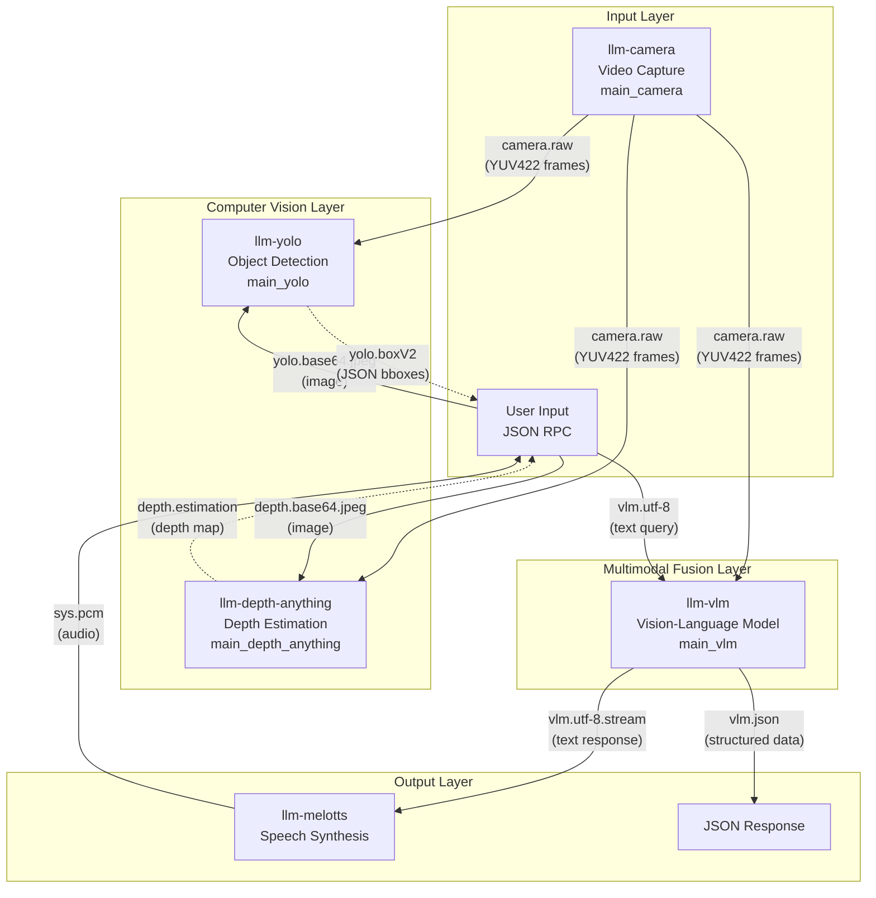
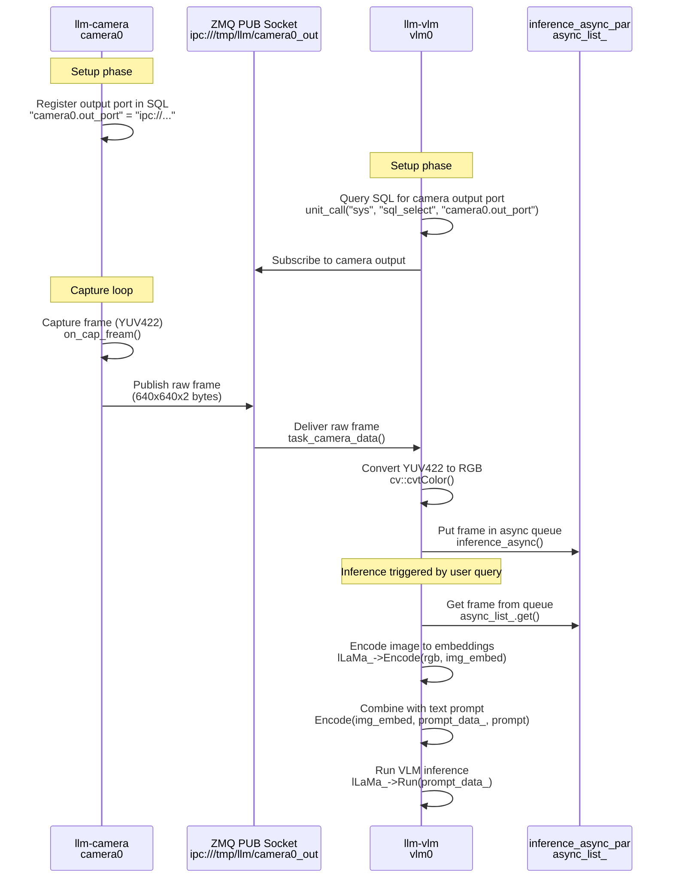
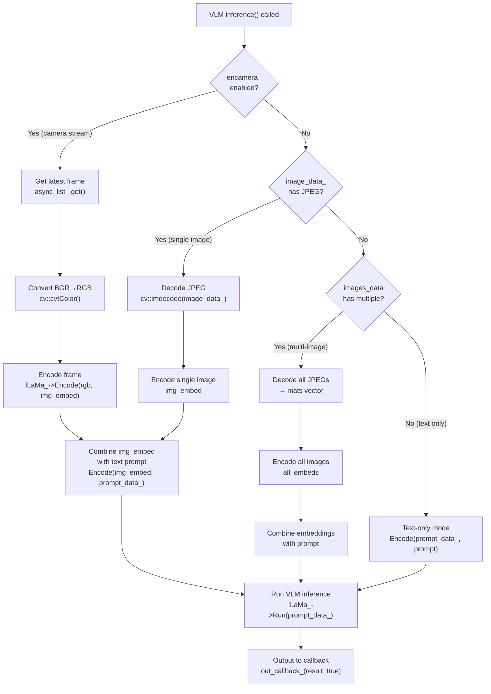
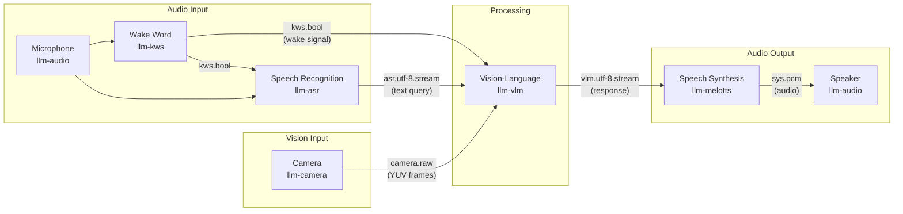
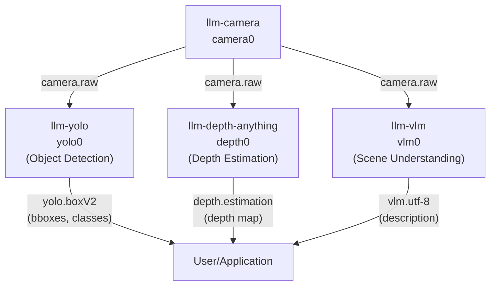

StackFlow Multimodal Vision Pipeline Example

# Multimodal Vision Pipeline Example

<details>
<summary>Relevant source files</summary>

The following files were used as context for generating this wiki page:

- [projects/llm_framework/main_camera/SConstruct](projects/llm_framework/main_camera/SConstruct)
- [projects/llm_framework/main_camera/camera.json](projects/llm_framework/main_camera/camera.json)
- [projects/llm_framework/main_camera/src/axera_camera.c](projects/llm_framework/main_camera/src/axera_camera.c)
- [projects/llm_framework/main_camera/src/axera_camera.h](projects/llm_framework/main_camera/src/axera_camera.h)
- [projects/llm_framework/main_camera/src/camera.h](projects/llm_framework/main_camera/src/camera.h)
- [projects/llm_framework/main_camera/src/main.cpp](projects/llm_framework/main_camera/src/main.cpp)
- [projects/llm_framework/main_camera/src/v4l2_camera.c](projects/llm_framework/main_camera/src/v4l2_camera.c)
- [projects/llm_framework/main_depth_anything/src/EngineWrapper.cpp](projects/llm_framework/main_depth_anything/src/EngineWrapper.cpp)
- [projects/llm_framework/main_depth_anything/src/EngineWrapper.hpp](projects/llm_framework/main_depth_anything/src/EngineWrapper.hpp)
- [projects/llm_framework/main_depth_anything/src/main.cpp](projects/llm_framework/main_depth_anything/src/main.cpp)
- [projects/llm_framework/main_llm/src/main.cpp](projects/llm_framework/main_llm/src/main.cpp)
- [projects/llm_framework/main_llm/src/runner/LLM.hpp](projects/llm_framework/main_llm/src/runner/LLM.hpp)
- [projects/llm_framework/main_melotts/src/runner/EngineWrapper.cpp](projects/llm_framework/main_melotts/src/runner/EngineWrapper.cpp)
- [projects/llm_framework/main_vlm/src/main.cpp](projects/llm_framework/main_vlm/src/main.cpp)
- [projects/llm_framework/main_vlm/src/runner/LLM.hpp](projects/llm_framework/main_vlm/src/runner/LLM.hpp)
- [projects/llm_framework/main_vlm/src/runner/ax_model_runner/ax_model_runner.hpp](projects/llm_framework/main_vlm/src/runner/ax_model_runner/ax_model_runner.hpp)
- [projects/llm_framework/main_whisper/src/runner/EngineWrapper.cpp](projects/llm_framework/main_whisper/src/runner/EngineWrapper.cpp)
- [projects/llm_framework/main_yolo/src/EngineWrapper.cpp](projects/llm_framework/main_yolo/src/EngineWrapper.cpp)
- [projects/llm_framework/main_yolo/src/EngineWrapper.hpp](projects/llm_framework/main_yolo/src/EngineWrapper.hpp)
- [projects/llm_framework/main_yolo/src/main.cpp](projects/llm_framework/main_yolo/src/main.cpp)

</details>


## Purpose and Scope

This document provides a complete walkthrough of building a multimodal vision pipeline that combines camera capture, computer vision processing (object detection and depth estimation), and vision-language model inference for visual question answering. This example demonstrates how to:

- Capture live video frames from a camera
- Process frames through NPU-accelerated CV models (YOLO, Depth-Anything)
- Feed visual data to a Vision-Language Model (VLM) for natural language interaction
- Integrate with the speech pipeline for voice-controlled visual queries

For voice-only interactions without vision, see [Voice Assistant Pipeline Example](#8.3). For individual unit configuration details, see [Unit Setup and Linking](#8.2).

---

## System Architecture Overview

The multimodal vision pipeline consists of four primary units that collaborate through ZMQ message passing:



**Key Integration Points:**

- **Direct ZMQ Subscription**: VLM subscribes directly to camera's output port via SQL query [main_vlm/src/main.cpp:856-868]()
- **Asynchronous Frame Processing**: VLM maintains async frame buffer to handle real-time camera input [main_vlm/src/main.cpp:390-401]()
- **Model Type Detection**: Automatically selects InternVL, InternVL_CTX, or Qwen based on encoder name [main_vlm/src/main.cpp:286-298]()
- **Flexible Input**: Supports camera streams, base64 images, or pure text queries [main_vlm/src/main.cpp:417-444]()

**Sources:** [main_vlm/src/main.cpp](), [main_yolo/src/main.cpp](), [main_camera/src/main.cpp](), [main_depth_anything/src/main.cpp]()

---

## Camera Unit Configuration

The camera unit captures video frames and publishes them via ZMQ. Configuration varies by platform.

### V4L2 Camera Setup (Generic Linux)

```json
{
  "model": "v4l2_camera",
  "response_format": "camera.raw",
  "enoutput": true,
  "input": "camera.v4l2_dev",
  "devname": "/dev/video0",
  "frame_width": 640,
  "frame_height": 640,
  "fps": 30
}
```

### Axera Camera Setup (ax620e/ax620q)

```json
{
  "model": "axera_camera",
  "response_format": "camera.raw",
  "enoutput": true,
  "input": "camera.axera_dev",
  "devname": "/dev/video0",
  "frame_width": 640,
  "frame_height": 640,
  "fps": 30,
  "rtsp": "rtsp://0.0.0.0:8554/live"
}
```

**Key Configuration Fields:**

| Field | Description |
|-------|-------------|
| `response_format` | Output format: `camera.raw` for YUV422, `camera.jpeg.base64` for JPEG |
| `devname` | Video device node |
| `frame_width`/`frame_height` | Output resolution (auto-resized/cropped) |
| `fps` | Target frame rate |
| `rtsp` | Optional RTSP streaming URL (Axera only) |

The camera unit automatically registers its output port in the SQL database, allowing other units to discover and subscribe to it [main_camera/src/main.cpp:582-587]().

**Sources:** [main_camera/src/main.cpp:88-290](), [main_camera/camera.json:1-127]()

---

## YOLO Object Detection Configuration

### Basic Detection Setup

```json
{
  "model": "yolo11n",
  "response_format": "yolo.boxV2",
  "enoutput": true,
  "input": ["camera0.raw"]
}
```

### Model Configuration File (`mode_yolo11n.json`)

```json
{
  "mode_param": {
    "yolo_model": "yolo11n_640x640_ax650.axmodel",
    "img_h": 640,
    "img_w": 640,
    "pron_threshold": 0.45,
    "nms_threshold": 0.45,
    "cls_num": 80,
    "cls_name": ["person", "bicycle", "car", ...],
    "model_type": "detect",
    "npu_type": 0
  }
}
```

**Supported Model Types:**

| `model_type` | Description | Output Fields |
|--------------|-------------|---------------|
| `detect` | Bounding box detection | `class`, `confidence`, `bbox` |
| `segment` | Instance segmentation | + `mask` (polygon points) |
| `pose` | Keypoint detection | + `kps` (keypoint coordinates) |
| `obb` | Oriented bounding boxes | + `angle` (rotation) |

**Integration with Camera:**

The YOLO unit can subscribe to camera output in two ways:

1. **Automatic Link (setup)**: Specify camera in `input` array [main_yolo/src/main.cpp:489-507]()
2. **Dynamic Link (runtime)**: Use `link` RPC with camera work_id [main_yolo/src/main.cpp:542-555]()

Both methods query the camera's output port from SQL and establish ZMQ subscription [main_yolo/src/main.cpp:496-505]().

**Sources:** [main_yolo/src/main.cpp:76-147](), [main_yolo/src/main.cpp:457-520]()

---

## Depth Estimation Configuration

### Basic Setup

```json
{
  "model": "depth_anything_v2",
  "response_format": "depth.estimation",
  "enoutput": true,
  "input": ["camera0.raw"]
}
```

### Model Configuration (`mode_depth_anything_v2.json`)

```json
{
  "mode_param": {
    "depth_anything_model": "depth_anything_v2_vits_640x640_ax650.axmodel",
    "img_h": 640,
    "img_w": 640,
    "model_type": "depth",
    "npu_type": 0
  }
}
```

The depth estimation unit follows the same integration pattern as YOLO, subscribing to camera raw frames and outputting depth maps as base64-encoded binary data [main_depth_anything/src/main.cpp:206-226]().

**Sources:** [main_depth_anything/src/main.cpp:65-131](), [main_depth_anything/src/main.cpp:283-389]()

---

## Vision-Language Model Configuration

### VLM Setup with Camera Integration

```json
{
  "model": "internvl2_5-1b-448px-bf16",
  "response_format": "vlm.utf-8.stream",
  "enoutput": true,
  "prompt": "You are a helpful AI assistant that can see and describe images.",
  "input": ["camera0.raw", "vlm"]
}
```

### Model Configuration Structure

The VLM configuration file specifies model architecture, tokenizer, and inference parameters:

```json
{
  "mode_param": {
    "system_prompt": "You are a helpful assistant.",
    "tokenizer_type": 4,
    "filename_tokenizer_model": "tokenizer.model",
    "filename_tokens_embed": "embed_tokens.weight.bfloat16.bin",
    "filename_image_encoder_axmodel": "vpm_resampler_internvl3_bf16.axmodel",
    "filename_post_axmodel": "post.axmodel",
    "template_filename_axmodel": "internvl2_l%d.axmodel",
    "axmodel_num": 16,
    "tokens_embed_num": 151936,
    "tokens_embed_size": 1024,
    "img_token_id": 151667,
    "max_token_len": 127,
    "precompute_len": 0,
    "vpm_width": 448,
    "vpm_height": 448,
    "enable_temperature": true,
    "temperature": 0.7
  }
}
```

**Model Type Selection:**

The VLM unit automatically detects model architecture from the encoder filename [main_vlm/src/main.cpp:286-298]():

| Encoder Pattern | Model Type | Features |
|----------------|------------|----------|
| Contains "qwen3" | `Qwen` | Video support, multi-image, position IDs |
| Contains "internvl3" + `precompute_len > 0` | `InternVL_CTX` | Context caching, multi-turn dialogue |
| Contains "internvl3" or "vpm" | `InternVL` | Single-image VQA |

**Sources:** [main_vlm/src/main.cpp:161-377](), [projects/llm_framework/main_vlm/src/runner/LLM.hpp:27-91]()

---

## Data Flow and Message Formats

### Camera → VLM Raw Frame Flow



**Frame Processing Details:**

1. **Camera Capture** [main_camera/src/main.cpp:115-172]():
   - Captures YUV422 frames at specified resolution
   - Applies letterbox/crop transformation if needed
   - Publishes via ZMQ immediately

2. **VLM Reception** [main_vlm/src/main.cpp:790-805]():
   - Receives raw YUV data (width × height × 2 bytes)
   - Validates frame size
   - Converts YUV422 to RGB24

3. **Asynchronous Buffering** [main_vlm/src/main.cpp:392-401]():
   - Maintains 1-frame buffer (discards old frames)
   - Prevents inference backlog from blocking capture

**Sources:** [main_vlm/src/main.cpp:790-805](), [main_vlm/src/main.cpp:392-401](), [main_camera/src/main.cpp:115-172]()

### VLM Input Processing Logic



**Image Input Formats:**

The VLM unit accepts multiple input formats [main_vlm/src/main.cpp:750-755]():

1. **Base64 JPEG**: User sends `vlm.base64.jpeg` with encoded image
2. **Raw YUV422**: Direct camera subscription (640×640×2 bytes)
3. **Multiple images**: Array of base64 JPEGs for multi-image reasoning

**Sources:** [main_vlm/src/main.cpp:414-538](), [main_vlm/src/main.cpp:750-756]()

---

## Complete Setup and Execution

### Step-by-Step Configuration

**1. Start the System Controller**

```bash
systemctl start llm-sys
```

**2. Setup Camera Unit**

```json
{
  "request_id": "1",
  "action": "setup",
  "work_id": "camera0",
  "object": "camera",
  "data": {
    "model": "v4l2_camera",
    "response_format": "camera.raw",
    "enoutput": true,
    "input": "camera.v4l2_dev",
    "devname": "/dev/video0",
    "frame_width": 640,
    "frame_height": 640,
    "fps": 10
  }
}
```

**3. Setup VLM Unit with Camera Link**

```json
{
  "request_id": "2",
  "action": "setup",
  "work_id": "vlm0",
  "object": "vlm",
  "data": {
    "model": "internvl2_5-1b-448px-bf16",
    "response_format": "vlm.utf-8.stream",
    "enoutput": true,
    "prompt": "You are a helpful AI vision assistant.",
    "input": ["camera0.raw", "vlm"]
  }
}
```

The VLM automatically:
- Queries SQL for `camera0.out_port` [main_vlm/src/main.cpp:859]()
- Subscribes to camera's ZMQ output [main_vlm/src/main.cpp:863-867]()
- Begins buffering frames asynchronously

**4. Setup YOLO for Object Detection (Optional)**

```json
{
  "request_id": "3",
  "action": "setup",
  "work_id": "yolo0",
  "object": "yolo",
  "data": {
    "model": "yolo11n",
    "response_format": "yolo.boxV2",
    "enoutput": true,
    "input": ["camera0.raw"]
  }
}
```

**5. Start Camera Capture**

```json
{
  "request_id": "4",
  "action": "work",
  "work_id": "camera0",
  "object": "camera",
  "data": "start"
}
```

Camera begins publishing frames to all subscribers (VLM, YOLO, etc.).

**6. Query the VLM**

```json
{
  "request_id": "5",
  "action": "work",
  "work_id": "vlm0",
  "object": "vlm.utf-8",
  "data": "What objects do you see in the image?"
}
```

**Response (Streaming):**

```json
{
  "request_id": "5",
  "work_id": "vlm0",
  "object": "vlm.utf-8.stream",
  "data": {
    "index": 0,
    "delta": "I can see ",
    "finish": false
  },
  "error": {"code": 0, "message": "ok"}
}
```

**Sources:** [main_vlm/src/main.cpp:807-881](), [main_camera/src/main.cpp:457-521]()

---

## Advanced Integration Scenarios

### Scenario 1: Voice-Controlled Visual Query

Combine camera, VLM, ASR, KWS, and TTS for hands-free visual interaction.



**Setup Configuration:**

```json
{
  "request_id": "1",
  "action": "setup",
  "work_id": "vlm0",
  "object": "vlm",
  "data": {
    "model": "internvl2_5-1b-448px-bf16",
    "response_format": "vlm.utf-8.stream",
    "enoutput": true,
    "prompt": "You are a helpful AI assistant.",
    "input": ["camera0.raw", "asr0.utf-8.stream", "kws0.bool", "vlm"]
  }
}
```

**Workflow:**

1. User says wake word → KWS triggers [main_vlm/src/main.cpp:776-788]()
2. KWS sends `kws.bool` signal to VLM, stopping any ongoing inference
3. User asks question → ASR streams text to VLM [main_vlm/src/main.cpp:758-774]()
4. When ASR finishes (`"finish": true`), VLM:
   - Grabs latest camera frame from async buffer
   - Encodes image to embeddings
   - Combines with ASR text
   - Runs inference
5. VLM streams response to TTS for immediate audio output

**Sources:** [main_vlm/src/main.cpp:840-869](), [main_vlm/src/main.cpp:758-788]()

### Scenario 2: Multi-Image Context Conversations

Use InternVL_CTX model for multi-turn dialogues with multiple images.

```json
{
  "model": "internvl2_5-1b-448px-bf16-ctx",
  "response_format": "vlm.utf-8.stream",
  "enoutput": true,
  "prompt": "You are a helpful assistant.",
  "input": ["vlm"]
}
```

**Key Configuration:**
- `precompute_len > 0` in model config enables context mode [main_vlm/src/main.cpp:292]()
- System prompt is cached in KV cache [main_vlm/src/main.cpp:347-368]()

**Multi-Image Query:**

```json
{
  "action": "work",
  "work_id": "vlm0",
  "object": "vlm.base64.jpeg",
  "data": "..." 
}
```

Send multiple `vlm.base64.jpeg` messages, then final text query. The VLM accumulates images in `images_data` vector [main_vlm/src/main.cpp:752]() and processes them together [main_vlm/src/main.cpp:470-506]().

**Context Management:**

- **KV Cache**: Stores conversation history [main_vlm/src/main.cpp:459-467]()
- **Reset**: Send `"reset"` to clear context [main_vlm/src/main.cpp:448-455]()
- **Auto-reset**: Context automatically resets when full [main_vlm/src/main.cpp:497-502]()

**Sources:** [main_vlm/src/main.cpp:447-507](), [projects/llm_framework/main_vlm/src/runner/LLM.hpp:322-507]()

### Scenario 3: Parallel CV Processing

Run YOLO and depth estimation simultaneously on camera stream, with VLM for high-level understanding.

**Architecture:**



All three units process the same frame independently. YOLO and depth provide structured data, while VLM provides natural language understanding. This enables applications to:

- Combine bounding boxes with depth for 3D localization
- Use object classes to focus VLM attention
- Generate rich scene descriptions with spatial information

Each unit's async processing prevents blocking [main_yolo/src/main.cpp:200-223](), [main_depth_anything/src/main.cpp:181-210](), [main_vlm/src/main.cpp:392-401]().

**Sources:** [main_yolo/src/main.cpp:457-520](), [main_depth_anything/src/main.cpp:283-389](), [main_vlm/src/main.cpp:807-881]()

### Scenario 4: Video Understanding with Qwen

The Qwen VLM variant supports temporal video understanding with multi-frame processing.

**Configuration:**

```json
{
  "mode_param": {
    "b_video": true,
    "vision_config": {
      "temporal_patch_size": 2,
      "tokens_per_second": 2,
      "spatial_merge_size": 2,
      "fps": 10
    }
  }
}
```

**Video Processing Flow:**

1. Send multiple sequential frames as base64 JPEGs
2. Qwen processes with temporal attention [main_vlm/src/main.cpp:526-530]()
3. Generates position IDs and visual masks for temporal structure [main_vlm/src/main.cpp:528-529]()
4. Outputs understanding of motion and temporal events

**Sources:** [main_vlm/src/main.cpp:509-534](), [main_vlm/src/main.cpp:220-227]()

---

## Performance Considerations

### Frame Rate Matching

**Camera FPS vs. Inference Latency:**

| Component | Typical Latency | Notes |
|-----------|----------------|-------|
| Camera capture | 33ms @ 30fps | Hardware-limited |
| YOLO detection | 20-50ms | Model-dependent |
| Depth estimation | 30-60ms | Model-dependent |
| VLM inference | 2-5 seconds | Token generation is sequential |

**Best Practices:**

1. **Async Buffering**: VLM uses 1-frame buffer, discarding old frames [main_vlm/src/main.cpp:394-398]()
2. **Reduce Camera FPS**: Use 5-10 fps for VLM to avoid unnecessary frame drops
3. **Parallel Processing**: YOLO/Depth can run at full camera FPS independently

### NPU Resource Management

Multiple units share NPU resources via VNPU configuration:

```json
{
  "npu_type": 0,  
  "npuMode": 0    
}
```

**Resource Allocation:**

- YOLO: Lightweight detection (2-3 MB models)
- Depth: Medium complexity (29 MB models)
- VLM: Heavy (300 MB - 1.2 GB models)

The framework automatically serializes NPU access via `AX_ENGINE_Init` [main_yolo/src/main.cpp:291-299]().

**Sources:** [main_vlm/src/main.cpp:588-602](), [main_yolo/src/EngineWrapper.cpp:182-316]()

---

## Troubleshooting

### Common Issues

**1. Camera Not Publishing Frames**

Check SQL registration:
```json
{
  "action": "work",
  "work_id": "sys",
  "object": "sys.sql_select",
  "data": "camera0.out_port"
}
```

Should return ZMQ URL like `ipc:///tmp/llm/camera0_out`.

**2. VLM Not Receiving Camera Frames**

Verify subscription in setup response. Check that `encamera_` flag is set [main_vlm/src/main.cpp:857]().

**3. Frame Size Mismatch**

VLM expects exactly `width × height × 2` bytes for YUV422. Validate in `inference_raw_yuv()` [main_vlm/src/main.cpp:403-412]().

**4. Out of Memory**

Large models require significant RAM:
- InternVL 1B: ~1.2 GB
- Qwen 3B: ~3 GB

Reduce `max_token_len` or use smaller model variants.

**5. NPU Initialization Failure**

Multiple units call `AX_SYS_Init()`. Reference counting ensures proper initialization [main_vlm/src/main.cpp:588-602]().

**Sources:** [main_vlm/src/main.cpp:403-412](), [main_vlm/src/main.cpp:588-602]()

---

## Summary

This multimodal vision pipeline demonstrates the power of StackFlow's modular architecture:

- **Flexible Integration**: Units connect via ZMQ with minimal coupling
- **Parallel Processing**: Multiple CV models process frames independently
- **Real-time Performance**: Async buffering and NPU acceleration enable responsive interaction
- **Extensible Design**: Add new vision models or processing stages by creating new units

Key implementation files:
- VLM: [main_vlm/src/main.cpp](), [projects/llm_framework/main_vlm/src/runner/LLM.hpp]()
- YOLO: [main_yolo/src/main.cpp](), [main_yolo/src/EngineWrapper.cpp]()
- Camera: [main_camera/src/main.cpp]()
- Depth: [main_depth_anything/src/main.cpp]()

For extending this pipeline with custom models, see [Model Integration](#10.2).