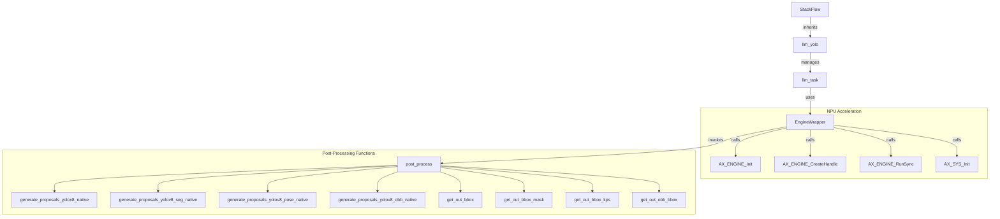
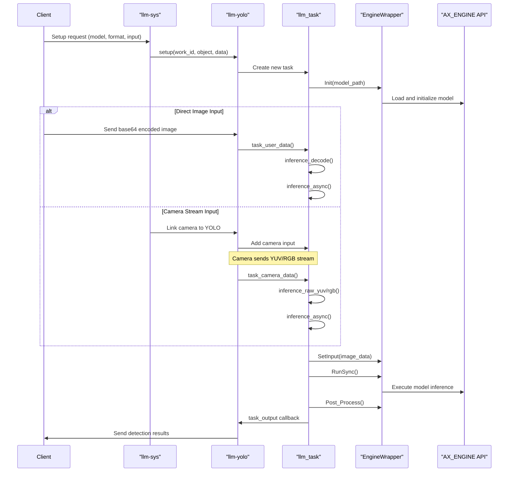
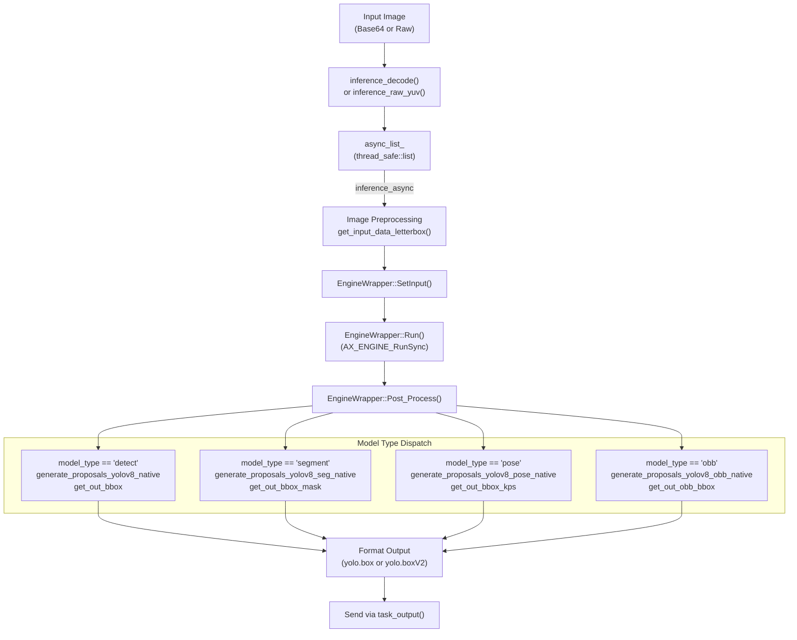

StackFlow Object Detection (llm-yolo)

# Object Detection (llm-yolo)

<details>
<summary>Relevant source files</summary>

The following files were used as context for generating this wiki page:

- [projects/llm_framework/main_depth_anything/src/EngineWrapper.cpp](projects/llm_framework/main_depth_anything/src/EngineWrapper.cpp)
- [projects/llm_framework/main_depth_anything/src/EngineWrapper.hpp](projects/llm_framework/main_depth_anything/src/EngineWrapper.hpp)
- [projects/llm_framework/main_depth_anything/src/main.cpp](projects/llm_framework/main_depth_anything/src/main.cpp)
- [projects/llm_framework/main_melotts/src/runner/EngineWrapper.cpp](projects/llm_framework/main_melotts/src/runner/EngineWrapper.cpp)
- [projects/llm_framework/main_whisper/src/runner/EngineWrapper.cpp](projects/llm_framework/main_whisper/src/runner/EngineWrapper.cpp)
- [projects/llm_framework/main_yolo/src/EngineWrapper.cpp](projects/llm_framework/main_yolo/src/EngineWrapper.cpp)
- [projects/llm_framework/main_yolo/src/EngineWrapper.hpp](projects/llm_framework/main_yolo/src/EngineWrapper.hpp)
- [projects/llm_framework/main_yolo/src/main.cpp](projects/llm_framework/main_yolo/src/main.cpp)

</details>


The `llm-yolo` unit provides NPU-accelerated object detection, instance segmentation, pose estimation, and oriented bounding box (OBB) detection using YOLO models. It inherits from the `StackFlow` base class and integrates with the StackFlow framework to provide real-time computer vision capabilities on AXERA platforms.

## Architecture and Class Structure

**Class Hierarchy Diagram**



Sources: [projects/llm_framework/main_yolo/src/main.cpp:345-651](), [projects/llm_framework/main_yolo/src/EngineWrapper.cpp:427-483]()

### Core Classes

#### `llm_yolo` Class

Main service class inheriting from `StackFlow`. Manages multiple concurrent YOLO tasks (default limit: 2 tasks per unit).

**Key Members:**
- `task_count_`: Maximum number of concurrent tasks (set to 2)
- `llm_task_`: Map of work_id to `llm_task` instances
- RPC handlers: `setup()`, `link()`, `unlink()`, `exit()`, `taskinfo()`

**Key Methods:**
- `task_output()`: Formats and sends detection results via ZMQ channels
- `task_user_data()`: Handles base64-encoded image input
- `task_camera_data()`: Handles raw camera stream input

Sources: [projects/llm_framework/main_yolo/src/main.cpp:345-651]()

#### `llm_task` Class

Represents a single YOLO detection instance. Maintains model configuration, inference state, and asynchronous processing queue.

**Key Members:**
- `mode_config_`: `yolo_config` struct containing model parameters
- `yolo_`: `unique_ptr<EngineWrapper>` for NPU model execution
- `async_list_`: `thread_safe::list<inference_async_par>` for async inference queue
- `inference_run_`: Dedicated thread processing inference queue

**Key Methods:**
- `load_model()`: Loads model configuration and initializes `EngineWrapper`
- `inference()`: Executes inference and post-processing pipeline
- `inference_async()`: Enqueues inference request (queue depth: 3)
- `run()`: Thread function processing inference queue

Sources: [projects/llm_framework/main_yolo/src/main.cpp:59-341]()

#### `EngineWrapper` Class

NPU abstraction layer wrapping AX_ENGINE API. Handles model loading, I/O management, and post-processing dispatch.

**Key Members:**
- `m_handle`: `AX_ENGINE_HANDLE` for model instance
- `m_io_info`: `AX_ENGINE_IO_INFO_T*` containing model I/O metadata
- `m_io`: `AX_ENGINE_IO_T` containing actual I/O buffers
- `m_input_num`, `m_output_num`: Number of model inputs/outputs

**Key Methods:**
- `Init()`: Loads model, creates handle, allocates I/O buffers
- `SetInput()`: Copies data to NPU input buffer
- `Run()`: Executes `AX_ENGINE_RunSync()`
- `GetOutputPtr()`: Returns pointer to NPU output buffer
- `Post_Process()`: Dispatches to appropriate post-processing function based on `model_type`

Sources: [projects/llm_framework/main_yolo/src/EngineWrapper.hpp:35-70](), [projects/llm_framework/main_yolo/src/EngineWrapper.cpp:182-492]()

## Model Types and Task Variants

The `llm-yolo` unit supports four task types via the `model_type` parameter in `yolo_config`. Each type has distinct post-processing logic.

| Task Type | `model_type` | Output Tensors | Post-Processing Function | Output Data |
|-----------|--------------|----------------|--------------------------|-------------|
| **Detection** | `"detect"` | 3 outputs (stride 8/16/32) | `generate_proposals_yolov8_native()` + `get_out_bbox()` | Bounding boxes, class labels, confidence scores |
| **Segmentation** | `"segment"` | 6 outputs (3 detection + 3 mask features) + 1 proto mask | `generate_proposals_yolov8_seg_native()` + `get_out_bbox_mask()` | Boxes + per-instance segmentation masks |
| **Pose Estimation** | `"pose"` | 6 outputs (3 detection + 3 keypoint features) | `generate_proposals_yolov8_pose_native()` + `get_out_bbox_kps()` | Boxes + keypoint coordinates (e.g., 17 for human, 21 for hand) |
| **Oriented Bounding Box** | `"obb"` | 1 output with rotated box predictions | `generate_proposals_yolov8_obb_native()` + `get_out_obb_bbox()` | Rotated boxes with angle parameter |

Sources: [projects/llm_framework/main_yolo/src/EngineWrapper.cpp:427-483](), [projects/llm_framework/main_yolo/src/main.cpp:33-44]()

### Task Type Implementation Details

#### Detection (`model_type = "detect"`)

Standard object detection pipeline:

1. **Proposal Generation**: Iterates over 3 output tensors (strides: 8, 16, 32)
2. **Function**: `generate_proposals_yolov8_native(stride, feat_ptr, prob_threshold, proposals, input_w, input_h, cls_num)`
3. **Filtering**: `get_out_bbox(proposals, objects, nms_threshold, input_h, input_w, mat.rows, mat.cols)` applies NMS
4. **Output**: `detection::Object` with `rect`, `label`, `prob`

Sources: [projects/llm_framework/main_yolo/src/EngineWrapper.cpp:433-441]()

#### Segmentation (`model_type = "segment"`)

Detection with per-instance masks:

1. **Proposal Generation**: Processes 3 detection outputs + 3 mask feature outputs
   - Detection outputs: Class predictions and box coordinates
   - Mask feature outputs: Per-instance mask embeddings (32 dimensions)
2. **Function**: `generate_proposals_yolov8_seg_native(stride, feat_ptr, feat_seg_ptr, prob_threshold, proposals, input_w, input_h, cls_num)`
3. **Mask Decoding**: 
   - Reads prototype mask tensor (output[6]): Shape [32, 4, H/4, W/4]
   - `get_out_bbox_mask(proposals, objects, mask_proto_ptr, 32, 4, nms_threshold, input_h, input_w, mat.rows, mat.cols)`
   - Applies NMS and generates instance masks
4. **Output**: `detection::Object` with `rect`, `label`, `prob`, `mask_feat` (vector of 32 floats)

Sources: [projects/llm_framework/main_yolo/src/EngineWrapper.cpp:442-457]()

#### Pose Estimation (`model_type = "pose"`)

Detection with keypoint localization:

1. **Proposal Generation**: Processes 3 detection outputs + 3 keypoint feature outputs
   - Detection outputs: Class predictions and box coordinates
   - Keypoint outputs: Per-instance keypoint coordinates and visibility scores
2. **Function**: `generate_proposals_yolov8_pose_native(stride, feat_ptr, feat_kps_ptr, prob_threshold, proposals, input_h, input_w, point_num, cls_num)`
3. **Keypoint Processing**: 
   - `point_num` specifies number of keypoints (17 for COCO human pose, 21 for hand pose)
   - `get_out_bbox_kps(proposals, objects, nms_threshold, input_h, input_w, mat.rows, mat.cols)` applies NMS
4. **Output**: `detection::Object` with `rect`, `label`, `prob`, `kps_feat` (vector of `point_num * 3` floats: x, y, visibility)

Sources: [projects/llm_framework/main_yolo/src/EngineWrapper.cpp:458-472](), [projects/llm_framework/main_yolo/src/main.cpp:40-41]()

#### Oriented Bounding Box (`model_type = "obb"`)

Rotated box detection for aerial/satellite imagery:

1. **Grid Generation**: Creates grid and stride structure
   - `generate_grids_and_stride(input_w, input_h, strides, grid_strides)` with strides [8, 16, 32]
2. **Proposal Generation**: Single output tensor with rotated box predictions
   - `generate_proposals_yolov8_obb_native(grid_strides, feat_ptr, prob_threshold, proposals, input_w, input_h, cls_num)`
3. **NMS**: `get_out_obb_bbox(proposals, objects, nms_threshold, input_h, input_w, mat.rows, mat.cols)`
4. **Output**: `detection::Object` with `rect`, `label`, `prob`, `angle` (rotation angle)

Sources: [projects/llm_framework/main_yolo/src/EngineWrapper.cpp:473-482]()

## Operation Flow

The following diagram illustrates the operation flow of the YOLO object detection module:



Sources: [projects/llm_framework/main_yolo/src/main.cpp:460-522](), [projects/llm_framework/main_yolo/src/main.cpp:161-195](), [projects/llm_framework/main_yolo/src/main.cpp:222-286]()

## Configuration and Model Loading

### Configuration Structure

The `yolo_config` struct (defined in `llm_task`) contains runtime parameters:

```cpp
typedef struct {
    std::string yolo_model;        // Path to .axmodel file
    std::string model_type = "detect";  // "detect", "segment", "pose", or "obb"
    std::vector<std::string> cls_name;  // Class names (80 for COCO)
    int img_h = 640;               // Model input height
    int img_w = 640;               // Model input width
    int cls_num = 80;              // Number of classes
    int point_num = 17;            // Number of keypoints (pose only)
    float pron_threshold = 0.45f;  // Confidence threshold
    float nms_threshold = 0.45;    // NMS IoU threshold
    uint32_t npu_type = 0;         // VNPU configuration
} yolo_config;
```

Sources: [projects/llm_framework/main_yolo/src/main.cpp:33-44]()

### Model Configuration Files

Configuration files use the `CONFIG_AUTO_SET` macro to merge setup parameters with file defaults:

```cpp
#define CONFIG_AUTO_SET(obj, key)             \
    if (config_body.contains(#key))           \
        mode_config_.key = config_body[#key]; \
    else if (obj.contains(#key))              \
        mode_config_.key = obj[#key];
```

**Parameter Precedence**: `setup()` JSON > config file JSON > struct defaults

**Loading Process** (`load_model()`):
1. Parse input JSON (`parse_config()`) to extract `model`, `response_format`, `enoutput`, `input`
2. Locate config file via `get_config_file_paths(base_model_path_, base_model_config_path_, model_)`
3. Read config JSON and apply `CONFIG_AUTO_SET` for each parameter
4. Prepend model path: `mode_config_.yolo_model = base_model + mode_config_.yolo_model`
5. Initialize EngineWrapper: `yolo_->Init(mode_config_.yolo_model.c_str(), 0, mode_config_.npu_type)`

Sources: [projects/llm_framework/main_yolo/src/main.cpp:100-147](), [projects/llm_framework/main_yolo/src/main.cpp:53-57]()

### Configuration Parameters

| Parameter | Type | Purpose | Example Values |
|-----------|------|---------|----------------|
| `yolo_model` | string | Model filename (relative to model directory) | `"yolo11n.axmodel"` |
| `model_type` | string | Task type selector | `"detect"`, `"segment"`, `"pose"`, `"obb"` |
| `img_h`, `img_w` | int | Model input dimensions | 320, 640 (must match trained model) |
| `cls_num` | int | Number of detection classes | 80 (COCO), 15 (OBB) |
| `point_num` | int | Keypoints per instance (pose only) | 17 (human), 21 (hand) |
| `pron_threshold` | float | Minimum confidence for proposals | 0.25–0.50 (lower = more detections) |
| `nms_threshold` | float | IoU threshold for NMS | 0.45–0.70 (higher = more overlapping boxes) |
| `cls_name` | vector<string> | Class label names | `["person", "bicycle", ...]` |
| `npu_type` | uint32_t | VNPU selection bitmask | 0 (default), `AX_STD_VNPU_2`, etc. |

Sources: [projects/llm_framework/main_yolo/src/main.cpp:33-44]()

### Example Configuration JSON

**Detection Model** (`mode_yolo11n.json`):
```json
{
  "mode": "yolo11n",
  "type": "cv",
  "capabilities": ["Detection"],
  "input_type": ["yolo.jpeg.base64"],
  "output_type": ["yolo.box", "yolo.boxV2"],
  "mode_param": {
    "yolo_model": "yolo11n.axmodel",
    "model_type": "detect",
    "img_h": 320,
    "img_w": 320,
    "cls_num": 80,
    "pron_threshold": 0.45,
    "nms_threshold": 0.45,
    "cls_name": ["person", "bicycle", "car", ...]
  }
}
```

**Pose Model** (`mode_yolo11n-pose.json`):
```json
{
  "mode_param": {
    "yolo_model": "yolo11n-pose.axmodel",
    "model_type": "pose",
    "img_h": 640,
    "img_w": 640,
    "cls_num": 1,
    "point_num": 17,
    "pron_threshold": 0.25,
    "nms_threshold": 0.65,
    "cls_name": ["person"]
  }
}
```

Sources: Configuration files referenced in project directory

## Input and Output Processing

### Input Formats

The YOLO module accepts two main types of input:

1. **Base64-encoded images**: Used for direct image input through API calls
   - Format: `yolo.jpeg.base64`
   - Processing method: `inference_decode()` and `inference_async()`

2. **Raw camera streams**: Used when connected to a camera module
   - Formats: Raw YUV (YUYV), RGB, or BGR data
   - Processing methods: `inference_raw_yuv()`, `inference_raw_rgb()`, or `inference_raw_bgr()`

Sources: [projects/llm_framework/main_yolo/src/main.cpp:161-195]()

### Output Formats

Detection results are formatted according to the specified response format:

1. **yolo.box**: Standard format with text-based values
   - Class name as string
   - Confidence as formatted string with 2 decimal places
   - Bounding box coordinates as formatted strings

2. **yolo.boxV2**: Raw numeric format suitable for further processing
   - Class name as string
   - Confidence as raw float value
   - Bounding box as numeric array [x, y, width, height]
   - Additional data for segmentation masks or keypoints when available

Sources: [projects/llm_framework/main_yolo/src/main.cpp:238-280]()

## Inference Pipeline

**Complete Inference Flow**



Sources: [projects/llm_framework/main_yolo/src/main.cpp:225-289](), [projects/llm_framework/main_yolo/src/EngineWrapper.cpp:427-483]()

### Step-by-Step Pipeline

#### 1. Image Input and Decoding

Three input paths supported:

| Input Type | Function | Processing |
|------------|----------|------------|
| Base64 JPEG | `inference_decode()` | `cv::imdecode()` decodes to `cv::Mat` |
| Raw YUV (YUYV) | `inference_raw_yuv()` | `cv::cvtColor(YUV2RGB_YUYV)` converts to RGB |
| Raw RGB/BGR | `inference_raw_rgb()` / `inference_raw_bgr()` | Wraps raw buffer as `cv::Mat` |

Sources: [projects/llm_framework/main_yolo/src/main.cpp:164-198]()

#### 2. Asynchronous Queueing

- **Function**: `inference_async(cv::Mat &src, bool bgr2rgb)`
- **Queue**: `thread_safe::list<inference_async_par>` with max depth of 3
- **Behavior**: If queue full, drops frame and logs error
- **Thread**: Dedicated `inference_run_` thread calls `run()` to process queue

Sources: [projects/llm_framework/main_yolo/src/main.cpp:212-223](), [projects/llm_framework/main_yolo/src/main.cpp:200-210]()

#### 3. Image Preprocessing

**Letterboxing and Resizing**:
- **Function**: `common::get_input_data_letterbox(src, image, img_h, img_w, bgr2rgb)`
- **Purpose**: Resizes image to model input size (e.g., 320×320) while maintaining aspect ratio
- **Output**: `std::vector<uint8_t>` with RGB pixel data
- **Color Conversion**: Optional BGR→RGB conversion based on `bgr2rgb` flag

Sources: [projects/llm_framework/main_yolo/src/main.cpp:229-230]()

#### 4. NPU Execution

```cpp
yolo_->SetInput((void *)image.data(), 0);  // Copy to NPU input buffer
if (0 != yolo_->Run()) {                    // Execute AX_ENGINE_RunSync
    throw std::string("yolo_ RunSync error");
}
```

- **SetInput**: Copies preprocessed image to NPU input buffer via `utils::push_io_input()`
- **Run**: Executes `AX_ENGINE_RunSync(m_handle, &m_io)` for synchronous inference
- **Output**: Model produces output tensors in `m_io.pOutputs[]`

Sources: [projects/llm_framework/main_yolo/src/main.cpp:232-236](), [projects/llm_framework/main_yolo/src/EngineWrapper.cpp:324-336]()

#### 5. Post-Processing and NMS

**Post-Processing Dispatch**:
```cpp
void post_process(AX_ENGINE_IO_INFO_T* io_info, AX_ENGINE_IO_T* io_data, const cv::Mat& mat,
                  int& input_w, int& input_h, int& cls_num, int& point_num,
                  float& prob_threshold, float& nms_threshold,
                  std::vector<detection::Object>& objects, std::string& model_type)
```

The function branches based on `model_type`:

**For Detection**:
1. Iterate over 3 output tensors (strides 8, 16, 32)
2. Call `generate_proposals_yolov8_native()` to extract proposals above `prob_threshold`
3. Call `get_out_bbox()` to apply NMS with `nms_threshold` and scale boxes to original image size

**For Segmentation**:
1. Process 6 detection/mask outputs + 1 prototype mask tensor
2. Call `generate_proposals_yolov8_seg_native()` to extract proposals with mask features
3. Call `get_out_bbox_mask()` to apply NMS and decode instance masks using prototype tensor

**For Pose**:
1. Process 6 detection/keypoint outputs
2. Call `generate_proposals_yolov8_pose_native()` to extract proposals with keypoint features
3. Call `get_out_bbox_kps()` to apply NMS and scale keypoints to original image size

**For OBB**:
1. Generate grid structure for single output tensor
2. Call `generate_proposals_yolov8_obb_native()` to extract rotated box proposals
3. Call `get_out_obb_bbox()` to apply rotated NMS and scale boxes

Sources: [projects/llm_framework/main_yolo/src/EngineWrapper.cpp:427-483](), [projects/llm_framework/main_yolo/src/main.cpp:238-240]()

#### 6. Output Formatting

Two response formats supported:

**`yolo.boxV2` (Raw Format)**:
```json
{
  "class": "person",
  "confidence": 0.923,
  "bbox": [100.5, 200.3, 150.2, 300.8],
  "mask": [0.1, 0.2, ...],      // Only for segment
  "kps": [x1, y1, v1, ...],      // Only for pose
  "angle": 45.2                  // Only for obb
}
```

**`yolo.box` (Formatted String)**:
```json
{
  "class": "person",
  "confidence": "0.92",
  "bbox": ["100.50", "200.30", "250.70", "501.10"],
  "mask": ["0.10", "0.20", ...],
  "kps": ["120.50", "230.30", ...],
  "angle": 45.2
}
```

- **Formatting**: `format_float(value, 2)` converts floats to strings with 2 decimal places
- **Streaming**: If `enstream_` is true, outputs are sent incrementally via `task_output()` callback

Sources: [projects/llm_framework/main_yolo/src/main.cpp:242-283](), [projects/llm_framework/main_yolo/src/main.cpp:149-157]()

## Integration with StackFlow

### Task Management

The YOLO module integrates with StackFlow's task management system through the following methods:

1. **setup**: Creates a new YOLO task
   - Parses the configuration data
   - Loads the specified model
   - Configures input and output channels
   - Sources: [projects/llm_framework/main_yolo/src/main.cpp:460-522]()

2. **link**: Connects the task to input sources
   - Can link to direct input or camera streams
   - Subscribes to the appropriate ZMQ endpoint
   - Sources: [projects/llm_framework/main_yolo/src/main.cpp:525-566]()

3. **unlink**: Removes connections to input sources
   - Sources: [projects/llm_framework/main_yolo/src/main.cpp:568-591]()

4. **taskinfo**: Provides information about the task
   - Returns task configuration and status
   - Sources: [projects/llm_framework/main_yolo/src/main.cpp:593-618]()

5. **exit**: Terminates the task
   - Stops the inference thread
   - Cleans up resources
   - Sources: [projects/llm_framework/main_yolo/src/main.cpp:620-638]()

### Hardware Acceleration

The YOLO module leverages AXERA acceleration hardware through the AX_ENGINE and AX_SYS APIs:

- Initializes the AI engine with appropriate NPU attributes
- Manages model loading and hardware resource allocation
- Optimizes inference execution on the available NPUs
- Handles memory management for efficient data transfer

Sources: [projects/llm_framework/main_yolo/src/main.cpp:288-314](), [projects/llm_framework/main_yolo/src/EngineWrapper.cpp:108-234]()

## Model Capabilities

The YOLO module supports different types of computer vision tasks:

### Object Detection

Standard object detection provides:
- Object classification (80 classes for COCO-trained models)
- Bounding box coordinates (x, y, width, height)
- Confidence scores for each detection

Sources: [projects/llm_framework/main_yolo/mode_yolo11n.json]()

### Instance Segmentation

Extends object detection with:
- Pixel-level masks for detected objects
- Mask features that define object boundaries with precision

Sources: [projects/llm_framework/main_yolo/mode_yolo11n-seg.json]()

### Pose Estimation

Specialized for human pose detection:
- Detects people in the image
- Provides 17 keypoints for body pose (standard COCO keypoints)
- Enables skeletal tracking and pose analysis

Sources: [projects/llm_framework/main_yolo/mode_yolo11n-pose.json]()

### Hand Pose Detection

Specialized for hand tracking:
- Detects hands in the image
- Provides 21 keypoints for finger tracking
- Enables gesture recognition applications

Sources: [projects/llm_framework/main_yolo/mode_yolo11n-hand-pose.json]()

## Usage in Applications

The YOLO object detection module can be used in various applications, including:

1. **Smart camera systems**: Real-time object detection for security or monitoring
2. **Human-computer interaction**: Using pose estimation for gesture control
3. **Robotics**: Environmental perception and object recognition
4. **Augmented reality**: Object and hand tracking for AR applications
5. **Visual assistants**: Combined with VLM for visual understanding and assistance

For visual understanding with language models, see [Vision-Language Models (VLM)](#3.2).