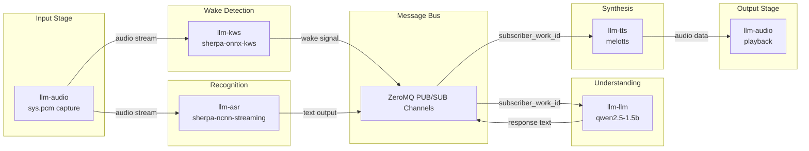

StackFlow Overview

# Overview

<details>
<summary>Relevant source files</summary>

The following files were used as context for generating this wiki page:

- [README.md](README.md)
- [README_zh.md](README_zh.md)
- [doc/component_doc/StackFlow_en.md](doc/component_doc/StackFlow_en.md)
- [doc/component_doc/StackFlow_zh.md](doc/component_doc/StackFlow_zh.md)
- [ext_components/StackFlow/stackflow/pzmq.hpp](ext_components/StackFlow/stackflow/pzmq.hpp)
- [ext_components/ax_msp/Kconfig](ext_components/ax_msp/Kconfig)
- [projects/llm_framework/README.md](projects/llm_framework/README.md)
- [projects/llm_framework/SConstruct](projects/llm_framework/SConstruct)
- [projects/llm_framework/config_defaults.mk](projects/llm_framework/config_defaults.mk)

</details>


## Purpose and Scope

This document provides an overview of StackFlow, a distributed AI service infrastructure designed for embedded Linux platforms. StackFlow enables developers to rapidly integrate multiple AI capabilities—including speech recognition, language models, computer vision, and speech synthesis—into embedded devices through a modular, message-passing architecture.

This overview covers the fundamental architecture, core components, communication model, and deployment characteristics of StackFlow. For detailed information on specific topics:
- System architecture details: see [System Architecture](#1.1)
- Hardware platform specifics: see [Platform and Hardware](#1.2)
- Framework internals: see [Core Framework](#2)
- Individual AI units: see [AI Service Units](#3)
- Building and installation: see [Build and Deployment](#4)

**Sources:** [README.md:1-38](), [README_zh.md:1-42]()

## What is StackFlow

StackFlow is a one-stop AI service infrastructure project targeting embedded developers, Makers, and Hackers who need powerful AI acceleration capabilities in resource-constrained devices. The project provides a complete software stack that transforms embedded Linux platforms into intelligent systems capable of multimodal AI processing.

The core design philosophy is **distributed communication**: each AI capability is packaged as an independent unit that can operate standalone or collaborate with other units through a standardized message bus. This architecture allows developers to focus on their application logic without managing low-level inter-process communication or data routing.

**Key Characteristics:**

| Characteristic | Description |
|---------------|-------------|
| **Architecture** | Distributed, unit-based with ZeroMQ message bus |
| **Platform** | AXERA acceleration platform (ax630c, ax650n) on Ubuntu ARM64 |
| **License** | MIT License (open source) |
| **Communication** | JSON-based API over UART (115200 baud) and TCP (port 10001) |
| **Deployment** | DEB packages via offline (dpkg) or online (apt) installation |
| **Operation** | Offline-capable (no internet required for inference) |

**Sources:** [README.md:5-7](), [README.md:54-55](), [README.md:143-144](), [LICENSE:1-21]()

## System Composition

### StackFlow Component Architecture

```mermaid
graph TB
    subgraph "External Control"
        CLIENT["External Client<br/>(UART/TCP JSON API)"]
    end
    
    subgraph "StackFlow Framework Layer"
        SYSUNIT["llm-sys Unit<br/>(System Orchestrator)"]
        PZMQ["pzmq Library<br/>(ZeroMQ Wrapper)"]
        EVENTPP["eventpp Library<br/>(Event Handling)"]
        ZMQ["ZeroMQ Message Bus<br/>(PUB/SUB, REQ/REP, PUSH/PULL)"]
        
        SYSUNIT --> PZMQ
        PZMQ --> ZMQ
        SYSUNIT --> EVENTPP
    end
    
    subgraph "AI Service Units"
        AUDIO["llm-audio<br/>(Audio I/O)"]
        KWS["llm-kws<br/>(Keyword Spotting)"]
        ASR["llm-asr<br/>(Speech Recognition)"]
        LLM["llm-llm<br/>(Language Model)"]
        TTS["llm-tts<br/>(Text-to-Speech)"]
        CAMERA["llm-camera<br/>(Video Source)"]
        YOLO["llm-yolo<br/>(Object Detection)"]
        VLM["llm-vlm<br/>(Vision-Language)"]
        DEPTH["llm-depth<br/>(Depth Estimation)"]
        VAD["llm-vad<br/>(Voice Activity)"]
    end
    
    subgraph "Platform Layer"
        AXERA["AXERA NPU Platform<br/>(ax630c / ax650n)"]
        SDK["M5Stack_Linux_Libs<br/>(Git Submodule)"]
        UBUNTU["Ubuntu ARM64"]
    end
    
    CLIENT -->|"JSON RPC"| SYSUNIT
    
    SYSUNIT -.->|"RPC: setup/pause/work/exit"| AUDIO
    SYSUNIT -.->|"RPC: setup/pause/work/exit"| KWS
    SYSUNIT -.->|"RPC: setup/pause/work/exit"| ASR
    SYSUNIT -.->|"RPC: setup/pause/work/exit"| LLM
    SYSUNIT -.->|"RPC: setup/pause/work/exit"| TTS
    SYSUNIT -.->|"RPC: setup/pause/work/exit"| CAMERA
    SYSUNIT -.->|"RPC: setup/pause/work/exit"| YOLO
    SYSUNIT -.->|"RPC: setup/pause/work/exit"| VLM
    SYSUNIT -.->|"RPC: setup/pause/work/exit"| DEPTH
    SYSUNIT -.->|"RPC: setup/pause/work/exit"| VAD
    
    AUDIO --> ZMQ
    KWS --> ZMQ
    ASR --> ZMQ
    LLM --> ZMQ
    TTS --> ZMQ
    CAMERA --> ZMQ
    YOLO --> ZMQ
    VLM --> ZMQ
    DEPTH --> ZMQ
    VAD --> ZMQ
    
    AUDIO --> AXERA
    KWS --> AXERA
    ASR --> AXERA
    LLM --> AXERA
    TTS --> AXERA
    CAMERA --> AXERA
    YOLO --> AXERA
    VLM --> AXERA
    DEPTH --> AXERA
    VAD --> AXERA
    
    AXERA --> SDK
    SDK --> UBUNTU
```



**Sources:** [README.md:28-30](), [README.md:54-55](), [README.md:143-144]()

The system comprises three primary layers:

1. **Framework Layer**: Provides the communication infrastructure built on `pzmq` (ZeroMQ wrapper) and `eventpp` (event handling). The `llm-sys` unit acts as the system orchestrator, managing unit lifecycles through standardized RPC functions.

2. **AI Service Units**: Ten specialized units provide discrete AI capabilities. Each unit is an independent process that communicates via the ZeroMQ message bus.

3. **Platform Layer**: The AXERA NPU platform (ax630c/ax650n) provides hardware acceleration, integrated through the M5Stack_Linux_Libs SDK on Ubuntu ARM64.

### Available AI Units

| Category | Units | Primary Function |
|----------|-------|------------------|
| **Audio Processing** | `llm-audio`, `llm-kws`, `llm-asr`, `llm-tts`, `llm-vad` | Audio I/O, wake word detection, speech-to-text, text-to-speech, voice activity detection |
| **Vision Processing** | `llm-camera`, `llm-yolo`, `llm-vlm`, `llm-depth` | Video capture, object detection, image understanding, depth estimation |
| **Language Processing** | `llm-llm` | Text generation and reasoning with LLMs (qwen2.5, llama3.2, deepseek-r1) |
| **System Management** | `llm-sys` | Unit orchestration, configuration management, RPC server |

**Sources:** [README.md:29]()

## Communication Model

### ZeroMQ-Based Message Bus

StackFlow's communication architecture is built on three ZeroMQ patterns:

1. **PUB/SUB (Publish/Subscribe)**: One-to-many data streaming between units. Each unit can publish its output to a topic, and other units subscribe to topics they need.

2. **REQ/REP (Request/Reply)**: RPC-style communication for unit control. The `llm-sys` unit uses this pattern to invoke management functions on AI units.

3. **PUSH/PULL**: Work distribution for load balancing (available but not primary pattern in voice assistant use case).

### Standard RPC Interface

All AI units implement seven standard RPC functions:

| RPC Function | Purpose |
|-------------|---------|
| `setup` | Initialize unit with configuration parameters |
| `pause` | Temporarily suspend unit processing |
| `work` | Resume or trigger unit processing |
| `exit` | Gracefully shutdown unit |
| `link` | Subscribe to another unit's output channel |
| `unlink` | Unsubscribe from a channel |
| `taskinfo` | Query unit status and configuration |

**Sources:** [README.md:36-37]()

### Data Flow Example: Voice Assistant Pipeline



**Sources:** [README.md:42-46](), [README_zh.md:44-47]()

This example demonstrates the typical flow: `llm-audio` captures microphone input and publishes to the message bus. `llm-kws` monitors the audio stream for wake words. Upon detection, `llm-asr` activates and publishes recognized text. `llm-llm` subscribes to ASR output, performs inference, and publishes a response. `llm-tts` synthesizes the response into speech and sends audio data to `llm-audio` for playback. All inter-unit communication flows through the ZeroMQ message bus without direct coupling between units.

## Key Features

### Distributed Architecture

Each unit is an independent process that can be:
- Started/stopped individually via systemd services
- Configured independently via JSON files in `/opt/m5stack/share/` and `/opt/m5stack/data/models/`
- Deployed selectively (install only needed units)
- Scaled horizontally (potential for multi-device deployments)

**Sources:** [README.md:28](), [README.md:136-142]()

### Flexible Configuration

All operational parameters are externalized through JSON configuration files:
- **Unit parameters**: Runtime behavior, channel subscriptions, RPC endpoints
- **Model parameters**: Inference settings, quantization levels, hardware acceleration options

This separation allows model swapping without code changes. For example, switching from `qwen2.5-0.5b` to `llama3.2-1b` requires only configuration updates.

**Sources:** [README.md:34](), [README.md:136-142]()

### Offline Operation

StackFlow is designed for offline AI inference. All models run locally on the AXERA NPU with no cloud dependencies. This is critical for:
- Privacy-sensitive applications
- Embedded devices without reliable internet
- Low-latency response requirements

**Sources:** [README.md:32]()

### Multi-Language Extensibility

While the core units are implemented in C++ for performance, the ZeroMQ-based communication model allows integration with any language that supports ZeroMQ bindings (Python, JavaScript, Go, Rust, etc.). Developers can create custom units in their preferred language.

**Sources:** [README.md:38-39](), [README_zh.md:40]()

## Deployment Model

### Package Distribution

StackFlow is distributed as DEB packages organized into four categories:

| Package Type | Example | Content |
|--------------|---------|---------|
| **Libraries** | `lib-llm_1.4-m5stack1_arm64.deb` | Shared libraries and framework dependencies |
| **System Unit** | `llm-sys_1.4-m5stack1_arm64.deb` | System orchestrator and RPC server |
| **AI Units** | `llm-asr_1.4-m5stack1_arm64.deb` | Individual AI service executables |
| **Models** | `llm-model-qwen2.5-0.5b_*.deb` | Model weights and configuration (1GB+ files) |

**Sources:** [README.md:84-97]()

### Installation Methods

Two installation approaches are supported:

1. **Offline Installation** (via dpkg): Copy DEB files to SD card, install on device without network
2. **Online Installation** (via apt): Add M5Stack repository, install packages over network

The installation order is strict: `lib-llm` → `llm-sys` → other units → model packages.

**Sources:** [README.md:83-116]()

### Service Management

Units are managed by systemd services with automatic startup on boot:

```bash
# Check llm-sys service status
systemctl status llm-sys

# Start/stop individual units
systemctl start llm-asr
systemctl stop llm-tts
```

**Sources:** [README.md:127-134]()

## Target Platforms and Use Cases

### Supported Hardware

| Platform | Chip | Status |
|----------|------|--------|
| Module LLM | ax630c | Primary platform |
| LLM630 Compute Kit | ax630c | Supported |
| Future platforms | ax650n | Planned |

**Sources:** [README.md:33](), [README.md:54-55]()

### Primary Use Cases

1. **Voice Assistants**: Wake word detection → speech recognition → LLM reasoning → speech synthesis
2. **Smart Home Controllers**: Multimodal interaction combining voice, vision, and display
3. **Industrial Inspection**: Object detection, depth estimation, anomaly detection
4. **Educational Robots**: Natural language interaction with vision-based navigation
5. **Accessibility Devices**: Real-time transcription, image description, voice control

**Sources:** [README.md:5-7](), [README.md:47-53]()

## Development Workflow

### Build Process

StackFlow uses SCons as its build system with cross-compilation for ARM64 targets:

1. Install cross-compiler toolchain: `aarch64-none-linux-gnu-gcc`
2. Clone repository and initialize submodules (M5Stack_Linux_Libs)
3. Build with `scons -j22` (downloads binaries and dependencies during build)
4. Package with `llm_pack.py` (generates DEB files)

**Sources:** [README.md:57-81]()

### Configuration Locations

| Path | Content |
|------|---------|
| `/opt/m5stack/data/models/` | Model weights, inference configuration |
| `/opt/m5stack/share/` | Unit runtime configuration, channel mappings |

**Sources:** [README.md:139-142]()

## External Interfaces

External clients interact with StackFlow through two interfaces:

1. **UART Interface**: 115200 baud, JSON-based commands
2. **TCP Interface**: Port 10001 (default), JSON-based commands

Both interfaces support the same JSON protocol for unit control and data exchange. This dual-interface design enables:
- Serial console access for debugging
- Network-based integration for automation
- MCU integration (ESP32 via UART)
- Desktop application integration (via TCP)

**Sources:** [README.md:143-144]()

## Project Status and Contribution

StackFlow is an actively developed open-source project under the MIT License. The framework is in continuous optimization with new features being added regularly. Contributions are welcome through:

- Issue reporting: [GitHub Issues](https://github.com/m5stack/StackFlow/issues)
- Code contributions: Fork and submit pull requests
- Documentation improvements
- Model integration and benchmarking

**Sources:** [README.md:40-41](), [README.md:145-150](), [LICENSE:1-21]()

---

**Next Steps:**
- For architectural details of the communication framework, see [System Architecture](#1.1)
- For hardware platform specifications, see [Platform and Hardware](#1.2)
- For the complete voice assistant workflow, see [Voice Assistant Pipeline](#1.3)
- To understand individual AI units, see [AI Service Units](#3)
- To build and deploy StackFlow, see [Build and Deployment](#4)