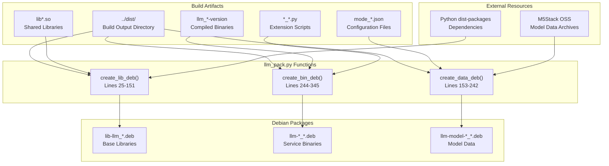
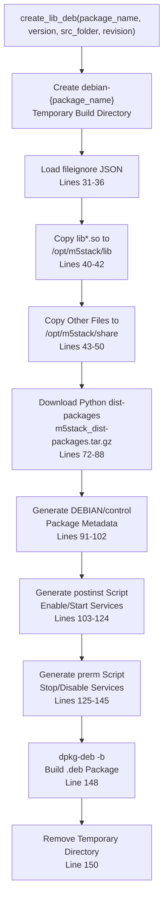
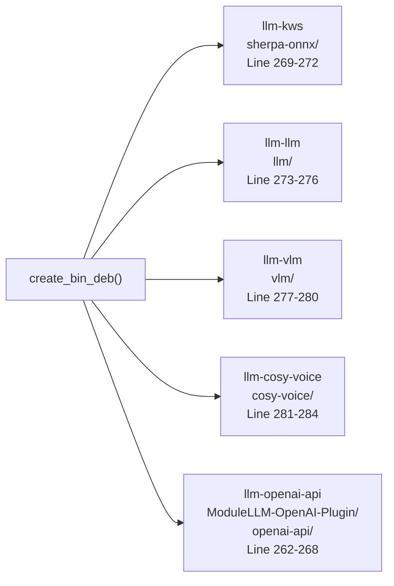
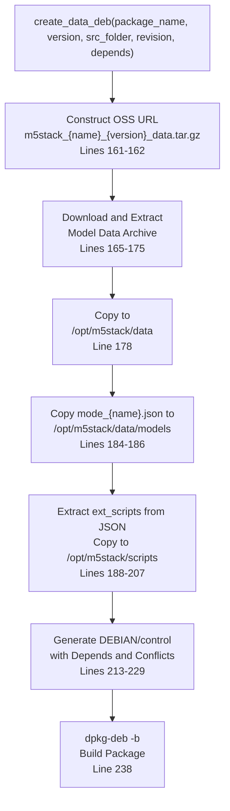
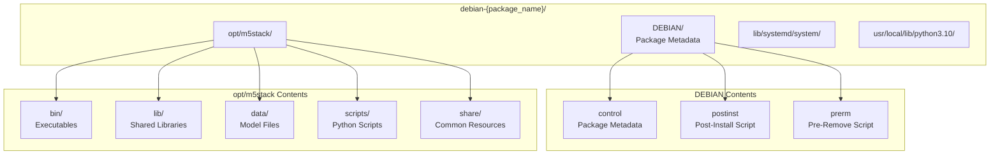
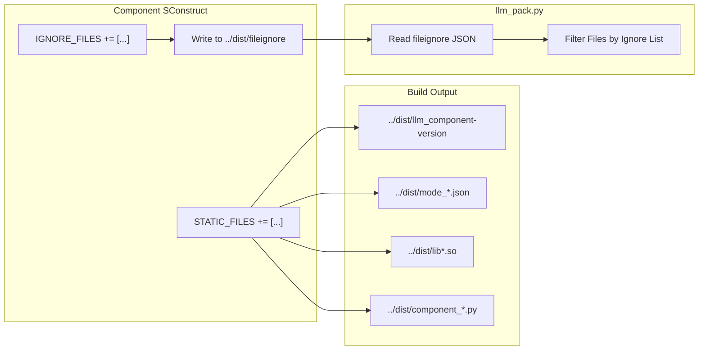

StackFlow Package Creation System

# Package Creation System

<details>
<summary>Relevant source files</summary>

The following files were used as context for generating this wiki page:

- [projects/llm_framework/main_llm/SConstruct](projects/llm_framework/main_llm/SConstruct)
- [projects/llm_framework/main_openai_api/SConstruct](projects/llm_framework/main_openai_api/SConstruct)
- [projects/llm_framework/main_vlm/SConstruct](projects/llm_framework/main_vlm/SConstruct)
- [projects/llm_framework/tools/llm_pack.py](projects/llm_framework/tools/llm_pack.py)

</details>


The package creation system transforms build artifacts into Debian packages for deployment on ARM64 Linux systems. It provides three specialized packaging functions that generate base library packages, service binary packages, and model data packages with proper dependency management and systemd integration. For information about package types and their dependency relationships, see [Package Types and Dependencies](#7.2). For installation procedures, see [Installation Methods](#7.3).

## Overview

The packaging system is implemented in `llm_pack.py`, which coordinates the creation of all StackFlow packages. It processes build artifacts from the `../dist` directory and generates versioned `.deb` packages with correct metadata, dependencies, and installation scripts.



**Sources:** [projects/llm_framework/tools/llm_pack.py:1-542]()

## Packaging Functions

### create_lib_deb

The `create_lib_deb()` function generates the base `lib-llm` package containing shared libraries, Python dependencies, and common resources required by all service units.



The function performs file filtering to exclude service-specific binaries and configuration files [projects/llm_framework/tools/llm_pack.py:38-39](). Library files are installed to `/opt/m5stack/lib`, while other shared resources go to `/opt/m5stack/share` [projects/llm_framework/tools/llm_pack.py:40-50]().

The postinst script conditionally enables and starts all systemd services if their service files are present [projects/llm_framework/tools/llm_pack.py:103-124](). Similarly, the prerm script stops and disables services in reverse order during package removal [projects/llm_framework/tools/llm_pack.py:125-145]().

**Sources:** [projects/llm_framework/tools/llm_pack.py:25-151]()

### create_bin_deb

The `create_bin_deb()` function packages individual service binaries with their systemd service definitions and runtime dependencies.

| Step | Action | File Location |
|------|--------|---------------|
| 1. Version Detection | Find versioned binary `llm_*-version` | Lines 245-252 |
| 2. Binary Copy | Copy to `/opt/m5stack/bin` | Line 289 |
| 3. Special Handling | Copy Python modules for specific services | Lines 262-284 |
| 4. Extension Scripts | Copy `{package_name}_*.py` files | Lines 290-294 |
| 5. Control File | Generate with dependency on lib-llm | Lines 296-309 |
| 6. Service File | Create systemd unit file | Lines 321-337 |
| 7. Install Scripts | Generate postinst/prerm for service management | Lines 310-340 |

The function handles five special cases that require additional Python module directories:



Each generated systemd service file includes dependency on `llm-sys.service` (except for llm-sys itself) using `After=` and `Requires=` directives [projects/llm_framework/tools/llm_pack.py:324-326]().

**Sources:** [projects/llm_framework/tools/llm_pack.py:244-345]()

### create_data_deb

The `create_data_deb()` function packages AI model files and their configuration downloaded from M5Stack OSS storage.



The function extracts `ext_scripts` from the mode configuration file and copies them to `/opt/m5stack/scripts` [projects/llm_framework/tools/llm_pack.py:192-204](). This enables models to ship with custom Python preprocessing or postprocessing scripts.

Model packages declare conflicts with their old naming scheme to prevent dual installation [projects/llm_framework/tools/llm_pack.py:223-226]():

```
Conflicts: {old_deb_name}
```

**Sources:** [projects/llm_framework/tools/llm_pack.py:153-242]()

## Debian Package Structure

All packages follow a standardized directory structure during assembly:



### Control File Format

The control file follows Debian package format specification [projects/llm_framework/tools/llm_pack.py:91-102]():

```
Package: {package_name}
Version: {version}
Architecture: arm64
Maintainer: dianjixz <dianjixz@m5stack.com>
Original-Maintainer: m5stack <m5stack@m5stack.com>
Section: llm-module
Priority: optional
Depends: {dependencies}
Homepage: https://www.m5stack.com
Packaged-Date: {timestamp}
Description: llm-module
```

Binary packages specify dependency on `lib-llm (>= version)` [projects/llm_framework/tools/llm_pack.py:305](), while data packages typically depend on `lib-llm (>= 1.6)` [projects/llm_framework/tools/llm_pack.py:153]().

**Sources:** [projects/llm_framework/tools/llm_pack.py:91-102](), [projects/llm_framework/tools/llm_pack.py:213-229](), [projects/llm_framework/tools/llm_pack.py:296-309]()

## Version Management

Package versions are centrally managed in the `Tasks` dictionary [projects/llm_framework/tools/llm_pack.py:373-513]():

```python
Tasks = {
    'lib-llm':      [create_lib_deb,  'lib-llm',      '1.9', src_folder, revision],
    'llm-sys':      [create_bin_deb,  'llm-sys',      '1.6', src_folder, revision],
    'llm-audio':    [create_bin_deb,  'llm-audio',    '1.8', src_folder, revision],
    'llm-kws':      [create_bin_deb,  'llm-kws',      '1.10', src_folder, revision],
    # ... additional packages
}
```

Binary packages support automatic version detection from the binary filename [projects/llm_framework/tools/llm_pack.py:245-252]():

```python
bin_files = glob.glob(os.path.join(src_folder, package_name.replace("-", "_") + "-*"))
version_info = "0"
if bin_files:
    for bin_file in bin_files:
        ver = bin_file.split('-')[-1]
        if ver > version_info:
            version_info = ver
    version = version_info
```

This enables components to self-version by building binaries with version suffixes like `llm_llm-1.12`.

**Sources:** [projects/llm_framework/tools/llm_pack.py:245-252](), [projects/llm_framework/tools/llm_pack.py:373-513]()

## Build Integration

Components declare files to be packaged through the `STATIC_FILES` variable in their SConstruct files:



Example from `llm-llm` SConstruct [projects/llm_framework/main_llm/SConstruct:46-67]():

```python
STATIC_FILES += [os.path.join(python_venv, 'llm')]
STATIC_FILES += Glob('scripts/tokenizer_*.py')
STATIC_FILES += Glob('models/mode_*.json')

IGNORE_FILES = []
IGNORE_FILES += ['llm']

# Write ignore list to ../dist/fileignore
ignore = {'ignore':[]}
try:
    with open('../dist/fileignore', 'a+') as f:
        f.seek(0)
        ignore = json.load(f)
except:
    pass
ignore['ignore'] += IGNORE_FILES
ignore['ignore'] = list(set(ignore['ignore']))
with open('../dist/fileignore', 'w') as f:
    json.dump(ignore, f, indent=4)
```

The ignore mechanism prevents Python virtual environments and other component-specific directories from being included in the base `lib-llm` package [projects/llm_framework/tools/llm_pack.py:31-39]().

**Sources:** [projects/llm_framework/main_llm/SConstruct:46-67](), [projects/llm_framework/main_vlm/SConstruct:57-77](), [projects/llm_framework/main_openai_api/SConstruct:29-53]()

## Parallel Execution

The packaging script uses `concurrent.futures.ThreadPoolExecutor` to build packages in parallel [projects/llm_framework/tools/llm_pack.py:524-541]():

```python
cpu_count = os.cpu_count()
if cpu_count - 2 < 1:
    cpu_count = 2
else:
    cpu_count = cpu_count - 2

with concurrent.futures.ThreadPoolExecutor(max_workers=cpu_count) as executor:
    futures = []
    if (create_lib):
        for task in Tasks:
            if (Tasks[task][0] == create_lib_deb):
                futures.append(executor.submit(*Tasks[task]))
    if (create_bin):
        for task in Tasks:
            if (Tasks[task][0] == create_bin_deb):
                futures.append(executor.submit(*Tasks[task]))
    if (create_data):
        for task in Tasks:
            if (Tasks[task][0] == create_data_deb):
                futures.append(executor.submit(*Tasks[task]))

    for future in concurrent.futures.as_completed(futures):
        result = future.result()
        print(result)
```

The system reserves 2 CPU cores for system tasks and uses the remainder for parallel packaging. Packages are built in phases: lib packages first, then binary packages, then data packages.

**Sources:** [projects/llm_framework/tools/llm_pack.py:367-541]()

## Command-Line Interface

The script supports selective package building and cleanup operations:

| Command | Action | Lines |
|---------|--------|-------|
| `python llm_pack.py` | Build all packages | 524-541 |
| `python llm_pack.py {package_name}` | Build single package | 516-522 |
| `python llm_pack.py clean` | Remove .deb files and build directories | 349-352 |
| `python llm_pack.py distclean` | Remove all artifacts including downloads | 353-355 |

Single package building example:

```bash
python llm_pack.py llm-sys
```

This executes only the task for `llm-sys`, bypassing the parallel execution pipeline [projects/llm_framework/tools/llm_pack.py:516-522]().

**Sources:** [projects/llm_framework/tools/llm_pack.py:347-522]()