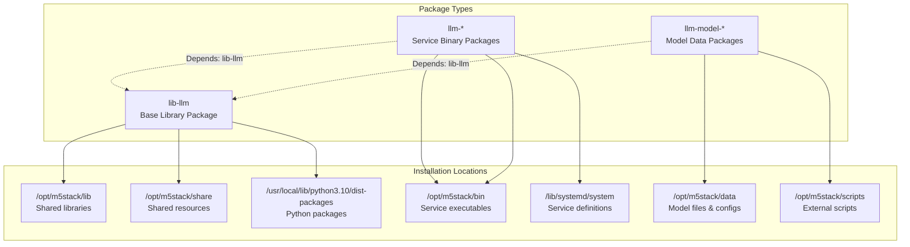
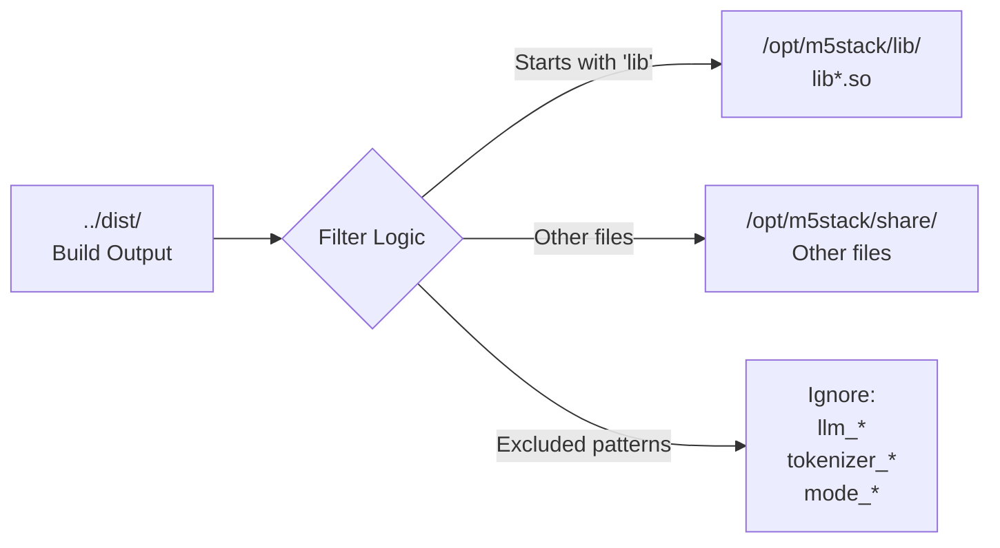
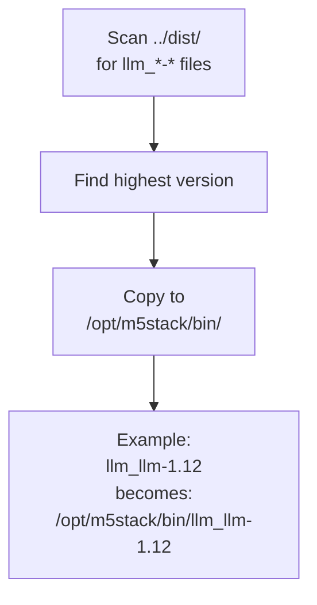
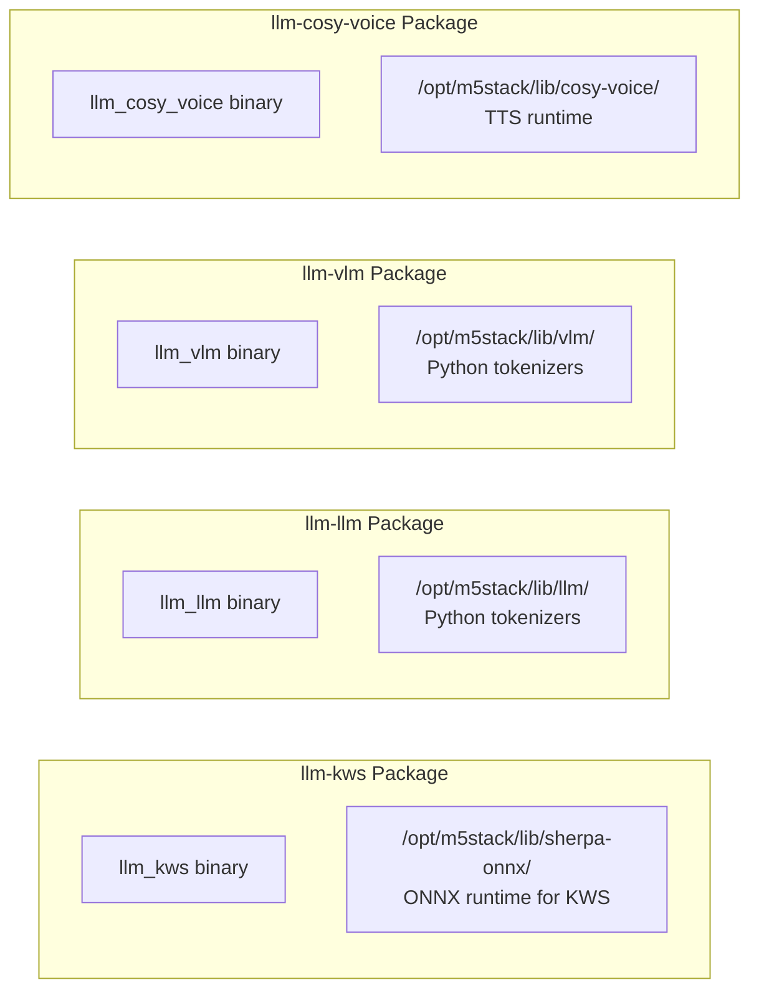
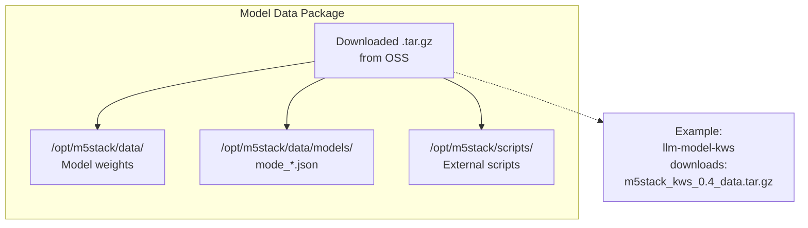

StackFlow Package Types and Dependencies

# Package Types and Dependencies

<details>
<summary>Relevant source files</summary>

The following files were used as context for generating this wiki page:

- [projects/llm_framework/main_llm/SConstruct](projects/llm_framework/main_llm/SConstruct)
- [projects/llm_framework/main_openai_api/SConstruct](projects/llm_framework/main_openai_api/SConstruct)
- [projects/llm_framework/main_vlm/SConstruct](projects/llm_framework/main_vlm/SConstruct)
- [projects/llm_framework/tools/llm_pack.py](projects/llm_framework/tools/llm_pack.py)

</details>


This page documents the three types of Debian packages produced by the StackFlow build system, their internal structure, contents, and dependency relationships. Understanding package types is essential for selective installation and troubleshooting deployment issues.

For information about how packages are created by the `llm_pack.py` tool, see [Package Creation System](#7.1). For installation procedures, see [Installation Methods](#7.3).

---

## Package Type Overview

The StackFlow framework generates three distinct package types, each serving a specific role in the deployment architecture:



**Sources:** [projects/llm_framework/tools/llm_pack.py:25-345]()

---

## Base Library Package (lib-llm)

The `lib-llm` package provides the foundational shared libraries and resources required by all service units. It is the only package with no dependencies and must be installed first.

### Contents and Structure

| Directory | Contents | Purpose |
|-----------|----------|---------|
| `/opt/m5stack/lib/` | `*.so` files | Shared libraries (ZMQ, ONNX, NCNN, Axera SDK) |
| `/opt/m5stack/share/` | Resource files | Shared data files and assets |
| `/usr/local/lib/python3.10/dist-packages/` | Python modules | Python runtime dependencies |

### Package Creation Logic

The `create_lib_deb` function filters build artifacts to include only shared components:



The filtering logic excludes unit-specific files and model configurations:

- Files starting with `llm_`, `tokenizer_`, `llm-kws_`, or `mode_` are excluded
- Files listed in `fileignore` JSON are excluded
- Libraries (`lib*.so`) go to `/opt/m5stack/lib/`
- All other files go to `/opt/m5stack/share/`

**Sources:** [projects/llm_framework/tools/llm_pack.py:25-51](), [projects/llm_framework/tools/llm_pack.py:37-50]()

### Python Dependencies

The package downloads and includes Python virtual environment components:

```
m5stack_dist-packages.tar.gz (from OSS)
  └── Extracted to: /usr/local/lib/python3.10/dist-packages/
```

This provides Python modules required by units that use Python integration (e.g., tokenizers, model loaders).

**Sources:** [projects/llm_framework/tools/llm_pack.py:72-88]()

### Service Management Hooks

The `lib-llm` package includes `postinst` and `prerm` scripts that automatically enable and start all known StackFlow services when the base library is installed:

```
postinst:
  - Enable and start llm-sys.service
  - Enable and start llm-audio.service
  - Enable and start llm-kws.service
  - ... (all other services)

prerm:
  - Stop and disable all services (reverse order)
```

**Sources:** [projects/llm_framework/tools/llm_pack.py:103-145]()

### Package Metadata

```
Package: lib-llm
Version: 1.9
Architecture: arm64
Depends: (none)
Section: llm-module
Priority: optional
```

**Sources:** [projects/llm_framework/tools/llm_pack.py:91-102](), [projects/llm_framework/tools/llm_pack.py:375]()

---

## Service Binary Packages

Service binary packages contain the executable and unit-specific runtime dependencies for individual StackFlow units. Each unit is packaged separately, enabling modular installation.

### Package Structure

| Package Name | Binary | Unit-Specific Libraries | Systemd Service |
|--------------|--------|-------------------------|-----------------|
| `llm-sys` | `llm_sys-{version}` | — | `llm-sys.service` |
| `llm-audio` | `llm_audio-{version}` | — | `llm-audio.service` |
| `llm-kws` | `llm_kws-{version}` | `sherpa-onnx/` | `llm-kws.service` |
| `llm-asr` | `llm_asr-{version}` | — | `llm-asr.service` |
| `llm-llm` | `llm_llm-{version}` | `llm/` (Python tokenizers) | `llm-llm.service` |
| `llm-vlm` | `llm_vlm-{version}` | `vlm/` (Python tokenizers) | `llm-vlm.service` |
| `llm-tts` | `llm_tts-{version}` | — | `llm-tts.service` |
| `llm-melotts` | `llm_melotts-{version}` | — | `llm-melotts.service` |
| `llm-camera` | `llm_camera-{version}` | — | `llm-camera.service` |
| `llm-yolo` | `llm_yolo-{version}` | — | `llm-yolo.service` |
| `llm-depth-anything` | `llm_depth_anything-{version}` | — | `llm-depth-anything.service` |
| `llm-vad` | `llm_vad-{version}` | — | `llm-vad.service` |
| `llm-whisper` | `llm_whisper-{version}` | — | `llm-whisper.service` |
| `llm-cosy-voice` | `llm_cosy_voice-{version}` | `cosy-voice/` | `llm-cosy-voice.service` |
| `llm-openai-api` | `llm_openai_api-{version}` | `ModuleLLM-OpenAI-Plugin/`, `openai-api/` | `llm-openai-api.service` |

**Sources:** [projects/llm_framework/tools/llm_pack.py:373-391]()

### Binary Versioning

The `create_bin_deb` function automatically detects versioned binaries by scanning for files matching the pattern `{unit_name}-{version}`:



If a versioned binary is found, the version number is extracted and used as the package version. Otherwise, it defaults to the specified version string.

**Sources:** [projects/llm_framework/tools/llm_pack.py:245-252](), [projects/llm_framework/tools/llm_pack.py:286-289]()

### Unit-Specific Libraries

Certain units require Python runtime environments or additional libraries:



These libraries are conditionally included based on package name:

**Sources:** [projects/llm_framework/tools/llm_pack.py:262-284]()

### Systemd Service Files

Each binary package generates a systemd service file with automatic dependency management:

```
[Unit]
Description={package_name} Service
After=llm-sys.service        # All units depend on llm-sys
Requires=llm-sys.service

[Service]
ExecStart=/opt/m5stack/bin/{binary_name}
WorkingDirectory=/opt/m5stack
Restart=always
RestartSec=1
StartLimitInterval=0

[Install]
WantedBy=multi-user.target
```

**Note:** The `llm-sys` service has no `After` or `Requires` directives since it is the root service.

**Sources:** [projects/llm_framework/tools/llm_pack.py:321-337]()

### Package Dependencies

All service packages depend on the base library:

```
Package: llm-{unit}
Version: {version}
Architecture: arm64
Depends: lib-llm (>= 1.8)    # Minimum required lib-llm version
```

The version constraint ensures compatibility between service binaries and shared libraries.

**Sources:** [projects/llm_framework/tools/llm_pack.py:244](), [projects/llm_framework/tools/llm_pack.py:296-309]()

---

## Model Data Packages

Model data packages contain AI model weights, configuration files, and optional external scripts. These are the largest packages, ranging from 3MB (KWS) to 2GB (LLM).

### Package Naming Convention

Model packages follow the naming pattern:

```
llm-model-{model-name}[-{platform}]_{version}-{revision}_arm64.deb
```

Examples:
- `llm-model-kws_0.4-m5stack1_arm64.deb` (AX630C platform)
- `llm-model-kws-ax650_0.4-m5stack1_arm64.deb` (AX650 platform)
- `llm-model-qwen2.5-0.5B-Int4-ax630c_0.4-m5stack1_arm64.deb`

Platform suffixes indicate NPU compatibility:
- No suffix or `-ax630c`: AX630C platform
- `-ax650`: AX650 platform
- `-npu1`: Single-NPU configuration

**Sources:** [projects/llm_framework/tools/llm_pack.py:393-514]()

### Package Contents



**Sources:** [projects/llm_framework/tools/llm_pack.py:161-178]()

### Configuration File Integration

Each model package includes a `mode_*.json` configuration file copied from the source folder:

```
Source: ../dist/mode_{model-name}.json
Destination: /opt/m5stack/data/models/mode_{model-name}.json
```

The configuration file may reference external scripts via the `ext_scripts` array:

```json
{
  "mode_param": {
    "ext_scripts": [
      "script1.py",
      "subfolder/script2.py"
    ]
  }
}
```

These scripts are automatically copied to `/opt/m5stack/scripts/` during packaging.

**Sources:** [projects/llm_framework/tools/llm_pack.py:184-207]()

### Model Categories

| Category | Example Packages | Model Size Range |
|----------|------------------|------------------|
| **Audio/KWS** | `llm-model-audio-zh-cn`, `llm-model-kws` | 3-6 MB |
| **VAD** | `llm-model-silero-vad` | 3.3 MB |
| **ASR (CPU)** | `llm-model-sherpa-ncnn-*` | 20-40 MB |
| **ASR (NPU)** | `llm-model-sense-voice-small-10s` | 201-725 MB |
| **TTS (CPU)** | `llm-model-single-speaker-fast` | 60-77 MB |
| **TTS (NPU)** | `llm-model-melotts-*` | 83-102 MB |
| **LLM** | `llm-model-qwen2.5-*`, `llm-model-llama3.2-*` | 0.5-2 GB |
| **VLM** | `llm-model-internvl*`, `llm-model-smolvlm-*` | 330 MB-1.2 GB |
| **CV** | `llm-model-yolo11n*`, `llm-model-depth-anything-*` | 2.8-29 MB |

**Sources:** [projects/llm_framework/tools/llm_pack.py:393-514]()

### Package Conflicts

Model packages with new naming schemes declare conflicts with legacy package names:

```
Package: llm-model-kws
Conflicts: llm-kws     # Old package name without 'model-' prefix
```

This prevents simultaneous installation of old and new versions.

**Sources:** [projects/llm_framework/tools/llm_pack.py:223-226]()

### Dependencies

Model packages depend on the base library:

```
Package: llm-model-{name}
Depends: lib-llm (>= 1.6)
```

**Sources:** [projects/llm_framework/tools/llm_pack.py:153](), [projects/llm_framework/tools/llm_pack.py:213-221]()

---

## Dependency Hierarchy

The dependency relationships between package types form a simple hierarchy:

```mermaid
graph TB
    BASE["lib-llm<br/>Base Library<br/>(No dependencies)"]
    
    subgraph "Service Binaries"
        SYS["llm-sys"]
        AUDIO["llm-audio"]
        KWS["llm-kws"]
        ASR["llm-asr"]
        LLM["llm-llm"]
        TTS["llm-tts"]
        MELOTTS["llm-melotts"]
        CAMERA["llm-camera"]
        YOLO["llm-yolo"]
        VLM["llm-vlm"]
        DEPTH["llm-depth-anything"]
        VAD["llm-vad"]
        WHISPER["llm-whisper"]
        COSY["llm-cosy-voice"]
    end
    
    subgraph "Model Data"
        KWS_MODEL["llm-model-kws"]
        ASR_MODEL["llm-model-sense-voice-*"]
        LLM_MODEL["llm-model-qwen2.5-*"]
        TTS_MODEL["llm-model-melotts-*"]
        VLM_MODEL["llm-model-internvl*"]
        YOLO_MODEL["llm-model-yolo11n*"]
        DEPTH_MODEL["llm-model-depth-anything-*"]
        VAD_MODEL["llm-model-silero-vad"]
        WHISPER_MODEL["llm-model-whisper-*"]
        COSY_MODEL["llm-model-CosyVoice2-*"]
    end
    
    BASE -.->|"Depends"| SYS
    BASE -.->|"Depends"| AUDIO
    BASE -.->|"Depends"| KWS
    BASE -.->|"Depends"| ASR
    BASE -.->|"Depends"| LLM
    BASE -.->|"Depends"| TTS
    BASE -.->|"Depends"| MELOTTS
    BASE -.->|"Depends"| CAMERA
    BASE -.->|"Depends"| YOLO
    BASE -.->|"Depends"| VLM
    BASE -.->|"Depends"| DEPTH
    BASE -.->|"Depends"| VAD
    BASE -.->|"Depends"| WHISPER
    BASE -.->|"Depends"| COSY
    
    BASE -.->|"Depends"| KWS_MODEL
    BASE -.->|"Depends"| ASR_MODEL
    BASE -.->|"Depends"| LLM_MODEL
    BASE -.->|"Depends"| TTS_MODEL
    BASE -.->|"Depends"| VLM_MODEL
    BASE -.->|"Depends"| YOLO_MODEL
    BASE -.->|"Depends"| DEPTH_MODEL
    BASE -.->|"Depends"| VAD_MODEL
    BASE -.->|"Depends"| WHISPER_MODEL
    BASE -.->|"Depends"| COSY_MODEL
```



**Key Points:**

1. **lib-llm is the root dependency** - Must be installed first
2. **Service binaries are independent** - Can be installed in any order after lib-llm
3. **Model packages are independent** - Can be installed separately as needed
4. **No cross-dependencies** - Service packages do not depend on each other
5. **Runtime service dependencies** - Managed through systemd (e.g., all services require `llm-sys.service` to be running)

**Sources:** [projects/llm_framework/tools/llm_pack.py:244](), [projects/llm_framework/tools/llm_pack.py:153](), [projects/llm_framework/tools/llm_pack.py:324-326]()

---

## Version Management

### Version Declaration

Package versions are declared in the `Tasks` dictionary in `llm_pack.py`:

```python
Tasks = {
    'lib-llm': [create_lib_deb, 'lib-llm', '1.9', src_folder, revision],
    'llm-sys': [create_bin_deb, 'llm-sys', '1.6', src_folder, revision],
    'llm-llm': [create_bin_deb, 'llm-llm', '1.12', src_folder, revision],
    # ...
}
```

**Sources:** [projects/llm_framework/tools/llm_pack.py:373-391]()

### Version Suffixes in SConstruct Files

Component build configurations specify version suffixes in their target names:

| Component | SConstruct Target | Actual Binary |
|-----------|------------------|---------------|
| llm-llm | `llm_llm-1.12` | `llm_llm-1.12` |
| llm-vlm | `llm_vlm-1.11` | `llm_vlm-1.11` |
| llm-openai-api | `llm_openai_api-1.10` | `llm_openai_api-1.10` |

**Sources:** [projects/llm_framework/main_llm/SConstruct:69](), [projects/llm_framework/main_vlm/SConstruct:79](), [projects/llm_framework/main_openai_api/SConstruct:55]()

### Dependency Version Constraints

Service packages specify minimum lib-llm versions:

```
Depends: lib-llm (>= 1.8)    # Most services
Depends: lib-llm (>= 1.6)    # Model packages
Depends: lib-llm             # llm-camera (no version constraint)
```

This ensures ABI compatibility between binaries and shared libraries.

**Sources:** [projects/llm_framework/tools/llm_pack.py:244](), [projects/llm_framework/tools/llm_pack.py:153](), [projects/llm_framework/tools/llm_pack.py:383]()

---

## Package Installation Paths Summary

| Package Type | Installation Paths |
|--------------|-------------------|
| **lib-llm** | `/opt/m5stack/lib/`<br/>`/opt/m5stack/share/`<br/>`/usr/local/lib/python3.10/dist-packages/` |
| **Service Binaries** | `/opt/m5stack/bin/`<br/>`/opt/m5stack/lib/{unit-specific}/`<br/>`/lib/systemd/system/` |
| **Model Data** | `/opt/m5stack/data/`<br/>`/opt/m5stack/data/models/`<br/>`/opt/m5stack/scripts/` |

All binaries use rpath settings to locate shared libraries:

```
-Wl,-rpath=/opt/m5stack/lib
-Wl,-rpath=/usr/local/m5stack/lib
-Wl,-rpath=/usr/local/m5stack/lib/gcc-10.3
```

This ensures that service binaries can find shared libraries regardless of system library search paths.

**Sources:** [projects/llm_framework/main_llm/SConstruct:31](), [projects/llm_framework/main_vlm/SConstruct:27]()