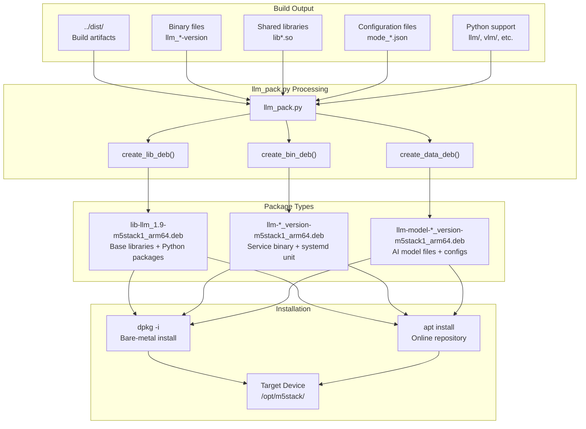
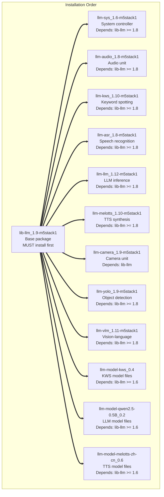
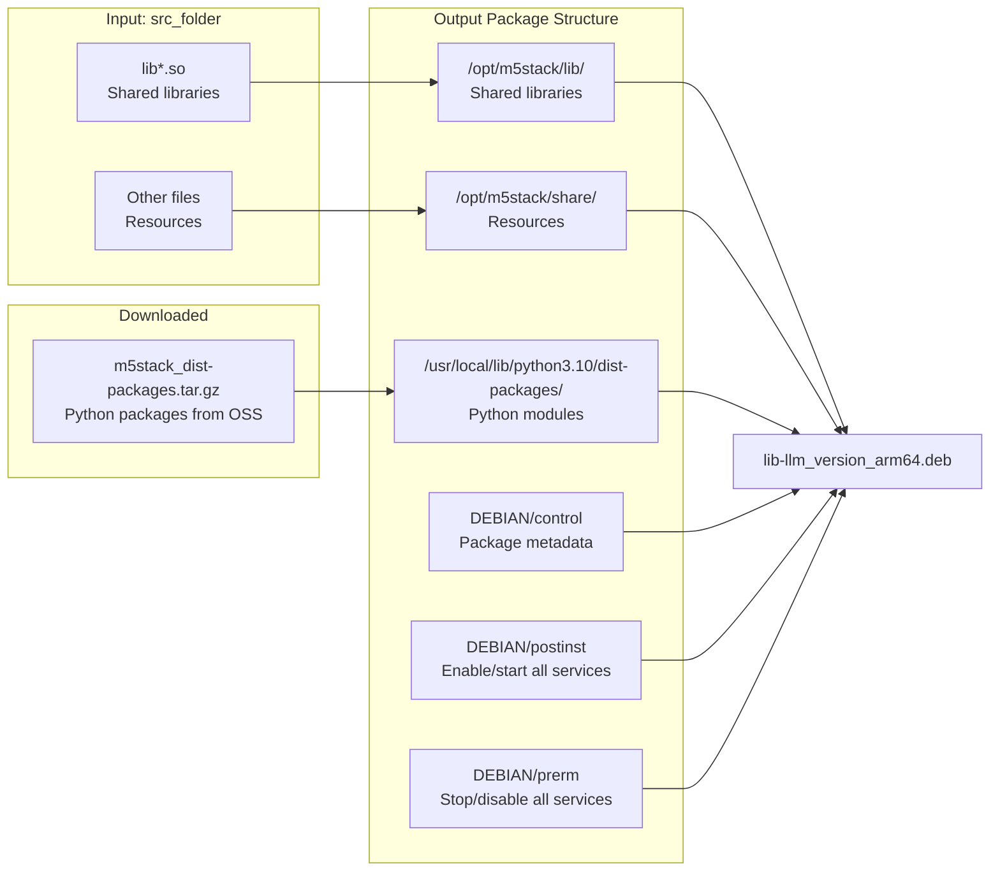
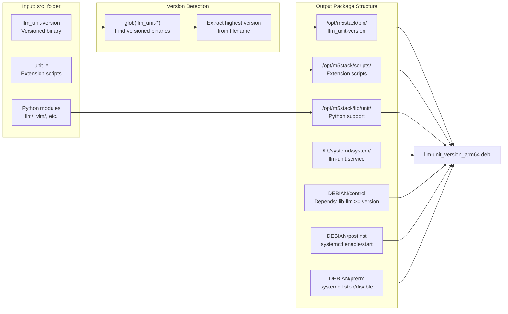
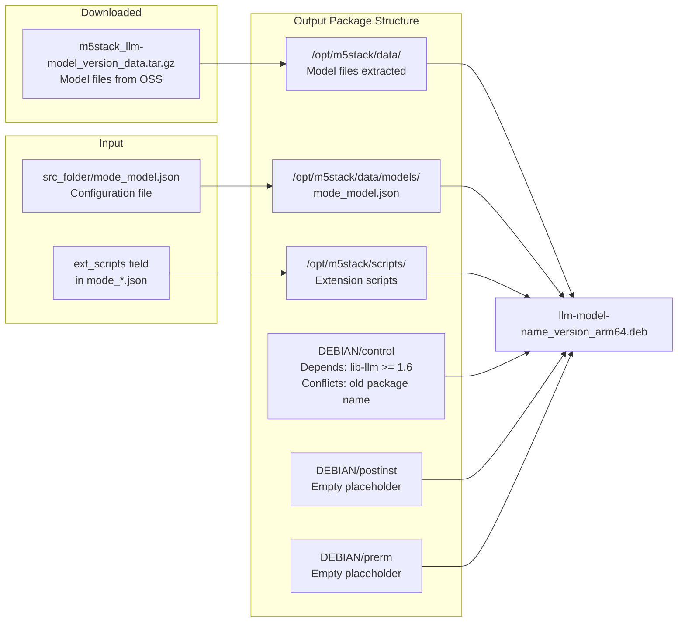
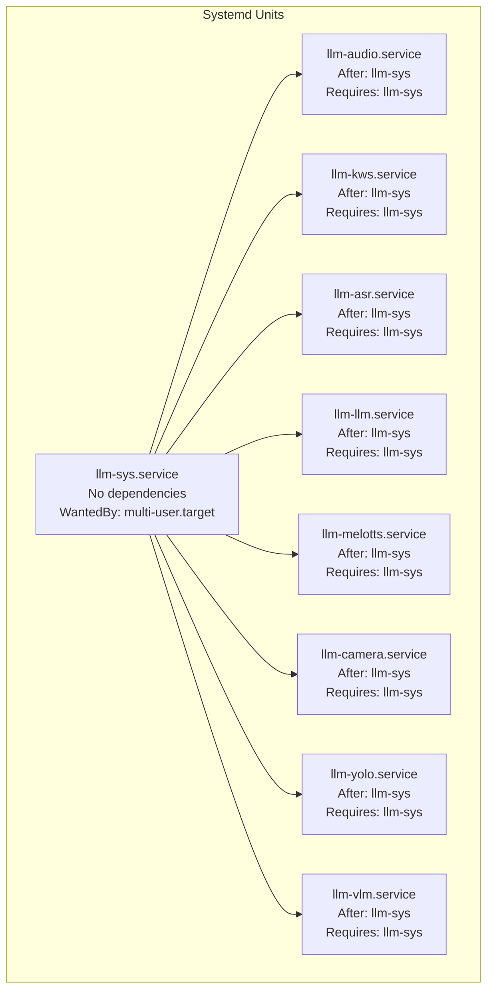

StackFlow Packaging and Deployment

# Packaging and Deployment

<details>
<summary>Relevant source files</summary>

The following files were used as context for generating this wiki page:

- [README.md](README.md)
- [README_zh.md](README_zh.md)
- [doc/component_doc/StackFlow_en.md](doc/component_doc/StackFlow_en.md)
- [doc/component_doc/StackFlow_zh.md](doc/component_doc/StackFlow_zh.md)
- [projects/llm_framework/README.md](projects/llm_framework/README.md)
- [projects/llm_framework/main_llm/SConstruct](projects/llm_framework/main_llm/SConstruct)
- [projects/llm_framework/main_openai_api/SConstruct](projects/llm_framework/main_openai_api/SConstruct)
- [projects/llm_framework/main_vlm/SConstruct](projects/llm_framework/main_vlm/SConstruct)
- [projects/llm_framework/tools/llm_pack.py](projects/llm_framework/tools/llm_pack.py)

</details>


This document describes the complete packaging and deployment system for StackFlow, from build artifacts to installed packages on target devices. The packaging system converts compiled binaries, libraries, and model data into Debian (.deb) packages that can be installed via `dpkg` or `apt`. For information about the build process that generates these artifacts, see [Build System](#6).

The packaging system is designed for modular installation on AXERA-based ARM64 embedded Linux systems (ax630c, ax650n), allowing users to install only the AI units and models they need.

---

## Package Creation Workflow

The following diagram illustrates the complete workflow from build artifacts to installable packages:



**Package Creation Process Flow**

Sources: [projects/llm_framework/tools/llm_pack.py:1-543]()

---

## Package Types and Dependencies

StackFlow generates three distinct types of Debian packages with a clear dependency hierarchy:

| Package Type | Naming Pattern | Contents | Depends On | Example Size |
|--------------|----------------|----------|------------|--------------|
| **Base Library** | `lib-llm_{version}-{revision}_arm64.deb` | Shared libraries (.so files), Python dist-packages, common resources | - | ~50-100MB |
| **Service Binary** | `llm-{unit}_{version}-{revision}_arm64.deb` | Unit executable, systemd service file, unit-specific Python modules | `lib-llm (>= version)` | ~5-20MB |
| **Model Data** | `llm-model-{model}_{version}-{revision}_arm64.deb` | AI model files (.axmodel/.onnx), mode configuration (mode_*.json), optional scripts | `lib-llm (>= version)` | 3MB-2GB |

### Dependency Hierarchy



**Package Dependency Graph**

The `lib-llm` package must be installed before any other StackFlow packages. Service units depend on `llm-sys` being present (enforced via systemd `After=` and `Requires=` directives), but model packages have no runtime dependencies beyond `lib-llm`.

Sources: [projects/llm_framework/tools/llm_pack.py:244-345](), [projects/llm_framework/tools/llm_pack.py:153-242]()

---

## Package Creation Functions

The [projects/llm_framework/tools/llm_pack.py]() script provides three main functions for creating different package types:

### create_lib_deb(): Base Library Package



**create_lib_deb() Processing**

This function [projects/llm_framework/tools/llm_pack.py:25-151]():
- Copies all `lib*.so` files to `/opt/m5stack/lib/`
- Copies non-binary resources to `/opt/m5stack/share/`
- Downloads and includes Python packages from `m5stack_dist-packages.tar.gz`
- Excludes files matching patterns in `fileignore` JSON (e.g., `llm_*`, `tokenizer_*`, `mode_*`)
- Generates postinst script that enables/starts all StackFlow systemd services [projects/llm_framework/tools/llm_pack.py:103-124]()
- Generates prerm script that stops/disables all services before removal [projects/llm_framework/tools/llm_pack.py:125-145]()

### create_bin_deb(): Service Binary Package



**create_bin_deb() Processing**

This function [projects/llm_framework/tools/llm_pack.py:244-345]():
- Auto-detects binary version from filename patterns like `llm_kws-1.10` [projects/llm_framework/tools/llm_pack.py:245-252]()
- Copies unit-specific Python libraries for `llm-kws`, `llm-llm`, `llm-vlm`, `llm-cosy-voice`, and `llm-openai-api` [projects/llm_framework/tools/llm_pack.py:262-284]()
- Generates systemd service file with proper dependencies [projects/llm_framework/tools/llm_pack.py:320-337]():
  - All services except `llm-sys` have `After=llm-sys.service` and `Requires=llm-sys.service`
  - Service uses `Restart=always` and `RestartSec=1` for robustness
  - `WorkingDirectory=/opt/m5stack`
- Postinst script enables and starts only this service [projects/llm_framework/tools/llm_pack.py:310-314]()
- Prerm script stops and disables only this service [projects/llm_framework/tools/llm_pack.py:315-319]()

### create_data_deb(): Model Data Package



**create_data_deb() Processing**

This function [projects/llm_framework/tools/llm_pack.py:153-242]():
- Downloads model data from OSS URL constructed as `m5stack_{llm-model}_{version}_data.tar.gz` [projects/llm_framework/tools/llm_pack.py:161-175]()
- Copies corresponding `mode_*.json` configuration file [projects/llm_framework/tools/llm_pack.py:184-186]()
- Parses `ext_scripts` array from JSON and copies referenced scripts/folders [projects/llm_framework/tools/llm_pack.py:188-207]()
- Adds `Conflicts:` directive for old package naming scheme to prevent conflicts [projects/llm_framework/tools/llm_pack.py:223-226]()
- Minimal postinst/prerm scripts since models don't require service management [projects/llm_framework/tools/llm_pack.py:231-236]()

Sources: [projects/llm_framework/tools/llm_pack.py:25-345]()

---

## Debian Package Structure

All generated packages follow standard Debian package conventions. The internal structure created by `dpkg-deb`:

### Control File Format

Each package includes a `DEBIAN/control` file with metadata:

```
Package: llm-llm
Version: 1.12
Architecture: arm64
Maintainer: dianjixz <dianjixz@m5stack.com>
Original-Maintainer: m5stack <m5stack@m5stack.com>
Section: llm-module
Priority: optional
Depends: lib-llm (>= 1.8)
Homepage: https://www.m5stack.com
Packaged-Date: 2024-01-15 10:30:45
Description: llm-module
 bsp.
```

Sources: [projects/llm_framework/tools/llm_pack.py:296-309]()

### File Installation Paths

| Package Type | Installation Paths |
|--------------|-------------------|
| **lib-llm** | `/opt/m5stack/lib/*.so`<br>`/opt/m5stack/share/*`<br>`/usr/local/lib/python3.10/dist-packages/*` |
| **llm-{unit}** | `/opt/m5stack/bin/llm_{unit}-{version}`<br>`/opt/m5stack/lib/{unit}/*` (Python support)<br>`/opt/m5stack/scripts/{unit}_*` (extensions)<br>`/lib/systemd/system/llm-{unit}.service` |
| **llm-model-{model}** | `/opt/m5stack/data/*` (model files)<br>`/opt/m5stack/data/models/mode_{model}.json`<br>`/opt/m5stack/scripts/*` (if ext_scripts defined) |

### Maintenance Scripts

**postinst Script (lib-llm)**

The base library package's postinst script enables and starts all StackFlow services:

```bash
#!/bin/sh
sed -i 's/dpkg -i/apt install -y/g' /usr/local/m5stack/update_check.sh
[ -f "/lib/systemd/system/llm-sys.service" ] && systemctl enable llm-sys.service
[ -f "/lib/systemd/system/llm-sys.service" ] && systemctl start llm-sys.service
[ -f "/lib/systemd/system/llm-asr.service" ] && systemctl enable llm-asr.service
[ -f "/lib/systemd/system/llm-asr.service" ] && systemctl start llm-asr.service
# ... continues for all units
exit 0
```

Sources: [projects/llm_framework/tools/llm_pack.py:103-124]()

**prerm Script (lib-llm)**

The removal script stops services in reverse order:

```bash
#!/bin/sh
[ -f "/lib/systemd/system/llm-tts.service" ] && systemctl stop llm-tts.service
[ -f "/lib/systemd/system/llm-tts.service" ] && systemctl disable llm-tts.service
# ... continues for all units in reverse order
[ -f "/lib/systemd/system/llm-sys.service" ] && systemctl stop llm-sys.service
[ -f "/lib/systemd/system/llm-sys.service" ] && systemctl disable llm-sys.service
exit 0
```

Sources: [projects/llm_framework/tools/llm_pack.py:125-145]()

**postinst/prerm Scripts (Service Packages)**

Individual service packages only manage their own service:

```bash
# postinst
#!/bin/sh
[ -f "/lib/systemd/system/llm-kws.service" ] && systemctl enable llm-kws.service
[ -f "/lib/systemd/system/llm-kws.service" ] && systemctl start llm-kws.service
exit 0

# prerm
#!/bin/sh
[ -f "/lib/systemd/system/llm-kws.service" ] && systemctl stop llm-kws.service
[ -f "/lib/systemd/system/llm-kws.service" ] && systemctl disable llm-kws.service
exit 0
```

Sources: [projects/llm_framework/tools/llm_pack.py:310-319]()

---

## Systemd Service Management

### Service File Generation

Each service binary package includes a generated systemd unit file at `/lib/systemd/system/llm-{unit}.service`:

```ini
[Unit]
Description=llm-llm Service
After=llm-sys.service
Requires=llm-sys.service

[Service]
ExecStart=/opt/m5stack/bin/llm_llm-1.12
WorkingDirectory=/opt/m5stack
Restart=always
RestartSec=1
StartLimitInterval=0

[Install]
WantedBy=multi-user.target
```

**Key Service Configuration:**
- `After=llm-sys.service`: All units wait for system controller to start
- `Requires=llm-sys.service`: Unit cannot run without llm-sys
- `Restart=always`: Automatic restart on failure
- `StartLimitInterval=0`: No limit on restart attempts
- `WorkingDirectory=/opt/m5stack`: Sets CWD for relative path resolution

**Exception:** The `llm-sys` service omits `After=` and `Requires=` directives since it is the foundational service.

Sources: [projects/llm_framework/tools/llm_pack.py:320-337]()

### Service Dependency Graph



**Systemd Service Dependencies**

All AI unit services depend on `llm-sys.service` being active. If `llm-sys` fails or is stopped, systemd will automatically stop all dependent units.

Sources: [projects/llm_framework/tools/llm_pack.py:322-326]()

### Service Management Commands

```bash
# Check service status
systemctl status llm-sys.service

# Start/stop individual service
systemctl start llm-kws.service
systemctl stop llm-kws.service

# Enable/disable auto-start
systemctl enable llm-llm.service
systemctl disable llm-llm.service

# Restart after configuration changes
systemctl restart llm-melotts.service

# View service logs
journalctl -u llm-sys.service -f
```

Sources: [README_zh.md:176-182](), [README.md:127-133]()

---

## Installation Methods

### Bare-Metal Installation (dpkg)

Direct installation on target device without repository configuration:

**Installation Order:**

1. **Install base library** (required first):
   ```bash
   dpkg -i lib-llm_1.9-m5stack1_arm64.deb
   ```

2. **Install system controller** (required for other units):
   ```bash
   dpkg -i llm-sys_1.6-m5stack1_arm64.deb
   ```

3. **Install service units** (order independent):
   ```bash
   dpkg -i llm-audio_1.8-m5stack1_arm64.deb
   dpkg -i llm-kws_1.10-m5stack1_arm64.deb
   dpkg -i llm-asr_1.8-m5stack1_arm64.deb
   dpkg -i llm-llm_1.12-m5stack1_arm64.deb
   dpkg -i llm-melotts_1.10-m5stack1_arm64.deb
   ```

4. **Install model data** (as needed):
   ```bash
   dpkg -i llm-model-kws_0.4-m5stack1_arm64.deb
   dpkg -i llm-model-qwen2.5-0.5B-Int4-ax630c_0.4-m5stack1_arm64.deb
   dpkg -i llm-model-melotts-zh-cn_0.6-m5stack1_arm64.deb
   ```

**Important:** The installation order of `lib-llm` and `llm-sys` is critical. Other packages can be installed in any order.

Sources: [README_zh.md:134-147](), [README.md:83-97]()

### Online Installation (apt)

Repository-based installation with automatic dependency resolution:

**Repository Setup:**

```bash
# Add GPG key
wget -qO /etc/apt/keyrings/StackFlow.gpg \
  https://repo.llm.m5stack.com/m5stack-apt-repo/key/StackFlow.gpg

# Add apt source (ax630c platform)
echo 'deb [arch=arm64 signed-by=/etc/apt/keyrings/StackFlow.gpg] \
  https://repo.llm.m5stack.com/m5stack-apt-repo jammy ax630c' \
  > /etc/apt/sources.list.d/StackFlow.list

# Update package index
apt update
```

**Installation:**

```bash
# apt automatically resolves dependencies
apt install lib-llm          # Installs base
apt install llm-sys          # Installs system controller
apt install llm-kws          # Automatically requires lib-llm
apt install llm-llm          # Automatically requires lib-llm
apt install llm-model-qwen2.5-0.5B-Int4-ax630c
```

The `apt` package manager automatically installs dependencies (`lib-llm`) and ensures correct installation order.

Sources: [README_zh.md:149-165](), [README.md:99-116]()

### Upgrade Procedures

**Single Unit Upgrade:**

For minor version upgrades, individual units can be upgraded independently:

```bash
# Via dpkg
dpkg -i llm-kws_1.11-m5stack1_arm64.deb

# Via apt
apt upgrade llm-kws
```

**Major Version Upgrade:**

For major version changes (e.g., 1.x to 2.x), all packages must be upgraded together:

```bash
# Upgrade base first
apt upgrade lib-llm

# Then upgrade all units
apt upgrade llm-sys llm-audio llm-kws llm-asr llm-llm llm-melotts

# Update models if needed
apt upgrade llm-model-*
```

**Automatic SD Card Upgrade:**

Devices support automatic upgrade via SD card. Place `.deb` files in specific path and device will auto-install on boot. See [M5Stack LLM image documentation](https://docs.m5stack.com/en/guide/llm/llm/image) for details.

Sources: [README_zh.md:167-175](), [README.md:118-126]()

---

## Package Build Execution

The `llm_pack.py` script can be invoked in several ways:

### Build All Packages

```bash
cd projects/llm_framework/tools
python3 llm_pack.py
```

This executes all packaging tasks in parallel using thread pool [projects/llm_framework/tools/llm_pack.py:524-541]():
- Detects CPU count and uses `cpu_count - 2` workers (minimum 2)
- Creates lib, binary, and data packages concurrently

### Build Specific Package

```bash
# Build only llm-kws package
python3 llm_pack.py llm-kws

# Build only qwen model package
python3 llm_pack.py llm-model-qwen2.5-0.5B-Int4-ax630c
```

The script checks command-line arguments and builds only the specified package [projects/llm_framework/tools/llm_pack.py:516-522]().

### Clean Build Artifacts

```bash
# Remove generated .deb files
python3 llm_pack.py clean

# Remove .deb files and downloaded archives
python3 llm_pack.py distclean
```

Sources: [projects/llm_framework/tools/llm_pack.py:347-355]()

### Package Task Registry

The `Tasks` dictionary defines all available packages [projects/llm_framework/tools/llm_pack.py:373-513]():

```python
Tasks = {
    'lib-llm': [create_lib_deb, 'lib-llm', '1.9', src_folder, revision],
    'llm-sys': [create_bin_deb, 'llm-sys', '1.6', src_folder, revision],
    'llm-kws': [create_bin_deb, 'llm-kws', '1.10', src_folder, revision],
    'llm-model-kws': [create_data_deb, 'llm-model-kws', '0.4', src_folder, revision],
    # ... 100+ package definitions
}
```

Each entry specifies: function to call, package name, version, source folder, and revision string.

Sources: [projects/llm_framework/tools/llm_pack.py:373-513]()

---

## Version Management

Package versions are managed at two levels:

### Binary Version Detection

For service packages, the version is auto-detected from the binary filename:

```python
bin_files = glob.glob(os.path.join(src_folder, package_name.replace("-", "_") + "-*"))
version_info = "0"
if bin_files:
    for bin_file in bin_files:
        ver = bin_file.split('-')[-1]
        if ver > version_info:
            version_info = ver
    version = version_info
```

Example: `llm_kws-1.10` → package version becomes `1.10`

Sources: [projects/llm_framework/tools/llm_pack.py:245-252]()

### Component Version Configuration

Build-time versions are specified in SConstruct files:

| Component | Version | Location |
|-----------|---------|----------|
| lib-llm | 1.9 | [projects/llm_framework/tools/llm_pack.py:375]() |
| llm-sys | 1.6 | [projects/llm_framework/tools/llm_pack.py:376]() |
| llm-audio | 1.8 | [projects/llm_framework/tools/llm_pack.py:377]() |
| llm-kws | 1.10 | [projects/llm_framework/tools/llm_pack.py:378]() |
| llm-asr | 1.8 | [projects/llm_framework/tools/llm_pack.py:379]() |
| llm-llm | 1.12 | [projects/llm_framework/tools/llm_pack.py:380]() |
| llm-melotts | 1.10 | [projects/llm_framework/tools/llm_pack.py:382]() |
| llm-camera | 1.9 | [projects/llm_framework/tools/llm_pack.py:383]() |
| llm-vlm | 1.11 | [projects/llm_framework/tools/llm_pack.py:384]() |
| llm-yolo | 1.9 | [projects/llm_framework/tools/llm_pack.py:385]() |

The SConstruct `target` field must match the version:
- [projects/llm_framework/main_llm/SConstruct:69]() → `llm_llm-1.12`
- [projects/llm_framework/main_vlm/SConstruct:79]() → `llm_vlm-1.11`

Sources: [projects/llm_framework/tools/llm_pack.py:373-391](), [projects/llm_framework/main_llm/SConstruct:69](), [projects/llm_framework/main_vlm/SConstruct:79]()

---

## File Exclusion Mechanism

The packaging system maintains a `fileignore` JSON file to exclude certain files from the `lib-llm` package:

```json
{
  "ignore": [
    "llm",
    "vlm",
    "openai-api",
    "ModuleLLM-OpenAI-Plugin",
    "cosy-voice"
  ]
}
```

These files are excluded from `lib-llm` because they're packaged in their respective service packages:
- `llm/` → packaged in `llm-llm`
- `vlm/` → packaged in `llm-vlm`
- `openai-api/` → packaged in `llm-openai-api`
- `cosy-voice/` → packaged in `llm-cosy-voice`

The mechanism:
1. Service package SConstruct writes to `IGNORE_FILES` list
2. Script appends to `../dist/fileignore` JSON
3. `create_lib_deb()` reads fileignore and skips those files

Sources: [projects/llm_framework/tools/llm_pack.py:31-39](), [projects/llm_framework/main_llm/SConstruct:51-67](), [projects/llm_framework/main_vlm/SConstruct:61-77](), [projects/llm_framework/main_openai_api/SConstruct:35-53]()