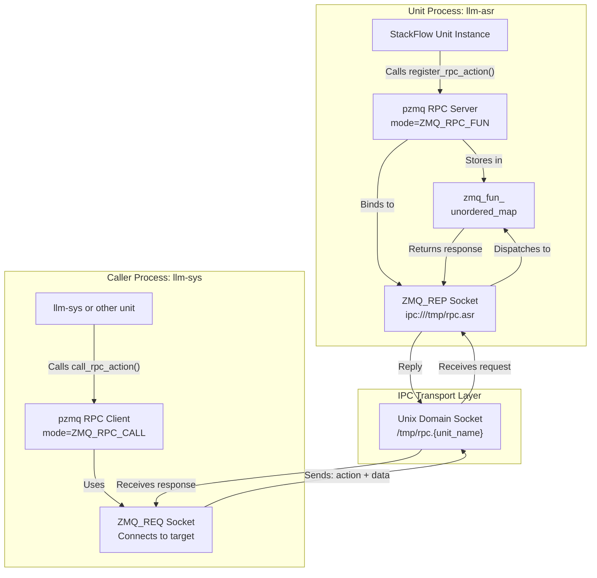
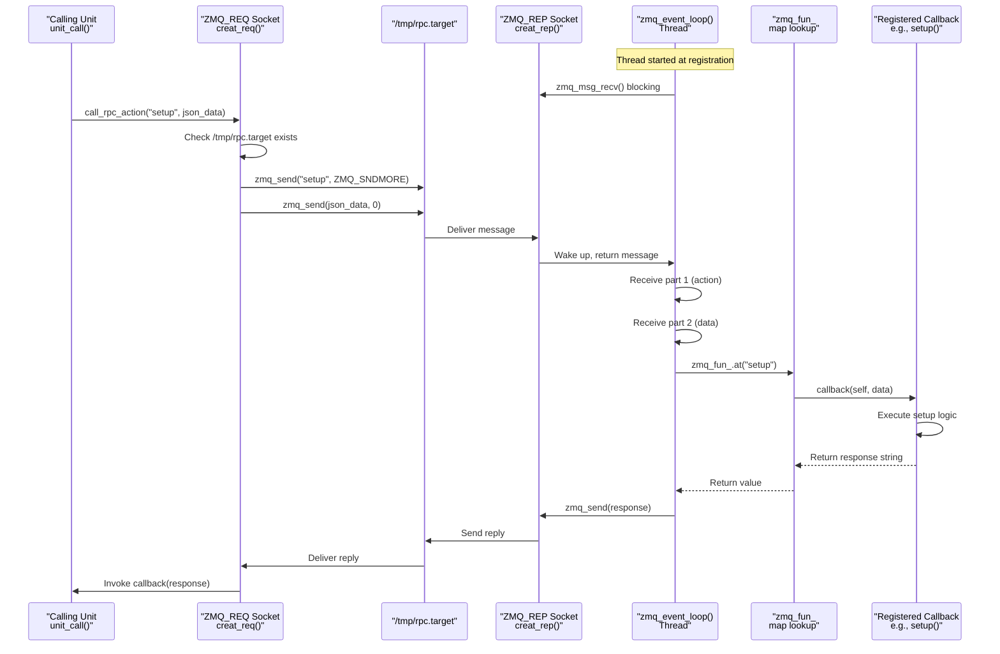
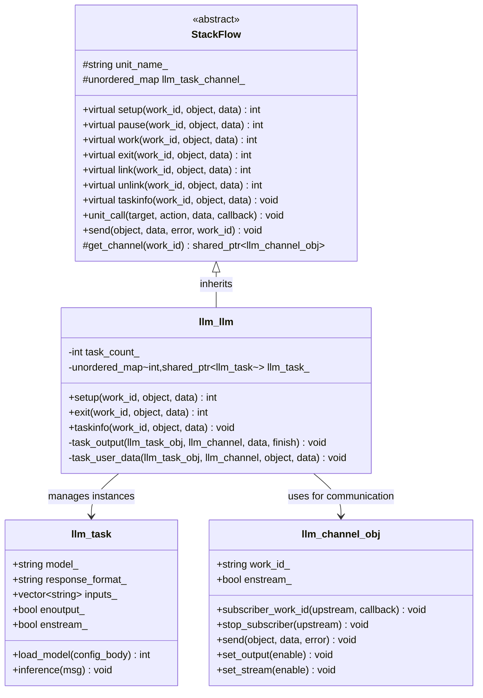
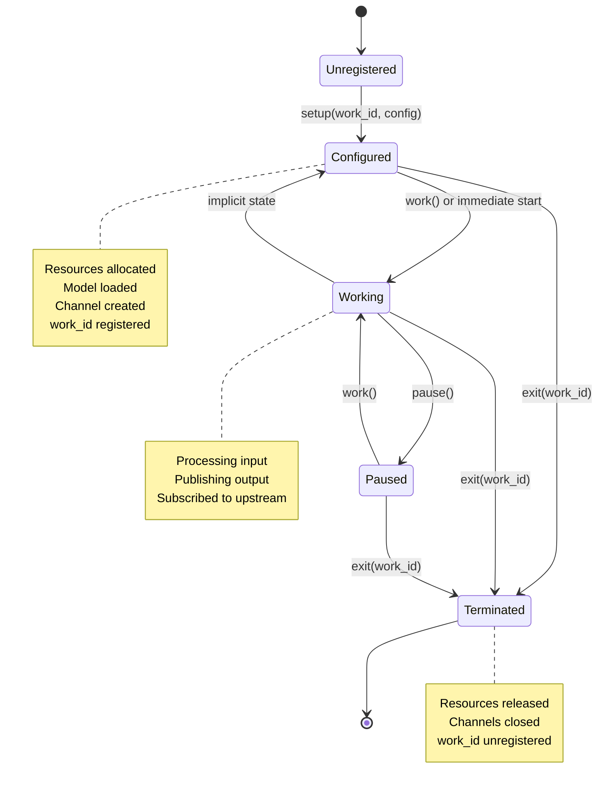
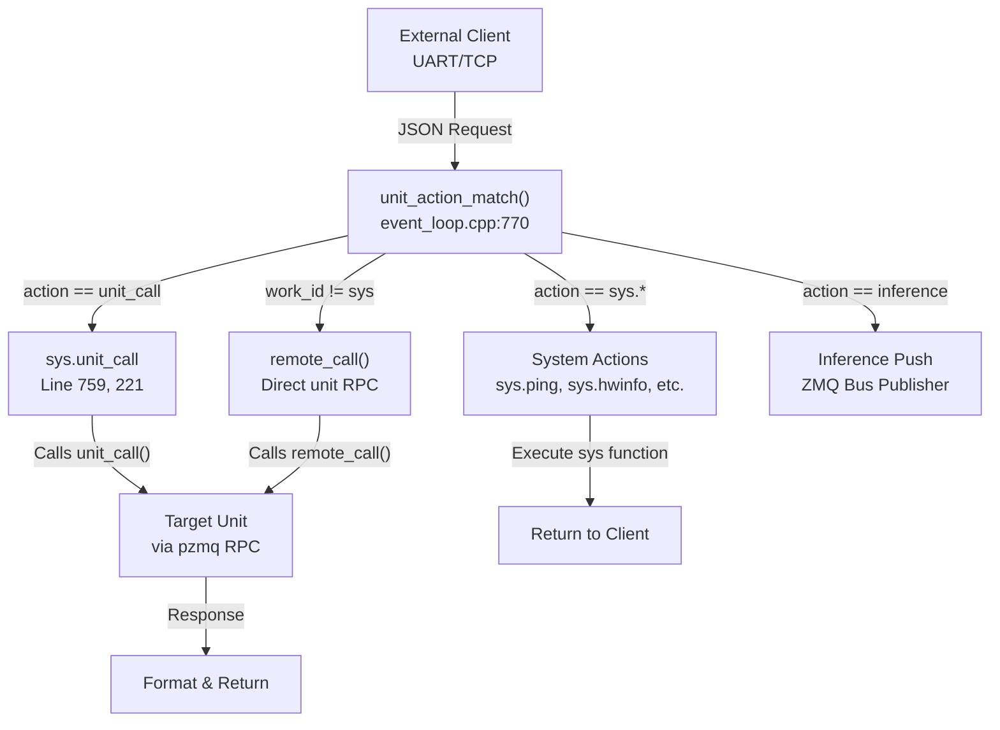
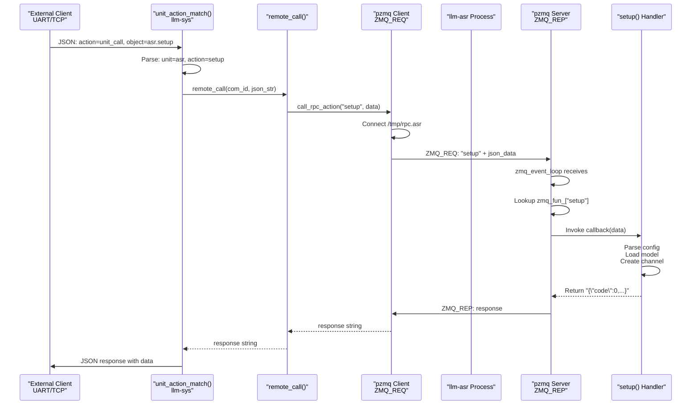
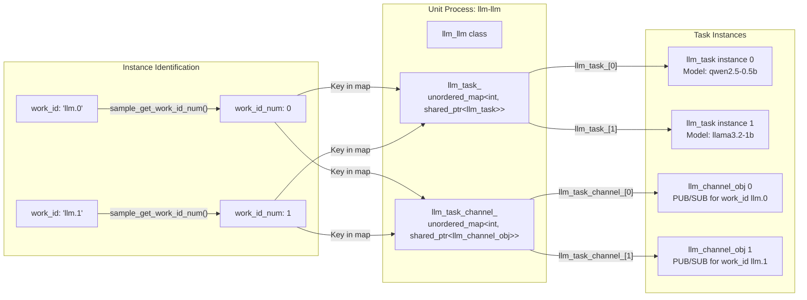
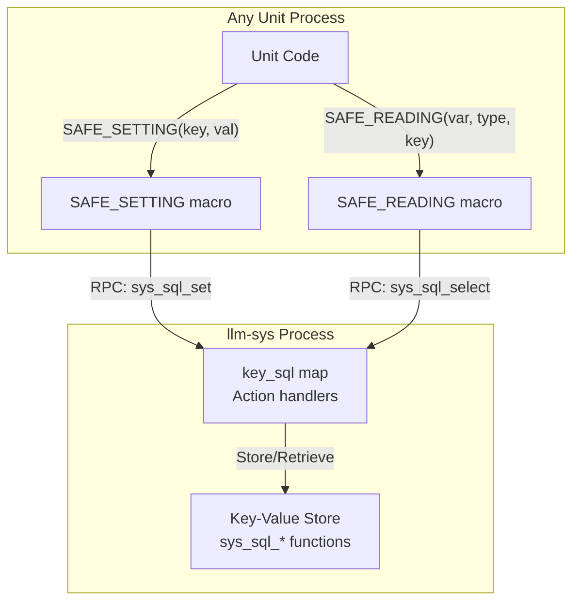

StackFlow RPC and Unit Management

# RPC and Unit Management

<details>
<summary>Relevant source files</summary>

The following files were used as context for generating this wiki page:

- [ext_components/StackFlow/stackflow/pzmq.hpp](ext_components/StackFlow/stackflow/pzmq.hpp)
- [ext_components/ax_msp/Kconfig](ext_components/ax_msp/Kconfig)
- [projects/llm_framework/SConstruct](projects/llm_framework/SConstruct)
- [projects/llm_framework/config_defaults.mk](projects/llm_framework/config_defaults.mk)
- [projects/llm_framework/main_sys/include/zmq_bus.h](projects/llm_framework/main_sys/include/zmq_bus.h)
- [projects/llm_framework/main_sys/src/event_loop.cpp](projects/llm_framework/main_sys/src/event_loop.cpp)
- [projects/llm_framework/main_sys/src/serial_com.cpp](projects/llm_framework/main_sys/src/serial_com.cpp)
- [projects/llm_framework/main_sys/src/tcp_com.cpp](projects/llm_framework/main_sys/src/tcp_com.cpp)
- [projects/llm_framework/main_sys/src/zmq_bus.cpp](projects/llm_framework/main_sys/src/zmq_bus.cpp)

</details>


This document describes the Remote Procedure Call (RPC) system in StackFlow and how units are managed through standardized lifecycle functions. It covers the seven mandatory RPC functions that all units implement, the mechanism for making RPC calls between units, and the work_id-based unit instance management system.

For information about communication patterns and message passing between units, see [Channel Objects](#2.3). For JSON API protocol details used by external clients, see [JSON API Protocol](#6.1).

## RPC Architecture Overview

StackFlow's RPC system is built on top of the `pzmq` library, which provides a simplified interface to ZeroMQ's REQ/REP (request-reply) communication pattern. The `pzmq` class [ext_components/StackFlow/stackflow/pzmq.hpp:86-506]() encapsulates RPC server and client functionality through two key methods:

- `register_rpc_action()` [ext_components/StackFlow/stackflow/pzmq.hpp:171-186]() - Registers a function to be callable via RPC
- `call_rpc_action()` [ext_components/StackFlow/stackflow/pzmq.hpp:194-224]() - Invokes a registered function on a remote unit

The RPC system uses two specialized socket types defined in pzmq:
- `ZMQ_RPC_FUN` (ZMQ_REP | 0x80) - Server-side socket type for exposing RPC functions
- `ZMQ_RPC_CALL` (ZMQ_REQ | 0x80) - Client-side socket type for invoking remote functions



**Sources:** [ext_components/StackFlow/stackflow/pzmq.hpp:17-18](), [ext_components/StackFlow/stackflow/pzmq.hpp:86-224](), [ext_components/StackFlow/stackflow/pzmq.hpp:328-347]()

### RPC Registration and Invocation Mechanism

Each StackFlow unit runs as a separate process with its own `pzmq` RPC server. The server listens on an IPC socket at `/tmp/rpc.{unit_name}` [ext_components/StackFlow/stackflow/pzmq.hpp:93]() (the `rpc_url_head_` prefix). When a unit starts, it registers callback functions for each RPC action it supports. The `pzmq` library maintains a map `zmq_fun_` [ext_components/StackFlow/stackflow/pzmq.hpp:96]() of action names to callback functions.

#### Registration Process

When `register_rpc_action()` [ext_components/StackFlow/stackflow/pzmq.hpp:171-186]() is called:
1. If this is the first registration, creates a ZMQ_REP socket via `creat()` with mode `ZMQ_RPC_FUN` [ext_components/StackFlow/stackflow/pzmq.hpp:181-182]()
2. The socket is bound to `ipc:///tmp/rpc.{server_name}` [ext_components/StackFlow/stackflow/pzmq.hpp:328-334]()
3. Stores the callback function in the `zmq_fun_` map with the action name as key
4. Automatically registers a `list_action` RPC that returns all available actions [ext_components/StackFlow/stackflow/pzmq.hpp:331]()
5. Spawns an event loop thread `zmq_event_loop()` [ext_components/StackFlow/stackflow/pzmq.hpp:333]() to process incoming requests

#### Invocation Process

When `call_rpc_action()` [ext_components/StackFlow/stackflow/pzmq.hpp:194-224]() is called:
1. Creates a ZMQ_REQ socket if not already connected [ext_components/StackFlow/stackflow/pzmq.hpp:199-206]()
2. Checks if the target socket file exists at `/tmp/rpc.{target}` [ext_components/StackFlow/stackflow/pzmq.hpp:339-342]()
3. Sends a two-part ZMQ message: action name (part 1) and data (part 2) [ext_components/StackFlow/stackflow/pzmq.hpp:210-211]()
4. Blocks waiting for response with configurable timeout [ext_components/StackFlow/stackflow/pzmq.hpp:344-345]()
5. Invokes the callback with the response [ext_components/StackFlow/stackflow/pzmq.hpp:217]()

#### Event Loop Dispatch

The RPC server's event loop [ext_components/StackFlow/stackflow/pzmq.hpp:348-393]() continuously:
1. Receives the two-part message (action + data) [ext_components/StackFlow/stackflow/pzmq.hpp:370-378]()
2. Looks up the action in `zmq_fun_` map [ext_components/StackFlow/stackflow/pzmq.hpp:382]()
3. Invokes the registered callback, passing the data
4. Sends the callback's return value as the reply [ext_components/StackFlow/stackflow/pzmq.hpp:386]()
5. If action not found, returns "{action} NotAction" [ext_components/StackFlow/stackflow/pzmq.hpp:384]()



**Sources:** [ext_components/StackFlow/stackflow/pzmq.hpp:93-96](), [ext_components/StackFlow/stackflow/pzmq.hpp:171-186](), [ext_components/StackFlow/stackflow/pzmq.hpp:194-224](), [ext_components/StackFlow/stackflow/pzmq.hpp:328-393]()

## Seven Standard RPC Functions

The StackFlow framework defines seven standard RPC functions that form the basis for unit lifecycle management and inter-unit communication. All units must implement at least `setup` and `exit`, while the others are optional depending on the unit's capabilities.

| RPC Function | Required | Purpose | Typical Return |
|--------------|----------|---------|----------------|
| `setup` | Yes | Configure and initialize a unit instance with a specific `work_id` | `0` on success, error code otherwise |
| `pause` | No | Temporarily suspend processing without releasing resources | `0` on success |
| `work` | No | Resume processing after pause or trigger specific work | `0` on success |
| `exit` | Yes | Clean up and terminate a unit instance | `0` on success |
| `link` | No | Subscribe to upstream unit's output for message chain | `0` on success |
| `unlink` | No | Unsubscribe from upstream unit's output | `0` on success |
| `taskinfo` | No | Query runtime information about the unit instance | JSON with task details |

**Sources:** [doc/component_doc/StackFlow_en.md:150-157]()

### Function Signatures and Implementation Pattern

Each RPC function in the `StackFlow` base class follows a consistent signature pattern. These are pure virtual functions that derived units must implement:

```cpp
virtual int setup(const std::string &work_id, const std::string &object, const std::string &data) = 0;
virtual int pause(const std::string &work_id, const std::string &object, const std::string &data) = 0;
virtual int work(const std::string &work_id, const std::string &object, const std::string &data) = 0;
virtual int exit(const std::string &work_id, const std::string &object, const std::string &data) = 0;
virtual int link(const std::string &work_id, const std::string &object, const std::string &data) = 0;
virtual int unlink(const std::string &work_id, const std::string &object, const std::string &data) = 0;
virtual void taskinfo(const std::string &work_id, const std::string &object, const std::string &data) = 0;
```

**Parameters:**
- `work_id` - Unique identifier for this unit instance (e.g., "llm.0", "asr.1")
- `object` - Specifies the data type or operation context (often the work_id or config type)
- `data` - JSON string containing configuration or operation parameters

**Return Values:**
- Most functions return `int`: 0 for success, non-zero for error
- `taskinfo()` returns `void` but sends response via `send()` method

### Registration Pattern in StackFlow Constructor

When a StackFlow-derived unit initializes, it registers these seven functions with its `pzmq` RPC server. This happens automatically in the `StackFlow` base class constructor by calling `register_rpc_action()` for each standard function:

```cpp
// In StackFlow constructor (pseudocode):
rpc_server_.register_rpc_action("setup", 
    [this](pzmq* p, const shared_ptr<pzmq_data>& data) {
        return this->setup(work_id, object, data_str);
    });
rpc_server_.register_rpc_action("exit", ...);
// ... similarly for pause, work, link, unlink, taskinfo
```

This ensures that any external caller can invoke these functions by connecting to the unit's IPC socket and sending the action name.

**Sources:** [ext_components/StackFlow/stackflow/pzmq.hpp:171-186]()

### Implementation Example from llm_llm Class

The following diagram maps the RPC function implementations in a concrete unit:



**Sources:** [doc/component_doc/StackFlow_en.md:252-393]()

## Unit Lifecycle State Machine

Units transition through distinct states managed by the seven RPC functions. The state machine ensures proper resource allocation and cleanup.



**Sources:** [doc/component_doc/StackFlow_en.md:150-157]()

### State Transitions in Code

The `setup` function creates state (lines 303-340):
- Parses configuration JSON
- Allocates a `llm_task` object for the `work_id`
- Initializes `llm_channel_obj` via `get_channel(work_id)`
- Registers callbacks for data handling
- Stores task instance in `llm_task_` map

The `exit` function destroys state (lines 367-381):
- Looks up task by `work_id_num`
- Calls `stop_subscriber()` on channel to unlink upstream
- Erases task from `llm_task_` map
- Returns success response

**Sources:** [doc/component_doc/StackFlow_en.md:303-381]()

## Making RPC Calls Between Units

### The unit_call Function

The `unit_call()` function in `StackFlow` base class provides the primary interface for invoking RPC functions on other units. Units can call this to trigger setup, exit, or other actions on remote units.

```cpp
void unit_call(const std::string &target_unit, 
               const std::string &action,
               const std::string &data,
               std::function<void(const std::string&)> callback)
```

This function internally uses `pzmq::call_rpc_action()` [ext_components/StackFlow/stackflow/pzmq.hpp:194-224]() to send a request to the target unit's IPC socket and execute the callback with the response.

### System-Level Unit Call via remote_action

The `llm-sys` unit provides a higher-level mechanism for external clients to invoke unit RPC calls through the `sys.unit_call` action. This is implemented in `event_loop.cpp`:

**Function: `_sys_unit_call()`** [projects/llm_framework/main_sys/src/event_loop.cpp:198-219]()

This function:
1. Extracts the `object` field from the JSON request (format: `"{unit_name}.{action}"`)
2. Extracts the `data` field containing parameters
3. Calls `unit_call()` to the target unit [projects/llm_framework/main_sys/src/event_loop.cpp:203]()
4. Formats the response as a JSON message and sends back to the caller

**Registration:** The `sys.unit_call` action is registered in the system's action map [projects/llm_framework/main_sys/src/event_loop.cpp:759]():

```cpp
key_sql["sys.unit_call"] = sys_unit_call;
```

This allows external clients (UART/TCP) to invoke unit RPC calls via:
```json
{
  "request_id": "123",
  "work_id": "sys",
  "action": "unit_call",
  "object": "asr.setup",
  "data": "{\"model\":\"...\"}"
}
```

### RPC Call Routing in unit_action_match

The central dispatcher function `unit_action_match()` [projects/llm_framework/main_sys/src/event_loop.cpp:770-844]() handles routing of all incoming commands:



**Routing Logic:**
1. **Line 815-829:** If `action` is "inference", push to ZMQ bus for async processing
2. **Line 830-838:** If `work_id` starts with "sys", look up in `key_sql` map and execute system function
3. **Line 839-843:** Otherwise, call `remote_call()` which invokes the unit's RPC endpoint

**Sources:** [projects/llm_framework/main_sys/src/event_loop.cpp:770-844](), [projects/llm_framework/main_sys/src/event_loop.cpp:198-227](), [projects/llm_framework/main_sys/src/event_loop.cpp:745-762]()

### RPC Call Flow Example



**Sources:** [projects/llm_framework/main_sys/src/event_loop.cpp:770-844](), [ext_components/StackFlow/stackflow/pzmq.hpp:194-224](), [ext_components/StackFlow/stackflow/pzmq.hpp:348-393]()

## Work ID Concept

The `work_id` is a string identifier that uniquely identifies a unit instance. It follows the format `"{unit_name}.{numeric_index}"` (e.g., `"llm.0"`, `"asr.1"`). A single unit type can have multiple instances, each with a different work_id.

### Work ID Utility Functions

StackFlow provides helper functions in `StackFlowUtil` for parsing and constructing work_ids:

| Function | Purpose | Example |
|----------|---------|---------|
| `sample_get_work_id_num()` | Extract numeric index from work_id | `"llm.0"` → `0` |
| `sample_get_work_id_name()` | Extract unit name from work_id | `"llm.0"` → `"llm"` |
| `sample_get_work_id()` | Construct work_id from name and index | `("llm", 0)` → `"llm.0"` |

**Sources:** [doc/component_doc/StackFlow_en.md:410-413]()

### Work ID Usage in Unit Management



**Sources:** [doc/component_doc/StackFlow_en.md:311-331](), [doc/component_doc/StackFlow_en.md:410-413]()

The code pattern in `setup()` demonstrates work_id usage:

```cpp
int work_id_num = sample_get_work_id_num(work_id);  // Extract numeric index
auto llm_channel = get_channel(work_id);             // Get/create channel for this work_id
auto llm_task_obj = std::make_shared<llm_task>(work_id);
// ... configuration ...
llm_task_[work_id_num] = llm_task_obj;              // Store using numeric index
```

**Sources:** [doc/component_doc/StackFlow_en.md:311-332]()

## System Database RPC APIs

StackFlow provides three RPC functions for accessing a simple key-value database managed by the `sys` unit. These functions allow units to store and retrieve persistent configuration data. The database is accessed through macros defined in the codebase that wrap RPC calls to the sys unit.

### Database Access Macros

The codebase provides convenience macros for database operations:

| Macro | Purpose | Parameters | Usage |
|-------|---------|------------|-------|
| `SAFE_SETTING(key, value)` | Store or update a key-value pair | `key` (string), `value` (any type) | `SAFE_SETTING("config_model", model_path);` |
| `SAFE_READING(var, type, key)` | Retrieve value and store in variable | `var` (variable), `type` (data type), `key` (string) | `SAFE_READING(port, int, "config_tcp_port");` |

**Example Usage in event_loop.cpp:**

Setting values [projects/llm_framework/main_sys/src/event_loop.cpp:85-88]():
```cpp
SAFE_SETTING("config_serial_baud", (int)json_obj["data"]["baud"]);
SAFE_SETTING("config_serial_data_bits", (int)json_obj["data"]["data_bits"]);
```

Reading values [projects/llm_framework/main_sys/src/event_loop.cpp:94-99]():
```cpp
SAFE_READING(uart_parm.baud, int, "config_serial_baud");
SAFE_READING(dev_name, std::string, "config_serial_dev");
SAFE_READING(port, int, "config_serial_zmq_port");
```

### Common Configuration Keys

The system database stores various configuration parameters used throughout the framework:

| Key Pattern | Example | Purpose |
|------------|---------|---------|
| `config_serial_*` | `config_serial_baud` | UART configuration parameters |
| `config_tcp_server` | `config_tcp_server` | TCP server port number |
| `config_lsmod_dir` | `config_lsmod_dir` | Directory for mode configuration files |
| `config_sys_stream_length` | `config_sys_stream_length` | Chunk size for streaming data |
| `serial_zmq_url` | `serial_zmq_url` | ZMQ URL for serial communication |
| `{unit_name}` | `llm`, `asr` | Unit registration and availability |



**Sources:** [projects/llm_framework/main_sys/src/event_loop.cpp:85-99](), [projects/llm_framework/main_sys/src/event_loop.cpp:310](), [projects/llm_framework/main_sys/src/event_loop.cpp:501]()

## Additional StackFlow APIs

Beyond the seven standard RPC functions, the `StackFlow` base class provides additional APIs for unit operation:

### Asynchronous Event Scheduling

```
void repeat_event(std::function<void()> callback, int interval_ms)
```

Schedules a callback function to be executed repeatedly at the specified interval. Built on top of the `eventpp` library for asynchronous event handling.

### User Message Sending

```
void send(const std::string &object, const std::string &data, 
          const nlohmann::json &error, const std::string &work_id)
```

Sends a user-defined message through the StackFlow message bus. This is distinct from RPC calls and is used for publishing data that other units can subscribe to via `llm_channel_obj`.

### Unit Registration Functions

```
void sys_register_unit()   // Register this unit with sys unit
void sys_release_unit()    // Unregister this unit from sys unit
```

These are typically called automatically during `StackFlow` base class construction/destruction and rarely need manual invocation.

**Sources:** [doc/component_doc/StackFlow_en.md:164-167]()

---

This page has documented the RPC system architecture, the seven mandatory RPC functions, unit lifecycle management, work_id-based instance identification, and the system database APIs. For details on how units communicate via publish/subscribe patterns, see [Channel Objects](#2.3).