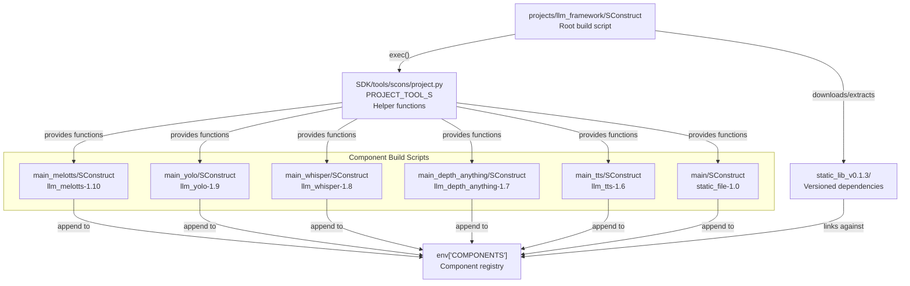
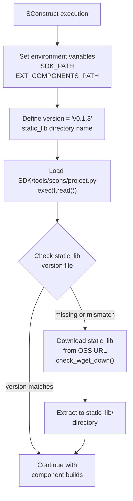
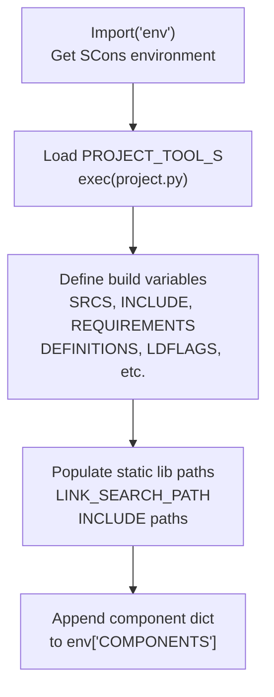
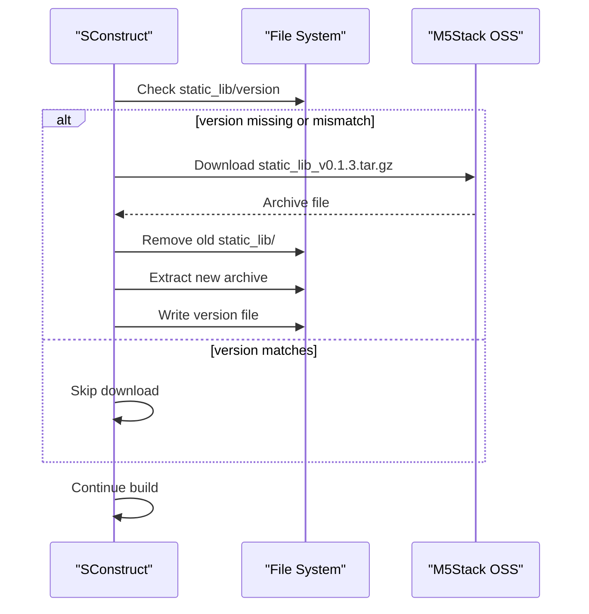
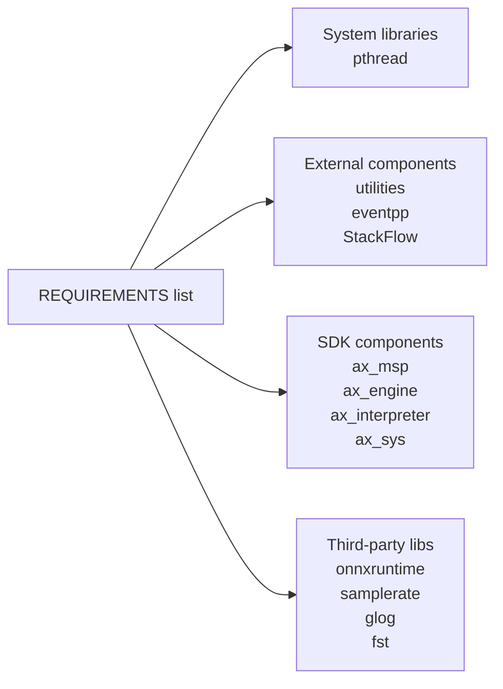
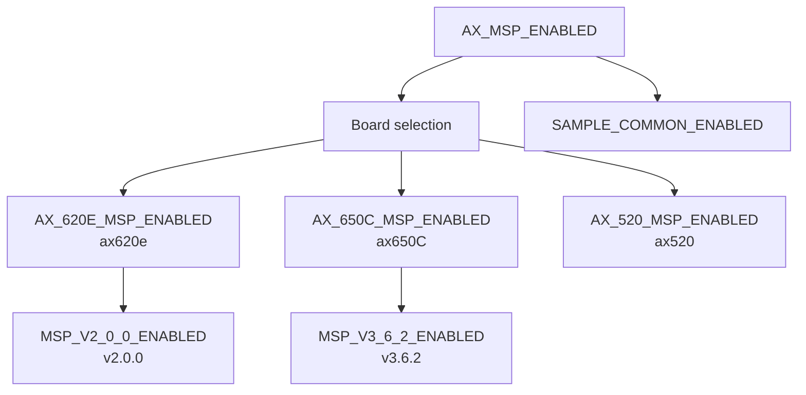
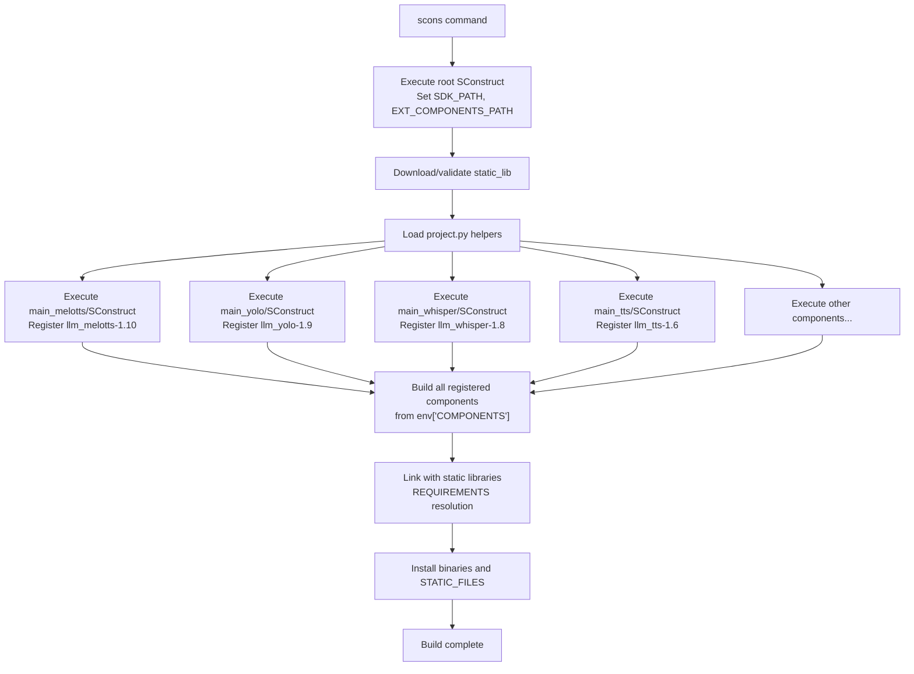

StackFlow SCons Build Overview

# SCons Build Overview

<details>
<summary>Relevant source files</summary>

The following files were used as context for generating this wiki page:

- [ext_components/StackFlow/stackflow/pzmq.hpp](ext_components/StackFlow/stackflow/pzmq.hpp)
- [ext_components/ax_msp/Kconfig](ext_components/ax_msp/Kconfig)
- [projects/llm_framework/SConstruct](projects/llm_framework/SConstruct)
- [projects/llm_framework/config_defaults.mk](projects/llm_framework/config_defaults.mk)
- [projects/llm_framework/main/SConstruct](projects/llm_framework/main/SConstruct)
- [projects/llm_framework/main_depth_anything/SConstruct](projects/llm_framework/main_depth_anything/SConstruct)
- [projects/llm_framework/main_melotts/SConstruct](projects/llm_framework/main_melotts/SConstruct)
- [projects/llm_framework/main_tts/SConstruct](projects/llm_framework/main_tts/SConstruct)
- [projects/llm_framework/main_whisper/SConstruct](projects/llm_framework/main_whisper/SConstruct)
- [projects/llm_framework/main_yolo/SConstruct](projects/llm_framework/main_yolo/SConstruct)

</details>


This document explains the SCons-based build system used to compile the StackFlow LLM framework. It covers the main build script structure, component registration pattern, dependency management, and the role of build configuration utilities. For information about cross-compilation toolchain configuration, see [Cross-Compilation and Toolchain](#6.4). For details on how build artifacts are packaged into Debian files, see [Package Creation System](#7.1).

## Purpose and Architecture

The StackFlow build system uses **SCons** (Software Construction tool) as a Python-based build automation system. The architecture follows a hierarchical pattern where a root `SConstruct` file manages versioned static libraries, and each component (e.g., `llm-melotts`, `llm-yolo`, `llm-whisper`) has its own `SConstruct` file that registers its build configuration into a central `COMPONENTS` list.

The build process:
1. Downloads and extracts versioned static libraries from remote storage
2. Loads the SDK's `project.py` tool providing helper functions
3. Each component's `SConstruct` registers its configuration
4. The build system compiles each registered component with its dependencies
5. Produces ARM64 Linux executables linked against static libraries

**Sources:** [projects/llm_framework/SConstruct:1-32]()

## Build System File Structure



**Sources:** [projects/llm_framework/SConstruct:1-32](), [projects/llm_framework/main_melotts/SConstruct:1-49](), [projects/llm_framework/main_yolo/SConstruct:1-56]()

## Root SConstruct Execution Flow

The root `SConstruct` file at [projects/llm_framework/SConstruct:1-32]() performs the following initialization sequence:



**Key operations:**

1. **Environment Setup** [projects/llm_framework/SConstruct:5-6](): Sets `SDK_PATH` and `EXT_COMPONENTS_PATH` pointing to SDK and external components directories
2. **Version Management** [projects/llm_framework/SConstruct:8-9](): Defines current static library version (`v0.1.3`)
3. **Tool Loading** [projects/llm_framework/SConstruct:12-13](): Executes `project.py` to load build helper functions into scope
4. **Library Download** [projects/llm_framework/SConstruct:24-31](): Downloads versioned static libraries from OSS if missing or outdated

The download URL pattern is: `https://m5stack.oss-cn-shenzhen.aliyuncs.com/resource/linux/llm/static_lib_{version}.tar.gz`

**Sources:** [projects/llm_framework/SConstruct:1-32]()

## PROJECT_TOOL_S and Helper Functions

The `PROJECT_TOOL_S` variable points to `SDK/tools/scons/project.py`, which is executed via `exec(f.read())` in each component's SConstruct. This provides essential helper functions used throughout the build system:

| Function | Purpose |
|----------|---------|
| `append_srcs_dir(dir)` | Recursively collects source files from a directory |
| `ADir(path)` | Resolves absolute directory path relative to component root |
| `AFile(path)` | Resolves absolute file path relative to component root |
| `check_wget_down(url, filename)` | Downloads and extracts archive from URL |
| `Glob(pattern)` | SCons built-in for file pattern matching |

Each component loads these utilities:

```python
Import('env')
with open(env['PROJECT_TOOL_S']) as f:
    exec(f.read())
```

The `env` is the SCons Environment object shared across all build scripts, containing the `COMPONENTS` list and other build state.

**Sources:** [projects/llm_framework/main_melotts/SConstruct:3-5](), [projects/llm_framework/main_yolo/SConstruct:3-5](), [projects/llm_framework/main_whisper/SConstruct:3-5]()

## Component Registration Pattern

Every StackFlow component follows a standardized registration pattern. Each component defines a configuration dictionary and appends it to `env['COMPONENTS']`:



**Standard component configuration structure:**

```python
env['COMPONENTS'].append({
    'target': 'executable_name-version',
    'SRCS': list,                    # Source files to compile
    'INCLUDE': list,                 # Public include directories
    'PRIVATE_INCLUDE': list,         # Private include directories
    'REQUIREMENTS': list,            # Library dependencies
    'STATIC_LIB': list,              # Static library files
    'DYNAMIC_LIB': list,             # Dynamic library files
    'DEFINITIONS': list,             # Compiler flags (public)
    'DEFINITIONS_PRIVATE': list,     # Compiler flags (private)
    'LDFLAGS': list,                 # Linker flags
    'LINK_SEARCH_PATH': list,        # Library search paths
    'STATIC_FILES': list,            # Additional files to install
    'REGISTER': 'project'            # Registration type
})
```

**Sources:** [projects/llm_framework/main_melotts/SConstruct:35-48](), [projects/llm_framework/main_yolo/SConstruct:42-55]()

## Component Configuration Examples

### MeloTTS Configuration

The `llm-melotts` component [projects/llm_framework/main_melotts/SConstruct:1-49]() demonstrates NPU-accelerated TTS build configuration:

| Field | Value |
|-------|-------|
| Target | `llm_melotts-1.10` |
| Sources | `append_srcs_dir(ADir('src'))` |
| Include Paths | Component include, static_lib headers, ONNX Runtime headers |
| Requirements | `pthread`, `utilities`, `ax_msp`, `eventpp`, `StackFlow`, `ax_engine`, `ax_interpreter`, `samplerate`, `glog`, `fst`, `onnxruntime` |
| Compiler Flags | `-O3`, `-fopenmp`, `-std=c++17` |
| Linker Flags | `-Wl,-rpath=/opt/m5stack/lib`, `-Wl,-rpath=/usr/local/m5stack/lib` |
| Link Search | `../static_lib`, `../static_lib/wetext` |
| Static Files | `models/mode_*.json` |

**Key dependencies:**
- **ONNX Runtime** [projects/llm_framework/main_melotts/SConstruct:31](): For neural network inference
- **Axera Engine** [projects/llm_framework/main_melotts/SConstruct:23](): NPU acceleration (`ax_engine`, `ax_interpreter`, `ax_sys`)
- **WeText Libraries** [projects/llm_framework/main_melotts/SConstruct:28-29](): Phoneme conversion (`glog`, `fst`)

**Sources:** [projects/llm_framework/main_melotts/SConstruct:1-49]()

### YOLO Configuration

The `llm-yolo` component [projects/llm_framework/main_yolo/SConstruct:1-56]() demonstrates vision model build configuration:

| Field | Value |
|-------|-------|
| Target | `llm_yolo-1.9` |
| Requirements | `pthread`, `utilities`, `ax_msp`, `eventpp`, `StackFlow`, `ax-samples`, `ax_engine` |
| Static Libraries | OpenCV 4.6 libraries, ABSL libraries (multiple files) |
| Compiler Flags | `-std=c++17`, `-O2` |
| Include Paths | `../static_lib/include`, `../static_lib/include/opencv4` |

**Notable pattern** [projects/llm_framework/main_yolo/SConstruct:26-28]():
```python
static_file = Glob('../static_lib/libopencv-4.6-aarch64-none/lib/lib*')
STATIC_LIB += static_file * 2
```

This multiplies the static library list by 2 to ensure proper linkage order for circular dependencies in OpenCV.

**Sources:** [projects/llm_framework/main_yolo/SConstruct:1-56]()

### Whisper Configuration

The `llm-whisper` component [projects/llm_framework/main_whisper/SConstruct:1-50]() demonstrates ASR with NPU acceleration:

**Key features:**
- Uses `single_header_libs` component for header-only dependencies
- Links OpenCC library for Chinese text processing [projects/llm_framework/main_whisper/SConstruct:30-32]()
- Includes Axera NPU engine for inference acceleration [projects/llm_framework/main_whisper/SConstruct:23]()

**Static linking pattern:**
```python
LINK_SEARCH_PATH += [ADir('../static_lib/opencc/lib')]
LDFLAGS += ['-l:libopencc.a', '-l:libmarisa.a']
```

**Sources:** [projects/llm_framework/main_whisper/SConstruct:1-50]()

## Common Build Configuration Patterns

### Compiler and Linker Flags

All components share common linker flags for runtime library paths [projects/llm_framework/main_melotts/SConstruct:21]():

```python
LDFLAGS += [
    '-Wl,-rpath=/opt/m5stack/lib',
    '-Wl,-rpath=/usr/local/m5stack/lib',
    '-Wl,-rpath=/usr/local/m5stack/lib/gcc-10.3',
    '-Wl,-rpath=/opt/lib',
    '-Wl,-rpath=/opt/usr/lib',
    '-Wl,-rpath=./'
]
```

These `rpath` entries ensure executables can locate shared libraries at runtime in standard M5Stack installation directories.

**Common compiler flags:**
- `-std=c++17`: C++17 standard
- `-O2` or `-O3`: Optimization levels
- `-fopenmp`: OpenMP parallelization support

**Sources:** [projects/llm_framework/main_melotts/SConstruct:20-21](), [projects/llm_framework/main_yolo/SConstruct:19-20]()

### Static Library Path Pattern

All components reference the versioned static library directory:

```python
LINK_SEARCH_PATH += [ADir('../static_lib')]
INCLUDE += [ADir('../static_lib/include')]
```

This provides access to:
- Pre-compiled third-party libraries (ONNX Runtime, NCNN, OpenCV)
- Header files for those libraries
- Axera NPU SDK components

**Sources:** [projects/llm_framework/main_melotts/SConstruct:22-26](), [projects/llm_framework/main_whisper/SConstruct:22-28]()

### Static Files Installation

Components can specify additional files to install alongside binaries [projects/llm_framework/main_melotts/SConstruct:33]():

```python
STATIC_FILES += Glob('models/mode_*.json')
```

This includes:
- **JSON configuration files** (`mode_*.json`): Model and parameter configurations
- **Shared libraries** [projects/llm_framework/main/SConstruct:23-33](): Runtime dependencies like `libonnxruntime.so`, `libzmq.so`, `libMNN.so`

**Sources:** [projects/llm_framework/main_melotts/SConstruct:33](), [projects/llm_framework/main/SConstruct:23-33]()

## Static Library Package Management

### Version-Based Download System

The static library system uses versioned packages to ensure reproducible builds:



**Version check logic** [projects/llm_framework/SConstruct:15-24]():

1. Check if `static_lib/` directory exists
2. If exists, read `static_lib/version` file
3. Compare version string with expected version
4. If mismatch or missing, set `update = True`
5. Download and extract new static library package

**Download URL format:**
```
https://m5stack.oss-cn-shenzhen.aliyuncs.com/resource/linux/llm/static_lib_{version}.tar.gz
```

**Sources:** [projects/llm_framework/SConstruct:8-32]()

### Static Library Contents

The `static_lib/` directory contains pre-built dependencies:

| Subdirectory/File | Contents |
|------------------|----------|
| `include/` | Header files for all dependencies |
| `include/opencv4/` | OpenCV 4.x headers |
| `include/onnxruntime/` | ONNX Runtime API headers |
| `libonnxruntime.so*` | ONNX Runtime shared library |
| `libzmq.so*` | ZeroMQ messaging library |
| `libMNN.so` | MNN inference engine |
| `sherpa/ncnn/` | Sherpa-NCNN ASR libraries |
| `wetext/` | WeText phoneme libraries (glog, fst) |
| `opencc/lib/` | OpenCC Chinese conversion |
| `module-llm/` | ABSL libraries for module components |
| `libopencv-4.6-aarch64-none/lib/` | OpenCV 4.6 static libraries |

**Sources:** [projects/llm_framework/main/SConstruct:23-33](), [projects/llm_framework/main_yolo/SConstruct:24-28]()

## Dependency Specification via REQUIREMENTS

The `REQUIREMENTS` list specifies component dependencies by name. These are resolved to actual library link flags by the build system:



**Common requirements:**

| Requirement | Type | Purpose |
|------------|------|---------|
| `pthread` | System | POSIX threads |
| `utilities` | Component | M5Stack utility functions |
| `eventpp` | Component | Event dispatcher library |
| `StackFlow` | Component | StackFlow framework base class |
| `ax_msp` | SDK | Axera Media Stream Processing |
| `ax_engine` | SDK | Axera NPU inference engine |
| `ax_interpreter` | SDK | Axera model interpreter |
| `ax_sys` | SDK | Axera system utilities |
| `onnxruntime` | Third-party | ONNX model inference |
| `samplerate` | Third-party | Audio resampling |

**Example from MeloTTS** [projects/llm_framework/main_melotts/SConstruct:11]():
```python
REQUIREMENTS = ['pthread', 'utilities', 'ax_msp', 'eventpp', 'StackFlow']
REQUIREMENTS += ['ax_engine', 'ax_interpreter', 'ax_sys']
REQUIREMENTS += ['samplerate']
REQUIREMENTS += ['glog', 'fst']
REQUIREMENTS += ['onnxruntime']
```

**Sources:** [projects/llm_framework/main_melotts/SConstruct:11-31](), [projects/llm_framework/main_yolo/SConstruct:10-22]()

## Configuration File Integration

The build system integrates Kconfig-based hardware selection through [ext_components/ax_msp/Kconfig:1-52]() and [projects/llm_framework/config_defaults.mk:1-26]().

### Hardware Platform Selection

**Kconfig menu structure:**



**Default configuration** [projects/llm_framework/config_defaults.mk:1-26]() enables:

```makefile
CONFIG_TOOLCHAIN_PATH="/opt/gcc-arm-10.3-2021.07-x86_64-aarch64-none-linux-gnu/bin"
CONFIG_TOOLCHAIN_PREFIX="aarch64-none-linux-gnu-"
CONFIG_AX_MSP_ENABLED=y
CONFIG_AX_620E_MSP_ENABLED=y
CONFIG_AX630C_OPENWRT_SDK_ENABLED=y
CONFIG_STACKFLOW_ENABLED=y
```

These flags control which BSP (Board Support Package) and SDK components are included in the build.

**Sources:** [ext_components/ax_msp/Kconfig:1-52](), [projects/llm_framework/config_defaults.mk:1-26]()

## Build System Workflow Summary

The complete build process executes in this order:



**Key characteristics:**
- **Declarative configuration**: Components declare their requirements rather than implementing build logic
- **Centralized dependency management**: All components use the same static library version
- **Modular architecture**: Each component is independently buildable
- **Versioned artifacts**: Both static libraries and component targets have version numbers

**Sources:** [projects/llm_framework/SConstruct:1-32](), [projects/llm_framework/main_melotts/SConstruct:1-49]()