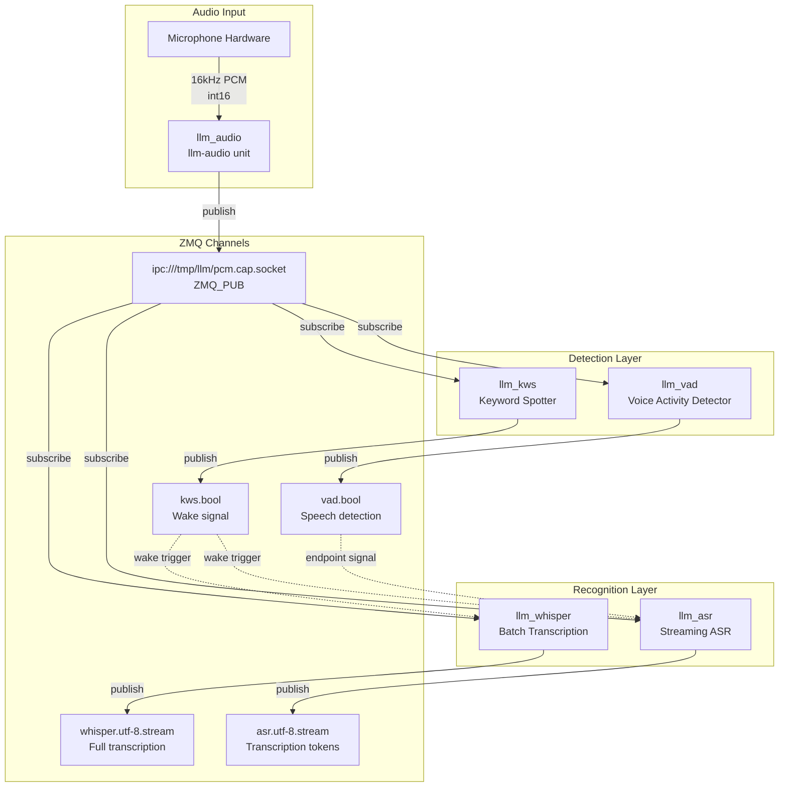
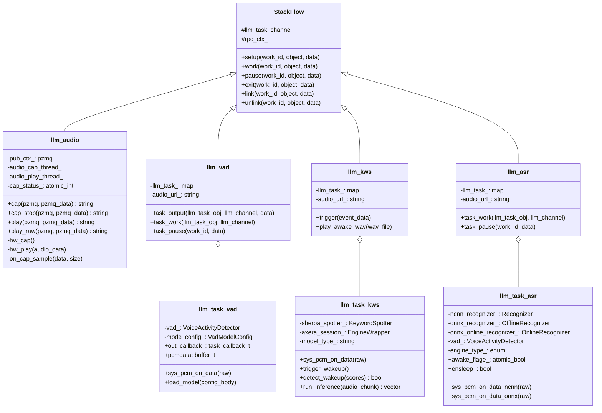
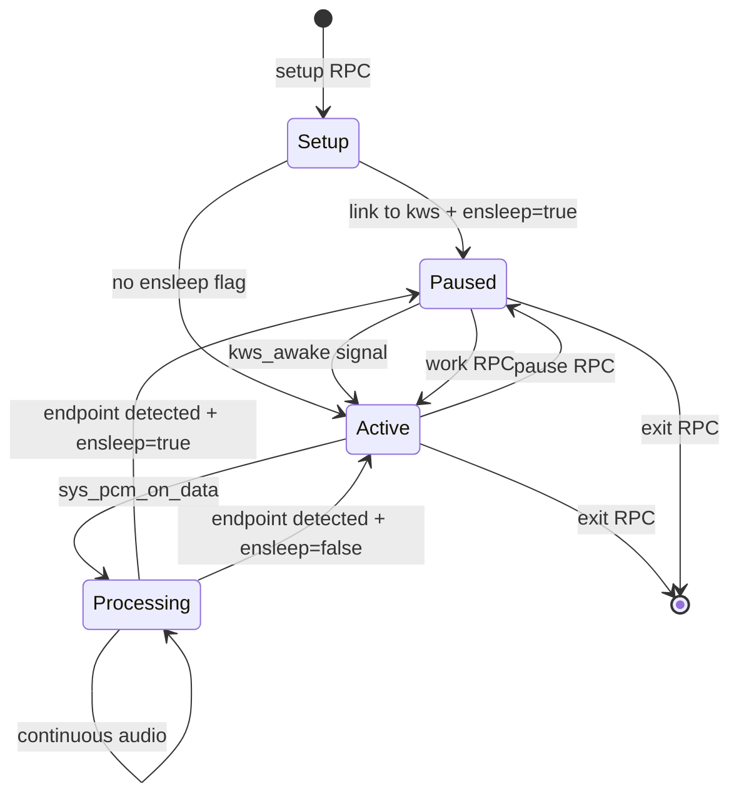
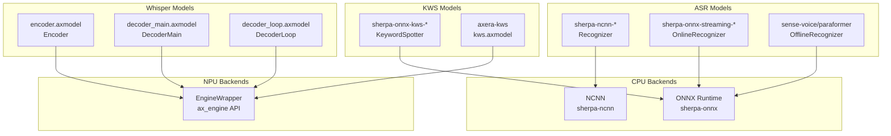
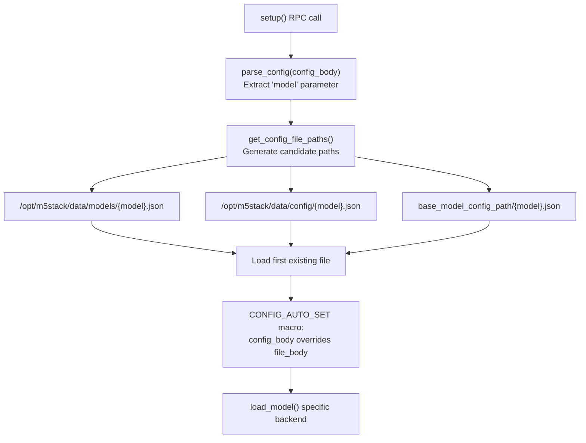

StackFlow Speech Processing Units

# Speech Processing Units

<details>
<summary>Relevant source files</summary>

The following files were used as context for generating this wiki page:

- [projects/llm_framework/main_asr/src/main.cpp](projects/llm_framework/main_asr/src/main.cpp)
- [projects/llm_framework/main_audio/SConstruct](projects/llm_framework/main_audio/SConstruct)
- [projects/llm_framework/main_audio/src/main.cpp](projects/llm_framework/main_audio/src/main.cpp)
- [projects/llm_framework/main_kws/src/main.cpp](projects/llm_framework/main_kws/src/main.cpp)
- [projects/llm_framework/main_vad/src/main.cpp](projects/llm_framework/main_vad/src/main.cpp)
- [projects/llm_framework/main_whisper/src/main.cpp](projects/llm_framework/main_whisper/src/main.cpp)

</details>


This page provides an overview of the speech processing pipeline within StackFlow, covering audio input/output, voice activity detection, keyword spotting, and speech recognition. These units collaborate to enable voice-driven interactions, from capturing raw audio to producing transcribed text.

For text-to-speech synthesis (the output side of voice interaction), see [Text-to-Speech Systems](#3.5). For individual unit details, see the respective child pages: [Audio I/O](#3.1), [Voice Activity Detection](#3.2), [Keyword Spotting](#3.3), [Speech Recognition](#3.4).

## Overview and Architecture

The speech processing pipeline consists of five primary units, each implementing the `StackFlow` base class and communicating via ZMQ message passing:

| Unit | Purpose | Primary Backend | Hardware |
|------|---------|----------------|----------|
| `llm-audio` | Audio capture/playback | ALSA or AX Audio | CPU |
| `llm-vad` | Voice activity detection | Silero VAD (sherpa-onnx) | CPU |
| `llm-kws` | Wake word detection | sherpa-onnx or Axera KWS | CPU/NPU |
| `llm-asr` | Streaming ASR | sherpa-ncnn/sherpa-onnx | CPU |
| `llm-whisper` | Batch transcription | Whisper (Axera) | NPU |

### Speech Processing Data Flow



**Sources:** [projects/llm_framework/main_audio/src/main.cpp:43-54](), [projects/llm_framework/main_kws/src/main.cpp:626-644](), [projects/llm_framework/main_vad/src/main.cpp:238-250](), [projects/llm_framework/main_asr/src/main.cpp:66-122]()

## Component Architecture

Each speech processing unit inherits from the `StackFlow` base class and implements a standard lifecycle:

### Unit Class Structure



**Sources:** [projects/llm_framework/main_audio/src/main.cpp:39-196](), [projects/llm_framework/main_vad/src/main.cpp:44-235](), [projects/llm_framework/main_kws/src/main.cpp:52-624](), [projects/llm_framework/main_asr/src/main.cpp:66-494]()

## Audio I/O Foundation

The `llm_audio` unit serves as the foundation for all speech processing, handling hardware interaction and PCM data distribution.

### Audio Capture Flow

1. **Initialization**: `setup()` loads configuration from `audio.json`, `audio_kit.json`, or `audio_pyramid.json` based on platform detection
2. **Capture Start**: `cap()` RPC call increments `cap_status_` counter and starts `hw_cap()` thread if not running
3. **Data Publishing**: `on_cap_sample()` callback publishes PCM frames to `sys_pcm_cap_channel` ZMQ socket
4. **Reference Counting**: Multiple units can subscribe; capture stops only when `cap_status_` reaches zero

### Platform Backends

The unit compiles with different audio backends based on the build configuration:

| Configuration Flag | Backend | Implementation | Platform |
|-------------------|---------|----------------|----------|
| `CONFIG_AX_620E_MSP_ENABLED` | AX Audio | `sample_audio.c` | AX620E |
| `CONFIG_AX_620Q_MSP_ENABLED` | AX Audio | `sample_audio.c` | AX620Q |
| Default | ALSA | `alsa_audio.c` | Generic Linux |

**Sources:** [projects/llm_framework/main_audio/src/main.cpp:25-29](), [projects/llm_framework/main_audio/src/main.cpp:113-122](), [projects/llm_framework/main_audio/SConstruct:8-11]()

### Audio Configuration Parameters

Configuration is loaded via the `CONFIG_AUTO_SET` macro pattern which checks both the RPC parameters and the JSON file for each setting:

**Capture Parameters** (from `cap_param` section):
- Hardware: `card`, `device`, `volume`, `channel`, `rate`, `bit`
- Buffer: `u32PeriodSize`, `u32PeriodCount`, `U32Depth`
- VQE: `stVqeAttr.stNsCfg`, `stVqeAttr.stAgcCfg`, `stVqeAttr.stAecCfg` (AX platforms only)
- Channel URL: `sys_pcm_cap_channel` (default: `ipc:///tmp/llm/pcm.cap.socket`)

**Playback Parameters** (from `play_param` section):
- Hardware: `card`, `device`, `volume`, `channel`, `rate`, `bit`
- Mono-to-stereo conversion support for 2-channel output

**Sources:** [projects/llm_framework/main_audio/src/main.cpp:31-35](), [projects/llm_framework/main_audio/src/main.cpp:242-377]()

## Wake-Sleep Cycle Management

Speech units implement a wake-sleep pattern to conserve resources. Units remain paused until activated by a wake signal, then automatically return to sleep after processing.

### State Machine



**Sources:** [projects/llm_framework/main_asr/src/main.cpp:111-122](), [projects/llm_framework/main_whisper/src/main.cpp:93-103](), [projects/llm_framework/main_vad/src/main.cpp:54-67]()

### Wake Signal Flow

The typical interaction sequence for a wake word triggered pipeline:

1. **KWS Detection**: `llm_task_kws::sys_pcm_on_data()` detects keyword at [main_kws/src/main.cpp:484-539]()
2. **Wake Signal**: KWS publishes to `response_format_` channel (typically `kws.bool`)
3. **ASR Activation**: ASR unit's `kws_awake()` callback receives signal, delays `awake_delay_` ms, then calls `task_work()`
4. **Audio Subscription**: `task_work()` subscribes ASR to `audio_url_` (PCM stream)
5. **Processing**: ASR processes audio until endpoint detected
6. **Auto-Sleep**: If `ensleep_ == true`, ASR calls `pause()` callback to unsubscribe from audio

**Sources:** [projects/llm_framework/main_asr/src/main.cpp:719-766](), [projects/llm_framework/main_whisper/src/main.cpp:755-766]()

### Delay Compensation

Audio buffering delays are configured per-unit to ensure wake words are not lost:

- **KWS**: `delay_audio_frame_` (default 10 frames) buffers audio before processing starts
- **ASR**: `awake_delay_` (default 50ms) delays activation to allow KWS to clear its buffer
- **Whisper**: `awake_delay_` (default 1ms), `delay_audio_frame_` (default 3000 frames)

**Sources:** [projects/llm_framework/main_kws/src/main.cpp:69](), [projects/llm_framework/main_asr/src/main.cpp:115-116](), [projects/llm_framework/main_whisper/src/main.cpp:101-102]()

## Inference Engine Selection

Speech units support multiple inference backends, selected at model load time based on the `model` configuration parameter.

### Backend Detection Logic

**KWS Backend Selection** (llm-kws):
```
model.rfind("sherpa-onnx", 0) == 0  → sherpa (CPU: ONNX Runtime)
else                                 → axera (NPU: EngineWrapper)
```

**ASR Backend Selection** (llm-asr):
```
model.rfind("sherpa-ncnn", 0) == 0  → ENGINE_NCNN (CPU: NCNN)
model.rfind("sherpa-onnx", 0) == 0  → ENGINE_ONLINE (CPU: ONNX streaming)
else                                → ENGINE_ONNX (CPU: ONNX offline)
```

**Whisper**: Always uses Axera NPU with three model components (encoder, decoder_main, decoder_loop)

**Sources:** [projects/llm_framework/main_kws/src/main.cpp:117-121](), [projects/llm_framework/main_asr/src/main.cpp:151-157]()

### Inference Backend Implementations



**Sources:** [projects/llm_framework/main_kws/src/main.cpp:71-79](), [projects/llm_framework/main_asr/src/main.cpp:67-86](), [projects/llm_framework/main_whisper/src/main.cpp:80-83]()

## Audio Buffering and Processing

All speech recognition units use a common buffering pattern implemented via `buffer_t` from the `libs/buffer.h` library.

### PCM Data Processing Pattern

The standard processing flow in `sys_pcm_on_data()`:

1. **Delay Frames**: Skip first `delay_audio_frame_` frames to compensate for startup latency
2. **Buffer Write**: `buffer_write_char(pcmdata, raw.data(), raw.length())`
3. **Position Reset**: `buffer_position_set(pcmdata, 0)`
4. **Conversion Loop**: Read int16 samples, convert to float, normalize to [-1.0, 1.0]
5. **Buffer Clear**: `buffer_resize(pcmdata, 0)` for next iteration

**Example from llm_asr (NCNN backend):**

```cpp
// At main_asr/src/main.cpp:501-519
static int count = 0;
if (count < delay_audio_frame_) {
    buffer_write_char(pcmdata, raw.data(), raw.length());
    count++;
    return;
}
buffer_write_char(pcmdata, raw.data(), raw.length());
buffer_position_set(pcmdata, 0);

std::vector<float> floatSamples;
int16_t audio_val;
while (buffer_read_i16(pcmdata, &audio_val, 1)) {
    float normalizedSample = static_cast<float>(audio_val) / INT16_MAX;
    floatSamples.push_back(normalizedSample);
}
buffer_resize(pcmdata, 0);
count = 0;
```

**Sources:** [projects/llm_framework/main_asr/src/main.cpp:501-552](), [projects/llm_framework/main_kws/src/main.cpp:484-508](), [projects/llm_framework/main_whisper/src/main.cpp:336-360]()

### Normalization Differences

Different backends require different normalization:

| Backend | Normalization | Reasoning |
|---------|--------------|-----------|
| Sherpa-ONNX | `/ INT16_MAX` | Standard [-1.0, 1.0] range |
| Sherpa-NCNN | `/ INT16_MAX` | Standard [-1.0, 1.0] range |
| Axera KWS | `/ 1.0` | Model expects unnormalized int16 as float |
| Whisper | `/ INT16_MAX` | Standard [-1.0, 1.0] range |

**Sources:** [projects/llm_framework/main_kws/src/main.cpp:500-505](), [projects/llm_framework/main_asr/src/main.cpp:515-516]()

## VAD Integration Patterns

Voice Activity Detection is integrated into speech processing in two ways:

### Pattern 1: Standalone VAD Unit

The `llm_vad` unit runs Silero VAD and publishes speech detection events:

- **Input**: Subscribes to `sys.pcm` from `llm_audio`
- **Processing**: `vad_->AcceptWaveform()` processes audio in `window_size` chunks
- **Output**: Publishes `true` when speech detected, `false` at segment end
- **Configuration**: `silero_vad.threshold`, `min_silence_duration`, `min_speech_duration`, `window_size`

**Sources:** [projects/llm_framework/main_vad/src/main.cpp:153-202]()

### Pattern 2: Embedded VAD in ASR

The `llm_asr` unit (ONNX offline mode) embeds VAD for automatic segmentation:

1. **Initialization**: Creates `sherpa_onnx::VoiceActivityDetector` alongside `OfflineRecognizer`
2. **Audio Accumulation**: Feeds audio to `vad_->AcceptWaveform()` in window-sized chunks
3. **Segment Detection**: `while (!vad_->Empty())` retrieves speech segments
4. **Recognition**: Each segment passed to `offline_stream_->AcceptWaveform()`
5. **Auto-Sleep**: After segment recognized, optionally calls `pause()` if `ensleep_ == true`

**Sources:** [projects/llm_framework/main_asr/src/main.cpp:555-640]()

## Streaming vs. Batch Processing

Speech units support two operational modes:

### Streaming Mode

**Enabled when**: `response_format` contains `"stream"`

**Characteristics**:
- Token-by-token output as recognition proceeds
- `out_callback_` invoked with `finish=false` for each partial result
- Final result sent with `finish=true`
- Used by: llm-asr (NCNN and online ONNX), llm-kws (JSON output mode)

**Output format**:
```json
{
  "index": 0,
  "delta": "partial text",
  "finish": false
}
```

**Sources:** [projects/llm_framework/main_asr/src/main.cpp:536-552](), [projects/llm_framework/main_kws/src/main.cpp:664-676]()

### Batch Mode

**Enabled when**: `response_format` does not contain `"stream"`

**Characteristics**:
- Full transcription after complete audio segment processed
- Single `out_callback_` invocation with `finish=true`
- Used by: llm-asr (ONNX offline with VAD), llm-whisper

**Output format**: Plain text string

**Sources:** [projects/llm_framework/main_asr/src/main.cpp:626-638](), [projects/llm_framework/main_whisper/src/main.cpp:508-516]()

## Multi-Language Support

### Whisper Language Detection

The Whisper unit supports 99 languages with automatic detection:

1. **Configuration**: `language` parameter (e.g., "zh", "en", "ja")
2. **Token Lookup**: `detect_language()` maps language code to SOT token from `WHISPER_LANG_CODES`
3. **SOT Sequence**: `[whisper_sot, lang_token, whisper_transcribe, whisper_no_timestamps]`
4. **Post-Processing**: For non-English/Japanese, applies OpenCC traditional-to-simplified conversion

**Sources:** [projects/llm_framework/main_whisper/src/main.cpp:132-147](), [projects/llm_framework/main_whisper/src/main.cpp:174-185](), [projects/llm_framework/main_whisper/src/main.cpp:508-516]()

### ASR Language Configuration

Sherpa-based ASR units load language-specific models and tokenizers:

- **Tokens file**: Maps token IDs to characters/words
- **BPE vocab**: Byte-pair encoding vocabulary for subword tokenization  
- **Language models**: Optional LM rescoring via `lm_config.model`

**Sources:** [projects/llm_framework/main_asr/src/main.cpp:283-289]()

## Configuration Loading

All speech units follow a common configuration loading pattern:

### Configuration File Resolution



**Sources:** [projects/llm_framework/main_kws/src/main.cpp:161-183](), [projects/llm_framework/main_asr/src/main.cpp:463-481]()

### Configuration Macro Pattern

The `CONFIG_AUTO_SET` macro provides a two-level configuration hierarchy:

```cpp
#define CONFIG_AUTO_SET(obj, key)             \
    if (config_body.contains(#key))           \
        mode_config_.key = config_body[#key]; \
    else if (obj.contains(#key))              \
        mode_config_.key = obj[#key];
```

**Priority**:
1. RPC `data` parameter (runtime override)
2. JSON file `mode_param` section (persistent configuration)

**Usage**: `CONFIG_AUTO_SET(file_body["mode_param"], threshold);`

**Sources:** [projects/llm_framework/main_kws/src/main.cpp:155-159](), [projects/llm_framework/main_asr/src/main.cpp:42-46](), [projects/llm_framework/main_vad/src/main.cpp:38-42]()

## Output Channel Management

Speech units publish results through `llm_channel_obj` configured by `response_format`:

### Channel Format Specification

The `response_format` string determines:
- **Topic name**: Published to `{unit_name}.{response_format}` (e.g., `asr.utf-8.stream`)
- **Streaming mode**: Contains `"stream"` → streaming enabled
- **Data encoding**: Specified in format string (e.g., `utf-8`, `base64`, `json`)

### Output Methods

**Method 1: Direct Callback**
```cpp
llm_task_obj->set_output(std::bind(&llm_kws::task_output, this, 
    weak_ptr, weak_ptr, placeholders::_1, placeholders::_2));
```

**Method 2: Channel Send**
```cpp
llm_channel->send(response_format_, data, LLM_NO_ERROR);
```

**Sources:** [projects/llm_framework/main_kws/src/main.cpp:654-677](), [projects/llm_framework/main_asr/src/main.cpp:772-816]()

## Hardware Abstraction

The speech units maintain hardware abstraction through conditional compilation and runtime backend selection:

### Platform Detection (llm-audio)

```cpp
#if defined(CONFIG_AX_620E_MSP_ENABLED) || defined(CONFIG_AX_620Q_MSP_ENABLED)
    #include "sample_audio.h"
    // AX platform audio APIs
#else
    #include "alsa_audio.h"
    // ALSA audio APIs
#endif
```

**Sources:** [projects/llm_framework/main_audio/src/main.cpp:25-29]()

### NPU Initialization (llm-kws, llm-whisper)

Units using NPU maintain reference counting for `AX_SYS_Init()` and `AX_ENGINE_Init()`:

```cpp
void _ax_init() {
    if (!ax_init_flage_) {
        AX_SYS_Init();
        AX_ENGINE_NPU_ATTR_T npu_attr;
        memset(&npu_attr, 0, sizeof(npu_attr));
        AX_ENGINE_Init(&npu_attr);
    }
    ax_init_flage_++;
}
```

**Sources:** [projects/llm_framework/main_kws/src/main.cpp:579-594](), [projects/llm_framework/main_whisper/src/main.cpp:528-544]()

This ensures proper hardware resource management even when multiple units share the NPU.