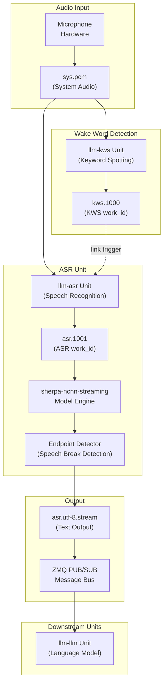
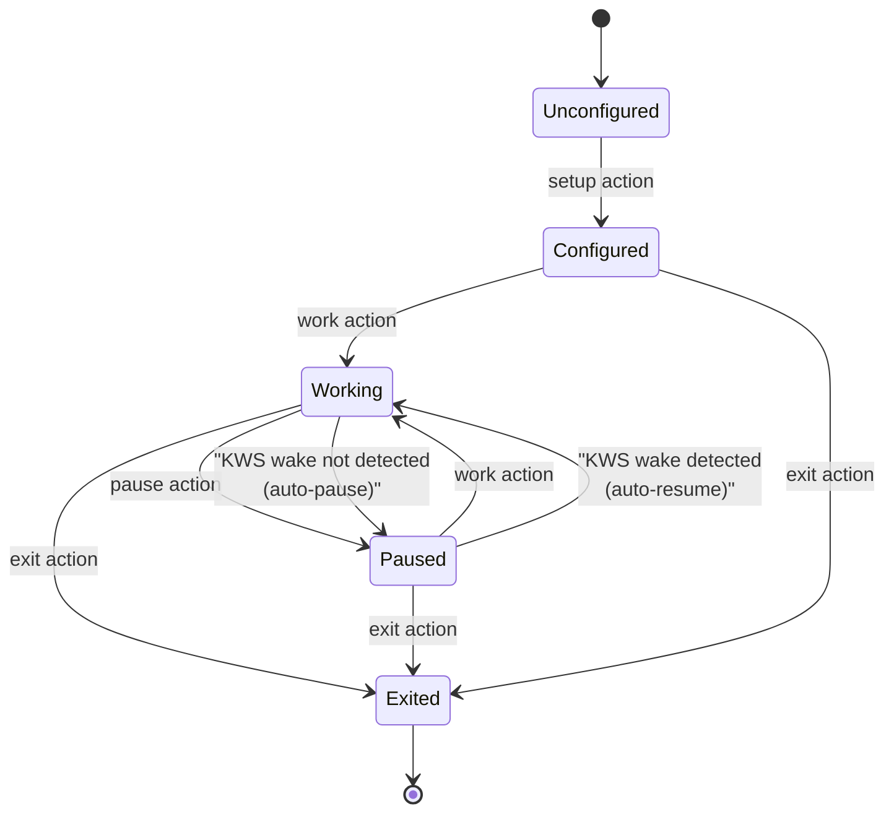
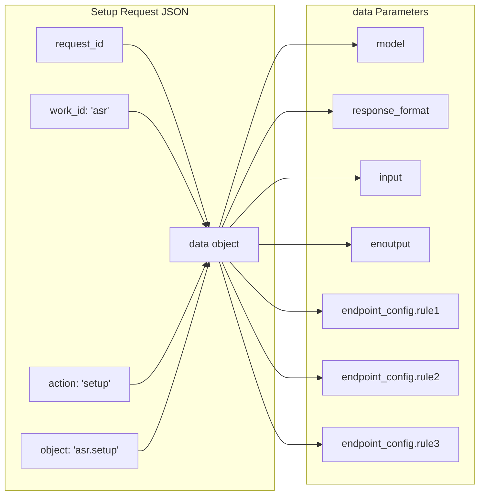
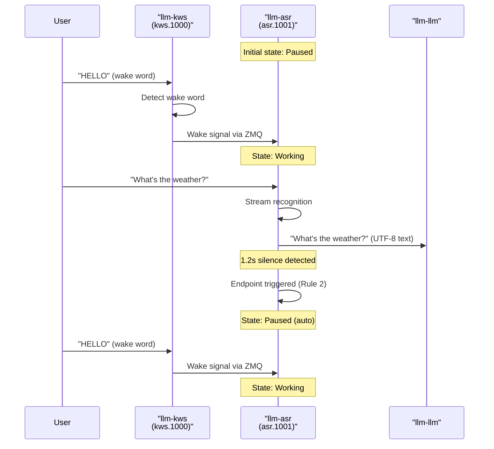

StackFlow Speech Recognition (llm-asr, llm-whisper)

# Speech Recognition (llm-asr)

<details>
<summary>Relevant source files</summary>

The following files were used as context for generating this wiki page:

- [projects/llm_framework/main_asr/src/main.cpp](projects/llm_framework/main_asr/src/main.cpp)
- [projects/llm_framework/main_kws/src/main.cpp](projects/llm_framework/main_kws/src/main.cpp)
- [projects/llm_framework/main_vad/src/main.cpp](projects/llm_framework/main_vad/src/main.cpp)
- [projects/llm_framework/main_whisper/src/main.cpp](projects/llm_framework/main_whisper/src/main.cpp)

</details>


## Purpose and Scope

This document describes the `llm-asr` unit, which provides automatic speech recognition (ASR) services within the StackFlow framework. The unit converts spoken audio into text using streaming recognition models and supports both Chinese and English languages.

For information about the audio I/O subsystem that provides audio input to ASR, see [Audio I/O (llm-audio)](#3.1.1). For information about wake word detection that triggers ASR, see [Keyword Spotting (llm-kws)](#3.1.2). For information about the broader voice assistant pipeline, see [Voice Assistant Pipeline](#1.3).

**Sources:** [doc/projects_llm_framework_doc/llm_asr_en.md:1-4]()

## Overview

The `llm-asr` unit is a StackFlow AI service unit responsible for speech-to-text conversion. It operates as a streaming recognizer, processing audio input in real-time and producing UTF-8 text output. The unit supports endpoint detection to automatically determine when speech has ended, and can integrate with the KWS unit to enable wake-word-triggered recognition.

**Sources:** [doc/projects_llm_framework_doc/llm_asr_en.md:1-4](), [doc/projects_llm_framework_doc/llm_asr_zh.md:1-3]()

## System Architecture

### ASR Unit in StackFlow Ecosystem



**Title:** ASR Unit Data Flow and Integration Points

The `llm-asr` unit receives audio input from `sys.pcm` (system audio) and optionally links to a KWS unit for wake-word activation. The unit processes audio through the sherpa-ncnn-streaming model engine, applies endpoint detection rules, and publishes UTF-8 text to the ZMQ message bus for consumption by downstream units.

**Sources:** [doc/projects_llm_framework_doc/llm_asr_en.md:21-39](), [doc/projects_llm_framework_doc/llm_asr_en.md:98-101]()

### ASR Unit Lifecycle States



**Title:** ASR Unit State Machine

The ASR unit follows a standard StackFlow unit lifecycle. After `setup`, the unit can be controlled via `work`, `pause`, and `exit` actions. When linked to a KWS unit, the ASR automatically transitions between working and paused states based on wake word detection.

**Sources:** [doc/projects_llm_framework_doc/llm_asr_en.md:6-58](), [doc/projects_llm_framework_doc/llm_asr_en.md:163-225]()

## Supported Models

The `llm-asr` unit uses sherpa-ncnn-streaming models for speech recognition. These models are optimized for embedded platforms and support streaming recognition with low latency.

| Model Name | Language | Size | Description |
|------------|----------|------|-------------|
| `sherpa-ncnn-streaming-zipformer-zh-14M-2023-02-23` | Chinese | 14M parameters | Chinese speech recognition model |
| `sherpa-ncnn-streaming-zipformer-20M-2023-02-17` | English | 20M parameters | English speech recognition model |

The model is specified during the `setup` action via the `model` parameter. Model files are located in `/opt/m5stack/data/models/` on the target device.

**Sources:** [doc/projects_llm_framework_doc/llm_asr_en.md:19-37](), [doc/projects_llm_framework_doc/llm_asr_zh.md:18-36]()

## Configuration (setup)

### Setup Request Structure



**Title:** ASR Setup Request Structure

The `setup` action initializes an ASR unit instance. The client sends a JSON request with `work_id` set to `"asr"` and `action` set to `"setup"`. The configuration parameters are specified in the `data` object.

### Setup Parameters

| Parameter | Type | Required | Description |
|-----------|------|----------|-------------|
| `model` | string | Yes | Model name (e.g., `sherpa-ncnn-streaming-zipformer-20M-2023-02-17`) |
| `response_format` | string | Yes | Output format (e.g., `asr.utf-8.stream`) |
| `input` | string or array | Yes | Input source(s): `sys.pcm` or `["sys.pcm", "kws.1000"]` |
| `enoutput` | boolean | Yes | Enable user result output |
| `endpoint_config.rule1.min_trailing_silence` | float | Yes | Silence duration (seconds) after wake-up to trigger endpoint |
| `endpoint_config.rule2.min_trailing_silence` | float | Yes | Silence duration (seconds) after speech to trigger endpoint |
| `endpoint_config.rule3.min_trailing_silence` | float | Yes | Maximum recognition duration (seconds) before forced endpoint |
| `endpoint_config.rule1.must_contain_nonsilence` | boolean | Yes | Whether rule1 requires non-silence before triggering |
| `endpoint_config.rule2.must_contain_nonsilence` | boolean | Yes | Whether rule2 requires non-silence before triggering |
| `endpoint_config.rule3.must_contain_nonsilence` | boolean | Yes | Whether rule3 requires non-silence before triggering |

### Example Setup Request

```json
{
  "request_id": "2",
  "work_id": "asr",
  "action": "setup",
  "object": "asr.setup",
  "data": {
    "model": "sherpa-ncnn-streaming-zipformer-20M-2023-02-17",
    "response_format": "asr.utf-8.stream",
    "input": "sys.pcm",
    "enoutput": true,
    "endpoint_config.rule1.min_trailing_silence": 2.4,
    "endpoint_config.rule2.min_trailing_silence": 1.2,
    "endpoint_config.rule3.min_trailing_silence": 30.1,
    "endpoint_config.rule1.must_contain_nonsilence": true,
    "endpoint_config.rule2.must_contain_nonsilence": true,
    "endpoint_config.rule3.must_contain_nonsilence": true
  }
}
```

### Example Setup Response

```json
{
  "created": 1731488402,
  "data": "None",
  "error": {
    "code": 0,
    "message": ""
  },
  "object": "None",
  "request_id": "2",
  "work_id": "asr.1001"
}
```

The response includes a generated `work_id` (e.g., `"asr.1001"`) that uniquely identifies this ASR unit instance. This `work_id` is used for all subsequent operations on this unit.

**Sources:** [doc/projects_llm_framework_doc/llm_asr_en.md:6-62](), [doc/projects_llm_framework_doc/llm_asr_zh.md:6-61]()

## Endpoint Detection

Endpoint detection determines when speech has ended and recognition should stop. The `llm-asr` unit implements three configurable rules:

### Endpoint Rules

```mermaid
graph TB
    subgraph "Rule 1: Post-Wake Silence"
        WAKE["Wake Word Detected"]
        WAKE_SILENCE["Silence Duration<br/>min_trailing_silence"]
        WAKE_NONSILENCE{"must_contain_nonsilence?"}
        WAKE_END["Endpoint Triggered"]
        
        WAKE --> WAKE_SILENCE
        WAKE_SILENCE --> WAKE_NONSILENCE
        WAKE_NONSILENCE -->|Yes, and no speech| WAKE_END
        WAKE_NONSILENCE -->|No| WAKE_END
    end
    
    subgraph "Rule 2: Post-Speech Silence"
        SPEECH["Speech Recognized"]
        SPEECH_SILENCE["Silence Duration<br/>min_trailing_silence"]
        SPEECH_NONSILENCE{"must_contain_nonsilence?"}
        SPEECH_END["Endpoint Triggered"]
        
        SPEECH --> SPEECH_SILENCE
        SPEECH_SILENCE --> SPEECH_NONSILENCE
        SPEECH_NONSILENCE -->|Yes, and no more speech| SPEECH_END
        SPEECH_NONSILENCE -->|No| SPEECH_END
    end
    
    subgraph "Rule 3: Maximum Duration"
        START["Recognition Starts"]
        MAX_TIME["Maximum Duration<br/>min_trailing_silence"]
        MAX_END["Endpoint Triggered<br/>(Forced)"]
        
        START --> MAX_TIME
        MAX_TIME --> MAX_END
    end
```



**Title:** Endpoint Detection Rules

| Rule | Purpose | Default | Description |
|------|---------|---------|-------------|
| Rule 1 | Post-wake endpoint | 2.4 seconds | Triggers endpoint after silence following wake word detection |
| Rule 2 | Post-speech endpoint | 1.2 seconds | Triggers endpoint after silence following recognized speech |
| Rule 3 | Maximum duration | 30.1 seconds | Forces endpoint after maximum recognition time |

Each rule has a `min_trailing_silence` parameter (in seconds) and a `must_contain_nonsilence` flag. If `must_contain_nonsilence` is `true`, the rule only triggers if some non-silence audio was detected before the silence period.

**Example Configuration:**
- Rule 1: 2.4s silence after wake-up → endpoint (prevents false starts)
- Rule 2: 1.2s silence after speech → endpoint (user finished speaking)
- Rule 3: 30.1s maximum → endpoint (prevents infinite recognition)

**Sources:** [doc/projects_llm_framework_doc/llm_asr_en.md:23-28](), [doc/projects_llm_framework_doc/llm_asr_en.md:41-43]()

## Integration with KWS

The `llm-asr` unit can link to the `llm-kws` unit to enable wake-word-triggered recognition. This integration allows ASR to automatically start/stop based on wake word detection.

### KWS-ASR Integration Flow



**Title:** KWS-Triggered ASR Recognition Sequence

### Linking ASR to KWS

#### Method 1: Link Action (Post-Setup)

```json
{
  "request_id": "3",
  "work_id": "asr.1001",
  "action": "link",
  "object": "work_id",
  "data": "kws.1000"
}
```

**Response:**
```json
{
  "created": 1731488402,
  "data": "None",
  "error": {
    "code": 0,
    "message": ""
  },
  "object": "None",
  "request_id": "3",
  "work_id": "asr.1001"
}
```

#### Method 2: Link During Setup

```json
{
  "request_id": "2",
  "work_id": "asr",
  "action": "setup",
  "object": "asr.setup",
  "data": {
    "model": "sherpa-ncnn-streaming-zipformer-20M-2023-02-17",
    "response_format": "asr.utf-8.stream",
    "input": [
      "sys.pcm",
      "kws.1000"
    ],
    "enoutput": true,
    "endpoint_config.rule1.min_trailing_silence": 2.4,
    "endpoint_config.rule2.min_trailing_silence": 1.2,
    "endpoint_config.rule3.min_trailing_silence": 30.1,
    "endpoint_config.rule1.must_contain_nonsilence": true,
    "endpoint_config.rule2.must_contain_nonsilence": true,
    "endpoint_config.rule3.must_contain_nonsilence": true
  }
}
```

**Important:** The KWS unit must be configured and working before linking. When `input` is an array containing both `"sys.pcm"` and a KWS `work_id`, the ASR unit subscribes to audio from `sys.pcm` and wake signals from the KWS unit.

### Link Behavior

When linked to KWS:
1. ASR automatically pauses after setup
2. KWS continuously monitors audio for wake words
3. Upon wake word detection, KWS sends a wake signal
4. ASR receives the wake signal and transitions to working state
5. ASR processes audio and outputs recognized text
6. After endpoint detection (silence), ASR automatically pauses
7. ASR waits for the next wake signal from KWS

**Sources:** [doc/projects_llm_framework_doc/llm_asr_en.md:64-127](), [doc/projects_llm_framework_doc/llm_asr_zh.md:63-125]()

## Unlink Operation

The `unlink` action disconnects ASR from an upstream unit (e.g., KWS).

### Unlink Request

```json
{
  "request_id": "4",
  "work_id": "asr.1001",
  "action": "unlink",
  "object": "work_id",
  "data": "kws.1000"
}
```

### Unlink Response

```json
{
  "created": 1731488402,
  "data": "None",
  "error": {
    "code": 0,
    "message": ""
  },
  "object": "None",
  "request_id": "4",
  "work_id": "asr.1001"
}
```

After unlinking, the ASR unit will no longer receive wake signals from the specified KWS unit.

**Sources:** [doc/projects_llm_framework_doc/llm_asr_en.md:129-161](), [doc/projects_llm_framework_doc/llm_asr_zh.md:127-159]()

## Lifecycle Management

### Pause Operation

The `pause` action suspends ASR processing. Audio input is ignored until the unit is resumed.

**Request:**
```json
{
  "request_id": "5",
  "work_id": "asr.1001",
  "action": "pause"
}
```

**Response:**
```json
{
  "created": 1731488402,
  "data": "None",
  "error": {
    "code": 0,
    "message": ""
  },
  "object": "None",
  "request_id": "5",
  "work_id": "asr.1001"
}
```

### Work Operation

The `work` action resumes ASR processing after a pause.

**Request:**
```json
{
  "request_id": "6",
  "work_id": "asr.1001",
  "action": "work"
}
```

**Response:**
```json
{
  "created": 1731488402,
  "data": "None",
  "error": {
    "code": 0,
    "message": ""
  },
  "object": "None",
  "request_id": "6",
  "work_id": "asr.1001"
}
```

### Exit Operation

The `exit` action terminates the ASR unit instance.

**Request:**
```json
{
  "request_id": "7",
  "work_id": "asr.1001",
  "action": "exit"
}
```

**Response:**
```json
{
  "created": 1731488402,
  "data": "None",
  "error": {
    "code": 0,
    "message": ""
  },
  "object": "None",
  "request_id": "7",
  "work_id": "asr.1001"
}
```

After exit, the `work_id` `"asr.1001"` is no longer valid and the unit cannot be restarted.

**Sources:** [doc/projects_llm_framework_doc/llm_asr_en.md:163-257](), [doc/projects_llm_framework_doc/llm_asr_zh.md:161-255]()

## Task Information Query

The `taskinfo` action queries ASR unit information. It has two modes: listing all active ASR instances, or retrieving configuration details for a specific instance.

### Query All ASR Instances

**Request:**
```json
{
  "request_id": "2",
  "work_id": "asr",
  "action": "taskinfo"
}
```

**Response:**
```json
{
  "created": 1731580350,
  "data": [
    "asr.1001"
  ],
  "error": {
    "code": 0,
    "message": ""
  },
  "object": "asr.tasklist",
  "request_id": "2",
  "work_id": "asr"
}
```

The `data` field contains an array of active ASR `work_id` values. The `object` field is `"asr.tasklist"` indicating this is a task list response.

### Query Specific Instance Configuration

**Request:**
```json
{
  "request_id": "2",
  "work_id": "asr.1001",
  "action": "taskinfo"
}
```

**Response:**
```json
{
  "created": 1731579679,
  "data": {
    "enoutput": false,
    "inputs_": [
      "sys.pcm"
    ],
    "model": "sherpa-ncnn-streaming-zipformer-20M-2023-02-17",
    "response_format": "asr.utf-8-stream"
  },
  "error": {
    "code": 0,
    "message": ""
  },
  "object": "asr.taskinfo",
  "request_id": "2",
  "work_id": "asr.1001"
}
```

The `data` field contains the runtime configuration:
- `enoutput`: Whether user result output is enabled
- `inputs_`: Array of input sources (e.g., `["sys.pcm"]` or `["sys.pcm", "kws.1000"]`)
- `model`: Active model name
- `response_format`: Output format

The `object` field is `"asr.taskinfo"` indicating this is a task info response.

**Note:** The `work_id` index (e.g., `1001` in `"asr.1001"`) is assigned sequentially based on unit initialization order and is not a fixed value.

**Sources:** [doc/projects_llm_framework_doc/llm_asr_en.md:259-327](), [doc/projects_llm_framework_doc/llm_asr_zh.md:257-322]()

## Output Format

The ASR unit outputs recognized text in UTF-8 stream format via the ZMQ message bus. The output format is specified by the `response_format` parameter during setup.

### Output Specification

| Format | Description |
|--------|-------------|
| `asr.utf-8.stream` | UTF-8 encoded text stream published to ZMQ PUB/SUB |

The output is published to a ZMQ channel identified by the ASR unit's `work_id` (e.g., `"asr.1001"`). Downstream units (such as `llm-llm`) subscribe to this channel to receive recognized text.

### Output Characteristics

- **Encoding:** UTF-8
- **Delivery:** Streaming (results arrive as recognition progresses)
- **Protocol:** ZMQ PUB/SUB pattern
- **Channel:** Identified by ASR `work_id`
- **Endpoint:** Output stops when endpoint is detected (based on configured rules)

**Sources:** [doc/projects_llm_framework_doc/llm_asr_en.md:20-38](), [doc/projects_llm_framework_doc/llm_asr_zh.md:19-37]()

## API Summary

The following table summarizes all API actions supported by the `llm-asr` unit:

| Action | work_id Target | Purpose | Key Parameters |
|--------|----------------|---------|----------------|
| `setup` | `"asr"` | Initialize ASR instance | `model`, `response_format`, `input`, `enoutput`, endpoint rules |
| `link` | `"asr.XXXX"` | Link to upstream unit | `data`: upstream `work_id` (e.g., `"kws.1000"`) |
| `unlink` | `"asr.XXXX"` | Unlink from upstream unit | `data`: upstream `work_id` |
| `pause` | `"asr.XXXX"` | Suspend recognition | None |
| `work` | `"asr.XXXX"` | Resume recognition | None |
| `exit` | `"asr.XXXX"` | Terminate instance | None |
| `taskinfo` | `"asr"` or `"asr.XXXX"` | Query task list or configuration | None |

All actions follow the standard StackFlow JSON RPC protocol with `request_id`, `work_id`, `action`, and optional `object` and `data` fields. Responses include `created` timestamp, `error` object with `code` and `message`, and the `work_id` of the target unit.

**Sources:** [doc/projects_llm_framework_doc/llm_asr_en.md:1-327](), [doc/projects_llm_framework_doc/llm_asr_zh.md:1-322]()