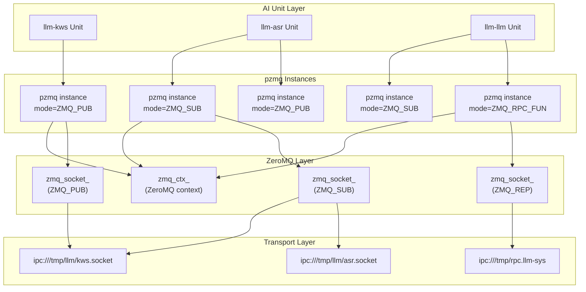
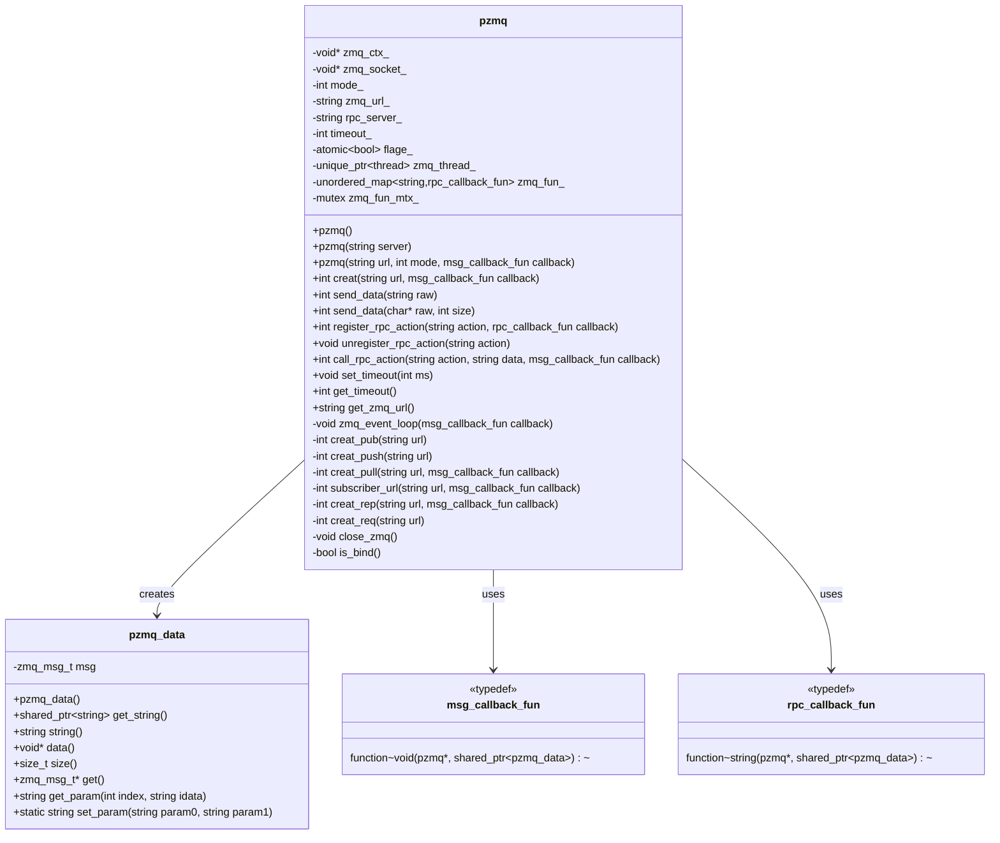
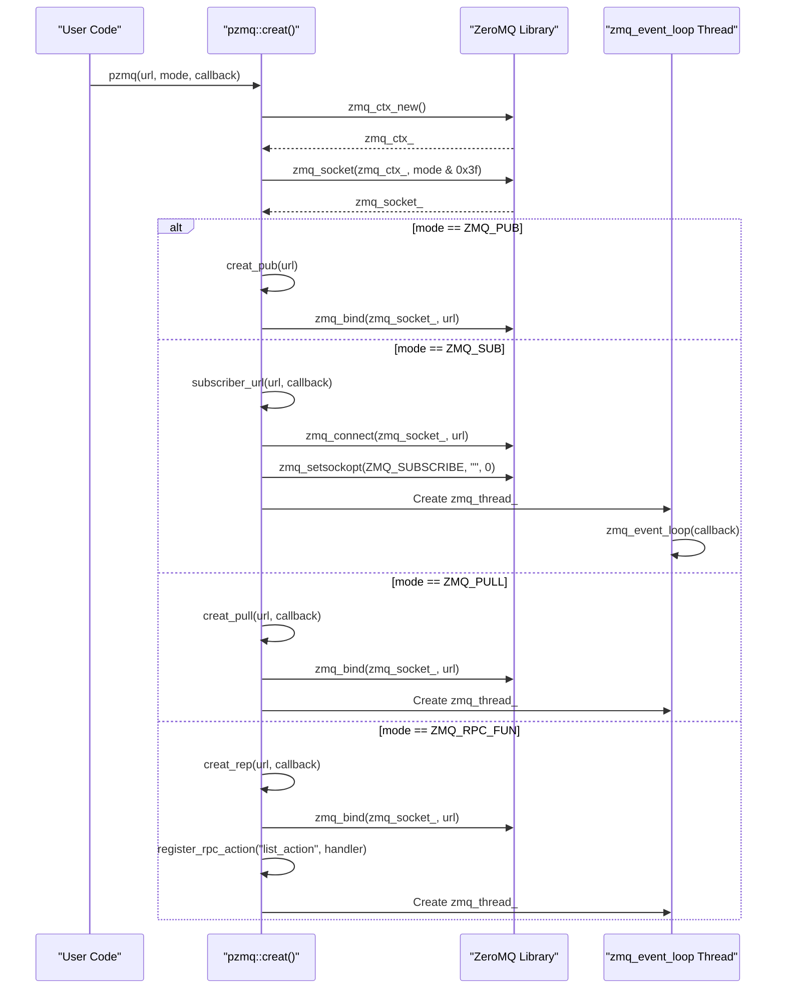
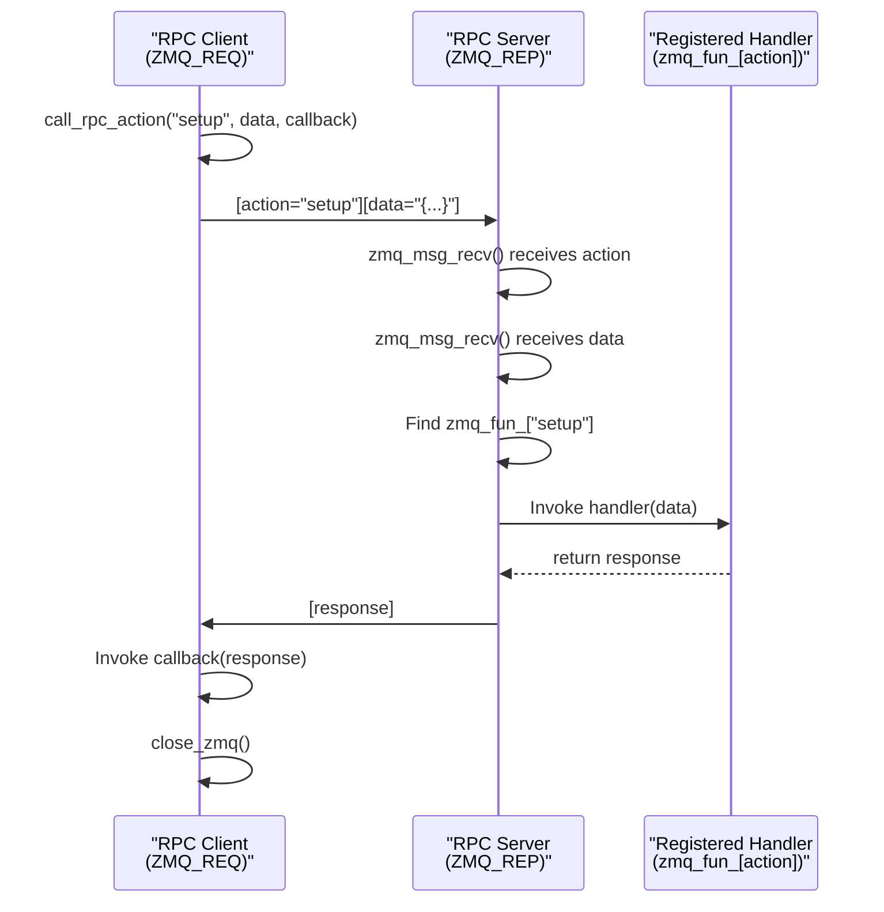
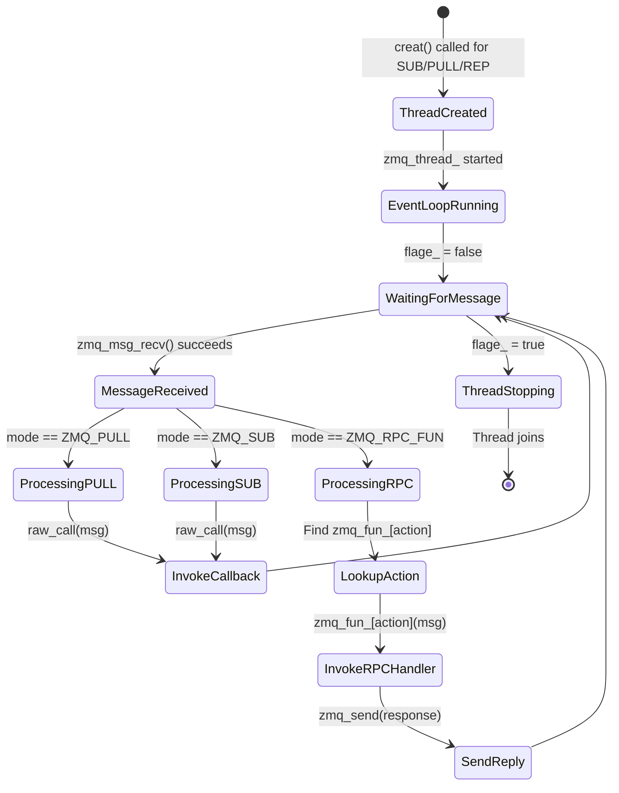
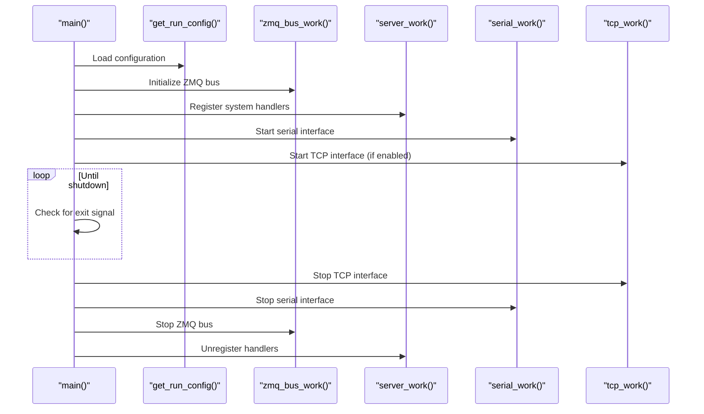

StackFlow StackFlow and pzmq Communication

# StackFlow and pzmq Communication

<details>
<summary>Relevant source files</summary>

The following files were used as context for generating this wiki page:

- [ext_components/StackFlow/stackflow/pzmq.hpp](ext_components/StackFlow/stackflow/pzmq.hpp)
- [ext_components/ax_msp/Kconfig](ext_components/ax_msp/Kconfig)
- [projects/llm_framework/SConstruct](projects/llm_framework/SConstruct)
- [projects/llm_framework/config_defaults.mk](projects/llm_framework/config_defaults.mk)

</details>


The StackFlow framework's communication layer is built on [ZeroMQ](https://zeromq.org/), a high-performance asynchronous messaging library. The `pzmq` class provides a C++ wrapper around ZeroMQ's C API, simplifying socket management and providing callback-based message handling. All StackFlow units use `pzmq` instances for inter-unit communication and RPC calls.

## Overview

The `pzmq` wrapper layer provides:

1. **Socket Lifecycle Management** - Automated creation, configuration, and cleanup of ZeroMQ sockets
2. **Callback-Based Messaging** - Asynchronous message reception via user-defined callbacks
3. **Threading Abstraction** - Internal event loop thread for non-blocking message processing
4. **RPC Encapsulation** - Built-in RPC server/client functionality on REQ/REP sockets
5. **Transport Flexibility** - Support for IPC and TCP transports with automatic reconnection

The `pzmq` class supports all six ZeroMQ socket types used in StackFlow:

| Socket Type | ZeroMQ Constant | pzmq Mode | Direction | Blocking |
|-------------|-----------------|-----------|-----------|----------|
| Publisher | `ZMQ_PUB` | `ZMQ_PUB` | Send only | Non-blocking |
| Subscriber | `ZMQ_SUB` | `ZMQ_SUB` | Receive only | Non-blocking (async callback) |
| Push | `ZMQ_PUSH` | `ZMQ_PUSH` | Send only | Blocking with timeout |
| Pull | `ZMQ_PULL` | `ZMQ_PULL` | Receive only | Non-blocking (async callback) |
| RPC Server | `ZMQ_REP` | `ZMQ_RPC_FUN` | Bidirectional | Non-blocking (async callback) |
| RPC Client | `ZMQ_REQ` | `ZMQ_RPC_CALL` | Bidirectional | Blocking with timeout |

### pzmq Communication Architecture



Sources: [ext_components/StackFlow/stackflow/pzmq.hpp:1-507]()

## pzmq Class Structure

The `pzmq` class is defined in the `StackFlows` namespace and provides complete encapsulation of ZeroMQ socket operations. Each `pzmq` instance manages a single ZeroMQ socket with its associated context and event loop thread.

### Class Members and Architecture



### Key Member Variables

| Member | Type | Purpose |
|--------|------|---------|
| `zmq_ctx_` | `void*` | ZeroMQ context handle (one per socket) |
| `zmq_socket_` | `void*` | ZeroMQ socket handle |
| `mode_` | `int` | Socket mode (ZMQ_PUB, ZMQ_SUB, etc.) |
| `zmq_url_` | `std::string` | Socket URL (IPC or TCP) |
| `timeout_` | `int` | Send/receive timeout in milliseconds (default: 3000ms) |
| `flage_` | `std::atomic<bool>` | Event loop control flag (true = stop) |
| `zmq_thread_` | `std::unique_ptr<std::thread>` | Event loop thread for async sockets |
| `zmq_fun_` | `std::unordered_map` | Registered RPC action handlers |
| `zmq_fun_mtx_` | `std::mutex` | Protects `zmq_fun_` map |

Sources: [ext_components/StackFlow/stackflow/pzmq.hpp:86-112](), [ext_components/StackFlow/stackflow/pzmq.hpp:22-84]()

### Constructor Variants

The `pzmq` class provides three constructors for different use cases:

```cpp
// Constructor 1: Default constructor (for later initialization)
pzmq();

// Constructor 2: RPC mode constructor (for unit_call operations)
pzmq(const std::string &server);

// Constructor 3: Full constructor (creates socket immediately)
pzmq(const std::string &url, int mode, const msg_callback_fun &raw_call = nullptr);
```

**Constructor 1** [ext_components/StackFlow/stackflow/pzmq.hpp:114-116](): Creates an uninitialized pzmq instance. Used when socket creation is deferred.

**Constructor 2** [ext_components/StackFlow/stackflow/pzmq.hpp:117-123](): Initializes for RPC client mode. The `server` parameter specifies the target unit name (e.g., "llm-sys"). The actual socket is created lazily on first `call_rpc_action()`.

**Constructor 3** [ext_components/StackFlow/stackflow/pzmq.hpp:124-131](): Immediately creates the ZeroMQ socket. The `url` parameter specifies the socket address (IPC or TCP), `mode` is the socket type, and `raw_call` is the callback for received messages (required for SUB, PULL, REP modes).

Sources: [ext_components/StackFlow/stackflow/pzmq.hpp:114-131]()

### Message Callback Types

The `pzmq` class uses two callback function types:

```cpp
// Callback for receiving messages (SUB, PULL patterns)
typedef std::function<void(pzmq *, const std::shared_ptr<pzmq_data> &)> msg_callback_fun;

// Callback for handling RPC requests (returns response string)
typedef std::function<std::string(pzmq *, const std::shared_ptr<pzmq_data> &)> rpc_callback_fun;
```

**`msg_callback_fun`** [ext_components/StackFlow/stackflow/pzmq.hpp:89](): Used for data streaming patterns (SUB, PULL). The callback receives the pzmq instance and message data but does not return a value.

**`rpc_callback_fun`** [ext_components/StackFlow/stackflow/pzmq.hpp:88](): Used for RPC server patterns (REP). The callback must return a string that will be sent as the reply.

Sources: [ext_components/StackFlow/stackflow/pzmq.hpp:88-89]()

## Socket Types and Creation

The `pzmq` class supports six socket types corresponding to three ZeroMQ communication patterns. Socket creation and configuration is handled by the `creat()` method and its specialized variants.

### Socket Creation Flow



Sources: [ext_components/StackFlow/stackflow/pzmq.hpp:225-269]()

### PUB/SUB Pattern - Data Broadcasting

The PUB/SUB pattern enables one-to-many data streaming where publishers send messages to all connected subscribers.

**Publisher Socket (ZMQ_PUB)** [ext_components/StackFlow/stackflow/pzmq.hpp:236-238]():
- Created with `creat_pub(url)` which calls `zmq_bind()`
- Bind-side socket (listens on URL)
- Non-blocking sends via `send_data()`
- No message queuing - if no subscribers connected, messages are dropped

**Subscriber Socket (ZMQ_SUB)** [ext_components/StackFlow/stackflow/pzmq.hpp:239-247]():
- Created with `subscriber_url(url, callback)` which calls `zmq_connect()`
- Connect-side socket (connects to publisher)
- Automatic reconnection on disconnect (100ms interval, max 1000ms)
- Subscribes to all messages via `zmq_setsockopt(ZMQ_SUBSCRIBE, "", 0)`
- Receives messages asynchronously via callback in dedicated thread

#### PUB/SUB Usage Example

```
// Publisher unit
pzmq pub_socket("ipc:///tmp/llm/unit_output.socket", ZMQ_PUB);
pub_socket.send_data("message payload");

// Subscriber unit
auto callback = [](pzmq* socket, const std::shared_ptr<pzmq_data>& msg) {
    std::string data = msg->string();
    // Process received data
};
pzmq sub_socket("ipc:///tmp/llm/unit_output.socket", ZMQ_SUB, callback);
```

Sources: [ext_components/StackFlow/stackflow/pzmq.hpp:236-247](), [ext_components/StackFlow/stackflow/pzmq.hpp:304-307](), [ext_components/StackFlow/stackflow/pzmq.hpp:320-327]()

### PUSH/PULL Pattern - Work Distribution

The PUSH/PULL pattern implements load balancing where work items are distributed among multiple workers.

**Push Socket (ZMQ_PUSH)** [ext_components/StackFlow/stackflow/pzmq.hpp:248-255]():
- Created with `creat_push(url)` which calls `zmq_connect()`
- Connect-side socket (connects to PULL socket)
- Blocking sends with timeout (default 3000ms)
- Automatic reconnection on disconnect
- Round-robin distribution if multiple PULL sockets connected

**Pull Socket (ZMQ_PULL)** [ext_components/StackFlow/stackflow/pzmq.hpp:256-258]():
- Created with `creat_pull(url, callback)` which calls `zmq_bind()`
- Bind-side socket (listens on URL)
- Fair-queued reception from multiple PUSH sockets
- Receives messages via callback in dedicated thread
- Uses `zmq_poll()` for efficient waiting

#### PUSH/PULL Usage Example

```
// Task producer
pzmq push_socket("ipc:///tmp/llm/work_queue.socket", ZMQ_PUSH);
push_socket.send_data("task data");

// Task consumer
auto callback = [](pzmq* socket, const std::shared_ptr<pzmq_data>& msg) {
    std::string task = msg->string();
    // Process task
};
pzmq pull_socket("ipc:///tmp/llm/work_queue.socket", ZMQ_PULL, callback);
```

Sources: [ext_components/StackFlow/stackflow/pzmq.hpp:248-258](), [ext_components/StackFlow/stackflow/pzmq.hpp:308-312](), [ext_components/StackFlow/stackflow/pzmq.hpp:313-319]()

### REQ/REP Pattern - RPC Communication

The REQ/REP pattern provides synchronous request-response for RPC calls. In pzmq, this is enhanced with action-based routing.

**RPC Server Socket (ZMQ_RPC_FUN)** [ext_components/StackFlow/stackflow/pzmq.hpp:259-261]():
- Custom constant: `ZMQ_RPC_FUN = (ZMQ_REP | 0x80)` [ext_components/StackFlow/stackflow/pzmq.hpp:17]()
- Created with `creat_rep(url, callback)` which calls `zmq_bind()`
- Maintains map of registered actions (`zmq_fun_`)
- Automatically registers "list_action" handler
- Multi-part messages: [action_name][request_data] → [response_data]

**RPC Client Socket (ZMQ_RPC_CALL)** [ext_components/StackFlow/stackflow/pzmq.hpp:262-264]():
- Custom constant: `ZMQ_RPC_CALL = (ZMQ_REQ | 0x80)` [ext_components/StackFlow/stackflow/pzmq.hpp:18]()
- Created with `creat_req(url)` which calls `zmq_connect()`
- Checks socket file existence before connecting (for IPC)
- Blocking send/receive with timeout (default 3000ms)
- Socket closed after each RPC call

#### RPC Server-Client Interaction



Sources: [ext_components/StackFlow/stackflow/pzmq.hpp:17-18](), [ext_components/StackFlow/stackflow/pzmq.hpp:259-264](), [ext_components/StackFlow/stackflow/pzmq.hpp:328-335](), [ext_components/StackFlow/stackflow/pzmq.hpp:336-347]()

### Socket Type Configuration Summary

| Socket Type | Mode Constant | Bind/Connect | Thread Created | Callback Type | Timeout |
|-------------|---------------|--------------|----------------|---------------|---------|
| Publisher | `ZMQ_PUB` | Bind | No | None | None |
| Subscriber | `ZMQ_SUB` | Connect | Yes | `msg_callback_fun` | None |
| Push | `ZMQ_PUSH` | Connect | No | None | 3000ms (send) |
| Pull | `ZMQ_PULL` | Bind | Yes | `msg_callback_fun` | None |
| RPC Server | `ZMQ_RPC_FUN` | Bind | Yes | `rpc_callback_fun` | None |
| RPC Client | `ZMQ_RPC_CALL` | Connect | No | `msg_callback_fun` | 3000ms (send/recv) |

Sources: [ext_components/StackFlow/stackflow/pzmq.hpp:105-111](), [ext_components/StackFlow/stackflow/pzmq.hpp:225-269]()

## Event Loop and Message Reception

Sockets that receive messages (SUB, PULL, REP) use a dedicated thread running `zmq_event_loop()` for asynchronous message processing. This eliminates blocking and enables concurrent operation.

### Event Loop Thread Lifecycle



Sources: [ext_components/StackFlow/stackflow/pzmq.hpp:348-393]()

### zmq_event_loop Implementation

The `zmq_event_loop()` method [ext_components/StackFlow/stackflow/pzmq.hpp:348-393]() runs in a separate thread and handles all message reception:

```cpp
void zmq_event_loop(const msg_callback_fun &raw_call)
{
    // For PULL sockets, use zmq_poll for efficient waiting
    if (mode_ == ZMQ_PULL) {
        zmq_pollitem_t items[1];
        items[0].socket = zmq_socket_;
        items[0].events = ZMQ_POLLIN;
    }
    
    while (!flage_.load()) {
        // Receive message
        zmq_msg_recv(msg_ptr->get(), zmq_socket_, 0);
        
        if (mode_ == ZMQ_RPC_FUN) {
            // RPC mode: receive action name, then data
            // Look up handler in zmq_fun_ map
            // Invoke handler and send reply
        } else {
            // Data streaming mode: invoke callback
            raw_call(this, msg_ptr);
        }
    }
}
```

**Key Behaviors**:

1. **PULL Mode Polling** [ext_components/StackFlow/stackflow/pzmq.hpp:352-357](): Uses `zmq_poll()` to efficiently wait for messages without busy-looping
2. **RPC Action Dispatch** [ext_components/StackFlow/stackflow/pzmq.hpp:376-386](): For ZMQ_RPC_FUN, receives two-part message (action + data), looks up handler in `zmq_fun_` map, invokes handler, sends reply
3. **Data Streaming** [ext_components/StackFlow/stackflow/pzmq.hpp:388-390](): For SUB/PULL, directly invokes callback with message
4. **Thread Control** [ext_components/StackFlow/stackflow/pzmq.hpp:358](): Loop continues until `flage_` is set to true (in destructor)

Sources: [ext_components/StackFlow/stackflow/pzmq.hpp:348-393]()

### Thread Safety and Synchronization

The `pzmq` class provides thread-safe access to the RPC action map:

| Member | Type | Purpose |
|--------|------|---------|
| `zmq_fun_` | `std::unordered_map<std::string, rpc_callback_fun>` | Maps action names to handlers |
| `zmq_fun_mtx_` | `std::mutex` | Protects `zmq_fun_` during registration/dispatch |
| `flage_` | `std::atomic<bool>` | Thread-safe event loop control |

**Registration** [ext_components/StackFlow/stackflow/pzmq.hpp:171-186](): `register_rpc_action()` acquires `zmq_fun_mtx_` before modifying the map

**Dispatch** [ext_components/StackFlow/stackflow/pzmq.hpp:381-382](): Event loop acquires `zmq_fun_mtx_` before looking up action handler

**Shutdown** [ext_components/StackFlow/stackflow/pzmq.hpp:411-422](): Destructor sets `flage_=true`, calls `zmq_ctx_shutdown()`, joins thread

Sources: [ext_components/StackFlow/stackflow/pzmq.hpp:96-98](), [ext_components/StackFlow/stackflow/pzmq.hpp:171-193](), [ext_components/StackFlow/stackflow/pzmq.hpp:411-422]()

## RPC Action Registration and Dispatch

The `pzmq` class provides a complete RPC framework built on the REQ/REP pattern. RPC servers register action handlers, and clients invoke them by action name.

### RPC Server Implementation

```mermq
sequenceDiagram
    participant Unit as "Unit Initialization"
    participant Pzmq as "pzmq Instance"
    participant Map as "zmq_fun_ Map"
    participant Thread as "Event Loop Thread"
    
    Unit->>Pzmq: register_rpc_action("setup", handler)
    Pzmq->>Pzmq: Check if first registration
    alt First registration
        Pzmq->>Pzmq: creat("ipc:///tmp/rpc.{name}", ZMQ_RPC_FUN)
        Pzmq->>Thread: Start zmq_thread_
    end
    Pzmq->>Map: zmq_fun_["setup"] = handler
    
    Unit->>Pzmq: register_rpc_action("pause", handler)
    Pzmq->>Map: zmq_fun_["pause"] = handler
    
    Unit->>Pzmq: register_rpc_action("exit", handler)
    Pzmq->>Map: zmq_fun_["exit"] = handler
    
    Note over Pzmq,Thread: Server ready for RPC calls
```

The `register_rpc_action()` method [ext_components/StackFlow/stackflow/pzmq.hpp:171-186]() adds action handlers to the RPC server:

```cpp
int register_rpc_action(const std::string &action, const rpc_callback_fun &raw_call)
{
    std::unique_lock<std::mutex> lock(zmq_fun_mtx_);
    
    // If first registration, create REP socket
    if (zmq_fun_.empty()) {
        std::string url = rpc_url_head_ + rpc_server_;  // e.g., "ipc:///tmp/rpc.llm-sys"
        mode_ = ZMQ_RPC_FUN;
        creat(url);
    }
    
    // Add or update action handler
    zmq_fun_[action] = raw_call;
    return 0;
}
```

**Key Features**:
- Lazy socket creation: REP socket created on first action registration
- URL format: `ipc:///tmp/rpc.{unit_name}` (default) or custom URL if specified in constructor
- Automatic "list_action" handler: Returns JSON list of registered actions [ext_components/StackFlow/stackflow/pzmq.hpp:153-170]()
- Thread-safe: Uses mutex to protect action map

Sources: [ext_components/StackFlow/stackflow/pzmq.hpp:171-186](), [ext_components/StackFlow/stackflow/pzmq.hpp:153-170]()

### RPC Client Implementation

The `call_rpc_action()` method [ext_components/StackFlow/stackflow/pzmq.hpp:194-224]() invokes remote procedures:

```cpp
int call_rpc_action(const std::string &action, const std::string &data, 
                    const msg_callback_fun &raw_call)
{
    // Create REQ socket if not exists
    if (NULL == zmq_socket_) {
        std::string url = rpc_url_head_ + rpc_server_;  // e.g., "ipc:///tmp/rpc.llm-asr"
        mode_ = ZMQ_RPC_CALL;
        creat(url);
    }
    
    // Send two-part message: [action][data]
    zmq_send(zmq_socket_, action.c_str(), action.length(), ZMQ_SNDMORE);
    zmq_send(zmq_socket_, data.c_str(), data.length(), 0);
    
    // Receive response
    std::shared_ptr<pzmq_data> msg_ptr = std::make_shared<pzmq_data>();
    zmq_msg_recv(msg_ptr->get(), zmq_socket_, 0);
    
    // Invoke callback with response
    raw_call(this, msg_ptr);
    
    // Close socket
    close_zmq();
    return 0;
}
```

**Key Features**:
- Lazy socket creation: REQ socket created on first RPC call
- Blocking operation: Waits for reply with timeout (default 3000ms)
- Two-part send: Action name as first frame, data as second frame
- Socket cleanup: Closes socket after each call (REQ/REP state machine requirement)

Sources: [ext_components/StackFlow/stackflow/pzmq.hpp:194-224]()

### RPC Message Format

RPC communication uses a two-frame message format:

| Frame | Content | Purpose |
|-------|---------|---------|
| Frame 1 | Action name (string) | Identifies which handler to invoke |
| Frame 2 | Request data (string) | Parameters for the action |

**Response Format**: Single frame containing the return value from the handler (string).

**Example RPC Exchange**:
```
Client sends:
  Frame 1: "setup"
  Frame 2: '{"model": "qwen", "work_id": "llm.0"}'

Server responds:
  Frame 1: '{"status": "ok", "message": "Unit configured"}'
```

### Built-in RPC Actions

Every RPC server automatically registers the "list_action" handler [ext_components/StackFlow/stackflow/pzmq.hpp:153-170](), which returns a JSON array of available actions:

```cpp
std::string _rpc_list_action(pzmq *self, const std::shared_ptr<pzmq_data> &_None)
{
    std::string action_list = "{\"actions\":[";
    for (auto i = zmq_fun_.begin(); ; ) {
        action_list += "\"" + i->first + "\"";
        if (++i == zmq_fun_.end()) {
            action_list += "]}";
            break;
        } else {
            action_list += ",";
        }
    }
    return action_list;
}
```

**Example Response**:
```json
{"actions":["setup","pause","work","exit","link","unlink","taskinfo","list_action"]}
```

Sources: [ext_components/StackFlow/stackflow/pzmq.hpp:153-170](), [ext_components/StackFlow/stackflow/pzmq.hpp:331]()

## Message Data Handling

The `pzmq_data` class [ext_components/StackFlow/stackflow/pzmq.hpp:22-84]() wraps ZeroMQ's `zmq_msg_t` structure and provides convenient methods for accessing message content.

### pzmq_data Class Methods

| Method | Return Type | Purpose |
|--------|-------------|---------|
| `get_string()` | `std::shared_ptr<std::string>` | Returns message as shared pointer to string |
| `string()` | `std::string` | Returns message as string (copies data) |
| `data()` | `void*` | Returns raw pointer to message data |
| `size()` | `size_t` | Returns message size in bytes |
| `get()` | `zmq_msg_t*` | Returns pointer to underlying zmq_msg_t |
| `get_param(index, idata)` | `std::string` | Extracts parameter from multi-part message |
| `set_param(param0, param1)` | `static std::string` | Constructs multi-part message |

### Multi-Part Message Encoding

The `pzmq_data` class provides methods for encoding multiple parameters in a single message frame [ext_components/StackFlow/stackflow/pzmq.hpp:54-78]():

```cpp
// Encoding: Creates message with length-prefixed first parameter
static std::string set_param(std::string param0, std::string param1)
{
    std::string data = " " + param0 + param1;
    data[0] = param0.length();  // First byte = length of param0
    return data;
}

// Decoding: Extracts parameter by index
std::string get_param(int index, const std::string &idata = "")
{
    const char *data = (idata.empty()) ? zmq_msg_data(&msg) : idata.c_str();
    
    if ((index % 2) == 0) {
        // Even index: return first parameter
        return std::string(data + 1, data[0]);
    } else {
        // Odd index: return second parameter
        return std::string(data + data[0] + 1, size() - data[0] - 1);
    }
}
```

**Format**: `[length_byte][param0_bytes][param1_bytes]`
- Byte 0: Length of first parameter (1-255 bytes)
- Bytes 1 to N: First parameter data
- Bytes N+1 to end: Second parameter data

Sources: [ext_components/StackFlow/stackflow/pzmq.hpp:54-78]()

### Timeout Configuration

The `pzmq` class provides timeout configuration for blocking operations:

```cpp
void set_timeout(int ms);    // Set timeout in milliseconds
int get_timeout();           // Get current timeout
```

**Default Timeout**: 3000ms (3 seconds) [ext_components/StackFlow/stackflow/pzmq.hpp:114]()

**Applied To**:
- PUSH socket sends [ext_components/StackFlow/stackflow/pzmq.hpp:310]()
- REQ socket sends and receives [ext_components/StackFlow/stackflow/pzmq.hpp:344-345]()

**Timeout Behavior**:
- Send operations: Return -1 with `errno=EAGAIN` if timeout
- Receive operations: Return -1 with `errno=EAGAIN` if timeout

Sources: [ext_components/StackFlow/stackflow/pzmq.hpp:132-139](), [ext_components/StackFlow/stackflow/pzmq.hpp:103]()

## Socket Addressing and Naming Conventions

StackFlow uses consistent naming conventions for ZeroMQ socket URLs to enable automatic discovery and connection.

### IPC Socket Naming

For inter-unit communication, IPC sockets follow these patterns:

| Socket Type | URL Pattern | Example | Purpose |
|-------------|-------------|---------|---------|
| Unit RPC | `ipc:///tmp/llm/{unit_name}_rpc.socket` | `ipc:///tmp/llm/llm-asr_rpc.socket` | RPC endpoint for unit |
| Unit PUB | `ipc:///tmp/llm/{unit_name}_{work_id}.socket` | `ipc:///tmp/llm/llm-asr_asr.0.socket` | Output channel for work_id |
| System RPC | `ipc:///tmp/llm/sys_rpc.socket` | - | System orchestrator RPC |

### TCP Socket Configuration

External clients connect via TCP to the system orchestrator:

- **Default Port**: 10001
- **Default Interface**: `0.0.0.0` (all interfaces)
- **URL Format**: `tcp://*:10001`

### Address Resolution

When a unit calls `subscriber_work_id("llm-asr.0", callback)`:

1. StackFlow extracts the unit name (`llm-asr`) and work ID (`0`)
2. Constructs the IPC URL: `ipc:///tmp/llm/llm-asr_asr.0.socket`
3. Creates a ZMQ_SUB socket connected to this URL
4. Registers the callback for incoming messages

Sources: [doc/component_doc/StackFlow_en.md:169-176](), [doc/component_doc/StackFlow_zh.md:169-176]()

## Initialization and Shutdown

The Event Loop System is initialized and configured in `main.cpp`:

1. Loads configuration settings
2. Initializes the ZMQ bus
3. Registers system handlers
4. Starts communication interfaces
5. Handles graceful shutdown on exit



Sources: [projects/llm_framework/main_sys/src/main.cpp:164-186](), [projects/llm_framework/main_sys/src/main.cpp:134-158]()

## Summary

The Event Loop System is a central component of the StackFlow framework, providing:

1. A standardized messaging infrastructure based on ZeroMQ
2. Multiple communication interfaces (serial, TCP)
3. Message routing and dispatching
4. System control and management functions
5. Integration points for AI component units

This system enables the modular architecture of StackFlow, allowing components to communicate seamlessly regardless of their implementation details or deployment configuration.