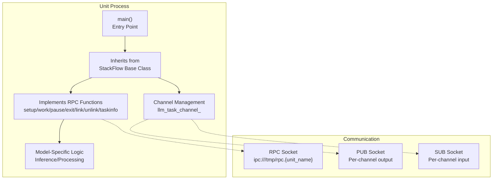
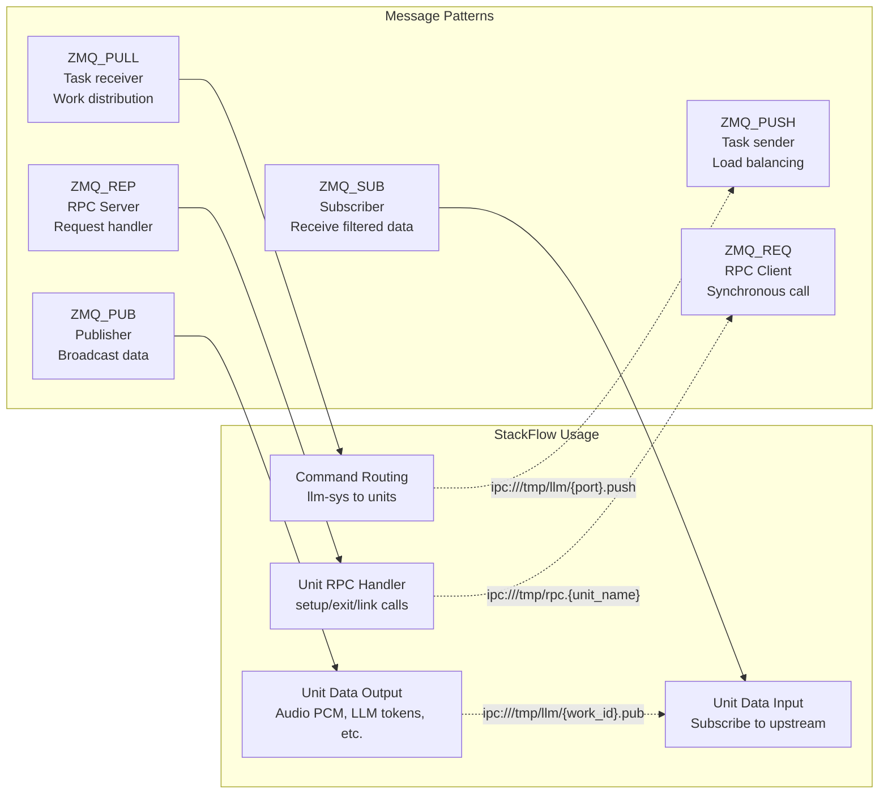
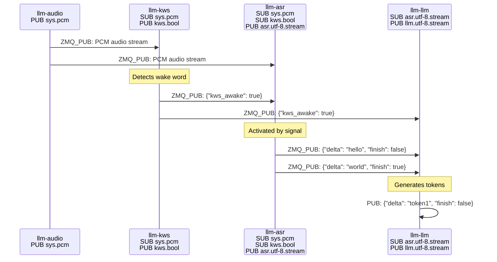
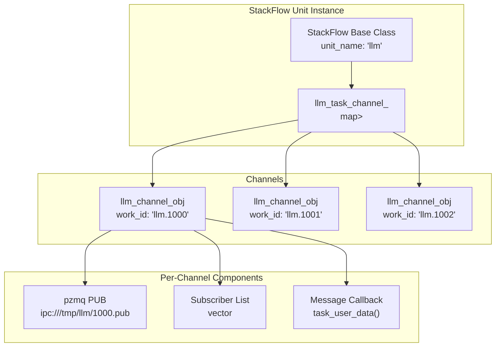
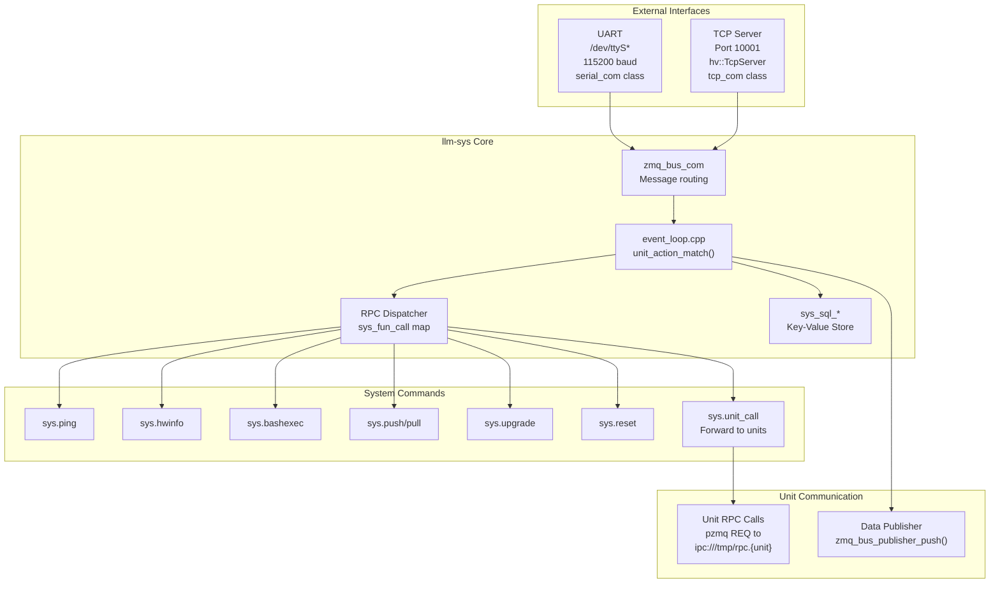
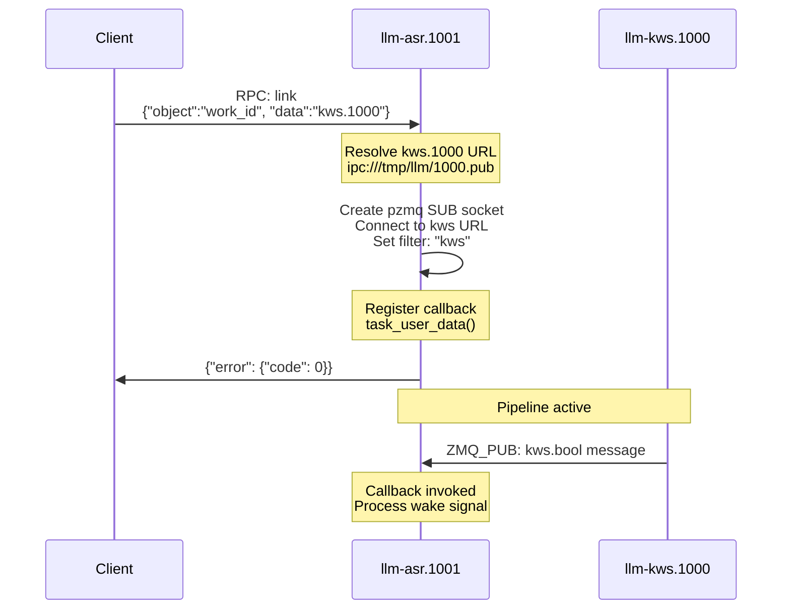

StackFlow System Architecture

# System Architecture

<details>
<summary>Relevant source files</summary>

The following files were used as context for generating this wiki page:

- [README.md](README.md)
- [README_zh.md](README_zh.md)
- [doc/component_doc/StackFlow_en.md](doc/component_doc/StackFlow_en.md)
- [doc/component_doc/StackFlow_zh.md](doc/component_doc/StackFlow_zh.md)
- [ext_components/StackFlow/stackflow/pzmq.hpp](ext_components/StackFlow/stackflow/pzmq.hpp)
- [ext_components/ax_msp/Kconfig](ext_components/ax_msp/Kconfig)
- [projects/llm_framework/README.md](projects/llm_framework/README.md)
- [projects/llm_framework/SConstruct](projects/llm_framework/SConstruct)
- [projects/llm_framework/config_defaults.mk](projects/llm_framework/config_defaults.mk)
- [projects/llm_framework/main_sys/include/zmq_bus.h](projects/llm_framework/main_sys/include/zmq_bus.h)
- [projects/llm_framework/main_sys/src/event_loop.cpp](projects/llm_framework/main_sys/src/event_loop.cpp)
- [projects/llm_framework/main_sys/src/serial_com.cpp](projects/llm_framework/main_sys/src/serial_com.cpp)
- [projects/llm_framework/main_sys/src/tcp_com.cpp](projects/llm_framework/main_sys/src/tcp_com.cpp)
- [projects/llm_framework/main_sys/src/zmq_bus.cpp](projects/llm_framework/main_sys/src/zmq_bus.cpp)

</details>


## Purpose and Scope

This document describes the overall architecture of the StackFlow LLM Framework, focusing on the core design patterns that enable distributed AI inference on embedded systems. It covers:

- The unit-based modular design and how AI services are organized as independent units
- The communication infrastructure built on ZeroMQ (ZMQ) for inter-unit messaging
- The StackFlow base class that all units inherit from
- The role of `llm-sys` as the central system controller
- Message routing mechanisms and channel management

For details on specific AI unit implementations (audio, LLM, vision, etc.), see their respective pages in sections 3-5. For information on the build system and deployment, see sections 6-7. For the JSON RPC protocol and API reference, see section 9.

---

## Unit-Based Architecture

StackFlow employs a **unit-based modular design** where each AI capability is implemented as an independent service unit. Units operate as separate processes that communicate via ZeroMQ message passing. This architecture enables:

- **Independent operation**: Each unit can be started, stopped, or restarted without affecting others
- **Modular deployment**: Install only the units needed for specific applications
- **Resource isolation**: Units run in separate processes with dedicated memory spaces
- **Flexible composition**: Units can be dynamically linked to create processing pipelines

### Core Unit Types

The framework includes several categories of units:

| Category | Units | Purpose |
|----------|-------|---------|
| **System** | `llm-sys` | Central coordinator, command routing, system-level operations |
| **Audio** | `llm-audio`, `llm-vad`, `llm-kws`, `llm-asr`, `llm-whisper` | Audio capture, voice detection, wake word, speech recognition |
| **Language** | `llm-llm`, `llm-vlm` | Text generation, vision-language multimodal inference |
| **Speech Synthesis** | `llm-tts`, `llm-melotts`, `llm-cosy-voice` | Text-to-speech with CPU/NPU acceleration |
| **Computer Vision** | `llm-camera`, `llm-yolo`, `llm-depth-anything` | Video capture, object detection, depth estimation |

### Unit Structure and Lifecycle

Each unit follows a standardized structure:



**Sources:** [ext_components/StackFlow/]()/*, [doc/component_doc/StackFlow_en.md:148-157]()

### Unit Registration and Discovery

Units register themselves with `llm-sys` using the key-value store. When a unit process starts:

1. It creates an RPC server at `ipc:///tmp/rpc.{unit_name}` via `pzmq` constructor
2. Registers its RPC functions (setup, exit, link, etc.) using `register_rpc_action()`
3. Stores metadata in the system database for discovery

The `llm-sys` unit maintains a registry of active units and routes commands to them.

**Sources:** [ext_components/StackFlow/stackflow/pzmq.hpp:171-186](), [projects/llm_framework/main_sys/src/event_loop.cpp:770-843]()

---

## Communication Infrastructure

### The pzmq Wrapper Layer

The `pzmq` class [ext_components/StackFlow/stackflow/pzmq.hpp:86-506]() provides a C++ wrapper around libzmq, simplifying ZeroMQ socket management. It handles:

- **Socket lifecycle**: Automatic context and socket creation/cleanup
- **Reconnection logic**: Configurable retry intervals for resilient connections
- **Thread-safe callbacks**: Asynchronous message reception via callback functions
- **RPC abstraction**: Request/reply pattern implementation on top of ZMQ_REP/ZMQ_REQ

### ZeroMQ Socket Types and Usage



**Transport protocols:**
- **IPC (Inter-Process Communication)**: `ipc:///tmp/llm/*` for local units (default)
- **TCP**: `tcp://*:port` for networked deployments

**Socket configuration in pzmq:**

| Socket Type | Bind/Connect | Timeout | Reconnection |
|-------------|--------------|---------|--------------|
| `ZMQ_PUB` | Bind | N/A | N/A |
| `ZMQ_SUB` | Connect | N/A | 100ms initial, 1000ms max |
| `ZMQ_PUSH` | Connect | 3000ms | 100ms initial, 1000ms max |
| `ZMQ_PULL` | Bind | N/A | N/A |
| `ZMQ_REP` | Bind | N/A | N/A |
| `ZMQ_REQ` | Connect | 3000ms | N/A |

**Sources:** [ext_components/StackFlow/stackflow/pzmq.hpp:105-111](), [ext_components/StackFlow/stackflow/pzmq.hpp:225-347]()

### Message Flow Example: Voice Pipeline



**Sources:** [projects/llm_framework/README.md:28-169](), [doc/component_doc/StackFlow_zh.md:1-50]()

---

## StackFlow Base Class

### Overview and Responsibilities

The `StackFlow` base class (defined in `ext_components/StackFlow/`) provides the foundational functionality that all AI units inherit. It abstracts:

- **RPC server creation**: Automatic setup of `ZMQ_REP` socket at `ipc:///tmp/rpc.{unit_name}`
- **Standard RPC handlers**: Default implementations of the seven core RPC functions
- **Channel management**: Creation and lifecycle of `llm_channel_obj` instances
- **Event dispatching**: Integration with `eventpp` for asynchronous operations
- **Utility functions**: Helper methods for common operations

### Seven Core RPC Functions

Each unit must implement or override these standardized functions:

| Function | Purpose | Required Override |
|----------|---------|-------------------|
| `setup()` | Initialize unit with configuration, load models, create channels | **Yes** |
| `work()` | Resume processing (unpause unit) | Optional |
| `pause()` | Suspend processing without destroying state | Optional |
| `exit()` | Clean up resources and terminate unit | **Yes** |
| `link()` | Subscribe to upstream unit's output (build pipeline) | Optional |
| `unlink()` | Unsubscribe from upstream unit | Optional |
| `taskinfo()` | Return unit status and configuration | Optional |

**Function signatures** (pseudocode):
```cpp
// From StackFlow base class interface
virtual int setup(const std::string &work_id, const std::string &object, const std::string &data);
virtual int work(const std::string &work_id, const std::string &object, const std::string &data);
virtual int pause(const std::string &work_id, const std::string &object, const std::string &data);
virtual int exit(const std::string &work_id, const std::string &object, const std::string &data);
virtual int link(const std::string &work_id, const std::string &object, const std::string &data);
virtual int unlink(const std::string &work_id, const std::string &object, const std::string &data);
virtual void taskinfo(const std::string &work_id, const std::string &object, const std::string &data);
```

**Sources:** [doc/component_doc/StackFlow_en.md:148-157](), [doc/component_doc/StackFlow_zh.md:148-157]()

### Channel Management Architecture

The `StackFlow` class maintains a collection of `llm_channel_obj` instances, one per configured work instance:



**Key methods:**
- `get_channel(work_id)`: Retrieve or create channel for work_id
- `llm_channel_obj::subscriber_work_id()`: Subscribe to upstream unit
- `llm_channel_obj::send()`: Publish data to subscribers

**Sources:** [doc/component_doc/StackFlow_zh.md:169-175](), [doc/component_doc/StackFlow_en.md:169-175]()

---

## System Controller (llm-sys)

### Central Coordinator Role

The `llm-sys` unit serves as the **central hub** for the StackFlow framework. It performs:

- **External interface management**: UART (115200 baud) and TCP (port 10001) command reception
- **Command dispatching**: Routes JSON commands to appropriate units via RPC
- **System-level operations**: File transfer, firmware upgrades, hardware info queries
- **Key-value database**: Simple persistent storage for unit configuration and state
- **Inter-unit communication**: Manages ZMQ bus for data flow between units

### Architecture Overview



**Sources:** [projects/llm_framework/main_sys/src/event_loop.cpp:1-844](), [projects/llm_framework/main_sys/src/serial_com.cpp:1-129](), [projects/llm_framework/main_sys/src/tcp_com.cpp:1-114]()

### Command Routing: unit_action_match()

The `unit_action_match()` function [projects/llm_framework/main_sys/src/event_loop.cpp:770-843]() is the **main dispatcher** for all incoming commands. It:

1. **Parses JSON**: Uses `simdjson` for fast parsing of `request_id`, `work_id`, `action` fields
2. **Routes by work_id prefix**:
   - `sys.*` → System commands (handled locally in `event_loop.cpp`)
   - `{unit}.*` → Forwarded to respective unit via RPC
   - `inference` action → Published to ZMQ data bus
3. **Error handling**: Returns standardized error codes via `usr_print_error()`

**Routing logic:**
```cpp
// Simplified from event_loop.cpp:815-843
if (action == "inference") {
    // Publish to unit's data bus
    zmq_bus_publisher_push(work_id, inference_raw_data);
} else if (work_id.starts_with("sys")) {
    // Handle system commands
    sys_fun_call call_fun = key_sql[unit_action];
    call_fun(com_id, nlohmann::json::parse(json_str));
} else {
    // Forward to unit via RPC
    remote_call(com_id, json_str);
}
```

**Sources:** [projects/llm_framework/main_sys/src/event_loop.cpp:770-843]()

### System Command Registry

System commands are registered in the `key_sql` map [projects/llm_framework/main_sys/src/event_loop.cpp:743-762]():

| Command | Function | Purpose |
|---------|----------|---------|
| `sys.ping` | `sys_ping()` | Health check |
| `sys.hwinfo` | `sys_hwinfo()` | CPU/memory/temperature stats |
| `sys.cmminfo` | `sys_cmminfo()` | NPU CMM memory info |
| `sys.lsmode` | `sys_lsmode()` | List available model configurations |
| `sys.bashexec` | `sys_bashexec()` | Execute shell commands |
| `sys.push` | `sys_push()` | Upload files (supports base64/stream) |
| `sys.pull` | `sys_pull()` | Download files |
| `sys.upgrade` | `sys_upgrade()` | Firmware update via dpkg |
| `sys.reset` | `sys_reset()` | Restart all llm services |
| `sys.reboot` | `sys_reboot()` | System reboot |
| `sys.unit_call` | `sys_unit_call()` | Proxy RPC to specific unit |

**Sources:** [projects/llm_framework/main_sys/src/event_loop.cpp:76-762]()

### ZMQ Bus Communication

The `zmq_bus_com` class [projects/llm_framework/main_sys/include/zmq_bus.h:43-77]() provides the communication backbone:

**Interface Adapters:**
- `serial_com`: Extends `zmq_bus_com` for UART I/O [projects/llm_framework/main_sys/src/serial_com.cpp:28-85]()
- `tcp_com`: Extends `zmq_bus_com` for TCP I/O [projects/llm_framework/main_sys/src/tcp_com.cpp:33-93]()

Both adapters:
1. Create a `ZMQ_PULL` socket at a unique port
2. Parse incoming data stream with `select_json_str()` to extract JSON messages
3. Forward complete JSON objects to `unit_action_match()`
4. Support raw binary data via `{"RAW": length}` prefix for large payloads

**Sources:** [projects/llm_framework/main_sys/src/zmq_bus.cpp:26-300](), [projects/llm_framework/main_sys/include/zmq_bus.h:43-77]()

---

## Message Routing and Channels

### Work ID System

Each configured unit instance is assigned a unique `work_id` with the format: `{unit_name}.{numeric_id}`

Examples:
- `kws.1000` - First KWS instance
- `llm.1002` - Third LLM instance
- `melotts.1003` - Fourth MeloTTS instance

**Work ID generation:**
- Numeric IDs are auto-assigned sequentially starting from 1000
- Returned to client in response to `setup` command
- Used for all subsequent operations (link, pause, exit, etc.)

**Utility functions:**
- `sample_get_work_id_num()`: Extract numeric ID from work_id string
- `sample_get_work_id_name()`: Extract unit name prefix
- `sample_get_work_id()`: Construct work_id from name and number

**Sources:** [doc/component_doc/StackFlow_zh.md:409-414](), [doc/component_doc/StackFlow_en.md:409-414]()

### Channel Object: llm_channel_obj

The `llm_channel_obj` class encapsulates all communication logic for a single work instance:

**Key components:**
- `work_id_`: Unique identifier (`{unit}.{id}`)
- `enoutput_`: Whether to broadcast output (PUB socket)
- `enstream_`: Whether to use streaming output format
- `pzmq` PUB socket: For publishing unit's output
- `vector<pzmq>` SUB sockets: For subscribing to upstream units

**Core methods:**

| Method | Purpose |
|--------|---------|
| `subscriber_work_id(filters, callback)` | Subscribe to upstream unit, filter by message type |
| `stop_subscriber_work_id(work_id)` | Unsubscribe from upstream |
| `subscriber(zmq_url, callback)` | Subscribe to raw ZMQ URL |
| `send(object, data, error)` | Publish message to subscribers |
| `set_output(enabled)` | Enable/disable PUB socket |
| `set_stream(enabled)` | Enable streaming format |

**Sources:** [doc/component_doc/StackFlow_zh.md:169-175](), [doc/component_doc/StackFlow_en.md:169-175]()

### Link/Unlink Operations

The `link` RPC function dynamically creates subscriber connections:



**Implementation pattern:**
```cpp
// Typical link() implementation
int link(const std::string &work_id, const std::string &object, const std::string &data) {
    auto llm_channel = get_channel(work_id);
    std::string upstream_work_id = data; // e.g., "kws.1000"
    
    llm_channel->subscriber_work_id(
        upstream_work_id,
        std::bind(&MyUnit::task_user_data, this, 
                  llm_task_obj, llm_channel,
                  std::placeholders::_1, std::placeholders::_2)
    );
    
    send("None", "None", LLM_NO_ERROR, work_id);
    return 0;
}
```

**Sources:** [projects/llm_framework/README.md:116-157](), [doc/component_doc/StackFlow_zh.md:152-157]()

### Message Filtering and Subscription

Subscribers can filter messages by **object type** prefix. The `llm_channel_obj` sets ZMQ subscription filters automatically:

**Filter examples:**
- Subscribe to all KWS messages: Filter = `"kws"`
- Subscribe to ASR streams: Filter = `"asr.utf-8.stream"`
- Subscribe to all from unit: Filter = `""`

When a unit publishes via `llm_channel_obj::send(object, data, error)`, the `object` string becomes the ZMQ topic prefix, enabling selective subscription.

**Sources:** [ext_components/StackFlow/stackflow/pzmq.hpp:320-327]()

---

## Build System Integration

### Component Registration

Units are registered in the SCons build system [projects/llm_framework/SConstruct:1-32]():

```python
# COMPONENTS list defines buildable units
COMPONENTS = [
    "main_sys",      # llm-sys
    "main_audio",    # llm-audio
    "main_kws",      # llm-kws
    "main_asr",      # llm-asr
    # ... etc
]
```

Each component directory contains:
- `SConstruct`: Build configuration, source files, dependencies
- `src/`: Implementation files
- `include/`: Header files
- `models/`: Model configuration JSON files

**Sources:** [projects/llm_framework/SConstruct:1-32]()

### Static Library Dependencies

The framework depends on pre-built static libraries downloaded from OSS [projects/llm_framework/SConstruct:15-31]():

- **Version**: `v0.1.3` (defined in `SConstruct`)
- **Download URL**: `https://m5stack.oss-cn-shenzhen.aliyuncs.com/resource/linux/llm/static_lib_{version}.tar.gz`
- **Contents**: ONNX Runtime, NCNN, Sherpa libraries, Axera SDK components

**Sources:** [projects/llm_framework/SConstruct:8-31]()

### Hardware Platform Selection

Hardware configuration via Kconfig [ext_components/ax_msp/Kconfig:1-52]():

| Platform | Config Symbol | Supported Units |
|----------|---------------|-----------------|
| ax620e | `AX_620E_MSP_ENABLED` | Legacy support |
| ax630c | `AX_630C_OPENWRT_SDK_ENABLED` | Full unit support (primary) |
| ax650n | `AX_650C_MSP_ENABLED` | Full unit support |

**Sources:** [ext_components/ax_msp/Kconfig:1-52](), [projects/llm_framework/config_defaults.mk:1-26]()

---

## Summary

The StackFlow system architecture achieves a **loosely coupled, highly modular design** through:

1. **Unit-based isolation**: Each AI capability as an independent process
2. **ZMQ message bus**: Flexible pub/sub and RPC communication patterns
3. **Standardized interfaces**: Seven core RPC functions for lifecycle management
4. **Dynamic pipeline construction**: Runtime linking of units via `link()` commands
5. **Central coordination**: `llm-sys` as command router and system controller

This architecture enables efficient deployment of multi-model AI inference pipelines on resource-constrained embedded devices, with the flexibility to compose different processing chains for varied applications.