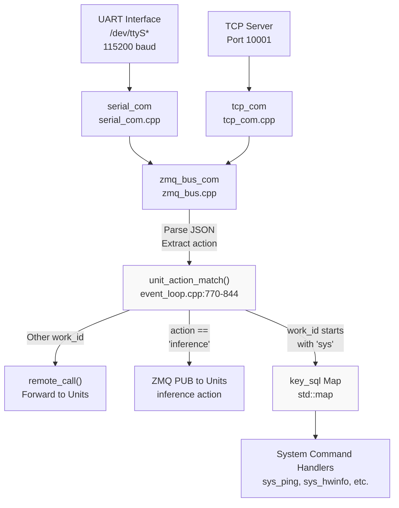
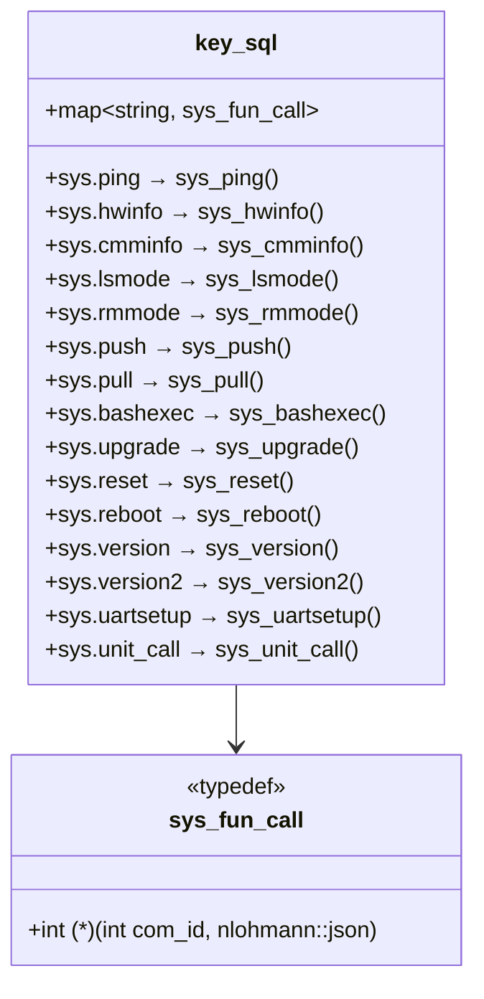
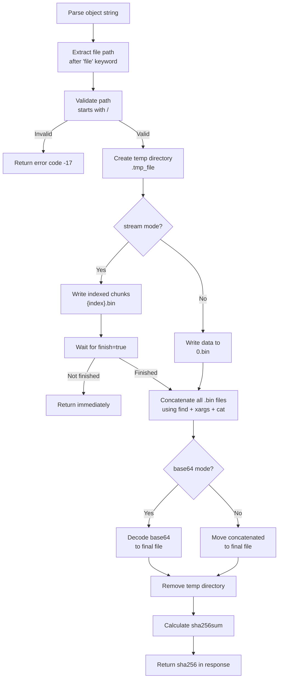
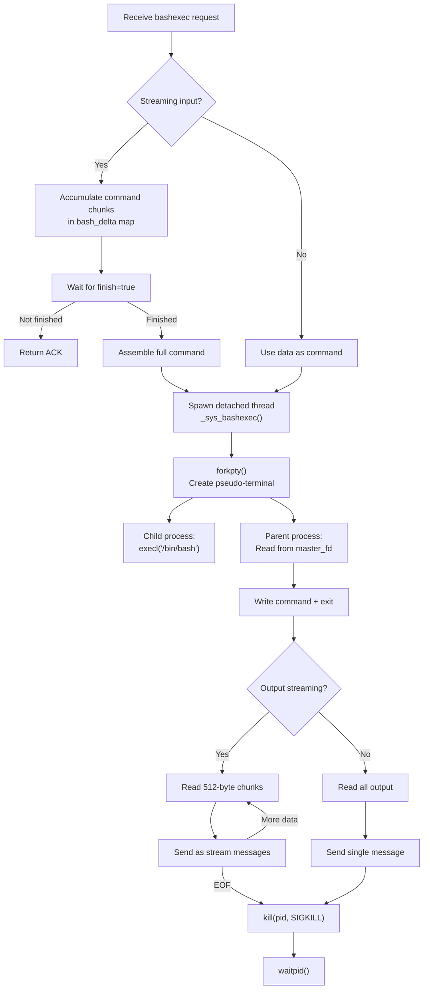
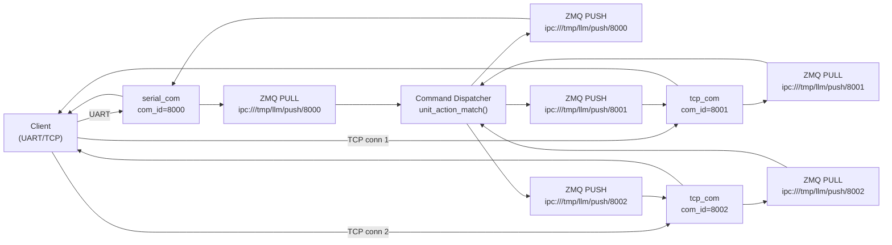

StackFlow System Commands (sys.*)

# System Commands (sys.*)

<details>
<summary>Relevant source files</summary>

The following files were used as context for generating this wiki page:

- [projects/llm_framework/main_sys/include/zmq_bus.h](projects/llm_framework/main_sys/include/zmq_bus.h)
- [projects/llm_framework/main_sys/src/event_loop.cpp](projects/llm_framework/main_sys/src/event_loop.cpp)
- [projects/llm_framework/main_sys/src/serial_com.cpp](projects/llm_framework/main_sys/src/serial_com.cpp)
- [projects/llm_framework/main_sys/src/tcp_com.cpp](projects/llm_framework/main_sys/src/tcp_com.cpp)
- [projects/llm_framework/main_sys/src/zmq_bus.cpp](projects/llm_framework/main_sys/src/zmq_bus.cpp)

</details>


This page documents the system-level commands exposed by the `llm-sys` service. These commands provide administrative, diagnostic, and file transfer capabilities for the StackFlow framework.

System commands are invoked by sending JSON RPC requests with `"work_id": "sys"` and a corresponding `"action"` field. Unlike unit-specific commands (see [Unit Management API](#9.2)), system commands control framework-wide operations including hardware monitoring, configuration management, file transfers, and service lifecycle.

For information about the JSON RPC protocol format, see [JSON RPC Protocol](#9.1). For commands that target specific AI units, see [Unit Management API](#9.2).

---

## Command Dispatch Architecture



**Sources:** [projects/llm_framework/main_sys/src/event_loop.cpp:770-844](), [projects/llm_framework/main_sys/src/serial_com.cpp:28-85](), [projects/llm_framework/main_sys/src/tcp_com.cpp:33-93]()

The dispatch mechanism follows this flow:

1. **Input Reception**: Commands arrive via UART (serial_com) or TCP (tcp_com) interfaces
2. **JSON Parsing**: `zmq_bus_com::select_json_str()` extracts complete JSON objects from the stream [zmq_bus.cpp:196-299]()
3. **Action Matching**: `unit_action_match()` examines the `work_id` and `action` fields [event_loop.cpp:770-844]()
4. **Command Routing**: 
   - If `work_id` starts with "sys", lookup handler in `key_sql` map [event_loop.cpp:830-838]()
   - If `action == "inference"`, publish to ZMQ bus for units [event_loop.cpp:815-829]()
   - Otherwise, forward to specific unit via `remote_call()` [event_loop.cpp:840-842]()

---

## Command Registration

System commands are registered in the `server_work()` function, which populates a dispatch table:



**Sources:** [projects/llm_framework/main_sys/src/event_loop.cpp:743-762]()

Each command handler follows the signature `int function_name(int com_id, const nlohmann::json &json_obj)`, where:
- `com_id`: Communication channel ID for response routing
- `json_obj`: Parsed JSON request containing `request_id`, `work_id`, `action`, and `data` fields
- Return value: Status code (typically 0 for success)

---

## Health and Diagnostic Commands

### sys.ping

Simple connectivity test that returns an empty success response.

**Request:**
```json
{
  "request_id": "req-001",
  "work_id": "sys",
  "action": "ping"
}
```

**Response:**
```json
{
  "request_id": "req-001",
  "work_id": "sys",
  "created": 1234567890,
  "error": {"code": 0, "message": ""},
  "object": "None",
  "data": "None"
}
```

**Implementation:** [event_loop.cpp:76-81]()

---

### sys.hwinfo

Returns comprehensive hardware status including CPU load, memory usage, temperature, and network interfaces.

**Request:**
```json
{
  "request_id": "req-002",
  "work_id": "sys",
  "action": "hwinfo"
}
```

**Response:**
```json
{
  "request_id": "req-002",
  "work_id": "sys",
  "created": 1234567890,
  "error": {"code": 0, "message": ""},
  "object": "sys.hwinfo",
  "data": {
    "temperature": 45000,
    "cpu_loadavg": 23,
    "mem": 45,
    "eth_info": [
      {
        "name": "eth0",
        "ip": "192.168.1.100",
        "speed": "1000"
      }
    ]
  }
}
```

**Data Fields:**

| Field | Type | Description | Source |
|-------|------|-------------|--------|
| `temperature` | int | CPU temperature in millidegrees Celsius | `/sys/class/thermal/thermal_zone0/temp` |
| `cpu_loadavg` | int | CPU usage percentage (0-100) | `/proc/stat` (1-second sample) |
| `mem` | int | Memory usage percentage (0-100) | `/proc/meminfo` |
| `eth_info` | array | Network interface details | `ifconfig()` + `/sys/class/net/*/speed` |

**Implementation:** [event_loop.cpp:128-196]()

**Note:** The function spawns a detached thread to avoid blocking, as it performs a 1-second CPU sampling period [event_loop.cpp:190-196]().

**Sources:** [projects/llm_framework/main_sys/src/event_loop.cpp:128-196](), [projects/llm_framework/main_sys/src/event_loop.cpp:103-121]()

---

### sys.cmminfo

Returns AXERA Common Memory Manager (CMM) statistics for NPU memory allocation.

**Request:**
```json
{
  "request_id": "req-003",
  "work_id": "sys",
  "action": "cmminfo"
}
```

**Response:**
```json
{
  "request_id": "req-003",
  "work_id": "sys",
  "created": 1234567890,
  "error": {"code": 0, "message": ""},
  "object": "sys.cmminfo",
  "data": {
    "total": 524288,
    "used": 131072,
    "remain": 393216
  }
}
```

**Data Fields:**

| Field | Type | Description |
|-------|------|-------------|
| `total` | int | Total CMM pool size in KB |
| `used` | int | Currently allocated memory in KB |
| `remain` | int | Available memory in KB |

**Implementation:** Parses `/proc/ax_proc/mem_cmm_info` to extract memory statistics [event_loop.cpp:229-263]().

**Sources:** [projects/llm_framework/main_sys/src/event_loop.cpp:265-291](), [projects/llm_framework/main_sys/src/event_loop.cpp:229-263]()

---

### sys.version

Returns the StackFlow framework version string.

**Request:**
```json
{
  "request_id": "req-004",
  "work_id": "sys",
  "action": "version"
}
```

**Response:**
```json
{
  "request_id": "req-004",
  "work_id": "sys",
  "created": 1234567890,
  "error": {"code": 0, "message": ""},
  "object": "sys.utf-8",
  "data": "v1.6"
}
```

**Implementation:** [event_loop.cpp:708-714]()

**Sources:** [projects/llm_framework/main_sys/src/event_loop.cpp:708-714]()

---

### sys.version2

Returns detailed version information by listing all installed LLM binaries.

**Request:**
```json
{
  "request_id": "req-005",
  "work_id": "sys",
  "action": "version2"
}
```

**Response:**
```json
{
  "request_id": "req-005",
  "work_id": "sys",
  "created": 1234567890,
  "error": {"code": 0, "message": ""},
  "object": "sys.utf-8",
  "data": [
    "llm_sys-1.6.0",
    "llm_audio-1.5.2",
    "llm_llm-2.1.0"
  ]
}
```

**Implementation:** Uses `glob()` to list files matching `/opt/m5stack/bin/llm_*-*` pattern [event_loop.cpp:716-732]().

**Sources:** [projects/llm_framework/main_sys/src/event_loop.cpp:716-732]()

---

## Configuration Management Commands

### sys.lsmode

Lists all available mode configuration files from the configured directory.

**Request:**
```json
{
  "request_id": "req-006",
  "work_id": "sys",
  "action": "lsmode"
}
```

**Response:**
```json
{
  "request_id": "req-006",
  "work_id": "sys",
  "created": 1234567890,
  "error": {"code": 0, "message": ""},
  "object": "sys.lsmode",
  "data": [
    {
      "name": "voice_assistant",
      "description": "Voice assistant mode",
      "units": ["kws", "asr", "llm", "tts"]
    },
    {
      "name": "vision_qa",
      "description": "Vision Q&A mode",
      "units": ["camera", "vlm", "tts"]
    }
  ]
}
```

**Implementation:** 
1. Reads directory path from `config_lsmod_dir` setting [event_loop.cpp:310]()
2. Scans for `*.json` files using `opendir()`/`readdir()` [event_loop.cpp:311-339]()
3. Parses each JSON file and adds to response array
4. Handles JSON parse errors gracefully with warning logs [event_loop.cpp:331-336]()

**Sources:** [projects/llm_framework/main_sys/src/event_loop.cpp:293-351]()

---

### sys.rmmode

Removes a mode package using `dpkg -P`.

**Request:**
```json
{
  "request_id": "req-007",
  "work_id": "sys",
  "action": "rmmode",
  "data": "voice-assistant"
}
```

**Response:**
```json
{
  "request_id": "req-007",
  "work_id": "sys",
  "created": 1234567890,
  "error": {"code": 0, "message": ""},
  "object": "None",
  "data": "None"
}
```

**Implementation:** Constructs command `dpkg -P llm-{data}` and executes via `system()` [event_loop.cpp:353-360]().

**Warning:** This command permanently removes packages. Ensure correct package name to avoid unintended deletions.

**Sources:** [projects/llm_framework/main_sys/src/event_loop.cpp:353-360]()

---

### sys.uartsetup

Reconfigures UART communication parameters and restarts the serial interface.

**Request:**
```json
{
  "request_id": "req-008",
  "work_id": "sys",
  "action": "uartsetup",
  "data": {
    "baud": 115200,
    "data_bits": 8,
    "stop_bits": 1,
    "parity": 0
  }
}
```

**Response:**
```json
{
  "request_id": "req-008",
  "work_id": "sys",
  "created": 1234567890,
  "error": {"code": 0, "message": ""},
  "object": "None",
  "data": "None"
}
```

**Configuration Fields:**

| Field | Type | Valid Values | Description |
|-------|------|--------------|-------------|
| `baud` | int | 9600, 19200, 38400, 57600, 115200, etc. | Baud rate |
| `data_bits` | int | 5, 6, 7, 8 | Data bits per byte |
| `stop_bits` | int | 1, 2 | Stop bits |
| `parity` | int | 0 (none), 1 (odd), 2 (even) | Parity mode |

**Implementation:**
1. Saves settings to persistent storage using `SAFE_SETTING()` macro [event_loop.cpp:85-88]()
2. Sleeps 100ms for response transmission [event_loop.cpp:90]()
3. Stops current serial interface [event_loop.cpp:91]()
4. Restarts serial with new configuration [event_loop.cpp:92]()
5. Runs in detached thread to avoid blocking [event_loop.cpp:95-101]()

**Sources:** [projects/llm_framework/main_sys/src/event_loop.cpp:83-101]()

---

## File Transfer Commands

### sys.push

Uploads files to the device with support for streaming and base64 encoding.

**Object Format Variants:**
- `sys.file.{path}` - Direct transfer (non-base64)
- `sys.stream.file.{path}` - Chunked streaming transfer
- `sys.base64.file.{path}` - Base64-encoded transfer
- `sys.base64.stream.file.{path}` - Base64-encoded streaming

**Non-Streaming Request:**
```json
{
  "request_id": "req-009",
  "work_id": "sys",
  "action": "push",
  "object": "sys.file./opt/data/test.txt",
  "data": "Hello World"
}
```

**Streaming Request:**
```json
{
  "request_id": "req-009",
  "work_id": "sys",
  "action": "push",
  "object": "sys.stream.file./opt/data/test.txt",
  "data": {
    "index": 0,
    "delta": "chunk_data_here",
    "finish": false
  }
}
```

**Response (on completion):**
```json
{
  "request_id": "req-009",
  "work_id": "sys",
  "created": 1234567890,
  "error": {
    "code": 0,
    "message": "sha256:e3b0c44298fc1c149afbf4c8996fb92427ae41e4649b934ca495991b7852b855"
  },
  "object": "None",
  "data": "None"
}
```

**Implementation Flow:**



**Sources:** [projects/llm_framework/main_sys/src/event_loop.cpp:404-482]()

**Key Implementation Details:**

1. **Path Validation**: File path must be absolute (start with `/`) [event_loop.cpp:411-415]()
2. **Temporary Storage**: Uses `.tmp_file` subdirectory for assembly [event_loop.cpp:416-420]()
3. **Streaming Chunks**: Each chunk saved as `{index}.bin` [event_loop.cpp:422-430]()
4. **File Assembly**: Uses shell commands with `find`, `sort`, `xargs`, and `cat` [event_loop.cpp:436-459]()
5. **Base64 Handling**: Intermediate `.base64` file decoded via `base64 -d` [event_loop.cpp:444-449]()
6. **Verification**: SHA256 checksum computed and returned in response [event_loop.cpp:463-480]()

---

### sys.pull

Downloads files from the device with optional streaming.

**Object Format Variants:**
- `sys.file.{path}` - Single response transfer
- `sys.stream.file.{path}` - Chunked streaming transfer

**Request:**
```json
{
  "request_id": "req-010",
  "work_id": "sys",
  "action": "pull",
  "object": "sys.stream.file./opt/data/test.txt"
}
```

**Streaming Response (multiple messages):**
```json
{
  "request_id": "req-010",
  "work_id": "sys",
  "created": 1234567890,
  "error": {"code": 0, "message": ""},
  "object": "sys.base64.stream",
  "data": {
    "index": 0,
    "delta": "SGVsbG8gV29ybGQ=",
    "finish": false
  }
}
```

```json
{
  "request_id": "req-010",
  "work_id": "sys",
  "created": 1234567890,
  "error": {"code": 0, "message": ""},
  "object": "sys.base64.stream",
  "data": {
    "index": 1,
    "delta": "",
    "finish": true
  }
}
```

**Implementation:**
1. Validates file existence using `access()` [event_loop.cpp:490-494]()
2. Reads entire file into memory via `read_file()` [event_loop.cpp:495-496]()
3. Encodes to base64 using `StackFlows::encode_base64()` [event_loop.cpp:497-498]()
4. If streaming, chunks data according to `config_sys_stream_length` setting [event_loop.cpp:500-528]()
5. Sends final message with `finish: true` to signal completion [event_loop.cpp:525-528]()

**Sources:** [projects/llm_framework/main_sys/src/event_loop.cpp:484-540](), [projects/llm_framework/main_sys/src/event_loop.cpp:372-388]()

---

## System Maintenance Commands

### sys.bashexec

Executes arbitrary bash commands on the device with optional streaming output.

**Object Format Variants:**
- `sys.bashexec` - Single response with full output
- `sys.stream.bashexec` - Streaming output in chunks
- `sys.base64.bashexec` - Base64 input (reserved)

**Streaming Request:**
```json
{
  "request_id": "req-011",
  "work_id": "sys",
  "action": "bashexec",
  "object": "sys.stream.bashexec",
  "data": {
    "index": 0,
    "delta": "ls -la /opt",
    "finish": true
  }
}
```

**Non-Streaming Request:**
```json
{
  "request_id": "req-012",
  "work_id": "sys",
  "action": "bashexec",
  "object": "sys.bashexec",
  "data": "uptime"
}
```

**Streaming Response:**
```json
{
  "request_id": "req-011",
  "work_id": "sys",
  "created": 1234567890,
  "error": {"code": 0, "message": ""},
  "object": "sys.utf-8.stream",
  "data": {
    "index": 0,
    "delta": "total 48\ndrwxr-xr-x",
    "finish": false
  }
}
```

**Implementation Architecture:**



**Sources:** [projects/llm_framework/main_sys/src/event_loop.cpp:593-694]()

**Key Security and Implementation Details:**

1. **Pseudo-Terminal**: Uses `forkpty()` to create PTY for proper shell interaction [event_loop.cpp:603]()
2. **Echo Suppression**: Disables terminal echo to prevent command duplication [event_loop.cpp:616-619]()
3. **Auto-Exit**: Appends `\r exit \r` to ensure bash terminates [event_loop.cpp:620]()
4. **Stderr Redirect**: Redirects stderr to stdout using `dup2()` [event_loop.cpp:611]()
5. **Process Cleanup**: Force-kills bash and waits for termination [event_loop.cpp:648-653]()
6. **Streaming Buffer**: 512-byte chunks for streaming mode [event_loop.cpp:596, 625-633]()
7. **Thread Isolation**: Runs in detached thread to avoid blocking [event_loop.cpp:691-693]()

**Warning:** This command provides full shell access. Ensure proper authentication and authorization before exposing to untrusted clients.

---

### sys.update

Searches for update packages on mounted filesystems.

**Request:**
```json
{
  "request_id": "req-013",
  "work_id": "sys",
  "action": "update"
}
```

**Response:**
```json
{
  "request_id": "req-013",
  "work_id": "sys",
  "created": 1234567890,
  "error": {"code": 0, "message": ""},
  "object": "sys.utf-8",
  "data": "/mnt/usb/llm_update_v1.7.deb\n/mnt/sd/llm_update_v1.7.deb\n"
}
```

**Implementation:** Executes `find /mnt -name "llm_update_*.deb"` and returns output [event_loop.cpp:542-565]().

**Sources:** [projects/llm_framework/main_sys/src/event_loop.cpp:542-565]()

---

### sys.upgrade

Installs update packages found in `/mnt` directories.

**Request:**
```json
{
  "request_id": "req-014",
  "work_id": "sys",
  "action": "upgrade",
  "data": "llm_update_v1.7.deb"
}
```

**Response (immediate):**
```json
{
  "request_id": "req-014",
  "work_id": "sys",
  "created": 1234567890,
  "error": {"code": 0, "message": ""},
  "object": "sys.utf-8",
  "data": "update ..."
}
```

**Implementation:**
1. Creates lock file `/var/llm_update.lock` [event_loop.cpp:579-581]()
2. Finds matching `.deb` files using `find /mnt -name "{data}"` [event_loop.cpp:580]()
3. Installs packages via `dpkg -i` in background process [event_loop.cpp:580-584]()
4. Logs output to `/var/llm_update.log` [event_loop.cpp:580-581]()
5. Lock file removed on next system restart [serial_com.cpp:104-112]()

**Post-Reboot Notification:** System sends `{"error": {"code": 0, "message": "upgrade over"}}` after successful upgrade [serial_com.cpp:104-112]().

**Sources:** [projects/llm_framework/main_sys/src/event_loop.cpp:567-591](), [projects/llm_framework/main_sys/src/serial_com.cpp:104-112]()

---

### sys.reset

Restarts all LLM framework services without rebooting the device.

**Request:**
```json
{
  "request_id": "req-015",
  "work_id": "sys",
  "action": "reset"
}
```

**Response:**
```json
{
  "request_id": "req-015",
  "work_id": "sys",
  "created": 1234567890,
  "error": {"code": 0, "message": "llm server restarting ..."},
  "object": "None",
  "data": "None"
}
```

**Implementation:**
1. Creates lock file `/tmp/llm_reset.lock` [event_loop.cpp:702-703]()
2. Executes `systemctl restart llm-*` in background [event_loop.cpp:703]()
3. Lock file removed on restart completion [serial_com.cpp:113-121]()

**Post-Reset Notification:** System sends `{"error": {"code": 0, "message": "reset over"}}` after services restart [serial_com.cpp:113-121]().

**Sources:** [projects/llm_framework/main_sys/src/event_loop.cpp:696-706](), [projects/llm_framework/main_sys/src/serial_com.cpp:113-121]()

---

### sys.reboot

Performs a full system reboot.

**Request:**
```json
{
  "request_id": "req-016",
  "work_id": "sys",
  "action": "reboot"
}
```

**Response:**
```json
{
  "request_id": "req-016",
  "work_id": "sys",
  "created": 1234567890,
  "error": {"code": 0, "message": "rebooting ..."},
  "object": "None",
  "data": "None"
}
```

**Implementation:** Delays 200ms for response transmission, then calls `reboot` command [event_loop.cpp:734-741]().

**Sources:** [projects/llm_framework/main_sys/src/event_loop.cpp:734-741]()

---

## Unit Communication Commands

### sys.unit_call

Forwards RPC calls directly to specific units, bypassing the standard inference pipeline.

**Request:**
```json
{
  "request_id": "req-017",
  "work_id": "sys",
  "action": "unit_call",
  "object": "llm.get_model_info",
  "data": "{}"
}
```

**Response:**
```json
{
  "request_id": "req-017",
  "work_id": "sys",
  "created": 1234567890,
  "error": {"code": 0, "message": ""},
  "object": "llm.get_model_info",
  "data": {
    "model_name": "qwen-2.5-1.5b",
    "context_length": 4096
  }
}
```

**Implementation:**
1. Extracts unit name from `object` field (before first `.`) [event_loop.cpp:203]()
2. Extracts function name (after first `.`) [event_loop.cpp:203]()
3. Calls `unit_call(unit_name, function_name, data)` [event_loop.cpp:203]()
4. Returns result wrapped in standard response format [event_loop.cpp:204-217]()
5. Handles JSON parse errors for non-JSON responses [event_loop.cpp:210-214]()

**Note:** This provides direct access to unit-specific functions not exposed through the standard RPC interface. See [Unit Management API](#9.2) for standard unit commands.

**Sources:** [projects/llm_framework/main_sys/src/event_loop.cpp:198-227]()

---

## Response Format and Error Handling

All system commands follow a standard response format:

```json
{
  "request_id": "string",
  "work_id": "sys",
  "created": 1234567890,
  "error": {
    "code": 0,
    "message": "string"
  },
  "object": "string",
  "data": "varies"
}
```

**Response Fields:**

| Field | Type | Description |
|-------|------|-------------|
| `request_id` | string | Echoed from request for correlation |
| `work_id` | string | Always "sys" for system commands |
| `created` | int | Unix timestamp of response generation |
| `error.code` | int | Error code (0 = success, negative = error) |
| `error.message` | string | Human-readable error description |
| `object` | string | Response type identifier |
| `data` | varies | Command-specific response data |

**Common Error Codes:**

| Code | Meaning | Example Scenario |
|------|---------|------------------|
| 0 | Success | Command completed successfully |
| -1 | Generic error | JSON parsing failure, system error |
| -2 | JSON format error | Missing required fields, invalid JSON |
| -3 | Action match failure | Unknown command |
| -4 | Inference push failure | ZMQ publish error |
| -9 | Unit call failure | Unit not responding |
| -10 | Not implemented | Feature under development |
| -17 | File error | File not found, invalid path |

**Sources:** [projects/llm_framework/main_sys/src/event_loop.cpp:44-74]()

---

## Command Registration and Dispatch Tables

The `key_sql` global map stores command handlers:

| Command | Handler Function | Thread Model | Typical Latency |
|---------|-----------------|--------------|-----------------|
| `sys.ping` | `sys_ping()` | Synchronous | <1ms |
| `sys.hwinfo` | `sys_hwinfo()` | Async (detached) | ~1000ms |
| `sys.cmminfo` | `sys_cmminfo()` | Async (detached) | ~10ms |
| `sys.lsmode` | `sys_lsmode()` | Synchronous | ~50ms |
| `sys.rmmode` | `sys_rmmode()` | Synchronous | ~500ms |
| `sys.lstask` | `sys_lstask()` | Synchronous | <1ms (stub) |
| `sys.push` | `sys_push()` | Synchronous | Varies by size |
| `sys.pull` | `sys_pull()` | Synchronous | Varies by size |
| `sys.update` | `sys_update()` | Synchronous | ~100ms |
| `sys.upgrade` | `sys_upgrade()` | Async (background) | Returns immediately |
| `sys.bashexec` | `sys_bashexec()` | Async (detached) | Varies |
| `sys.uartsetup` | `sys_uartsetup()` | Async (detached) | ~100ms |
| `sys.reset` | `sys_reset()` | Async (background) | Returns immediately |
| `sys.reboot` | `sys_reboot()` | Synchronous | Returns before reboot |
| `sys.version` | `sys_version()` | Synchronous | <1ms |
| `sys.version2` | `sys_version2()` | Synchronous | ~10ms |
| `sys.unit_call` | `sys_unit_call()` | Async (detached) | Varies by unit |

**Sources:** [projects/llm_framework/main_sys/src/event_loop.cpp:743-762]()

---

## Helper Functions

### usr_print_error

Sends standardized error responses to clients.

**Signature:** `void usr_print_error(const std::string &request_id, const std::string &work_id, const std::string &error_msg, int zmq_out)`

**Parameters:**
- `request_id`: Request correlation ID
- `work_id`: Work identifier (typically "sys")
- `error_msg`: JSON string with `code` and `message` fields
- `zmq_out`: Communication channel ID

**Implementation:** [event_loop.cpp:44-56]()

**Sources:** [projects/llm_framework/main_sys/src/event_loop.cpp:44-56]()

---

### usr_out

Sends successful data responses with automatic type detection.

**Signature:** `template <typename T> void usr_out(const std::string &request_id, const std::string &work_id, const T &data, int zmq_out)`

**Type Handling:**
- String data → `"object": "sys.utf-8"`
- JSON objects → `"object": "sys.utf-8.stream"`

**Implementation:** [event_loop.cpp:58-74]()

**Sources:** [projects/llm_framework/main_sys/src/event_loop.cpp:58-74]()

---

### zmq_com_send

Low-level ZMQ message sender for command responses.

**Signature:** `void zmq_com_send(int com_id, const std::string &out_str)`

**Implementation:**
1. Formats ZMQ PUSH URL using `com_id` [zmq_bus.cpp:182]()
2. Creates temporary `pzmq` socket [zmq_bus.cpp:183]()
3. Appends newline to output [zmq_bus.cpp:184]()
4. Sends via ZMQ [zmq_bus.cpp:185]()

**Sources:** [projects/llm_framework/main_sys/src/zmq_bus.cpp:179-186]()

---

## Communication Channel Management

Each client connection (UART or TCP) is assigned a unique `com_id` which maps to a ZMQ PUSH/PULL socket pair for bidirectional communication:



**Sources:** [projects/llm_framework/main_sys/src/zmq_bus.cpp:36-47](), [projects/llm_framework/main_sys/src/serial_com.cpp:88-103](), [projects/llm_framework/main_sys/src/tcp_com.cpp:61-75]()

**Key Implementation Details:**

1. **UART Channel**: Fixed `com_id` from `config_serial_zmq_port` (typically 8000) [serial_com.cpp:99-102]()
2. **TCP Channels**: Allocated sequentially starting from 8000 using atomic counter [tcp_com.cpp:30, 66]()
3. **Channel Format**: `ipc:///tmp/llm/push/{com_id}` for local IPC [zmq_bus.cpp:42]()
4. **Cleanup**: Channels automatically destroyed when client disconnects [tcp_com.cpp:69-74]()