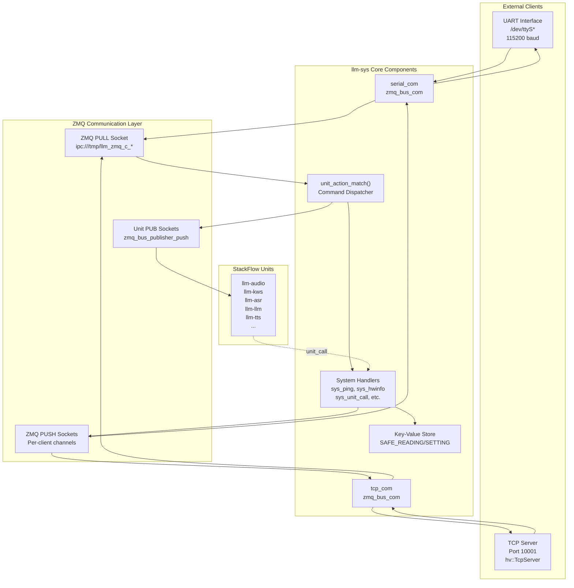
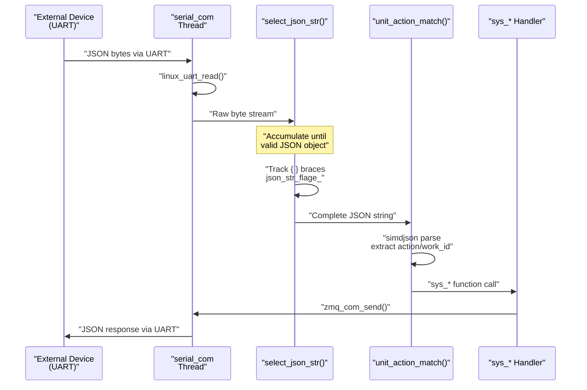
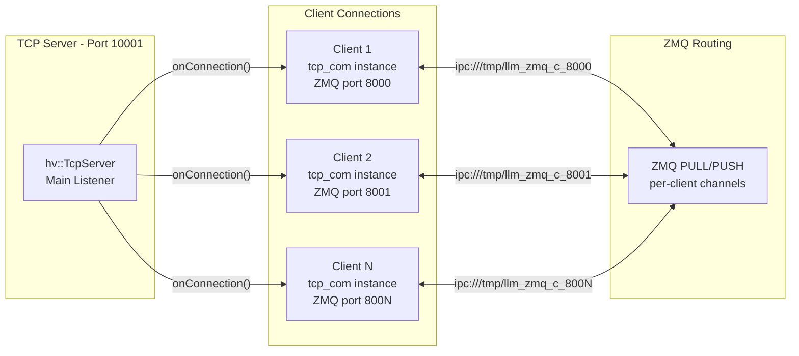
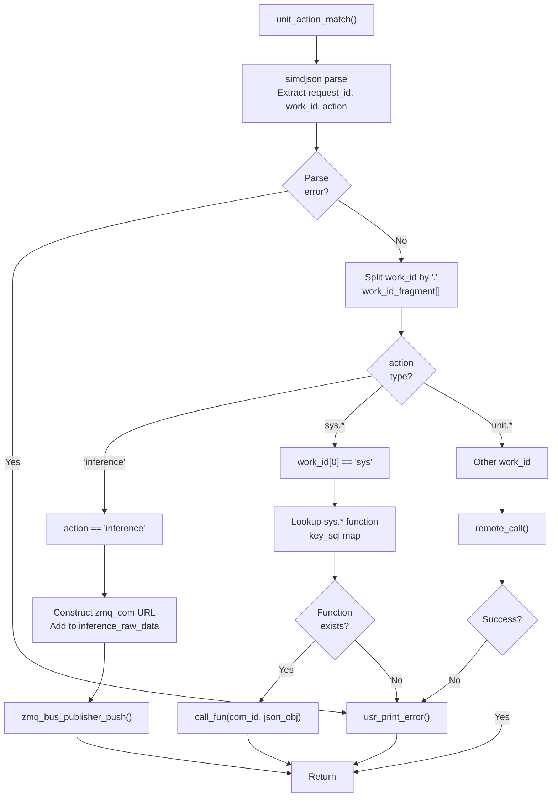
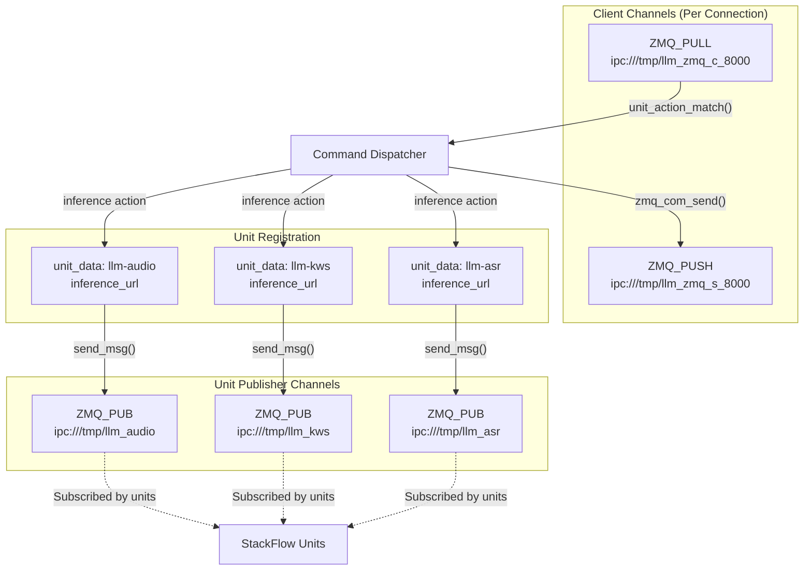
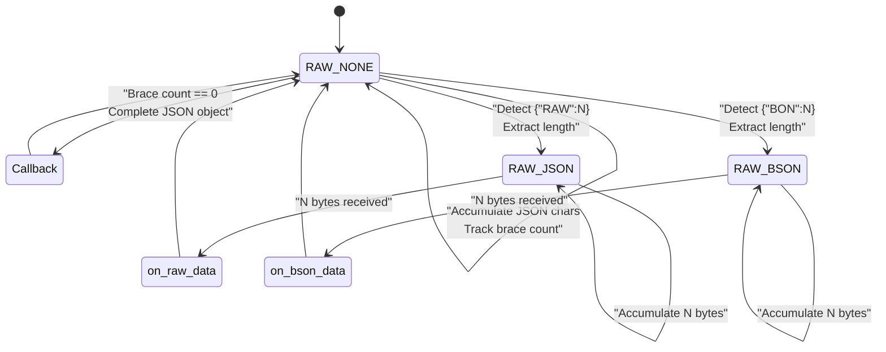
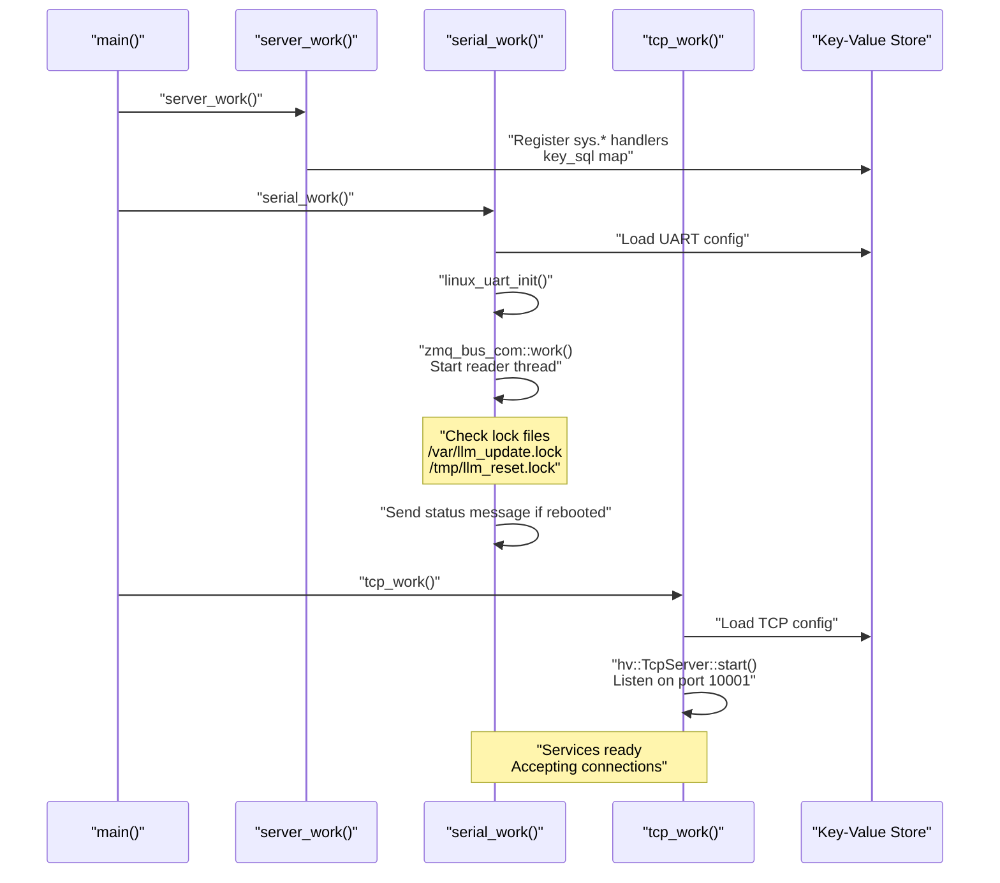

StackFlow System Controller (llm-sys)

# System Controller (llm-sys)

<details>
<summary>Relevant source files</summary>

The following files were used as context for generating this wiki page:

- [projects/llm_framework/main_sys/include/zmq_bus.h](projects/llm_framework/main_sys/include/zmq_bus.h)
- [projects/llm_framework/main_sys/src/event_loop.cpp](projects/llm_framework/main_sys/src/event_loop.cpp)
- [projects/llm_framework/main_sys/src/serial_com.cpp](projects/llm_framework/main_sys/src/serial_com.cpp)
- [projects/llm_framework/main_sys/src/tcp_com.cpp](projects/llm_framework/main_sys/src/tcp_com.cpp)
- [projects/llm_framework/main_sys/src/zmq_bus.cpp](projects/llm_framework/main_sys/src/zmq_bus.cpp)

</details>


## Purpose and Scope

The System Controller (`llm-sys`) is the central coordinator and entry point for the StackFlow LLM framework. It serves as the primary interface between external clients and internal AI units, managing command routing, system-level operations, and inter-process communication infrastructure.

This page documents the architecture, command dispatcher, external interfaces (UART/TCP), and system-level RPC functions provided by `llm-sys`. For information about the underlying ZMQ communication patterns and StackFlow base class functionality, see [StackFlow and pzmq Communication](#2.1). For details on unit lifecycle management and RPC protocol, see [RPC and Unit Management](#2.3).

**Sources:** [projects/llm_framework/main_sys/src/event_loop.cpp:1-844]()

---

## Architecture Overview

The `llm-sys` component acts as a bridge between external clients (UART/TCP) and internal AI processing units. It implements a multi-threaded event dispatcher that parses incoming JSON-RPC requests, routes them to appropriate handlers, and manages bidirectional communication with all StackFlow units.



**Sources:** [projects/llm_framework/main_sys/src/event_loop.cpp:743-762](), [projects/llm_framework/main_sys/src/zmq_bus.cpp:26-138](), [projects/llm_framework/main_sys/include/zmq_bus.h:43-77]()

---

## External Communication Interfaces

### UART Interface

The UART interface provides serial communication for embedded deployments. The `serial_com` class extends `zmq_bus_com` and implements a blocking read loop with JSON message parsing.

| Parameter | Configuration Key | Default Value |
|-----------|-------------------|---------------|
| Device Path | `config_serial_dev` | `/dev/ttyS*` |
| Baud Rate | `config_serial_baud` | `115200` |
| Data Bits | `config_serial_data_bits` | `8` |
| Stop Bits | `config_serial_stop_bits` | `1` |
| Parity | `config_serial_parity` | `0` (None) |
| ZMQ Port | `config_serial_zmq_port` | Internal routing |



The UART interface supports dynamic reconfiguration through the `sys.uartsetup` command, which updates parameters in the key-value store and restarts the serial connection without restarting the entire service.

**Sources:** [projects/llm_framework/main_sys/src/serial_com.cpp:28-128](), [projects/llm_framework/main_sys/src/event_loop.cpp:83-101]()

### TCP Interface

The TCP interface uses the `libhv` networking library to provide concurrent client connections. Each connected client receives a dedicated ZMQ communication channel with a unique port identifier.



The port counter (`counter_port`) starts at 8000 and increments for each new connection, wrapping back to 8000 after reaching 65535. This ensures that each client has a unique ZMQ channel identifier for bidirectional communication.

**Sources:** [projects/llm_framework/main_sys/src/tcp_com.cpp:30-113](), [projects/llm_framework/main_sys/src/zmq_bus.cpp:179-186]()

---

## Command Dispatcher

The `unit_action_match` function is the central routing logic that processes all incoming JSON-RPC requests. It uses `simdjson` for high-performance JSON parsing and maintains thread safety with a mutex lock.

### Dispatcher Flow



**Sources:** [projects/llm_framework/main_sys/src/event_loop.cpp:767-844]()

### JSON Parsing Strategy

The dispatcher uses three-tier parsing for performance:

1. **Fast Path**: `simdjson` streaming parser extracts `request_id`, `work_id`, and `action` fields without full deserialization [event_loop.cpp:768-802]()
2. **Lazy Parsing**: Full JSON object (`nlohmann::json`) created only when needed by handlers [event_loop.cpp:835]()
3. **Raw String**: For `inference` action, raw JSON passed directly to units to minimize overhead [event_loop.cpp:815-829]()

### Action Routing Logic

| Condition | Route Destination | Function Called |
|-----------|------------------|-----------------|
| `action == "inference"` | Unit's ZMQ PUB socket | `zmq_bus_publisher_push()` |
| `work_id[0] == "sys"` | System handler | `key_sql[unit_action]()` |
| Other `work_id` | Remote unit RPC | `remote_call()` |

**Sources:** [projects/llm_framework/main_sys/src/event_loop.cpp:815-843]()

---

## System RPC Functions

The `llm-sys` unit provides 16 system-level RPC functions accessible via the `sys.*` namespace. All functions are registered in the `key_sql` map during initialization.

### System Function Registry

```mermaid
graph TB
    REGISTRY["key_sql Map<br/>std::map&lt;std::string, sys_fun_call&gt;"]
    
    REGISTRY --> PING["sys.ping<br/>Connection test"]
    REGISTRY --> HWINFO["sys.hwinfo<br/>CPU/Memory/Temp"]
    REGISTRY --> CMMINFO["sys.cmminfo<br/>NPU memory info"]
    REGISTRY --> LSMODE["sys.lsmode<br/>List configurations"]
    REGISTRY --> RMMODE["sys.rmmode<br/>Remove package"]
    REGISTRY --> LSTASK["sys.lstask<br/>Reserved"]
    REGISTRY --> PUSH["sys.push<br/>File upload"]
    REGISTRY --> PULL["sys.pull<br/>File download"]
    REGISTRY --> UPDATE["sys.update<br/>Find update files"]
    REGISTRY --> UPGRADE["sys.upgrade<br/>Install packages"]
    REGISTRY --> BASHEXEC["sys.bashexec<br/>Execute shell"]
    REGISTRY --> UARTSETUP["sys.uartsetup<br/>Reconfigure UART"]
    REGISTRY --> RESET["sys.reset<br/>Restart services"]
    REGISTRY --> REBOOT["sys.reboot<br/>System reboot"]
    REGISTRY --> VERSION["sys.version<br/>Framework version"]
    REGISTRY --> VERSION2["sys.version2<br/>Binary versions"]
    REGISTRY --> UNITCALL["sys.unit_call<br/>Forward to unit"]
```



**Sources:** [projects/llm_framework/main_sys/src/event_loop.cpp:743-762]()

### Core System Functions

#### `sys.ping` - Connectivity Test

Simple echo function that returns success immediately. Used for connection verification and latency measurement.

**Implementation:** [event_loop.cpp:76-81]()

---

#### `sys.hwinfo` - Hardware Information

Collects system metrics including CPU load, memory usage, temperature, and network interface status. Runs in a detached thread to avoid blocking the dispatcher.

| Metric | Source | Units |
|--------|--------|-------|
| Temperature | `/sys/class/thermal/thermal_zone0/temp` | Millidegrees |
| CPU Load | `/proc/stat` (1-second sample) | Percentage |
| Memory | `/proc/meminfo` (MemTotal/MemAvailable) | Percentage |
| Network Speed | `/sys/class/net/*/speed` | Mbps |

**Response Format:**
```json
{
  "temperature": 45000,
  "cpu_loadavg": 23,
  "mem": 67,
  "eth_info": [
    {"name": "eth0", "ip": "192.168.1.100", "speed": "1000"}
  ]
}
```

**Implementation:** [event_loop.cpp:128-196]()

---

#### `sys.cmminfo` - NPU Memory Information

Reads Axera NPU contiguous memory manager (CMM) statistics from `/proc/ax_proc/mem_cmm_info`. Critical for monitoring NPU resource usage.

**Response Format:**
```json
{
  "total": 524288,
  "used": 131072,
  "remain": 393216
}
```

**Implementation:** [event_loop.cpp:229-291]()

---

#### `sys.lsmode` - List Configuration Modes

Scans the configuration directory (default: `/opt/m5stack/data/models/`) for JSON files prefixed with `mode_*.json`. Returns an array of parsed configuration objects.

**Implementation:** [event_loop.cpp:293-351]()

---

#### `sys.unit_call` - Unit RPC Forwarding

Forwards RPC calls to specific StackFlow units using the internal `unit_call()` function. The `object` field format is `"unit_name.function_name"`.

**Request Format:**
```json
{
  "action": "unit_call",
  "object": "llm-audio.get_volume",
  "data": {}
}
```

**Implementation:** [event_loop.cpp:198-227]()

---

#### `sys.push` / `sys.pull` - File Transfer

Binary-safe file transfer using base64 encoding and streaming support. Files can be transferred in chunks to avoid memory exhaustion.

**Object Format Syntax:**
- `sys.file./path/to/file` - Single chunk text file
- `sys.stream.file./path/to/file` - Multi-chunk text file
- `sys.base64.file./path/to/file` - Single chunk binary file
- `sys.base64.stream.file./path/to/file` - Multi-chunk binary file

**Streaming Protocol:**
```json
{
  "data": {
    "index": 0,
    "delta": "chunk_data_here",
    "finish": false
  }
}
```

The system creates a temporary directory `.tmp_file` for chunk reassembly and computes SHA256 checksums for verification.

**Implementation:** [event_loop.cpp:404-540]()

---

#### `sys.bashexec` - Shell Command Execution

Executes arbitrary bash commands in a pseudo-terminal (pty) and streams output in real-time or buffered mode. Supports both streaming and single-response modes.

**Security Note:** This function executes arbitrary commands with system privileges. Production deployments should implement access control.

**Features:**
- PTY allocation via `forkpty()` for proper terminal behavior
- ECHO disabled to prevent command echo in output
- Automatic exit injection to terminate shell session
- Streaming support with configurable chunk size

**Implementation:** [event_loop.cpp:593-694]()

---

#### `sys.upgrade` / `sys.update` - Package Management

`sys.update` searches `/mnt` for Debian packages matching `llm_update_*.deb` pattern.

`sys.upgrade` installs specified packages using `dpkg -i`, creating a lock file `/var/llm_update.lock` to track upgrade state across reboots.

**Implementation:** [event_loop.cpp:542-591]()

---

#### `sys.reset` / `sys.reboot` - System Control

`sys.reset` restarts all StackFlow services using systemd:
```bash
systemctl restart llm-*
```

`sys.reboot` performs a full system reboot:
```bash
reboot
```

Both create lock files (`/tmp/llm_reset.lock`, `/var/llm_update.lock`) to enable post-restart status reporting.

**Implementation:** [event_loop.cpp:696-741]()

---

## ZMQ Message Bus Architecture

The `llm-sys` component manages a complex ZMQ topology that connects external clients to internal units. Each communication path uses specific socket types optimized for its traffic pattern.

### Socket Topology



**Sources:** [projects/llm_framework/main_sys/src/zmq_bus.cpp:140-195](), [projects/llm_framework/main_sys/include/zmq_bus.h:23-41]()

### `unit_data` Class

Each registered unit has an associated `unit_data` instance stored in the key-value store. This object manages the unit's ZMQ PUB socket for broadcasting inference requests.

**Class Structure:**
```cpp
class unit_data {
    std::unique_ptr<pzmq> user_inference_chennal_;  // ZMQ_PUB socket
    std::string work_id;                             // Unit identifier
    std::string inference_url;                       // ipc:///tmp/llm_{work_id}
    
    void init_zmq(const std::string &url);
    void send_msg(const std::string &json_str);
};
```

Units register themselves by creating a `unit_data` instance and storing it in the global key-value store with their `work_id` as the key.

**Sources:** [projects/llm_framework/main_sys/include/zmq_bus.h:23-38](), [projects/llm_framework/main_sys/src/zmq_bus.cpp:140-158]()

### Message Format Augmentation

When forwarding `inference` actions to units, the dispatcher injects a `zmq_com` field containing the client's return channel URL:

```json
{
  "zmq_com": "ipc:///tmp/llm_zmq_s_8000",
  "request_id": "req_123",
  "work_id": "llm-audio",
  "action": "inference",
  "data": { ... }
}
```

This allows units to send responses directly back to the originating client without routing through the dispatcher.

**Sources:** [projects/llm_framework/main_sys/src/event_loop.cpp:815-829]()

---

## JSON Message Parsing

The `zmq_bus_com` class implements a sophisticated state machine for parsing JSON messages from stream-based transports (UART/TCP). It handles three message formats:

1. **Standard JSON** - Complete objects delimited by `{` and `}`
2. **RAW_JSON** - Binary data with length prefix: `{"RAW":1024}` followed by 1024 bytes
3. **RAW_BSON** - BSON data with length prefix: `{"BON":512}` followed by 512 bytes

### Parsing State Machine



The parser uses ARM NEON SIMD intrinsics when available to accelerate brace matching, processing 16 bytes per iteration instead of character-by-character scanning.

**Sources:** [projects/llm_framework/main_sys/src/zmq_bus.cpp:196-300](), [projects/llm_framework/main_sys/include/zmq_bus.h:43-77]()

### NEON-Optimized Parsing

The parser leverages ARM NEON instructions to compare 16 characters simultaneously for `{` and `}` delimiters:

```cpp
uint8x16_t target_open  = vdupq_n_u8('{');
uint8x16_t target_close = vdupq_n_u8('}');
uint8x16_t input_vector = vld1q_u8((const uint8_t *)&data[i]);
uint8x16_t result_open  = vceqq_u8(input_vector, target_open);
uint8x16_t result_close = vceqq_u8(input_vector, target_close);
uint8x16_t result_mask  = vorrq_u8(result_open, result_close);
```

If no delimiters are found in the 16-byte chunk, it's appended in bulk rather than character-by-character, significantly improving throughput for large JSON objects.

**Sources:** [projects/llm_framework/main_sys/src/zmq_bus.cpp:207-223]()

---

## Initialization and Lifecycle

The `llm-sys` service initialization follows a deterministic startup sequence to ensure all subsystems are ready before accepting client connections.

### Startup Sequence



**Sources:** [projects/llm_framework/main_sys/src/event_loop.cpp:743-766](), [projects/llm_framework/main_sys/src/serial_com.cpp:88-123](), [projects/llm_framework/main_sys/src/tcp_com.cpp:95-109]()

### Post-Restart Status Reporting

After system upgrades or resets, the serial interface checks for lock files and sends automatic status messages to inform connected clients:

| Lock File | Message | Meaning |
|-----------|---------|---------|
| `/var/llm_update.lock` | `"upgrade over"` | Package installation completed |
| `/tmp/llm_reset.lock` | `"reset over"` | Service restart completed |

These lock files are created by the upgrade/reset handlers and removed after status reporting to prevent duplicate messages.

**Sources:** [projects/llm_framework/main_sys/src/serial_com.cpp:104-122]()

---

## Error Handling and Response Format

All system functions use a standardized response format that includes error codes and descriptive messages. The `usr_print_error()` helper function constructs these responses.

### Standard Response Format

```json
{
  "request_id": "req_123",
  "work_id": "sys",
  "created": 1640000000,
  "object": "sys.utf-8",
  "data": "response_data",
  "error": {
    "code": 0,
    "message": ""
  }
}
```

### Error Code Reference

| Code | Meaning | Typical Cause |
|------|---------|---------------|
| `0` | Success | Normal operation |
| `-1` | General error | Unexpected exception |
| `-2` | JSON format error | Invalid JSON syntax |
| `-3` | Action match false | Unknown system command |
| `-4` | Inference push failed | Unit not registered |
| `-9` | Unit call false | RPC to unit failed |
| `-10` | Not available | Function not implemented |
| `-17` | File error | File not found or permission denied |

**Sources:** [projects/llm_framework/main_sys/src/event_loop.cpp:44-74]()

### Thread Safety

All system handlers that perform long-running operations (file I/O, shell execution, hardware polling) spawn detached threads to prevent blocking the command dispatcher:

```cpp
int sys_hwinfo(int com_id, const nlohmann::json &json_obj) {
    std::thread t(_sys_hwinfo, com_id, json_obj);
    t.detach();
    return 0;
}
```

The `unit_action_match` function itself is protected by `unit_action_match_mtx` to ensure sequential processing of commands, preventing race conditions in the key-value store and ZMQ socket access.

**Sources:** [projects/llm_framework/main_sys/src/event_loop.cpp:767-772](), [projects/llm_framework/main_sys/src/event_loop.cpp:190-196]()