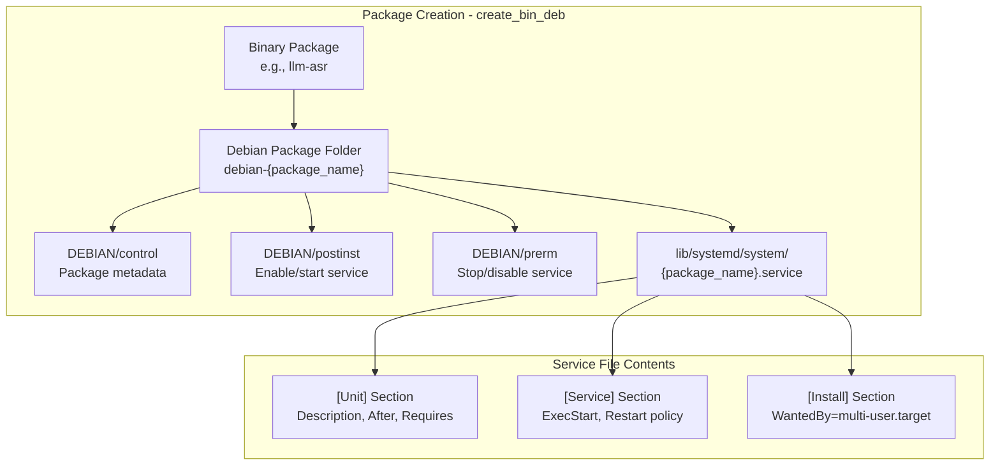
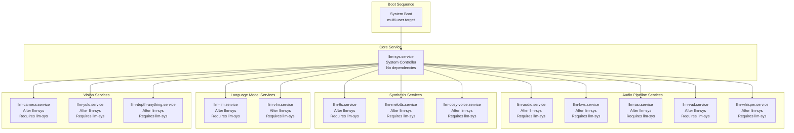
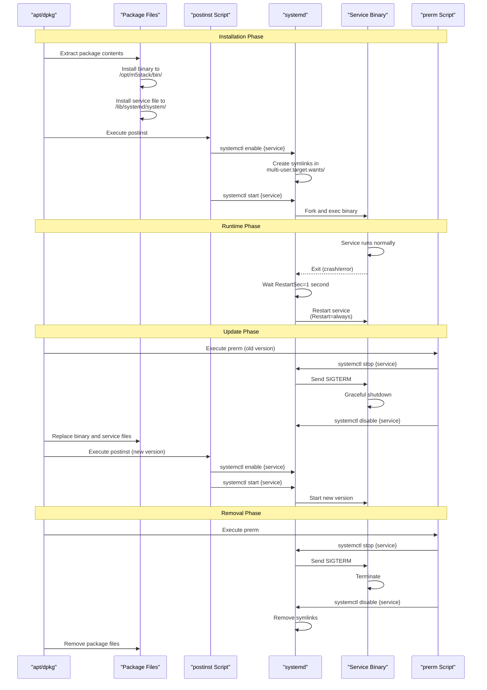

StackFlow Systemd Service Management

# Systemd Service Management

<details>
<summary>Relevant source files</summary>

The following files were used as context for generating this wiki page:

- [projects/llm_framework/main_llm/SConstruct](projects/llm_framework/main_llm/SConstruct)
- [projects/llm_framework/main_openai_api/SConstruct](projects/llm_framework/main_openai_api/SConstruct)
- [projects/llm_framework/main_vlm/SConstruct](projects/llm_framework/main_vlm/SConstruct)
- [projects/llm_framework/tools/llm_pack.py](projects/llm_framework/tools/llm_pack.py)

</details>


## Purpose and Scope

This document describes the systemd service integration in the StackFlow framework. It covers how systemd service files are automatically generated during package creation, the structure and dependencies of these service files, and the lifecycle management through post-installation and pre-removal scripts. For information about the package creation process itself, see [Package Creation System](#7.1). For details on installation methods and package deployment, see [Installation Methods](#7.3).

The systemd integration enables automatic startup, dependency management, and service monitoring for all StackFlow AI units, ensuring the complete pipeline is properly orchestrated at system boot and during updates.

## Service File Generation

Systemd service files are automatically generated during the binary package creation process by the `create_bin_deb` function in `llm_pack.py`. Each binary package includes a corresponding `.service` file that defines how systemd should manage that unit.



The service file is created at lines [projects/llm_framework/tools/llm_pack.py:321-337](), where the function writes a standardized systemd unit file into the package structure. The service file path follows the pattern `/lib/systemd/system/{package_name}.service`.

**Sources:** [projects/llm_framework/tools/llm_pack.py:244-345]()

## Service File Structure

Each StackFlow service file follows a standard three-section structure that defines the service behavior, dependencies, and execution parameters.

### Unit Section

The `[Unit]` section defines service metadata and dependencies:

```ini
[Unit]
Description={package_name} Service
After=llm-sys.service
Requires=llm-sys.service
```

**Dependency Rules:**
- All services except `llm-sys` include `After=llm-sys.service` to ensure sequential startup
- The `Requires=llm-sys.service` directive creates a hard dependency on the system controller
- This ensures `llm-sys` is running before any AI processing units start

### Service Section

The `[Service]` section defines execution and recovery behavior:

```ini
[Service]
ExecStart=/opt/m5stack/bin/{bin_file_name}
WorkingDirectory=/opt/m5stack
Restart=always
RestartSec=1
StartLimitInterval=0
```

**Configuration Parameters:**

| Parameter | Value | Purpose |
|-----------|-------|---------|
| `ExecStart` | `/opt/m5stack/bin/{bin_file_name}` | Binary executable path with version suffix |
| `WorkingDirectory` | `/opt/m5stack` | Sets working directory for relative paths |
| `Restart` | `always` | Automatically restart on any exit condition |
| `RestartSec` | `1` | Wait 1 second before restarting |
| `StartLimitInterval` | `0` | Unlimited restart attempts (no rate limiting) |

The `Restart=always` policy ensures services automatically recover from crashes, while `StartLimitInterval=0` allows unlimited restart attempts without hitting systemd's default rate limit.

### Install Section

The `[Install]` section defines the systemd target:

```ini
[Install]
WantedBy=multi-user.target
```

This makes the service start automatically when the system reaches multi-user mode (the default boot target on most embedded systems).

**Sources:** [projects/llm_framework/tools/llm_pack.py:321-337]()

## Service Dependencies and Startup Order

The StackFlow service architecture uses a hierarchical dependency model where `llm-sys` acts as the central coordinator that must start before any other units.



### Dependency Implementation

The dependency logic is implemented at [projects/llm_framework/tools/llm_pack.py:324-326]():

```python
if package_name != 'llm-sys':
    f.write(f'After=llm-sys.service\n')
    f.write(f'Requires=llm-sys.service\n')
```

This conditional ensures:
1. `llm-sys.service` has no dependencies and starts first
2. All other services wait for `llm-sys` to be active before starting
3. If `llm-sys` stops or fails, dependent services are also stopped

**Sources:** [projects/llm_framework/tools/llm_pack.py:324-326]()

## Post-Installation Scripts (postinst)

The `postinst` script executes after package installation and is responsible for enabling and starting the systemd service. This script is generated for each binary package and placed in the `DEBIAN/postinst` file.

### Binary Package postinst

For individual service packages, the postinst script at [projects/llm_framework/tools/llm_pack.py:310-314]() contains:

```bash
#!/bin/sh
[ -f "/lib/systemd/system/{package_name}.service" ] && systemctl enable {package_name}.service
[ -f "/lib/systemd/system/{package_name}.service" ] && systemctl start {package_name}.service
exit 0
```

**Script Behavior:**
1. Checks if the service file exists using `[ -f ... ]` test
2. Runs `systemctl enable` to create symlinks in systemd's target directories
3. Runs `systemctl start` to immediately start the service
4. Both commands only execute if the service file exists

### lib-llm Base Package postinst

The base library package `lib-llm` includes a comprehensive postinst script at [projects/llm_framework/tools/llm_pack.py:103-124]() that handles multiple services:

```bash
#!/bin/sh
sed -i 's/dpkg -i/apt install -y/g' /usr/local/m5stack/update_check.sh
[ -f "/lib/systemd/system/llm-sys.service" ] && systemctl enable llm-sys.service
[ -f "/lib/systemd/system/llm-sys.service" ] && systemctl start llm-sys.service
[ -f "/lib/systemd/system/llm-asr.service" ] && systemctl enable llm-asr.service
[ -f "/lib/systemd/system/llm-asr.service" ] && systemctl start llm-asr.service
# ... (repeats for all services)
exit 0
```

This ensures that when the base library is installed or updated, all existing services are automatically restarted in the correct order (with `llm-sys` first).

**Sources:** [projects/llm_framework/tools/llm_pack.py:310-314](), [projects/llm_framework/tools/llm_pack.py:103-124]()

## Pre-Removal Scripts (prerm)

The `prerm` script executes before package removal and ensures graceful service shutdown and cleanup. This prevents services from running with missing dependencies after package removal.

### Binary Package prerm

For individual service packages, the prerm script at [projects/llm_framework/tools/llm_pack.py:315-319]() contains:

```bash
#!/bin/sh
[ -f "/lib/systemd/system/{package_name}.service" ] && systemctl stop {package_name}.service
[ -f "/lib/systemd/system/{package_name}.service" ] && systemctl disable {package_name}.service
exit 0
```

**Script Behavior:**
1. Runs `systemctl stop` to gracefully terminate the running service
2. Runs `systemctl disable` to remove startup symlinks
3. Ensures clean state before package files are deleted

### lib-llm Base Package prerm

The base library package includes a comprehensive prerm script at [projects/llm_framework/tools/llm_pack.py:125-145]() that stops services in reverse dependency order:

```bash
#!/bin/sh
[ -f "/lib/systemd/system/llm-tts.service" ] && systemctl stop llm-tts.service
[ -f "/lib/systemd/system/llm-tts.service" ] && systemctl disable llm-tts.service
[ -f "/lib/systemd/system/llm-llm.service" ] && systemctl stop llm-llm.service
[ -f "/lib/systemd/system/llm-llm.service" ] && systemctl disable llm-llm.service
# ... (continues through all services)
[ -f "/lib/systemd/system/llm-sys.service" ] && systemctl stop llm-sys.service
[ -f "/lib/systemd/system/llm-sys.service" ] && systemctl disable llm-sys.service
exit 0
```

**Note:** The services are stopped in reverse order, with `llm-sys` stopped last. This ensures dependent services terminate before the system controller.

**Sources:** [projects/llm_framework/tools/llm_pack.py:315-319](), [projects/llm_framework/tools/llm_pack.py:125-145]()

## Service Lifecycle Management

The complete service lifecycle from package installation through runtime operation to removal involves multiple phases managed by dpkg, systemd, and the maintainer scripts.



### Installation Phase

1. Package files are extracted to the filesystem
2. Binary is placed in `/opt/m5stack/bin/` with version suffix (e.g., `llm_asr-1.8`)
3. Service file is installed to `/lib/systemd/system/{package_name}.service`
4. `postinst` script executes `systemctl enable` and `systemctl start`
5. systemd creates target symlinks and forks the service process

### Runtime Phase

During normal operation:
- Service runs continuously under systemd supervision
- If the service exits for any reason, systemd waits `RestartSec=1` second
- systemd automatically restarts the service due to `Restart=always`
- `StartLimitInterval=0` ensures no limit on restart attempts

### Update Phase

When a package is updated:
1. `prerm` stops and disables the old version
2. Old files are replaced with new package contents
3. `postinst` re-enables and starts the new version
4. Service transitions to the new binary without manual intervention

### Removal Phase

When a package is removed:
1. `prerm` stops and disables the service
2. systemd removes target symlinks
3. Package files (binary and service file) are deleted
4. Service is completely removed from the system

**Sources:** [projects/llm_framework/tools/llm_pack.py:244-345]()

## Service Configuration Reference

The following table documents all StackFlow services, their package versions, and key configuration details as defined in the packaging system.

### Core System Service

| Service Name | Package | Version | Dependencies | Startup Order |
|--------------|---------|---------|--------------|---------------|
| `llm-sys.service` | llm-sys | 1.6 | None | First (no After/Requires) |

### Audio and Speech Services

| Service Name | Package | Version | Dependencies | Purpose |
|--------------|---------|---------|--------------|---------|
| `llm-audio.service` | llm-audio | 1.8 | lib-llm >= 1.8 | Audio capture and playback |
| `llm-kws.service` | llm-kws | 1.10 | lib-llm >= 1.8 | Keyword spotting and wake word detection |
| `llm-asr.service` | llm-asr | 1.8 | lib-llm >= 1.8 | Speech recognition (Sherpa-NCNN) |
| `llm-whisper.service` | llm-whisper | 1.8 | lib-llm >= 1.8 | Speech recognition (Whisper NPU) |
| `llm-vad.service` | llm-vad | 1.8 | lib-llm >= 1.8 | Voice activity detection |
| `llm-tts.service` | llm-tts | 1.6 | lib-llm >= 1.8 | CPU-based text-to-speech |
| `llm-melotts.service` | llm-melotts | 1.10 | lib-llm >= 1.8 | NPU-accelerated MeloTTS |
| `llm-cosy-voice.service` | llm-cosy-voice | 1.10 | lib-llm >= 1.8 | Neural CosyVoice TTS |

### Language Model Services

| Service Name | Package | Version | Dependencies | Purpose |
|--------------|---------|---------|--------------|---------|
| `llm-llm.service` | llm-llm | 1.12 | lib-llm >= 1.8 | LLM inference (Qwen, Llama) |
| `llm-vlm.service` | llm-vlm | 1.11 | lib-llm >= 1.8 | Vision-language models |

### Computer Vision Services

| Service Name | Package | Version | Dependencies | Purpose |
|--------------|---------|---------|--------------|---------|
| `llm-camera.service` | llm-camera | 1.9 | lib-llm | Video capture and streaming |
| `llm-yolo.service` | llm-yolo | 1.9 | lib-llm >= 1.8 | Object detection and segmentation |
| `llm-depth-anything.service` | llm-depth-anything | 1.7 | lib-llm >= 1.8 | Depth estimation |

### API Services

| Service Name | Package | Version | Dependencies | Purpose |
|--------------|---------|---------|--------------|---------|
| `llm-openai-api.service` | llm-openai-api | 1.10 | lib-llm >= 1.8 | OpenAI-compatible API server |

**Notes:**
- All services except `llm-sys` have implicit dependency on `llm-sys.service` through `After` and `Requires` directives
- Version numbers are extracted from the binary filename suffix during packaging
- The `lib-llm` base package provides shared libraries required by all services

**Sources:** [projects/llm_framework/tools/llm_pack.py:373-391]()

## Script Permissions and Execution

Both `postinst` and `prerm` scripts require executable permissions to be invoked by dpkg. The packaging script ensures correct permissions at [projects/llm_framework/tools/llm_pack.py:339-340]():

```python
os.chmod(os.path.join(deb_folder, 'DEBIAN/postinst'), 0o755)
os.chmod(os.path.join(deb_folder, 'DEBIAN/prerm'), 0o755)
```

These scripts execute with root privileges during package management operations, allowing them to perform system-level actions like enabling/disabling systemd services.

**Sources:** [projects/llm_framework/tools/llm_pack.py:339-340](), [projects/llm_framework/tools/llm_pack.py:146-147]()

## Integration with Build System

The systemd service infrastructure integrates with the SCons build system through the component registration mechanism. Each unit's `SConstruct` file defines a versioned target that includes the binary version number.

### Example: llm-llm Service

From [projects/llm_framework/main_llm/SConstruct:69]():

```python
env['COMPONENTS'].append({'target':'llm_llm-1.12',
                          'SRCS':SRCS,
                          # ... other build configuration
                          'REGISTER':'project'
                          })
```

This target name `llm_llm-1.12` becomes:
1. The binary filename in `/opt/m5stack/bin/llm_llm-1.12`
2. The `ExecStart` path in the systemd service file
3. The version number in the package name `llm-llm_1.12-m5stack1_arm64.deb`

The packaging system automatically detects the binary version suffix at [projects/llm_framework/tools/llm_pack.py:245-252]() and uses it to construct the service file's `ExecStart` directive.

**Sources:** [projects/llm_framework/main_llm/SConstruct:69](), [projects/llm_framework/main_vlm/SConstruct:79](), [projects/llm_framework/main_openai_api/SConstruct:55](), [projects/llm_framework/tools/llm_pack.py:245-252](), [projects/llm_framework/tools/llm_pack.py:286-289]()