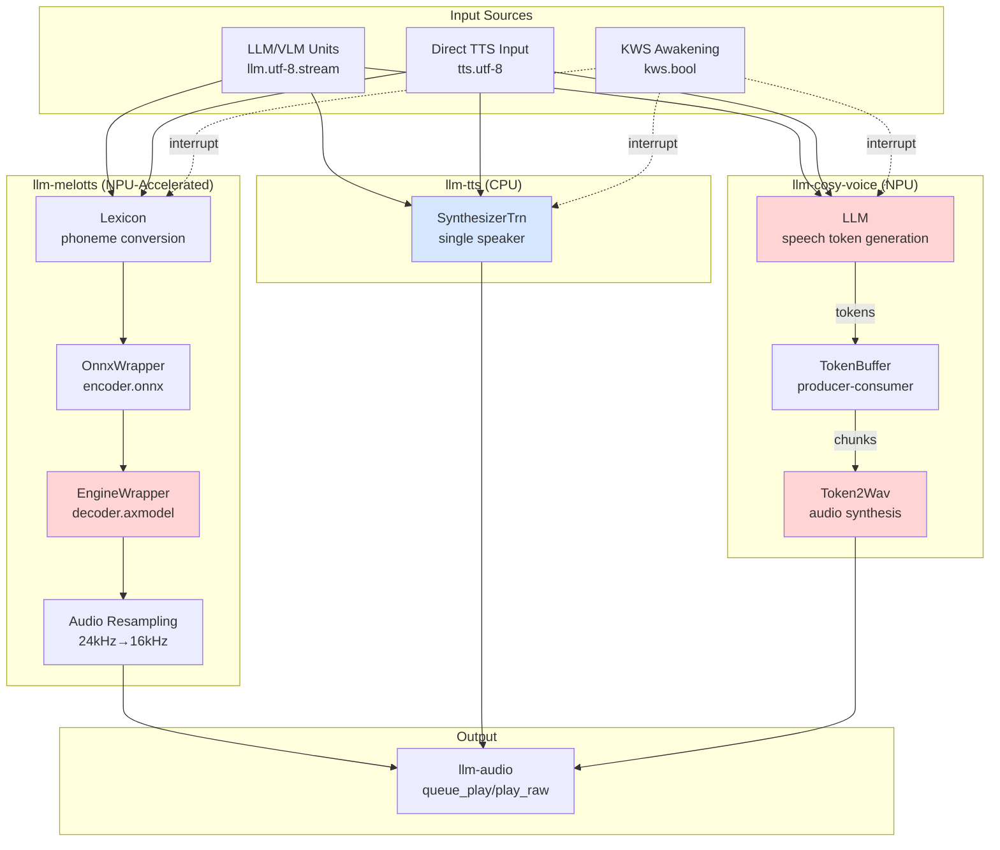
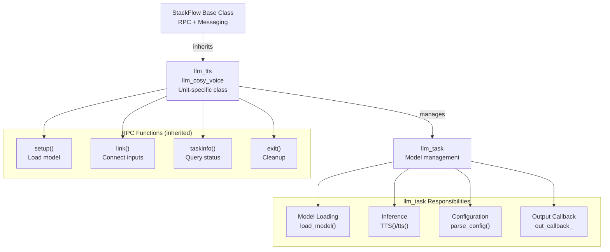
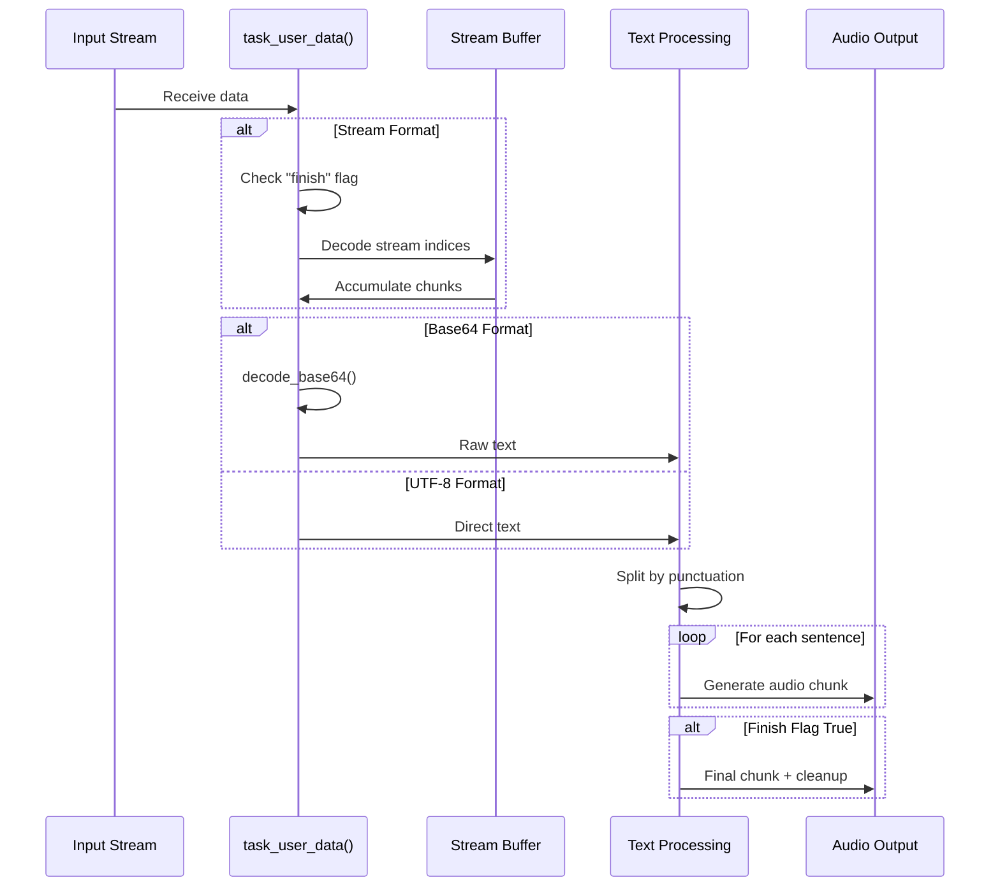
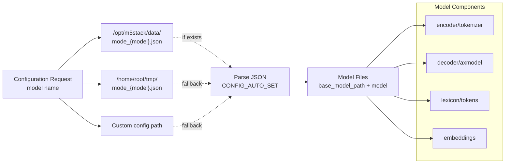
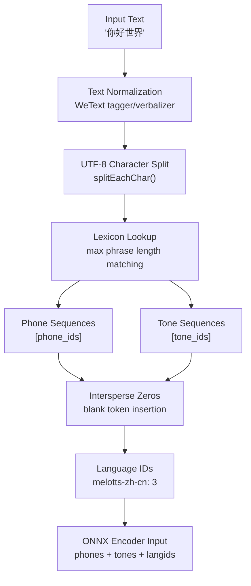
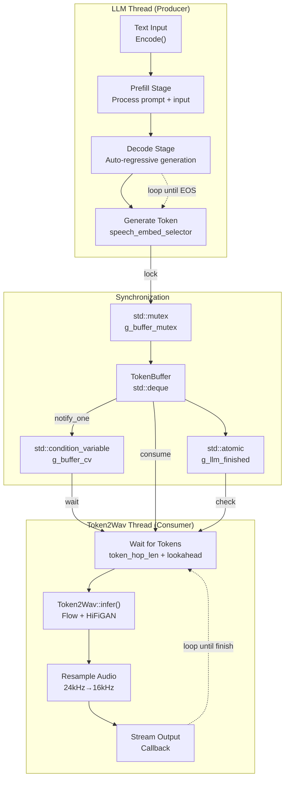
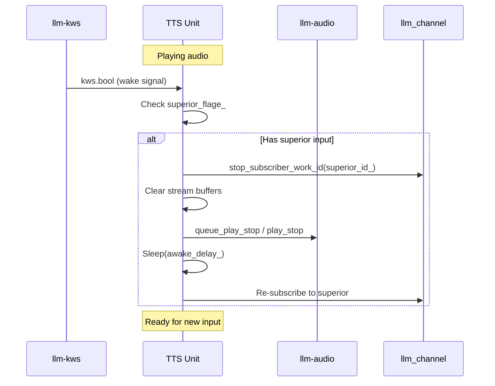
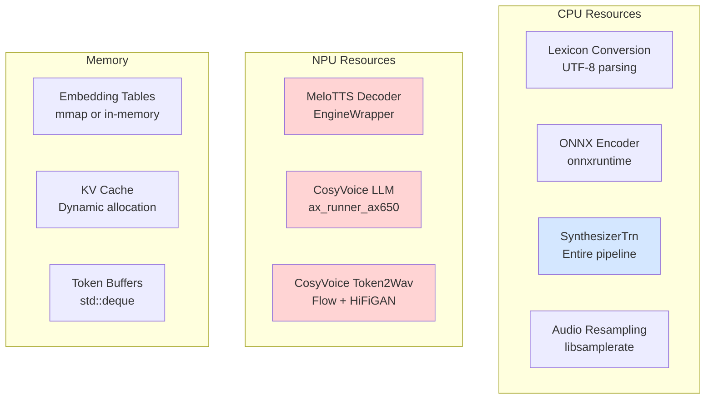

StackFlow Text-to-Speech Systems

# Text-to-Speech Systems

<details>
<summary>Relevant source files</summary>

The following files were used as context for generating this wiki page:

- [projects/llm_framework/main/src/main.cpp](projects/llm_framework/main/src/main.cpp)
- [projects/llm_framework/main_cosy_voice/src/main.cpp](projects/llm_framework/main_cosy_voice/src/main.cpp)
- [projects/llm_framework/main_cosy_voice/src/runner/LLM.hpp](projects/llm_framework/main_cosy_voice/src/runner/LLM.hpp)
- [projects/llm_framework/main_melotts/src/main.cpp](projects/llm_framework/main_melotts/src/main.cpp)
- [projects/llm_framework/main_melotts/src/runner/Lexicon.hpp](projects/llm_framework/main_melotts/src/runner/Lexicon.hpp)
- [projects/llm_framework/main_tts/src/main.cpp](projects/llm_framework/main_tts/src/main.cpp)

</details>


This page provides an overview of the three text-to-speech (TTS) implementations in the StackFlow framework, each offering different computational profiles and capabilities. For detailed documentation of individual implementations, see:
- [MeloTTS (llm-melotts)](#3.5.1) - NPU-accelerated neural TTS with lexicon-based phoneme conversion
- [Traditional TTS (llm-tts)](#3.5.2) - CPU-based single-speaker synthesis
- [CosyVoice (llm-cosy-voice)](#3.5.3) - LLM-based token generation with concurrent Token2Wav synthesis

## TTS Implementation Comparison

The framework provides three distinct TTS engines designed for different use cases and hardware constraints:

| Feature | llm-melotts | llm-tts | llm-cosy-voice |
|---------|-------------|---------|----------------|
| **Acceleration** | NPU (Decoder) + ONNX (Encoder) | CPU Only | NPU (LLM + Token2Wav) |
| **Streaming** | Yes | No | Yes |
| **Language Support** | Multi-language (ja-jp, en-us, zh-cn) | Limited | Configurable |
| **Pipeline Stages** | Lexicon → ONNX Encoder → NPU Decoder | Single-stage SynthesizerTrn | LLM Token Generation → Token2Wav |
| **Text Processing** | Phoneme-based with WeText | Character-based | Tokenizer-based |
| **Latency** | Medium | Low | Higher (concurrent processing) |
| **Model Size** | 60-102 MB | 60-77 MB | 500MB-2GB |
| **Concurrent Processing** | No | No | Yes (LLM + Token2Wav threads) |
| **Audio Resampling** | libsamplerate | No | libsamplerate |

**Sources:** [projects/llm_framework/main_melotts/src/main.cpp:1-874](), [projects/llm_framework/main_tts/src/main.cpp:1-542](), [projects/llm_framework/main_cosy_voice/src/main.cpp:1-1150]()

## System Architecture Overview



**Title:** TTS System Architecture Comparison

**Sources:** [projects/llm_framework/main_melotts/src/main.cpp:39-62](), [projects/llm_framework/main_tts/src/main.cpp:31-36](), [projects/llm_framework/main_cosy_voice/src/main.cpp:57-101]()

## Common Framework Patterns

All three TTS implementations follow the StackFlow unit architecture with consistent patterns:

### Class Structure



**Title:** Common TTS Unit Architecture

**Sources:** [projects/llm_framework/main_melotts/src/main.cpp:525-860](), [projects/llm_framework/main_tts/src/main.cpp:186-529](), [projects/llm_framework/main_cosy_voice/src/main.cpp:708-1047]()

### Input Stream Handling

Each TTS unit subscribes to three types of input streams:

1. **Direct TTS Input** - Empty work_id filter for direct text input
2. **LLM/VLM Output** - Specific work_id filter for streaming model responses
3. **KWS Awakening** - Interrupt signal to stop current playback

**Input Processing Implementation:**



**Title:** Input Stream Processing Flow

**Sources:** [projects/llm_framework/main_melotts/src/main.cpp:580-641](), [projects/llm_framework/main_tts/src/main.cpp:249-310](), [projects/llm_framework/main_cosy_voice/src/main.cpp:775-818]()

### Configuration Loading

All units use a consistent configuration file resolution pattern:



**Title:** Configuration File Resolution

**Sources:** [projects/llm_framework/main_melotts/src/main.cpp:131-222](), [projects/llm_framework/main_tts/src/main.cpp:92-143](), [projects/llm_framework/main_cosy_voice/src/main.cpp:149-331]()

## MeloTTS Pipeline Details

MeloTTS uses a two-stage neural architecture with lexicon-based text preprocessing:

### Phoneme Conversion Process

The `Lexicon` class [projects/llm_framework/main_melotts/src/runner/Lexicon.hpp:26-392]() provides sophisticated text-to-phoneme conversion:

| Component | Description |
|-----------|-------------|
| **Lexicon Dictionary** | Maps words/phrases to phone-tone pairs |
| **Token Mapping** | Converts phonemes to token IDs |
| **WeText Processor** | Optional tagger/verbalizer for text normalization |
| **Unknown Handling** | Fallback strategy for OOV words |
| **Punctuation Mapping** | Special handling for punctuation marks |

**Conversion Flow:**



**Title:** MeloTTS Text-to-Phoneme Conversion

**Sources:** [projects/llm_framework/main_melotts/src/runner/Lexicon.hpp:253-350](), [projects/llm_framework/main_melotts/src/main.cpp:300-309]()

### Encoder-Decoder Architecture

[projects/llm_framework/main_melotts/src/main.cpp:256-460]()

**Encoder Stage (ONNX Runtime):**
- Input: Phone IDs, tone IDs, language IDs, speaker embedding (g_matrix)
- Parameters: `noise_scale`, `noise_scale_w`, `length_scale`, `sdp_ratio`
- Output: Latent representation (`zp_data`) + audio length

**Decoder Stage (Axera NPU):**
- Input: Sliced latent features + speaker embedding
- Processing: Iterative decoding with overlap-fade blending
- Output: Raw PCM audio at model sample rate (44.1kHz)

**Overlap-Fade Strategy:**
```
Slice 0: |==========|----overlap----|
Slice 1:              |----overlap----|==========|----overlap----|
Slice 2:                                           |----overlap----|==========|
         ^            ^                            ^
         Main audio   Fade blend (512 samples)    Main audio
```

**Sources:** [projects/llm_framework/main_melotts/src/main.cpp:315-418]()

## CosyVoice Concurrent Processing

CosyVoice employs a producer-consumer pattern with concurrent LLM token generation and audio synthesis:

### Token Buffer Coordination



**Title:** CosyVoice Concurrent Token Processing

**Sources:** [projects/llm_framework/main_cosy_voice/src/main.cpp:405-571](), [projects/llm_framework/main_cosy_voice/src/runner/LLM.hpp:340-696]()

### Token Generation Parameters

The LLM component [projects/llm_framework/main_cosy_voice/src/runner/LLM.hpp:32-82]() manages:

| Parameter | Description |
|-----------|-------------|
| `prefill_token_num` | Tokens processed per prefill iteration (96) |
| `prefill_max_token_num` | Maximum prefill context length (512) |
| `max_token_len` | Maximum decode sequence length (127) |
| `kv_cache_num` | KV cache size (1024) |
| `speech_embed_num` | Speech token vocabulary size (6564) |
| `min_len` / `max_len` | Output length constraints (auto-calculated) |

**Sources:** [projects/llm_framework/main_cosy_voice/src/runner/LLM.hpp:111-240]()

## Wake Word Interruption

All TTS units implement KWS-based interruption to stop ongoing synthesis:



**Title:** Wake Word Interruption Flow

**Sources:** [projects/llm_framework/main_melotts/src/main.cpp:643-667](), [projects/llm_framework/main_tts/src/main.cpp:312-335](), [projects/llm_framework/main_cosy_voice/src/main.cpp:820-830]()

The `awake_delay_` parameter (default 1000ms) provides a grace period before resuming subscriptions.

## Audio Output Integration

All TTS units output PCM audio to the `llm-audio` unit using two methods:

### Output Methods

| Method | TTS Unit | Platform | Behavior |
|--------|----------|----------|----------|
| `queue_play` | All | AX620E/Q | Queued playback (non-blocking) |
| `play_raw` | melotts, tts | Others | Direct playback (blocking) |

### Audio Format Specifications

**MeloTTS & CosyVoice:**
- Model Rate: 44.1kHz or 24kHz (configurable)
- Output Rate: 16kHz (resampled via libsamplerate)
- Format: PCM 16-bit signed integer
- Encoding: Base64 (for network transmission)

**Traditional TTS:**
- Model Rate: 16kHz (native)
- No resampling required
- Format: PCM 16-bit signed integer

**Audio Capture Management:**

MeloTTS and traditional TTS automatically pause audio capture during synthesis [projects/llm_framework/main_melotts/src/main.cpp:261-295]():

1. Query `audio_status` before synthesis
2. Call `cap_stop_all` if capture is running
3. Monitor `audio_status` for playback completion
4. Resume capture with `cap` command

**Sources:** [projects/llm_framework/main_melotts/src/main.cpp:562-568](), [projects/llm_framework/main_tts/src/main.cpp:221-223](), [projects/llm_framework/main_cosy_voice/src/main.cpp:743-745]()

## Hardware Resource Usage

### NPU Initialization Management

NPU-accelerated units (melotts, cosy-voice) share AXERA NPU initialization:

```cpp
static int ax_init_flage_ = 0;  // Reference count

void _ax_init() {
    if (!ax_init_flage_) {
        AX_SYS_Init();
        AX_ENGINE_Init(&npu_attr);
    }
    ax_init_flage_++;
}

void _ax_deinit() {
    if (ax_init_flage_ > 0) {
        --ax_init_flage_;
        if (!ax_init_flage_) {
            AX_ENGINE_Deinit();
            AX_SYS_Deinit();
        }
    }
}
```

This reference counting allows multiple TTS instances to share NPU resources safely.

**Sources:** [projects/llm_framework/main_melotts/src/main.cpp:473-499](), [projects/llm_framework/main_cosy_voice/src/main.cpp:634-660]()

### Resource Distribution



**Title:** Hardware Resource Utilization by TTS System

**Sources:** [projects/llm_framework/main_melotts/src/main.cpp:207-216](), [projects/llm_framework/main_tts/src/main.cpp:134-136](), [projects/llm_framework/main_cosy_voice/src/runner/LLM.hpp:111-240]()