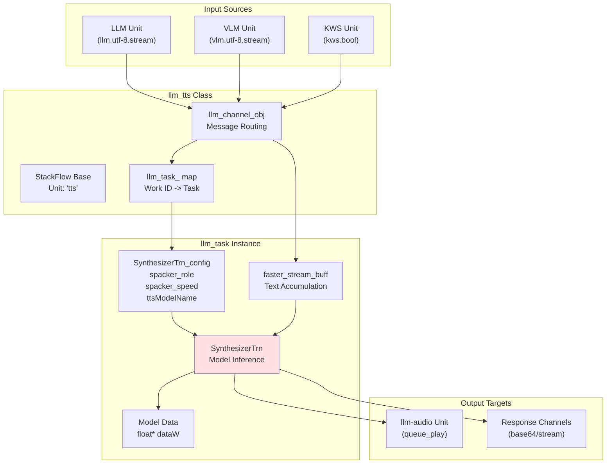
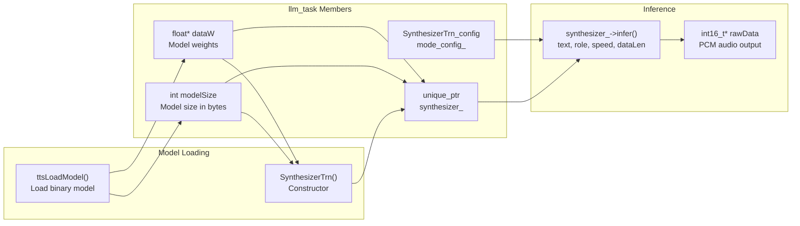
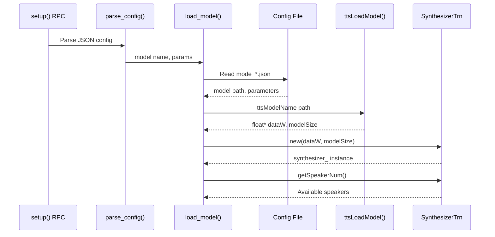
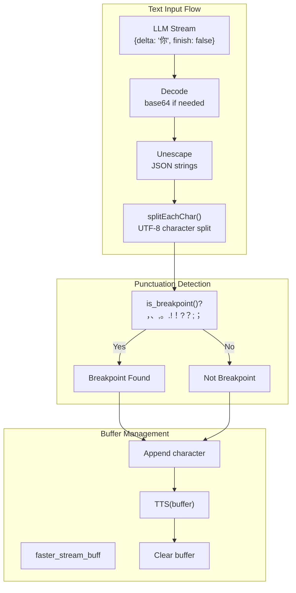
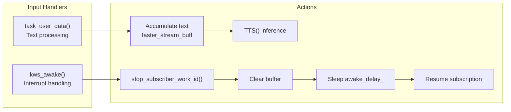
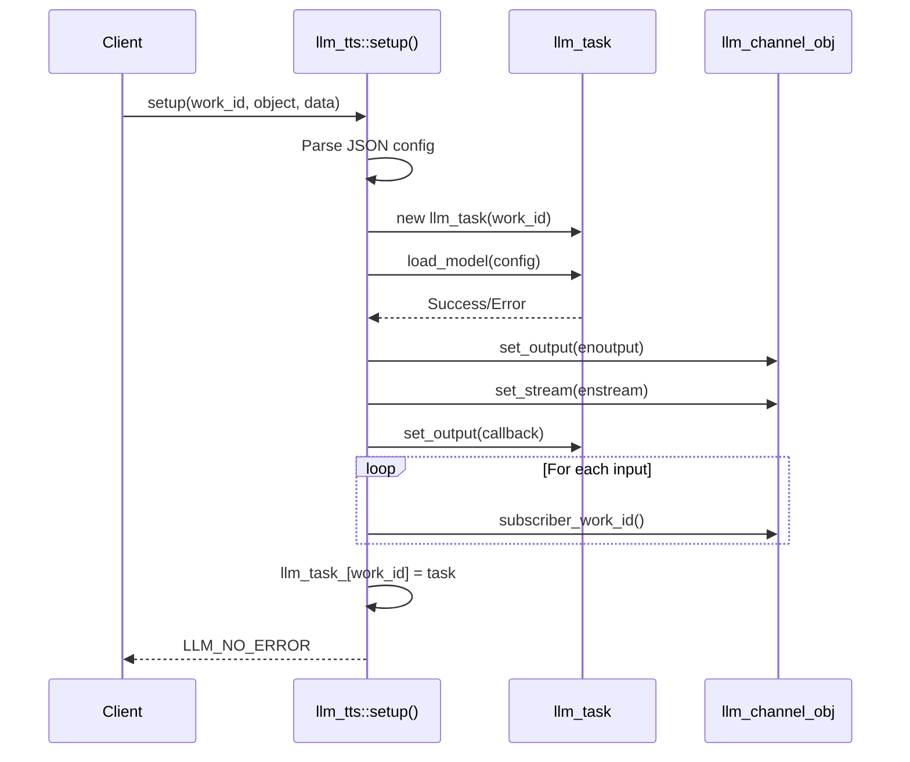
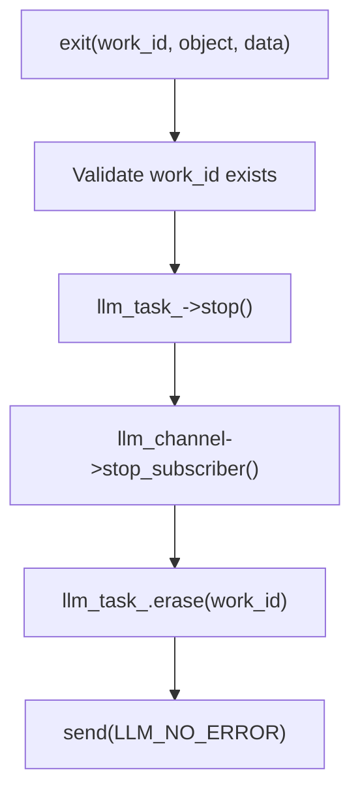
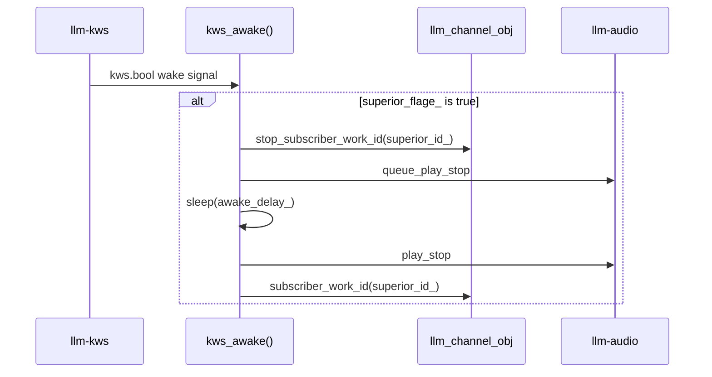

StackFlow Traditional TTS (llm-tts)

# Traditional TTS (llm-tts)

<details>
<summary>Relevant source files</summary>

The following files were used as context for generating this wiki page:

- [projects/llm_framework/main/src/main.cpp](projects/llm_framework/main/src/main.cpp)
- [projects/llm_framework/main_melotts/src/main.cpp](projects/llm_framework/main_melotts/src/main.cpp)
- [projects/llm_framework/main_melotts/src/runner/Lexicon.hpp](projects/llm_framework/main_melotts/src/runner/Lexicon.hpp)
- [projects/llm_framework/main_tts/src/main.cpp](projects/llm_framework/main_tts/src/main.cpp)

</details>


## Purpose and Scope

The **llm-tts** unit implements a CPU-based text-to-speech synthesis system using single-speaker models. This is a lightweight alternative to the NPU-accelerated MeloTTS and neural CosyVoice implementations. For NPU-accelerated multi-speaker synthesis with advanced features, see [MeloTTS](#3.5.1). For LLM-based neural TTS, see [CosyVoice](#3.5.3).

The llm-tts unit provides:
- CPU-only inference suitable for resource-constrained scenarios
- Single-speaker model support
- Direct text-to-audio synthesis without phoneme conversion
- Simplified configuration and faster setup compared to MeloTTS
- Integration with the voice assistant pipeline for speech output

Sources: [projects/llm_framework/main_tts/src/main.cpp:1-542]()

## Architecture Overview

The llm-tts unit follows a simplified synthesis architecture compared to MeloTTS. It operates as a single-stage inference system without separate encoder/decoder components or lexicon-based phoneme conversion.



**Diagram: llm-tts Unit Architecture**

The architecture consists of three main layers:
1. **Input Layer**: Receives text streams from LLM/VLM units and wake signals from KWS
2. **Processing Layer**: `llm_task` instances manage model inference via `SynthesizerTrn`
3. **Output Layer**: Sends synthesized audio to `llm-audio` and/or response channels

Sources: [projects/llm_framework/main_tts/src/main.cpp:186-529]()

## Core Components

### SynthesizerTrn Class

The `SynthesizerTrn` class is the core inference engine for traditional TTS. It is instantiated per task and manages the loaded model data.



**Diagram: SynthesizerTrn Component Structure**

The `SynthesizerTrn` class interface:
- **Constructor**: `SynthesizerTrn(float* dataW, int modelSize)` - Initializes with loaded model data
- **Inference**: `infer(string text, int role, float speed, int& dataLen)` - Returns PCM audio
- **Speaker Info**: `getSpeakerNum()` - Returns available speaker count

Sources: [projects/llm_framework/main_tts/src/main.cpp:45-182]()

### llm_task Class

The `llm_task` class encapsulates a single TTS task instance:

| Member | Type | Purpose |
|--------|------|---------|
| `synthesizer_` | `unique_ptr<SynthesizerTrn>` | TTS inference engine |
| `mode_config_` | `SynthesizerTrn_config` | Model configuration parameters |
| `model_` | `string` | Model name identifier |
| `inputs_` | `vector<string>` | Input source work IDs |
| `response_format_` | `string` | Output format specification |
| `enoutput_` | `bool` | Enable output flag |
| `enstream_` | `bool` | Enable streaming output |
| `superior_flage_` | `atomic_bool` | Has superior LLM/VLM source |
| `superior_id_` | `string` | Superior source work ID |
| `awake_delay_` | `int` | KWS wake delay in ms |

Sources: [projects/llm_framework/main_tts/src/main.cpp:45-182]()

### Model Loading Pipeline



**Diagram: Model Loading Sequence**

The loading process:
1. **Configuration Parsing**: Extract model name and parameters from setup JSON
2. **Config File Resolution**: Load `mode_*.json` from model directory
3. **Model Binary Loading**: Call `ttsLoadModel()` to load model weights
4. **Synthesizer Initialization**: Construct `SynthesizerTrn` with model data
5. **Validation**: Verify speaker count and model readiness

Sources: [projects/llm_framework/main_tts/src/main.cpp:92-143]()

## Configuration

### JSON Configuration Structure

```json
{
  "model": "single-speaker-fast",
  "response_format": "tts.pcm.sys",
  "enoutput": true,
  "input": ["llm.utf-8.stream"],
  "awake_delay": 1000
}
```

### Configuration Parameters

| Parameter | Type | Description | Default |
|-----------|------|-------------|---------|
| `model` | string | Model name (e.g., "single-speaker-fast") | Required |
| `response_format` | string | Output format (e.g., "tts.pcm.sys") | Required |
| `enoutput` | bool | Enable output publishing | Required |
| `input` | string/array | Input source(s) to subscribe to | Required |
| `awake_delay` | int | KWS wake interrupt delay (ms) | 1000 |

### Model Configuration File

Model-specific parameters are loaded from `mode_<model>.json`:

```json
{
  "mode_param": {
    "ttsModelName": "model.bin",
    "spacker_role": 0,
    "spacker_speed": 1.0,
    "awake_delay": 1000
  }
}
```

| Parameter | Type | Description |
|-----------|------|-------------|
| `ttsModelName` | string | Model binary filename |
| `spacker_role` | int | Speaker ID (for multi-speaker models) |
| `spacker_speed` | float | Speech speed multiplier |
| `awake_delay` | int | Wake interrupt delay override |

Sources: [projects/llm_framework/main_tts/src/main.cpp:31-143]()

## Text Processing and Inference

### Streaming Text Accumulation

The llm-tts unit accumulates incoming text and performs synthesis at sentence boundaries:



**Diagram: Text Streaming and Sentence Boundary Detection**

The breakpoint detection logic:
- **Chinese punctuation**: ，、。！？；
- **English punctuation**: , . ! ? ;
- **Action**: Synthesize accumulated buffer when breakpoint detected

Sources: [projects/llm_framework/main_tts/src/main.cpp:226-310]()

### TTS Inference Method

The `TTS()` method performs the actual synthesis:

```cpp
bool TTS(const std::string &msg)
{
    // Call synthesizer with config parameters
    int16_t *rawData = synthesizer_->infer(
        msg, 
        mode_config_.spacker_role, 
        mode_config_.spacker_speed, 
        dataLen
    );
    
    if (!rawData) return true; // Error
    
    // Package PCM data
    std::vector<int16_t> wavData(rawData, rawData + dataLen);
    
    // Send to output callback
    out_callback_(
        std::string((char *)rawData, dataLen * sizeof(int16_t)), 
        true
    );
    
    free(rawData);
    return false;
}
```

**Key aspects:**
- **Single-stage inference**: Direct text-to-audio conversion
- **Speaker role**: Applied from configuration
- **Speed control**: Applied from configuration
- **Output format**: 16-bit PCM audio
- **Memory management**: Caller frees returned buffer

Sources: [projects/llm_framework/main_tts/src/main.cpp:145-158]()

## Input and Output Handling

### Input Source Subscription

The llm-tts unit subscribes to three types of input sources:

| Input Pattern | Handler | Purpose |
|---------------|---------|---------|
| Contains "tts" | `task_user_data()` | Direct TTS commands |
| Contains "llm" or "vlm" | `task_user_data()` | LLM/VLM streaming text |
| Contains "kws" | `kws_awake()` | Wake word interruption |



**Diagram: Input Handler Flow**

Sources: [projects/llm_framework/main_tts/src/main.cpp:249-335](), [projects/llm_framework/main_tts/src/main.cpp:368-386]()

### Output Format Handling

The `task_output()` method handles two output modes:

**Streaming Output (`enstream_ = true`):**
```json
{
  "index": 0,
  "delta": "base64_encoded_pcm",
  "finish": false
}
```

**Non-streaming Output (`enstream_ = false`):**
```json
"base64_encoded_pcm"
```

**System Audio Output:**
If `response_format_` contains "sys", audio is sent to `llm-audio` unit:
```cpp
unit_call("audio", "queue_play", data);
```

Sources: [projects/llm_framework/main_tts/src/main.cpp:197-224]()

## RPC Interface Implementation

### Setup Function



**Diagram: Setup RPC Sequence**

The setup process:
1. Validate task count limit (default: 1 task)
2. Parse JSON configuration body
3. Create `llm_task` instance
4. Load model via `load_model()`
5. Configure channel output and streaming
6. Subscribe to input sources
7. Store task in `llm_task_` map

Sources: [projects/llm_framework/main_tts/src/main.cpp:337-399]()

### Link/Unlink Functions

**Link**: Dynamically add input source
```cpp
void link(const std::string &work_id, const std::string &object, const std::string &data)
{
    auto llm_task_obj = llm_task_[work_id_num];
    auto llm_channel = get_channel(work_id);
    
    if (data.find("llm") != std::string::npos || 
        data.find("vlm") != std::string::npos) {
        llm_channel->subscriber_work_id(data, task_user_data_callback);
        llm_task_obj->superior_id_ = data;
        llm_task_obj->superior_flage_ = true;
    } else if (data.find("kws") != std::string::npos) {
        llm_channel->subscriber_work_id(data, kws_awake_callback);
    }
}
```

**Unlink**: Remove input source
```cpp
void unlink(const std::string &work_id, const std::string &object, const std::string &data)
{
    llm_channel->stop_subscriber_work_id(data);
    // Remove from inputs_ vector
    llm_task_obj->inputs_.erase(
        std::remove(inputs_.begin(), inputs_.end(), data), 
        inputs_.end()
    );
}
```

Sources: [projects/llm_framework/main_tts/src/main.cpp:401-467]()

### Exit Function



**Diagram: Exit Function Flow**

The exit process:
1. Validate task exists for work_id
2. Call `stop()` on task (currently no-op)
3. Stop all channel subscriptions
4. Remove task from `llm_task_` map
5. Send success response

Sources: [projects/llm_framework/main_tts/src/main.cpp:496-514]()

## KWS Interrupt Handling

The llm-tts unit supports interruption by keyword wake events:



**Diagram: KWS Interrupt Flow**

When a wake word is detected:
1. **Stop Current Subscription**: Pause receiving text from LLM/VLM
2. **Stop Audio Playback**: Clear audio queue and stop playback
3. **Delay**: Wait `awake_delay_` milliseconds (default 1000ms)
4. **Resume Subscription**: Re-enable text streaming

This allows new user input to interrupt ongoing TTS playback.

Sources: [projects/llm_framework/main_tts/src/main.cpp:312-335]()

## Comparison with MeloTTS

| Feature | llm-tts (Traditional) | llm-melotts (NPU) |
|---------|----------------------|-------------------|
| **Hardware** | CPU only | NPU + CPU |
| **Model Architecture** | Single-stage inference | Encoder (ONNX) + Decoder (NPU) |
| **Lexicon** | Not required | Required for phoneme conversion |
| **Processing Pipeline** | Text → Audio | Text → Phonemes → Tones → Encoder → Decoder → Audio |
| **Inference Class** | `SynthesizerTrn` | `OnnxWrapper` + `EngineWrapper` |
| **Model Size** | Smaller (~60-77 MB) | Larger (~83-102 MB) |
| **Configuration** | Simple (3 params) | Complex (12+ params) |
| **Multi-speaker** | Limited | Full support |
| **Quality** | Good | Better |
| **Latency** | Low | Very low (streaming) |
| **Resource Usage** | Low | Moderate |
| **Dependencies** | Model binary only | Model + lexicon + tokens + gbin |

### Code Structure Comparison

**llm-tts inference:**
```cpp
int16_t *rawData = synthesizer_->infer(text, role, speed, dataLen);
```

**llm-melotts inference (simplified):**
```cpp
// 1. Lexicon conversion
lexicon_->convert(text, phones, tones);

// 2. ONNX encoder
auto encoder_output = encoder_->Run(phones, tones, langids, ...);

// 3. NPU decoder (multiple slices)
for (int i = 0; i < slices; i++) {
    decoder_->SetInput(zp_slice, 0);
    decoder_->Run();
    decoder_->GetOutput(audio_slice, 0);
    // Blend and accumulate audio
}
```

Sources: [projects/llm_framework/main_tts/src/main.cpp:145-158](), [projects/llm_framework/main_melotts/src/main.cpp:256-460]()

## Use Cases

The traditional TTS unit is ideal for:

1. **Resource-Constrained Scenarios**: When NPU is unavailable or reserved for other tasks
2. **Single-Speaker Applications**: Voice assistants with consistent voice
3. **Quick Prototyping**: Simpler setup without lexicon files
4. **Embedded Deployments**: Lower memory footprint
5. **Backup TTS**: Fallback when NPU TTS fails or is unavailable

Integration example:
```json
{
  "units": [
    {"name": "tts", "model": "single-speaker-fast", "input": ["llm.utf-8.stream"]},
    {"name": "llm", "model": "qwen2.5-0.5b", "output": "llm.utf-8.stream"}
  ]
}
```

Sources: [projects/llm_framework/main_tts/src/main.cpp:1-542]()