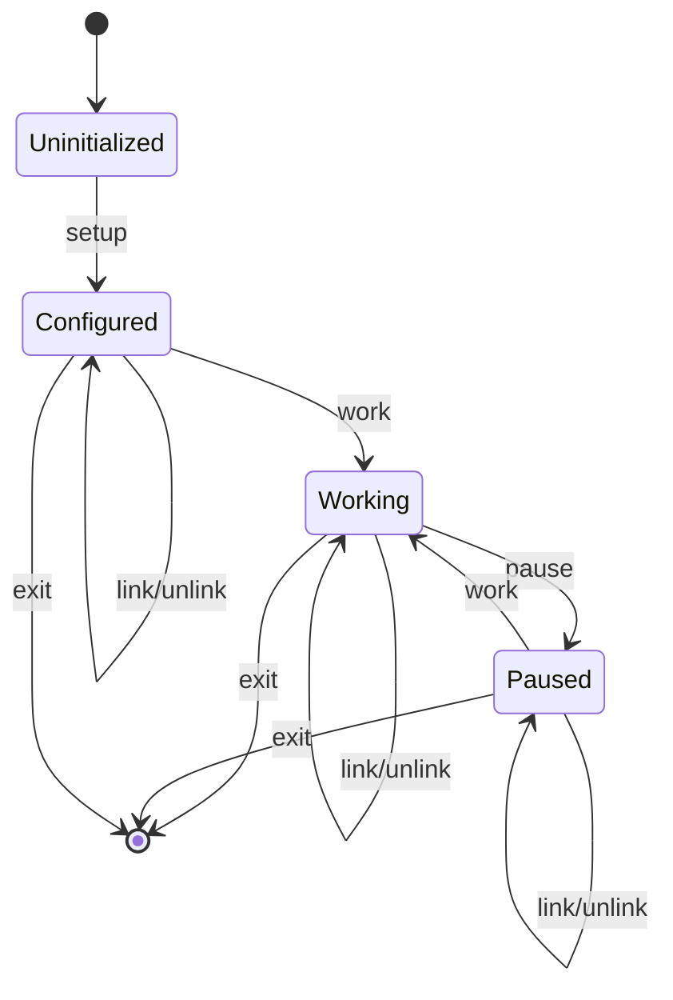
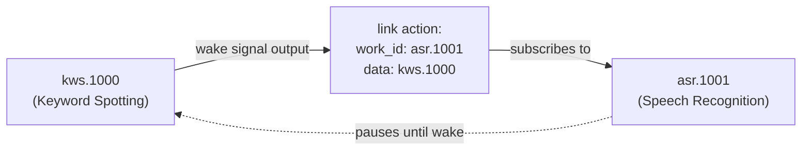
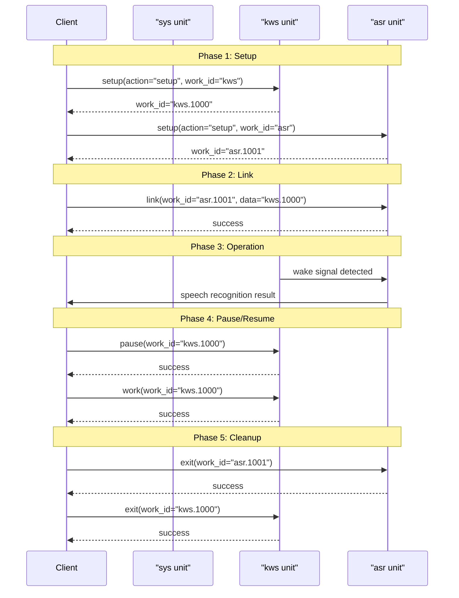
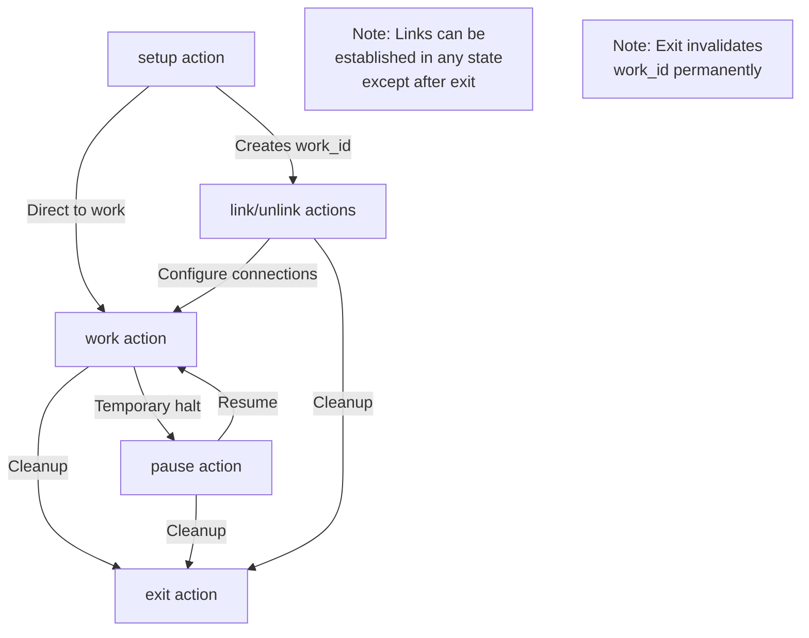

StackFlow Unit Management API

# Unit Lifecycle Management

<details>
<summary>Relevant source files</summary>

The following files were used as context for generating this wiki page:

- [ext_components/StackFlow/stackflow/pzmq.hpp](ext_components/StackFlow/stackflow/pzmq.hpp)
- [ext_components/ax_msp/Kconfig](ext_components/ax_msp/Kconfig)
- [projects/llm_framework/SConstruct](projects/llm_framework/SConstruct)
- [projects/llm_framework/config_defaults.mk](projects/llm_framework/config_defaults.mk)
- [projects/llm_framework/main_sys/include/zmq_bus.h](projects/llm_framework/main_sys/include/zmq_bus.h)
- [projects/llm_framework/main_sys/src/event_loop.cpp](projects/llm_framework/main_sys/src/event_loop.cpp)
- [projects/llm_framework/main_sys/src/serial_com.cpp](projects/llm_framework/main_sys/src/serial_com.cpp)
- [projects/llm_framework/main_sys/src/tcp_com.cpp](projects/llm_framework/main_sys/src/tcp_com.cpp)
- [projects/llm_framework/main_sys/src/zmq_bus.cpp](projects/llm_framework/main_sys/src/zmq_bus.cpp)

</details>


This document explains the standard lifecycle actions that all StackFlow units support. These actions provide a consistent interface for controlling unit initialization, execution state, inter-unit communication, and termination. The seven standard RPC actions are: `setup`, `pause`, `work`, `exit`, `link`, `unlink`, and `taskinfo`.

For details on the JSON protocol format used to invoke these actions, see [JSON API Protocol](#6.1). For guidance on implementing these actions in custom units, see [Creating Custom Units](#6.3).

## Overview

All StackFlow units follow a standardized lifecycle model controlled through RPC actions. Each unit begins in an uninitialized state, transitions through configuration and execution phases, and can be dynamically linked to other units for data flow coordination. The lifecycle is managed via JSON-based RPC calls sent to the unit's `work_id`.

### Work ID Concept

Every unit instance is identified by a unique `work_id`. When a unit is first configured via the `setup` action, the system assigns it a `work_id` in the format `{unit_type}.{instance_number}`, such as `kws.1000` or `asr.1001`. This identifier is used for all subsequent lifecycle operations on that specific instance.

**Key characteristics:**
- The instance number increments based on initialization order
- Multiple instances of the same unit type can coexist with different `work_id` values
- The base unit name (e.g., `kws`, `asr`) is used only during initial setup
- Once created, all operations target the specific `work_id`

Sources: [doc/projects_llm_framework_doc/llm_asr_en.md:326-327](), [doc/projects_llm_framework_doc/llm_kws_en.md:222-223]()

## Standard Lifecycle Actions

The following table summarizes the seven standard RPC actions supported by all StackFlow units:

| Action | Purpose | When Used | Returns |
|--------|---------|-----------|---------|
| `setup` | Initialize unit with configuration parameters | First interaction with unit type | New `work_id` |
| `link` | Connect to upstream unit's output | After setup, to establish data flow | Success/error code |
| `unlink` | Disconnect from upstream unit | During reconfiguration or cleanup | Success/error code |
| `pause` | Suspend unit processing | To temporarily halt without destroying state | Success/error code |
| `work` | Resume unit processing | After pause, to continue execution | Success/error code |
| `exit` | Terminate unit and release resources | Final cleanup, removes `work_id` | Success/error code |
| `taskinfo` | Query unit status and configuration | Debugging, monitoring, inspection | Task list or config data |

Sources: [doc/projects_llm_framework_doc/llm_asr_en.md:1-327](), [doc/projects_llm_framework_doc/llm_kws_en.md:1-223]()

## State Transition Diagram



**State descriptions:**
- **Uninitialized**: Unit service exists but no instances created
- **Configured**: Instance created with `work_id`, not yet processing
- **Working**: Actively processing input and producing output
- **Paused**: Instance exists but processing suspended
- **Terminated**: Resources released, `work_id` no longer valid

Sources: [doc/projects_llm_framework_doc/llm_asr_en.md:6-257](), [doc/projects_llm_framework_doc/llm_kws_en.md:6-153]()

## Action: setup

The `setup` action creates and configures a new unit instance. It is the first action performed on any unit and returns a unique `work_id` for subsequent operations.

### Request Format

```json
{
  "request_id": "{unique_request_identifier}",
  "work_id": "{unit_type}",
  "action": "setup",
  "object": "{unit_type}.setup",
  "data": {
    // Unit-specific configuration parameters
  }
}
```

### Common Configuration Parameters

| Parameter | Type | Purpose | Example |
|-----------|------|---------|---------|
| `model` | string | Model name to load | `"sherpa-ncnn-streaming-zipformer-20M-2023-02-17"` |
| `response_format` | string | Output data format | `"asr.utf-8.stream"` |
| `input` | string or array | Input source(s) | `"sys.pcm"` or `["sys.pcm", "kws.1000"]` |
| `enoutput` | boolean | Enable external output | `true` or `false` |

### Setup Examples from Different Units

#### llm-kws Setup

```json
{
  "request_id": "2",
  "work_id": "kws",
  "action": "setup",
  "object": "kws.setup",
  "data": {
    "model": "sherpa-onnx-kws-zipformer-gigaspeech-3.3M-2024-01-01",
    "response_format": "kws.bool",
    "input": "sys.pcm",
    "enoutput": true,
    "kws": "HELLO",
    "enwake_audio": true
  }
}
```

Response:
```json
{
  "created": 1731488402,
  "data": "None",
  "error": {"code": 0, "message": ""},
  "object": "None",
  "request_id": "2",
  "work_id": "kws.1000"
}
```

Sources: [doc/projects_llm_framework_doc/llm_kws_en.md:6-58]()

#### llm-asr Setup

```json
{
  "request_id": "2",
  "work_id": "asr",
  "action": "setup",
  "object": "asr.setup",
  "data": {
    "model": "sherpa-ncnn-streaming-zipformer-20M-2023-02-17",
    "response_format": "asr.utf-8.stream",
    "input": "sys.pcm",
    "enoutput": true,
    "endpoint_config.rule1.min_trailing_silence": 2.4,
    "endpoint_config.rule2.min_trailing_silence": 1.2,
    "endpoint_config.rule3.min_trailing_silence": 30.1
  }
}
```

Response:
```json
{
  "created": 1731488402,
  "data": "None",
  "error": {"code": 0, "message": ""},
  "object": "None",
  "request_id": "2",
  "work_id": "asr.1001"
}
```

Sources: [doc/projects_llm_framework_doc/llm_asr_en.md:6-63]()

#### llm-camera Setup

```json
{
  "request_id": "2",
  "work_id": "camera",
  "action": "setup",
  "object": "camera.setup",
  "data": {
    "response_format": "image.yuyv422.base64",
    "input": "/dev/video0",
    "enoutput": false,
    "frame_width": 320,
    "frame_height": 320,
    "enable_webstream": false,
    "rtsp": "rtsp.1280x720.h265"
  }
}
```

Response:
```json
{
  "created": 1731488402,
  "data": "None",
  "error": {"code": 0, "message": ""},
  "object": "None",
  "request_id": "2",
  "work_id": "camera.1003"
}
```

Sources: [doc/projects_llm_framework_doc/llm_camera_en.md:5-59]()

### Setup with Integrated Linking

The `input` parameter in `setup` can accept an array of sources, allowing units to be linked during initialization rather than requiring a separate `link` action:

```json
{
  "request_id": "2",
  "work_id": "asr",
  "action": "setup",
  "object": "asr.setup",
  "data": {
    "model": "sherpa-ncnn-streaming-zipformer-20M-2023-02-17",
    "response_format": "asr.utf-8.stream",
    "input": ["sys.pcm", "kws.1000"],
    "enoutput": true
  }
}
```

This configures the ASR unit to receive both system audio (`sys.pcm`) and wake signals from `kws.1000`.

Sources: [doc/projects_llm_framework_doc/llm_asr_en.md:103-127]()

## Action: link

The `link` action establishes a data flow connection from an upstream unit to the current unit. This enables units to subscribe to another unit's output channel.

### Request Format

```json
{
  "request_id": "{unique_request_identifier}",
  "work_id": "{target_work_id}",
  "action": "link",
  "object": "work_id",
  "data": "{upstream_work_id}"
}
```

### Link Flow Diagram



### Example: Linking ASR to KWS

Request:
```json
{
  "request_id": "3",
  "work_id": "asr.1001",
  "action": "link",
  "object": "work_id",
  "data": "kws.1000"
}
```

Response:
```json
{
  "created": 1731488402,
  "data": "None",
  "error": {"code": 0, "message": ""},
  "object": "None",
  "request_id": "3",
  "work_id": "asr.1001"
}
```

**Effect**: The ASR unit (`asr.1001`) now receives wake signals from the KWS unit (`kws.1000`). When KWS detects a wake word, it triggers ASR to start speech recognition.

**Important notes:**
- The upstream unit (`kws.1000`) must be configured and operational before linking
- The error code `0` indicates successful execution
- Multiple upstream sources can be linked to a single unit

Sources: [doc/projects_llm_framework_doc/llm_asr_en.md:64-101]()

## Action: unlink

The `unlink` action removes a data flow connection from an upstream unit.

### Request Format

```json
{
  "request_id": "{unique_request_identifier}",
  "work_id": "{target_work_id}",
  "action": "unlink",
  "object": "work_id",
  "data": "{upstream_work_id}"
}
```

### Example: Unlinking ASR from KWS

Request:
```json
{
  "request_id": "4",
  "work_id": "asr.1001",
  "action": "unlink",
  "object": "work_id",
  "data": "kws.1000"
}
```

Response:
```json
{
  "created": 1731488402,
  "data": "None",
  "error": {"code": 0, "message": ""},
  "object": "None",
  "request_id": "4",
  "work_id": "asr.1001"
}
```

**Effect**: ASR no longer receives wake signals from KWS. The ASR unit continues to exist but will not be triggered by the wake word.

Sources: [doc/projects_llm_framework_doc/llm_asr_en.md:129-162]()

## Action: pause

The `pause` action suspends unit processing without destroying the instance or releasing resources. The unit retains its configuration and state.

### Request Format

```json
{
  "request_id": "{unique_request_identifier}",
  "work_id": "{target_work_id}",
  "action": "pause"
}
```

### Example: Pausing KWS

Request:
```json
{
  "request_id": "3",
  "work_id": "kws.1000",
  "action": "pause"
}
```

Response:
```json
{
  "created": 1731488402,
  "data": "None",
  "error": {"code": 0, "message": ""},
  "object": "None",
  "request_id": "3",
  "work_id": "kws.1000"
}
```

**Effect**: KWS stops monitoring for wake words but remains configured and ready to resume.

### Example: Pausing ASR

Request:
```json
{
  "request_id": "5",
  "work_id": "asr.1001",
  "action": "pause"
}
```

Response:
```json
{
  "created": 1731488402,
  "data": "None",
  "error": {"code": 0, "message": ""},
  "object": "None",
  "request_id": "5",
  "work_id": "asr.1001"
}
```

**Use cases:**
- Temporarily disable processing while preserving state
- Prevent resource consumption during idle periods
- Coordinate multi-unit workflows (pause downstream units)

Sources: [doc/projects_llm_framework_doc/llm_kws_en.md:59-90](), [doc/projects_llm_framework_doc/llm_asr_en.md:163-194]()

## Action: work

The `work` action resumes unit processing after a `pause`. It transitions the unit from the paused state back to the working state.

### Request Format

```json
{
  "request_id": "{unique_request_identifier}",
  "work_id": "{target_work_id}",
  "action": "work"
}
```

### Example: Resuming KWS

Request:
```json
{
  "request_id": "4",
  "work_id": "kws.1000",
  "action": "work"
}
```

Response:
```json
{
  "created": 1731488402,
  "data": "None",
  "error": {"code": 0, "message": ""},
  "object": "None",
  "request_id": "4",
  "work_id": "kws.1000"
}
```

**Effect**: KWS resumes monitoring for wake words.

### Example: Resuming ASR

Request:
```json
{
  "request_id": "6",
  "work_id": "asr.1001",
  "action": "work"
}
```

Response:
```json
{
  "created": 1731488402,
  "data": "None",
  "error": {"code": 0, "message": ""},
  "object": "None",
  "request_id": "6",
  "work_id": "asr.1001"
}
```

Sources: [doc/projects_llm_framework_doc/llm_kws_en.md:91-122](), [doc/projects_llm_framework_doc/llm_asr_en.md:195-226]()

## Action: exit

The `exit` action terminates a unit instance, releasing all associated resources. The `work_id` becomes invalid after successful exit.

### Request Format

```json
{
  "request_id": "{unique_request_identifier}",
  "work_id": "{target_work_id}",
  "action": "exit"
}
```

### Example: Exiting KWS

Request:
```json
{
  "request_id": "5",
  "work_id": "kws.1000",
  "action": "exit"
}
```

Response:
```json
{
  "created": 1731488402,
  "data": "None",
  "error": {"code": 0, "message": ""},
  "object": "None",
  "request_id": "5",
  "work_id": "kws.1000"
}
```

### Example: Exiting Camera

Request:
```json
{
  "request_id": "7",
  "work_id": "camera.1003",
  "action": "exit"
}
```

Response:
```json
{
  "created": 1731488402,
  "data": "None",
  "error": {"code": 0, "message": ""},
  "object": "None",
  "request_id": "7",
  "work_id": "camera.1003"
}
```

**Important notes:**
- After exit, the `work_id` can no longer be used for any operations
- Downstream units linked to this unit will no longer receive data
- A new `setup` action is required to create a fresh instance

Sources: [doc/projects_llm_framework_doc/llm_kws_en.md:123-154](), [doc/projects_llm_framework_doc/llm_camera_en.md:60-91](), [doc/projects_llm_framework_doc/llm_asr_en.md:227-258]()

## Action: taskinfo

The `taskinfo` action queries unit status and configuration. It operates in two modes depending on the `work_id` used:

1. **Unit-level query**: Using base unit name (e.g., `kws`) returns list of active instances
2. **Instance-level query**: Using specific `work_id` (e.g., `kws.1000`) returns configuration

### Unit-Level Query: List Active Instances

Request:
```json
{
  "request_id": "2",
  "work_id": "asr",
  "action": "taskinfo"
}
```

Response:
```json
{
  "created": 1731580350,
  "data": ["asr.1001"],
  "error": {"code": 0, "message": ""},
  "object": "asr.tasklist",
  "request_id": "2",
  "work_id": "asr"
}
```

### Instance-Level Query: Retrieve Configuration

Request:
```json
{
  "request_id": "2",
  "work_id": "kws.1000",
  "action": "taskinfo"
}
```

Response:
```json
{
  "created": 1731652086,
  "data": {
    "enoutput": true,
    "inputs_": ["sys.pcm"],
    "model": "sherpa-onnx-kws-zipformer-gigaspeech-3.3M-2024-01-01",
    "response_format": "kws.bool"
  },
  "error": {"code": 0, "message": ""},
  "object": "kws.taskinfo",
  "request_id": "2",
  "work_id": "kws.1000"
}
```

### Camera Taskinfo Example

Request:
```json
{
  "request_id": "2",
  "work_id": "camera.1003",
  "action": "taskinfo"
}
```

Response:
```json
{
  "created": 1731652344,
  "data": {
    "enoutput": false,
    "response_format": "image.yuyv422.base64",
    "input": "/dev/video0",
    "frame_width": 320,
    "frame_height": 320
  },
  "error": {"code": 0, "message": ""},
  "object": "camera.taskinfo",
  "request_id": "2",
  "work_id": "camera.1003"
}
```

**Use cases:**
- Debugging: Verify unit configuration
- Monitoring: Check active instances
- State inspection: Confirm input sources and parameters

Sources: [doc/projects_llm_framework_doc/llm_asr_en.md:259-327](), [doc/projects_llm_framework_doc/llm_kws_en.md:155-223](), [doc/projects_llm_framework_doc/llm_camera_en.md:92-159]()

## Complete Lifecycle Example: Voice Assistant Pipeline

This diagram illustrates a typical lifecycle sequence for setting up a voice assistant pipeline with KWS and ASR units.



Sources: [doc/projects_llm_framework_doc/llm_asr_en.md:64-101](), [doc/projects_llm_framework_doc/llm_kws_en.md:6-58]()

## Error Handling

All lifecycle actions return a JSON response with an `error` object containing:
- `code`: Numeric error code (0 indicates success)
- `message`: Human-readable error description

### Standard Error Response Format

```json
{
  "created": 1731488402,
  "data": "None",
  "error": {
    "code": 0,
    "message": ""
  },
  "object": "None",
  "request_id": "7",
  "work_id": "asr.1001"
}
```

**Checking for errors:**
- An `error.code` of `0` indicates successful execution
- Non-zero codes indicate failures (specific codes are unit-dependent)
- The `error.message` field provides details when available

Sources: [doc/projects_llm_framework_doc/llm_asr_en.md:47-59](), [doc/projects_llm_framework_doc/llm_kws_en.md:42-54]()

## Best Practices

### Lifecycle Management Guidelines

1. **Always verify setup success**: Check the returned `work_id` before proceeding with further operations
2. **Link dependencies in order**: Ensure upstream units are configured before linking downstream units
3. **Use pause instead of exit for temporary halts**: Preserve state when processing will resume
4. **Query taskinfo for debugging**: Use instance-level taskinfo to verify configuration
5. **Handle link dependencies during exit**: Exit downstream units before upstream units to avoid broken connections

### Work ID Management

| Scenario | Best Practice |
|----------|---------------|
| Multiple instances | Track `work_id` values in application state |
| Unit reconfiguration | Exit old instance, setup new one with fresh `work_id` |
| Pipeline coordination | Use taskinfo to verify all units are active before starting |
| Resource cleanup | Exit units in reverse dependency order |

### State Transition Considerations



Sources: [doc/projects_llm_framework_doc/llm_asr_en.md:64-101](), [doc/projects_llm_framework_doc/llm_kws_en.md:1-223]()