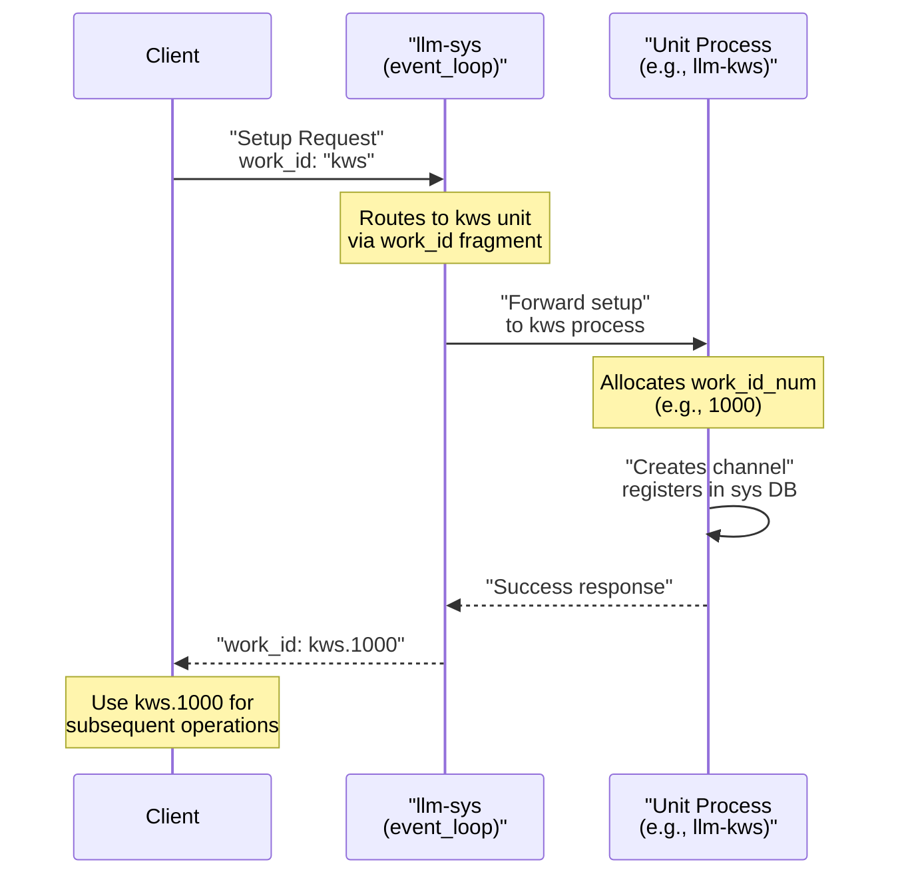
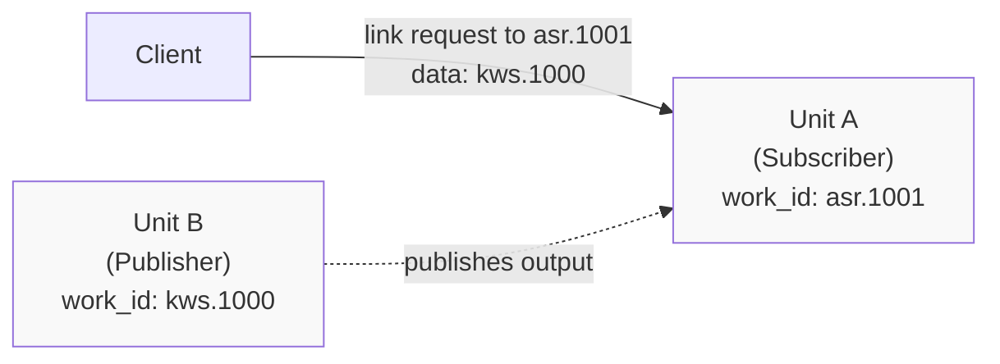
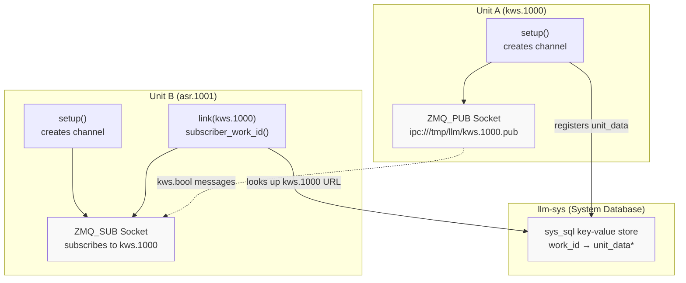
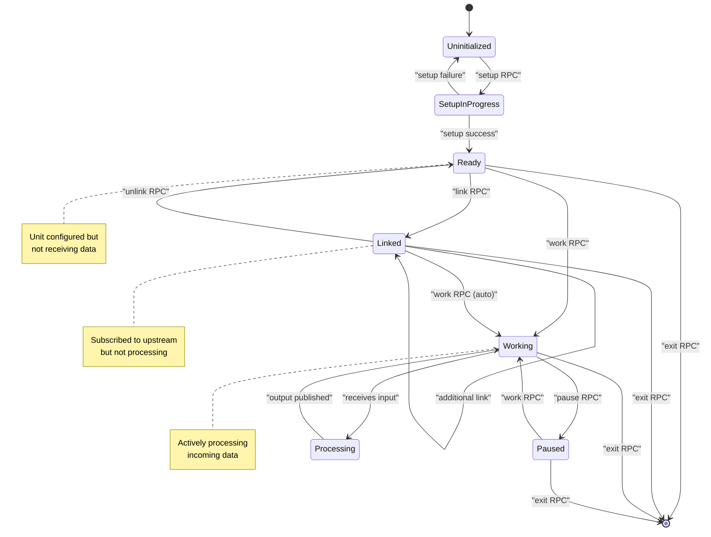
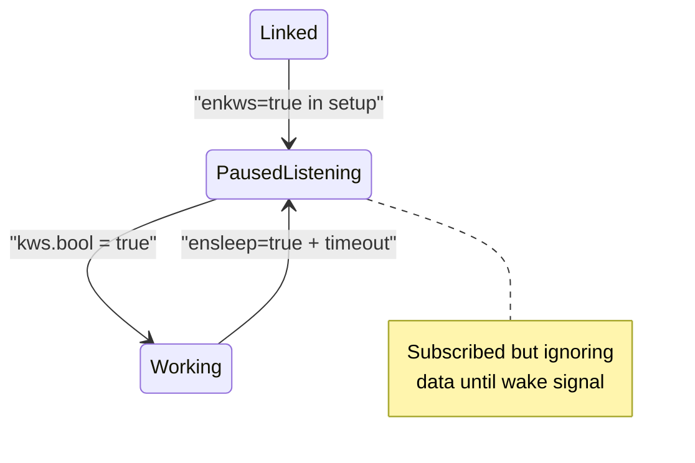
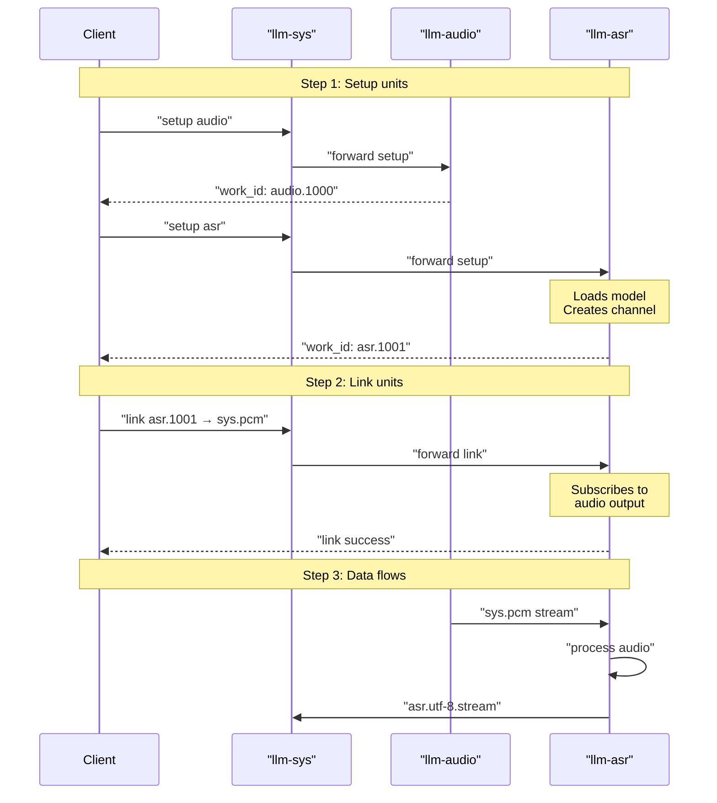
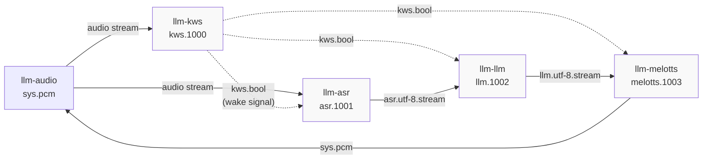
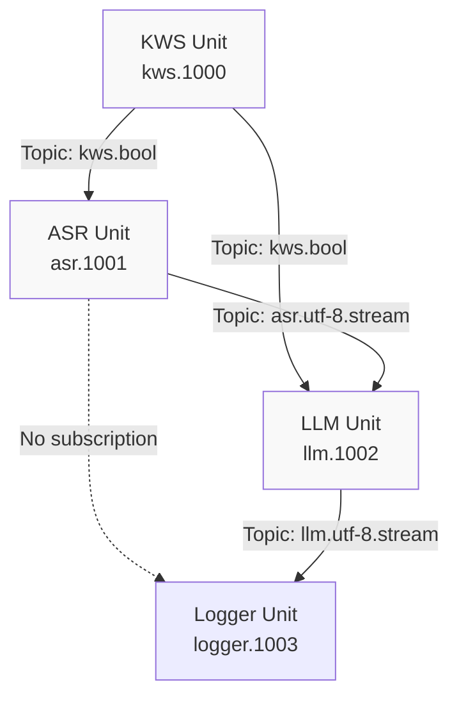
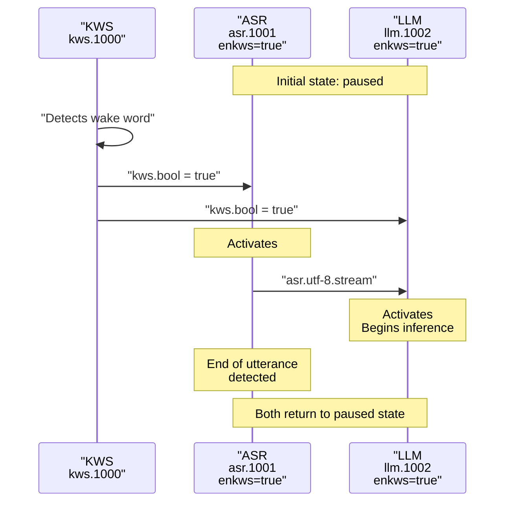
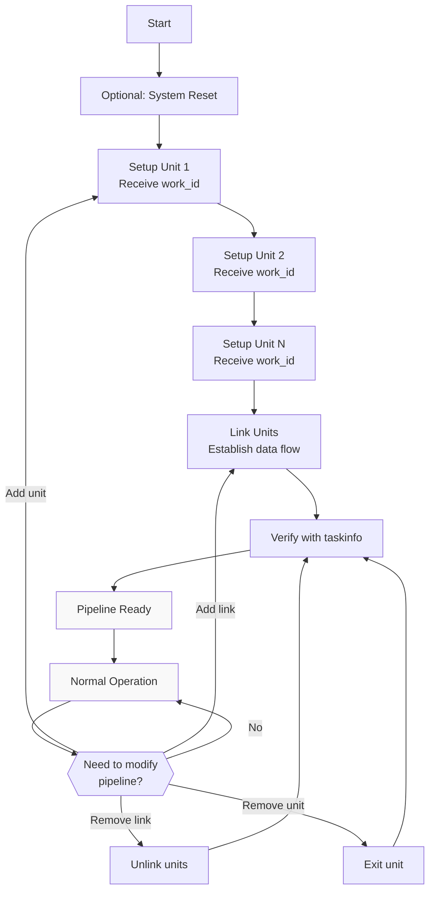

StackFlow Unit Setup and Linking

# Unit Setup and Linking

<details>
<summary>Relevant source files</summary>

The following files were used as context for generating this wiki page:

- [README.md](README.md)
- [README_zh.md](README_zh.md)
- [doc/component_doc/StackFlow_en.md](doc/component_doc/StackFlow_en.md)
- [doc/component_doc/StackFlow_zh.md](doc/component_doc/StackFlow_zh.md)
- [projects/llm_framework/README.md](projects/llm_framework/README.md)
- [projects/llm_framework/main_sys/include/zmq_bus.h](projects/llm_framework/main_sys/include/zmq_bus.h)
- [projects/llm_framework/main_sys/src/event_loop.cpp](projects/llm_framework/main_sys/src/event_loop.cpp)
- [projects/llm_framework/main_sys/src/serial_com.cpp](projects/llm_framework/main_sys/src/serial_com.cpp)
- [projects/llm_framework/main_sys/src/tcp_com.cpp](projects/llm_framework/main_sys/src/tcp_com.cpp)
- [projects/llm_framework/main_sys/src/zmq_bus.cpp](projects/llm_framework/main_sys/src/zmq_bus.cpp)

</details>


This page provides a practical guide to initializing units and connecting them into processing pipelines. It covers the mechanics of the `setup` RPC action, the `link` RPC action, work ID management, and unit lifecycle states. For complete working examples of multi-unit pipelines, see [Voice Assistant Pipeline Example](#8.3) and [Multimodal Vision Pipeline Example](#8.4). For information about JSON configuration file structure and model parameters, see [JSON Configuration Files](#8.1).

---

## Unit Setup Process

### Setup Request Structure

Every unit in StackFlow must be initialized via the `setup` RPC action before it can process data. The setup request follows the standard JSON RPC protocol and includes configuration parameters specific to the unit type.

**Basic Setup Request Format:**
```json
{
    "request_id": "unique_request_identifier",
    "work_id": "unit_name",
    "action": "setup",
    "object": "unit_name.setup",
    "data": {
        "model": "model_name",
        "response_format": "output_format",
        "input": "input_source",
        "enoutput": true/false,
        ...additional_parameters...
    }
}
```

**Key Fields:**

| Field | Required | Description |
|-------|----------|-------------|
| `request_id` | Yes | Unique identifier for tracking the request/response |
| `work_id` | Yes | Unit type (e.g., "kws", "asr", "llm", "melotts") |
| `action` | Yes | Must be "setup" for initialization |
| `object` | Yes | Format: "{unit_name}.setup" |
| `data.model` | Yes | Model name from configuration files (e.g., "qwen2.5-0.5B-prefill-20e") |
| `data.response_format` | Yes | Output format (e.g., "llm.utf-8.stream", "asr.utf-8.stream") |
| `data.input` | Yes | Input source specification (e.g., "sys.pcm", "camera.raw", "work_id") |
| `data.enoutput` | Yes | Enable/disable output publishing to ZMQ channels |

**Setup Response:**

Upon successful setup, the system returns a response containing the assigned `work_id`:

```json
{
    "created": 1731488371,
    "data": "None",
    "error": {"code": 0, "message": ""},
    "object": "None",
    "request_id": "1",
    "work_id": "kws.1000"
}
```

The returned `work_id` format is `{unit_name}.{numeric_id}` (e.g., `kws.1000`, `llm.1002`), where the numeric ID is automatically assigned by the system and uniquely identifies this unit instance.

Sources: [projects/llm_framework/README.md:46-107](), [projects/llm_framework/main_sys/src/event_loop.cpp:770-844]()

---

### Work ID Generation and Management



**Work ID Components:**

The work ID consists of two parts separated by a dot:
- **Unit name**: The base unit type (e.g., "kws", "asr", "llm")
- **Numeric ID**: A unique instance number (typically starting from 1000)

**Extracting Work ID Components** (from code utilities):

The `sample_get_work_id_num()` function extracts the numeric portion, and `sample_get_work_id_name()` extracts the unit name. These utilities are used throughout the codebase for work ID parsing.

Sources: [projects/llm_framework/main_sys/src/event_loop.cpp:804-814](), [doc/component_doc/StackFlow_en.md:410-413]()

---

### Common Setup Parameters by Unit Type

Different unit types accept different configuration parameters in the `data` field:

**Speech Units (KWS, ASR, Whisper):**
```json
{
    "model": "model_name",
    "response_format": "kws.bool" | "asr.utf-8.stream",
    "input": "sys.pcm",
    "enoutput": true,
    "enkws": true,              // ASR: enable wake word activation
    "kws": "你好你好",           // KWS: wake word text
    "rule1": 2.4,               // ASR: endpointing rules
    "rule2": 1.2,
    "rule3": 30.1
}
```

**Language Model Units (LLM, VLM):**
```json
{
    "model": "qwen2.5-0.5B-prefill-20e",
    "response_format": "llm.utf-8.stream",
    "input": "llm.utf-8" | ["asr.utf-8", "camera.raw"],
    "enoutput": true,
    "max_token_len": 256,
    "prompt": "System prompt text",
    "temperature": 0.7,         // Optional sampling parameter
    "top_p": 0.9               // Optional sampling parameter
}
```

**TTS Units (MeloTTS, TTS, CosyVoice):**
```json
{
    "model": "melotts-zh-cn",
    "response_format": "sys.pcm",
    "input": "tts.utf-8",
    "enoutput": false,          // Often false to avoid feedback loops
    "speed": 1.0               // Optional speech rate
}
```

**Vision Units (Camera, YOLO, Depth):**
```json
{
    "model": "yolo11n",
    "response_format": "yolo.yolobox" | "camera.raw",
    "input": "/dev/video0" | "camera.1000",
    "enoutput": true,
    "frame_width": 320,
    "frame_height": 320
}
```

Sources: [projects/llm_framework/README.md:50-106](), [README_zh.md:62-103]()

---

## Unit Linking

### Purpose of Linking

Linking establishes data flow connections between units by configuring one unit to subscribe to another unit's output channel. When Unit A is linked to Unit B, Unit A will receive messages published by Unit B on its output channel.

**Critical Concept**: The `link` action configures the **subscriber**, not the publisher. If you want Unit A to receive data from Unit B, you send the `link` request to Unit A with Unit B's work_id as the data.



Sources: [projects/llm_framework/README.md:116-157](), [doc/component_doc/StackFlow_en.md:155-156]()

---

### Link Request Format

**Standard Link Request:**
```json
{
    "request_id": "2",
    "work_id": "asr.1001",
    "action": "link",
    "object": "work_id",
    "data": "kws.1000"
}
```

**Link Response:**
```json
{
    "created": 1731488403,
    "data": "None",
    "error": {"code": 0, "message": ""},
    "object": "None",
    "request_id": "2",
    "work_id": "asr.1001"
}
```

**Multi-Input Linking:**

Some units (particularly VLM units) can accept multiple input sources. Link them sequentially:

```json
// Link VLM to camera
{
    "request_id": "5",
    "work_id": "vlm.1003",
    "action": "link",
    "object": "work_id",
    "data": "camera.1000"
}

// Link VLM to ASR for text input
{
    "request_id": "6",
    "work_id": "vlm.1003",
    "action": "link",
    "object": "work_id",
    "data": "asr.1001"
}
```

Sources: [projects/llm_framework/README.md:116-157]()

---

### Linking vs Input Specification

There are two ways to specify data sources for a unit:

**1. Input Field in Setup (Static Configuration):**
```json
{
    "work_id": "asr",
    "action": "setup",
    "data": {
        "input": "sys.pcm",  // Direct input source
        ...
    }
}
```

**2. Link Action (Dynamic Pipeline Construction):**
```json
// First setup
{"work_id": "llm", "action": "setup", "data": {...}}

// Then link to upstream unit
{
    "work_id": "llm.1002",
    "action": "link",
    "data": "asr.1001"
}
```

**Key Differences:**

| Aspect | Input Field | Link Action |
|--------|-------------|-------------|
| When specified | During setup | After setup |
| Typical use | System resources (sys.pcm, /dev/video0) | Unit-to-unit connections |
| Modification | Requires re-setup | Can unlink/relink dynamically |
| Multiple sources | Array in setup | Multiple link calls |

Sources: [doc/component_doc/StackFlow_en.md:170-175]()

---

### Communication Channel Architecture



**Channel Establishment Process:**

1. During `setup`, each unit creates a `llm_channel_obj` which initializes a ZMQ_PUB socket
2. The unit registers itself in the `llm-sys` key-value database with its work_id and channel URL
3. When `link` is called, the subscriber unit queries the database for the publisher's URL
4. The subscriber creates a ZMQ_SUB socket connected to the publisher's URL
5. The subscriber calls `subscriber_work_id()` to filter messages by topic

Sources: [projects/llm_framework/main_sys/src/zmq_bus.cpp:160-175](), [projects/llm_framework/main_sys/include/zmq_bus.h:23-38](), [doc/component_doc/StackFlow_en.md:169-175]()

---

## Unit Lifecycle State Machine



**State Descriptions:**

| State | Description | Typical Transitions |
|-------|-------------|---------------------|
| **Uninitialized** | Unit process running but no task configured | → SetupInProgress (setup) |
| **SetupInProgress** | Loading model and initializing resources | → Ready (success)<br/>→ Uninitialized (failure) |
| **Ready** | Model loaded, channel created, waiting for connections | → Linked (link)<br/>→ Working (work)<br/>→ Uninitialized (exit) |
| **Linked** | Subscribed to upstream unit(s) | → Working (auto or explicit work)<br/>→ Ready (unlink) |
| **Working** | Actively processing incoming data | → Paused (pause)<br/>→ Processing (data arrival) |
| **Paused** | Temporarily stopped, maintains subscriptions | → Working (work) |
| **Processing** | Currently executing inference/processing | → Working (completion) |

**Wake-Enabled Units:**

Some units (ASR, LLM, TTS) support wake-based activation via the `enkws` parameter. These units remain in a "paused-listening" state until a wake signal is received from the KWS unit:



Sources: [doc/component_doc/StackFlow_en.md:151-157](), [projects/llm_framework/README.md:46-107]()

---

## Step-by-Step Setup and Linking Procedures

### Procedure 1: Basic Two-Unit Pipeline

**Goal**: Connect ASR to receive audio from the audio unit.



**JSON Command Sequence:**

```json
// Step 1: Setup ASR unit
{
    "request_id": "1",
    "work_id": "asr",
    "action": "setup",
    "object": "asr.setup",
    "data": {
        "model": "sherpa-ncnn-streaming-zipformer-zh-14M-2023-02-23",
        "response_format": "asr.utf-8.stream",
        "input": "sys.pcm",
        "enoutput": true
    }
}

// Response: {"work_id": "asr.1001", ...}

// Step 2: Link is implicit via "input": "sys.pcm"
// Audio automatically flows from llm-audio to ASR
```

Sources: [projects/llm_framework/README.md:64-79]()

---

### Procedure 2: Multi-Unit Pipeline with Wake Word

**Goal**: Build a voice assistant pipeline: KWS → ASR → LLM → TTS



**Complete Command Sequence:**

```json
// 1. Setup KWS (wake word detector)
{
    "request_id": "1",
    "work_id": "kws",
    "action": "setup",
    "object": "kws.setup",
    "data": {
        "model": "sherpa-onnx-kws-zipformer-wenetspeech-3.3M-2024-01-01",
        "response_format": "kws.bool",
        "input": "sys.pcm",
        "enoutput": true,
        "kws": "你好你好"
    }
}
// Response: work_id = "kws.1000"

// 2. Setup ASR (speech recognition)
{
    "request_id": "2",
    "work_id": "asr",
    "action": "setup",
    "object": "asr.setup",
    "data": {
        "model": "sherpa-ncnn-streaming-zipformer-zh-14M-2023-02-23",
        "response_format": "asr.utf-8.stream",
        "input": "sys.pcm",
        "enoutput": true,
        "enkws": true,          // Enable wake word activation
        "rule1": 2.4,
        "rule2": 1.2,
        "rule3": 30.1
    }
}
// Response: work_id = "asr.1001"

// 3. Setup LLM (language model)
{
    "request_id": "3",
    "work_id": "llm",
    "action": "setup",
    "object": "llm.setup",
    "data": {
        "model": "qwen2.5-0.5B-prefill-20e",
        "response_format": "llm.utf-8.stream",
        "input": "llm.utf-8",
        "enoutput": true,
        "max_token_len": 256,
        "prompt": "You are a knowledgeable assistant."
    }
}
// Response: work_id = "llm.1002"

// 4. Setup TTS (speech synthesis)
{
    "request_id": "4",
    "work_id": "melotts",
    "action": "setup",
    "object": "melotts.setup",
    "data": {
        "model": "melotts-zh-cn",
        "response_format": "sys.pcm",
        "input": "tts.utf-8",
        "enoutput": false
    }
}
// Response: work_id = "melotts.1003"

// 5. Link ASR to KWS (for wake signals)
{
    "request_id": "5",
    "work_id": "asr.1001",
    "action": "link",
    "object": "work_id",
    "data": "kws.1000"
}

// 6. Link LLM to ASR (for text input)
{
    "request_id": "6",
    "work_id": "llm.1002",
    "action": "link",
    "object": "work_id",
    "data": "asr.1001"
}

// 7. Link LLM to KWS (for wake signals)
{
    "request_id": "7",
    "work_id": "llm.1002",
    "action": "link",
    "object": "work_id",
    "data": "kws.1000"
}

// 8. Link TTS to LLM (for text to synthesize)
{
    "request_id": "8",
    "work_id": "melotts.1003",
    "action": "link",
    "object": "work_id",
    "data": "llm.1002"
}

// 9. Link TTS to KWS (for wake signals)
{
    "request_id": "9",
    "work_id": "melotts.1003",
    "action": "link",
    "object": "work_id",
    "data": "kws.1000"
}
```

**Execution Flow After Setup:**

1. KWS continuously monitors audio for wake word
2. ASR, LLM, TTS are in paused state (due to `enkws=true`)
3. User says wake word "你好你好"
4. KWS publishes `kws.bool = true`
5. ASR activates and starts transcribing
6. ASR streams text to LLM
7. LLM generates response tokens
8. TTS synthesizes speech in real-time
9. After timeout, all units return to paused state

Sources: [projects/llm_framework/README.md:46-170]()

---

### Procedure 3: Vision + Language Pipeline

**Goal**: Connect camera, YOLO detector, and VLM for visual question answering.

```json
// 1. Setup camera
{
    "request_id": "1",
    "work_id": "camera",
    "action": "setup",
    "object": "camera.setup",
    "data": {
        "response_format": "camera.raw",
        "input": "/dev/video0",
        "enoutput": false,
        "frame_width": 320,
        "frame_height": 320
    }
}
// Response: work_id = "camera.1000"

// 2. Setup YOLO
{
    "request_id": "2",
    "work_id": "yolo",
    "action": "setup",
    "object": "yolo.setup",
    "data": {
        "model": "yolo11n",
        "response_format": "yolo.yolobox",
        "input": "camera.1000",
        "enoutput": true
    }
}
// Response: work_id = "yolo.1001"

// YOLO automatically subscribes to camera.1000
// No explicit link needed because input specifies work_id
```

**Input Field vs Link Action:**

Notice that in this example, YOLO's `input` field directly specifies `camera.1000`. This is an alternative to using the `link` action. The difference:

- `"input": "camera.1000"` during setup → automatic subscription
- `link` action after setup → explicit subscription

Both achieve the same result. The `input` field approach is more concise when the upstream work_id is known at setup time.

Sources: [projects/llm_framework/README.md:186-231]()

---

## Message Filtering and Selective Linking

### Topic-Based Subscription

The `llm_channel_obj` implements topic filtering using ZMQ's subscription mechanism. When a unit links to another, it can optionally filter messages by topic prefix.

**Filtering by Response Format:**

Units publish messages with their `response_format` as the topic. Subscribers can filter to receive only specific message types:



**Implementation Detail:**

When `subscriber_work_id()` is called in the unit code, it queries the upstream unit's `response_format` and uses it as a ZMQ subscription filter. This ensures efficient message delivery - units only receive messages they're interested in.

Sources: [doc/component_doc/StackFlow_en.md:170-175]()

---

### Conditional Linking (Wake Word Pattern)

Some units support conditional activation via wake signals. This pattern is commonly used in voice assistants:

**Wake-Enabled Unit Configuration:**

```json
{
    "work_id": "asr",
    "action": "setup",
    "data": {
        "enkws": true,           // Enable wake word mode
        "ensleep": true,         // Auto-sleep after processing
        ...
    }
}
```

**Behavior:**

- Unit subscribes to upstream data sources but ignores incoming data
- When `kws.bool = true` is received, unit activates
- Processes data normally until end-of-utterance or timeout
- Returns to paused state when `ensleep` condition is met

**Wake Signal Flow:**



Sources: [projects/llm_framework/README.md:64-79]()

---

## Unit Management Operations

### Querying Unit Status

Use the `taskinfo` RPC action to query unit configuration and status:

**Request:**
```json
{
    "request_id": "10",
    "work_id": "llm.1002",
    "action": "taskinfo",
    "object": "llm.taskinfo",
    "data": {}
}
```

**Response:**
```json
{
    "created": 1731488500,
    "data": {
        "model": "qwen2.5-0.5B-prefill-20e",
        "response_format": "llm.utf-8.stream",
        "enoutput": true,
        "inputs_": ["asr.1001", "kws.1000"],
        "max_token_len": 256
    },
    "error": {"code": 0, "message": ""},
    "object": "llm.taskinfo",
    "request_id": "10",
    "work_id": "llm.1002"
}
```

Sources: [doc/component_doc/StackFlow_en.md:157]()

---

### Unlinking Units

To disconnect a unit from its upstream source:

```json
{
    "request_id": "11",
    "work_id": "llm.1002",
    "action": "unlink",
    "object": "work_id",
    "data": "asr.1001"
}
```

The unit will stop receiving messages from the specified work_id. The upstream unit continues publishing; only the subscription is removed.

Sources: [doc/component_doc/StackFlow_en.md:156]()

---

### Pausing and Resuming Units

**Pause Unit:**
```json
{
    "request_id": "12",
    "work_id": "llm.1002",
    "action": "pause",
    "object": "llm.pause",
    "data": {}
}
```

**Resume Unit:**
```json
{
    "request_id": "13",
    "work_id": "llm.1002",
    "action": "work",
    "object": "llm.work",
    "data": {}
}
```

Sources: [doc/component_doc/StackFlow_en.md:152-154]()

---

### Terminating Units

To cleanly shut down a unit and free its resources:

```json
{
    "request_id": "14",
    "work_id": "llm.1002",
    "action": "exit",
    "object": "llm.exit",
    "data": {}
}
```

The unit will:
1. Unsubscribe from all upstream units
2. Close its ZMQ sockets
3. Unload its model
4. Deregister from the system database
5. Respond with confirmation before terminating

Sources: [doc/component_doc/StackFlow_en.md:154]()

---

## System-Level Operations

### System Reset

To reset all units and start fresh:

```json
{
    "request_id": "reset_1",
    "work_id": "sys",
    "action": "reset"
}
```

This command:
1. Sends exit commands to all registered units
2. Waits for clean shutdown
3. Clears the system database
4. Restarts systemd services
5. Responds when reset is complete

**Important**: After reset, all work_ids are invalidated. You must re-setup all units.

Sources: [projects/llm_framework/README.md:33-44](), [projects/llm_framework/main_sys/src/event_loop.cpp:696-706]()

---

### Listing Available Units

Query system capabilities:

```json
{
    "request_id": "list_1",
    "work_id": "sys",
    "action": "lsmode"
}
```

Returns an array of available models and their configurations from `/opt/m5stack/data/models/`.

Sources: [projects/llm_framework/main_sys/src/event_loop.cpp:293-351]()

---

## Troubleshooting Common Issues

### Error Codes

| Code | Message | Cause | Solution |
|------|---------|-------|----------|
| -2 | "json format error" | Malformed JSON in request | Validate JSON syntax |
| -3 | "action match false" | Unknown RPC action | Check action name spelling |
| -4 | "inference data push false" | work_id not found | Verify work_id exists (use taskinfo) |
| -5 | "Model loading failed" | Model file missing or corrupt | Check model in `/opt/m5stack/data/models/` |
| -6 | "Unit Does Not Exist" | Invalid work_id in request | Use work_id from setup response |
| -9 | "unit call false" | Unit not responding | Check unit process is running |
| -21 | "task full" | Maximum units reached | Exit unused units before creating new ones |

Sources: [projects/llm_framework/main_sys/src/event_loop.cpp:44-56](), [projects/llm_framework/main_sys/src/event_loop.cpp:828-842]()

---

### Link Failures

**Symptom**: Unit doesn't receive data after link command.

**Diagnostic Steps:**

1. Verify both units are set up:
   ```json
   {"work_id": "upstream.1000", "action": "taskinfo"}
   {"work_id": "downstream.1001", "action": "taskinfo"}
   ```

2. Check upstream unit has `enoutput: true`:
   - If `enoutput: false`, the unit won't publish to ZMQ

3. Verify link direction:
   - Send link to the **subscriber** (receiver)
   - Specify the **publisher** (sender) in data field

4. Check message format compatibility:
   - Upstream `response_format` must match downstream `input` type
   - Example: `asr.utf-8.stream` → `llm.utf-8`

Sources: [doc/component_doc/StackFlow_en.md:169-175]()

---

### Work ID Mismatch

**Symptom**: "Unit Does Not Exist" error when using work_id.

**Causes:**

1. Using base name instead of full work_id:
   - Wrong: `"work_id": "llm"`
   - Correct: `"work_id": "llm.1002"`

2. Work ID from previous session:
   - After system reset, all work_ids are invalidated
   - Must re-setup units to get new work_ids

3. Unit exited:
   - Work_id no longer valid after exit command
   - Re-setup unit to create new instance

Sources: [projects/llm_framework/main_sys/src/event_loop.cpp:804-814]()

---

### Wake Word Not Triggering

**Symptom**: ASR/LLM/TTS units remain paused even after wake word.

**Checklist:**

1. Verify KWS is set up with correct wake word:
   ```json
   {"model": "...", "kws": "你好你好"}
   ```

2. Check KWS has `enoutput: true`

3. Verify downstream units have `enkws: true`

4. Confirm link connections:
   - ASR must link to KWS
   - LLM must link to KWS
   - TTS must link to KWS

5. Check KWS output format matches expectations:
   ```json
   {"response_format": "kws.bool"}
   ```

Sources: [projects/llm_framework/README.md:50-79]()

---

### Memory Issues

**Symptom**: Setup fails with model loading error.

**Diagnostics:**

1. Check available memory:
   ```json
   {"work_id": "sys", "action": "hwinfo"}
   ```

2. Check CMM (NPU memory) if using NPU models:
   ```json
   {"work_id": "sys", "action": "cmminfo"}
   ```

3. Exit unused units to free resources:
   ```json
   {"work_id": "unused.1005", "action": "exit"}
   ```

4. Consider using smaller model variants:
   - `qwen2.5-0.5B-Int4` instead of `qwen2.5-1.5B`
   - `whisper-tiny` instead of `whisper-small`

Sources: [projects/llm_framework/main_sys/src/event_loop.cpp:128-188](), [projects/llm_framework/main_sys/src/event_loop.cpp:265-291]()

---

## Summary: Setup and Linking Workflow



**Key Takeaways:**

1. **Always setup before linking** - Units must be initialized before they can subscribe to others
2. **Save work_ids from responses** - You'll need them for all subsequent operations
3. **Link direction matters** - Send link to the receiver, specify the sender
4. **Check enoutput flags** - Publishers must have `enoutput: true`
5. **Use taskinfo for debugging** - It shows all connections and configuration
6. **Reset when confused** - System reset clears all state and lets you start fresh

Sources: [projects/llm_framework/README.md:28-170]()