StackFlow Vision-Language Models (llm-vlm)

# Vision-Language Models (llm-vlm)

<details>
<summary>Relevant source files</summary>

The following files were used as context for generating this wiki page:

- [projects/llm_framework/main_llm/src/main.cpp](projects/llm_framework/main_llm/src/main.cpp)
- [projects/llm_framework/main_llm/src/runner/LLM.hpp](projects/llm_framework/main_llm/src/runner/LLM.hpp)
- [projects/llm_framework/main_vlm/src/main.cpp](projects/llm_framework/main_vlm/src/main.cpp)
- [projects/llm_framework/main_vlm/src/runner/LLM.hpp](projects/llm_framework/main_vlm/src/runner/LLM.hpp)
- [projects/llm_framework/main_vlm/src/runner/ax_model_runner/ax_model_runner.hpp](projects/llm_framework/main_vlm/src/runner/ax_model_runner/ax_model_runner.hpp)

</details>


The `llm-vlm` unit provides Vision-Language Model (VLM) inference capabilities, enabling multimodal AI processing that combines visual and textual understanding. This unit extends the text-only LLM functionality (see [LLM Inference](#4.1)) by adding image encoding, multimodal fusion, and visual question answering capabilities on the AXERA NPU.

The unit supports multiple VLM architectures including InternVL and Qwen-VL models, with features for multi-image processing, context-aware conversations, and real-time camera integration.

## Architecture Overview

The `llm-vlm` unit implements a complete multimodal inference pipeline that processes both images and text to generate contextual responses. It is structured around three main model implementations and a task management system.

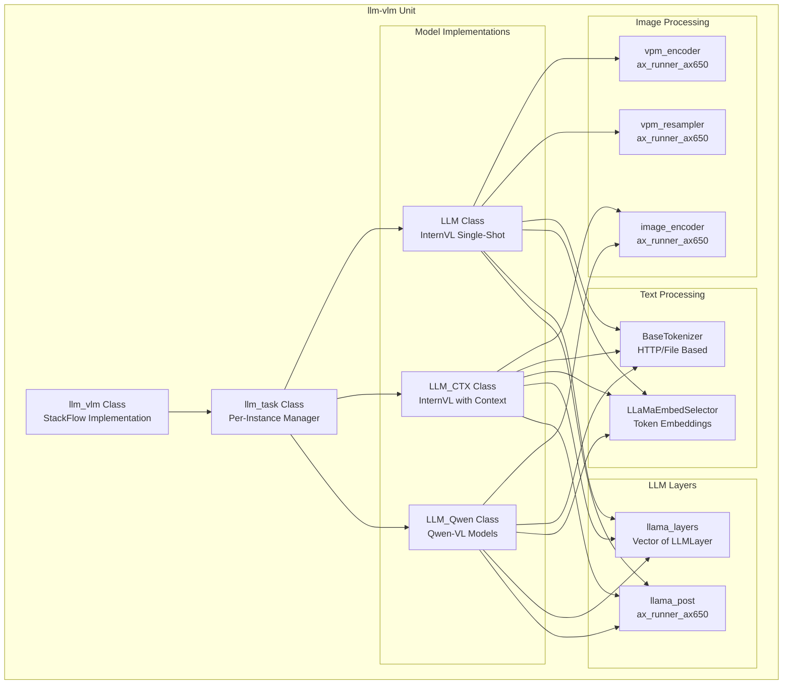

**Sources:** [projects/llm_framework/main_vlm/src/main.cpp:640-881](), [projects/llm_framework/main_vlm/src/runner/LLM.hpp:93-650]()

## Model Selection and Initialization

The unit automatically detects the model architecture based on the image encoder filename and instantiates the appropriate implementation:

| Model Type | Detection Pattern | Class | Context Support | Key Features |
|------------|------------------|-------|-----------------|--------------|
| **Qwen-VL** | `qwen3` in encoder name | `LLM_Qwen` | No | Video frames, temporal patches, spatial merging |
| **InternVL (Context)** | `internvl3` + `precompute_len > 0` | `LLM_CTX` | Yes | Multi-turn conversations, KV cache persistence |
| **InternVL (Single)** | `internvl3` or `vpm` in name | `LLM` | No | Single-shot inference, VPM two-stage option |

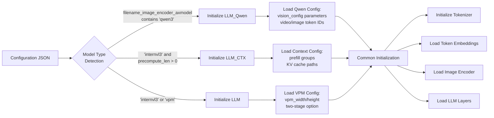

**Sources:** [projects/llm_framework/main_vlm/src/main.cpp:161-377](), [projects/llm_framework/main_vlm/src/main.cpp:286-298]()

The model selection logic in `llm_task::load_model`:

```cpp
// Extract encoder name and convert to lowercase for detection
std::string encoder_name = mode_config_.filename_image_encoder_axmodel;
std::transform(encoder_name.begin(), encoder_name.end(), encoder_name.begin(), ::tolower);

// Determine model type based on encoder filename
if (encoder_name.find("qwen3") != std::string::npos)
    model_type_ = ModelType::Qwen;
else if (encoder_name.find("internvl3") != std::string::npos && mode_config_.precompute_len > 0)
    model_type_ = ModelType::InternVL_CTX;
else if ((encoder_name.find("internvl3") != std::string::npos) || 
         (encoder_name.find("vpm") != std::string::npos))
    model_type_ = ModelType::InternVL;
```

**Sources:** [projects/llm_framework/main_vlm/src/main.cpp:286-298]()

## Image Encoding Pipeline

The VLM unit processes images through specialized NPU-accelerated encoders before fusing them with text tokens. The pipeline differs based on the model architecture.

### InternVL Image Encoding (LLM Class)

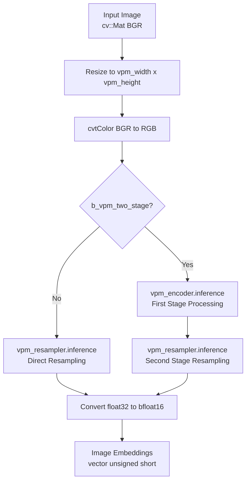

**Sources:** [projects/llm_framework/main_vlm/src/runner/LLM.hpp:303-336]()

### InternVL Context Image Encoding (LLM_CTX Class)

The context-aware variant uses a different image encoder that supports variable input formats:

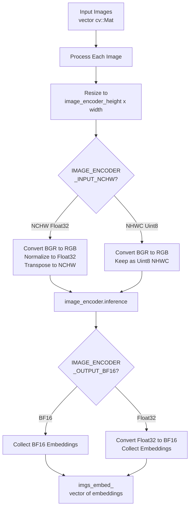

**Sources:** [projects/llm_framework/main_vlm/src/runner/LLM.hpp:1023-1158]()

### Qwen-VL Image/Video Encoding (LLM_Qwen Class)

Qwen models support both single images and video sequences with specialized processing:

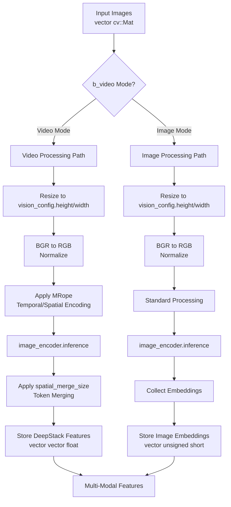

**Sources:** [projects/llm_framework/main_vlm/src/runner/LLM.hpp:1702-1954]()

## Multimodal Token Fusion

After encoding images, the unit fuses visual tokens with text tokens to create the final input sequence for the LLM layers.

### Token Fusion Process (LLM Class)

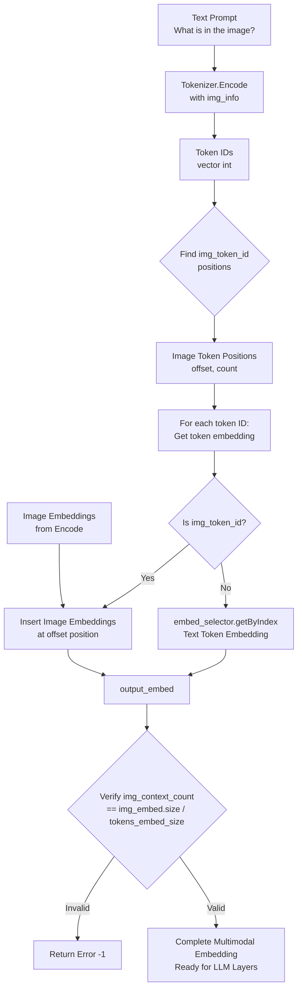

**Sources:** [projects/llm_framework/main_vlm/src/runner/LLM.hpp:356-403]()

The code that performs image token replacement in `LLM::Encode`:

```cpp
// Tokenize with image placeholder
ImageInfo img_info;
img_info.img_prompt = true;
img_info.num_img = 1;
img_info.imgsz = _attr.image_encoder_width;
std::vector<int> input_ids = tokenizer->Encode(prompt, img_info);

// Find image token positions
int offset = 0;
int img_context_count = 0;
for (size_t i = 0; i < input_ids.size(); i++) {
    if (input_ids[i] == _attr.img_token_id) {
        img_context_count++;
        if (img_context_count == 1) {
            offset = i;  // First image token position
        }
    }
}

// Replace image tokens with actual embeddings
for (size_t i = 0; i < input_ids.size(); i++) {
    embed_selector.getByIndex(input_ids[i], out_embed.data() + i * _attr.tokens_embed_size);
}
memcpy(out_embed.data() + offset * _attr.tokens_embed_size, 
       img_embed.data(),
       img_embed.size() * sizeof(unsigned short));
```

**Sources:** [projects/llm_framework/main_vlm/src/runner/LLM.hpp:356-403]()

### Context-Aware Token Fusion (LLM_CTX Class)

The context variant maintains conversation history and manages multiple image embeddings:

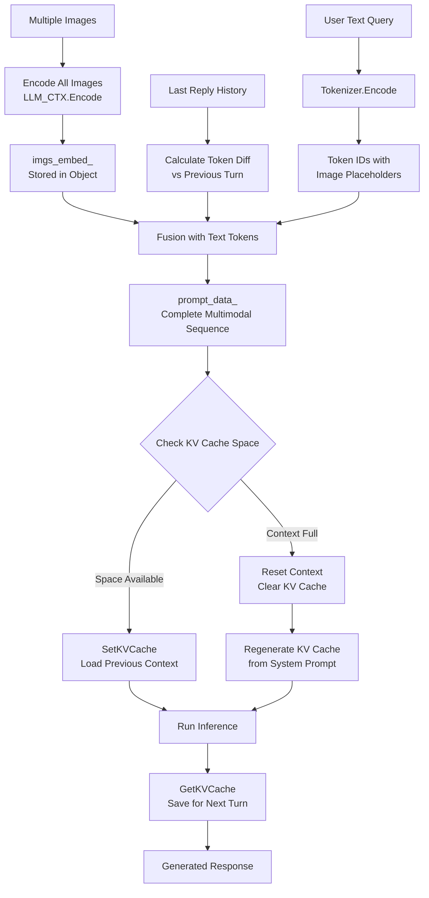

**Sources:** [projects/llm_framework/main_vlm/src/main.cpp:447-507](), [projects/llm_framework/main_vlm/src/runner/LLM.hpp:1159-1296]()

## Input Integration and Message Handling

The `llm-vlm` unit integrates with multiple input sources through the StackFlow messaging system.

### Input Source Types

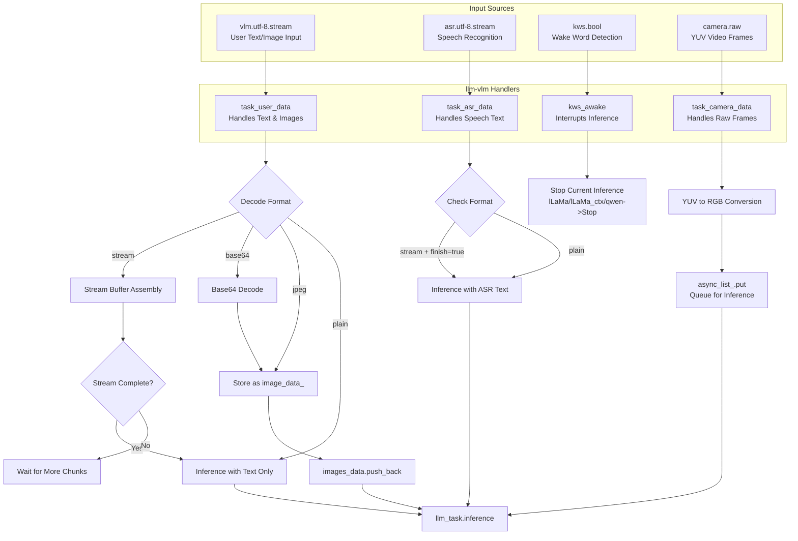

**Sources:** [projects/llm_framework/main_vlm/src/main.cpp:708-805]()

### Camera Integration

The unit can receive real-time camera frames for visual question answering:

```mermaid
graph LR
    SETUP[setup RPC Call] --> CHECK{input contains<br/>'camera'?}
    CHECK -->|Yes| SQL[unit_call sys.sql_select<br/>camera.out_port]
    CHECK -->|No| SKIP[Skip Camera Setup]
    
    SQL --> URL[Get Camera URL<br/>tcp://...]
    URL --> SUBSCRIBE[llm_channel.subscriber<br/>Subscribe to Camera]
    
    SUBSCRIBE --> FLAG[Set encamera_ = true]
    FLAG --> LAMBDA[Register Lambda Handler:<br/>task_camera_data]
    
    LAMBDA --> RUNTIME[Runtime Camera Processing]
    
    RUNTIME --> RECEIVE[Receive YUV Frame<br/>320x320x2 bytes]
    RECEIVE --> CONVERT[cv::cvtColor<br/>YUV2RGB_YUYV]
    CONVERT --> QUEUE[inference_async<br/>Queue Frame]
    
    QUEUE --> DISCARD{async_list_<br/>size > 1?}
    DISCARD -->|Yes| DROP[Discard Old Frame]
    DISCARD -->|No| STORE[Store Frame]
    
    DROP --> STORE
    STORE --> READY[Frame Ready for Inference]
```

**Sources:** [projects/llm_framework/main_vlm/src/main.cpp:856-868](), [projects/llm_framework/main_vlm/src/main.cpp:790-805](), [projects/llm_framework/main_vlm/src/main.cpp:403-412]()

## Context Management and KV Cache

The `LLM_CTX` and `LLM_Qwen` classes support multi-turn conversations through KV cache management. The context stores previous conversation state to enable efficient follow-up queries.

### KV Cache Architecture

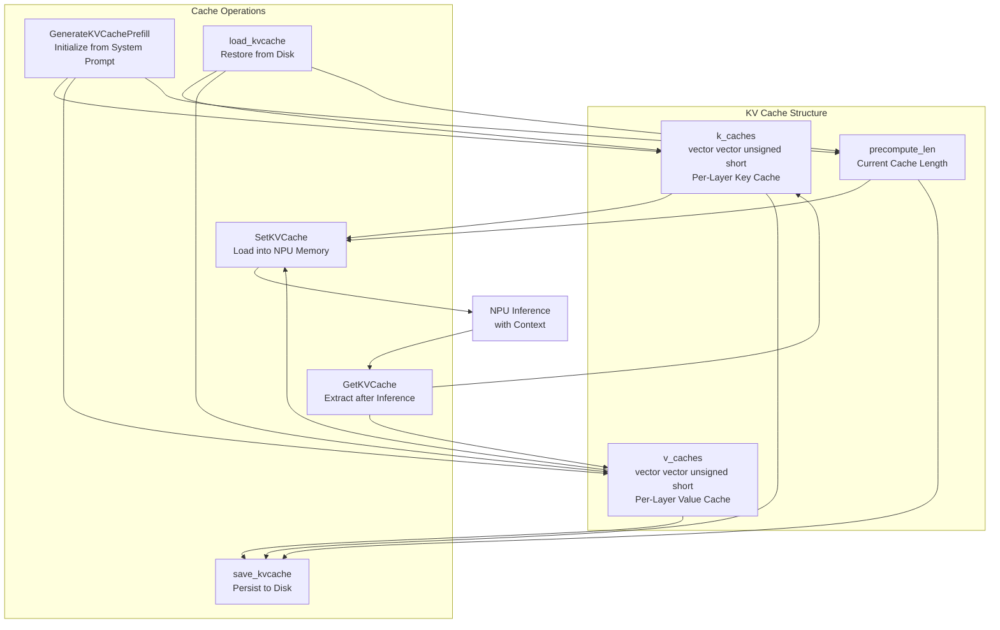

**Sources:** [projects/llm_framework/main_vlm/src/runner/LLM.hpp:881-1015](), [projects/llm_framework/main_vlm/src/runner/LLM.hpp:1052-1122]()

### Context Overflow Handling

When the conversation exceeds the maximum context length, the system automatically resets:

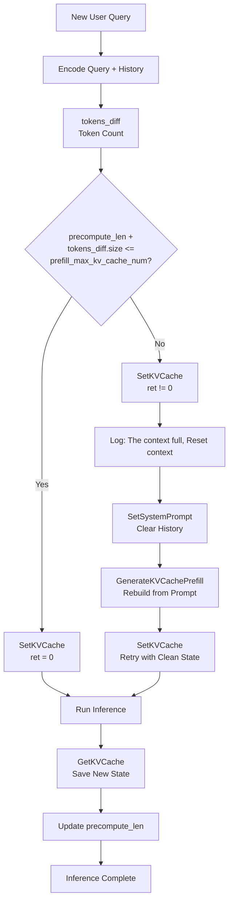

**Sources:** [projects/llm_framework/main_vlm/src/main.cpp:459-505](), [projects/llm_framework/main_vlm/src/main.cpp:495-500]()

The context overflow handling code in `llm_task::inference`:

```cpp
// Try to set KV cache with current context length
if (auto ret = lLaMa_ctx_->SetKVCache(k_caches, v_caches, precompute_len, tokens_diff.size());
    ret != 0) {
    ALOGW("The context full,Reset context");
    // Reset to system prompt
    lLaMa_ctx_->SetSystemPrompt(mode_config_.system_prompt, _token_ids);
    lLaMa_ctx_->GenerateKVCachePrefill(_token_ids, k_caches, v_caches, precompute_len);
    lLaMa_ctx_->SetKVCache(k_caches, v_caches, precompute_len, tokens_diff.size());
}
last_reply = lLaMa_ctx_->Run(prompt_data_);
lLaMa_ctx_->GetKVCache(k_caches, v_caches, precompute_len);
```

**Sources:** [projects/llm_framework/main_vlm/src/main.cpp:459-468]()

## Configuration Structure

The VLM unit configuration extends the base LLM configuration with vision-specific parameters:

| Parameter Group | Key Parameters | Purpose |
|----------------|----------------|---------|
| **Model Files** | `filename_image_encoder_axmodel`<br/>`filename_vpm_encoder_axmodel`<br/>`filename_vpm_resampler_axmodedl` | Image encoder model paths |
| **Vision Config** | `vpm_width`, `vpm_height`<br/>`image_encoder_width`, `image_encoder_height`<br/>`b_vpm_two_stage` | Image processing dimensions |
| **Token IDs** | `img_token_id`<br/>`IMAGE_CONTEXT_TOKEN`<br/>`IMAGE_START_TOKEN` | Special token identifiers |
| **Qwen Config** | `vision_config.temporal_patch_size`<br/>`vision_config.spatial_merge_size`<br/>`vision_config.tokens_per_second`<br/>`vision_config.fps` | Video processing parameters |
| **Context Config** | `precompute_len`<br/>`prefill_max_kv_cache_num_grp`<br/>`prefill_max_token_num` | Context management settings |
| **Input/Output** | `input` (array of sources)<br/>`response_format`<br/>`enoutput`, `enstream` | I/O configuration |

**Sources:** [projects/llm_framework/main_vlm/src/main.cpp:161-377](), [projects/llm_framework/main_vlm/src/runner/LLM.hpp:27-91]()

### Configuration Example

A typical VLM configuration JSON structure:

```json
{
  "model": "internvl2-5-2b-awq-int4",
  "response_format": "vlm.utf-8.stream",
  "enoutput": true,
  "prompt": "You are a helpful AI assistant.",
  "input": ["vlm.utf-8.stream", "asr.utf-8.stream", "kws.bool"],
  "mode_param": {
    "filename_image_encoder_axmodel": "internvl2-5-2b-awq-int4/image_encoder.axmodel",
    "filename_tokens_embed": "internvl2-5-2b-awq-int4/embed_tokens.bin",
    "template_filename_axmodel": "internvl2-5-2b-awq-int4/llm_l%d.axmodel",
    "filename_post_axmodel": "internvl2-5-2b-awq-int4/llm_post.axmodel",
    "tokenizer_type": 5,
    "url_tokenizer_model": "http://localhost:8090",
    "img_token_id": 151667,
    "axmodel_num": 20,
    "tokens_embed_size": 2048,
    "max_token_len": 512,
    "precompute_len": 128,
    "enable_temperature": true,
    "temperature": 0.7
  }
}
```

**Sources:** [projects/llm_framework/main_vlm/src/main.cpp:161-377]()

## LLM Layer Inference Pipeline

The core text generation follows a two-phase process: prefill and decode.

### Prefill Phase (Multi-Token Processing)

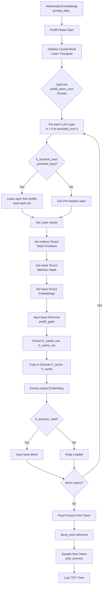

**Sources:** [projects/llm_framework/main_vlm/src/runner/LLM.hpp:442-525]()

### Decode Phase (Single-Token Auto-Regressive)

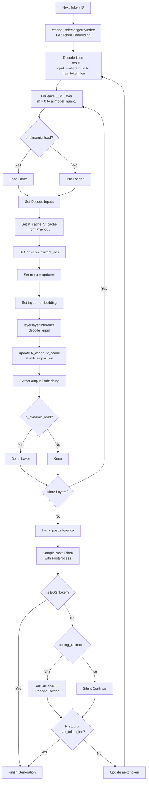

**Sources:** [projects/llm_framework/main_vlm/src/runner/LLM.hpp:529-640]()

## Tokenizer Management

The VLM unit supports multiple tokenizer types, including HTTP-based tokenizers for models requiring external processing.

### Tokenizer Initialization

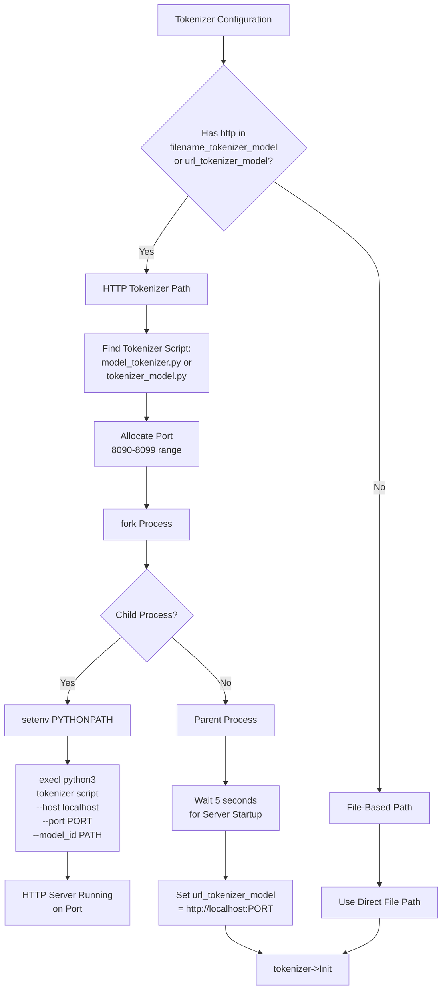

**Sources:** [projects/llm_framework/main_vlm/src/main.cpp:233-284]()

The tokenizer server process is managed by the `llm_task` object:

```cpp
// Static port allocation across tasks
static std::atomic<unsigned int> next_port_{8090};
unsigned int port_;
pid_t tokenizer_pid_ = -1;

// Find appropriate tokenizer script
auto find_tokenizer_file = [this]() -> std::string {
    const std::string base = "/opt/m5stack/scripts/";
    const std::string a = base + model_ + "_tokenizer.py";
    if (file_exists(a)) return a;
    const std::string b = base + "tokenizer_" + model_ + ".py";
    if (file_exists(b)) return b;
    return {};
};

// Fork and execute tokenizer server
tokenizer_pid_ = fork();
if (tokenizer_pid_ == 0) {
    setenv("PYTHONPATH", "/opt/m5stack/lib/vlm/site-packages", 1);
    const std::string port_str = std::to_string(port_);
    const std::string model_id = base_model + "tokenizer";
    
    execl("/usr/bin/python3", "python3", tokenizer_file.c_str(), 
          "--host", "localhost", "--port", port_str.c_str(), 
          "--model_id", model_id.c_str(), "--content", prompt_.c_str(),
          (char *)nullptr);
}
```

**Sources:** [projects/llm_framework/main_vlm/src/main.cpp:245-266](), [projects/llm_framework/main_vlm/src/main.cpp:49-56]()

## Output Streaming

The unit supports both streaming and non-streaming response modes, controlled by the `response_format` parameter.

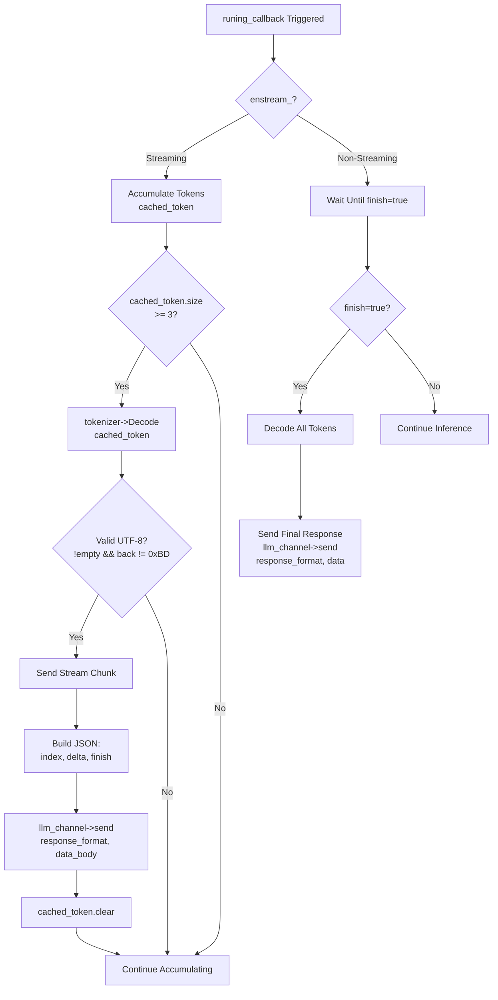

**Sources:** [projects/llm_framework/main_vlm/src/main.cpp:651-677](), [projects/llm_framework/main_vlm/src/runner/LLM.hpp:621-633]()

The streaming logic in `llm_vlm::task_output`:

```cpp
void task_output(const std::weak_ptr<llm_task> llm_task_obj_weak,
                 const std::weak_ptr<llm_channel_obj> llm_channel_weak, 
                 const std::string &data, bool finish)
{
    auto llm_task_obj = llm_task_obj_weak.lock();
    auto llm_channel  = llm_channel_weak.lock();
    if (!(llm_task_obj && llm_channel)) return;
    
    if (llm_channel->enstream_) {
        static int count = 0;
        nlohmann::json data_body;
        data_body["index"] = count++;
        data_body["delta"] = data;
        if (!finish)
            data_body["delta"] = data;
        else
            data_body["delta"] = std::string("");
        data_body["finish"] = finish;
        if (finish) count = 0;
        llm_channel->send(llm_task_obj->response_format_, data_body, LLM_NO_ERROR);
    } else if (finish) {
        llm_channel->send(llm_task_obj->response_format_, data, LLM_NO_ERROR);
    }
}
```

**Sources:** [projects/llm_framework/main_vlm/src/main.cpp:651-677]()

## Task Lifecycle and RPC Functions

The `llm_vlm` class implements standard StackFlow RPC functions for task management:

| RPC Function | Purpose | Key Operations |
|--------------|---------|----------------|
| **setup** | Initialize new VLM task | Parse config, detect model type, load model, setup input subscriptions |
| **work** | Start inference (not used) | N/A - inference triggered by input messages |
| **pause** | Stop current inference | Call `Stop()` on active model instance |
| **exit** | Destroy task | Stop inference, unsubscribe channels, deallocate resources |
| **link** | Add input source | Subscribe to additional data streams dynamically |
| **unlink** | Remove input source | Unsubscribe from data stream, remove from inputs list |
| **taskinfo** | Query task details | Return model name, inputs, output format, task list |

**Sources:** [projects/llm_framework/main_vlm/src/main.cpp:807-932]()

### Setup Flow

```mermaid
graph TD
    SETUP_REQ[setup RPC Request] --> PARSE_JSON[Parse JSON Config]
    PARSE_JSON --> TASK_LIMIT{Task Count<br/>< task_count_?}
    
    TASK_LIMIT -->|No| ERROR_FULL[Return Error -21<br/>task full]
    TASK_LIMIT -->|Yes| CREATE[Create llm_task<br/>with work_id]
    
    CREATE --> LOAD[llm_task.load_model<br/>config_body]
    
    LOAD --> MODEL_CHECK{Load Success?}
    MODEL_CHECK -->|No| ERROR_LOAD[Return Error -5<br/>Model loading failed]
    MODEL_CHECK -->|Yes| SET_FLAGS[Set enoutput_, enstream_]
    
    SET_FLAGS --> BIND_CB[Bind task_output Callback]
    BIND_CB --> INPUT_LOOP[For each input in inputs_]
    
    INPUT_LOOP --> INPUT_TYPE{Input Type?}
    
    INPUT_TYPE -->|"vlm"| SUB_VLM[Subscribe to vlm.utf-8.stream<br/>task_user_data handler]
    INPUT_TYPE -->|"asr"| SUB_ASR[Subscribe to asr.utf-8.stream<br/>task_asr_data handler]
    INPUT_TYPE -->|"kws"| SUB_KWS[Subscribe to kws.bool<br/>kws_awake handler]
    INPUT_TYPE -->|"camera"| CAMERA_SETUP[Query camera.out_port<br/>Subscribe to raw stream<br/>task_camera_data handler]
    
    SUB_VLM --> STORE_TASK
    SUB_ASR --> STORE_TASK
    SUB_KWS --> STORE_TASK
    CAMERA_SETUP --> STORE_TASK
    
    STORE_TASK[llm_task_[work_id_num] = llm_task_obj] --> SUCCESS[Return LLM_NO_ERROR]
```

**Sources:** [projects/llm_framework/main_vlm/src/main.cpp:807-881]()

## Performance Considerations

### Dynamic Layer Loading

The VLM unit supports dynamic layer loading to reduce memory usage:

- **Static Loading** (`b_dynamic_load_axmodel_layer = false`): All LLM layers loaded at initialization, faster inference but higher memory
- **Dynamic Loading** (`b_dynamic_load_axmodel_layer = true`): Layers loaded/unloaded per inference pass, slower but memory efficient

When dynamic loading is enabled, each layer is loaded from buffer/file before inference and deallocated after:

```cpp
if (_attr.b_dynamic_load_axmodel_layer) {
    int ret;
    if (_attr.b_use_mmap_load_layer) {
        ret = layer.layer.init((char *)layer.layer_buffer.data(), layer.layer_buffer.size());
    } else {
        ret = layer.layer.init(layer.layer_buffer_vec.data(), layer.layer_buffer_vec.size());
    }
}
// ... perform inference ...
if (_attr.b_dynamic_load_axmodel_layer) {
    layer.layer.deinit();
}
```

**Sources:** [projects/llm_framework/main_vlm/src/runner/LLM.hpp:450-460](), [projects/llm_framework/main_vlm/src/runner/LLM.hpp:494-496]()

### Memory-Mapped Embedding Loading

Token embeddings can be loaded via memory mapping for reduced memory footprint:

- **`b_use_mmap_load_embed = true`**: Uses `mmap()` to map embedding file, no RAM copy
- **`b_use_mmap_load_embed = false`**: Loads embeddings into RAM buffer

**Sources:** [projects/llm_framework/main_vlm/src/runner/LLM.hpp:143-148]()

### Prefill Group Selection

The context-aware model uses multiple prefill groups to handle variable-length inputs efficiently:

```cpp
// Select appropriate prefill group based on input length
int prefill_grpid = _attr.prefill_max_kv_cache_num_grp.size();
for (size_t i = 0; i < _attr.prefill_max_kv_cache_num_grp.size(); i++) {
    if (input_embed_num <= _attr.prefill_max_kv_cache_num_grp[i]) {
        prefill_grpid = i + 1;
        break;
    }
}
```

Smaller groups (lower `prefill_grpid`) use less memory but support fewer tokens, enabling memory/performance tradeoffs.

**Sources:** [projects/llm_framework/main_vlm/src/runner/LLM.hpp:892-900]()